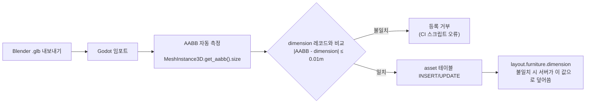

# Asset 레지스트리 명세 (asset-registry.md)

**문서 버전**: 1.0  
**작성일**: 2026-07-02  
**담당**: 3d-engine-specialist  
**태스크**: P0-T0.5 — 3D 씬 구조 및 asset 레지스트리 설계  
**참조**: 00-decisions.md(D8), 07-3d-visual-asset-pipeline.md(§5.3 정본), 05-office-layout-schema.md(§5.1·§3.4)

> 이 문서는 00-decisions.md의 정본 결정을 따른다. 충돌 시 00-decisions.md가 이긴다.  
> asset 테이블 스키마의 정본은 **07-3d-visual-asset-pipeline.md §5.3**이다. 이 문서는 그 정본을 기반으로 운영 규칙을 보완한다.

---

## 1. asset 테이블 스키마 (07 §5.3 정본 기준)

### 1.1 DDL

```sql
-- @TASK P0-T0.5
-- @SPEC docs/planning/07-3d-visual-asset-pipeline.md#5.3
CREATE TABLE asset (
  -- ===== 식별자 =====
  asset_id          VARCHAR(64)  PRIMARY KEY,
    -- 형식: {type}-{name}-v{major}.{minor} (§2 명명 규칙 참조)
    -- 예: "furniture-desk-standard-v1.0", "structure-brand-wall-v1.0"

  asset_name        VARCHAR(256) NOT NULL,
    -- 사람이 읽을 수 있는 표시명. 예: "Standard Desk"

  asset_type        VARCHAR(50)  NOT NULL,
    -- "furniture" | "structure" | "material" | "ui3d" | "character" | "environment"

  category          VARCHAR(100),
    -- 공간 카테고리. "lobby" | "office" | "meeting-room" | "lounge" | "focus" | "phonebooth" | "avatar" | "ui"

  -- ===== 출처 & 라이선스 =====
  source_url        TEXT,
    -- 원본 다운로드 URL. CC0/CC-BY 소스 기록용

  author            VARCHAR(256),
    -- 제작자/출처. 예: "Poly Haven", "ambientCG", "in-house"

  license           VARCHAR(100) NOT NULL,
    -- "CC0" | "CC-BY-4.0" | "custom" | "proprietary"

  license_url       TEXT,
    -- 라이선스 문서 URL

  downloaded_at     TIMESTAMPTZ,
    -- 최초 취득 일시 (UTC 저장, D19)

  modified_by       VARCHAR(256),
    -- 가공/적용 담당자

  -- ===== 상업적 사용 정책 =====
  commercial_allowed     BOOLEAN NOT NULL DEFAULT TRUE,
    -- 상업 프로젝트 사용 가능 여부 (CC-NC 사용 시 FALSE)

  attribution_required   BOOLEAN NOT NULL DEFAULT FALSE,
    -- 저작자 표시 필수 여부 (CC-BY 계열은 TRUE)

  redistribution_allowed BOOLEAN NOT NULL DEFAULT TRUE,
    -- 수정 후 재배포 가능 여부 (CC-ND는 FALSE)

  -- ===== 파일 해시 (무결성 검증) =====
  original_file_hash     VARCHAR(64),
    -- SHA-256 of raw download (소스 .blend/.fbx/.glb)

  optimized_file_hash    VARCHAR(64),
    -- SHA-256 of 임포트 소스 .glb (Draco 없는 원본)

  -- ===== 배포 경로 (D8) =====
  tscn_path         VARCHAR(256) NOT NULL,
    -- 클라이언트 pak 동봉 경로 (배포 산출물)
    -- 규약: res://assets/3d/models/{slug}/{slug}.tscn
    -- 05 ASSET_CATALOG의 값과 동일해야 함

  source_glb_path   VARCHAR(256),
    -- 임포트 소스 glb 저장소 경로 (pak 미포함)
    -- 규약: assets/3d/models/{slug}/raw/{slug}_v{major}.{minor}.glb

  file_size_bytes   BIGINT,
    -- 임포트 산출물(.tscn + 캐시) 크기. CDN 없음(D8), 성능 예산 참고용

  -- ===== 기하학 정보 =====
  polygon_count     INTEGER,
    -- LOD 0 삼각형 수 (정본). 05 §1.2.13 성능 파생 계산의 소스

  texture_resolution VARCHAR(20),
    -- 예: "2048x2048", "1024x1024", "512x512"

  -- ===== 편집기·배치 메타 (05 §3.4 정합) =====
  dimension         JSONB,
    -- 실측 크기 {"width": float, "depth": float, "height": float} (미터 단위)
    -- 정본. layout JSON furniture.dimension은 표시용 캐시이며 불일치 시 이 값이 우선
    -- 허용 오차 ±1cm (임포트 AABB 측정값 일치 검증 필수)

  footprint_2d      JSONB,
    -- 편집기 도면용 2D 풋프린트 {"width": float, "depth": float} (미터)
    -- 웹 편집기 Konva.js에서 가구 배치 시 사용

  thumbnail_url     TEXT,
    -- 편집기 팔레트 썸네일 경로
    -- 규약: res://assets/3d/models/{slug}/thumb.png

  -- ===== 씬 사용 현황 =====
  used_in_scene     JSONB,
    -- 배치된 씬 목록. 예: ["stage1_lobby", "stage1_office"]

  -- ===== 의존성 =====
  external_dependencies TEXT,
    -- 이 에셋이 의존하는 다른 asset_id 또는 머티리얼 경로

  -- ===== 메모 =====
  notes             TEXT,
    -- 커스텀 메타데이터, 사용 주의사항

  -- ===== 타임스탬프 =====
  created_at        TIMESTAMPTZ NOT NULL DEFAULT NOW(),
  updated_at        TIMESTAMPTZ NOT NULL DEFAULT NOW(),
  deleted_at        TIMESTAMPTZ            -- Soft delete
);

-- 인덱스
CREATE INDEX idx_asset_type     ON asset(asset_type);
CREATE INDEX idx_asset_category ON asset(category);
CREATE INDEX idx_asset_license  ON asset(license);
CREATE INDEX idx_asset_deleted  ON asset(deleted_at) WHERE deleted_at IS NULL;
```

### 1.2 주요 컬럼 설명 요약

| 컬럼 | 타입 | 역할 |
|------|------|------|
| `asset_id` | VARCHAR(64) PK | 고유 식별자, layout JSON `furniture.asset_id`와 1:1 대응 |
| `tscn_path` | VARCHAR(256) | 클라이언트 pak 내 `.tscn` 경로(05 ASSET_CATALOG 값) |
| `source_glb_path` | VARCHAR(256) | 저장소 보관 소스 glb (pak 미포함, D8) |
| `polygon_count` | INTEGER | LOD 0 삼각형 수, 성능 파생 계산의 정본(05 §1.2.13) |
| `dimension` | JSONB | 실측 AABB 크기, 좌석↔가구 좌표 정합의 정본(05 §3.2) |
| `footprint_2d` | JSONB | 편집기 Konva.js 가구 배치용 2D 크기 |
| `thumbnail_url` | TEXT | 편집기 팔레트 썸네일 |
| `commercial_allowed` | BOOLEAN | CC-NC 등 비상업 에셋 필터링 |
| `attribution_required` | BOOLEAN | CC-BY 표기 의무 여부 |

---

## 2. 에셋 ID 명명 규칙

### 2.1 형식

```
{type}-{name}-v{major}.{minor}
```

| 세그먼트 | 규칙 | 예시 |
|---------|------|------|
| `type` | asset_type의 약칭(소문자) | `furniture`, `structure`, `char`, `ui3d`, `mat`, `env` |
| `name` | 에셋 식별 이름(소문자, 하이픈 구분자) | `desk-standard`, `brand-wall`, `sofa-3seat` |
| `v{major}.{minor}` | 시맨틱 버전. 외형·크기 변경 시 올림 | `v1.0`, `v1.1`, `v2.0` |

### 2.2 예시

| asset_id | 설명 |
|----------|------|
| `furniture-desk-standard-v1.0` | 표준 업무용 책상 초판 |
| `furniture-desk-standard-v1.1` | 텍스처 업데이트(경미한 변경) |
| `furniture-desk-standard-v2.0` | 형상 변경(layout 마이그레이션 필요) |
| `structure-brand-wall-v1.0` | 로비 브랜드월 |
| `structure-meeting-glass-set-v1.0` | 회의실 유리재질·문짝·화이트보드 세트 |
| `furniture-sofa-3seat-v1.0` | 라운지 3인 소파 |
| `char-avatar-base-male-v1.0` | 남성 기본 아바타 |
| `ui3d-status-badge-v1.0` | 아바타 상태 뱃지 |
| `env-hdri-indoor-office-v1.0` | 실내 HDRI 스카이박스 |
| `mat-wood-floor-006-v1.0` | ambientCG 목재 바닥 PBR 재질 |

### 2.3 버전 관리 규칙

- **minor 업데이트** (`v1.0 → v1.1`): 텍스처 교체, 폴리곤 최적화. `tscn_path` 파일명 불변, 내용만 교체. layout 수정 불필요.
- **major 업데이트** (`v1.0 → v2.0`): 형상 변경, dimension 변경(±1cm 초과). 새 `asset_id` 부여. layout의 `furniture.asset_id` 마이그레이션 필요.
- **파일명은 고정**: `.tscn` 파일명은 slug 기준 고정(`desk_standard.tscn`). 버전은 `asset` 테이블과 `CHANGELOG.md`로만 관리한다(07 §5.1 §14 규약).

---

## 3. 에셋 전달 파이프라인 (D8)

### 3.1 파이프라인 요약 (D8 기준)

```
1. 소스 취득 (CC0/CC-BY 검수)
        ↓
2. Blender 가공 → raw/*.glb 저장 (Draco 압축 없음)
        ↓
3. Godot 임포트 최적화
   - VRAM BC 압축 (BC1/BC3/BC5)
   - 자동 LOD 생성
        ↓
4. 임포트 완료본 .tscn 생성
        ↓
5. asset 테이블 등록 (dimension AABB 검증 필수)
        ↓
6. 클라이언트 빌드(pak) 동봉 → 배포
        ↓
7. 신규/갱신 에셋 → 클라이언트 자동 업데이트 채널
```

**금지 사항 (D8)**
- Draco 압축 glb 사용 — Godot 4 임포트 실패
- gltfpack/meshopt 압축 — 동일 이유
- 런타임 glb CDN 다운로드 — pak 동봉만 허용
- WebP/Basis Universal — WASM export 미사용(D11)으로 불필요

### 3.2 파일 구조 규약

```
assets/3d/models/{slug}/
  ├── {slug}.tscn          # 배포 산출물 (pak 동봉). 파일명 고정
  ├── raw/
  │   └── {slug}_v1.0.glb  # 임포트 소스 (저장소 보관, pak 미포함)
  ├── thumb.png             # 편집기 팔레트 썸네일 (128×128px 이상)
  ├── textures/
  │   ├── {slug}_albedo.png
  │   ├── {slug}_normal.png
  │   └── {slug}_roughness.png
  ├── METADATA.json         # asset 테이블 레코드 미러 (CI 동기화용)
  └── CHANGELOG.md
```

---

## 4. 카탈로그 버저닝 및 배포 채널 (D8)

### 4.1 클라이언트 pak 동봉

- 에셋 카탈로그는 **클라이언트 빌드에 포함**된다. 런타임에 서버에서 다운로드하지 않는다.
- layout JSON은 `asset_id`만 참조한다. 클라이언트의 `ASSET_CATALOG` 딕셔너리가 `asset_id → tscn_path`를 매핑한다.

```gdscript
# 05 §5.1 — 클라이언트 동봉 카탈로그
const ASSET_CATALOG := {
  "furniture-desk-standard-v1.0":  "res://assets/3d/models/desk_standard/desk_standard.tscn",
  "furniture-sofa-3seat-v1.0":     "res://assets/3d/models/sofa_3seat/sofa_3seat.tscn",
  "structure-brand-wall-v1.0":     "res://assets/3d/models/brand_wall/brand_wall.tscn",
  # ...
}
```

### 4.2 자동 업데이트 채널

신규 에셋 추가 또는 기존 에셋 갱신(minor 업데이트) 시:
1. Git 태그 `asset/{slug}-v{major}.{minor}` 발행
2. 클라이언트 자동 업데이트 채널(Godot 내장 업데이터)이 신규 빌드 감지
3. 클라이언트 재시작 시 새 pak 적용

major 업데이트(asset_id 신규 발행)는 관리자가 해당 layout의 `furniture.asset_id`를 업데이트 후 재배포한다.

### 4.3 schema_version 호환성

layout `schema_version`과 마찬가지로, 클라이언트 `ASSET_CATALOG`에 없는 `asset_id`를 layout이 참조하면:
- FastAPI 서버 검증 단계(05 §3.4 에셋 존재 검증)에서 **ERROR**로 차단 — 배포 불가
- 해결책: 클라이언트 자동 업데이트 채널로 신규 에셋을 먼저 배포 후 layout 배포

---

## 5. 라이선스 정책

### 5.1 허용/금지 등급

```
CC0 (최우선) > CC-BY (제한적) >> [금지선] >> CC-NC / CC-SA / CC-ND / All Rights Reserved
```

| 라이선스 | 허용 여부 | 근거 |
|---------|---------|------|
| **CC0** (퍼블릭 도메인) | 허용 | 제약 없음. ambientCG, Poly Haven, Kenney |
| **CC-BY 4.0** (저작자 표시) | 제한적 허용 | Sketchfab 등 개별 검수 후. THIRD_PARTY_LICENSES.md 기재 필수 |
| **Proprietary (구매)** | 허용 | 라이선스 범위 문서화 필수 |
| **CC-BY-SA** (ShareAlike) | **금지** | 파생물 전체에 동일 라이선스 전염(카피레프트). pak 배포 오염 |
| **CC-NC** (비상업) | **금지** | 사내 운영이라도 상업 해석 모호, 리스크 |
| **CC-ND** (수정금지) | **금지** | Godot 임포트(VRAM 압축·LOD) 자체가 수정에 해당 |
| **Editorial Only** | **금지** | B2B 확장 시 위험 |
| **All Rights Reserved** | **금지** | 라이선스 불명확, 검수 불가 |

> **D8 추가 제약**: CC-SA/ShareAlike는 클라이언트 pak 동봉 배포 시 전체 에셋에 동일 라이선스를 요구하므로 **원칙상 배제**한다(07 §2.1과 정합).

### 5.2 CC-BY 에셋 검수 프로세스

```
1. 모델 선정 → 라이선스 문서 URL 기록
2. commercial_allowed / attribution_required / redistribution_allowed 확인
3. THIRD_PARTY_LICENSES.md에 추가 (포맷: §5.3)
4. asset 테이블 license* 컬럼 기입
5. 저자에게 이메일 확인 필요 시 진행
6. 로컬 테스트 후 등록 확정
```

### 5.3 THIRD_PARTY_LICENSES.md 포맷

```markdown
# Third-Party Licenses

## CC0 (Public Domain)

### ambientCG
- Material: Wood_Floor_006 (https://ambientcg.com/...)
- License: CC0 1.0 Public Domain

### Poly Haven
- HDRI: kloppenheim_06_puresky_4k (https://polyhaven.com/...)
- License: CC0 1.0 Public Domain

## CC-BY (Attribution Required)

### Sketchfab
- Model: "Office Chair" by John Doe (https://sketchfab.com/...)
- License: CC-BY 4.0
- Attribution: "Office Chair" by John Doe, licensed under CC-BY 4.0
  Changes: Exported to .glb, VRAM BC 압축, LOD 생성

## Excluded
- CC-SA / CC-BY-SA: 미사용 (카피레프트 전염)
- CC-NC: 미사용 (상업 해석 모호)
```

---

## 6. 예시 레코드

### 6.1 표준 책상 (CC0)

```json
{
  "asset_id": "furniture-desk-standard-v1.0",
  "asset_name": "Standard Desk",
  "asset_type": "furniture",
  "category": "office",
  "source_url": "https://polyhaven.com/a/office_desk",
  "author": "Poly Haven",
  "license": "CC0",
  "license_url": "https://polyhaven.com/license",
  "downloaded_at": "2026-07-02T09:00:00Z",
  "modified_by": "3d-engine-specialist",
  "commercial_allowed": true,
  "attribution_required": false,
  "redistribution_allowed": true,
  "original_file_hash": "a1b2c3d4...",
  "optimized_file_hash": "f6e5d4c3...",
  "tscn_path": "res://assets/3d/models/desk_standard/desk_standard.tscn",
  "source_glb_path": "assets/3d/models/desk_standard/raw/desk_standard_v1.0.glb",
  "file_size_bytes": 2621440,
  "polygon_count": 18000,
  "texture_resolution": "1024x1024",
  "dimension": { "width": 1.5, "depth": 0.8, "height": 0.75 },
  "footprint_2d": { "width": 1.5, "depth": 0.8 },
  "thumbnail_url": "res://assets/3d/models/desk_standard/thumb.png",
  "used_in_scene": ["stage1_office"],
  "external_dependencies": "mat-wood-floor-006-v1.0",
  "notes": "표준 오피스 책상. 좌석(S_*)의 furniture_id가 참조함.",
  "created_at": "2026-07-02T10:00:00Z",
  "updated_at": "2026-07-02T10:00:00Z",
  "deleted_at": null
}
```

### 6.2 브랜드월 (자체 제작)

```json
{
  "asset_id": "structure-brand-wall-v1.0",
  "asset_name": "Brand Wall",
  "asset_type": "structure",
  "category": "lobby",
  "source_url": null,
  "author": "in-house",
  "license": "proprietary",
  "license_url": null,
  "downloaded_at": null,
  "modified_by": "3d-engine-specialist",
  "commercial_allowed": true,
  "attribution_required": false,
  "redistribution_allowed": false,
  "tscn_path": "res://assets/3d/models/brand_wall/brand_wall.tscn",
  "source_glb_path": "assets/3d/models/brand_wall/raw/brand_wall_v1.0.glb",
  "file_size_bytes": 5242880,
  "polygon_count": 4200,
  "texture_resolution": "2048x2048",
  "dimension": { "width": 4.0, "depth": 0.2, "height": 2.5 },
  "footprint_2d": { "width": 4.0, "depth": 0.2 },
  "thumbnail_url": "res://assets/3d/models/brand_wall/thumb.png",
  "used_in_scene": ["stage1_lobby"],
  "notes": "회사 로고 텍스처 포함. 자체 제작."
}
```

---

## 7. dimension 일치 검증 규칙

임포트 시 Godot이 측정한 **AABB**(축정렬 바운딩 박스) 크기와 asset 테이블 `dimension`이 **±1cm 이내**여야 한다.



---

## 8. 변경 이력

| 버전 | 일자 | 변경 내용 |
|------|------|----------|
| 1.0 | 2026-07-02 | P0-T0.5 초안 — 07 §5.3 정본 기준, D8 파이프라인 명시, CC-SA 배제, 명명 규칙 |
