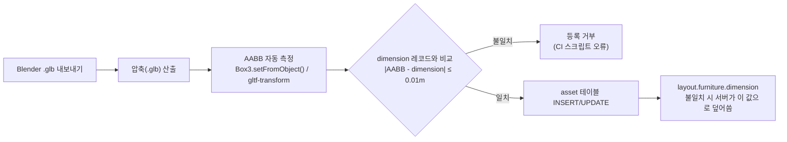

# Asset 레지스트리 명세 (asset-registry.md)

> 🔵 **D28 피벗(2026-07-09) — 배포 산출물 정정.** 배경 = Blender 오프라인 렌더(`office_bg.png`·`office_depth.png`) 전제는 **폐기**. D28에선 **배경도 실시간 `.glb`**(씬 지오메트리)로 로드한다 → 산출물 = **씬 glb + 아바타/소품 glb**(모두 런타임 로드), `office_depth.png`·깊이합성 산출물 불필요. asset 스키마의 `gltf_path`는 유효, "배경 렌더 이미지" 필드 전제는 무효. 정본 = **00-decisions §I(D28)**.

> 🟣 **v8.0 런타임 레지스트리(2026-07-10, D28.1).** 실제 런타임 자산 정본 = **`05_registries/asset-registry-v8.json`**(`docs/virtual_office_final_dev_complete_v8_0/`). 씬=`SCENE_ACME_HQ_HERO_V4_001.glb`, 캐릭터=`characters_rigged_v8/*.glb`(스킨+애니 12클립 내장 · 18본 휴머노이드 · pivot BOTTOM_CENTER · up-axis Z). 상세 = 00-decisions §I(D28.1).

> 🟪 **v10.0 런타임 레지스트리(2026-07-11, D28.2).** 실제 런타임 자산 정본 = **`05_registries/asset-registry-v10.json`**(`docs/virtual_office_complete_product_v10_0/`, 137 에셋). 씬=`scenes_pbr_v10/SCENE_ACME_HQ_HERO_V4_001.glb`(PBR 내장), 캐릭터=`models_pbr_v10/characters_rigged/*.glb`(동일 V8 rig, PBR 텍스처 내장). pivot BOTTOM_CENTER·up-axis Z 유지. 상세 = 00-decisions §I(D28.2).

> 🟢 **D27 반영(2026-07-09 재작성) — 포토리얼 웹 임베드(three.js/R3F) 노선 정본.** D26(WorkAdventure 2D)+Godot 노선은 모두 폐기(D27). 이 문서는 그 전환을 반영해 재작성되었다.
> **배포 산출물**: 배경 = Blender Cycles **오프라인 렌더 산출물**(`office_bg.png` · `office_depth.png` · `camera.json`, 층·레이아웃 버전별). 아바타·소품 = 경량 **GLTF**(`.glb`, 런타임 로드).
> **웹 최적 포맷**: GLTF + Draco/meshopt + KTX2/Basis(three.js/R3F 웹 표준 권장). Godot .tscn/.pak 동봉·ASSET_CATALOG GDScript·압축금지 정책은 모두 폐기됐다.
> 현행 정본: 00-decisions §H(D27) · 14-virtual-office-spec · 15-realtime-server-spec · 16-render-spike-and-roadmap · 3d-design/{design-style-analysis, photoreal-web-strategy} · 05-office-layout-schema.md.

**문서 버전**: 2.0  
**작성일**: 2026-07-02  
**갱신일**: 2026-07-09 (D27 재작성)  
**담당**: 3d-engine-specialist  
**태스크**: P0-T0.5 — 3D 씬 구조 및 asset 레지스트리 설계  
**참조**: 00-decisions.md(§H D27), photoreal-web-strategy(§1 아바타 소스), 05-office-layout-schema.md(§5.1·§3.4 asset_id 규약 정본)

> 이 문서는 00-decisions.md의 정본 결정을 따른다. 충돌 시 00-decisions.md가 이긴다.  
> `asset_id` 명명 규약의 정본은 **05-office-layout-schema.md**의 샘플 JSON(예 `DESK_STANDARD_001`)이다. 이 문서는 그 정본을 기반으로 운영 규칙을 보완한다.

---

## 1. asset 테이블 스키마 (05 정본 정합)

> **정본(SoT) 지위 — 2026-07-09 교차감사 확정**: 아래 **§1.1 DDL이 asset 테이블 스키마의 정본**이다. 04-data-model.md §2.6과 07-3d-visual-asset-pipeline.md §5.3은 이를 **참조(요약)**한다. 충돌 시 본 절이 이긴다. 07이 정의했던 `asset_delivery` 판별자 컬럼은 본 스키마로 흡수됐다.

### 1.1 DDL

```sql
-- @TASK P0-T0.5
-- @SPEC docs/planning/05-office-layout-schema.md
CREATE TABLE asset (
  -- ===== 식별자 =====
  asset_id          VARCHAR(64)  PRIMARY KEY,
    -- 형식: {NAME}_{NNN} 대문자·언더스코어 (§2 명명 규칙 참조, 05 정본)
    -- 예: "DESK_STANDARD_001", "BRAND_WALL_001"

  asset_name        VARCHAR(256) NOT NULL,
    -- 사람이 읽을 수 있는 표시명. 예: "Standard Desk"

  asset_type        VARCHAR(50)  NOT NULL,
    -- "furniture" | "structure" | "material" | "ui3d" | "character" | "environment"

  category          VARCHAR(100),
    -- 공간 카테고리. "lobby" | "office" | "meeting-room" | "lounge" | "focus" | "phonebooth" | "avatar" | "ui"

  -- ===== 출처 & 라이선스 =====
  source_url        TEXT,
    -- 원본 다운로드 URL. CC0/CC-BY 소스 기록용

  author            VARCHAR(256),
    -- 제작자/출처. 예: "Poly Haven", "ambientCG", "in-house"

  license           VARCHAR(100) NOT NULL,
    -- "CC0" | "CC-BY-4.0" | "custom" | "proprietary"

  license_url       TEXT,
    -- 라이선스 문서 URL

  downloaded_at     TIMESTAMPTZ,
    -- 최초 취득 일시 (UTC 저장, D19)

  modified_by       VARCHAR(256),
    -- 가공/적용 담당자

  -- ===== 상업적 사용 정책 =====
  commercial_allowed     BOOLEAN NOT NULL DEFAULT TRUE,
    -- 상업 프로젝트 사용 가능 여부 (CC-NC 사용 시 FALSE)

  attribution_required   BOOLEAN NOT NULL DEFAULT FALSE,
    -- 저작자 표시 필수 여부 (CC-BY 계열은 TRUE)

  redistribution_allowed BOOLEAN NOT NULL DEFAULT TRUE,
    -- 수정 후 재배포 가능 여부 (CC-ND는 FALSE)

  -- ===== 파일 해시 (무결성 검증) =====
  original_file_hash     VARCHAR(64),
    -- SHA-256 of raw download (소스 .blend/.fbx/.glb)

  optimized_file_hash    VARCHAR(64),
    -- SHA-256 of 배포용 .glb (Draco/meshopt + KTX2 적용본)

  -- ===== 배포 경로 (D27) =====
  asset_delivery    VARCHAR(20)  NOT NULL,
    -- 배포 계열 판별자 (07 §5.3에서 흡수, 2026-07-09 수렴)
    -- "runtime"    = 브라우저가 다운로드하는 아바타·소품 GLTF (gltf_path 필수)
    -- "background" = Blender Cycles 오프라인 렌더로 굽는 배경 산출물 세트 (render_output_path 필수)

  gltf_path         VARCHAR(256),
    -- 웹 런타임 로드 GLTF 경로 (배포 산출물, three.js/R3F 로더 대상). NULL 허용
    -- 규약: frontend/public/assets/3d/models/{slug}/{slug}.glb
    --       (파일명 고정 — 버전은 asset 테이블·CHANGELOG 관리. Draco/meshopt + KTX2/Basis 적용)
    -- runtime 계열은 필수(하단 CHECK 제약으로 집행), background 계열은 NULL 가능

  render_output_path JSONB,
    -- 배경 전용. Blender Cycles 오프라인 렌더 산출물 세트 (층·레이아웃 버전별)
    -- 규약: frontend/public/assets/3d/scenes/{floor}/{layout_version}/
    -- 예: {"bg": ".../office_bg.png", "depth": ".../office_depth.png", "camera": ".../camera.json"}

  source_glb_path   VARCHAR(256),
    -- 임포트 소스 glb 저장소 경로 (미압축 원본, 배포 미포함)
    -- 규약: assets/3d/models/{slug}/raw/{slug}_v{major}.{minor}.glb

  file_size_bytes   BIGINT,
    -- 배포 산출물(압축 .glb 또는 렌더 PNG 세트) 크기. 성능 예산 참고용

  -- ===== 기하학 정보 =====
  polygon_count     INTEGER,
    -- LOD 0 삼각형 수 (정본). 05 §1.2.13 성능 파생 계산의 소스

  texture_resolution VARCHAR(20),
    -- 예: "2048x2048", "1024x1024", "512x512"

  -- ===== 편집기·배치 메타 (05 §3.4 정합) =====
  dimension         JSONB,
    -- 실측 크기 {"width": float, "depth": float, "height": float} (미터 단위)
    -- 정본. layout JSON furniture.dimension은 표시용 캐시이며 불일치 시 이 값이 우선
    -- 허용 오차 ±1cm (임포트 AABB 측정값 일치 검증 필수)

  footprint_2d      JSONB,
    -- 편집기 도면용 2D 풋프린트 {"width": float, "depth": float} (미터)
    -- 웹 편집기 Konva.js에서 가구 배치 시 사용

  thumbnail_url     TEXT,
    -- 편집기 팔레트 썸네일 경로
    -- 규약: assets/3d/models/{slug}/thumb.png

  -- ===== 씬 사용 현황 =====
  used_in_scene     JSONB,
    -- 배치된 씬 목록. 예: ["stage1_lobby", "stage1_office"]

  -- ===== 의존성 =====
  external_dependencies TEXT,
    -- 이 에셋이 의존하는 다른 asset_id 또는 머티리얼 경로

  -- ===== 메모 =====
  notes             TEXT,
    -- 커스텀 메타데이터, 사용 주의사항

  -- ===== 타임스탬프 =====
  created_at        TIMESTAMPTZ NOT NULL DEFAULT NOW(),
  updated_at        TIMESTAMPTZ NOT NULL DEFAULT NOW(),
  deleted_at        TIMESTAMPTZ,           -- Soft delete

  -- ===== 계열별 필수 경로 집행 (2026-07-09 교차감사 수렴) =====
  CONSTRAINT chk_asset_delivery_path CHECK (
    (asset_delivery = 'runtime'    AND gltf_path          IS NOT NULL) OR
    (asset_delivery = 'background' AND render_output_path IS NOT NULL)
  )
);

-- 인덱스
CREATE INDEX idx_asset_type     ON asset(asset_type);
CREATE INDEX idx_asset_category ON asset(category);
CREATE INDEX idx_asset_license  ON asset(license);
CREATE INDEX idx_asset_deleted  ON asset(deleted_at) WHERE deleted_at IS NULL;
```

### 1.2 주요 컬럼 설명 요약

| 컬럼 | 타입 | 역할 |
|------|------|------|
| `asset_id` | VARCHAR(64) PK | 고유 식별자(대문자·언더스코어), layout JSON `furniture.asset_id`와 1:1 대응 |
| `asset_delivery` | VARCHAR(20) NOT NULL | 배포 계열 판별자 `"runtime"`\|`"background"`(07에서 흡수). CHECK 제약으로 계열별 필수 경로 집행 |
| `gltf_path` | VARCHAR(256) NULL | 웹 런타임 로드 GLTF(.glb) 경로(Draco/meshopt+KTX2, 아바타·소품). runtime 계열 필수 |
| `render_output_path` | JSONB | 배경 Blender 렌더 산출물 세트(bg/depth/camera, 층·레이아웃 버전별). background 계열 필수 |
| `source_glb_path` | VARCHAR(256) | 저장소 보관 미압축 소스 glb (배포 미포함) |
| `polygon_count` | INTEGER | LOD 0 삼각형 수, 성능 파생 계산의 정본(05 §1.2.13) |
| `dimension` | JSONB | 실측 AABB 크기, 좌석↔가구 좌표 정합의 정본(05 §3.2) |
| `footprint_2d` | JSONB | 편집기 Konva.js 가구 배치용 2D 크기 |
| `thumbnail_url` | TEXT | 편집기 팔레트 썸네일 |
| `commercial_allowed` | BOOLEAN | CC-NC 등 비상업 에셋 필터링 |
| `attribution_required` | BOOLEAN | CC-BY 표기 의무 여부 |

---

## 2. 에셋 ID 명명 규칙 (05 정본)

### 2.1 형식

```
{NAME}_{NNN}
```

- **정본**: 05-office-layout-schema.md 샘플 JSON = **대문자·언더스코어**(예 `DESK_STANDARD_001`). layout `furniture.asset_id`와 문자 그대로 매칭되어야 하므로 이 규약이 정본이다.
- 종전 소문자·하이픈·`v{major}.{minor}` 표기(`furniture-desk-standard-v1.0`)는 layout과 매칭 실패 → **폐기**.

| 세그먼트 | 규칙 | 예시 |
|---------|------|------|
| `{NAME}` | 에셋 식별 이름(대문자, 언더스코어 구분자) | `DESK_STANDARD`, `BRAND_WALL`, `SOFA_3SEAT` |
| `{NNN}` | 3자리 일련번호(변형·버전 구분) | `001`, `002`, `101` |

### 2.2 예시

| asset_id | 설명 |
|----------|------|
| `DESK_STANDARD_001` | 표준 업무용 책상 |
| `CABINET_STORAGE_001` | 수납 캐비닛 |
| `BRAND_WALL_001` | 로비 브랜드월 |
| `MEETING_GLASS_SET_001` | 회의실 유리재질·문짝·화이트보드 세트 |
| `SOFA_3SEAT_001` | 라운지 3인 소파 |
| `AVATAR_BASE_MALE_001` | 남성 기본 아바타 |
| `STATUS_BADGE_001` | 아바타 상태 뱃지 |
| `HDRI_INDOOR_OFFICE_001` | 실내 HDRI(오프라인 렌더 조명용) |
| `MAT_WOOD_FLOOR_006` | ambientCG 목재 바닥 PBR 재질 |

### 2.3 버전 관리 규칙

- **내용 갱신(비호환 없음)**: 텍스처 교체, 폴리곤/압축 최적화. `asset_id` 유지, `gltf_path` 파일 내용만 교체. layout 수정 불필요.
- **브레이킹 변경**: 형상 변경, dimension 변경(±1cm 초과). 새 일련번호로 **새 `asset_id`** 부여(예 `DESK_STANDARD_002`). layout의 `furniture.asset_id` 마이그레이션 필요(05 §마이그레이션 정합).
- **파일명 규약**: `.glb` 파일명은 slug 기준(`desk_standard.glb`). 버전 이력은 `asset` 테이블과 `CHANGELOG.md`로 관리한다.

---

## 3. 에셋 전달 파이프라인 (D27)

D27에서 산출물은 **두 계열**로 나뉜다: (A) 배경 = Blender Cycles 오프라인 렌더 산출물, (B) 아바타·소품 = 웹 런타임 로드 GLTF.

### 3.1 배경(A) — 오프라인 렌더 파이프라인

```
1. 층·레이아웃 씬 구성 (Blender)
        ↓
2. Blender Cycles 오프라인 렌더
        ↓
3. 산출물 세트 생성 (층·레이아웃 버전별)
   - office_bg.png     (컬러 배경)
   - office_depth.png  (깊이맵 — 아바타 오클루전 합성용)
   - camera.json       (카메라 파라미터 — 화면 공간 정합)
        ↓
4. asset 테이블 등록 (render_output_path 세트 기입)
        ↓
5. 웹 배포 (정적 서빙, R3F 깊이 합성 데모 연계)
```

### 3.2 아바타·소품(B) — GLTF 파이프라인

```
1. 소스 취득 (CC0/CC-BY 검수 / MakeHuman·CC4 아바타)
        ↓
2. Blender 가공 → raw/*.glb 저장 (미압축 원본)
        ↓
3. 웹 최적화 (three.js/R3F 웹 표준 권장)
   - Draco 또는 meshopt 지오메트리 압축 (gltfpack)
   - KTX2/Basis Universal 텍스처 압축
   - LOD(필요 시)
        ↓
4. 배포용 {slug}.glb 생성
        ↓
5. asset 테이블 등록 (gltf_path 기입, dimension AABB 검증 필수)
        ↓
6. 웹 런타임 로드(three.js GLTFLoader + DRACOLoader/KTX2Loader)
```

**웹 최적 포맷 정책 (D27)**
- **권장**: GLTF + Draco/meshopt 지오메트리 압축 + KTX2/Basis Universal 텍스처. three.js(R3F)가 이들을 웹 표준으로 지원·권장한다.
- 종전 Godot 시절의 "Draco/meshopt/gltfpack/WebP/Basis 금지"(근거: Godot 4 임포트 실패)는 **무효** — three.js 노선에서 정반대로 역전됐다.
- 아바타 소스: **MakeHuman**(무료) 또는 **CC4/Character Creator 4**(유료). **Ready Player Me 금지**(2026-01 서비스 종료, photoreal-web §1).

### 3.3 파일 구조 규약

```
# 배경(A) — 렌더 산출물 서빙 경로 단일 규약 (정본, Next.js public 루트)
frontend/public/assets/3d/scenes/{floor}/{layout_version}/
  ├── office_bg.png
  ├── office_depth.png
  └── camera.json

# 아바타·소품(B) — 런타임 GLTF 서빙 경로 규약 (정본)
frontend/public/assets/3d/models/{slug}/
  ├── {slug}.glb            # 배포 산출물 (Draco/meshopt + KTX2). 파일명 고정
  ├── raw/
  │   └── {slug}_v1.0.glb   # 미압축 소스 (저장소 보관, 배포 미포함)
  ├── thumb.png             # 편집기 팔레트 썸네일 (128×128px 이상)
  ├── textures/
  │   ├── {slug}_albedo.ktx2
  │   ├── {slug}_normal.ktx2
  │   └── {slug}_roughness.ktx2
  ├── METADATA.json         # asset 테이블 레코드 미러 (CI 동기화용)
  └── CHANGELOG.md
```

> **서빙 경로 단일 규약(2026-07-09 교차감사 수렴)**: 저장소 배치 위치는 위 `frontend/public/assets/3d/...` 계층이 정본이며, 브라우저 URL·DB 저장값은 public 루트 기준 상대경로(`assets/3d/...`)다. 런타임 `.glb` 파일명은 고정(`{slug}.glb`)하고 버전은 asset 테이블·CHANGELOG로 관리한다(파일명 버전 표기 금지 — raw 소스만 예외).

---

## 4. 카탈로그 버저닝 및 배포 채널 (D27)

### 4.1 웹 런타임 카탈로그

- 에셋 카탈로그는 **서버(asset 테이블)가 정본**이며, 웹 클라이언트는 `asset_id → gltf_path`(소품/아바타) 또는 `asset_id → render_output_path`(배경)를 API/카탈로그 JSON으로 조회한다.
- layout JSON은 `asset_id`만 참조한다. Godot `.pak` 동봉·GDScript `ASSET_CATALOG` 상수는 폐기됐다.

```json
// asset_id → 배포 경로 매핑 (서버 제공 카탈로그, three.js/R3F 로더 대상)
{
  "DESK_STANDARD_001": "assets/3d/models/desk_standard/desk_standard.glb",
  "SOFA_3SEAT_001":    "assets/3d/models/sofa_3seat/sofa_3seat.glb",
  "BRAND_WALL_001":    "assets/3d/models/brand_wall/brand_wall.glb"
}
```

### 4.2 배포·갱신 채널

신규 에셋 추가 또는 기존 에셋 내용 갱신 시:
1. Git 태그 `asset/{slug}` 발행 및 배포 산출물(.glb / 렌더 PNG 세트) 정적 서빙 갱신
2. 카탈로그(asset 테이블) 갱신 → 웹 클라이언트는 다음 로드 시 최신 경로 조회
3. `asset_id` 유지·내용만 갱신되므로 layout 수정 불필요

브레이킹 변경(새 `asset_id` 발행)은 관리자가 해당 layout의 `furniture.asset_id`를 업데이트 후 재배포한다.

### 4.3 카탈로그 존재 검증

카탈로그(asset 테이블)에 없는 `asset_id`를 layout이 참조하면:
- FastAPI 서버 검증 단계(05 §3.4 에셋 존재 검증)에서 **ERROR**로 차단 — 배포 불가
- 해결책: 신규 에셋을 카탈로그에 먼저 등록·배포한 뒤 layout 배포

---

## 5. 라이선스 정책

### 5.1 허용/금지 등급

```
CC0 (최우선) > CC-BY (제한적) >> [금지선] >> CC-NC / CC-SA / CC-ND / All Rights Reserved
```

| 라이선스 | 허용 여부 | 근거 |
|---------|---------|------|
| **CC0** (퍼블릭 도메인) | 허용 | 제약 없음. ambientCG, Poly Haven, Kenney |
| **CC-BY 4.0** (저작자 표시) | 제한적 허용 | Sketchfab 등 개별 검수 후. THIRD_PARTY_LICENSES.md 기재 필수 |
| **Proprietary (구매)** | 허용 | 라이선스 범위 문서화 필수 |
| **CC-BY-SA** (ShareAlike) | **금지** | 파생물 전체에 동일 라이선스 전염(카피레프트). 웹 배포 번들 오염 |
| **CC-NC** (비상업) | **금지** | 사내 운영이라도 상업 해석 모호, 리스크 |
| **CC-ND** (수정금지) | **금지** | GLTF 압축(Draco/meshopt·KTX2)·최적화 자체가 수정에 해당 |
| **Editorial Only** | **금지** | B2B 확장 시 위험 |
| **All Rights Reserved** | **금지** | 라이선스 불명확, 검수 불가 |

> **D27 정합**: 라이선스는 CC0 ~90%(Poly Haven·ambientCG·Chocofur) 기조를 유지한다. CC-SA/ShareAlike는 웹 배포 번들에 동일 라이선스를 전염시키므로 **원칙상 배제**한다.

### 5.2 CC-BY 에셋 검수 프로세스

```
1. 모델 선정 → 라이선스 문서 URL 기록
2. commercial_allowed / attribution_required / redistribution_allowed 확인
3. THIRD_PARTY_LICENSES.md에 추가 (포맷: §5.3)
4. asset 테이블 license* 컬럼 기입
5. 저자에게 이메일 확인 필요 시 진행
6. 로컬 테스트 후 등록 확정
```

### 5.3 THIRD_PARTY_LICENSES.md 포맷

```markdown
# Third-Party Licenses

## CC0 (Public Domain)

### ambientCG
- Material: Wood_Floor_006 (https://ambientcg.com/...)
- License: CC0 1.0 Public Domain

### Poly Haven
- HDRI: kloppenheim_06_puresky_4k (https://polyhaven.com/...)
- License: CC0 1.0 Public Domain

## CC-BY (Attribution Required)

### Sketchfab
- Model: "Office Chair" by John Doe (https://sketchfab.com/...)
- License: CC-BY 4.0
- Attribution: "Office Chair" by John Doe, licensed under CC-BY 4.0
  Changes: Exported to .glb, Draco/meshopt 압축, KTX2 텍스처 변환

## Excluded
- CC-SA / CC-BY-SA: 미사용 (카피레프트 전염)
- CC-NC: 미사용 (상업 해석 모호)
```

---

## 6. 예시 레코드

### 6.1 표준 책상 (CC0)

```json
{
  "asset_id": "DESK_STANDARD_001",
  "asset_name": "Standard Desk",
  "asset_type": "furniture",
  "category": "office",
  "source_url": "https://polyhaven.com/a/office_desk",
  "author": "Poly Haven",
  "license": "CC0",
  "license_url": "https://polyhaven.com/license",
  "downloaded_at": "2026-07-02T09:00:00Z",
  "modified_by": "3d-engine-specialist",
  "commercial_allowed": true,
  "attribution_required": false,
  "redistribution_allowed": true,
  "original_file_hash": "a1b2c3d4...",
  "optimized_file_hash": "f6e5d4c3...",
  "asset_delivery": "runtime",
  "gltf_path": "assets/3d/models/desk_standard/desk_standard.glb",
  "render_output_path": null,
  "source_glb_path": "assets/3d/models/desk_standard/raw/desk_standard_v1.0.glb",
  "file_size_bytes": 2621440,
  "polygon_count": 18000,
  "texture_resolution": "1024x1024",
  "dimension": { "width": 1.5, "depth": 0.8, "height": 0.75 },
  "footprint_2d": { "width": 1.5, "depth": 0.8 },
  "thumbnail_url": "assets/3d/models/desk_standard/thumb.png",
  "used_in_scene": ["stage1_office"],
  "external_dependencies": "MAT_WOOD_FLOOR_006",
  "notes": "표준 오피스 책상. 좌석(S_*)의 furniture_id가 참조함.",
  "created_at": "2026-07-02T10:00:00Z",
  "updated_at": "2026-07-02T10:00:00Z",
  "deleted_at": null
}
```

### 6.2 브랜드월 (자체 제작)

```json
{
  "asset_id": "BRAND_WALL_001",
  "asset_name": "Brand Wall",
  "asset_type": "structure",
  "category": "lobby",
  "source_url": null,
  "author": "in-house",
  "license": "proprietary",
  "license_url": null,
  "downloaded_at": null,
  "modified_by": "3d-engine-specialist",
  "commercial_allowed": true,
  "attribution_required": false,
  "redistribution_allowed": false,
  "asset_delivery": "runtime",
  "gltf_path": "assets/3d/models/brand_wall/brand_wall.glb",
  "render_output_path": null,
  "source_glb_path": "assets/3d/models/brand_wall/raw/brand_wall_v1.0.glb",
  "file_size_bytes": 5242880,
  "polygon_count": 4200,
  "texture_resolution": "2048x2048",
  "dimension": { "width": 4.0, "depth": 0.2, "height": 2.5 },
  "footprint_2d": { "width": 4.0, "depth": 0.2 },
  "thumbnail_url": "assets/3d/models/brand_wall/thumb.png",
  "used_in_scene": ["stage1_lobby"],
  "notes": "회사 로고 텍스처 포함. 자체 제작."
}
```

---

## 7. dimension 일치 검증 규칙

배포용 .glb에서 측정한 **AABB**(축정렬 바운딩 박스) 크기와 asset 테이블 `dimension`이 **±1cm 이내**여야 한다. 측정은 CI에서 glb 파서(three.js `Box3().setFromObject()` 또는 gltf-transform)로 수행한다.



---

## 8. 변경 이력

| 버전 | 일자 | 변경 내용 |
|------|------|----------|
| 1.0 | 2026-07-02 | P0-T0.5 초안 — 07 §5.3 정본 기준, D8 파이프라인 명시, CC-SA 배제, 명명 규칙 |
| 2.0 | 2026-07-09 | **D27 재작성** — Godot(.tscn/.pak)+WorkAdventure 폐기. 배포 산출물 이원화(배경=Blender Cycles 렌더 bg/depth/camera, 아바타·소품=경량 GLTF). 웹 최적 포맷 역전(Draco/meshopt/KTX2 권장, 압축금지 정책 무효). 아바타 소스 MakeHuman/CC4·RPM 금지 반영. asset_id 명명 05 정본(대문자·언더스코어, 예 DESK_STANDARD_001)으로 통일. `tscn_path`→`gltf_path`+`render_output_path`. 라이선스 표 보존. |
