# 3D 씬 구조 설계 (scene-structure.md)

> **[D26 전환 — 2026-07-06]** 이 문서는 Godot 4 네이티브 3D 노선 기준으로 작성되었습니다.
> D26 결정으로 가상오피스 본체는 **WorkAdventure self-host(2D Phaser · TMJ 맵 · 타일셋 PNG · 내장 WSS)**로 전환되었습니다.
> 아래 Godot/GDScript/pak/ReflectionProbe/Forward+/GTX1650 등 렌더러·씬·에셋 세부는 **역사적 설계 참고용(보류)**이며,
> 현행 구현은 WorkAdventure 스택을 따릅니다. 현행 정본: docs/planning/10-roadmap.md(v3.0), 05-office-layout-schema.md,
> backend/app/services/map_generator.py, config/(Caddyfile.local·livekit·coturn).


**문서 버전**: 1.0  
**작성일**: 2026-07-02  
**담당**: 3d-engine-specialist  
**태스크**: P0-T0.5 — 3D 씬 구조 및 asset 레지스트리 설계  
**참조**: 00-decisions.md(D2·D7·D8·D9·D10·D11·D25), 05-office-layout-schema.md(§5.1·§5.3), 07-3d-visual-asset-pipeline.md(§6)

> 이 문서는 00-decisions.md의 정본 결정을 따른다. 충돌 시 00-decisions.md가 이긴다.

---

## 1. 씬 노드 계층 개요

Godot 4 Forward+ 렌더러 기반 가상오피스 클라이언트의 **씬 트리 전체 구조**를 정의한다.  
모든 스크립트는 **GDScript(D2)**, 확장자 `.gd`를 사용한다.

### 1.1 최상위 트리 다이어그램

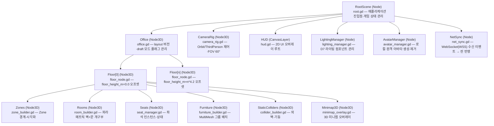

---

## 2. 노드 계층 상세

### 2.1 RootScene

| 속성 | 값 |
|------|-----|
| 노드 타입 | `Node` |
| 스크립트 | `godot/scripts/root.gd` |
| 책임 | 앱 진입점·전역 상태머신(lobby→office→draft)·씬 전환 |

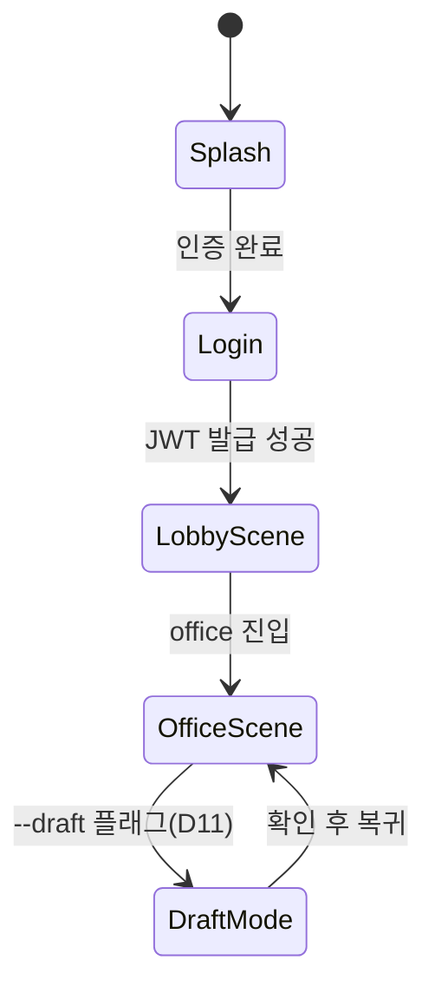

**GDScript 책임 매핑 (`root.gd`)**
- `_ready()`: AutoLoad 등록 서비스(NetSync, AvatarManager) 초기화
- `change_scene(target: String)`: 씬 전환 + 이전 씬 dispose
- `enter_draft_mode(layout_id: String)`: draft 레이아웃 로드 (D11 — 웹 3D 미리보기 없음, 데스크톱 클라이언트 전용)

---

### 2.2 Office

| 속성 | 값 |
|------|-----|
| 노드 타입 | `Node3D` |
| 스크립트 | `godot/scripts/world/office.gd` |
| 책임 | office_layout JSON 수신·파싱·Floor 빌드 지시, draft 모드 진입 구조 |

**GDScript 책임 (`office.gd`)**
- `load_layout(layout_json: String)`: JSON 파싱 → Floor 노드 생성·배치
- `enter_draft_mode(layout_json: String)`: draft 레이아웃(미배포) 로드, 오버레이 UI "DRAFT" 뱃지 표시
- `on_layout_updated(event)`: 서버 `layout_updated` 이벤트 수신 → 안전 시점 재로드

---

### 2.3 Floor[n]

| 속성 | 값 |
|------|-----|
| 노드 타입 | `Node3D` |
| 스크립트 | `godot/scripts/world/floor_node.gd` |
| 책임 | `floor_height_m` 오프셋 적용(D25), 하위 빌더 순차 호출 |

**D25 좌표 오프셋 규칙**

```
floor_height_m = (level - 1) × story_height
예: 층고 4.2m, 3층 → floor_height_m = 8.4
```

GDScript에서 Floor 노드의 `position.y = layout["floor"]["floor_height_m"]`로 설정한다.  
다층을 동시에 로드할 때는 각 Floor 노드를 해당 `floor_height_m`만큼 Y 오프셋으로 배치한다.

**GDScript 책임 (`floor_node.gd`)**
- `initialize(floor_data: Dictionary, furniture_list: Array, ...)`: 하위 빌더 노드들에 데이터 전달
- `set_floor_height(h: float)`: `position.y = h`

---

### 2.4 Zones

| 노드 타입 | `Node3D` |
|-----------|---------|
| 스크립트 | `godot/scripts/world/zone_builder.gd` |
| 책임 | zone 경계 다각형 시각화(바닥 데칼 또는 메시), 팀 색상 적용 |

- `layout["zones"]` 배열을 순회해 `polygon` 좌표를 `layout_to_world()`(§5.3 변환식)로 변환
- zone 경계는 `MeshInstance3D`(평면 데칼 메시)로 표현, `boundary_style`(dashed/solid) 반영

---

### 2.5 Rooms (파라메트릭 생성, D9)

| 노드 타입 | `Node3D` |
|-----------|---------|
| 스크립트 | `godot/scripts/world/room_builder.gd` |
| 책임 | room 경계(coords)에서 벽 세그먼트 자동 생성, `doors[]` 개구부 처리(D9), 트리거 Area3D |

**D9 파라메트릭 벽 + 문 개구부 생성 흐름**

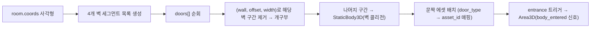

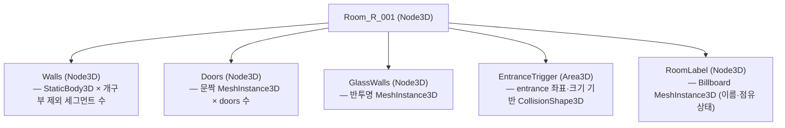

**GDScript 책임 (`room_builder.gd`)**
- `build_room(room: Dictionary, floor_h: float)`: 위 흐름 실행
- `_segment_wall(wall_edge, doors_on_wall)`: 개구부 빼고 세그먼트 반환
- `_on_avatar_entered(body)`: 진입 신호 → NetSync로 `room_enter_request` 전송

---

### 2.6 Seats

| 노드 타입 | `Node3D` |
|-----------|---------|
| 스크립트 | `godot/scripts/world/seat_manager.gd` |
| 책임 | 좌석 인스턴스 배치, `facing` 회전 적용(D10·D25), 점유 상태 시각화 |

**D10 좌석 배정 분리 원칙**  
layout JSON의 `seats[]`는 공간 구조(위치·타입·방향)만 담는다.  
착석자 정보는 런타임에 `seat_db_id`로 `seat_assignment` API를 조회한다.

**D25 facing 변환**  
`facing`은 도(degree), 시계방향, 기준축 +X.  
`basis = Basis(Vector3.UP, deg_to_rad(-facing))`로 Godot에 적용.

---

### 2.7 Furniture (MultiMesh 그룹 배치, D8·드로우콜 예산)

| 노드 타입 | `Node3D` |
|-----------|---------|
| 스크립트 | `godot/scripts/world/furniture_builder.gd` |
| 책임 | 동일 `asset_id`끼리 그룹핑 → `MultiMeshInstance3D` 1드로우콜 병합(07 §6.2) |

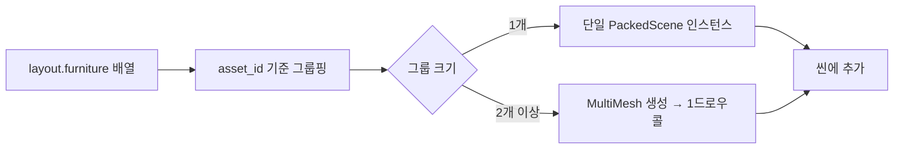

**GDScript 책임 (`furniture_builder.gd`)**
- `build_all(furniture_list, floor_h)`: 위 그룹핑 로직
- `_add_multimesh(asset_id, items, floor_h)`: `MultiMesh.instance_count` + 각 `set_instance_transform()`
- `_load_asset(asset_id) -> PackedScene`: `ASSET_CATALOG[asset_id]` 조회 → `ResourceLoader.load()`

---

### 2.8 AvatarManager

| 노드 타입 | `Node` (AutoLoad) |
|-----------|-----------------|
| 스크립트 | `godot/scripts/avatar/avatar_manager.gd` |
| 책임 | 로컬 아바타·원격 아바타 인스턴스 생성·제거, 프레즌스 상태 반영 |

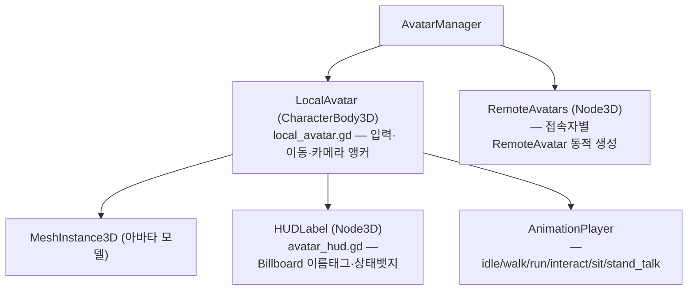

**아바타 구성 파일**
- `godot/scripts/avatar/avatar_hud.gd` — 거리별 페이드(20m 이상 숨김), 상태 7종(D13)
- `godot/scripts/avatar/avatar_animation.gd` — deltaTime 기반 프레임 독립 애니메이션

---

### 2.9 Lighting (D7: 실시간 직접광 + ReflectionProbe + SSAO)

| 노드 타입 | `Node` |
|-----------|-------|
| 스크립트 | `godot/scripts/world/lighting_manager.gd` |
| 책임 | D7 라이팅 구성 관리, 품질 프리셋 전환, SDFGI 토글 |

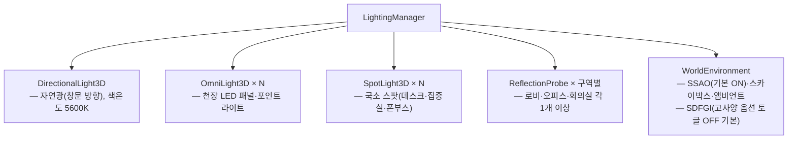

**D7 라이팅 정책**

| 항목 | 기본값 | 고사양 옵션 |
|------|--------|------------|
| 직접광 | DirectionalLight3D + OmniLight3D + SpotLight3D | 동일 |
| GI | ReflectionProbe + SSAO | + SDFGI 토글 ON |
| 라이트맵 | **사용 안 함** (동적 씬·런타임 생성과 양립 불가) | 불가 |
| Occluder | 런타임 벽 단위 BoxOccluder3D 부착 | 동일 |

**GDScript 책임 (`lighting_manager.gd`)**
- `apply_preset(preset: String)`: "ultra/high/medium/low" 프리셋 적용
- `toggle_sdfgi(enabled: bool)`: `WorldEnvironment.environment.sdfgi_enabled` 전환
- `update_reflection_probes()`: 씬 빌드 후 ReflectionProbe 위치 재조정

---

### 2.10 CameraRig

| 노드 타입 | `Node3D` |
|-----------|---------|
| 스크립트 | `godot/scripts/camera/camera_rig.gd` |
| 책임 | FOV 60°, Orbit/ThirdPerson 모드, 회전 속도 제한(모션 멀미 방지) |

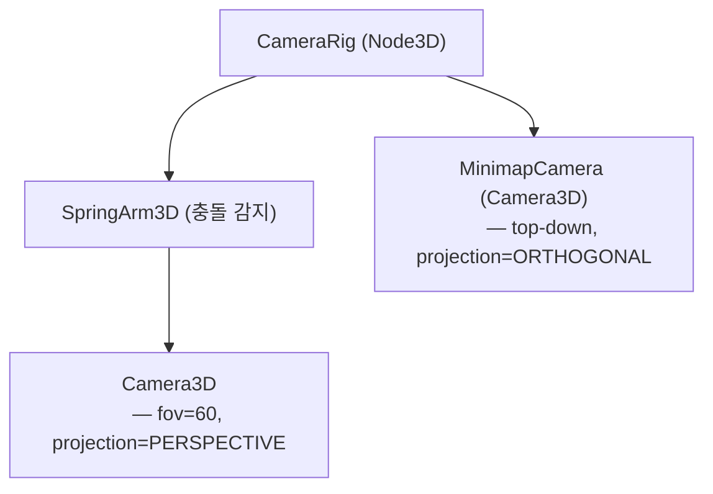

---

### 2.11 HUD (CanvasLayer)

| 노드 타입 | `CanvasLayer` |
|-----------|--------------|
| 스크립트 | `godot/scripts/ui/hud.gd` |
| 책임 | 2D UI 루트, 하위 패널 가시성 관리 |

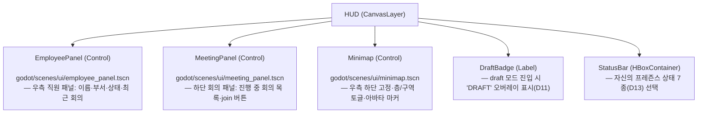

---

## 3. layout JSON → 씬 빌드 흐름 (05 §5.3 정합)

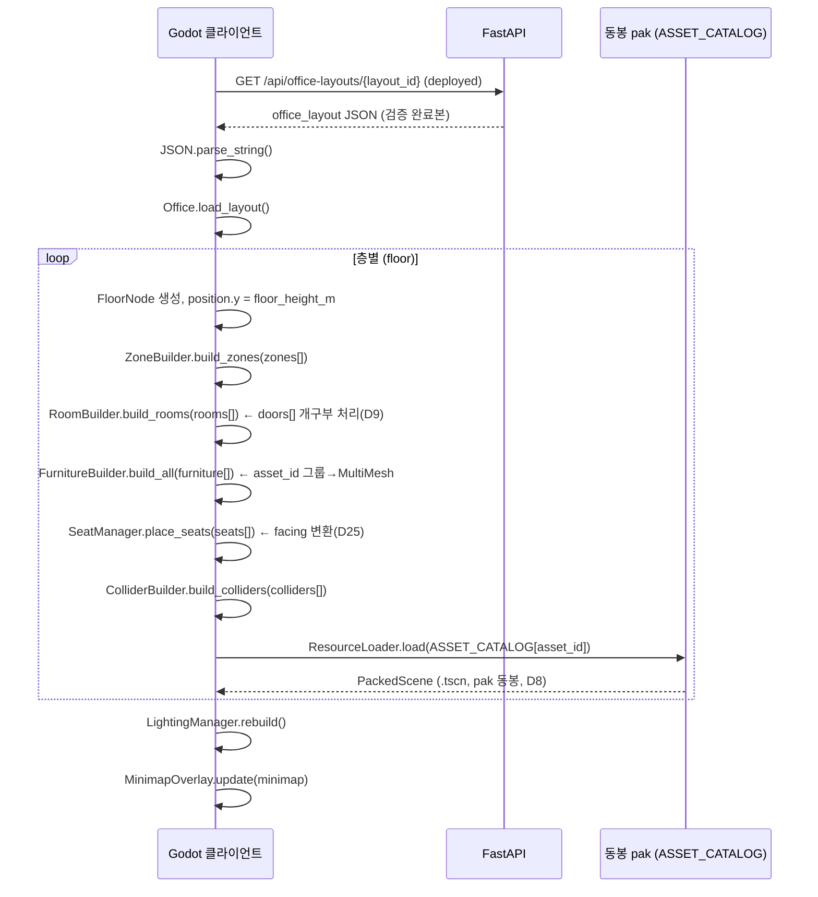

**좌표 변환식 (D25, 05 §5.3)**

```
layout (x, y) → Godot Vector3(x, floor_height_m, y)
rotation(도, 시계방향) → Basis(Vector3.UP, deg_to_rad(-angle_cw))
```

---

## 4. draft 모드 진입 구조 (D11)

D11 결정에 따라 **웹 3D 미리보기는 없다**. draft 열람은 **데스크톱 클라이언트** 전용이다.

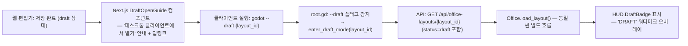

**GDScript 책임 (`office.gd`)**

```gdscript
# @TASK P0-T0.5 — draft 모드 진입
# @SPEC docs/planning/00-decisions.md#D11
func enter_draft_mode(layout_id: String) -> void:
    var json_str := await api.get_layout_draft(layout_id)
    load_layout(json_str)
    hud.show_draft_badge(true)
```

---

## 5. 씬 파일 경로 매핑

| 노드 | 씬/스크립트 경로 |
|------|----------------|
| RootScene | `godot/scenes/root.tscn` / `godot/scripts/root.gd` |
| Office | `godot/scenes/office/office.tscn` / `godot/scripts/world/office.gd` |
| FloorNode | `godot/scenes/office/floor_node.tscn` / `godot/scripts/world/floor_node.gd` |
| ZoneBuilder | `godot/scripts/world/zone_builder.gd` |
| RoomBuilder | `godot/scripts/world/room_builder.gd` |
| SeatManager | `godot/scripts/world/seat_manager.gd` |
| FurnitureBuilder | `godot/scripts/world/furniture_builder.gd` |
| ColliderBuilder | `godot/scripts/world/collider_builder.gd` |
| AvatarManager | `godot/scripts/avatar/avatar_manager.gd` (AutoLoad) |
| LocalAvatar | `godot/scenes/avatar/local_avatar.tscn` / `godot/scripts/avatar/local_avatar.gd` |
| AvatarHUD | `godot/scripts/avatar/avatar_hud.gd` |
| LightingManager | `godot/scripts/world/lighting_manager.gd` |
| CameraRig | `godot/scenes/camera/camera_rig.tscn` / `godot/scripts/camera/camera_rig.gd` |
| HUD | `godot/scenes/ui/hud.tscn` / `godot/scripts/ui/hud.gd` |
| EmployeePanel | `godot/scenes/ui/employee_panel.tscn` |
| MeetingPanel | `godot/scenes/ui/meeting_panel.tscn` |
| Minimap | `godot/scenes/ui/minimap.tscn` |
| draft 열람(D11) | `godot/scenes/layout_draft_viewer.tscn` / `godot/scripts/layout_loader.gd` |

---

## 6. 변경 이력

| 버전 | 일자 | 변경 내용 |
|------|------|----------|
| 1.0 | 2026-07-02 | P0-T0.5 초안 — D2·D7·D8·D9·D10·D11·D25 반영 |
