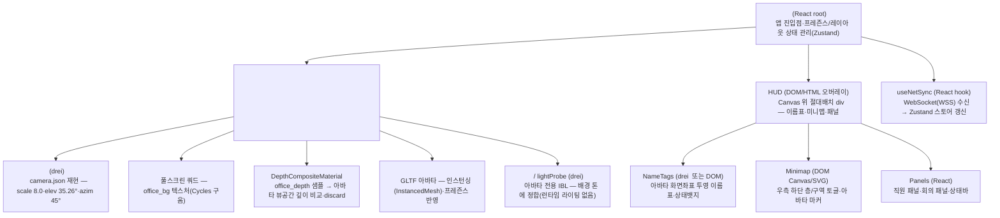
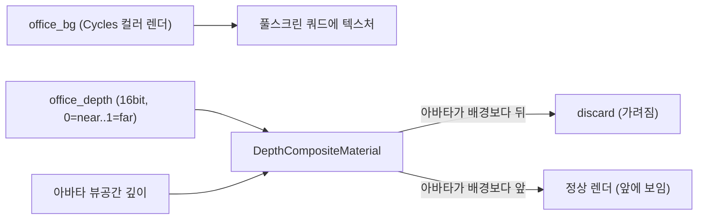
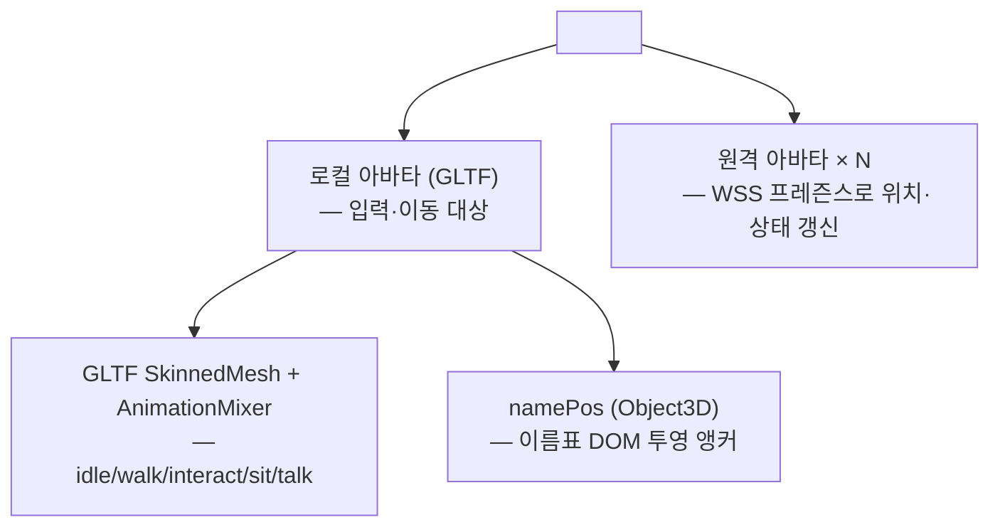
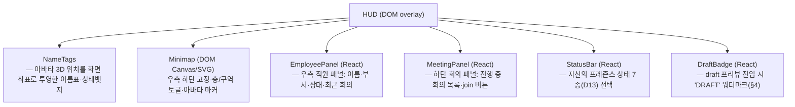
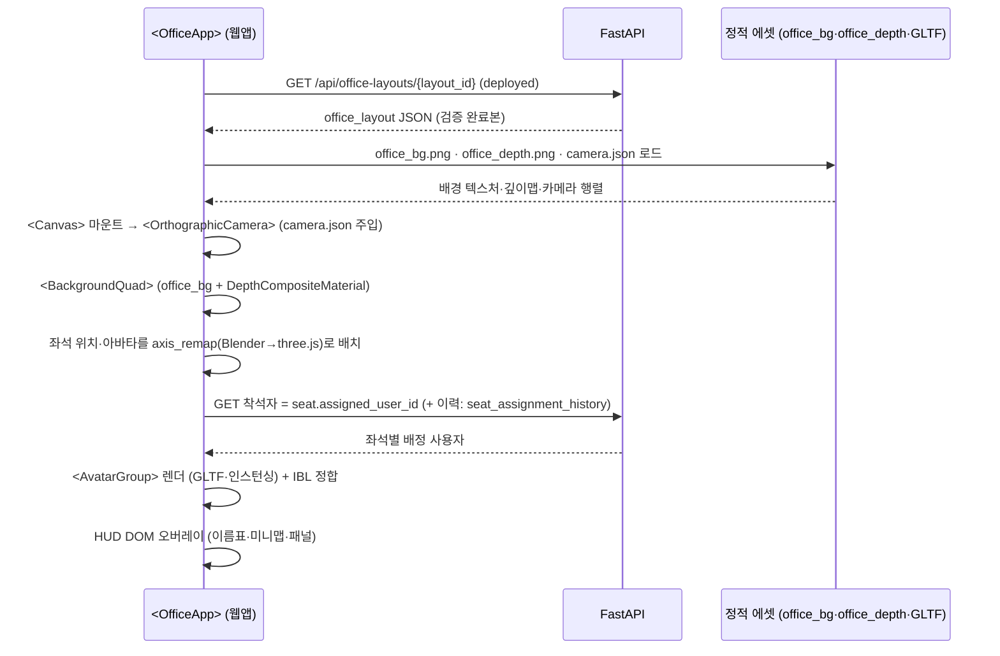
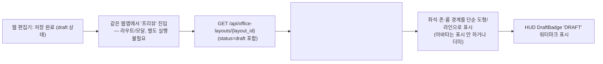

# 3D 씬 구조 설계 (scene-structure.md)

> 🟢 **D27 반영(2026-07-09) — 이 문서는 현행 아키텍처(R3F 오프라인렌더+깊이합성 웹임베드) 기준으로 재작성되었다.** D26(WorkAdventure 2D)+Godot 네이티브 3D 노선은 모두 폐기됨. 씬 구조는 **R3F(three.js) 컴포넌트 트리** — `<Canvas>` 안 배경 풀스크린 쿼드 + 깊이합성 머티리얼 + 아바타 그룹(GLTF) + 직교 카메라(camera.json 재현) + DOM HUD 오버레이. 배경 조명은 Blender Cycles 오프라인 구움(런타임 라이팅 노드 없음). 좌표는 실측 camera.json axis_remap(Blender→three.js). 현행 정본: **00-decisions §H(D27)** · 14-virtual-office-spec · 15-realtime-server-spec · 16-render-spike-and-roadmap · 3d-design/{design-style-analysis §5, photoreal-web-strategy}.

**문서 버전**: 2.0  
**작성일**: 2026-07-02 (초안) · **개정**: 2026-07-09 (D27 재작성)  
**담당**: 3d-engine-specialist  
**태스크**: P0-T0.5 — 3D 씬 구조 설계 (D27: R3F 웹임베드)  
**스택**: three ^0.168 · @react-three/fiber(R3F) ^8.17 · @react-three/drei ^9.115  
**참조**: 00-decisions.md §H(D27), 05-office-layout-schema.md(§2.4·§5.3), 3d-design/photoreal-web-strategy(§4·§6.1), 3d-design/design-style-analysis(§5 3D 아트디렉션), spikes/depth-composite(camera.json)

> 이 문서는 00-decisions.md §H(D27)의 정본 결정을 따른다. 충돌 시 00-decisions.md가 이긴다.

---

## 1. 씬 컴포넌트 계층 개요

R3F(react-three-fiber) 기반 가상오피스 **웹앱**의 **씬 컴포넌트 트리 전체 구조**를 정의한다.  
런타임 렌더러는 three.js(WebGL2)이며, 씬은 React 컴포넌트로 선언한다(TSX). 별도 데스크톱 클라이언트는 없다(단일 웹앱).

배경 공간(벽·바닥·가구·조명)은 **Blender Cycles로 오프라인 렌더링한 정지 이미지(`office_bg`)**로 표현되고, 아바타·이름표·상호작용만 런타임 3D/DOM으로 합성한다. 따라서 씬 트리에는 벽·문·가구 지오메트리 노드가 없고, 대신 **배경 풀스크린 쿼드 + 깊이합성 머티리얼 + 아바타 그룹**이 핵심이다.

### 1.1 최상위 컴포넌트 트리 다이어그램



> **아트디렉션 보존**: 브랜드월, 좌석 군집, 유리 회의실, 라운지, 식물, 층 표지 등 공간 구성 의도는 그대로 유지된다 — 다만 이 구성은 런타임 지오메트리가 아니라 **Blender 씬에서 모델링·조명 후 `office_bg`/`office_depth`로 구워진다**(§2 참조).

---

## 2. 컴포넌트 계층 상세

### 2.1 &lt;OfficeApp&gt; (React root)

| 속성 | 값 |
|------|-----|
| 타입 | React 함수 컴포넌트 (TSX) |
| 파일 | `frontend/app/(protected)/office/OfficeApp.tsx` (예시 경로) |
| 책임 | 앱 진입점·전역 상태(프레즌스·레이아웃·선택 대상)를 Zustand로 관리, `<Canvas>`와 DOM HUD 마운트 |

- 인증은 상위 `(protected)` 라우트 가드가 처리한다(별도 Login 씬 없음 — 웹앱 라우팅에 위임).
- `<Canvas>`(three.js)와 HUD DOM 오버레이는 **형제(sibling)** 로 배치되어 같은 뷰포트에 겹친다.

---

### 2.2 &lt;Canvas&gt; (R3F 렌더러 루트)

| 속성 | 값 |
|------|-----|
| 타입 | R3F `<Canvas>` (three.js WebGL2) |
| 책임 | three.js 렌더러·씬 그래프 마운트, 직교 카메라·배경 쿼드·아바타 그룹 자식 렌더 |

- `<Canvas orthographic>` 로 직교 투영을 사용한다(원근 왜곡 없이 배경 정지 이미지와 정합).
- 배경 지오메트리(벽·가구·문)는 씬 그래프에 없다 — 배경은 `office_bg` 텍스처, 깊이는 `office_depth`가 담당한다.

---

### 2.3 &lt;BackgroundQuad&gt; + 깊이합성 머티리얼

| 속성 | 값 |
|------|-----|
| 타입 | 풀스크린 쿼드 (`<mesh>` + 커스텀 `ShaderMaterial`) |
| 책임 | Blender Cycles로 구운 `office_bg`(컬러)를 화면 전체에 표시, `office_depth`(16bit)로 아바타 오클루전 판정 |

**깊이 규약(spike 검증완료, photoreal-web §6.1)**
- `office_depth`: **0=near … 1=far**, 16bit 단채널.
- R3F 깊이합성 셰이더가 각 아바타 프래그먼트의 **뷰공간 깊이 vs `office_depth` 샘플**을 비교 → 배경보다 뒤(더 far)면 `discard`.
- 결과: 아바타가 책상·기둥·유리벽 뒤로 자연스럽게 가려진다(오클루전).



> 브랜드월·좌석 군집·유리 회의실·라운지·식물·층 표지 등 **공간 아트디렉션은 모두 `office_bg` 안에 구워져 있다**(design-style-analysis §5). 런타임에 별도 지오메트리로 생성하지 않는다.

---

### 2.4 &lt;OrthographicCamera&gt; (camera.json 재현)

| 속성 | 값 |
|------|-----|
| 타입 | drei `<OrthographicCamera>` (또는 R3F `orthographic` 기본 카메라) |
| 책임 | Blender 렌더에 사용한 카메라를 three.js 좌표계에서 **정확히 재현** — 아바타를 배경과 픽셀 정합 |

**camera.json 실측값(spikes/depth-composite)**

| 항목 | 값 |
|------|-----|
| camera_type | ORTHO |
| ortho_scale | 8.0 |
| elevation | 35.264° (isometric) |
| azimuth | 45° |
| clip near / far | 0.1 / 100.0 |
| aspect | 16:9 (1920×1080) |

- three.js에서는 `camera.json`의 **view / projection / world 행렬**을 그대로 주입해 재현하는 것이 원칙이다(오일러 재계산으로 인한 드리프트 방지).
- 좌표 변환은 §3 axis_remap 참조.

---

### 2.5 &lt;AvatarGroup&gt; (GLTF · 인스턴싱)

| 속성 | 값 |
|------|-----|
| 타입 | `<group>` + GLTF 메시 / `InstancedMesh` |
| 책임 | 로컬·원격 아바타를 프레즌스 상태에 맞춰 배치, 대량 접속 시 인스턴싱으로 드로우콜 절감 |



- 애니메이션은 three `AnimationMixer` + `useFrame(delta)` 로 프레임 독립 구동.
- 아바타 조명은 §2.6 참조(배경은 이미 구워져 있으므로 아바타에만 IBL 적용).

**아바타 상태·이름표**
- 이름표·상태뱃지는 3D 메시가 아니라 **DOM/HTML 오버레이**(drei `<Html>` 또는 화면좌표 투영 div)로 그린다 — 텍스트 선명도·접근성·i18n 확보.
- 거리별 페이드/숨김, 상태 7종(D13)은 HUD 레이어에서 처리(§2.8).

---

### 2.6 아바타 조명 (오프라인 구움 배경 + 런타임 IBL)

| 속성 | 값 |
|------|-----|
| 타입 | drei `<Environment>` / lightProbe (아바타 전용) |
| 책임 | 배경 톤·색온도에 아바타를 정합. **런타임 라이팅 노드는 없다.** |

**D27 조명 정책 (photoreal-web §4·§6.1)**

| 항목 | 방식 |
|------|------|
| 배경(벽·바닥·가구) | **Blender Cycles로 오프라인 구움** → `office_bg`에 최종 픽셀로 포함. 런타임 계산 없음 |
| 아바타 | **IBL / 라이트프로브**로 배경 환경광에 정합(HDRI 또는 배경에서 추출한 환경맵) |
| 실시간 광원 | **없음** — DirectionalLight/OmniLight/SpotLight/ReflectionProbe/SDFGI/SSAO 노드 전부 폐기 |
| 그림자 | 배경 그림자는 구움에 포함. 아바타 접지 그림자만 필요 시 소프트 컨택 섀도(별도 처리) |

> Godot의 실시간 DirectionalLight3D/OmniLight3D/SpotLight3D/ReflectionProbe/WorldEnvironment(SSAO·SDFGI) 구성은 전면 폐기되었다. 런타임 라이팅 비용이 0에 수렴하므로 저사양 GPU에서도 안정적이다.

---

### 2.7 HUD (DOM/HTML 오버레이)

| 속성 | 값 |
|------|-----|
| 타입 | React DOM (`<div>` 절대배치) — `<Canvas>` 위에 겹침 |
| 책임 | 이름표·미니맵·직원/회의 패널·상태바 등 모든 2D UI |



- 미니맵·이름표는 3D 씬 노드가 아니라 DOM으로 구현하여 UI 반응성·접근성을 확보한다.
- 아바타 이름표는 매 프레임 아바타 `namePos` 앵커를 카메라로 투영해 DOM 좌표를 갱신한다.

---

## 3. 좌표 변환 & 씬 마운트 흐름

### 3.1 좌표 변환 (실측 camera.json axis_remap)

Blender 씬(구움 원본)과 three.js 런타임 씬은 축 규약이 다르다. 아바타를 배경과 정합하려면 아래 remap을 거친다.

```
Blender (x, y, z)  →  three.js (x, z, -y)
```

- **단일 원점**: `office_layout`의 `top_left`(미터, D25)를 Blender·three.js 공통 원점으로 사용한다.
- three.js는 **Y-up, Z-forward**. Blender는 Z-up이므로 위 axis_remap이 필요하다.
- 카메라는 오일러를 재계산하지 않고 `camera.json`의 **view/projection/world 행렬**을 그대로 주입해 재현한다(ORTHO scale 8.0, elevation 35.26°, azimuth 45°).
- 좌석·아바타의 `facing`(도, 시계방향, 기준축 +X)은 remap 후 three.js Y축 회전(`rotation.y`)으로 적용한다.

> Godot 시절의 `layout (x,y) → Vector3(x, floor_height_m, y)` / `Basis(Vector3.UP, deg_to_rad(-angle))` 변환은 폐기되고, 위 실측 axis_remap으로 대체되었다.

### 3.2 씬 마운트 흐름



**착석자 조회 규약 정정 (정본: 04·05 §2.4)**
- 착석자는 **`seat.assigned_user_id`** 로 조회하며, 배정 변경 이력은 **`seat_assignment_history`** 테이블에 남는다.
- ~~`seat_assignment` API/테이블로 조회~~ 라는 이전 서술은 **오류**다 — `seat_assignment` 테이블은 존재하지 않는다.

---

## 4. draft 프리뷰 구조 (D27: 웹 뷰포트 내 프리뷰)

별도 데스크톱 클라이언트가 없으므로(단일 웹앱) draft 프리뷰는 **같은 웹앱의 뷰포트 안**에서 이뤄진다. 아직 Cycles로 구워지지 않은 미배포 레이아웃은 **플레이스홀더/지오메트리 프리뷰**(배경 정지 이미지 대신 단순 도형·경계선)로 표시하고 'DRAFT' 워터마크를 띄운다.



- 배포(deployed) 상태가 되어 Cycles 렌더가 완료되면 프리뷰가 아닌 정식 `office_bg`/`office_depth` 합성 씬으로 전환된다.
- 프리뷰는 픽셀 정합보다 **레이아웃 검수(위치·크기·동선)** 가 목적이므로 오프라인 렌더를 기다리지 않는다.

---

## 5. 컴포넌트 파일 경로 매핑 (예시)

> 프론트엔드는 Next.js(App Router) + R3F. 아래 경로는 예시 배치이며 실제 구현 시 조정될 수 있다.

| 컴포넌트 | 파일 경로(예시) |
|----------|----------------|
| OfficeApp (root) | `frontend/app/(protected)/office/OfficeApp.tsx` |
| Canvas 래퍼 | `frontend/components/office/OfficeCanvas.tsx` |
| OrthographicCamera | `frontend/components/office/OfficeCamera.tsx` (camera.json 주입) |
| BackgroundQuad | `frontend/components/office/BackgroundQuad.tsx` |
| DepthCompositeMaterial | `frontend/components/office/materials/depthComposite.ts` (셰이더) |
| AvatarGroup | `frontend/components/office/AvatarGroup.tsx` |
| Avatar (GLTF) | `frontend/components/office/Avatar.tsx` |
| 아바타 IBL/Environment | `frontend/components/office/AvatarLighting.tsx` |
| HUD 오버레이 | `frontend/components/office/hud/OfficeHud.tsx` |
| NameTags | `frontend/components/office/hud/NameTags.tsx` |
| Minimap | `frontend/components/office/hud/Minimap.tsx` |
| EmployeePanel | `frontend/components/office/hud/EmployeePanel.tsx` |
| MeetingPanel | `frontend/components/office/hud/MeetingPanel.tsx` |
| StatusBar | `frontend/components/office/hud/StatusBar.tsx` |
| useNetSync (WSS) | `frontend/hooks/useNetSync.ts` |
| draft 프리뷰 | `frontend/app/(protected)/office/draft/[layoutId]/page.tsx` |
| 정적 에셋 | `office_bg.png` · `office_depth.png` · `camera.json` (CDN/정적) — 참조: `spikes/depth-composite/public/` |

---

## 6. 변경 이력

| 버전 | 일자 | 변경 내용 |
|------|------|----------|
| 1.0 | 2026-07-02 | P0-T0.5 초안 — D2·D7·D8·D9·D10·D11·D25 반영 (Godot 4 Node3D/GDScript 기준) |
| 2.0 | 2026-07-09 | **D27 재작성** — Godot 네이티브 3D + D26(WorkAdventure 2D) 전면 폐기. 씬 구조를 R3F(three.js) 컴포넌트 트리로 재정의(배경 풀스크린 쿼드 + 깊이합성 머티리얼 + GLTF 아바타 그룹 + 직교 카메라 camera.json 재현 + DOM HUD). 조명을 Blender Cycles 오프라인 구움 + 아바타 IBL로 교체(실시간 라이팅 노드 삭제). 좌표 변환을 실측 camera.json axis_remap(Blender→three.js)으로 교체. 착석자 조회 오류 정정(`seat.assigned_user_id` + `seat_assignment_history`, `seat_assignment` 테이블 미존재). draft를 웹 뷰포트 내 프리뷰로 재정의(데스크톱 클라이언트 없음). 공간 아트디렉션(브랜드월·좌석군집·유리회의실·라운지·식물·층표지)은 `office_bg` 구움으로 보존. |
