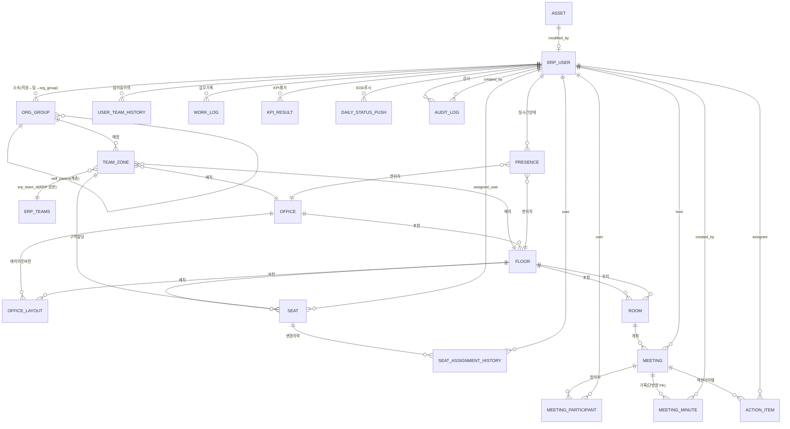

# erd.md: 엔티티 관계도 (ERD)

**작성일**: 2026-07-02  
**상태**: 확정 (Phase 0, P0-T0.3)  
**정본 참조**: `04-data-model.md` §1

> **ERD 주석**: 
> - `ERP_TEAMS`는 ERP 원본 테이블(우리 DB 아님, read-only 참조)이며 `team_zone.erp_team_id`가 이를 가리킨다.
> - `MEETING ↔ MEETING_MINUTE`는 **단방향**(meeting_minute.meeting_id → meeting.id)만 유지한다 — meeting.meeting_minute_id 역방향 FK는 폐기(순환 참조 방지).
> - `USER_TEAM_HISTORY`는 분기 중 팀 이동자의 KPI 벤치마크 왜곡을 막기 위해 신설한다(D18).
> - 모든 timestamp 컬럼은 **UTC 저장, 표시 시 KST 변환**(D19).

---

## 전체 ER 다이어그램 (Mermaid)



---

## 다이어그램 범례

| 기호 | 의미 | 예시 |
|------|------|------|
| `\|\|--o{` | 1:N 관계 (1개가 여러 개를 소유) | office(1) : floor(N) |
| `}o--\|\|` | N:1 관계 (FK 방향) | floor : office(1) |
| `\|\|--o\|` | 1:0..1 관계 (nullable FK) | meeting : meeting_minute(optional) |
| `}o--o{` | N:M 관계 (mapping table) | (본 설계에는 미사용) |

---

## 13개 주요 테이블 개요

### A. ERP 미러 계층 (1개)

| # | 테이블명 | 용도 | 주요 필드 |
|---|---------|------|---------|
| 1 | **erp_user** | 직원 정보 Source of Truth (읽기 전용 동기화) | id(PK), company_id, email, name, erp_team_id, role, is_active(soft-delete) |

### B. 조직·구역·공간 계층 (6개)

| # | 테이블명 | 용도 | 주요 필드 |
|---|---------|------|---------|
| 2 | **org_group** | 사내 조직 계층(본부/부서/파트) | id(PK, UUID), parent_id(self), name, type(division/department/part) |
| 3 | **team_zone** | ERP 팀 ↔ 3D 구역 매핑 | id(PK), erp_team_id(FK to ERP), office_id, floor_id, zone_label |
| 4 | **office** | 물리 사무실 단위 | id(PK), company_id, name, address |
| 5 | **floor** | office 내 층(1층, 2층, B1 등) | id(PK), office_id(FK), level(INT), name |
| 6 | **office_layout** | 레이아웃 버전 관리 (JSON 구조, draft→validated→deployed) | id(PK), office_id, floor_id, version, status, json(JSONB), created_by |
| 7 | **room** | 회의실·라운지·집중실·폰부스 등 공간 | id(PK), floor_id(FK), type(meeting/lounge/focus/phonebooth), name, capacity |

### C. 좌석·현위치 계층 (5개)

| # | 테이블명 | 용도 | 주요 필드 |
|---|---------|------|---------|
| 8 | **seat** | 개별 좌석 | id(PK), floor_id, team_zone_id, assigned_user_id(FK), type(fixed/free/temp/partner), status(available/occupied/disabled/reserved) |
| 9 | **seat_assignment_history** | 좌석 배정 변경 이력 | id(PK), seat_id, user_id, assigned_at, unassigned_at |
| 10 | **user_team_history** | 직원 팀 이동 이력 (**NEW**, D18) | id(PK), user_id(FK), erp_team_id, valid_from, valid_to(NULL=현재) |
| 11 | **presence** | 직원 실시간 상태·위치 | user_id(PK, FK), office_id, floor_id, x/y/z(좌표), status(7종: offline/online/working/meeting/focus/away/external) |

### D. 협업·회의 계층 (4개)

| # | 테이블명 | 용도 | 주요 필드 |
|---|---------|------|---------|
| 12 | **meeting** | 회의 메타데이터 | id(PK), room_id, host_user_id, title, scheduled_at, started_at, ended_at, status(scheduled/in_progress/completed/cancelled), livekit_room, recording_url |
| 12a | **meeting_participant** | 회의 참석자 관리 | id(PK), meeting_id, user_id, invited_at, joined_at, left_at, role |
| 12b | **meeting_minute** | 회의록 (STT 초안 + 검토) | id(PK), meeting_id(unique FK), title, summary, decisions, action_items_summary, created_by, status(draft/finalized) |
| 12c | **action_item** | 회의에서 나온 할일 | id(PK), meeting_id, assignee_user_id, due_date, priority, status(open/in_progress/completed/cancelled), completed_at |

### E. 업무·KPI·연동 계층 (3개)

| # | 테이블명 | 용도 | 주요 필드 |
|---|---------|------|---------|
| 13 | **work_log** | 업무 기록 | id(PK), user_id, work_date, title, goal, status(started/completed), result_url, next_action |
| 14 | **kpi_result** | **KPI 평가 결과 (정본 스키마, D16)** | id(PK), user_id, period_type(daily/quarterly), period_key('2026-07-01'/'2026-Q3'), metric(8가지), value, ai_draft(JSONB), admin_adjusted_score, objection_status(none/submitted/reviewing/resolved), final_score, finalized_at |
| 15 | **daily_status_push** | ERP 연동 배치 로그 | id(PK), user_id, push_date, target(erp_daily_reports/erp_kpi_results), status(pending/sent/failed), pushed_at, run_id |

### F. 자산·감시·감사 계층 (2개)

| # | 테이블명 | 용도 | 주요 필드 |
|---|---------|------|---------|
| 16 | **asset** | 3D 에셋 메타 (Blender→GLB→Godot) | asset_id(PK), asset_name, asset_type, license, modified_by, downloaded_at |
| 17 | **audit_log** | 감사 로그 (좌석배정, 회의, KPI, 배포) | id(PK), user_id(nullable), action, entity_type, entity_id, old_value(JSONB), new_value(JSONB), created_at(UTC), 5년 보존 정책(D20-e) |

---

## 핵심 설계 결정사항

### 1. ERP 동기화 (D18)
- **매시간 증분**: ERP users/teams의 updated_at 기준 upsert
- **매일 00:00 KST 전체 대사**: 하드 삭제 감지 → soft-delete (물리 삭제 금지)
- **화이트리스트 VIEW**: ERP 원본 읽기 시 불필요 컬럼 제외(slack_user_id, github_username, jira_email, lat, lng, radius — D20-f)
- **user_team_history**: 팀 이동 감지 시 이력 자동 생성 (분기 KPI 벤치마크 정합성)

### 2. Presence 상태 7종 (D13)
```
offline → online(로그인)
  ├→ working(좌석 착석)
  ├→ meeting(회의실 입장) → 퇴장 시 이전 상태 복귀
  ├→ focus(집중실)
  ├→ away(무활동 5분 자동)
  └→ external(외근/출장/재택 — 수동 전환)
```

### 3. 좌석 배정 분리 (D10)
- **layout JSON**: 공간 구조(좌석 위치·타입·방향·furniture 참조)만
- **DB(seat 테이블)**: 배정 정보(assigned_user_id) 소유
- **seat_assignment_history**: 배정 변경 이력 추적
- **배정 변경 시 레이아웃 재배포 불필요**

### 4. KPI 스키마 정본 (D16)
- **메트릭별 롱포맷**: 1행 = 1 user + 1 기간 + 1 metric
- **period 컬럼 폐기** → `period_type`(daily/quarterly) + `period_key`('2026-07-01'/'2026-Q3')
- **정량 값 계산**: 결정론적 코드 (D14-e)
- **AI 서술**: ai_draft JSONB(정량 점수 미포함)
- **이의신청 상태머신**: none → submitted → reviewing → resolved (D15)
- **ERP 푸시**: final_score만 전송, 관리자 확정 이벤트 + 분기 마감 배치(D17)

### 5. 회의 & 회의록 (단방향 FK)
- **meeting ↔ meeting_minute**: 단방향(meeting_minute.meeting_id → meeting.id)만
- **meeting.meeting_minute_id 역방향 FK 폐기** (순환 참조 방지)
- **회의록 조회**: `SELECT * FROM meeting_minute WHERE meeting_id = :id`

### 6. Soft-Delete & RESTRICT (D18)
- **erp_user**: ERP 하드 삭제 감지 시 is_active=FALSE (물리 삭제 금지, 평가 기록 영구성)
- **FK ON DELETE**: 
  - seat_assignment_history.user_id: ON DELETE RESTRICT (배정 이력 보존)
  - kpi_result.user_id: ON DELETE RESTRICT (평가 기록 보존)
  - daily_status_push.user_id: ON DELETE RESTRICT (전송 이력 보존)
  - user_team_history.user_id: ON DELETE RESTRICT (팀 이동 이력 보존)

### 7. 타임존 (D19)
- **저장**: UTC
- **표시**: KST (애플리케이션 계층에서 변환)
- **배치 경계**: KST로 계산하되 저장은 UTC (18:00 KST = 09:00 UTC)

### 8. 컴플라이언스 (D20)
- **근로자 모니터링**: 도입 시 서면 고지 및 동의 필수
- **presence 좌표(x,y)**: 보존 30일 후 삭제
- **회의 녹음**: 시작 시 전원 고지 + 참여 의사 확인
  - 녹화 원본: 보존 90일 후 자동 파기
  - 회의록 텍스트: 평가 데이터로 관리(5년 보존)
- **GPS 수집 기능**: 삭제 (데스크톱 클라이언트에 GPS 없음)
- **ERP 미러링 최소수집**: 화이트리스트 VIEW 경유 (slack_user_id, github_username 등 제외)
- **보존 기한**:
  - kpi_result, work_log: 5년 보존 후 파기/익명화
  - audit_log: 5년 보존 후 파기/익명화
  - 회의 녹화: 90일 후 자동 파기

---

## 주요 인덱스 전략

```sql
-- ERP 동기화 & 조인
CREATE INDEX idx_erp_user_company_email ON erp_user(company_id, email);
CREATE INDEX idx_erp_user_team ON erp_user(erp_team_id);
CREATE INDEX idx_erp_user_role ON erp_user(role);
CREATE INDEX idx_erp_user_is_active ON erp_user(is_active);

-- 실시간 조회 (Godot 서버)
CREATE INDEX idx_presence_office_floor ON presence(office_id, floor_id);
CREATE INDEX idx_presence_status ON presence(status);
CREATE INDEX idx_presence_updated_at ON presence(updated_at DESC);

-- 좌석 배정
CREATE INDEX idx_seat_assigned_user ON seat(assigned_user_id);
CREATE INDEX idx_seat_floor_type ON seat(floor_id, type);
CREATE UNIQUE INDEX idx_seat_number_unique ON seat(floor_id, seat_number) WHERE seat_number IS NOT NULL;

-- 회의 & 업무 조회
CREATE INDEX idx_meeting_room_scheduled ON meeting(room_id, scheduled_at DESC);
CREATE INDEX idx_meeting_host ON meeting(host_user_id);
CREATE INDEX idx_meeting_participant_user ON meeting_participant(user_id, invited_at DESC);
CREATE INDEX idx_work_log_user_date ON work_log(user_id, work_date DESC);

-- KPI & EOD 배치
CREATE UNIQUE INDEX uq_kpi_result_metric ON kpi_result(user_id, period_type, period_key, metric);
CREATE INDEX idx_kpi_result_objection ON kpi_result(objection_status);
CREATE INDEX idx_kpi_result_pushed ON kpi_result(pushed_to_erp, pushed_at);
CREATE INDEX idx_kpi_result_finalized ON kpi_result(finalized_at);
CREATE INDEX idx_daily_status_push_status ON daily_status_push(status, target, created_at);
CREATE INDEX idx_daily_status_push_user_date ON daily_status_push(user_id, push_date DESC);

-- 감사
CREATE INDEX idx_audit_log_entity ON audit_log(entity_type, entity_id);
CREATE INDEX idx_audit_log_action_time ON audit_log(action, created_at DESC);
CREATE INDEX idx_audit_log_user_time ON audit_log(user_id, created_at DESC);

-- 팀 이동 이력
CREATE INDEX idx_user_team_history_user ON user_team_history(user_id, valid_from DESC);
CREATE INDEX idx_user_team_history_team ON user_team_history(erp_team_id, valid_from);

-- 좌석 배정 이력
CREATE INDEX idx_seat_assignment_history_seat ON seat_assignment_history(seat_id, assigned_at DESC);
CREATE INDEX idx_seat_assignment_history_user ON seat_assignment_history(user_id, assigned_at DESC);
```

---

## 13개 테이블 필드 매핑 요약

(상세는 `04-data-model.md` §2 참조)

### 1. erp_user (ERP 동기화)
- id, company_id, email, name, erp_team_id, role, is_active(soft-delete)
- FK: manager_id(self)

### 2. org_group (조직 계층)
- id, company_id, name, type(division/department/part), parent_id(self)

### 3. team_zone (팀↔구역 매핑)
- id, erp_team_id(FK to ERP), org_group_id, office_id, floor_id, zone_label

### 4. office (사무실)
- id, company_id, name, address

### 5. floor (층)
- id, office_id(FK), level(INT), name, minimap_config(JSON)

### 6. office_layout (레이아웃 버전)
- id, office_id, floor_id, version, status(draft/validated/deployed), json(JSONB), created_by, validated_by, deployed_at

### 7. room (회의실·라운지 등)
- id, floor_id, type(meeting/lounge/focus/phonebooth), name, capacity, coords(JSON), livekit_room

### 8. seat (좌석)
- id, floor_id, team_zone_id(nullable), assigned_user_id(nullable), type(fixed/free/temp/partner), status(available/occupied/disabled/reserved), coords(JSON)

### 9. seat_assignment_history (좌석 배정 이력)
- id, seat_id, user_id, assigned_at, unassigned_at, assigned_by, reason

### 10. user_team_history (팀 이동 이력) — NEW
- id, user_id, erp_team_id, valid_from, valid_to(NULL=현재)

### 11. presence (실시간 상태)
- user_id(PK), office_id, floor_id, x/y/z, status(7종), updated_at(UTC)

### 12. meeting (회의)
- id, room_id, host_user_id, title, scheduled_at, started_at, ended_at, status, livekit_room, recording_url(90일 보존)

### 12a. meeting_participant (회의 참석자)
- id, meeting_id, user_id, invited_at, joined_at, left_at, role

### 12b. meeting_minute (회의록)
- id, meeting_id(unique FK), title, summary, decisions, created_by, reviewed_by, status(draft/finalized)

### 12c. action_item (액션아이템)
- id, meeting_id, assignee_user_id, due_date, priority, status(open/in_progress/completed/cancelled)

### 13. work_log (업무 기록)
- id, user_id, work_date, title, goal, status(started/completed), result_url, next_action

### 14. kpi_result (KPI 평가 결과 — 정본)
- id, user_id, period_type(daily/quarterly), period_key, metric(8가지), value
- AI: ai_draft(JSONB), ai_draft_generated_at
- 관리: admin_adjusted_score, admin_note, admin_reviewed_at
- 이의신청: objection_status, objection_detail, objection_submitted_at, objection_resolved_at
- 확정: final_score, finalized_at
- ERP 푸시: pushed_to_erp, pushed_at

### 15. daily_status_push (배치 로그)
- id, user_id, push_date, target(erp_daily_reports/erp_kpi_results), status(pending/sent/failed), payload(JSONB), run_id

### 16. asset (3D 에셋)
- asset_id, asset_name, asset_type, license, downloaded_at, modified_by

### 17. audit_log (감사)
- id, user_id(nullable), action, entity_type, entity_id, old_value(JSONB), new_value(JSONB), created_at(UTC, 5년 보존)

---

## 14개 Enum 타입

```sql
CREATE TYPE presence_status AS ENUM (
  'offline', 'online', 'working', 'meeting', 'focus', 'away', 'external'
);

CREATE TYPE seat_type AS ENUM ('fixed', 'free', 'temp', 'partner');
CREATE TYPE seat_status AS ENUM ('available', 'occupied', 'disabled', 'reserved');

CREATE TYPE meeting_status AS ENUM (
  'scheduled', 'in_progress', 'completed', 'cancelled'
);

CREATE TYPE office_layout_status AS ENUM (
  'draft', 'validated', 'deployed', 'archived'
);

CREATE TYPE kpi_period_type AS ENUM ('daily', 'quarterly');
CREATE TYPE kpi_objection_status AS ENUM (
  'none', 'submitted', 'reviewing', 'resolved'
);
CREATE TYPE kpi_source AS ENUM ('virtual_office');

CREATE TYPE erp_role AS ENUM (
  'employee', 'leader', 'admin', 'super_admin'
);

CREATE TYPE org_group_type AS ENUM (
  'division', 'department', 'part'
);

CREATE TYPE room_type AS ENUM (
  'lobby', 'meeting', 'lounge', 'focus', 'phonebooth'
);

CREATE TYPE daily_status_push_target AS ENUM (
  'erp_daily_reports', 'erp_kpi_results'
);

CREATE TYPE action_item_status AS ENUM (
  'open', 'in_progress', 'completed', 'cancelled'
);

CREATE TYPE work_log_status AS ENUM (
  'started', 'completed'
);

CREATE TYPE meeting_minute_status AS ENUM (
  'draft', 'finalized'
);
```

---

## 다음 단계

- [ ] SQLAlchemy 모델 스켈레톤 작성 (`backend/app/models/tables.py`)
- [ ] 마이그레이션 전략 정의 (`docs/data-model/migration-strategy.md`)
- [ ] Alembic 초기 마이그레이션 생성 (`alembic/versions/001_init.py`)
- [ ] 초기 fixtures 준비 (office/floor/room/샘플 레이아웃/테스트 직원 20명)
- [ ] P0-T0.4 (API 계약 검증) 진행
