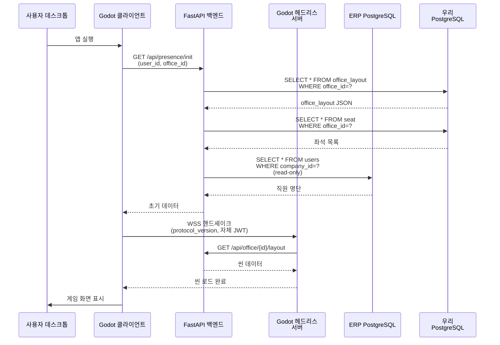
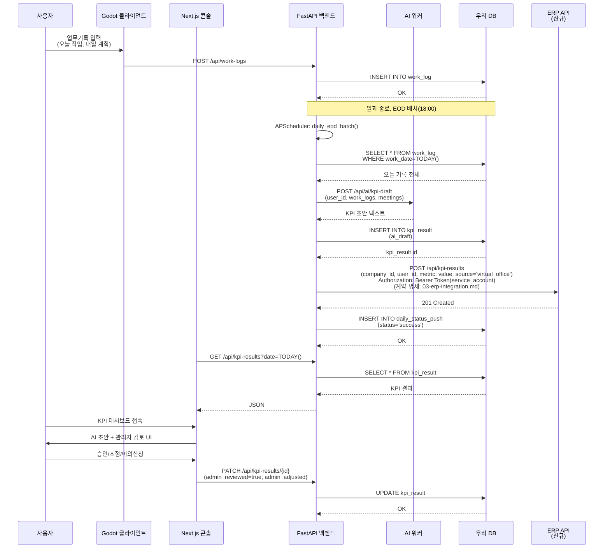
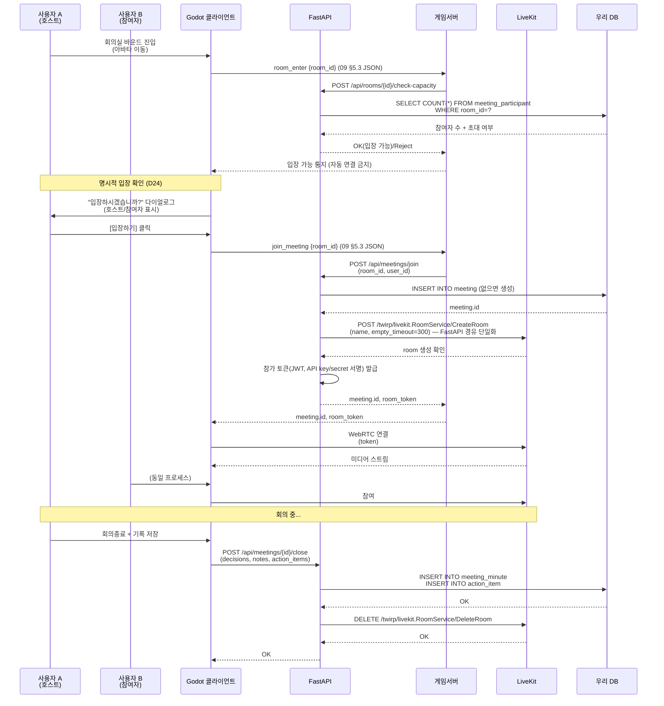

# 기술 아키텍처(TRD) — 가상오피스 운영 플랫폼

**문서 ID**: 02-trd-architecture.md  
**버전**: v1.2  
**작성일**: 2026-07-02 (최초 2026-07-01)  
**상태**: 확정 반영(00-decisions.md v1.0 정합)  
**대상**: 개발팀 L3 실무자  

> 본 문서의 모든 결정은 **00-decisions.md(정본)** 를 따른다. 충돌 시 00-decisions.md가 이긴다.
> 변경 이력은 문서 하단 **변경 이력** 절 참조.

---

## 개요

가상오피스 운영 플랫폼은 기존 사내 ERP(Space-Daily/DailyLog) 위에 얹는 3D 프레즌스 + 협업 계층이다. Godot 4 네이티브 데스크톱을 주력 배포 형식으로 하며, FastAPI 백엔드 + Next.js 웹 콘솔으로 운영 및 업무 기록을 지원한다. 실시간 가상오피스 서버는 아바타 이동·프레즌스·회의실 점유를 권위 있게 관리하고, LiveKit를 통해 화상회의를 제공한다. EOD 배치는 협업 신호와 KPI를 ERP로 push하여 분기 인사평가 자료로 활용한다.

---

## 1. 시스템 구성도

```mermaid
graph TB
    subgraph "클라이언트 계층"
        GodotDesktop["🖥️ Godot 4 데스크톱 클라이언트<br/>(Forward+ 렌더러)<br/>- 아바타 시각화<br/>- 로컬 키 입력<br/>- 미니맵/직원패널"]
    end

    subgraph "실시간 게임서버"
        GodotServer["🎮 Godot 4 헤드리스 서버<br/>- 권위 있는 아바타 이동<br/>- 충돌/근접 검증<br/>- 회의실 점유 관리<br/>- 프레즌스 상태"]
    end

    subgraph "백엔드 API 계층"
        FastAPI["🔧 FastAPI 백엔드<br/>(Python)<br/>- 비즈니스 로직<br/>- 데이터 영속(Persistence)<br/>- 배치 작업<br/>- ERP 동기화"]
    end

    subgraph "웹 관리/업무 계층"
        NextJS["🌐 Next.js 관리 콘솔<br/>(TypeScript, App Router)<br/>- 조직도/좌석배치<br/>- KPI 대시보드<br/>- 업무기록<br/>- 회의록 관리"]
    end

    subgraph "협업 & 회의"
        LiveKit["📞 LiveKit 화상회의<br/>(Self-host)<br/>- 실시간 영상/음성<br/>- 회의실 토폴로지"]
    end

    subgraph "데이터 저장소"
        PostgreSQL["🗃️ PostgreSQL<br/>(우리 DB)<br/>- erp_user, org_group<br/>- office_layout, seat<br/>- presence, meeting<br/>- work_log, kpi_result<br/>- daily_status_push"]
    end

    subgraph "ERP 연동 (Space-Daily)"
        ERPDB["📊 ERP PostgreSQL<br/>(Read-only)<br/>- users, teams<br/>- job_positions<br/>- attendances, leaves"]
        ERPWrite["📤 ERP API<br/>- POST /api/reports<br/>- POST /kpi-results<br/>(신규 엔드포인트)"]
    end

    subgraph "AI 워커"
        AIWorker["🤖 AI 워커<br/>- KPI 초안 생성<br/>- 회의록 요약 검토<br/>(Claude 기본, Gemini 대안)"]
    end

    subgraph "에셋 파이프라인"
        Blender["🎨 Blender<br/>- 3D 모델 제작"]
        Optimization["⚙️ 최적화<br/>(gltfpack, glTF-Transform)<br/>- Godot 임포트"]
        AssetDB["📦 에셋 레지스트리<br/>(asset 테이블)<br/>- 라이선스 추적<br/>- 해시 검증"]
    end

    subgraph "배포"
        Installer["📦 데스크톱 인스톨러<br/>- 자동 업데이트 클라이언트"]
        WebDeploy["🚀 웹 배포<br/>- 관리 콘솔<br/>- 정적/API 서빙"]
        ServerDeploy["☁️ 백엔드 호스팅<br/>- FastAPI + Uvicorn<br/>- Godot 헤드리스"]
        LiveKitDeploy["🏢 Self-host LiveKit<br/>- 온프레미스 배포"]
    end

    %% 연결 관계
    GodotDesktop -->|WebSocket(WSS)| GodotServer
    GodotDesktop -->|REST API| FastAPI
    GodotDesktop -->|LiveKit 수신| LiveKit

    GodotServer -->|REST API 쿼리| FastAPI
    GodotServer -->|아바타 상태 저장| FastAPI

    FastAPI -->|읽기/쓰기| PostgreSQL
    FastAPI -->|읽기(SELECT)| ERPDB
    FastAPI -->|쓰기(write API)| ERPWrite

    NextJS -->|REST API| FastAPI

    AIWorker -->|쿼리| PostgreSQL
    AIWorker -->|업데이트| FastAPI

    FastAPI -->|룸 생성/삭제| LiveKit
    LiveKit -->|웹훅 메타데이터| FastAPI

    Blender -->|GLB/glTF 내보내기| Optimization
    Optimization -->|임포트| AssetDB
    AssetDB -->|로드| GodotDesktop
    AssetDB -->|로드| GodotServer

    Installer -.->|배포| GodotDesktop
    WebDeploy -.->|배포| NextJS
    ServerDeploy -.->|배포| FastAPI
    ServerDeploy -.->|배포| GodotServer
    LiveKitDeploy -.->|배포| LiveKit

    style GodotDesktop fill:#4CAF50,color:#fff
    style GodotServer fill:#2196F3,color:#fff
    style FastAPI fill:#FF9800,color:#fff
    style NextJS fill:#9C27B0,color:#fff
    style LiveKit fill:#F44336,color:#fff
    style PostgreSQL fill:#37474F,color:#fff
    style ERPDB fill:#616161,color:#fff
    style ERPWrite fill:#616161,color:#fff
    style AIWorker fill:#FFC107,color:#000
```

---

## 2. 컴포넌트별 책임과 통신 프로토콜

### 2.1 Godot 4 데스크톱 클라이언트

**책임**
- 아바타 렌더링 및 애니메이션 (Forward+ 렌더러)
- 로컬 입력(키보드, 마우스) 처리
- 게임서버와 실시간 위치 동기화
- UI: 미니맵, 직원패널(명단/상태), 하단 회의패널
- 자동 업데이트 확인 및 설치

**통신 프로토콜**
- **게임서버 연결**: WebSocket(WSS) 단일 확정 (D1)
  - TLS 내장(WSS) → 재택 근무자의 방화벽/프록시 통과 용이. ENet(UDP)·"ENet TCP" 폴백은 폐기(존재하지 않는 조합)
  - 전송: WebSocketPeer(WSS) / 메시지: 09-realtime-collaboration.md §5.3 정의 JSON 프로토콜
  - 메시지 예: `{"type":"move_request","player_id":42,"target_pos":[10.5,0.0,20.3],"floor_id":1,"sequence_num":1234}` (09 §5.3 정본)
  - **접속 경로**: 사무실 내는 사내 LAN에서 WSS 직접 접속. 재택/외근자는 443 공개 엔드포인트(WSS, Let's Encrypt) 직접 접속 — VPN 없음 확정(2026-07-02)
- **FastAPI 백엔드**: REST API (HTTPS)
  - 초기화: `GET /api/presence/init` → 현재 위치, 직원 명단, 좌석 배치 로드
  - 액션: `POST /api/meetings/join` (회의실 진입), `POST /api/work-logs` (업무 기록)
  - 주기적: `GET /api/presence` (refresh, 백그라운드)
- **LiveKit**: 직접 연결 (미디어), 룸 생성/토큰 발급은 FastAPI 경유 (D24)
  - WebRTC 미디어 스트림 (회의 참여 시)

**오류 처리**
- 서버 연결 끊김 → 로컬 UI 업데이트 중단, 재연결 시도, 동기화 복구
- API 요청 실패 → 사용자 피드백 팝업 + 재시도 옵션
- 렌더링 성능 저하 → 저사양 모드 자동 전환 (LOD 조정, 그림자 비활성화)

---

### 2.2 Godot 4 헤드리스 서버

**책임**
- **권위 있는 게임 상태 관리**
  - 아바타 위치 검증 (충돌, 경계)
  - 회의실 점유 (최대 수용인원 체크)
  - 근접 감지 (좌석/아바타 간 거리) — 향후 협업 신호로 활용
- **클라이언트 입력 처리**
  - 이동 요청 검증 및 에코백 (실제 위치 반영)
  - 회의실 진입/퇴출 검증
- **프레즌스 상태 업데이트 (우리 소유, ERP 분리)** — 결정: OQ3, D13
  - 3D 프레즌스 상태 기계 = **7종 확정**: `offline / online / working / meeting / focus / away / external` (D13). GPS 기반 `trip_moving`·`trip_arrived`·`returning`은 폐기(데스크톱에 GPS 없음)
    - `offline` → `online` (3D 클라이언트 로그인)
    - `online` → `working` (지정 좌석/팀 구역 도착)
    - `working` → `meeting` (회의실 진입)
    - `working` / `meeting` → `away` (5분 마우스/키보드 무입력)
    - `*` → `focus` (집중모드 토글 ON, 상태 무관)
    - `*` → `external` (외근/출장 **수동** 전환)
    - `*` → `offline` (3D 클라 로그아웃)
  - 자동 타임아웃: 마지막 신호 후 **5분(설정 가능 기본값)** → `away`
  - 근거: 스펙 장애 격리 원칙(가상오피스 장애가 근태/업무 데이터에 영향 없음), 원본 명확화
  - **참고**: 3D 화면에는 "ERP상 오늘 check_in된 직원" 목록을 read로 병기 표시 (시각적 참고용)
- **정기적 FastAPI 푸시**
  - 아바타 위치 일괄 업데이트 (`POST /api/presence/batch`)
  - 회의 상태 변경 (`POST /api/meetings/{id}/status`)
  - 1초 ~ 5초 주기 (설정 가능)

**통신 프로토콜**
- **클라이언트 입력**: WebSocketPeer(WSS) + 09 §5.3 JSON 프로토콜
  - 받음: `move_request`(player_id, target_pos, sequence_num), `room_enter`, `room_exit`
  - 응답: `player_update`(20Hz 브로드캐스트), `reject`(오류)
- **FastAPI 동기화**: REST API (HTTPS)
  - 배치 쿼리: `GET /api/office/{office_id}/floor/{floor_id}/layout` (오피스 씬/콜리전)
  - 배치 업데이트: `POST /api/presence/batch` (아바타 위치)
  - 개별 업데이트: `PATCH /api/meetings/{room_id}` (회의 상태)
  - 인증: Bearer Token (JWT, 서버용 계정)

**오류 처리**
- 클라이언트 부정 입력 → 무시, 서버 상태 그대로 유지 (클라이언트가 재동기화)
- FastAPI 연결 끊김 → 메모리 버퍼링, 온라인 복귀 시 배치 동기화
- 데이터 불일치 → 정기적 재검증 (예: 30초마다 위치 재확인)
- **게임서버 크래시 시 인메모리 상태 복원**: 프레즌스·아바타 위치는 게임서버 메모리 권위이므로 크래시 시 휘발 → 재기동 후 클라이언트 재접속 시 각 클라이언트가 마지막 `last_server_seq`를 제시하고(09 §5.3 resume) 서버가 좌석 배정(DB)·최근 배치 push 스냅샷을 근거로 상태를 재구축(reconstruct)한다.

---

### 2.2.1 WSS 핸드셰이크 & 인증 (D1/D4)

게임서버는 DB(자체/ERP)에 직접 접근하지 않으며(D3), 로그인 자격증명(email/password)도 받지 않는다. 인증은 **FastAPI가 발급한 자체 JWT를 게임서버가 검증**하는 방식이다.

**핸드셰이크 순서**
1. 클라이언트가 FastAPI 로그인(`POST /api/auth/login`, email/password) → **자체 JWT(HS256, 자체 시크릿, 8h 만료)** 수령. 시크릿은 ERP와 공유하지 않는다.
2. 클라이언트가 WSS 연결을 열며 첫 메시지로 `{"type":"hello","protocol_version":<int>,"jwt":"<token>"}` 전송.
3. 게임서버가 **`protocol_version` 협상**: 지원 범위 밖이면 `{"type":"reject","reason":"protocol_mismatch","min":<int>,"max":<int>}` + 업데이트 안내 후 소켓 종료.
4. 게임서버가 **자체 시크릿으로 JWT 서명·만료 검증**(FastAPI와 동일 시크릿, ERP 시크릿 아님) → 성공 시 세션 확립. 게임서버는 ERP 공개키를 사용하지 않는다(암호학적 불성립이던 기존 표기 폐기).

**장기 접속 세션과 8h 만료(인밴드 토큰 refresh)**
- 업무 시간 내 WSS 세션은 8h를 초과할 수 있다. JWT 만료로 세션을 끊지 않도록 **인밴드 refresh**를 사용한다.
- 클라이언트는 만료 임박(예: 잔여 15분) 시 FastAPI refresh 엔드포인트로 신규 JWT를 받아 WSS 상에서 `{"type":"reauth","jwt":"<new>"}`로 전달, 게임서버가 재검증하여 세션 유효기간을 갱신한다. 재검증 실패 시에만 재접속을 요구한다.

---

### 2.3 FastAPI 백엔드

**책임**
- **데이터 영속(Persistence)**
  - 비즈니스 엔티티 CRUD: office, seat, user, team, meeting, work_log, kpi_result 등
  - 트랜잭션 관리, 동시성 제어
- **ERP 동기화**
  - 읽기: erp_user, teams, job_positions, attendances, leaves (정기 또는 요청 시)
  - 쓰기: daily_reports (업무기록), kpi_results (신규)
- **비즈니스 로직**
  - 좌석 배정 (고정/자율/임시 구분)
  - 조직 계층 관리 (org_group 등)
  - KPI 산출 (입력된 협업/완료도 집계)
- **배치 작업 (APScheduler)**
  - 근태 동기화: 매일 09:00 (ERP attendances 읽기)
  - EOD push: 매일 18:00 (work_log + kpi_result → ERP)
  - 프레즌스 정리: 오프라인 사용자 상태 초기화
- **AI 워커 오케스트레이션**
  - KPI 초안 생성 요청
  - 회의록 요약 검토 요청

**주요 엔드포인트**
- `GET /api/users` — 직원 명단 (캐시됨, 1시간)
- `GET /api/teams` — 조직 구조
- `GET /api/office/{id}/floor/{floor_id}/layout` — 사무실 배치 (office_layout JSON)
- `GET /api/presence` — 현재 프레즌스 (필터: office_id, floor_id)
- `POST /api/meetings` / `PATCH /api/meetings/{id}` — 회의 관리
- `POST /api/work-logs` — 업무기록 생성
- `POST /api/kpi-results` — KPI 결과 저장 (내부용)
- `POST /api/daily-status-push` — EOD 배치 로그 (관리자 감시)

**통신 프로토콜**
- 클라이언트: REST API + JSON (HTTPS)
  - 인증: Bearer Token (**FastAPI 발급 자체 JWT, HS256 + 자체 시크릿**, ERP와 시크릿 미공유) (D4)
- 게임서버: REST API + JSON (HTTPS, 같은 네트워크)
  - 인증: Bearer Token (서버용 service account JWT)
- ERP: **psycopg(3.x)** 드라이버 직결 (read-only, 같은 사내망)
  - 쓰기: REST API (ERP의 기존 + 신규 엔드포인트)
  - 인증: JWT (service account, 24h 갱신)
- AI 워커: REST API + JSON (내부)
  - 인증: Bearer Token

**오류 처리**
- ERP DB 연결 끊김 → 캐시 사용, 배치 실패 로그 + 재시도 (Retry Policy)
- ERP API 쓰기 실패 → **DB 영속 재시도 큐**(재시작 시에도 유실 없음, 지수 백오프), daily_status_push 레코드 남김. 메모리 큐/RabbitMQ는 폐기(메모리 큐는 재시작 시 유실되어 재시도 약속과 모순) (D17/D21)
- 트랜잭션 충돌 → SQLAlchemy 낙관적 잠금 사용, 충돌 시 클라이언트 재시도 권유

---

### 2.4 Next.js 웹 관리 콘솔

**책임**
- **조직 관리**
  - 직원 명단 조회 (ERP 동기화)
  - 조직도 편집 (org_group, team_zone)
  - 팀 별 색, 3D 구역 매핑 (React Flow)
- **사무실 편집기**
  - 2D 배치 편집 (Konva.js)
  - 정밀 확인은 저장 후 데스크톱 클라이언트 draft 모드(D11)
  - 좌석/회의실 정의
  - office_layout JSON 생성 → FastAPI 저장 → 배포
- **KPI & 업무 대시보드**
  - 기간별 KPI 조회 (그래프)
  - 직원별 업무기록 열람
  - AI 초안 검토 + 관리자 조정 UI
- **회의록 관리**
  - 회의 목록 (참여자, 시간, 상태)
  - 회의록 조회 (결정사항, 액션아이템)
  - 액션아이템 추적

**통신 프로토콜**
- **FastAPI 백엔드**: REST API + JSON (HTTPS)
  - 인증: 사용자 JWT (로그인)
  - 쿠키: httpOnly (CSRF 토큰 포함)
- **클라이언트 측**: JavaScript (App Router → API Routes → FastAPI)

**특이사항**
- 사내 도구이므로 TDS(Toss Design System) 불필요
- 가벼운 TailwindCSS 스타일링

---

### 2.5 LiveKit 화상회의

**책임**
- 실시간 영상/음성 스트림
- 회의실별 토폴로지 관리
- 자동 기록(선택사항)

**배포**
- Self-host (온프레미스, Docker Compose 또는 Kubernetes)
- PostgreSQL 백엔드 (메타데이터)

**통신 프로토콜**
- 클라이언트 → LiveKit: WebRTC
  - 토큰 기반 인증 (JWT 서명, 24h). **룸 생성 및 참가 토큰 발급은 FastAPI 경유 단일화**(클라이언트/게임서버가 LiveKit 룸을 직접 생성하지 않음) (D24)
- FastAPI ↔ LiveKit 웹훅: REST API
  - `POST /api/internal/livekit-webhook` (회의 시작/종료 통보)
  - 인증: **LiveKit API key/secret로 서명한 JWT를 `Authorization` 헤더로 전달**(LiveKit 웹훅 표준). "Webhook Secret (HMAC)" 표기는 정정

---

### 2.6 ERP (Space-Daily) 연동

**책임**
- 읽기: 직원, 조직, 근태, 휴가 정보 Source of Truth
- 쓰기: 업무 결과, KPI 저장소

**읽기 흐름 (FastAPI → ERP DB, 모두 read-only)** — 결정: OQ3 (근태=읽기 원칙)
- 대상 테이블: users, teams, job_positions, attendances(check_in/out, 오늘만), leaves
- 방식: **psycopg(3.x)** 드라이버 직결 (read-only 계정, INSERT/UPDATE/DELETE 불가)
- 주기: 매일 09:00 근태 동기화, 또는 요청 시
- **중요**: 우리는 ERP attendances 테이블에 **쓰기 하지 않음** (v1 범위)
  - ERP attendances = Source of Truth (공식 출퇴근, ERP가 관리)
  - 우리 프레즌스(presence) = 3D 독립 상태 (우리 소유, 업무용)
  - 분리 근거: 장애 격리(가상오피스 장애가 근태/업무에 영향 없음)
  - 3D 화면: ERP attendances 읽기 결과를 "오늘 check_in된 직원" 목록으로만 표시 (시각적 참고)
- 캐싱: 로컬 erp_user 테이블에 미러링 (company_id 스코프)
  - 필드: id(=ERP users.id), company_id, email, name, erp_team_id, role, position, position_id, manager_id, slack_user_id, github_username, jira_email, work_type, work_hours, last_synced_at

**쓰기 흐름 (FastAPI → ERP API)**
1. **업무기록** (실시간): `POST /api/reports` → ERP daily_reports
   - 필드: user_id(=erp_user.id), work_date, today_work, current_tasks, blockers, tomorrow_plan, status
   - ERP 기존 엔드포인트 재사용

2. **KPI 결과** (EOD): `POST /api/kpi-results` (신규 엔드포인트, ERP dev 브랜치 작성, 03-erp-integration.md 참조)
   - 필드: company_id, user_id(=erp_user.id), period, metric, value, source(='virtual_office'), created_at
   - ERP 서버: 신규 kpi_results 테이블 + Alembic 마이그레이션

**인증**
- 읽기: read-only 계정 (DB 수준 권한)
- 쓰기: service account JWT (HS256, 24h, 갱신 엔드포인트)

**오류 처리**
- ERP DB 읽기 실패 → 캐시 사용 + 로깅
- ERP API 쓰기 실패 → daily_status_push 큐 + 재시도 (지수 백오프)
- 데이터 불일치 → 감사 로그(audit_log) 기록

---

### 2.7 AI 워커

**책임**
- KPI 초안 생성
  - 입력: 사용자 업무기록(work_log) + 협업 신호(meeting 참여도)
  - 출력: kpi_result.ai_draft **서술 텍스트**(강점/개선/근거)만. 정량 점수는 결정론적 코드가 계산하며 AI는 산출하지 않음 (D14(e))
- 회의록 요약/검토
  - 입력: meeting_minute (원본 기록) + STT 초안
  - 출력: 자동 추출 decision, action_item, summary

**개인정보 보호 — 외부 AI 전송 가명화 (D20(d))**
- 외부 AI(Claude API 등)로 전송 시 **실명 → 사번으로 가명화**한 뒤 전송(프롬프트·입력 데이터 내 실명·이메일 제거). 처리위탁·국외이전 고지를 문서화한다.

**구현 옵션**
- Claude API (Anthropic) 기본, 또는 Gemini (ERP와 통일 가능)
- 비동기: FastAPI 백그라운드 task (**APScheduler + DB 영속 재시도 큐**). Celery/RabbitMQ는 폐기 (D21)

**통신 프로토콜**
- FastAPI 백엔드 → AI API: REST API (Bearer Token)
  - 요청: 사용자/기간/데이터 JSON
  - 응답: 생성된 텍스트 + 신뢰도 점수

---

### 2.8 에셋 파이프라인

**흐름**
1. **제작**: Blender에서 3D 모델 제작 (CC0 우선 또는 자체 제작)
2. **내보내기**: GLB/glTF 형식
3. **최적화**: gltfpack 또는 glTF-Transform (메시 압축, 텍스처 최적화)
4. **임포트**: Godot 4 씬으로 변환 (자동 또는 수동)
5. **등록**: asset 테이블에 메타데이터 기록
   - asset_id, asset_name, asset_type, source_url, author, license, license_url
   - downloaded_at, modified_by, commercial_allowed, attribution_required, redistribution_allowed
   - original_file_hash, optimized_file_hash (무결성)
   - used_in_scene (참조)

**라이선스 추적**
- CC0 (저작권 해제) 우선: ambientCG, Poly Haven, Kenney, Quaternius
- CC-BY: 저작자 표시 필수 (asset.attribution_required=true, 게임 내 크레딧)
- 상용: 별도 계약

**관측성**
- asset 테이블 쿼리 → 사용 중인 에셋 목록 + 라이선스 자동 검증
- 빌드 시: 라이선스 위반 검사 (CI/CD)

---

## 3. 배포 구조

> 배포 상세 정본은 **docs/deployment/onprem-docker.md** (2026-07-02 신설).

### 3.1 네이티브 데스크톱 배포

**대상**: Windows, macOS, Linux (Godot 4 Forward+ 지원)

**패키징**
- Godot 4 export: PCK 패키징 (GodotEngine 네이티브 바이너리 + 리소스)
- 인스톨러 생성: NSIS (Windows) 또는 DMG (macOS), AppImage (Linux)
- 파일 크기: ~300-500MB (Forward+ 렌더러 포함, 에셋 최적화)

**자동 업데이트**
- 클라이언트: 시작 시 버전 체크 (`GET /api/version`)
- 업데이트 서버: S3 또는 사내 파일 서버 (delta 패치 지원)
- 재시작: 자동 설치 후 재실행 (또는 사용자 확인)

**설치형 단점 제거**
- 단일 조직 소규모(동시 ~20명) → 확장 부담 없음. 단, 서버는 인터넷 공개(보안 §4.2)
- IT 관리자가 배포 중앙화 가능 (AD 있는 경우)

---

### 3.2 웹 관리 콘솔 배포

**스택**
- Next.js 앱 (TypeScript, App Router)
- 정적 생성 + ISR (Incremental Static Regeneration)
- API Routes → FastAPI 백엔드 프록시

**호스팅**
- **Linux 서버 PC 단일화** (D21, 2026-07-02): 웹 프론트 포함 전부 Docker Compose + Caddy(TLS 종단) 배포 — 정본 docs/deployment/onprem-docker.md
- Vercel/외부 CDN은 폐기(온프렘 데이터 주권 — 회의·평가 데이터를 외부 인프라에 두지 않음)

**도메인**
- 공인 도메인(추후 구매, 그 전 임시 Caddy 내부 CA) — 2026-07-02 확정
- SSL: **Let's Encrypt 자동 발급(Caddy)**. 상세: docs/deployment/onprem-docker.md §3.1

---

### 3.3 FastAPI 백엔드 & Godot 헤드리스 서버

**공통 호스팅**
- VPS 또는 사내 서버 (Ubuntu 22.04 LTS)
- Python 3.11 + Uvicorn (FastAPI)
- Godot 4 헤드리스 바이너리 (게임서버)

**배포 방식**
- Docker Compose (권장)
  ```
  services:
    fastapi:
      image: voffice-backend:latest
      ports: [8000:8000]
      env: .env (DB, ERP, JWT_SECRET, AI_API_KEY 등)
      volumes: [./data:/app/data]
    godot-server:
      image: voffice-gameserver:latest
      ports: [8080:8080]  # WebSocket(WSS, 프록시 종단)
      env: FASTAPI_URL=http://fastapi:8000
    postgres:
      image: postgres:17-alpine
      env: POSTGRES_DB=voffice
      volumes: [./postgres_data:/var/lib/postgresql/data]
    redis:
      image: redis:7-alpine
      (옵션: 캐시용. 배치 재시도 큐는 Redis가 아닌 PostgreSQL 영속 테이블 사용 — D21)
  ```

**시크릿 관리 (D21)**
- 운영 시크릿은 `.env` 파일로 관리하되 **파일 권한 600**(소유자 읽기/쓰기 전용)으로 제한한다.
- **반기 1회 로테이션** 정책 문서화(JWT_SECRET, ERP service account, LiveKit API key/secret, AI_API_KEY 등). 커밋된 시크릿은 신뢰하지 않는다.

**헬스체크**
- FastAPI: `GET /healthz` (DB 연결, ERP 연결 상태)
- Godot 서버: 주기적 心跳(heartbeat) 신호

**로깅 & 모니터링 (D21, 1인 운영 규모로 축소)**
- Logs: **Loki**(경량 로그 수집). ELK/CloudWatch는 폐기
- Metrics: **Prometheus + Grafana**
  - CPU/메모리, 활성 사용자 수, API 응답시간, ERP 동기화 지연
  - 게임서버 네트워크 대역폭, 아바타 위치 업데이트 손실률
- 헬스 감시: **Uptime Kuma**
- 알림: **단일 채널**(1인 운영). 온콜 에스컬레이션 계층은 두지 않음

---

### 3.4 Self-host LiveKit (결정: OQ5)

**호스팅 인프라 (사내 통제)**
- 배포 대상: 온프레미스 VM 또는 사내 클라우드 계정 (AWS/Azure/GCP 자체 계정 아님)
- 근거:
  - **미디어 데이터 주권**: 회의가 인사평가 근거로 연결되는 민감 데이터 → 사내 통제 필수
  - **같은 사내망 지연 이점**: ERP·백엔드와 동일 사내망 → 낮은 레이턴시(< 10ms)
  - **규모상 단일 SFU 노드로 충분**: 설계 100명(도그푸딩 검증 20명) 기준 → 오토스케일 불필요 → 1인 운영 부담 낮음
- **배제 항목**:
  - LiveKit Cloud (SaaS, 민감 미디어 외부 경유, 구독비, B2B 이후 고려)
  - 순수 신규 AWS 계정 (데이터 주권·사내 우선 고려 시 후순위)

**배포 방식**
- Docker Compose + coturn (TURN 서버)
  ```
  services:
    livekit:
      image: livekit/livekit-server:latest
      ports: [7880:7880, 7881:7881, 7882:7882, 49152-65535:49152-65535/udp]
      env: LIVEKIT_API_KEY, LIVEKIT_API_SECRET, LIVEKIT_PORT, WEBHOOK_KEY
      volumes: [./config.yaml:/etc/livekit.yaml]
    coturn:
      image: coturn/coturn:latest
      ports: [3478:3478/tcp, 3478:3478/udp, 5349:5349/tcp, 5349:5349/udp]
      env: TURNSERVER_USERNAME, TURNSERVER_PASSWORD
      (TURN-over-TLS: 443 공개 엔드포인트용)
    livekit-db:
      image: postgres:17-alpine
      (옵션: 메타데이터 저장)
  ```

**네트워크 접속 경로**
- **사무실 내**: 사내 LAN → LiveKit (7880-7882, UDP 49152-65535)
- **재택/하이브리드/외근**: 7881/TCP + UDP 50000-60000 공개 직결(품질 우선), 실패 시 TURN-over-TLS 443 폴백 — VPN 없음 확정(2026-07-02), 상세 docs/deployment/onprem-docker.md §3.2

**방화벽 규칙**
- TCP 7881 (WebRTC TCP) + UDP 50000-60000 (미디어 스트림) — 공개 직결 (onprem-docker §3.2)
- TCP 443 (TURN-over-TLS) — 공개 직결 실패 시 폴백
- TCP 3478, UDP 3478/5349 (coturn) — TURN 수신 포트

**모니터링**
- LiveKit 웹 콘솔 (`http://localhost:7880`)
- 활성 회의, 참여자, 네트워크 품질
- Prometheus 메트릭: 미디어 손실률, 지연, 대역폭 사용량

---

## 4. 비기능 요구사항(NFR)

**주의**: 본 섹션의 모든 성능 목표는 **이 버전 단일조직 스코프(설계 100명 / 도그푸딩 검증 20명, D22)**를 기준입니다. 1000명 이상 대규모 확장, 월드 샤딩, 멀티테넌트 성능 최적화는 완성 이후 Won't 항목입니다.

### 4.1 성능(Performance)

**3D 렌더링 성능** (D7/D22)
- 목표: 60 FPS@1080p (Forward+)
  - 기준 GPU: **GTX 1650급** 60fps
  - 저사양 모드 = **Low 프리셋** (그래픽 프리셋 정본: 07-3d §6.5 Ultra/High/Medium/Low): **내장그래픽(Iris Xe급)** 에서 실행 가능
  - 로딩 < 5초
- 최적화 기법:
  - **LOD (Level of Detail)**: 아바타 5m 이상 거리 → 단순화(Simplified) 모델
  - **인스턴싱(Instancing)**: 동일 에셋(책상, 의자) → GPU 일괄 렌더링
  - **오클루전 컬링(Occlusion Culling)**: 벽/바닥 뒤 객체 렌더링 스킵
  - **배칭(Batching)**: 드로우콜 합산

**네트워크 성능** (D22)
- 서버 tick **20Hz**, 아바타 동기화 E2E(입력→원격 표시) **p95 < 500ms**
- 대역폭은 **브로드캐스트 팬아웃 O(N²)** 로 지배된다(기존 산정은 서버 수신량만 계산해 팬아웃을 누락했음). 서버는 매 tick 각 클라이언트에게 전체 N명 상태를 송신하므로 **송신량**이 병목이다.
  - 실제 JSON 페이로드 기준 ≈ **150B/player**(player_id·pos·rotation·animation·status 포함)
  - 수신(inbound): 각 클라 자기 위치만 → N × 150B × 20Hz = 100 × 150 × 20 ≈ **300 KB/s**
  - 송신(outbound, O(N²)): N × (N × 150B × 20Hz) = 100 × 100 × 150 × 20 ≈ **30 MB/s ≈ 240 Mbps**(집계)
- **100명 초과 시**: AOI(Area of Interest) 필터링 + 바이너리 직렬화 도입 검토(JSON→바이너리로 페이로드 축소, 화면 밖 플레이어 송신 생략)
- WebSocket 연결: 사용자당 1개 유지
- 메시지 압축: 옵션(대역폭 제약 시)

**데이터베이스 성능**
- 쿼리 응답: 평균 50ms, 최대 500ms
  - 인덱스: (user_id, updated_at), (floor_id, user_id) 등
  - 정기적 아카이빙: 90일 이상 데이터 → presence_archive 테이블
- 배치 쓰기: 배치 크기 100, 1000row/s 처리량

**API 처리량**
- FastAPI: 초당 1000 req/s (Uvicorn 4 worker, 8 core)
- 캐시: Redis (TTL 1시간)
  - 직원 명단, 조직도, 좌석 배치

**게임서버 확장성** (D22)
- 단일 Godot 헤드리스: **설계 100명 / 도그푸딩 검증 20명**(이 버전 Phase 1-7 스코프). "500명" 표기는 폐기
  - **1000명 이상 동시 접속**: 완성 이후(Won't) — 월드 샤딩 + 로드밸런싱 구성 필요
  - 아키텍처: floor_id 또는 zone 단위로 게임서버 분산
  - 로드밸런서: Nginx/HAProxy → 여러 게임서버

---

### 4.2 보안(Security)

**인증 & 인가** (D4)
- JWT (**HS256 + 자체 시크릿**, FastAPI 발급, **ERP와 시크릿 미공유**)
  - 유효기간: 8시간 (업무 시간)
  - Refresh token: 7일 (자동 갱신). WSS 장기 세션은 **인밴드 refresh**로 만료 갱신(§2.2.1)
  - 클레임: user_id, company_id, email, roles(employee|leader|admin|super_admin)
  - WSS 핸드셰이크에 **`protocol_version` 협상** 포함(미지원 버전 거부 + 업데이트 안내, §2.2.1)
  - "ERP 공개키 검증" 표기는 폐기(HS256은 대칭키이므로 공개키 검증이 성립하지 않음)
- 서비스 계정 (API to API)
  - 게임서버 ↔ FastAPI: JWT (service_voffice_server, **자체 시크릿**)
  - FastAPI ↔ ERP API: JWT (service_voffice_erp, 24h)
  - 유효성: **자체 시크릿으로 서명 검증**, 클레임 타임스탬프
- 권한 모델:
  - employee: 자신의 업무기록, 참여한 회의만 조회
  - leader: 팀 직원 업무/KPI 조회, 회의록 승인
  - admin: 전체 오피스 관리, 좌석 배정
  - super_admin: 조직 관리, 감사 로그 조회 (ERP와 동일)

**데이터 보호**
- 네트워크: TLS 1.3 (모든 API, DB 연결, **게임 트래픽 WSS 포함** — D1)
  - 인증서: **Let's Encrypt 자동 발급(Caddy)** — WSS/HTTPS/TURN-TLS 단일 인증서로 통일(2026-07-02). 상세: docs/deployment/onprem-docker.md §3.1
- 저장소: 암호화 (옵션)
  - PII(Personal Identifiable Information): 직원명, 이메일은 평문(필수 업무용)
  - **GPS 수집 기능 삭제** (D13/D20(c)): 데스크톱에 GPS 없음, ERP lat/lng/radius 미러링 금지
  - presence 좌표(x,y): KPI 산출 미사용, 보존 30일 후 삭제 (D20(a))
  - 회의록: 접근 제어 (참여자 + 리더 역할만)
- DB 접근:
  - ERP DB: read-only 계정 (SQL_DATA_READ 권한)
  - 우리 DB: 최소 권한 (application 계정은 INSERT/UPDATE/SELECT만, DDL 불가)

**API 보안**
- 게임서버↔FastAPI: **서비스 계정 토큰(service account JWT) + IP allowlist**로 제한(게임서버는 브라우저가 아니므로 CORS 무의미 — "게임서버 IP CORS" 표기 폐기)
- CORS: 브라우저 원본 제한 (localhost 개발용, 공인 도메인 — 구매 후 확정, 임시 사내 IP)
- Rate limiting: 로그인은 IP당 10 req/min + 실패 누적 잠금, 일반은 1000 req/min
- Input validation: JSON Schema (FastAPI pydantic)
- CSRF: 토큰 기반 (POST/PATCH/DELETE)
- SQL Injection 방지: Parameterized queries (SQLAlchemy)

**외부 공개 엔드포인트 보강** — 외부 공개 확정(2026-07-02)에 따른 보강
- 로그인 실패 5회 시 지수 백오프/일시 잠금
- IP 기반 rate-limit (Caddy/미들웨어)
- fail2ban (반복 침입 시도 IP 차단)
- (선택) 관리자 계정 2FA

**반감시 방지**
- 위치 추적: **GPS 수집 기능 삭제** (D13/D20(c)). 사무실 내 3D 좌표(x,y)는 논리적 위치이며 KPI 산출 미사용, 보존 30일 후 삭제
- 채팅/근접 기록: 저장하지 않음 (협업 신호로만 집계)
- 화상회의: **STT 자동 회의록 정식 포함** (D5). 단, 회의 시작 시 **전원 고지 배너 + 참여 의사 확인**(거부 시 오디오 미수집), 녹음 원본 보존 90일, 회의록 텍스트만 평가 데이터로 관리 (D20(b)). LiveKit Egress(트랙별 오디오) → STT(화자분리) → 회의록 초안 경로
- 감사: 누가 누구의 업무기록을 조회했는지 기록 (audit_log, 5년 보존 — D20(e))

**ERP 저장소 접근 및 개발 규칙 (결정: OQ1)**
- **저장소 접근**: 사용자(admin@spacecl.com)가 ERP(space-daily) git 저장소 접근권한 보유
  - feature/virtual-office-integration 브랜치를 **우리가 직접 생성 및 관리** (ERP 담당자 승인 불필요)
  - 작업물: kpi_results 테이블 + Alembic 마이그레이션 + KPI 수신 엔드포인트 + service account
  - 병합: 별도 협의(우리 자체 소유 가능, 외부 담당자 병합 대기 불필요)
- **main 브랜치 보호**: 직접 수정 금지 — 항상 feature 브랜치에서 작업 후 관리
- **커밋된 시크릿 신뢰 금지** (운영 시크릿은 별도 관리)
  - 운영 시크릿: **.env 파일 권한 600 + 반기 로테이션**(D21). 외부 클라우드 시크릿 매니저는 사내 VM 단일화 원칙상 미사용

---

### 4.3 가용성(Availability)

**목표 가용성**
- FastAPI + DB: 99.5% (월간 3.6시간 다운타임 허용)
- 게임서버: 95% (겹침 허용, 사용자는 재접속)
- 웹 콘솔: 99% (유지보수 제외)

**장애 격리(Fault Isolation)**
- 게임서버 다운 → 아바타/프레즌스 비가용, **그러나**
  - 업무기록(work_log): FastAPI에 직접 저장 → 정상
  - 회의록(meeting_minute): LiveKit 독립 → 정상
  - KPI(kpi_result): 모바일 또는 웹 콘솔에서 관리 → 정상
  - 결론: 핵심 업무 흐름 유지
- FastAPI 다운 → 게임서버 재접속 불가, **그러나**
  - 캐시(Redis)의 프레즌스: 단기 유효 (TTL 5분)
  - 수동 업무기록: 오프라인 모드 (나중 동기화) 또는 웹 콘솔
- 웹 콘솔 다운 → KPI/회의록 관리 지연, **그러나**
  - 업무기록은 게임클라에서 가능
  - 기한 없음: 재배포 후 회복

**데이터 보존**
- 정기 백업 (D21, 범위 확장):
  - **PostgreSQL**: 일 1회(23:00), 증분 4시간마다
  - **LiveKit/coturn 설정**(config.yaml, TURN 자격), **`.env`**, **office_layout 에셋**(임포트본 `.tscn`/pak 소스, layout JSON) 포함
  - 보관: 30일 + 월간 장기 보관(1년)
  - 복구 시간: RTO 4시간, RPO 4시간
- 게임서버 인메모리 상태(프레즌스·아바타 위치)는 백업 대상이 아니며, 크래시 시 재접속 스냅샷 재구축으로 복원(§2.2)
- 이중화(선택사항): PostgreSQL 리플리카 또는 클러스터

**헬스체크 & 자동 복구**
- Systemd 또는 Kubernetes 재시작 정책
  - 실패 시 5초 후 자동 재시작, 최대 3회
- 모니터링: Prometheus 알림
  - API 응답 시간 > 1s
  - 게임서버 연결 손실률 > 5%
  - DB 동기화 지연 > 1시간

---

### 4.4 관측성(Observability)

**로깅**
- 수준: INFO, WARN, ERROR (DEBUG는 개발 환경)
- 형식: JSON (구조화 로그)
  - 필드: timestamp, level, component, user_id, request_id, message, stacktrace
- 저장소: **Loki**(경량 로그 집계, D21). ELK는 폐기(1인 운영 규모 초과)
  - 보관: 90일 온라인, 1년 콜드 스토리지
- 중요 이벤트:
  - 사용자 로그인/로그아웃
  - 좌석 배정 변경
  - KPI 초안/승인
  - 회의 시작/종료
  - ERP 동기화 성공/실패
  - API 에러 (4xx, 5xx)

**메트릭**
- Prometheus 수집 (15초 주기)
  - 애플리케이션 메트릭:
    - api_request_duration_seconds (histogram)
    - api_request_total (counter, 상태별)
    - db_query_duration_seconds (histogram)
    - active_users_count (gauge)
    - erp_sync_duration_seconds (histogram)
  - 시스템 메트릭:
    - node_cpu_seconds_total
    - node_memory_bytes_available
    - node_disk_io_now
- Grafana 대시보드:
  - Overview (API 처리량, 에러율, 응답시간)
  - 게임서버 (활성 아바타, 네트워크 손실)
  - DB (쿼리 시간, 락 대기, 커넥션 풀)
  - ERP 동기화 (성공률, 지연)

**추적(Tracing)**
- 분산 추적(Jaeger 등)은 **1인 운영 규모에서 도입하지 않음** (D21). 필요 시 Grafana Tempo로 후속 검토
- 상관관계는 구조화 로그의 `request_id`(Loki)로 대체

**알림 (D21, 단일 채널·1인 운영)**
- **알림 채널 1개**로 통합(에러율 > 10%, API 응답시간 > 5s 등 심각 장애 + 일반 정보성 모두 동일 채널)
- Uptime Kuma가 헬스 이상을 동일 채널로 통지
- **온콜 에스컬레이션 계층 없음**(1인 운영). 담당자=운영자 단일

---

## 5. 데이터 흐름 요약

### 5.1 초기화 및 동기화 흐름



### 5.2 업무기록 및 KPI 푸시 흐름 (EOD)



### 5.3 회의 흐름



---

## 6. 기술 결정 및 근거

| 결정 | 선택지 | 근거 |
|-----|-------|-----|
| 3D 클라 플랫폼 | Godot 4 네이티브(선택) vs Three.js WASM | 최고품질(Forward+) + 설치형(IT관리용) + MIT 라이선스 |
| 게임서버 권위 | 헤드리스 Godot(선택) vs 다른 게임엔진 vs 일반 앱 | 클라와 씬/콜리전 재사용, 오피스 layout JSON 구동 |
| 백엔드 언어 | FastAPI/Python(선택) vs Node.js | ERP와 언어 통일(DB 직접읽기·마이그레이션 작성 용이) |
| 백엔드 인증 | JWT HS256 + 자체 시크릿(선택) vs 다른 방식 | FastAPI 발급·게임서버 검증, ERP와 시크릿 미공유(D4), API키·세션쿠키 없음(간소화) |
| 웹 프레임워크 | Next.js(선택) vs React SPA | 사내 도구(TDS 불필요), App Router(최신), 타입세이프 |
| 화상회의 | LiveKit self-host(선택) vs LiveKit Cloud·Zoom·Teams | 미디어 데이터 주권(인사평가 근거), 사내망 지연 이점, 단일 SFU(오토스케일 불필요), 오픈소스(Apache 2.0) |
| 에셋 포맷 | glTF/GLB(선택) vs FBX·USDZ | 표준, Godot 기본 지원, 최적화 도구 풍부 |
| ERP 읽기 | read-only DB(선택) vs 읽기 API | API 벌크 엔드포인트 없음(근태), 직접 접근이 빠름·안전 |
| ERP 쓰기 | 신규 API + 테이블(선택) vs 기존 API만 | KPI는 저장 필요(기존 API에 없음), ERP 기여도 높음 |

---

## 7. 위험 및 완화 전략

| 위험 | 영향 | 완화 |
|-----|------|-----|
| Godot 4.x 버그(렌더러) | 3D 품질 저하, 배포 지연 | 안정(stable) 최신 패치 추적(Godot 4는 LTS 채널 없음), 커뮤니티 피드백 조기 반영 |
| ERP DB 스키마 변경 | 우리 쿼리 깨짐 | 마이그레이션 테스트(테스트 DB), 버전 관리 |
| ERP API 속도 저하 | 배치 지연, KPI 푸시 밀림 | 캐시(Redis), 배치 큐(지수 백오프) |
| LiveKit 자체 호스팅 비용 | 인프라 부담 | 사용자 수 기반 리소스 계획, 모니터링 |
| 3D 에셋 라이선스 위반 | 법적 책임 | asset 테이블 자동 검증, CC0 우선 |
| GPS 오수집(데이터 프라이버시) | 직원 신뢰 하락, 규제 리스크 | 수집 제한(필요한 업무만), 자동 삭제(30일), 감사 로그 |

---

## Loop Metadata

### Upstream Documents Referenced
- (생성 예정) 01-prd.md: 제품 요구사항 정의
- (생성 예정) 03-erp-integration.md: ERP 연동 상세 설계
- (생성 예정) 04-data-model.md: 데이터 모델 정의
- (생성 예정) 05-office-layout-schema.md: office_layout JSON 스키마

### Downstream Documents Affected
- 03-erp-integration.md: ERP 브랜치 작업 (kpi_results 테이블, 수신 엔드포인트)
- 04-data-model.md: 엔티티 상세 정의 (presence, work_log, kpi_result 등)
- 12-tasks.md: 개발 태스크 분해 (컴포넌트별 Phase)
- 13-risks-open-questions.md: 운영·모니터링·장애대응 관련 리스크/완화

### Open Questions
1. **Godot 헤드리스 서버 월드 샤딩**: 1000명 이상 동시 접속 시 여러 게임서버에 분산 전략? (Phase 4 이후 검토)
2. **KPI 메트릭 정의**: "협업 신호"의 구체적 수식(회의 횟수, 시간, 참여도 등)은? (Phase 6 기획 단계)
3. **LiveKit 녹음/STT 정책**: [확정] STT 자동 회의록 정식 포함(D5). 회의 시작 시 전원 고지+동의(D20(b)), LiveKit Egress→STT 경로. 녹음 원본 90일 보존.
4. **AI 워커**: Claude 확정(기본), Gemini 대안 여부만 후속 검토 (ERP 연동 및 비용/품질 검토)
5. **모바일 지원**: 이번 버전 범위 밖, B2B 이후인지 확인?

### Assumptions
1. **사내 사용자 설계 100명 / 도그푸딩 검증 20명(Phase 1-7 스코프, D22)** — "500명" 표기 폐기. 1000명 이상 대규모 조직은 완성 이후(Won't).
2. ERP DB는 같은 사내망(지연 **< 50ms**, 09와 통일), read-only 계정 제공 가능.
3. **ERP API 신규 엔드포인트(kpi_results 테이블·Alembic·수신 엔드포인트·service account)는 우리가 직접 생성·관리**(OQ1 결정, §4.2 참조). ERP 담당자 승인·병합 대기 불필요.
4. 네이티브 데스크톱 설치는 IT 관리자가 배포(자동 업데이트는 우리 서버).
5. 단일 조직(single company_id)이므로 멀티테넌트 복잡도 제외 — 이후 확장은 B2B 단계에서 검토.
6. **LiveKit self-host 인프라 (결정: OQ5)**: Linux 서버 PC에서 Docker Compose로 배포, 사내 IT 담당. VPN 없음 확정(2026-07-02) → 재택/외근자는 공개 엔드포인트로 확정(직결 + TURN-TLS 443 폴백), 협의 종결.

### Validation Criteria
- **Phase 1 끝**: 3D 골든 샘플(로비~5명 아바타) + 최소 API 호출 가능, FPS 측정 문서화.
- **Phase 2 끝**: ERP 직원/조직 동기화, 우리 seat/presence 동작, 아바타 시작위치 연결 확인.
- **Phase 4 끝**: 실시간 서버 권위 검증(충돌감지, 회의실 점유), 아바타 동기화 E2E p95 < 500ms(D22)로 통일.
- **Phase 5 끝**: LiveKit 화상회의 + 회의록 저장, 참여자 동기화 확인.
- **Phase 6 끝**: KPI push to ERP 성공, AI 초안 생성 확인, EOD 배치 로그 무결성.
- **일반**: 보안 감시(위반 사례 0), 가용성 모니터링(월간 99.5% 달성 추적).

### Risks & Mitigations
| 위험 | 심각도 | 완화 |
|-----|--------|-----|
| ERP DB 직접 읽기 권한 거부 | 높음 | 읽기 전용 계정 협상, 또는 ERP API 보충(벌크 엔드포인트 신설) |
| Godot 성능 미달 | 높음 | Phase 1에서 조기 성능 측정 + LOD 미리 구현 |
| LiveKit 호스팅 복잡도 | 중간 | 사전 POC(Proof of Concept), Docker Compose 템플릿 제공 |
| GPS 데이터 프라이버시 침해 | 높음 | 수집 제한, 암호화, 30일 자동삭제, 감사로그 필수 |
| KPI AI 초안 품질 부족 | 중간 | 관리자 수동 조정 프로세스, 여러 모델 테스트(Claude vs Gemini) |

---

## 변경 이력

| 버전 | 일자 | 변경 내용 |
|------|------|-----------|
| v1.1 | 2026-07-02 | 00-decisions.md v1.0 정합 반영 |
| v1.2 | 2026-07-02 | 배포·네트워크 확정 반영 — VPN 없음 확정(재택 접속=443 공개 엔드포인트, LiveKit 공개 직결+TURN-TLS 443 폴백), Docker Compose + Caddy + Let's Encrypt(사내 PKI·PM2/Nginx 표기 폐기, 정본 docs/deployment/onprem-docker.md), 외부 공개 보안 보강(§4.2 로그인 잠금·rate-limit·fail2ban·2FA), WSS 메시지 어휘 09 §5.3 정본 통일(move_request/player_update/last_server_seq), 3D 미리보기→데스크톱 draft 모드(D11), 저사양 모드=Low 프리셋(07-3d §6.5), Godot LTS 표기 정정, 레이턴시 검증 기준 E2E p95<500ms(D22) 통일, 오타 정정(데이터 영속, 단순화 모델) |

## 변경 이력

| 버전 | 일자 | 변경 내용 |
|------|------|-----------|
| v1.0 | 2026-07-01 | 최초 작성 |
| v1.1 | 2026-07-02 | 00-decisions.md v1.0 정합 반영 — D1(WSS 단일 확정, "ENet TCP" 제거, 재택 접속 경로, TLS에 게임 트래픽 포함), D3(게임서버 FastAPI 경유·presence 1~5초), D4(자체 시크릿 HS256·FastAPI 발급·게임서버 검증·protocol_version 협상·인밴드 refresh, "ERP 공개키 검증" 폐기), D5(STT 정식 포함·AI 워커 가명화), D7/D22(GPU 기준·규모 100/20명·500명 삭제), D13(프레즌스 7종·away 5분), D17/D21(APScheduler+DB 영속 재시도 큐, 사내 VM+사내 PKI, 관측 스택 Grafana/Prometheus/Loki/Uptime Kuma+단일 알림, .env 600+반기 로테이션, 백업 범위 확장, 크래시 복원), D24(명시적 입장 확인 다이얼로그·LiveKit 룸 FastAPI 경유), 표기 정정(psycopg 3.x, LiveKit API key/secret 서명 JWT, 게임서버 IP allowlist), OQ1 내부 모순 정리 |

---

**문서 최종 검토**: 2026-07-02  
**다음 검토 일정**: Phase 0 과제(01, 03, 04, 05) 완료 후 재검토
