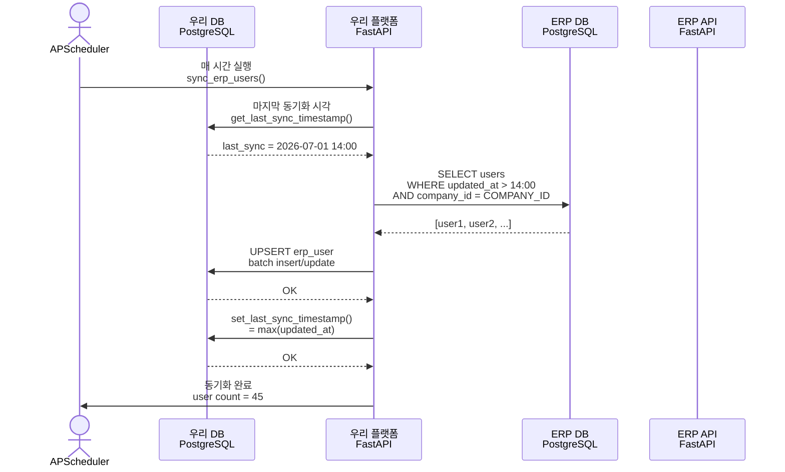
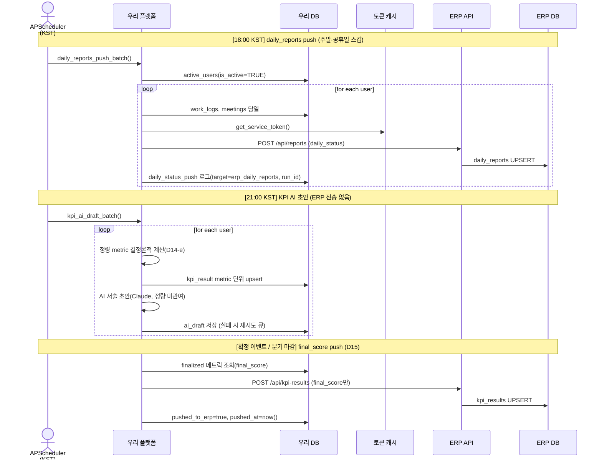

# 03. ERP 연동 명세

**가상오피스** × **DailyLog(Space-Daily)**  
ERP 데이터 동기화 및 업무/KPI 결과 역동기화 설계

**작성일**: 2026-07-02  
**버전**: 1.1

> **정본 참조**: `kpi_result` 스키마·metric 어휘 사전의 정본은 **04-data-model.md §2.5**이다(D16). 본 문서는 이를 참조만 하며 자체 스키마를 중복 정의하지 않는다. ERP kpi_results 수신 엔드포인트 정본은 **`POST /api/kpi-results`**(단건/배치 동일 경로).

---

## 1. ERP(DailyLog) 사실 요약

### 1.1 정체 및 스택

Space-Daily(이하 DailyLog, private repo `github.com/project-space-daily/space-daily`)는 멀티테넌트 기반 일일/주간 업무보고 + 근태 + AI 역량평가 시스템입니다. HR/급여/조직관리가 아닌 **업무 성과 추적 및 AI 검토 플랫폼**입니다.

| 항목 | 값 |
|------|-----|
| **Backend** | FastAPI(Python) + SQLModel/SQLAlchemy async |
| **Database** | PostgreSQL 17.5(DB명: `dailylog`) |
| **검색** | Elasticsearch 8.13 |
| **스케줄링** | APScheduler |
| **메시징** | Slack SDK |
| **AI** | Google Gemini(역량평가 ai_review 텍스트) |
| **Frontend** | Next.js(TypeScript, App Router) + TailwindCSS |
| **인증** | JWT HS256(API 키/세션 쿠키 미사용) |
| **멀티테넌트** | company_id(모든 업무 테이블에 존재) |
| **라이선스** | Private(우리 읽기: company_id 스코프만) |

### 1.2 핵심 테이블 스키마

#### **users**
```
PK: id
FK: company_id, team_id, position_id, manager_id(자기 참조)
Unique: (company_id, email)

필드:
  - id, company_id(멀티테넌트 키)
  - email(company당 unique)
  - name, team_id, role(enum: employee|leader|admin|super_admin)
  - position(자유텍스트), position_id(FK)
  - manager_id(FK users.id, 보고라인)
  - slack_user_id, github_username, jira_email
  - 근무설정: work_type, work_hours, lat, lng, radius
  - created_at, updated_at

특징: 사번(社番) 없음. 사용자 식별은 (company_id, id) 조합.
```

#### **teams**
```
PK: id
FK: company_id

필드:
  - id, company_id
  - name(팀명)
  - leader_name(자유텍스트, DB 정규화 X)
  - created_at, updated_at

특징: 2단계 구조만(회사→팀). 본부/부서/파트 계층 없음(parent_team_id 미존재).
      우리는 org_group으로 상위 그룹 얹는다.
```

#### **job_positions**
```
PK: id
FK: company_id

필드:
  - id, company_id
  - name(직급/직책명)
  - level(int, 서열)
  - created_at, updated_at
```

#### **attendances**
```
PK: id
FK: company_id, user_id

필드:
  - id, company_id, user_id
  - date(work_date, unique: (user_id, date))
  - check_in_at(UTC), check_out_at(UTC)
  - work_type(enum: office|remote)  (ERP 라이브 스키마 기준 재확인 권장)
  - created_at, updated_at

특징: 휴일 판단은 런타임 계산(db 없음). KST 타임존 하드코딩.
      휴가/병가/반차 등은 leaves 테이블 별개(leave_type: vacation|sick|half_day|other).
      벌크 조회 API 없음(GET /api/attendance/admin/record?user_id=&date= 단건만).
      우리는 DB 직접 읽어서 벌크 동기화.
```

#### **leaves**
```
PK: id
FK: company_id, user_id

필드:
  - id, company_id, user_id
  - start_date, end_date
  - leave_type(annual|sick|emergency|unpaid|...)
  - reason, approved_at, approved_by_id
  - created_at, updated_at

특징: 예정 및 이력 포함. 우리는 읽기만.
```

#### **daily_reports**
```
PK: id
FK: company_id, user_id

필드:
  - id, company_id, user_id
  - date(report_date)
  - today_work(텍스트)
  - current_tasks(JSON array)
  - blockers(텍스트)
  - tomorrow_plan(텍스트)
  - status(enum: draft|submitted|checked|blocker|missing)  (ERP 라이브 스키마 기준 재확인 권장)
  - created_at, updated_at

특징: 일일 업무 상태 기록. 우리는 3D 아바타 출근/협업 후 이 테이블로 push.
```

#### **weekly_reports** / **developer_evaluations** / **developer_daily_evaluations**
```
읽기 가능(사용자 성과/평가 참고).
developer_evaluations: ai_review(Gemini, 텍스트)만 저장.
developer_daily_evaluations: 일일 AI 초안.
```

#### **external_activities**
```
GitHub/Jira 활동 피드. APScheduler poll로 채움. 읽기만.
```

### 1.3 API 상태 (중요)

#### 읽기 가능
- `GET /api/users` → 사용자 목록(필터/페이징)
- `GET /api/teams` → 팀 목록
- `GET /api/positions` → 직급(admin 이상)
- `GET /api/leaves` → 휴가(기간/사용자 필터)
- `GET /api/attendance/admin/record?user_id=&date=` → 단건 근태

#### 쓰기 가능
- `POST /api/reports` → daily_reports 생성/수정(user JWT)

#### 문제점
- **근태 벌크 API 미존재**: attendances 기간 조회 불가 → DB 직접 읽기 필수
- **KPI 저장소 없음**: kpi_results 테이블 없고, DORA류 지표는 온더플라이 계산(미영속)
  - 우리는 신규 kpi_results 테이블 생성 + 수신 엔드포인트 신설 필요
  - **ERP 수정은 dev 브랜치(feature/virtual-office-integration)에서만 작업**
- **서비스 계정 없음**: 기계 인증용 API 키 또는 service account 개념 부재
  - JWT 토큰 기반이며 유효기간 있음(24h) → 갱신 로직 필요
- **조인키 제약**: 사번 없음 → ERP users.id를 조인키로 사용
  - (company_id, email) 조합은 테넌트 경계 초과 위험

### 1.4 멀티테넌트 정책

- **읽기**: company_id 스코프만 접근 → JWT에 company_id 포함되어야 함
- **super_admin**: X-Company-Id 헤더로 테넌트 오버라이드 가능(우리는 사용 안 함)
- **우리 스코프**: 단일 company_id(사내 도그푸딩) → 현재 버전은 멀티테넌트 미지원

---

## 2. 읽기 설계: ERP 데이터 동기화

### 2.1 원칙

- **읽기 모드**: read-only PostgreSQL 직접 접근(DailyLog DB)
- **위치**: 사내망(같은 사무실) → 대역폭/지연 문제 없음
- **스코프**: 단일 company_id(도그푸딩 기준)
- **조인키**: ERP `users.id` → 우리 `erp_user.id` 매핑
- **동기화 주기(D18)**: **매시간 증분(updated_at) + 매일 00:00 KST 전체 대사**. 전체 대사에서 하드 삭제 감지 → `is_active=false` soft-delete.
- **검증**: company_id 필터 필수 + soft-delete(D18, 물리 삭제 금지)

### 2.2 동기화 대상 및 주기 (D18)

| 엔티티 | ERP 테이블 | 동기화 주기 | 증분 전략 | 용도 |
|-------|-----------|-----------|---------|-----|
| **직원** | users | 매시간 증분 + **매일 00:00 KST 전체 대사** | updated_at(증분) / 전건 스캔(대사) | 이름/팀/직급/권한, 삭제 감지 |
| **팀** | teams | 매시간 증분 + **매일 00:00 KST 전체 대사** | updated_at(증분) / 전건 스캔(대사) | 팀 목록 + 영역 매핑, 삭제 감지 |
| **직급** | job_positions | 일 1회(새벽) | 변경 드문 항목 | 직책/등급 |
| **근태** | attendances | 매일 자정(KST) | date ≥ today - 7 | 출퇴근/근무형태 |
| **휴가** | leaves | 매시간 증분 | updated_at | 예정 및 이력 |

**전체 대사(reconciliation)의 역할(D18)**: 증분(updated_at) 동기화만으로는 ERP에서 **하드 삭제된 행을 감지할 수 없다**(삭제 시 updated_at이 남지 않음). 따라서 매일 00:00 KST에 users/teams 전건을 스캔하여 우리 DB에는 있으나 ERP에 없는 id를 찾아 `is_active=false`로 soft-delete 처리한다(물리 삭제·CASCADE 금지 — 평가 기록 영구성). 팀 소속 변경은 `user_team_history`에 이력으로 남긴다(04 §2.3).

**참고**: 근태 자정(KST) 읽기는 배치 야간 작업이며, EOD 쓰기(daily_reports KST 18:00)와는 별개 프로세스입니다.

### 2.3 읽기 구현 설계

#### 데이터 흐름
```
ERP PostgreSQL(dailylog DB)
         ↓ (read-only Postgres driver)
우리 플랫폼 서버(FastAPI)
         ↓ (변환 + 검증)
우리 DB(PostgreSQL) → erp_user, team_zone, ...
         ↓ (캐시 또는 API 응답)
우리 3D/웹 클라이언트
```

#### 동기화 알고리즘 — 매시간 증분 (D18)
```python
# Pseudocode: 직원 증분 동기화(매시간)
# 주의: 미러링 최소수집(D20-f) — slack_user_id/github_username/jira_email/lat/lng/radius는 읽지 않는다.
#       ERP 원본 읽기는 컬럼 화이트리스트 VIEW(erp_users_public)를 경유한다.

OVERLAP = timedelta(minutes=5)  # 커밋 지연 누락 방지용 중첩 윈도우

async def sync_erp_users_incremental():
    # 1. 마지막 동기화 시각 읽기(우리 DB)
    last_sync = await get_last_sync_timestamp("users")

    # 2. ERP 쿼리(company_id 스코프) — 중첩 윈도우 적용
    #    last_sync 시점에 트랜잭션이 아직 커밋되지 않은 행(updated_at은 과거지만
    #    가시성은 이후)을 놓치지 않도록 (last_sync - 5분)부터 다시 읽는다.
    #    upsert는 멱등하므로 중복 재처리는 무해하다.
    erp_users = await erp_db.query("""
        SELECT id, company_id, email, name, team_id, role, position, position_id,
               manager_id, work_type, work_hours, updated_at
        FROM erp_users_public          -- 화이트리스트 VIEW(D20-f)
        WHERE company_id = ? AND updated_at > ?
        ORDER BY updated_at ASC
    """, (COMPANY_ID, last_sync - OVERLAP))

    # 3. 변환 + Upsert(우리 DB). 팀 변경 시 user_team_history 갱신.
    for eu in erp_users:
        await upsert_erp_user(
            id=eu.id, company_id=eu.company_id, email=eu.email, name=eu.name,
            erp_team_id=eu.team_id, role=eu.role, position=eu.position,
            position_id=eu.position_id, work_type=eu.work_type, work_hours=eu.work_hours,
            is_active=True,                       # 증분에 등장 = 활성
            last_synced_at=eu.updated_at,         # UTC 저장
        )
        await record_team_change_if_moved(eu.id, eu.team_id)  # user_team_history

    # 4. 동기화 완료 시각 기록(중첩 윈도우 때문에 max는 실제 처리분 기준)
    if erp_users:
        await set_last_sync_timestamp("users", max(u.updated_at for u in erp_users))
```

#### 동기화 알고리즘 — 매일 00:00 KST 전체 대사 (D18, 삭제 감지)
```python
async def reconcile_erp_users():
    """증분이 감지 못하는 하드 삭제를 전건 대사로 감지 → soft-delete."""
    # 1. ERP 현재 전체 id 집합(company 스코프)
    erp_ids = set(await erp_db.scalars(
        "SELECT id FROM erp_users_public WHERE company_id = ?", (COMPANY_ID,)
    ))

    # 2. 우리 DB의 활성 id 집합
    our_ids = set(await our_db.scalars(
        "SELECT id FROM erp_user WHERE company_id = ? AND is_active = TRUE", (COMPANY_ID,)
    ))

    # 3. ERP에서 사라진 id → soft-delete(물리 삭제 금지)
    deleted = our_ids - erp_ids
    for uid in deleted:
        await our_db.execute(
            "UPDATE erp_user SET is_active = FALSE, updated_at = now() WHERE id = ?", (uid,)
        )
        await audit_log("erp_user_soft_deleted", entity_id=uid)

    # 4. ERP에 재등장한 비활성 id → 복원
    reappeared = erp_ids & (await inactive_ids(COMPANY_ID))
    for uid in reappeared:
        await our_db.execute("UPDATE erp_user SET is_active = TRUE WHERE id = ?", (uid,))

    # 5. 대사 실패/불일치 시 관리자 알림(D18)
    await notify_admin_if_drift(len(deleted), len(reappeared))
```

#### 근태 벌크 조회(API 미존재이므로 DB 직접)
```sql
-- ERP attendances 직접 조회(company_id + date range)
SELECT user_id, date, check_in_at, check_out_at, work_type, updated_at
FROM attendances
WHERE company_id = $1
  AND date >= $2::date AND date <= $3::date
ORDER BY date ASC, user_id ASC;
```

### 2.4 company_id 스코프 강제

**중요**: 모든 ERP 쿼리에 `WHERE company_id = ?` 필수

```python
# 안전: company_id 필터
SELECT * FROM users WHERE company_id = $COMPANY_ID AND updated_at > $last_sync

# 위험: 필터 없음(전사 데이터 노출)
SELECT * FROM users WHERE updated_at > $last_sync
```

---

## 3. 매핑 명세

ERP 필드 → 우리 필드 변환 규칙입니다.

### 3.1 사용자(users → erp_user)

| ERP users | 우리 erp_user | 비고 |
|-----------|---------------|------|
| id | id | **조인키**, Unique, Not Null (BIGINT, ERP 원본 타입) |
| company_id | company_id | 멀티테넌트 스코프 (INTEGER, ERP 원본 타입) |
| email | email | (company_id, email) Unique in ERP |
| name | name | 이름 |
| team_id | erp_team_id | → 우리 team_zone 조인 |
| role | role | enum: employee\|leader\|admin\|super_admin |
| position_id | position_id | FK job_positions |
| position(text) | position | 자유텍스트 |
| manager_id | manager_id | FK erp_user(id) = 보고라인 |
| work_type | work_type | office\|remote |
| work_hours | work_hours | **INT(분 단위)** 저장. ERP가 "09:00-18:00" 문자열이면 파싱 규칙(종료-시작 분 환산) 적용 |
| updated_at | last_synced_at | 동기화 시각(UTC) |
| (없음) | created_at | 우리가 추가(UTC) |
| (없음) | is_active | soft-delete 플래그(D18, 전체 대사에서 갱신) |

**미러링 최소수집(D20-f)**: `slack_user_id·github_username·jira_email`은 우리 KPI/공간 기능에 불필요하므로 **미러링하지 않는다**(컬럼 화이트리스트 VIEW `erp_users_public`에서 제외). `lat·lng·radius`(GPS)는 **수집·미러링 전면 금지**(D20-c, GPS 기능 폐기). ERP 원본 읽기는 반드시 화이트리스트 VIEW를 경유한다.

### 3.2 팀(teams → team_zone + org_group)

ERP teams는 리프(leaf) 노드입니다. 상위 그룹(본부/부서)은 우리가 얹습니다.

| ERP teams | 우리 team_zone | 우리 org_group |
|-----------|----------------|---|
| id | erp_team_id | (없음) |
| company_id | company_id | company_id |
| name | (참조) | (참조) |
| leader_name | leader_name | (없음) |
| | team_zone_id(PK) | id(PK, 상위) |
| | office_id | type[division\|department\|part] |
| | floor_id | name |
| | zone_label | color |
| | color | parent_id(자기 FK) |
| | polygon/coords | sort_order |

**매핑 이예**:
```
ERP teams(영업팀)
  ↓ 우리
team_zone(id=10, erp_team_id=5, zone_label="영업팀_3층", office_id=1, floor_id=2)
  ↓ 상위 그룹
org_group(id=1, name="영업본부", type="division", parent_id=NULL, color="#FF5733")
org_group(id=2, name="직판팀", type="department", parent_id=1, color="#FFAA33")
  ↓ 팀(우리 team_zone이 FK)
team_zone.org_group_id = 2
```

### 3.3 직급(job_positions)

| ERP job_positions | 우리 저장 위치 |
|------------------|---------|
| id | erp_user.position_id 참조 |
| name | 직급명 |
| level | 서열 정렬용 |

조회: `GET /api/positions` 사용 또는 DB 직접.

### 3.4 근태(attendances)

| ERP attendances | 우리 저장(참고용) |
|-----------------|--------|
| user_id | user_id FK erp_user.id |
| date | work_date |
| check_in_at | check_in_time |
| check_out_at | check_out_time |
| work_type | work_type(enum) |

**우리 사용 (v1)**: 출퇴근 시각 및 근무형태는 ERP attendances를 read-only로만 읽음. 우리는 check_in/out을 쓰지 않으며, 공식 출퇴근은 ERP가 원본. 3D 프레즌스는 별도 상태로 관리(로그인→online, 구역 도착→working, 회의실 입장→meeting, 무입력→away, 집중모드→focus, 로그아웃→offline).

### 3.5 휴가(leaves)

| ERP leaves | 우리 저장(참고용) |
|-----------|--------|
| user_id | user_id FK erp_user.id |
| start_date, end_date | leave_start, leave_end |
| leave_type | type |

**우리 사용**: 직원 부재 상태 표시, KPI 계산 제외.

---

## 4. 쓰기 설계: 우리 → ERP 역동기화

### 4.1 2가지 채널

#### (1) 일일 업무 상태 → daily_reports

우리 플랫폼의 3D 활동/회의/협업을 종합하여 일일 상태를 ERP로 전송합니다.

**흐름**:
```
우리 work_log + meeting_minute + 자동 상태 판단
  ↓ (변환)
daily_reports JSON 생성
  ↓ (EOD 배치)
POST /api/reports → ERP daily_reports 테이블
  ↓
ERP 내 일일/주간 리포트 및 AI 역량평가 입력 자료
```

**API(ERP 기존)**:
```
POST /api/reports
Authorization: Bearer <JWT>
X-Company-Id: (자동 또는 JWT에서 추출)

Request Body:
{
  "date": "2026-07-01",
  "today_work": "3D 회의실에서 아키텍처 검토(1.5h), 협업 노트 작성",
  "current_tasks": [
    {"title": "백엔드 KPI 엔드포인트 개발", "progress": 75},
    {"title": "프론트 KPI 리뷰 UI", "progress": 50}
  ],
  "blockers": "없음",
  "tomorrow_plan": "KPI 통합테스트 + ERP 양방향 검증",
  "status": "submitted"
}

Response:
{
  "id": 123,
  "user_id": 5,
  "date": "2026-07-01",
  "status": "submitted",
  "created_at": "2026-07-01T17:00:00Z"
}
```

#### (2) KPI 결과 → kpi_results (신설)

우리가 산출한 KPI(협업/회의/성과)를 ERP로 전송합니다.

**배경**: ERP에는 kpi_results 테이블 & 수신 엔드포인트 없음 → **우리가 신설해야 함** (ERP dev 브랜치).

**흐름(D15·D17)**:
```
우리 work_log + meeting_minute 기여 + action_item 이행률 (결정론적 계산)
  ↓ (KPI 산출 + AI 서술 초안)
kpi_result 레코드 생성(우리 DB) → 관리자 검토 → 이의신청 → 확정(final_score)
  ↓ (확정 이벤트 + 분기 마감 배치)
POST /api/kpi-results → ERP kpi_results  (final_score만 전송, ai_draft 미전송)
  ↓
ERP 분기별 인사평가 자료
```

**신규 API(ERP에 추가할 것, 정본 표준 경로: `POST /api/kpi-results` — 단건/배치 동일)**:
```
POST /api/kpi-results
Authorization: Bearer <ServiceAccount JWT>
X-Company-Id: <company_id>

Request Body (롱포맷: 한 사용자의 확정 메트릭을 배열로. metric 어휘는 04 §2.5 정본):
{
  "user_id": 5,
  "period_type": "quarterly",
  "period_key": "2026-Q3",
  "metrics": [
    {"metric": "work_completed_count",     "value": 42},
    {"metric": "work_quality_score",       "value": 78.0},
    {"metric": "minutes_authored_count",   "value": 11},
    {"metric": "action_items_completed",   "value": 18},
    {"metric": "action_items_ontime_rate", "value": 83.0},
    {"metric": "report_fidelity_score",    "value": 74.0},
    {"metric": "collaboration_score",      "value": 81.0},
    {"metric": "quarterly_total",          "value": 504.0}
  ],
  "source": "virtual_office"
}

Response (저장 결과):
{
  "user_id": 5,
  "period_type": "quarterly",
  "period_key": "2026-Q3",
  "metrics_count": 8,
  "status": "success",
  "created_at": "2026-07-01T17:00:00Z"
}
```

**주의**: ERP kpi_results는 스칼라 테이블(metric VARCHAR + value FLOAT)이며 **확정 점수(final_score)만** 저장한다(D15). AI 초안(ai_draft)·관리자 검토·이의신청 워크플로우 필드는 우리 플랫폼 DB의 `kpi_result` 테이블에 **인라인**되어 관리한다(04 §2.5 정본). **`kpi_result_review` 테이블은 폐기되었다**(D16).

---

## 5. ERP dev 브랜치 변경사항(feature/virtual-office-integration)

**원칙**: ERP main은 건드리지 않음. 사용자가 ERP git 접근권한을 보유하므로 우리가 직접 `feature/virtual-office-integration` 브랜치를 만들어 작업하고, 외부 담당자 병합 대기는 불필요.

### 5.1 신규 테이블: kpi_results

**정본 기준**: ERP kpi_results는 스칼라 스키마(metric VARCHAR + value FLOAT) 사용, **확정 점수만** 저장. period는 `period_type` + `period_key`로 분리(D16). ai_draft/admin_*/이의신청 워크플로우는 우리 플랫폼 DB `kpi_result`에 인라인(04 §2.5). `kpi_result_review` 테이블은 폐기(D16).

**Alembic 마이그레이션**:
```python
# alembic/versions/0010_add_kpi_results.py

def upgrade():
    op.create_table(
        'kpi_results',
        sa.Column('id', sa.Integer, primary_key=True, index=True),
        sa.Column('company_id', sa.Integer, nullable=False),
        sa.Column('user_id', sa.Integer, nullable=False, index=True),
        sa.Column('period_type', sa.String(20), nullable=False),  # "daily" | "quarterly"
        sa.Column('period_key', sa.String(20), nullable=False),   # "2026-07-01" | "2026-Q3"
        sa.Column('metric', sa.String(100), nullable=False),      # 04 §2.5 metric 어휘 사전
        sa.Column('value', sa.Float, nullable=False),             # 확정 점수(final_score)
        sa.Column('source', sa.String(50), nullable=False),       # "virtual_office"
        sa.Column('created_at', sa.DateTime, server_default=sa.func.now()),
        sa.Column('updated_at', sa.DateTime, server_default=sa.func.now()),
        sa.ForeignKeyConstraint(['company_id'], ['companies.id']),
        sa.ForeignKeyConstraint(['user_id'], ['users.id']),
        sa.UniqueConstraint('company_id', 'user_id', 'period_type', 'period_key', 'metric',
                            name='uq_kpi_metric')
    )
    op.create_index('idx_kpi_results_company', 'kpi_results', ['company_id'])
    op.create_index('idx_kpi_results_user_period', 'kpi_results', ['user_id', 'period_key'])

def downgrade():
    op.drop_table('kpi_results')
```

**SQLModel 정의**:
```python
# app/models/tables.py

from sqlmodel import SQLModel, Field
from datetime import datetime, date

class KPIResult(SQLModel, table=True):
    __tablename__ = "kpi_results"

    id: int | None = Field(default=None, primary_key=True)
    company_id: int
    user_id: int = Field(foreign_key="users.id")
    period_type: str   # "daily" | "quarterly"
    period_key: str    # "2026-07-01" | "2026-Q3"
    metric: str        # 04 §2.5 metric 어휘 사전(work_completed_count 등)
    value: float       # 확정 점수 (final_score)
    source: str = "virtual_office"
    created_at: datetime = Field(default_factory=datetime.utcnow)
    updated_at: datetime = Field(default_factory=datetime.utcnow)

# 주의: ai_draft/admin_adjusted_score/admin_note/objection_*/final_score/finalized_at 등
#       리뷰·이의신청 워크플로우 필드는 우리 플랫폼 DB의 kpi_result 테이블에 인라인(04 §2.5 정본).
#       ERP kpi_results는 확정 메트릭 저장소일 뿐이며, kpi_result_review 테이블은 폐기됨(D16).
```

### 5.2 신규 엔드포인트

**경로(정본)**: `POST /api/kpi-results` (단건/배치 동일 경로)

**역할**: 우리 플랫폼이 관리자 확정 이벤트 + 분기 마감 배치로 호출. 서비스계정 JWT 인증 필수.

**요청**:
```python
class KPIMetricItem(BaseModel):
    metric: str   # 04 §2.5 metric 어휘 사전
    value: float  # 확정 점수

class KPIResultBatch(BaseModel):
    user_id: int
    period_type: str  # "daily" | "quarterly"
    period_key: str   # "2026-07-01" | "2026-Q3"
    metrics: list[KPIMetricItem]  # 배열: 확정 메트릭 (롱포맷)
    source: str = "virtual_office"

@router.post("/kpi-results", response_model=dict)
async def create_kpi_results(
    req: KPIResultBatch,
    current_user: User = Depends(get_current_user),  # 서비스계정
    db: AsyncSession = Depends(get_db)
):
    # 권한: service account 또는 admin 이상만 허용
    if current_user.type not in ["service", "admin"]:
        raise HTTPException(status_code=403, detail="Forbidden")

    # user_id 존재 검증
    user = await db.execute(select(User).where(User.id == req.user_id))
    if not user.scalars().first():
        raise HTTPException(status_code=409, detail="User not found")

    # 스칼라 행: 각 metric마다 upsert. UNIQUE(company_id, user_id, period_type, period_key, metric)
    saved = []
    for metric_item in req.metrics:
        existing = await db.execute(
            select(KPIResult).where(
                (KPIResult.company_id == current_user.company_id) &
                (KPIResult.user_id == req.user_id) &
                (KPIResult.period_type == req.period_type) &
                (KPIResult.period_key == req.period_key) &
                (KPIResult.metric == metric_item.metric) &
                (KPIResult.source == "virtual_office")
            )
        )
        existing_kpi = existing.scalars().first()

        if existing_kpi:
            # 기존 행 업데이트(재push = 정정 반영, upsert 멱등)
            existing_kpi.value = metric_item.value
            existing_kpi.updated_at = datetime.utcnow()
            db.add(existing_kpi)
            saved.append(existing_kpi.id)
        else:
            new_kpi = KPIResult(
                company_id=current_user.company_id,
                user_id=req.user_id,
                period_type=req.period_type,
                period_key=req.period_key,
                metric=metric_item.metric,
                value=metric_item.value,
                source="virtual_office",
            )
            db.add(new_kpi)
            await db.flush()  # ID 할당
            saved.append(new_kpi.id)

    await db.commit()

    return {
        "user_id": req.user_id,
        "period_type": req.period_type,
        "period_key": req.period_key,
        "metrics_count": len(req.metrics),
        "saved_ids": saved,
        "status": "success"
    }
```

**에러 처리**:
- `400`: 잘못된 metric/value 스키마(metric 어휘 사전 외 값 거부)
- `401`: JWT 만료 또는 미인증
- `403`: 권한 부족(서비스계정/admin 아님)
- `409`: user_id가 존재하지 않음

### 5.3 서비스 계정 설정

**목적**: 우리 플랫폼이 EOD 배치에서 안전하게 KPI 전송.

**주의(보안)**: 우리가 전역 JWT 시크릿(ERP SECRET_KEY)을 보유하면 임의 user_id 토큰 위조 가능 → 방지 필수.

**ERP dev 브랜치에 신설 필요**:
```python
# app/models/tables.py (ERP dev 브랜치)

class ServiceAccount(SQLModel, table=True):
    __tablename__ = "service_accounts"
    
    id: int | None = Field(default=None, primary_key=True)
    company_id: int
    name: str  # "virtual_office_integration"
    secret_hash: str  # bcrypt(secret_key) - ERP가 생성, 우리는 미보유
    role: str = "admin"  # KPI 쓰기 권한
    is_active: bool = True
    created_at: datetime
    updated_at: datetime
```

**안전한 패턴: ERP 토큰 발급 엔드포인트**:
```python
# ERP 신규 엔드포인트: POST /api/auth/service-token (dev 브랜치)
@router.post("/auth/service-token", response_model=dict)
async def issue_service_token(
    service_name: str,  # "virtual_office_integration"
    service_secret: str,  # 우리가 제공한 시크릿(bcrypt 검증)
    db: AsyncSession = Depends(get_db)
):
    """서비스계정이 토큰을 받아감(우리가 직접 발급하지 않음)"""
    
    # service_accounts 테이블 조회
    service = await db.execute(
        select(ServiceAccount).where(
            ServiceAccount.name == service_name &
            ServiceAccount.is_active == True
        )
    )
    service_account = service.scalars().first()
    
    if not service_account or not bcrypt.verify(service_secret, service_account.secret_hash):
        raise HTTPException(status_code=401, detail="Invalid credentials")
    
    # JWT 발급(ERP가 관리하는 시크릿으로 서명)
    payload = {
        "sub": service_name,
        "company_id": service_account.company_id,
        "type": "service",
        "iat": datetime.utcnow(),
        "exp": datetime.utcnow() + timedelta(hours=24)
    }
    token = jwt.encode(payload, os.getenv("SECRET_KEY"), algorithm="HS256")
    
    return {
        "access_token": token,
        "token_type": "bearer",
        "expires_in": 86400  # 24h
    }
```

**우리 쪽 사용(안전한 모델)**:
```python
# 우리 플랫폼 → ERP KPI 전송
async def get_service_token() -> str:
    """ERP에 service_secret을 제시해 토큰을 받음(직접 발급 안 함)"""
    
    # 캐시 확인(TTL < 1시간)
    cached = cache.get("erp_service_token")
    if cached and not is_expired(cached):
        return cached
    
    # ERP 토큰 엔드포인트 호출
    service_secret = os.getenv("ERP_SERVICE_SECRET")  # 우리가 보유(bcrypt 등록용)
    async with httpx.AsyncClient() as client:
        resp = await client.post(
            f"{ERP_BASE_URL}/api/auth/service-token",
            json={
                "service_name": "virtual_office_integration",
                "service_secret": service_secret
            }
        )
    
    if resp.status_code != 200:
        raise Exception(f"ERP token issuance failed: {resp.text}")
    
    token = resp.json()["access_token"]
    cache.set("erp_service_token", token, ttl=3600)  # 1시간 캐시
    return token

async def push_kpi_to_erp(kpi_data):
    # ERP 토큰 획득(우리가 발급하지 않음)
    token = await get_service_token()
    
    # ERP에 POST (정본 경로: /api/kpi-results)
    async with httpx.AsyncClient() as client:
        resp = await client.post(
            f"{ERP_BASE_URL}/api/kpi-results",
            json=kpi_data,
            headers={"Authorization": f"Bearer {token}"}
        )
        return resp.json()
```

**원칙**: 우리는 시크릿(service_secret)만 보유, JWT 발급은 ERP가 담당 → 위조 불가.

---

## 6. 배치 설계 (D17)

### 6.1 배치 스케줄 (3단계 분리)

D17에 따라 배치를 목적별로 분리한다. **daily_reports push와 KPI AI 초안 생성은 서로 다른 시각**이며(순환 의존 제거), kpi_results ERP push는 배치가 아니라 **관리자 확정 이벤트 + 분기 마감**에 발생한다.

| 배치 | 시각(KST) | 대상 | 비고 |
|------|----------|------|------|
| **daily_reports push** | 매일 18:00 | 당일 work_log·meeting 요약 → ERP daily_reports | 18:00 이후 활동은 익일 귀속. **주말·공휴일 스킵** |
| **KPI AI 초안 생성** | 매일 21:00 | 당일 kpi_result(정량 계산) + AI 서술 초안 | 검토 대기 상태로 저장. ERP 전송 안 함 |
| **kpi_results ERP push** | 이벤트/분기 마감 | 관리자 확정(finalized) + 분기 마감 배치 | `final_score`만 전송(D15) |

```python
# 우리 플랫폼 APScheduler (모든 시각은 KST 기준으로 등록, 내부 저장은 UTC)

scheduler.add_job(daily_reports_push_batch, trigger="cron",
                  hour=18, minute=0, timezone="Asia/Seoul")   # 18:00 KST
scheduler.add_job(kpi_ai_draft_batch,      trigger="cron",
                  hour=21, minute=0, timezone="Asia/Seoul")   # 21:00 KST
scheduler.add_job(kpi_quarterly_push_batch, trigger="cron",
                  hour=15, minute=0, day="last", month="3,6,9,12", timezone="Asia/Seoul")  # 분기 마감
```

**주말·공휴일 스킵**: `daily_reports_push_batch`는 실행일이 토·일 또는 공휴일이면 즉시 반환한다(공휴일은 런타임 계산 또는 ERP leaves/휴일 규칙 참조).

### 6.2 배치 흐름

```
[18:00 daily_reports_push_batch]
  advisory lock 획득(pg_advisory_lock) → 동시 실행 방지
  run_id = uuid4()
  for user in active_users (is_active=TRUE):
    - work_log 당일 요약 + meeting 요약 → daily_reports JSON
    - POST /api/reports (target=erp_daily_reports) ← service account JWT
    - daily_status_push 로그(run_id, target, status)
  실패분 → target별 재시도 큐(지수 백오프, 최대 3회)

[21:00 kpi_ai_draft_batch]
  advisory lock 획득 → run_id = uuid4()
  for user in active_users:
    - 정량 metric 계산(결정론적 코드, D14-e) → kpi_result upsert(metric 단위)
    - AI 서술 초안 호출(Claude)
        · 성공 → ai_draft 저장
        · 실패 → 메트릭은 이미 저장됨, ai_draft만 재시도 큐로(폴백)
  ERP 전송 없음(검토 대기 상태)

[확정 이벤트 / 분기 마감 → kpi push]
  관리자 확정(finalized_at 설정) 또는 분기 마감 배치:
    - final_score만 모아 POST /api/kpi-results (metric 단위 upsert)
    - 정정 발생 시 재push(upsert로 덮어씀)
```

**설계 원칙**:
- 멱등성: metric 단위 upsert + 배치 `run_id` + advisory lock(동시 실행 방지)
- 부분 성공: 한 명 실패해도 배치 중단하지 않음. target별 재시도 분리.
- ERP kpi_results 미준비 시: feature flag OFF → 로컬 적재 → 준비 후 backfill(§6.5)

### 6.3 구현 예시

#### 6.3.1 daily_reports push (18:00 KST)

```python
# 우리 플랫폼 backend/app/workers/daily_reports_batch.py

async def daily_reports_push_batch():
    """매일 18:00 KST: 당일 업무 요약 → ERP daily_reports. 주말·공휴일 스킵."""
    if is_weekend_or_holiday(today_kst()):
        logger.info("daily_reports batch skipped (weekend/holiday)")
        return

    # 동시 실행 방지(advisory lock) + 배치 실행 식별자
    async with pg_advisory_lock(LOCK_DAILY_REPORTS):
        run_id = uuid4()
        users = await get_active_users(company_id=COMPANY_ID)  # is_active=TRUE
        results = {"success": 0, "failed": 0}

        for user in users:
            try:
                work_logs = await collect_work_logs(user.id, today_kst())
                meetings = await collect_meetings(user.id, today_kst())
                daily_status = {
                    "today_work": summarize_work(work_logs, meetings),
                    "current_tasks": format_tasks(work_logs),
                    "blockers": extract_blockers(work_logs),
                    "tomorrow_plan": extract_tomorrow_plan(work_logs),
                    "status": "submitted",
                }
                resp = await push_daily_report_to_erp(user_id=user.id, data=daily_status)
                await upsert_push_log(user.id, target="erp_daily_reports",
                                      run_id=run_id, payload=daily_status, resp=resp)
                results["success"] += 1
            except Exception as e:
                results["failed"] += 1
                await upsert_push_log(user.id, target="erp_daily_reports", run_id=run_id,
                                      status="failed", error_message=str(e))
                await enqueue_retry(user.id, today_kst(), target="erp_daily_reports")
                logger.error(f"daily_reports push failed for user {user.id}: {e}")

        if results["failed"] > 0:
            await notify_admin(results)
```

#### 6.3.2 KPI AI 초안 생성 (21:00 KST)

```python
# 우리 플랫폼 backend/app/workers/kpi_ai_draft_batch.py

async def kpi_ai_draft_batch():
    """매일 21:00 KST: 정량 metric은 결정론적 코드로 계산(D14-e), AI는 서술만.
       AI 실패 시 메트릭은 저장하고 draft만 재시도 큐로(폴백). ERP 전송 없음."""
    async with pg_advisory_lock(LOCK_KPI_DRAFT):
        run_id = uuid4()
        users = await get_active_users(company_id=COMPANY_ID)

        for user in users:
            work_logs = await collect_work_logs(user.id, today_kst())
            meetings = await collect_meetings(user.id, today_kst())
            action_items = await get_action_items(user.id, today_kst())

            # (1) 정량 metric: 결정론적 계산 → metric 단위 upsert (04 §2.5 어휘)
            metrics = compute_daily_metrics(work_logs, meetings, action_items)
            # metrics = {"work_completed_count": .., "work_quality_score": ..,
            #            "minutes_authored_count": .., "action_items_completed": ..,
            #            "action_items_ontime_rate": .., "report_fidelity_score": ..,
            #            "collaboration_score": ..}
            await upsert_kpi_metrics(
                user_id=user.id, period_type="daily", period_key=today_kst().isoformat(),
                metrics=metrics, run_id=run_id,
            )

            # (2) AI 서술 초안: 정량에 관여하지 않음. 실패해도 메트릭은 이미 저장됨.
            try:
                ai_draft = await generate_ai_narrative(user, metrics)  # 강점/개선/근거만
                await save_ai_draft(user.id, "daily", today_kst().isoformat(), ai_draft)
            except Exception as e:
                await enqueue_ai_draft_retry(user.id, "daily", today_kst().isoformat())
                logger.warning(f"AI draft deferred for user {user.id}: {e}")
```

**핵심 개선점(구 설계 대비)**:
- ERP push는 이 배치에서 하지 않는다(검토 대기). 확정 이벤트/분기 마감에만 push(D15·D17).
- `ai_draft`를 ERP로 보내지 않는다(D15). ERP에는 확정 `final_score`만 전송.
- 정량 점수는 결정론적 코드가 계산하고 AI는 서술만 생성한다(D14-e, 재현 가능성 = 감사 요건).
- metric은 dict 전체를 한 컬럼에 대입하지 않고 **metric 단위 행 upsert**로 저장한다(§6.4).
- AI 호출 실패는 폴백 처리(메트릭 저장 + draft 재시도 큐).

### 6.4 멱등성 및 재시도

**멱등 upsert (metric 단위)**: 구 설계는 `metric` 컬럼에 dict 전체를 대입하고 `kpi_date`만으로 조회하여 **metric 차원이 누락**되는 결함이 있었다. 정본 롱포맷(04 §2.5)에 맞춰 **metric 한 개당 한 행**을 upsert한다. UNIQUE 키는 `(user_id, period_type, period_key, metric)`.

```python
# 우리 DB kpi_result: metric 단위 멱등 upsert
async def upsert_kpi_metrics(user_id, period_type, period_key, metrics: dict, run_id):
    for metric_name, value in metrics.items():
        stmt = pg_insert(KpiResult).values(
            user_id=user_id, period_type=period_type, period_key=period_key,
            metric=metric_name, value=value, source="virtual_office",
        ).on_conflict_do_update(
            index_elements=["user_id", "period_type", "period_key", "metric"],
            set_={"value": value, "updated_at": func.now()},
        )
        await db.execute(stmt)
    await db.commit()
```

**확정 점수 ERP push (D15)**: 관리자 확정 시 `final_score`만 전송한다. `ai_draft`는 전송하지 않는다. 정정 시 재push(upsert로 덮어씀).

```python
async def push_finalized_kpi_to_erp(user_id, period_type, period_key):
    rows = await db.execute(select(KpiResult).where(
        (KpiResult.user_id == user_id) &
        (KpiResult.period_type == period_type) &
        (KpiResult.period_key == period_key) &
        (KpiResult.finalized_at.isnot(None))
    ))
    metrics = [{"metric": r.metric, "value": r.final_score} for r in rows.scalars()]
    if not metrics:
        return  # 미확정분은 전송 안 함
    if not FEATURE_ERP_KPI_ENABLED:          # ERP 미준비 시 로컬 적재만(§6.5)
        await stage_for_backfill(user_id, period_type, period_key, metrics)
        return
    await push_kpi_to_erp(user_id=user_id, period_type=period_type,
                          period_key=period_key, metrics=metrics)  # POST /api/kpi-results
```

**재시도 정책(단일화)**: 지수 백오프, **최대 3회**. daily_reports/kpi_results **target별로 분리**하여 재시도한다(04 daily_status_push.target 활용). 재시도가 다음날 정규 배치와 겹치면 **정규 배치가 upsert로 이긴다**(최신 계산이 우선).

```python
async def retry_failed_pushes():
    """실패 항목을 target별로 지수 백오프 재시도(최대 3회)."""
    for item in await get_retry_items(max_retries=3):
        try:
            if item.target == "erp_daily_reports":
                await push_daily_report_to_erp(item.user_id, item.payload)
            elif item.target == "erp_kpi_results":
                await push_kpi_to_erp(**item.payload)
            await mark_retry_resolved(item.id)
        except Exception as e:
            await bump_retry(item.id, backoff=2 ** item.retry_count)  # 지수 백오프
            if item.retry_count + 1 >= 3:
                await notify_admin_retry_exhausted(item)  # 수동 개입
```

**부분 성공 처리**:
- daily_reports 실패, kpi_results 성공(또는 반대) → target별 독립 재시도, 배치 중단 X
- 한 명 실패 → 다음 사용자 계속

### 6.5 ERP kpi_results 미준비 시 폴백 (feature flag + backfill)

ERP `feature/virtual-office-integration` 브랜치의 kpi_results 테이블/엔드포인트가 아직 배포 전이면, `FEATURE_ERP_KPI_ENABLED=false`로 두고 **확정 점수를 로컬 스테이징 테이블에 적재**한다. ERP 준비 완료 후 backfill 배치가 스테이징분을 `POST /api/kpi-results`로 순차 전송하고 성공분을 `pushed_to_erp=true`로 마킹한다.

```python
async def backfill_kpi_to_erp():
    """ERP 준비 완료 후 미전송 확정분을 순차 전송(멱등 upsert)."""
    if not FEATURE_ERP_KPI_ENABLED:
        return
    for batch in await get_staged_finalized_unpushed():   # pushed_to_erp=false & finalized
        await push_kpi_to_erp(**batch)
        await mark_pushed(batch.ids)
```

이 절은 13-risks 및 §12 Open Question(ERP dev 브랜치 배포 타이밍)과 연결된다.

---

## 7. 인증·보안·제약 대응

### 7.1 JWT 인증

#### ERP → 우리: 읽기(DB 직접)
```
제약: DB 비밀번호 환경변수로 관리.
방식: read-only 계정(SELECT only, 쓰기 권한 없음).
사내망 제한.
```

#### 우리 → ERP: 쓰기(API)
```
방식 A: 사용자 JWT (단기, 부분 지원)
  - user JWT(24h 유효)로 daily_reports 전송.
  - 문제: 배치는 특정 사용자 맥락 없음 → daily_reports 대리 작성 필요.
  - 검증: ERP POST /api/reports 엔드포인트 수정 필요 여부 확인 필수.

방식 B: 서비스계정 JWT (권장, KPI 전용)
  - ERP가 서비스계정 토큰 발급 엔드포인트(POST /api/auth/service-token) 제공.
  - 우리는 service_secret만 보유, ERP가 JWT 발급 → 위조 방지.
  - 24h 유효, 자동 갱신, 캐시.
  - ERP 서비스계정 테이블 필수(dev 브랜치).
```

**구현 (안전한 모델 - §5.3 참조)**:
```python
# 우리 플랫폼: 서비스 토큰 획득(직접 발급 X, ERP에서 받음)

async def get_service_token() -> str:
    """ERP 토큰 엔드포인트에서 토큰 획득(캐시 포함)"""
    
    # 캐시 확인(TTL < 1시간)
    cached = cache.get("erp_service_token")
    if cached and not is_expired(cached):
        return cached
    
    # ERP 토큰 엔드포인트 호출(우리는 시크릿만 제시)
    service_secret = os.getenv("ERP_SERVICE_SECRET")
    async with httpx.AsyncClient() as client:
        resp = await client.post(
            f"{ERP_BASE_URL}/api/auth/service-token",
            json={
                "service_name": "virtual_office_integration",
                "service_secret": service_secret
            }
        )
    
    if resp.status_code != 200:
        raise Exception(f"ERP token issuance failed: {resp.text}")
    
    token = resp.json()["access_token"]
    cache.set("erp_service_token", token, ttl=3600)  # 1시간 캐시
    
    cache.set("erp_service_token", token, ttl=3600)  # 1시간
    return token
```

### 7.2 company_id 검증

```python
# 모든 ERP 쿼리에서:

# GOOD: company_id 필터
SELECT * FROM users
WHERE company_id = $1
  AND updated_at > $2

# BAD: 필터 없음
SELECT * FROM users
WHERE updated_at > $1
```

### 7.3 스키마 드리프트 대응

**문제**: ERP가 테이블 구조 변경 → 우리 동기화 깨짐.

**대응**:
```python
# 1. 마이그레이션 추적: alembic version 확인
async def check_erp_schema_version():
    result = await erp_db.execute(
        "SELECT version_num FROM alembic_version ORDER BY version_num DESC LIMIT 1"
    )
    erp_version = result.scalar()
    
    # 우리 예상 버전과 비교
    if erp_version < EXPECTED_MIN_ERP_VERSION:
        raise SchemaVersionError(f"ERP schema too old: {erp_version}")

# 2. 필드 가용성 확인: introspection
async def validate_erp_tables():
    inspector = inspect(erp_engine)
    users_cols = {c['name'] for c in inspector.get_columns('users')}

    required = {'id', 'company_id', 'email', 'name', 'team_id', 'updated_at'}
    if not required.issubset(users_cols):
        raise MissingColumnError(f"Missing columns: {required - users_cols}")

    # kpi_results 테이블 존재 검사(ERP dev 브랜치 배포 여부 확인)
    if FEATURE_ERP_KPI_ENABLED and not inspector.has_table('kpi_results'):
        raise MissingTableError("ERP kpi_results table not deployed — set FEATURE_ERP_KPI_ENABLED=false and use backfill (§6.5)")
    if inspector.has_table('kpi_results'):
        kpi_cols = {c['name'] for c in inspector.get_columns('kpi_results')}
        kpi_required = {'company_id', 'user_id', 'period_type', 'period_key', 'metric', 'value', 'source'}
        if not kpi_required.issubset(kpi_cols):
            raise MissingColumnError(f"kpi_results missing: {kpi_required - kpi_cols}")

# 3. 배치 시작 전 validation
async def kpi_quarterly_push_batch():
    try:
        await validate_erp_tables()
        # ... 계속
    except (SchemaVersionError, MissingTableError, MissingColumnError) as e:
        logger.error(f"ERP schema mismatch: {e}. Skipping push (staging for backfill).")
        await notify_admin(f"ERP schema mismatch: {e}")
        return
```

### 7.4 근태 벌크 API 부재 대응

**ERP**: attendances 범위 조회 API 없음 (`GET /api/attendance/admin/record?user_id=&date=` 단건만).

**우리 해결책**:
```
1. DB 직접 읽기(read-only 계정, SELECT only)
2. 매일 자정 후 지난 7일 attendances 동기화
3. 변경 감지: updated_at 기반(ERP에서 수정되지 않는 과거 데이터는 sync 스킵)
```

**구현**:
```python
async def sync_attendances():
    # 지난 7일 attendances 범위 조회
    today = datetime.now().date()
    week_ago = today - timedelta(days=7)
    
    query = """
    SELECT user_id, date, check_in_at, check_out_at, work_type
    FROM attendances
    WHERE company_id = $1
      AND date >= $2 AND date <= $3
      AND updated_at >= (NOW() - INTERVAL '24 hours')
    ORDER BY date ASC, user_id ASC
    """
    
    rows = await erp_db.fetch(query, COMPANY_ID, week_ago, today)
    
    for row in rows:
        await upsert_attendance_record(row)
```

### 7.5 사번(社番) 부재 대응

**ERP**: users 테이블에 사번 필드 없음 → (company_id, email) 또는 id로만 식별.

**우리 전략**:
```
1. ERP users.id를 PK로 저장(erp_user.id)
2. email은 참고용(company_id, email unique in ERP, but NOT globally)
3. 조인: erp_user.id = user_id(FK)
```

**주의**:
```python
# GOOD: ERP users.id로 조인
await db.query("""
    SELECT e.name
    FROM erp_user e
    WHERE e.id = ?
""", user_id)

# BAD: email로만 조인(테넌트 충돌 위험)
await db.query("""
    SELECT e.name
    FROM erp_user e
    WHERE e.email = ?
""", email)  # 다른 회사도 같은 email 가능
```

---

## 8. 동기화 & 배치 시퀀스 다이어그램

### 8.1 실시간 읽기 동기화



### 8.2 배치 흐름(D17 — 3단계 분리)



---

## 9. 추가 고려사항

### 9.1 타임존
- ERP: KST 하드코딩(attendances check_in_at/check_out_at는 UTC 저장)
- 우리: UTC 기반 + 표시는 KST 변환

### 9.2 성능
- 동기화 범위: 증분(updated_at > last_sync)로 최소화
- 근태: 주 1회 전체 재점검(drift 방지)
- KPI 산출: AI 요청(Claude)이 가장 느림(~2초/user) → 병렬화 고려

### 9.3 감사 로그
```python
# 우리 audit_log에 모든 ERP 동기화/푸시 기록
class AuditLog(SQLModel, table=True):
    id: int | None = Field(default=None, primary_key=True)
    action: str  # "erp_sync_users" | "eod_push_kpi"
    user_id: int | None  # NULL이면 배치
    target_table: str  # "users" | "kpi_results"
    record_id: int | None
    details: dict  # {"sync_count": 45, "updated_at": "2026-07-01"}
    status: str  # "success" | "partial" | "failed"
    created_at: datetime
```

### 9.4 모니터링
- 동기화 지연: last_sync vs now() > 2시간 → 알림
- EOD 배치 성공률: 목표 99% → 실패 시 관리자 알림
- ERP API 응답시간: > 5초 → 로그 기록

---

## 10. 부록: 필드 상세 명세

### 10.1 일일상태(daily_reports) 스키마

| 필드 | 타입 | 출처 | 예시 |
|-----|------|------|-----|
| date | DATE | 우리 | 2026-07-01 |
| today_work | TEXT | work_log + meeting 요약 | "3D 회의 1.5h + 협업 노트" |
| current_tasks | JSON | work_log(status != completed) | `[{"title": "KPI...", "progress": 75}]` |
| blockers | TEXT | work_log(blockers) | "DB 마이그레이션 지연" |
| tomorrow_plan | TEXT | work_log(next_action) | "통합테스트 + 검증" |
| status | ENUM | 우리 | "submitted" |

### 10.2 KPI 메트릭 상세 (정본 어휘 — 04 §2.5 참조)

metric 어휘 사전의 정본은 04-data-model.md §2.5이다. 아래는 계산 요약이며, 정량은 결정론적 코드로 산출한다(D14-e). 회의 참석 기본점·주최자 가점·시간 비례 점수·근태 보정은 폐기(D14).

| metric | 타입 | 계산 요약 | 예시 |
|--------|------|----------|-----|
| work_completed_count | count | COUNT(work_log WHERE status='completed') | 3 |
| work_quality_score | 0–100 | 완료 work_log 충실도(goal·category·result_url·next_action 작성도 + AI 신뢰도 검증) | 78.0 |
| minutes_authored_count | count | 회의록 작성/공동작성 기여 수(decisions 신뢰도 AI ±0.5 반영) | 2 |
| action_items_completed | count | COUNT(action_item WHERE assignee_user_id=? AND status='completed'), 일일 인정 상한 | 2 |
| action_items_ontime_rate | % | 담당 액션아이템 기한 내 완료율 | 83.0 |
| report_fidelity_score | 0–100 | 업무기록/일일리포트 충실도(보일러플레이트 감점) | 74.0 |
| collaboration_score | 0–100 | 위 신호 합성 종합 협업 점수(결정론적) | 81.0 |
| quarterly_total | ≥0 | 분기 종합 점수(분기 집계 행) | 504.0 |

---

## 11. 위험 및 제약 요약

| 항목 | 영향도 | 완화책 |
|-----|------|--------|
| **근태 벌크 API 부재** | HIGH | DB 직접 읽기(read-only) |
| **KPI 저장 구조 없음** | HIGH | ERP dev 브랜치: kpi_results 테이블 신설 |
| **서비스계정 미존재** | HIGH | ERP dev 브랜치: service_accounts 테이블 신설 |
| **JWT 24h 유효기간** | MEDIUM | 서비스계정 토큰 캐시 + 자동 갱신 |
| **스키마 드리프트** | MEDIUM | alembic version 확인 + 배치 전 validation |
| **시간대 차이(UTC vs KST)** | LOW | 명시적 변환 함수 사용 |
| **사번 부재** | LOW | ERP users.id를 조인키로 사용 |
| **다중 회사(이후)** | FUTURE | 현재는 단일 company_id 기준 |

---

## Loop Metadata

### Upstream Documents Referenced
- `01-prd.md` — 프로젝트 개요, 스펙 7단계
- `02-trd-architecture.md` — 시스템 아키텍처, 스택
- `README.md` — 기술 스택 및 배포

### Downstream Documents Affected
- `04-data-model.md` — 우리 DB 스키마(erp_user, team_zone, kpi_result 등)
- `05-office-layout-schema.md` — office_layout 구동 방식(ERP 팀 ↔ 3D 구역 매핑)
- `12-tasks.md` — 개발 로드맵 Task ID 정의
- ERP `feature/virtual-office-integration` 브랜치(별도 repo)

### Open Questions
- [ ] ERP POST /api/reports가 서비스계정으로 대상 user_id 대리 작성을 지원하는가? (§6.3 가정)
  - 미지원 시 대안: (a) 기존 엔드포인트 확장 또는 (b) 신규 대리작성 엔드포인트 추가
- [ ] ERP POST /api/auth/service-token 엔드포인트 신설 일정 및 구현 담당자 확정 (§5.3)
- [ ] ERP daily_reports.status 라이브 enum 값 확인(문서 표기는 08과 동일하게 통일: draft|submitted|reviewed)
- ~~재시도 정책 세부사항~~ → **종결(D17)**: 지수 백오프, 최대 3회, target별 분리, 정규 배치 우선(upsert). (§6.4)
- ~~ERP kpi_results 미준비 대응~~ → **종결(D17)**: feature flag + 로컬 적재 + backfill. (§6.5)
- [ ] ERP dev 브랜치 병합 일정 및 프로덕션 배포 타이밍(→ §6.5 backfill로 디커플링됨)

### Assumptions
- ERP DB는 read-only 계정으로 접근 가능(사내 DBA 협조)
- ERP main 브랜치는 우리가 수정하지 않음(feature/virtual-office-integration만)
- ERP는 서비스계정 토큰 발급 엔드포인트(POST /api/auth/service-token) 제공 (§5.3)
  - 우리는 service_secret만 보유, ERP가 JWT 발급 → 우리가 전역 SECRET_KEY를 보유하지 않음 (보안)
- 모든 ERP 쿼리는 company_id 스코프 필수
- attendances.updated_at은 ERP에서 관리(우리가 임의 수정 X)
- 단일 회사(company_id) 기준(B2B 멀티테넌트는 이후 버전)

### Validation Criteria
- [ ] ERP read-only DB 연결 테스트
- [ ] 동기화 시 company_id 필터 적용 확인
- [ ] EOD 배치 멱등성 테스트(2회 실행 → 같은 결과)
- [ ] 서비스계정 JWT 발급 및 검증
- [ ] daily_reports + kpi_results ERP 수신 확인
- [ ] 네트워크 장애 시 부분 성공/재시도 동작 검증
- [ ] 스키마 드리프트 감지(alembic version check)

### Risks
1. **ERP DB 스키마 변경** → 마이그레이션 불안정성 → alembic introspection + 사전 공지
2. **JWT 만료 중 배치 실행** → 토큰 갱신 실패 → 캐시 + 조기 갱신(exp - 1h)
3. **부분 성공(일부 사용자만 실패)** → KPI 불완전 → 재시도 큐 + 관리자 알림
4. **ERP API 장애** → 배치 지연 → 타임아웃 설정 + circuit breaker
5. **대규모 회사(직원 1000명+)** → 배치 시간 초과 → 병렬화(asyncio) 필수

---

**작성**: Documentation Specialist  
**최종 수정**: 2026-07-02 (00-decisions.md D15·D16·D17·D18·D19·D20 반영)  
**검수**: (pending ERP 담당자 확인)

### 변경 이력
- **v1.1 (2026-07-02)**: D18 동기화 재설계(매시간 증분 + 00:00 KST 전체 대사 → 하드 삭제 감지·soft-delete, 중첩 윈도우 5분). D20-f 미러링 최소수집(GPS·slack/github/jira 제외, 화이트리스트 VIEW). D17 배치 3단계 분리(18:00 daily_reports / 21:00 AI 초안 / 확정·분기 마감 push), metric 단위 멱등 upsert, run_id + advisory lock, AI 실패 폴백, feature flag + backfill(§6.5). D15 ai_draft push → final_score push, 이의신청→확정→재push 흐름. D16 엔드포인트 정본 `POST /api/kpi-results`, period→period_type/period_key, kpi_result_review 폐기, metric 어휘 통일. 재시도 정책 단일화(지수 백오프·최대 3회·target 분리·정규 배치 우선). 스키마 드리프트 검증에 kpi_results 존재 검사 추가.
- **v1.0 (2026-07-01)**: 초안.
