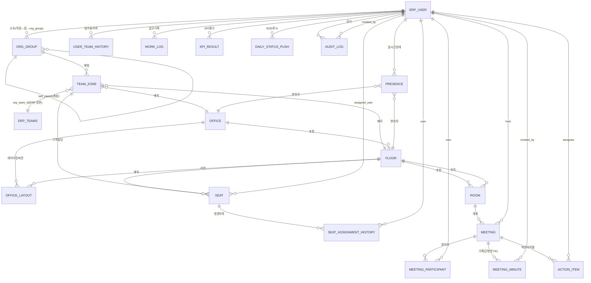

# 04-data-model.md: 데이터 모델

**최종 수정일**: 2026-07-09  
**상태**: 확정(00-decisions.md D10·D16·D18·D19·D20·D27 반영)  
**대상**: 개발팀(DB 설계, API 계약 검증)

> **정본 우선순위**: 이 문서는 `kpi_result` 스키마와 metric 어휘 사전의 **정본(SoT)**이다(D16). 03·08 문서는 본 문서를 참조만 하며 자체 스키마를 중복 정의하지 않는다. 충돌 시 00-decisions.md > 본 문서 순으로 이긴다.

---

## 개요

가상오피스 운영 플랫폼의 PostgreSQL 데이터 모델 정의. 우리 플랫폼 고유 테이블(좌석·3D구역·회의·KPI) + ERP 읽기 미러(erp_user 기반 동기화) + 감시/감사 로그 계층으로 구성.

**핵심 원칙**:
1. ERP(Space-Daily)는 Source of Truth: users(직원) / teams(조직) / attendances(근태) / leaves(휴가) → 우리는 read-only 동기화
2. 우리 플랫폼: 좌석배치 / 3D구역 / 회의 / 협업기록 / KPI 산출 → 우리가 소유, ERP로 push
3. 회의·결정·액션·업무결과: 우리→ERP 역방향 연동(EOD 배치, POST /api/reports, 신규 kpi_results 엔드포인트)
4. ERP 스키마 수정: 신규 dev 브랜치(feature/virtual-office-integration)에서만. main 직접 수정 금지.

---

## 1. PostgreSQL ERD (우리 플랫폼)



> **ERD 주석**: `ERP_TEAMS`는 ERP 원본 테이블(우리 DB 아님, read-only 참조)이며 `team_zone.erp_team_id`가 이를 가리킨다. `MEETING ↔ MEETING_MINUTE`는 **단방향**(meeting_minute.meeting_id)만 유지한다 — meeting.meeting_minute_id 역방향 FK는 폐기(순환 참조 방지). 분기 중 팀 이동자의 KPI 벤치마크 왜곡을 막기 위해 `USER_TEAM_HISTORY`를 신설한다(D18).

**다이어그램 범례**:
- `||--o{`: 1:N 관계 (1개가 여러 개를 소유)
- `}o--||`: N:1 관계 (FK 방향)
- `||--o|`: 1:0..1 관계 (nullable FK)
- `}o--o{`: N:M 관계 (mapping table)

---

## 2. 엔티티 상세 정의

### 2.1 ERP 미러 계층

#### **erp_user** (ERP users의 읽기전용 동기화)

**역할**: 직원 정보의 단일 진실 공급처. ERP users.id를 PK로 사용해 모든 참조 통일.

| 필드 | 타입 | 제약 | 설명 |
|-----|------|------|------|
| id | BIGINT | PK | ERP users.id (=조인 키, ERP 원본 타입) |
| company_id | INTEGER | NN | ERP company_id 스코프(ERP 원본 타입, 사내 단일값) |
| email | VARCHAR(255) | NN, UNIQUE(company_id) | ERP와 동일 |
| name | VARCHAR(255) | NN | 직원명 |
| erp_team_id | BIGINT | NN | ERP teams.id(원본 참조) |
| role | ENUM | NN, DEFAULT 'employee' | employee \| leader \| admin \| super_admin |
| position | VARCHAR(255) | | 자유텍스트 직책(예: "선임", "팀장") |
| position_id | BIGINT | | ERP job_positions.id (nullable) |
| manager_id | BIGINT | FK, self | ERP users.id (보고라인) |
| work_type | VARCHAR(50) | | ERP work_type |
| work_hours | INT | | ERP work_hours(일일 근무시간, **분 단위**) |
| is_active | BOOLEAN | NN, DEFAULT TRUE | soft-delete 플래그(ERP 하드 삭제 감지 시 FALSE, D18) |
| last_synced_at | TIMESTAMP | | 마지막 ERP 동기화 시각(**UTC 저장**, 표시 시 KST 변환) |
| created_at | TIMESTAMP | NN | 우리 DB 생성 시각(UTC) |
| updated_at | TIMESTAMP | NN | 우리 DB 수정 시각(UTC) |

**PK**: `id`  
**FK**: `manager_id` → `erp_user(id)` (self, nullable, ON DELETE SET NULL)  
**인덱스**:
- `UNIQUE(company_id, email)`
- `INDEX(erp_team_id)` (회의/업무/KPI 조인)
- `INDEX(role)` (관리자 필터)
- `INDEX(is_active)` (활성 직원 필터)

**미러링 최소수집(D20-f)**: ERP `slack_user_id·github_username·jira_email·lat·lng·radius` 등은 우리 KPI/공간 기능에 불필요하므로 **미러링하지 않는다**. ERP 원본 읽기는 컬럼 화이트리스트 VIEW(예: `erp_users_public`)를 경유하여 필요한 컬럼만 노출한다. GPS 좌표(lat/lng/radius)는 D20-c에 따라 수집·미러링 전면 금지.

**동기화(D18)**: **매시간 증분(updated_at 기준) + 매일 00:00 KST 전체 대사**. 전체 대사에서 ERP 하드 삭제를 감지하면 `is_active=false` soft-delete 처리(물리 삭제 금지, 평가 기록 영구성 보장). 상세 알고리즘은 03-erp-integration.md §2 참조.

**가정**: 
- company_id는 현재 사내 단일(멀티테넌트 격리는 이후). 
- 사번(社番) 필드는 ERP에 없으므로 id로 매핑.

---

#### **ERP 읽기 원본 테이블**(직접 접근, 우리 DB 아님)

우리 plat form은 PostgreSQL read-only 커넥션으로 ERP DB(dailylog)의 다음 테이블 직접 접근:

| ERP 테이블 | 동기 대상 | 읽기 빈도(D18) |
|-----------|---------|---------|
| users | erp_user | 매시간 증분 + 매일 00:00 KST 전체 대사 |
| teams | (team_zone 매핑용) | 매시간 증분 + 매일 00:00 KST 전체 대사 |
| job_positions | (erp_user.position_id FK) | 일 1회(새벽) |
| attendances | (근태 검증, 출퇴근 기록) | 일일 자정(KST) 배치 |
| leaves | (휴가 판정) | 매시간 증분 |

**주의**: ERP 테이블 직접 접근은 사내망 동일 PostgreSQL이므로 psycopg2 read-only 직접 커넥션. 스키마 변경 시 협의 필수(ERP 담당자). 전체 대사(users/teams)에서 하드 삭제 감지 → `is_active=false` soft-delete(D18).

---

### 2.2 조직·구역·공간 계층

#### **org_group** (우리 플랫폼 상위 조직)

**역할**: ERP teams(리프)를 묶어서 본부/부서/파트 계층 구성. ERP 스키마는 건드리지 않음.

| 필드 | 타입 | 제약 | 설명 |
|-----|------|------|------|
| id | UUID | PK | |
| company_id | INTEGER | NN | 테넌트 스코프 값 — company 테이블 없음, ERP company_id와 동일 값(FK 아님, erp_user와 동일 타입) |
| name | VARCHAR(255) | NN | "엔지니어링 본부", "마케팅 팀" |
| type | ENUM | NN | division \| department \| part |
| parent_id | UUID | FK, self | 상위 그룹(null = 루트) |
| color | VARCHAR(7) | | HEX 컬러(3D 구역 시각화) |
| sort_order | INT | | UI 정렬 순서 |
| created_at | TIMESTAMP | NN | |
| updated_at | TIMESTAMP | NN | |

**PK**: `id`  
**FK**: `parent_id` → `org_group(id)` (nullable, self)  
**인덱스**: `INDEX(company_id, parent_id)`, `INDEX(type)`

**관계**: org_group(1) : team_zone(N). 여러 팀이 하나의 본부/부서 아래.

---

#### **team_zone** (ERP 팀 ↔ 3D 구역 매핑)

**역할**: ERP 팀을 물리적 3D 오피스 구역(floor의 폴리곤)으로 배치. 좌석/회의실/색/권한 할당 기준.

| 필드 | 타입 | 제약 | 설명 |
|-----|------|------|------|
| id | UUID | PK | |
| erp_team_id | BIGINT | FK, NN | ERP teams.id |
| org_group_id | UUID | FK, NN | org_group(상위 그룹) |
| office_id | UUID | FK, NN | office(어느 사무실) |
| floor_id | UUID | FK, NN | floor(어느 층) |
| zone_label | VARCHAR(255) | NN | "백엔드팀 구역", "마케팅 존" |
| color | VARCHAR(7) | | HEX(3D 구역 강조색) |
| polygon | JSON | | 2D 좌표 배열(Konva 좌석편집기용) |
| created_at | TIMESTAMP | NN | |
| updated_at | TIMESTAMP | NN | |

**PK**: `id`  
**FK**: 
- `erp_team_id` → (ERP teams, 직접읽기)
- `org_group_id` → `org_group(id)`
- `office_id` → `office(id)`
- `floor_id` → `floor(id)`

**인덱스**: `UNIQUE(erp_team_id, office_id, floor_id)`, `INDEX(org_group_id)`

**제약**: 같은 팀이 같은 오피스·층에 중복 배치 불가(zone 합병).

---

#### **office** (사무실)

**역할**: 회사의 물리적 오피스 단위.

| 필드 | 타입 | 제약 | 설명 |
|-----|------|------|------|
| id | UUID | PK | |
| company_id | INTEGER | NN | 테넌트 스코프 값(사내 단일) — company 테이블 없음, ERP company_id와 동일 값(FK 아님, erp_user와 동일 타입) |
| name | VARCHAR(255) | NN | "본사", "판교" |
| description | TEXT | | |
| address | VARCHAR(500) | | 사무실 주소(GPS 기준점?) |
| created_at | TIMESTAMP | NN | |
| updated_at | TIMESTAMP | NN | |

**PK**: `id`  
**인덱스**: `INDEX(company_id)`

---

#### **floor** (층)

**역할**: office 내 층 단위.

| 필드 | 타입 | 제약 | 설명 |
|-----|------|------|------|
| id | UUID | PK | |
| office_id | UUID | FK, NN | office |
| level | INT | NN | 1, 2, 3... (B1 = -1) |
| name | VARCHAR(255) | NN | "1층 오픈좌석", "2층 회의실" |
| minimap_config | JSON | | 미니맵 2D 레이아웃(캐시용) |
| created_at | TIMESTAMP | NN | |
| updated_at | TIMESTAMP | NN | |

**PK**: `id`  
**FK**: `office_id` → `office(id)`  
**인덱스**: `UNIQUE(office_id, level)`

---

### 2.3 공간 설계·배치

#### **office_layout** (사무실 배치 버전 관리)

**역할**: 좌석·회의실·구역 정보를 모듈형 JSON으로 저장. 버전 관리(draft→validated→deployed) 및 롤백 지원.

| 필드 | 타입 | 제약 | 설명 |
|-----|------|------|------|
| id | UUID | PK | |
| office_id | UUID | FK, NN | office |
| floor_id | UUID | FK, NN | floor |
| version | INT | NN | 1, 2, 3... (증분) |
| status | ENUM | NN, DEFAULT 'draft' | draft \| validated \| deployed \| archived |
| json | JSONB | NN | 구조 정의(하단 섹션 3 참조) |
| created_by | BIGINT | FK | erp_user.id(배치 설계자) |
| validated_by | BIGINT | FK, NULL | erp_user.id(검증자) |
| deployed_at | TIMESTAMP | NULL | 배포 시각(**UTC 저장**, 표시 시 KST 변환) |
| deployment_notes | TEXT | | 배포 메모 |
| created_at | TIMESTAMP | NN | |
| updated_at | TIMESTAMP | NN | |

**PK**: `id`  
**FK**: 
- `office_id` → `office(id)`
- `floor_id` → `floor(id)`
- `created_by` → `erp_user(id)` (nullable)
- `validated_by` → `erp_user(id)` (nullable)

**인덱스**: `UNIQUE(office_id, floor_id, version)`, `INDEX(status, deployed_at)`

**상태 전이**: draft → validated(검증) → deployed(라이브) / ← draft(롤백, 신규버전)

**JSON 스키마**: 하단 섹션 5 참조.

---

#### **room** (회의실/라운지/집중실/폰부스)

**역할**: floor 내 공간(회의실, 라운지, 집중실 등). office_layout JSON과는 별개로 메타데이터 관리.

| 필드 | 타입 | 제약 | 설명 |
|-----|------|------|------|
| id | UUID | PK | |
| floor_id | UUID | FK, NN | floor |
| type | ENUM | NN | lobby \| meeting \| lounge \| focus \| phonebooth |
| name | VARCHAR(255) | NN | "컨퍼런스룸 A", "집중실" |
| capacity | INT | NN | 수용인원 |
| coords | JSON | NN | {x, y, width, height} 2D 위치·크기(원점 top_left, 미터 — D25) |
| enter_trigger | JSON | | {trigger_x, trigger_y, trigger_width, trigger_height, entry_direction} 진입 감지 박스(room 경계 내부, 05 §1.2.5) |
| livekit_room | VARCHAR(255) | | LiveKit room ID(회의 이용 시) |
| status | ENUM | DEFAULT 'active' | active \| inactive \| maintenance |
| created_at | TIMESTAMP | NN | |
| updated_at | TIMESTAMP | NN | |

**PK**: `id`  
**FK**: `floor_id` → `floor(id)`  
**인덱스**: `INDEX(floor_id, type)`, `INDEX(livekit_room)`

**참고**: room은 office_layout JSON에도 정의되지만, 메타 저장(용량, 화상회의 링크)은 별도 테이블.

> **좌표계 정본(D25, 2026-07-02 정렬)**: coords·enter_trigger는 05-office-layout-schema.md의 **2D top_left 원점·미터 단위** 규약을 따른다. Godot 3D 월드좌표는 DB에 저장하지 않으며 05 §5.3 변환식으로 파생한다.

---

#### **seat** (좌석)

**역할**: floor 내 개별 좌석. 직원 할당, 타입(고정/자율/임시/협력사), 상태 관리.

| 필드 | 타입 | 제약 | 설명 |
|-----|------|------|------|
| id | UUID | PK | |
| floor_id | UUID | FK, NN | floor |
| team_zone_id | UUID | FK, NULL | team_zone(소속 구역, null = 공용) |
| type | ENUM | NN | fixed \| free \| temp \| partner |
| assigned_user_id | BIGINT | FK, NULL | erp_user.id(현재 배정 사원) |
| coords | JSON | NN | {x, y} 2D 위치(top_left 미터, D25 — 착석 방향 `facing`은 layout JSON에서 정의, Godot 월드좌표는 05 §5.3 변환식으로 파생) |
| status | ENUM | DEFAULT 'available' | available \| occupied \| disabled \| reserved |
| seat_number | VARCHAR(50) | | "1-A-01" (선택) |
| created_at | TIMESTAMP | NN | |
| updated_at | TIMESTAMP | NN | |

**PK**: `id`  
**FK**: 
- `floor_id` → `floor(id)`
- `team_zone_id` → `team_zone(id)` (nullable)
- `assigned_user_id` → `erp_user(id)` (nullable)

**인덱스**: `INDEX(floor_id, type)`, `INDEX(assigned_user_id)`, `UNIQUE(floor_id, seat_number)` if seat_number

**상태**: 
- available = 비어있음 (assigned_user_id=NULL)
- occupied = 배정됨 (assigned_user_id NOT NULL)
- disabled = 사용 불가(수리/제거)
- reserved = 임시 예약

**좌석 배정 분리 원칙(D10)**: 좌석↔직원 배정은 **DB(seat.assigned_user_id + seat_assignment_history)**가 소유하며, **layout JSON에서 분리**된다. layout JSON(05-office-layout-schema.md)은 공간 구조(좌석 위치·타입·방향·furniture 참조)만 정의하고 배정 정보는 담지 않는다. 따라서 배정 변경 시 레이아웃 재배포가 불필요하다. 좌석 방향(`facing`, 도 단위)과 seat↔furniture 상호 참조(`furniture_id`)는 layout JSON 스키마에서 정의한다(05 참조).

---

#### **seat_assignment_history** (좌석 배정 변경이력)

**역할**: 좌석 배정 생애주기 추적(감사, UI 타임라인).

| 필드 | 타입 | 제약 | 설명 |
|-----|------|------|------|
| id | UUID | PK | |
| seat_id | UUID | FK, NN | seat |
| user_id | BIGINT | FK, NN | erp_user.id |
| assigned_at | TIMESTAMP | NN | 배정 시각 |
| unassigned_at | TIMESTAMP | NULL | 해제 시각 |
| assigned_by | BIGINT | FK | erp_user.id(배정 담당자) |
| reason | VARCHAR(255) | | "팀 재구성", "퇴사", "출장" |
| created_at | TIMESTAMP | NN | |

**PK**: `id`  
**FK**: 
- `seat_id` → `seat(id)`
- `user_id` → `erp_user(id)`
- `assigned_by` → `erp_user(id)` (nullable)

**인덱스**: `INDEX(seat_id, assigned_at DESC)`, `INDEX(user_id, assigned_at DESC)`

---

#### **user_team_history** (직원 팀 이동 이력) — 신설(D18)

**역할**: 직원의 ERP 팀 소속 변경 이력. 분기 KPI 벤치마크(팀 백분위) 계산 시 **평가 기간에 실제 소속했던 팀**을 기준으로 삼아, 분기 중 팀 이동자의 벤치마크 왜곡을 방지한다(08-kpi-logic.md §5 참조).

| 필드 | 타입 | 제약 | 설명 |
|-----|------|------|------|
| id | UUID | PK | |
| user_id | BIGINT | FK, NN | erp_user.id |
| erp_team_id | BIGINT | NN | ERP teams.id(당시 소속 팀) |
| valid_from | TIMESTAMP | NN | 소속 시작(UTC) |
| valid_to | TIMESTAMP | NULL | 소속 종료(UTC, NULL = 현재 소속) |
| created_at | TIMESTAMP | NN | 기록 생성(UTC) |

**PK**: `id`  
**FK**: `user_id` → `erp_user(id)` (ON DELETE RESTRICT — 이력 보존)  
**인덱스**: `INDEX(user_id, valid_from DESC)`, `INDEX(erp_team_id, valid_from)`

**갱신**: ERP 동기화(D18) 시 `erp_user.erp_team_id` 변경을 감지하면 이전 행의 `valid_to`를 현재 시각으로 닫고 새 행을 연다. 특정 기간 팀 판정: `WHERE valid_from <= :period_end AND (valid_to IS NULL OR valid_to > :period_start)`.

---

### 2.4 실시간·협업 계층

#### **presence** (직원 실시간 상태)

**역할**: 아바타 위치, 상태(온라인/회의/집중/외근). Colyseus(메모리 권위) → FastAPI `POST /api/presence/batch`(1~5초 배치) → DB 업데이트 (D3/D27). 실시간 동기화.

| 필드 | 타입 | 제약 | 설명 |
|-----|------|------|------|
| user_id | BIGINT | PK, FK | erp_user.id |
| office_id | UUID | FK, NULL | 현재 오피스 (offline/미접속 시 NULL) |
| floor_id | UUID | FK, NULL | 현재 층 (〃) |
| x | FLOAT | NULL | 2D 위치(미터, D25). **D20-a 30일 파기 시 NULL 처리** → NN 불가 |
| y | FLOAT | NULL | 〃 |
| z | FLOAT | NULL | 〃 (2.5D 전환으로 미사용 예비) |
| status | ENUM | NN | offline \| online \| working \| meeting \| focus \| away \| external (**7종 확정, D13**) |
| last_activity_at | TIMESTAMP | | 마지막 활동 시각(UTC) |
| updated_at | TIMESTAMP | NN | 상태 업데이트 시각(**UTC 저장**, 표시 시 KST 변환) |

**PK**: `user_id`  
**FK**: 
- `user_id` → `erp_user(id)` (with ON DELETE CASCADE)
- `office_id` → `office(id)`
- `floor_id` → `floor(id)`

**인덱스**: `INDEX(office_id, floor_id)` (필터용), `INDEX(status)`, `INDEX(updated_at DESC)` (타임스탬프 쿼리)

**갱신**: 
- R3F 웹 클라이언트 → Colyseus(20Hz, 메모리 권위) → **1~5초 배치 `POST /api/presence/batch`** → DB 영속 (D3/D27, FastAPI가 단독으로 DB 기록)
- TTL: 5분 무활동 → status = offline (선택)

**상태 정의** (섹션 3.1 참조):
- online = 앱 실행, 오피스 로그인
- working = 좌석에서 업무 중
- meeting = 회의실 입장
- focus = 집중실
- away = 일시 자리 비움 (자동 전이 5분, D13)
- external = 외근/출장/재택 (**수동 전환**, GPS 기반 자동 전환 폐기 — D13/D20)
- offline = 로그아웃

> GPS 기반 `trip_moving`·`trip_arrived`·`returning` 상태는 폐기되었다(데스크톱 클라이언트에 GPS 없음, D13).

---

#### **meeting** (회의)

**역할**: 회의실에서의 회의. 화상(LiveKit), 회의록, 결정사항, 액션아이템 추적.

| 필드 | 타입 | 제약 | 설명 |
|-----|------|------|------|
| id | UUID | PK | |
| room_id | UUID | FK, NN | room |
| title | VARCHAR(255) | NN | "Q2 계획 회의" |
| description | TEXT | | |
| scheduled_at | TIMESTAMP | NN | 예정 시각 |
| started_at | TIMESTAMP | NULL | 실제 시작 시각 |
| ended_at | TIMESTAMP | NULL | 실제 종료 시각 |
| host_user_id | BIGINT | FK, NN | erp_user.id(주최자) |
| status | ENUM | NN, DEFAULT 'scheduled' | scheduled \| in_progress \| completed \| cancelled |
| livekit_room | VARCHAR(255) | | LiveKit room ID |
| recording_url | VARCHAR(1000) | | 화상 녹화 URL(선택, **녹음 동의 시에만**, 보존 90일 후 파기 — D20-b) |
| created_at | TIMESTAMP | NN | |
| updated_at | TIMESTAMP | NN | |

**PK**: `id`  
**FK**: 
- `room_id` → `room(id)`
- `host_user_id` → `erp_user(id)`

**관계**: meeting ↔ meeting_minute는 **단방향**(meeting_minute.meeting_id → meeting.id)만 유지한다. 이전의 meeting.meeting_minute_id 역방향 FK는 폐기(순환 참조 방지). 회의록 조회는 `meeting_minute WHERE meeting_id = :id`로 수행한다.

**인덱스**: `INDEX(room_id, scheduled_at DESC)`, `INDEX(host_user_id)`, `INDEX(status, started_at DESC)`

**상태 전이**: scheduled → in_progress → completed (또는 cancelled)

**녹음·STT 컴플라이언스(D20-b)**: `recording_url`이 설정되는 회의는 시작 시 참석자 전원에게 녹음 고지 배너를 표시하고 참여 의사를 확인한다(거부 시 오디오 미수집). 녹화 원본은 보존 90일 후 자동 파기하며, 회의록 텍스트(meeting_minute)만 평가 데이터로 관리한다. 녹화 시작/중지는 audit_log 대상 액션이다(§2.6).

---

#### **meeting_participant** (회의 참석자)

**역할**: 회의 참석자 관리. joined_at/left_at로 실제 참석 추적(예약과 실제의 갭 감지).

| 필드 | 타입 | 제약 | 설명 |
|-----|------|------|------|
| id | UUID | PK | |
| meeting_id | UUID | FK, NN | meeting |
| user_id | BIGINT | FK, NN | erp_user.id |
| invited_at | TIMESTAMP | NN | 초대 시각 |
| joined_at | TIMESTAMP | NULL | 실제 입장 시각 |
| left_at | TIMESTAMP | NULL | 퇴장 시각 |
| role | ENUM | DEFAULT 'participant' | organizer \| presenter \| participant |
| created_at | TIMESTAMP | NN | |

**PK**: `id`  
**FK**: 
- `meeting_id` → `meeting(id)` (with ON DELETE CASCADE)
- `user_id` → `erp_user(id)`

**인덱스**: `UNIQUE(meeting_id, user_id)`, `INDEX(user_id, invited_at DESC)`

---

#### **meeting_minute** (회의록)

**역할**: 회의 결과 기록(논의, 결정사항, 액션아이템). 회의 이후 작성.

| 필드 | 타입 | 제약 | 설명 |
|-----|------|------|------|
| id | UUID | PK | |
| meeting_id | UUID | FK, NN | meeting |
| title | VARCHAR(255) | | 회의록 제목(회의.title과 동일 가능) |
| summary | TEXT | | 논의 요약 |
| decisions | TEXT | NN | 결정사항(마크다운) |
| action_items_summary | TEXT | | 액션아이템 요약 |
| notes | TEXT | | 추가 노트 |
| stt_draft | TEXT | NULL | STT 원본 초안(회의 음성 STT 산출, D5) |
| ai_summary | TEXT | NULL | AI 요약(Phase 7) |
| attachments | JSON | | [{filename, url, mime_type}] |
| created_by | BIGINT | FK, NN | erp_user.id(기록자) |
| reviewed_by | BIGINT | FK, NULL | erp_user.id(검토자) |
| status | ENUM | DEFAULT 'draft' | draft \| finalized |
| created_at | TIMESTAMP | NN | |
| updated_at | TIMESTAMP | NN | |

**PK**: `id`  
**FK**: 
- `meeting_id` → `meeting(id)` (with ON DELETE CASCADE)
- `created_by` → `erp_user(id)`
- `reviewed_by` → `erp_user(id)` (nullable)

**인덱스**: `UNIQUE(meeting_id)`, `INDEX(status)`

**참고**: meeting_minute과 action_item은 1:N. 하나의 회의록에 다수의 액션아이템. status enum은 `draft | finalized` 2종을 **유지**한다 — stt_draft(D5)·ai_summary(Phase 7)는 초안 보조 필드일 뿐 별도 상태를 추가하지 않는다.

---

#### **action_item** (액션아이템)

**역할**: 회의에서 나온 할일. 담당자, 기한, 진행상태 추적. ERP의 task/issue 와는 독립적.

| 필드 | 타입 | 제약 | 설명 |
|-----|------|------|------|
| id | UUID | PK | |
| meeting_id | UUID | FK, NN | meeting |
| title | VARCHAR(255) | NN | "프로토타입 설계 완료" |
| description | TEXT | | 상세 설명 |
| assignee_user_id | BIGINT | FK, NN | erp_user.id(담당자) |
| due_date | DATE | NN | 기한(KST) |
| priority | ENUM | DEFAULT 'medium' | high \| medium \| low |
| status | ENUM | NN, DEFAULT 'open' | open \| in_progress \| completed \| cancelled |
| related_ref | VARCHAR(500) | | 외부 참조(Jira issue URL, GitHub PR 등) |
| completed_at | TIMESTAMP | NULL | 완료 시각 |
| completed_evidence_url | VARCHAR(1000) | | 완료 증거(결과물 링크) |
| created_at | TIMESTAMP | NN | |
| updated_at | TIMESTAMP | NN | |

**PK**: `id`  
**FK**: 
- `meeting_id` → `meeting(id)` (with ON DELETE CASCADE)
- `assignee_user_id` → `erp_user(id)`

**인덱스**: `INDEX(assignee_user_id, status)`, `INDEX(due_date, status)`

---

### 2.5 업무·KPI·연동 계층

#### **work_log** (업무 기록)

**역할**: 직원이 수행한 업무 단위 기록. 목표, 소요시간, 결과물 추적. 업무결과 집계→KPI 산출 기초.

| 필드 | 타입 | 제약 | 설명 |
|-----|------|------|------|
| id | UUID | PK | |
| user_id | BIGINT | FK, NN | erp_user.id |
| work_date | DATE | NN | 업무 날짜(KST) |
| category | VARCHAR(50) | | "개발", "리뷰", "회의", "설계" |
| title | VARCHAR(255) | NN | "API 엔드포인트 개발" |
| goal | TEXT | | 이번 업무의 목표 |
| related_project | VARCHAR(255) | | 프로젝트명(Jira Project key?) |
| url | VARCHAR(1000) | | 관련 URL(PR, Issue, Confluence) |
| est_minutes | INT | | 예상 소요시간 |
| actual_minutes | INT | | 실제 소요시간 |
| status | ENUM | NN | started \| completed |
| result_url | VARCHAR(1000) | | 결과물 URL(코드, 문서) |
| result_description | TEXT | | 결과 설명 |
| attachments | JSON | | [{filename, url, mime_type}] |
| issues | JSON | | 발생한 이슈(자유텍스트 배열) |
| next_action | TEXT | | 다음 액션(follow-up) |
| created_at | TIMESTAMP | NN | |
| updated_at | TIMESTAMP | NN | |

**PK**: `id`  
**FK**: `user_id` → `erp_user(id)` (ON DELETE RESTRICT — D18 평가 근거 영구 보존, §4.2와 통일)

**인덱스**: `INDEX(user_id, work_date DESC)`, `INDEX(status, work_date DESC)`

**KPI 산출 로직(D14-a)**: status='completed' **전건**이 `work_completed_count` 카운트 대상이며, result_url 존재 건은 `work_quality_score`의 충실도 가점으로 반영한다(08-kpi-logic.md §2.2.1 정합).

---

#### **kpi_result** (KPI 평가 결과)

**역할**: 우리 플랫폼에서 산출한 KPI. **본 테이블이 kpi_result 스키마의 정본(SoT)이다(D16)** — 03·08은 이 정의를 참조만 한다. metric별 **롱포맷**(1행 = 1 user + 1 기간 + 1 metric). 정량 값은 결정론적 코드로 계산하고(D14-e), AI는 서술만 생성한다. 관리자 확정 `final_score`가 이의신청 흐름을 거쳐 ERP로 push된다(D15).

| 필드 | 타입 | 제약 | 설명 |
|-----|------|------|------|
| id | UUID | PK | |
| user_id | BIGINT | FK, NN | erp_user.id |
| period_type | ENUM(kpi_period_type) | NN | `daily` \| `quarterly` (§3.5 enum 참조, D16 — `period` 컬럼 폐기) |
| period_key | VARCHAR(20) | NN | period_type=daily → `'2026-07-01'`, quarterly → `'2026-Q3'` |
| metric | VARCHAR(100) | NN | metric 어휘 사전(하단) 값만 허용 |
| value | NUMERIC | NN | 결정론적 코드로 계산된 정량 값 |
| unit | VARCHAR(50) | | "count", "%", "score" |
| source | ENUM | NN, DEFAULT 'virtual_office' | virtual_office(우리만 해당) |
| ai_draft | JSONB | NULL | AI 서술 초안(강점/개선/근거) — **정량 점수 미포함**(D14-e) |
| ai_draft_generated_at | TIMESTAMP | NULL | AI 생성 시각(UTC) |
| ai_model | VARCHAR(50) | DEFAULT 'claude-opus' | 사용 모델 |
| admin_adjusted_score | NUMERIC | NULL | 관리자 조정 점수(미조정 시 NULL → value가 유효) |
| admin_note | TEXT | NULL | 관리자 검토/조정 사유 |
| admin_user_id | BIGINT | FK, NULL | 조정한 관리자 erp_user.id |
| admin_reviewed_at | TIMESTAMP | NULL | 검토 시각(UTC) |
| objection_status | ENUM(kpi_objection_status) | NN, DEFAULT 'none' | `none` \| `submitted` \| `reviewing` \| `resolved` (§3.5 enum 참조 — 이의신청 상태머신, D15) |
| objection_detail | JSONB | NULL | {category, text, evidence, submitted_at} |
| objection_submitted_at | TIMESTAMP | NULL | 이의 접수 시각(UTC) |
| objection_resolved_at | TIMESTAMP | NULL | 이의 처리 완료 시각(UTC) |
| final_score | NUMERIC | NULL | 관리자 확정 최종 점수(= admin_adjusted_score ?? value, 확정 시 설정) |
| finalized_at | TIMESTAMP | NULL | 확정 시각(UTC, NULL = 미확정) |
| note | TEXT | | 메트릭별 추가 주석 |
| pushed_to_erp | BOOLEAN | DEFAULT FALSE | ERP로 전송됨 |
| pushed_at | TIMESTAMP | NULL | ERP 전송 시각(UTC) |
| created_at | TIMESTAMP | NN | (UTC) |
| updated_at | TIMESTAMP | NN | (UTC) |

**PK**: `id`  
**FK**: 
- `user_id` → `erp_user(id)` (**ON DELETE RESTRICT** — 평가 기록 영구성, D18)
- `admin_user_id` → `erp_user(id)` (nullable, ON DELETE SET NULL)

**인덱스**: `UNIQUE(user_id, period_type, period_key, metric)`, `INDEX(pushed_to_erp, pushed_at)`, `INDEX(objection_status)`, `INDEX(finalized_at)`

> **kpi_result_review 테이블 폐기(D16)**: 이전 설계의 별도 리뷰 테이블은 폐기되었다. 리뷰·이의신청·확정 필드는 위와 같이 kpi_result에 **인라인**된다.

##### metric 어휘 사전 (정본 — 03·08은 이 표를 참조)

D14 재작성 공식에 정합하는 최종 metric 어휘. 이 8개 외의 metric 값은 사용하지 않는다(3문서 공통).

| metric | 타입/단위 | 범위 | 계산(결정론적, D14-e) |
|--------|----------|------|----------------------|
| `work_completed_count` | count | ≥0 | 완료(status=completed) work_log 건수 (D14-a) |
| `work_quality_score` | score | 0–100 | 완료 work_log의 충실도: goal·category·result_url·next_action 작성도 각 가점 + AI 신뢰도 검증 반영 (D14-a) |
| `minutes_authored_count` | count | ≥0 | 회의록 작성 수(created_by 기준 — 공동작성 구조 없음, 필요 시 추후 결정) (decisions 신뢰도 AI ±0.5 검증 반영, D14-b) |
| `action_items_completed` | count | ≥0 | 완료(status='completed')한 **담당** 액션아이템 수, 일일 인정 상한 적용(쪼개기 방지, D14-c) |
| `action_items_ontime_rate` | % | 0–100 | 담당 액션아이템의 기한 내 완료율 (D14-c) |
| `report_fidelity_score` | score | 0–100 | 업무기록/일일리포트 충실도(작성 신뢰도, 보일러플레이트 감점) |
| `collaboration_score` | score | 0–100 | 위 신호를 합성한 종합 협업 점수(결정론적 코드 계산) |
| `quarterly_total` | score | ≥0 | 분기 종합 점수(분기 집계 행) |

> **폐기된 metric**: `completed_work_count`(→work_completed_count), `meetings_hosted`·`meetings_attended`·`meeting_participation`(회의 참석 기본점 폐기, D14-b), `action_items_closed`(→action_items_completed, 'closed' 유령 값 제거), `quality_score`·`productivity_score`(정량 점수 어휘로 통합). 근태 관련 metric은 D14-d에 따라 미포함(ERP가 attendance를 별도 반영, 이중 반영 금지).

**AI 초안 생성(D14-e)**: 정량 점수(value)는 **결정론적 코드**가 계산하며 같은 입력=같은 점수를 보장한다(감사 요건). Claude API는 서술(강점/개선/근거)만 반환하고 `ai_draft` JSONB에 저장한다 — 정량 점수 산출에 관여하지 않는다.

**ERP 푸시(D15·D17)**: 관리자 확정(`finalized_at` 설정) 이벤트 + 분기 마감 배치 시, `final_score`를 metric 단위 upsert로 ERP 엔드포인트(`POST /api/kpi-results`, 03-erp-integration.md §5.2 참조)에 전송한다. `ai_draft`는 ERP 미전송. 정정 발생 시 재push(upsert). 인증은 서비스계정 JWT.

---

#### **daily_status_push** (일일 상태 푸시 로그)

**역할**: 우리 플랫폼 → ERP 연동의 배치 로그. `target`별로 재시도를 분리 관리한다(D17). **본 테이블이 daily_status_push 정의의 정본이다** — 08은 참조만 한다.

| 필드 | 타입 | 제약 | 설명 |
|-----|------|------|------|
| id | UUID | PK | |
| user_id | BIGINT | FK, NN | erp_user.id |
| push_date | DATE | NN | 푸시 대상 날짜(KST 경계로 산정) |
| target | ENUM | NN | erp_daily_reports \| erp_kpi_results |
| payload | JSONB | NN | 전송 페이로드(일일리포트 or KPI) |
| status | ENUM | NN, DEFAULT 'pending' | pending \| sent \| failed |
| pushed_at | TIMESTAMP | NULL | 실제 전송 시각(UTC) |
| erp_response | JSON | NULL | ERP 응답(성공/에러 본문) |
| error_message | TEXT | NULL | 실패 사유 요약(재시도 판정용) |
| retry_count | INT | DEFAULT 0 | 재시도 횟수(최대 3, 지수 백오프) |
| run_id | UUID | NULL | 배치 실행 식별자(멱등성·감사) |
| created_at | TIMESTAMP | NN | (UTC) |
| updated_at | TIMESTAMP | NN | (UTC) |

**PK**: `id`  
**FK**: `user_id` → `erp_user(id)` (**ON DELETE RESTRICT** — 전송 이력 보존, D18)

**인덱스**: `INDEX(user_id, push_date DESC)`, `INDEX(status, target, created_at)` (배치 쿼리용), `INDEX(run_id)`

**푸시 워크플로우(D17)**:
1. daily_reports push = 매일 **18:00 KST**(18:00 이후 활동은 익일 귀속, 주말·공휴일 스킵) → target=erp_daily_reports
2. kpi_results push = **관리자 확정 이벤트 + 분기 마감 배치**(D15) → target=erp_kpi_results (final_score만 전송)
3. daily_status_push row 생성(status=pending, run_id 부여)
4. ERP 엔드포인트 호출(서비스계정 JWT 인증)
5. 성공 시 status=sent, pushed_at 업데이트
6. 실패 시 status=failed, error_message/erp_response 로깅
7. 재시도는 target별로 분리(최대 3회, 지수 백오프). 다음날 정규 배치가 upsert로 우선(정규 배치가 이김). 상세는 03-erp-integration.md §6 참조.

---

### 2.6 자산·감시·감사 계층

#### **asset** (에셋 레지스트리)

**역할**: 3D 에셋(모델, 텍스처) 메타데이터. Blender → GLB → Godot 변환 파이프라인. 라이선스/저작권 추적.

> **정본 출처: 3d-design/asset-registry.md §1.1**(D27 스키마 정본). 07-3d-visual-asset-pipeline.md는 파이프라인 참조 문서다. 아래 표는 정본 스키마의 사본이며, 충돌 시 asset-registry.md §1.1이 이긴다.

| 필드 | 타입 | 제약 | 설명 |
|-----|------|------|------|
| asset_id | VARCHAR(64) | PK | 예: "DESK_STANDARD_001" (05 정본 명명. 버전은 asset 테이블·CHANGELOG로 관리) |
| asset_name | VARCHAR(256) | NN | "Reception Desk" |
| asset_type | VARCHAR(50) | NN | furniture \| structure \| material \| ui3d \| character \| environment |
| asset_category | VARCHAR(100) | | "office", "meeting-room", "lounge", "lobby" |
| source_url | TEXT | | 원본 다운로드 URL(ambientCG, Poly Haven) |
| author | VARCHAR(256) | | 에셋 제작자 |
| license | VARCHAR(100) | NN | CC0 \| CC-BY \| custom \| proprietary |
| license_url | TEXT | | 라이선스 문서 링크 |
| downloaded_at | TIMESTAMP | | 최초 획득 시각 |
| modified_by | VARCHAR(256) | | 수정/가공 담당자 |
| commercial_allowed | BOOLEAN | DEFAULT TRUE | 상용 이용 가능 |
| attribution_required | BOOLEAN | | 저작권 표시 필수 |
| redistribution_allowed | BOOLEAN | | 재배포 허용 |
| original_file_hash | VARCHAR(64) | | 원본 파일 SHA-256(변조 감지) |
| optimized_file_hash | VARCHAR(64) | | 최적화 후 GLB SHA-256 |
| tscn_path | VARCHAR(256) | NN | ⚠️**D27 마이그레이션 대기** — Godot 잔재. D27 목표 = `gltf_path`(웹 런타임 `.glb`, 예 `frontend/public/assets/3d/<name>.glb` — 웹 서빙 규약) + 배경은 별도 렌더 산출(office_bg/depth). 정본 = 07-3d-visual-asset-pipeline·3d-design/asset-registry. 실측 `backend/app/models/tables.py:Asset`가 아직 `tscn_path`라 **Alembic 마이그레이션(tscn_path→gltf_path) 필요**. |
| source_glb_path | VARCHAR(256) | | 임포트 소스 glb(저장소 보관). D27: 아바타·소품 런타임 GLTF의 소스 |
| file_size_bytes | BIGINT | | 산출물 크기(성능 예산 참고용, 런타임 다운로드 없음 — D8) |
| polygon_count | INT | | LOD 0 삼각형 수. 05 performance 파생 계산의 정본 소스 |
| texture_resolution | VARCHAR(20) | | 예: "2048x2048" |
| dimension | JSONB | | 실측 크기 {"width","depth","height"}(m). 05 좌석↔가구 정합·검증의 정본 |
| footprint_2d | JSONB | | 편집기 도면용 2D 풋프린트 {"width","depth"}(m) |
| thumbnail_url | TEXT | | 편집기 팔레트 썸네일 |
| used_in_scene | JSONB | | ["stage1_lobby", "stage1_office"] (사용 장면) |
| external_dependencies | TEXT | | 의존 에셋(예: materials/wood_floor_006) |
| notes | TEXT | | 비고 |
| created_at | TIMESTAMP | NN | |
| updated_at | TIMESTAMP | NN | |
| deleted_at | TIMESTAMP | NULL | soft delete |

**PK**: `asset_id`

**인덱스**: `INDEX(asset_type, asset_category)`, `INDEX(license)`

**라이선스 준수**: 배포 시 asset.attribution_required=true인 에셋은 ATTRIBUTION.md 자동 생성.

---

#### **audit_log** (감사 로그)

**역할**: 중요 엔티티 변경(좌석배정, 회의 생성, KPI 조정, 배포)의 감시. 컴플라이언스.

| 필드 | 타입 | 제약 | 설명 |
|-----|------|------|------|
| id | UUID | PK | |
| user_id | BIGINT | FK, NULL | erp_user.id(행위자, null=시스템) |
| action | VARCHAR(100) | NN | "seat_assigned", "meeting_created", "kpi_adjusted", "layout_deployed" |
| entity_type | VARCHAR(50) | NN | seat, meeting, kpi_result, office_layout |
| entity_id | VARCHAR(255) | NN | 대상 엔티티 ID |
| old_value | JSONB | NULL | 변경 전 값 |
| new_value | JSONB | NULL | 변경 후 값 |
| ip_address | VARCHAR(45) | | 요청 IP(IPv4/IPv6) |
| user_agent | VARCHAR(500) | | 클라이언트 user-agent |
| created_at | TIMESTAMP | NN | 행위 시각(**UTC 저장**, 표시 시 KST 변환) |

**PK**: `id`  
**FK**: `user_id` → `erp_user(id)` (nullable, with ON DELETE SET NULL)

**인덱스**: `INDEX(user_id, created_at DESC)`, `INDEX(entity_type, entity_id)`, `INDEX(action, created_at DESC)`

**감시 대상 액션**:
- seat_assigned / seat_unassigned (좌석 배정)
- meeting_created / meeting_updated / meeting_cancelled (회의)
- recording_started / recording_stopped (회의 녹화 시작/중지 — D20-b)
- kpi_adjusted (KPI 관리자 조정 — `admin_adjusted_score` 설정 시 **자동 생성**, D20 / OQ 종결) / kpi_finalized (KPI 확정) / kpi_objection_submitted (이의신청 접수)
- office_layout_deployed (사무실 배치 배포)

**보존(D20-e)**: audit_log는 **5년 보존** 후 파기/익명화한다.

---

## 3. 상태 & 열거형(Enum) 정의

### 3.1 Presence Status

```sql
-- 7종 확정 (D13). GPS 기반 trip_moving/trip_arrived/returning 폐기(데스크톱에 GPS 없음)
CREATE TYPE presence_status AS ENUM (
  'offline',        -- 로그아웃
  'online',         -- 앱 실행, 오피스 로그인
  'working',        -- 좌석에서 업무
  'meeting',        -- 회의실 입장
  'focus',          -- 집중실
  'away',           -- 자리 비움(자동 전이 5분)
  'external'        -- 외근/출장/재택 (수동 전환)
);
```

**상태 전이도** (7종, D13 — 09-realtime-collaboration.md §2와 정합):
```
offline ←→ online(로그인/로그아웃)
online
  ├─→ working(좌석 착석)
  ├─→ meeting(회의실 입장) → 퇴장 시 이전 상태 복귀
  ├─→ focus(집중실)
  ├─→ away(무활동 5분 자동 전이) → 활동 재개 시 이전 상태 복귀
  └─→ external(외근/출장/재택 — 수동 전환) → 수동 해제 시 online
```

---

### 3.2 Seat Type & Status

```sql
CREATE TYPE seat_type AS ENUM (
  'fixed',     -- 고정 배치(팀 소속)
  'free',      -- 자율석(누구나 앉을 수 있음)
  'temp',      -- 임시석(게스트)
  'partner'    -- 협력사/외부 전담
);

CREATE TYPE seat_status AS ENUM (
  'available',  -- 비어있음
  'occupied',   -- 배정됨(assigned_user_id NOT NULL)
  'disabled',   -- 사용 불가
  'reserved'    -- 임시 예약
);
```

---

### 3.3 Meeting Status

```sql
CREATE TYPE meeting_status AS ENUM (
  'scheduled',    -- 예정(미시작)
  'in_progress',  -- 진행 중
  'completed',    -- 완료
  'cancelled'     -- 취소
);
```

---

### 3.4 Office Layout Status

```sql
CREATE TYPE office_layout_status AS ENUM (
  'draft',      -- 편집 중
  'validated',  -- 검증 완료(배포 대기)
  'deployed',   -- 라이브
  'archived'    -- 이전 버전(롤백 참고)
);
```

---

### 3.5 KPI Source · Period · Objection (D16)

```sql
CREATE TYPE kpi_source AS ENUM (
  'virtual_office'  -- 우리 플랫폼만(ERP developer_evaluations과는 독립)
);

-- period 컬럼 폐기 → period_type + period_key 분리(NULL 금지)
CREATE TYPE kpi_period_type AS ENUM (
  'daily',      -- period_key = 'YYYY-MM-DD'
  'quarterly'   -- period_key = 'YYYY-Q#'
);

-- 이의신청 상태머신(D15)
CREATE TYPE kpi_objection_status AS ENUM (
  'none',       -- 이의신청 없음(기본)
  'submitted',  -- 접수됨(공개 후 7일 이내)
  'reviewing',  -- 재검토 중
  'resolved'    -- 처리 완료(확정)
);
```

---

### 3.6 ERP 연동 Role

```sql
CREATE TYPE erp_role AS ENUM (
  'employee',     -- 일반 직원
  'leader',       -- 팀장
  'admin',        -- 관리자(회사 범위)
  'super_admin'   -- 슈퍼 관리자(시스템 범위)
);
```

---

### 3.7 Org Group Type

```sql
CREATE TYPE org_group_type AS ENUM (
  'division',    -- 본부
  'department',  -- 부서
  'part'         -- 파트
);
```

---

### 3.8 Room Type

```sql
CREATE TYPE room_type AS ENUM (
  'lobby',      -- 로비
  'meeting',    -- 회의실
  'lounge',     -- 라운지
  'focus',      -- 집중실/집중 공간
  'phonebooth'  -- 폰부스(개인 통화)
);
```

---

### 3.9 Daily Status Push Target

```sql
CREATE TYPE daily_status_push_target AS ENUM (
  'erp_daily_reports',   -- ERP POST /api/reports
  'erp_kpi_results'      -- ERP 신규 POST /api/kpi-results
);
```

---

## 4. 핵심 인덱스 & 제약

### 4.1 성능 인덱스

```sql
-- erp_user 동기화 & 조인
CREATE INDEX idx_erp_user_company_email ON erp_user(company_id, email);
CREATE INDEX idx_erp_user_team ON erp_user(erp_team_id);
CREATE INDEX idx_erp_user_role ON erp_user(role);

-- 실시간 조회 (Godot 서버)
CREATE INDEX idx_presence_office_floor ON presence(office_id, floor_id);
CREATE INDEX idx_presence_status ON presence(status);
CREATE INDEX idx_presence_updated_at ON presence(updated_at DESC);

-- 좌석 배정
CREATE INDEX idx_seat_assigned_user ON seat(assigned_user_id);
CREATE INDEX idx_seat_floor_type ON seat(floor_id, type);
CREATE UNIQUE INDEX idx_seat_number_unique ON seat(floor_id, seat_number) WHERE seat_number IS NOT NULL;

-- 회의 & 업무 조회
CREATE INDEX idx_meeting_room_scheduled ON meeting(room_id, scheduled_at DESC);
CREATE INDEX idx_meeting_host ON meeting(host_user_id);
CREATE INDEX idx_meeting_participant_user ON meeting_participant(user_id, invited_at DESC);
CREATE INDEX idx_work_log_user_date ON work_log(user_id, work_date DESC);

-- KPI & EOD 배치 (D16 통합 스키마)
CREATE UNIQUE INDEX uq_kpi_result_metric ON kpi_result(user_id, period_type, period_key, metric);
CREATE INDEX idx_kpi_result_objection ON kpi_result(objection_status);
CREATE INDEX idx_kpi_result_pushed ON kpi_result(pushed_to_erp, pushed_at);
CREATE INDEX idx_daily_status_push_status ON daily_status_push(status, target, created_at);
CREATE INDEX idx_daily_status_push_user_date ON daily_status_push(user_id, push_date DESC);

-- 감사
CREATE INDEX idx_audit_log_entity ON audit_log(entity_type, entity_id);
CREATE INDEX idx_audit_log_action_time ON audit_log(action, created_at DESC);
```

---

### 4.2 제약 조건

```sql
-- 고유성
ALTER TABLE erp_user ADD CONSTRAINT uk_erp_user_email UNIQUE(company_id, email);
ALTER TABLE seat ADD CONSTRAINT uk_seat_number UNIQUE(floor_id, seat_number) WHERE seat_number IS NOT NULL;
ALTER TABLE team_zone ADD CONSTRAINT uk_team_zone_placement UNIQUE(erp_team_id, office_id, floor_id);
ALTER TABLE office_layout ADD CONSTRAINT uk_layout_version UNIQUE(office_id, floor_id, version);
ALTER TABLE seat_assignment_history ADD CONSTRAINT uk_current_seat_user UNIQUE(seat_id) WHERE unassigned_at IS NULL;  -- 한 좌석에 동시 배정 1명(자율석 포함 동시 점유 불가 정책 — Risks '좌석 충돌' 목표 달성)
ALTER TABLE kpi_result ADD CONSTRAINT uk_kpi_result_metric UNIQUE(user_id, period_type, period_key, metric);

-- 외래 키 및 삭제 정책
-- D18: 평가·전송 기록의 영구성을 위해 erp_user 참조는 RESTRICT + soft-delete(is_active) 사용.
--      CASCADE는 하드 삭제 연쇄를 유발하므로 평가 데이터 계층에서는 금지.
ALTER TABLE erp_user ADD CONSTRAINT fk_erp_user_manager FOREIGN KEY (manager_id) REFERENCES erp_user(id) ON DELETE SET NULL;
ALTER TABLE org_group ADD CONSTRAINT fk_org_group_parent FOREIGN KEY (parent_id) REFERENCES org_group(id) ON DELETE SET NULL;
ALTER TABLE seat ADD CONSTRAINT fk_seat_user FOREIGN KEY (assigned_user_id) REFERENCES erp_user(id) ON DELETE SET NULL;
ALTER TABLE presence ADD CONSTRAINT fk_presence_user FOREIGN KEY (user_id) REFERENCES erp_user(id) ON DELETE CASCADE;  -- presence는 실시간 휘발 데이터라 CASCADE 유지
ALTER TABLE meeting_participant ADD CONSTRAINT fk_meeting_participant FOREIGN KEY (meeting_id) REFERENCES meeting(id) ON DELETE CASCADE;
ALTER TABLE work_log ADD CONSTRAINT fk_work_log_user FOREIGN KEY (user_id) REFERENCES erp_user(id) ON DELETE RESTRICT;  -- D18: 평가 근거 영구 보존
ALTER TABLE kpi_result ADD CONSTRAINT fk_kpi_user FOREIGN KEY (user_id) REFERENCES erp_user(id) ON DELETE RESTRICT;   -- D18: 평가 기록 영구 보존
ALTER TABLE kpi_result ADD CONSTRAINT fk_kpi_admin FOREIGN KEY (admin_user_id) REFERENCES erp_user(id) ON DELETE SET NULL;
ALTER TABLE daily_status_push ADD CONSTRAINT fk_dsp_user FOREIGN KEY (user_id) REFERENCES erp_user(id) ON DELETE RESTRICT;  -- D18: 전송 이력 보존
ALTER TABLE user_team_history ADD CONSTRAINT fk_uth_user FOREIGN KEY (user_id) REFERENCES erp_user(id) ON DELETE RESTRICT;  -- 벤치마크 이력 보존
ALTER TABLE action_item ADD CONSTRAINT fk_action_item_meeting FOREIGN KEY (meeting_id) REFERENCES meeting(id) ON DELETE CASCADE;

-- 체크 제약(비즈니스 규칙)
ALTER TABLE seat_assignment_history ADD CONSTRAINT ck_assignment_dates CHECK (assigned_at <= unassigned_at OR unassigned_at IS NULL);
ALTER TABLE meeting ADD CONSTRAINT ck_meeting_times CHECK (scheduled_at <= started_at OR started_at IS NULL);
ALTER TABLE meeting ADD CONSTRAINT ck_meeting_completion CHECK (started_at <= ended_at OR ended_at IS NULL);
ALTER TABLE office_layout ADD CONSTRAINT ck_layout_status_timestamp CHECK (status = 'deployed' AND deployed_at IS NOT NULL OR status != 'deployed');
-- work_log.work_date 상한(미래 날짜 금지) 검증은 앱 레이어로 이관 — CURRENT_DATE 참조 CHECK는 비결정적이라 회피
ALTER TABLE kpi_result ADD CONSTRAINT ck_kpi_value_nonnegative CHECK (value >= 0);
ALTER TABLE user_team_history ADD CONSTRAINT ck_uth_dates CHECK (valid_to IS NULL OR valid_from < valid_to);

-- NOT NULL 및 기본값은 CREATE TABLE에 포함
```

---

### 4.3 데이터 타입 특수성

**JSONB** (동적 필드):
- office_layout.json: 매우 크고 자주 변경 → JSONB로 인덱싱 가능 (GIN 인덱스)
- seat_assignment_history.reason: 자유텍스트 또는 enum 분류?
  - 현재: VARCHAR(255) 단순화. 나중에 이유 분류 필요 시 enum 추가.

**UUID vs BIGINT**:
- 내부 엔티티(erp_user 제외): UUID (분산 생성 지원)
- ERP 외래키: BIGINT (ERP users.id 타입 맞춤)

---

## 5. office_layout JSON 스키마

**참조**: 별도 문서 05-office-layout-schema.md (정본)

office_layout JSON의 상세 스키마(metadata, floor, dimensions, zones, rooms, seats, furniture, colliders, spawn_points, minimap 등)는 **05-office-layout-schema.md**에서 정의하며, 최상위에 modules 개념 없이 seats/furniture/colliders 등을 직접 배치합니다.

해당 문서에서 JSON 구조, 검증 규칙, Konva.js 호환성, 3D 좌표계를 참조하세요.

---

## 6. ERP 읽기 전용 스키마(참고)

우리는 다음 ERP 테이블을 **read-only PostgreSQL 직접 접근**으로 동기화:

| ERP 테이블 | 동기화 대상 | 접근 빈도 |
|-----------|-----------|---------|
| users | erp_user | 일일 1회 배치 |
| teams | team_zone 매핑 | 일일 1회 배치 |
| job_positions | erp_user.position_id | 주간 1회 배치 |
| attendances | 근태 검증(EOD) | 일일 EOD |
| leaves | 휴가 판정(presence 상태) | 일일 EOD |
| daily_reports | (읽기, 중복 방지) | 필요시 |

**인증**: 사내망 동일 DB, 읽기 전용 계정(read_only_user@localhost).

**마이그레이션**: ERP dev 브랜치(feature/virtual-office-integration)에서만.

---

## 7. 데이터 무결성 전략

### 7.1 TTL & 보관 정책 (D20-a·e)

```
- presence 상태: 5분 무활동 → offline (설정 가능)
- presence 좌표(x,y): KPI 산출에 미사용. 보존 30일 후 삭제(D20-a)
- 회의 recording_url(녹화 원본): 보존 90일 후 파기(D20-b). 회의록 텍스트는 평가 데이터로 관리
- daily_status_push: 1개월 보관 후 아카이빙
- work_log: 평가 데이터 → 5년 보존 후 파기/익명화(D20-e, "영구 보관" 폐기)
- kpi_result: 평가 데이터 → 5년 보존 후 파기/익명화(D20-e, "영구 보관" 폐기)
- audit_log: 5년 보관(D20-e, 기존 1년에서 상향)
```

**개인정보·노동 컴플라이언스(D20)**: 근로자 모니터링 항목·목적·보존기간을 서면 고지·동의 취득한다. presence 좌표는 KPI에 미사용하며 30일 후 삭제한다. 외부 AI(Claude API) 전송 시 실명→사번 가명화 후 전송하고 처리위탁·국외이전을 문서화한다(08-kpi-logic.md §7 참조). GPS 수집 기능은 폐기(D20-c).

### 7.2 동기화 충돌 해결 (D18 — 확정)

**시나리오**: ERP에서 user 삭제 → 우리 DB의 erp_user는?
- **확정(D18)**: **soft-delete**. 매일 00:00 KST 전체 대사에서 ERP 하드 삭제를 감지하면 `erp_user.is_active=false`로 표시(물리 삭제·CASCADE 금지). 평가 기록(kpi_result·work_log·daily_status_push)의 FK는 RESTRICT이므로 연쇄 삭제되지 않고 영구 보존된다.
- 재활성화: ERP에 동일 id가 재등장하면 `is_active=true`로 복원.

---

## 8. 보안 & 컴플라이언스

### 8.1 접근 제어

```sql
-- 서비스계정(ERP 연동용)
CREATE ROLE svc_virtual_office WITH LOGIN PASSWORD '***';
GRANT SELECT ON erp_user, job_positions TO svc_virtual_office;
GRANT INSERT, UPDATE ON kpi_result, daily_status_push TO svc_virtual_office;

-- 일반 사용자(직원): 자기 업무 데이터만. KPI는 조회 + 이의신청 필드만.
CREATE ROLE app_user WITH LOGIN;
GRANT SELECT, INSERT, UPDATE ON work_log, meeting, action_item TO app_user;
GRANT SELECT ON kpi_result TO app_user;
GRANT UPDATE(objection_status, objection_detail, objection_submitted_at) ON kpi_result TO app_user;  -- 직원 이의신청 필드 한정

-- 관리자 롤(leader/admin): KPI 조정·확정 권한 분리.
--   ⚠️ DB GRANT만으로는 "본인이 담당하는 팀원"으로 행 범위를 좁힐 수 없으므로,
--      실제 권한 검사는 애플리케이션 레이어에서 role + 팀 소속(user_team_history)으로 수행한다.
CREATE ROLE app_admin WITH LOGIN;
GRANT app_user TO app_admin;  -- 상속
GRANT UPDATE(admin_adjusted_score, admin_note, admin_user_id, admin_reviewed_at,
             objection_status, objection_resolved_at, final_score, finalized_at) ON kpi_result TO app_admin;

-- Colyseus 실시간 서버 (D27: 구 godot_server 롤 대체)
--   ⚠️ D3: presence/seat 기록은 FastAPI 단독(Colyseus 메모리 권위 → 1~5초 배치 POST /api/presence/batch).
--      Colyseus는 DB 직접 쓰기 권한 없이 읽기 최소권한만 가진다(레이아웃·좌석·룸 조회는 FastAPI 경유가 원칙).
CREATE ROLE colyseus_server WITH LOGIN PASSWORD '***';
GRANT SELECT ON presence, seat TO colyseus_server;
GRANT SELECT ON office, floor, room TO colyseus_server;
```

> **컬럼명 정정**: 이전 문서의 `admin_adjusted_value`는 정본 스키마에서 `admin_adjusted_score`이다(§2.5 kpi_result 참조). 조정 여부는 별도 boolean 없이 `admin_adjusted_score IS NOT NULL`로 판정한다.

### 8.2 데이터 민감도

- 위치정보(presence.x, y): 인증된 내부 기능 전용(공개/외부 연동 API 미노출), 30일 후 삭제(D20-a)
- 개인평가(kpi_result.ai_draft): 본인 + 담당 관리자만 열람
- 급여/휴가: 미포함(ERP leaves는 참조만, 우리 DB에 사본 불가)
- 외부 AI 전송: 실명 대신 사번 가명화(D20-d)

---

## 9. 마이그레이션 & 배포

### 9.1 Alembic 마이그레이션

```bash
alembic init alembic/
alembic revision -m "init_virtual_office_schema"
alembic upgrade head
```

### 9.2 초기화 시퀀스

1. PostgreSQL 17.5 생성 (사내 DBA)
2. 스키마 마이그레이션 (Alembic)
3. ERP 읽기 계정 생성 + 권한 부여
4. 초기 erp_user 동기화(ERP 직원 일괄 import)
5. office, floor, team_zone 수동 초기화
6. office_layout v1 배포 준비

### 9.3 데이터 검증

```sql
-- 마이그레이션 후 검증 쿼리
SELECT COUNT(*) FROM erp_user; -- > 0?
SELECT COUNT(*) FROM office; -- >= 1?
SELECT COUNT(*) FROM seat WHERE assigned_user_id IS NULL; -- available 좌석?
SELECT COUNT(*) FROM presence; -- 0 (시스템 가동 전)?
```

---

## 2.7 공지사항 계층 (D27 신설)

> **신설 배경**: D27 포토리얼 웹임베드 전환에 따라 통합 대시보드 시안의 우측 패널에 **공지사항(announcement)** 리소스가 확정됨 (16-render-spike-and-roadmap.md §B.2 "공지 리소스" 명시). 관리자가 시스템·운영 공지를 게시하고 전 직원이 대시보드 우측 패널에서 확인하는 기능.
>
> ⚠ **구현 정합 (2026-07-13, v1.4)**: 실제 테이블명은 **`notice`**(tables.py)이며 본 절과 다음이 다르다 — ① company_id 없음(단일 조직 전제, directory.py와 동일), ② body NULL 허용, ③ author_user_id 대신 표시명 `author`(문자열) + 실제 작성자 추적 `created_by`(FK SET NULL) 2필드 체계. API는 게시/수정/삭제 모두 구현되고 audit_log(announcement_published/updated/deleted) 기록됨. 멀티테넌트 전환 시 본 절 스키마로 마이그레이션 예정 — 그 전까지 구현 정본은 tables.py.

#### **announcement** (공지사항)

**역할**: 관리자가 작성한 회사 공지·시스템 안내를 전 직원에게 게시. 통합 대시보드 우측 패널에 표시. 카테고리별 분류 및 핀(상단 고정) 지원.

| 필드 | 타입 | 제약 | 설명 |
|-----|------|------|------|
| id | UUID | PK | |
| company_id | INTEGER | NN | 테넌트 스코프 값 (ERP company_id와 동일 값, FK 아님) |
| title | VARCHAR(255) | NN | 공지 제목 |
| body | TEXT | NN | 공지 본문(마크다운 허용) |
| category | ENUM | NN, DEFAULT 'notice' | `system` \| `notice` \| `info` — system: 시스템·장애 안내, notice: 운영 공지, info: 일반 정보 |
| pinned | BOOLEAN | NN, DEFAULT FALSE | 우측 패널 최상단 고정 여부 |
| author_user_id | BIGINT | FK, NN | erp_user.id (작성자) |
| published_at | TIMESTAMP | NULL | 게시 예약 시각(NULL = 즉시 게시, UTC 저장) |
| expires_at | TIMESTAMP | NULL | 게시 만료 시각(NULL = 무기한, UTC 저장) |
| created_at | TIMESTAMP | NN | 생성 시각(UTC) |
| updated_at | TIMESTAMP | NN | 수정 시각(UTC) |

**PK**: `id`  
**FK**: `author_user_id` → `erp_user(id)` (ON DELETE RESTRICT — 공지 이력 보존)  
**인덱스**:
- `INDEX(company_id, published_at DESC)` (전사 공지 최신순 조회)
- `INDEX(category, pinned, published_at DESC)` (카테고리+핀 필터)
- `INDEX(expires_at)` (만료 공지 정리 배치용)

**category ENUM**:
```sql
CREATE TYPE announcement_category AS ENUM (
  'system',   -- 시스템·장애·점검 안내 (관리자 전용 게시)
  'notice',   -- 운영 공지 (휴일·이벤트·규정 변경 등)
  'info'      -- 일반 정보 (팁·뉴스레터 등)
);
```

**게시 정책**:
- `published_at IS NULL` 또는 `published_at <= NOW()` → 활성 공지
- `expires_at IS NOT NULL AND expires_at < NOW()` → 만료 공지(목록에서 제외, 관리자 콘솔에서 조회 가능)
- `pinned = TRUE` 공지는 우측 패널 상단 우선 노출, 복수 개 핀 허용
- 작성·수정·삭제는 `role IN ('admin', 'super_admin')` 제한 (애플리케이션 레이어 검사)

**SQLAlchemy 모델 관례**:
```python
class Announcement(Base):
    __tablename__ = "announcement"

    id: Mapped[uuid.UUID] = mapped_column(UUID(as_uuid=True), primary_key=True, default=uuid.uuid4)
    company_id: Mapped[int] = mapped_column(Integer, nullable=False)
    title: Mapped[str] = mapped_column(String(255), nullable=False)
    body: Mapped[str] = mapped_column(Text, nullable=False)
    category: Mapped[AnnouncementCategory] = mapped_column(
        SQLEnum(AnnouncementCategory), nullable=False, default=AnnouncementCategory.notice
    )
    pinned: Mapped[bool] = mapped_column(Boolean, nullable=False, default=False)
    author_user_id: Mapped[int] = mapped_column(BigInteger, ForeignKey("erp_user.id", ondelete="RESTRICT"), nullable=False)
    published_at: Mapped[datetime | None] = mapped_column(TIMESTAMP(timezone=True), nullable=True)
    expires_at: Mapped[datetime | None] = mapped_column(TIMESTAMP(timezone=True), nullable=True)
    created_at: Mapped[datetime] = mapped_column(TIMESTAMP(timezone=True), nullable=False, server_default=func.now())
    updated_at: Mapped[datetime] = mapped_column(TIMESTAMP(timezone=True), nullable=False, server_default=func.now(), onupdate=func.now())

    author: Mapped["ErpUser"] = relationship("ErpUser", foreign_keys=[author_user_id])
```

**감사 대상**: 공지 게시·수정·삭제는 audit_log(`action='announcement_published'` / `'announcement_updated'` / `'announcement_deleted'`) 기록 대상.

**보존**: 만료 공지는 소프트 방식으로 보존(물리 삭제 금지). 관리자 콘솔에서 archive 조회 가능.

---

## 2.8 출장·보고서·커뮤니케이션 계층 (2026-07-13 신설 — 06 §2 좌내비 메뉴 구현분)

> 구현 정본: `backend/app/models/tables.py`. 화면 스펙: 06-screens §3.15~§3.17.

### business_trip — 출장 신청·승인
| 컬럼 | 타입 | 제약 | 설명 |
|---|---|---|---|
| id | UUID | PK | |
| user_id | BIGINT | FK erp_user.id RESTRICT, NN | 신청자 (근태 이력 보존) |
| destination | VARCHAR(255) | NN | 출장지 |
| purpose | VARCHAR(500) | NN | 목적 |
| start_date / end_date | DATE | NN, end≥start(앱 검증) | 기간 |
| status | ENUM | NN, requested\|approved\|rejected\|cancelled\|completed | 상태머신 §아래 |
| note / report | TEXT | NULL | 비고 / 완료 결과보고 |
| approver_id | BIGINT | FK erp_user.id SET NULL | 승인/반려 처리자 |
| decided_at | TIMESTAMPTZ | NULL | 처리 시각 (UTC, D19) |
| reject_reason | VARCHAR(500) | NULL | 반려 사유 |

상태머신: requested → approved/rejected(leader/admin/super_admin) · requested/approved → cancelled(본인) · approved → completed(본인, report 필수). 처리된 건 DELETE 불가(409, D18 준용). 인덱스: (user_id,start_date), (status,start_date).

### report — 업무 보고서 (일일/주간/월간, 수기)
| 컬럼 | 타입 | 제약 | 설명 |
|---|---|---|---|
| id | UUID | PK | |
| user_id | BIGINT | FK erp_user.id RESTRICT, NN | 작성자 |
| report_type | ENUM | NN, daily\|weekly\|monthly | |
| report_date | DATE | NN | 기준일 |
| title | VARCHAR(255) / content TEXT | NN | |
| status | ENUM | NN, draft\|submitted | submitted 후 불변 |
| submitted_at | TIMESTAMPTZ | NULL | 제출 시각 |

draft에서만 수정·삭제. ⚠ 06 §3.6의 "주간/월간 자동 집계 리포트"(work_log 집계·CSV)와는 별개 리소스 — 자동 집계 리포트는 후속 과제(06 §3.16 참조).

### chat_message — 커뮤니케이션 채널 메시지
| 컬럼 | 타입 | 제약 | 설명 |
|---|---|---|---|
| id | UUID | PK | |
| channel | VARCHAR(50) | NN, IDX | 'general' \| 'team:{erp_team_id}' (테이블 없이 키 파생) |
| user_id | BIGINT | FK erp_user.id RESTRICT, NN | 발신자 |
| content | TEXT | NN, 1~2000자(앱 검증) | 불변(수정·삭제 없음) |
| created_at | TIMESTAMPTZ | NN, IDX | UTC |

접근: general=전 직원, team:{id}=팀원 또는 admin/super_admin. ⚠ 기획 원칙(06 §2: "회의 메모·근접 DM 수준, 본격 채팅은 Phase 7")보다 앞선 구현 — 스코프 결정 기록은 06 §3.17 참조.

### 기존 문서와의 정합 정정 (v1.4)
- **work_log**: `completed_at TIMESTAMPTZ NULL` 컬럼 추가 등재(D14-a 완료 전환 시각), status enum에 `aborted` 추가(06 §3.6 정본 반영).
- **meeting**: `duration_minutes INTEGER NN DEFAULT 60` 추가 등재 — D23 시간대 겹침 충돌검사 기준([scheduled_at, +duration) 반개구간).
- **org_group.company_id / office.company_id**: UUID로 잘못 구현되어 있던 것을 v1.2 정본(INTEGER, erp_user.company_id 동일)으로 구현 정정 완료(2026-07-13).
- **kpi_result.ai_model 기본값**: 구현은 `'mock'`(NVIDIA 미설정 시) — v1.3의 'claude-opus' 표기는 D-NVIDIA 전환으로 폐기.
- **asset.tscn_path 마이그레이션 노트**: 구현은 이미 `gltf_path` 전환 완료 — §2.6 경고 문구는 스테일(해소됨).
- **미등재 보조 테이블 3종 등재**: `recording_consent`(D20-b 녹음/STT 동의, meeting_id+user_id+consent_type 업서트), `erp_sync_log`(동기화 이력·실패 추적), `user_avatar`(user_id PK 1:1, 프리셋+색상+이름표) — 상세는 tables.py 참조.
- **erp_user.password_hash**: dev/도그푸딩 로컬 인증 전용 컬럼(ERP 동기화 무관). 운영 전 제거 또는 별도 자격증명 테이블 분리 검토(D20-f).

---

## Loop Metadata

### Upstream Documents Referenced
- **01-prd.md**: 제품 요구사항, KPI 정의
- **11-tech-stack.md**: 기술 선택(PostgreSQL 17.5, FastAPI)
- **03-erp-integration.md**: ERP 연동 계약(읽기/쓰기 엔드포인트)
- **05-office-layout-schema.md**: office_layout JSON 스키마 상세

### Downstream Documents Affected
- **08-kpi-logic.md**: KPI 산출 로직(work_log → kpi_result)
- **DB 초기화 스크립트**: seed_data.sql (office, room, seat 샘플)

### Open Questions
1. ~~**ERP user 삭제 시 처리**~~ → **종결(D18)**: soft-delete(`is_active=false`) 확정, 평가 계층 FK는 RESTRICT.
2. **presence TTL**: 5분 무활동 → offline 자동(D13, 설정 가능 기본값). 좌표는 30일 후 삭제(D20-a).
3. **좌석 배정 이력 보관 기간**: 평가 데이터 5년 보존 기준에 맞춤(D20-e).
4. ~~**KPI 수정 감시**~~ → **종결(D20)**: `admin_adjusted_score` 설정 시 audit_log(`kpi_adjusted`) 자동 생성.
5. **최적화**: presence.updated_at 고빈도 쓰기 → 파티셔닝/TimescaleDB 검토 (대규모 확장 시).

### Assumptions
- company_id는 현재 사내 단일(멀티테넌트 아키텍처는 v2).
- ERP users.id = BIGINT 타입 (테이블 구조 확인 필수).
- office_layout JSON은 05 문서에서 상세 정의 (현재 초안만).
- asset 테이블은 Godot 3D 에셋만 포함(2D UI 아이콘 등은 별도).
- 회의 참석자는 erp_user만(외부 게스트 미지원).

### Validation Criteria
- [ ] Alembic 마이그레이션 성공(PostgreSQL 17.5)
- [ ] ERP read-only 커넥션 정상 (배치 테스트)
- [ ] 모든 FK 참조 무결성 검증
- [ ] 인덱스 성능 테스트(1만+ 좌석, 1천+ 직원 기준)
- [ ] 감사 로그 샘플 기록 검증
- [ ] 데이터 타입 호환성(Godot JSON serialization 테스트)

### Risks
- **N+1 쿼리**: presence 조회 시 office_id, floor_id 조인 → 배치 조회 강제
- **실시간 업데이트 폭증**: presence 0.5초마다 쓰기 → 샤딩/파티셔닝 검토 필요 (대규모 확장 시)
- **ERP 스키마 변경**: users.id 타입 변경 → 마이그레이션 복잡도 증가
- **시간대 혼돈**: KST 하드코딩 vs. UTC 저장 → 타임존 일관성 정책 필수
- **좌석 충돌**: 동시에 2명이 같은 좌석에 앉음 → unique 제약으로 보호하되, 동시성 제어 필요

---

**문서 버전**: 1.4  
**최종 검토**: 2026-07-13 (QA 감사 후속 — §2.8 신설·구현 정합 정정)

### 변경 이력
- **v1.4 (2026-07-13)**: QA 감사(qa-audit-2026-07-13.md) 후속. §2.8 신설 — business_trip/report/chat_message 3테이블 등재 + recording_consent/erp_sync_log/user_avatar 등재 누락 해소. work_log.completed_at·aborted, meeting.duration_minutes 등재. org_group/office company_id UUID→INTEGER 구현 정정 확인. ai_model 기본값·tscn_path 스테일 노트 정리. password_hash dev 전용 명시.
- **v1.3 (2026-07-09)**: D27 정합 — §2.6 asset 정본 출처를 3d-design/asset-registry.md §1.1(D27 스키마 정본)로 교체(07은 파이프라인 참조)·asset_id 예시 05 정본 명명(DESK_STANDARD_001)·tscn_path 마이그레이션 노트 목표 경로 `frontend/public/assets/3d/` 웹 서빙 규약 표기, §2.7 announcement 계층 신설(16 §B.2 공지 리소스), presence 갱신 경로 "매 0.5초 클라이언트 업로드"·"Godot 서버→FastAPI" → **Colyseus(20Hz 메모리 권위) → 1~5초 배치 `POST /api/presence/batch` → DB**(D3)로 정정, §8.1 `godot_server` 롤 → `colyseus_server`(D3 정합, DB 직접 쓰기 권한 제거·읽기 최소권한).
- **v1.2 (2026-07-02)**: 데이터 정본 정렬 — room/seat coords를 D25 2D top_left 미터 규약으로 정정(Godot 월드좌표는 05 §5.3 파생), asset 표를 07 §5.3 v1.1 정본으로 동기화, work_log FK RESTRICT 통일(D18), meeting_minute stt_draft·ai_summary 추가(D5·Phase 7), uk_current_seat_user UNIQUE(seat_id) 정정, company_id INTEGER 통일, ck_work_dates 앱 레이어 이관, period_type·objection_status §3.5 enum 참조 통일, work_completed_count 정의 D14-a 정합, presence 좌표 노출 문구 정정.
- **v1.1 (2026-07-02)**: D16 kpi_result 정본 스키마 재정의(period_type/period_key, 이의신청 필드 인라인, kpi_result_review 폐기, metric 어휘 사전 신설). D18 user_team_history 신설·erp_user.is_active·평가 계층 FK RESTRICT+soft-delete. D19 타임존 저장 UTC 통일(KST 주석 정정). D20 개인정보 절 보강(5년 보존·녹화 90일·좌표 30일·audit 대상 확대·app_admin 롤 분리). D10 좌석 배정 layout 분리 원칙. ERD 오타(ERE_USER)·company_id INTEGER·work_hours 분 단위·meeting↔minute 단방향 FK 정정.
- **v1.0 (2026-07-01)**: 초안(ERP 통합 반영).
