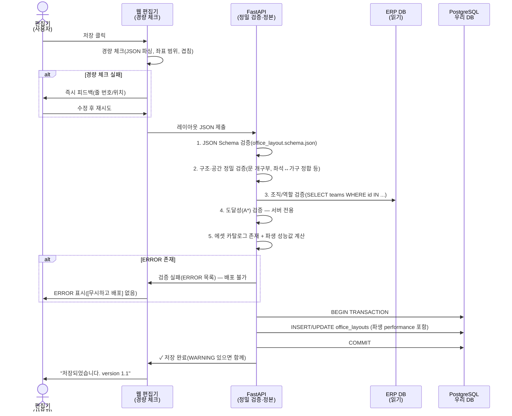

# 05. office_layout JSON 스키마

> 🟡 **D27 부분 개정(2026-07-09) — layout JSON 스키마 본체(floor/zones/rooms/seats/furniture/colliders/spawn/exit/doors, top_left 미터 좌표 D25, 좌석타입, 검증 규칙)는 D27에서도 정본으로 그대로 유효하다. 오직 로드·좌표변환·성능예산 서술(§5)만 D27(포토리얼 웹임베드)로 개정됐다: Godot 씬빌드/pak/.tscn/ResourceLoader → Blender 파라메트릭 씬 빌더(오프라인 렌더) + R3F(three.js) 런타임 로드, Godot `Vector3(x, floor_height, y)`/`Basis` 좌표변환 → 실측 camera.json 기준 Blender(x,y,z)→three.js(x,z,-y), MultiMesh 200드로우콜 예산 → 배경 렌더 예산(Blender)·아바타 예산(three.js).** 정본 = 00-decisions §H · 07-3d-visual-asset-pipeline · 14/15/16 · photoreal-web-strategy.

**작성일**: 2026-07-01  
**최종 갱신**: 2026-07-09  
**버전**: 1.3 (D27 부분 개정)  
**담당**: 시스템 설계팀 + 3D 엔진팀  
**참조**: 00-decisions.md (정본 결정, 특히 D7~D12·D25·§H D27), 04-data-model.md (DB 구조), 06-screens.md (편집기 UI), 07-3d-visual-asset-pipeline.md (에셋·렌더 파이프라인), spikes/depth-composite/public/camera.json (실측 좌표계 정본)

> 이 문서는 00-decisions.md의 정본 결정을 따른다. 충돌 시 00-decisions.md가 이긴다.

---

## 개요

`office_layout` JSON은 가상오피스의 **공간 구조 및 상호작용 규칙의 원본(Source of Truth)**이다. 각 층(floor)마다 1개의 JSON blob으로 저장되며(1 floor = 1 layout), 2D 편집기에서 생성/수정되고, 검증 통과 후 두 갈래에서 소비된다(D27 포토리얼 웹임베드): (1) **Blender 파라메트릭 씬 빌더**(`build_office.py`)가 오프라인 배경 렌더용 3D 씬을 조립하고, (2) **R3F(three.js) 런타임**이 상호작용 좌표(좌석·문·스폰·근접 zone 등)를 로드해 웹에서 아바타·인터랙션 레이어를 얹는다. 코드로 하드코딩되지 않으므로, 사무실 변경은 DB 업데이트 + 배경 재렌더로만 반영된다(재컴파일 불필요).

**핵심 원칙(정본 결정 반영):**
- **공간 구조만 담는다(D10)**: 좌석-직원 배정은 이 JSON에 넣지 않는다. 배정은 DB `seat.assigned_user_id`(현재값) + `seat_assignment_history`(이력)가 담당하며(04 정본), 배정 변경은 레이아웃 재배포가 필요 없다.
- **좌표계는 `top_left` 단일·미터 단위(D25)**: 다른 원점은 허용하지 않는다.
- **에셋은 `asset_id` 참조만(D8)**: asset 카탈로그를 조회한다. layout JSON에 파일 경로를 넣지 않는다. D27에서 배경 에셋은 Blender 오프라인 렌더로 굽고(§5.1), 런타임 프록시만 three.js가 로드한다.
- **정밀 검증은 서버 1곳(D12)**: 도달성(A*) 포함 정밀 검증은 FastAPI가 단독으로 수행한다. 웹 편집기는 경량 체크만, 런타임 클라이언트(R3F)는 검증하지 않고 신뢰한다.

---

## 1. office_layout JSON 스키마 정의

### 1.1 루트 구조

```json
{
  "metadata": { ... },
  "floor": { ... },
  "dimensions": { ... },
  "zones": [ ... ],
  "rooms": [ ... ],
  "seats": [ ... ],
  "furniture": [ ... ],
  "colliders": [ ... ],
  "spawn_points": [ ... ],
  "spawn_default": { ... },
  "minimap": { ... },
  "connections": { ... },
  "performance": { ... }
}
```

### 1.2 각 섹션 정의

#### 1.2.1 metadata

```json
{
  "metadata": {
    "version": "1.0",
    "schema_version": 1,
    "layout_id": "550e8400-e29b-41d4-a716-446655440001",
    "office_id": "550e8400-e29b-41d4-a716-446655440010",
    "floor_id": "550e8400-e29b-41d4-a716-446655440020",
    "floor_name": "3F",
    "created_at": "2026-07-01T10:00:00Z",
    "updated_at": "2026-07-01T15:30:00Z",
    "created_by": 101,
    "updated_by": 102,
    "description": "3층 개발팀 구역 레이아웃 v2",
    "language": "ko-KR"
  }
}
```

| 필드 | 타입 | 필수 | 설명 |
|------|------|------|------|
| version | string | Y | JSON 스키마 버전(semantic) |
| schema_version | integer | Y | 브레이킹 체인지 감지용 정수 |
| layout_id | UUID | Y | office_layout.id (DB PK) |
| office_id | UUID | Y | office.id |
| floor_id | UUID | Y | floor.id |
| floor_name | string | Y | floor.name (예: "3F", "B1") |
| created_at, updated_at | ISO8601 | Y | 타임스탬프 |
| created_by, updated_by | integer(user_id) | Y | erp_user.id |
| description | string | N | 변경사항 메모 |
| language | string | Y | 로케일 기본값 (현재 ko-KR) |

#### 1.2.2 floor

```json
{
  "floor": {
    "id": "550e8400-e29b-41d4-a716-446655440020",
    "level": 3,
    "name": "3F",
    "total_area_m2": 2500,
    "coordinate_origin": "top_left",
    "floor_height_m": 8.4,
    "grid_snap_unit_cm": 10,
    "unit_system": "metric"
  }
}
```

| 필드 | 설명 |
|------|------|
| id | floor.id (UUID) |
| level | 실제 층수(지상 3층 = 3, B1 = -1) |
| name | 표시명 |
| total_area_m2 | 층 전체 면적(정보용) |
| coordinate_origin | 좌표계 원점. **`top_left` 하나만 허용(D25)**. `center`/`bottom_left`는 폐기 |
| floor_height_m | 이 층 바닥의 3D 월드 높이축 오프셋(m). 다층 매핑에 사용(§5.3). three.js에서는 월드 Y로 매핑(§5.3, D27) |
| grid_snap_unit_cm | 편집기 그리드 단위(cm) |
| unit_system | 측정 단위. **`metric`(미터) 고정** |

> **D25 좌표계 확정**: 모든 좌표는 원점 `top_left`, 단위 미터, 2D 평면(x, y)로 저장한다. x는 오른쪽(동)으로 증가, y는 아래쪽(남)으로 증가한다. 3D 월드(Blender/three.js)로의 변환식은 §5.3에 정의한다(D27).

#### 1.2.3 dimensions

```json
{
  "dimensions": {
    "width_m": 80.0,
    "height_m": 60.0,
    "min_x": 0.0,
    "max_x": 80.0,
    "min_y": 0.0,
    "max_y": 60.0,
    "unit": "meter"
  }
}
```

층의 전체 바운드박스. 편집기에서 캔버스 크기와 동일.

#### 1.2.4 zones (팀 구역)

```json
{
  "zones": [
    {
      "zone_id": "Z_001",
      "team_zone_db_id": "550e8400-e29b-41d4-a716-446655440030",
      "org_group_id": "550e8400-e29b-41d4-a716-446655440040",
      "erp_team_id": 201,
      "label": "개발팀",
      "type": "team",
      "color": "#4A90E2",
      "polygon": [
        { "x": 0.0, "y": 0.0 },
        { "x": 20.0, "y": 0.0 },
        { "x": 20.0, "y": 15.0 },
        { "x": 0.0, "y": 15.0 }
      ],
      "access_control": {
        "allowed_roles": ["admin", "leader", "employee"],
        "restricted": false
      },
      "visual": {
        "show_boundary": true,
        "boundary_style": "dashed",
        "boundary_width_cm": 2
      }
    }
  ]
}
```

| 필드 | 타입 | 설명 |
|------|------|------|
| zone_id | string | JSON 내 임시 고유ID(예: Z_001, Z_002) |
| team_zone_db_id | UUID | team_zone.id (DB FK) |
| erp_team_id | BIGINT | ERP teams.id |
| org_group_id | UUID | 우리 org_group.id (상위 부서) |
| label | string | 팀명 |
| type | enum | team, department, meeting_hub 등 |
| color | hex | UI 표시 색상 |
| polygon | array | 좌표 배열(폐쇄형 다각형) |
| access_control | object | 접근권한 정의 |
| visual | object | 경계 표시 옵션 |

#### 1.2.5 rooms (회의실, 라운지, 집중실, 폰부스 등)

```json
{
  "rooms": [
    {
      "room_id": "R_001",
      "room_db_id": "550e8400-e29b-41d4-a716-446655440050",
      "name": "회의실 A",
      "type": "meeting",
      "capacity": 6,
      "floor_id": "550e8400-e29b-41d4-a716-446655440020",
      "coords": {
        "x": 25.0,
        "y": 10.0,
        "width": 6.0,
        "height": 4.5
      },
      "entrance": {
        "trigger_x": 27.25,
        "trigger_y": 13.5,
        "trigger_width": 1.5,
        "trigger_height": 0.8,
        "entry_direction": "south"
      },
      "livekit_room": "meeting_3f_001",
      "capacity_mode": "by_room",
      "max_concurrent_users": 6,
      "doors": [
        {
          "door_id": "D_001",
          "wall": "south",
          "offset": 3.0,
          "width": 1.2,
          "door_type": "glass_single"
        }
      ],
      "glass_walls": [
        {
          "wall_id": "GW_001",
          "edge": "south",
          "start": { "x": 25.0, "y": 14.5 },
          "end": { "x": 31.0, "y": 14.5 },
          "transparency": 0.7,
          "frame_color": "#333333"
        }
      ],
      "climate": {
        "ac_outlet": { "x": 26.0, "y": 11.0 }
      },
      "markers": {
        "whiteboard": { "x": 26.5, "y": 12.0 },
        "projector": { "x": 27.5, "y": 10.5 }
      }
    }
  ]
}
```

| 필드 | 타입 | 설명 |
|------|------|------|
| room_id | string | JSON 내 임시 고유ID |
| room_db_id | UUID | room.id (DB FK) |
| type | enum | meeting, lobby, lounge, focus, phonebooth |
| capacity | integer | room.capacity (수용 인원) |
| coords | object | 위치(좌상단 x,y) + 크기(width, height) |
| entrance | object | 입장 트리거(콜리전 박스 + 진입 방향). **room 경계 내부**에 위치해야 함(§3.2) |
| livekit_room | string | room.livekit_room(화상회의 연결) |
| capacity_mode | enum | by_seats (좌석 기반) 또는 by_room (방 기반) |
| **doors** | array | **문 개구부(D9)**. 벽 세그먼트에 뚫린 출입구 구멍 정의. 배열이므로 방마다 여러 문 가능 |
| glass_walls | array | 유리벽 정의 |
| markers | object | 화이트보드, 프로젝터 등 랜드마크 |

##### doors (문 개구부) 필드 상세 — D9

room의 벽 콜리전은 room 경계에서 자동 생성되는 벽 세그먼트이며, `doors`에 정의된 위치는 **개구부(구멍)**로 처리되어 아바타가 통과할 수 있다. 개구부가 없으면 방은 사방이 막힌 상자가 되어 진입 불가하다.

| 필드 | 타입 | 설명 |
|------|------|------|
| door_id | string | JSON 내 임시 고유ID |
| wall | enum | 개구부가 뚫릴 벽. `north`/`south`/`east`/`west` (room `coords` 기준 변) |
| offset | float(m) | 해당 벽의 시작 모서리(top_left 기준: west/east 벽은 위쪽 y, north/south 벽은 왼쪽 x)에서 **개구부 중심까지의 거리(m)** |
| width | float(m) | 개구부 폭(m). 도어 폭 규약 0.9~1.2m 권장(07 §1.2와 정합) |
| door_type | enum | 문 스타일(`glass_single`/`glass_double`/`wooden_single`/`wooden_double`/`open`(문짝 없는 개방 통로)) |

> **콜리전 생성 규칙(D9)**: room 경계(coords의 사각형 네 변) → 각 변을 벽 세그먼트로 자동 생성. 단, `doors[]`에 정의된 `(wall, offset, width)` 구간은 벽 세그먼트에서 제외되어 개구부가 된다. 서버(FastAPI)는 이 개구부를 A* 내비게이션의 통행 가능 지점으로 사용한다. 별도의 `colliders[]` 항목으로 room 벽을 solid box 하나로 덮지 않는다(그러면 개구부가 사라진다).

#### 1.2.6 seats (고정좌석, 자율좌석, 임시좌석)

> **D10 — 좌석 배정 분리**: seat 객체는 **공간 구조(위치·타입·방향·설비)만** 담는다. 좌석-직원 배정(`assigned_user_id` 등)은 이 JSON에 넣지 않으며, DB `seat.assigned_user_id`(현재값) + `seat_assignment_history`(이력)가 단독으로 관리한다(04 정본). 클라이언트/서버는 런타임에 `seat_db_id`로 `seat.assigned_user_id`를 조회해 현재 착석자를 얻는다. **좌석 배정 변경은 레이아웃 재배포가 필요 없다**(§2.4 참조).

```json
{
  "seats": [
    {
      "seat_id": "S_001",
      "seat_db_id": "550e8400-e29b-41d4-a716-446655440060",
      "team_zone_id": "550e8400-e29b-41d4-a716-446655440030",
      "seat_type": "fixed",
      "coords": {
        "x": 3.5,
        "y": 2.0
      },
      "facing": 180,
      "furniture_id": "F_001",
      "desk_dimension": {
        "width": 1.5,
        "depth": 0.8,
        "height": 0.75
      },
      "lifecycle_status": "deployed",
      "accessibility": {
        "wheelchair_accessible": false,
        "ergonomic_type": "standard"
      },
      "nearby_amenities": {
        "has_monitor_stand": true,
        "has_keyboard": true,
        "has_phone": false
      }
    },
    {
      "seat_id": "S_002",
      "seat_db_id": "550e8400-e29b-41d4-a716-446655440061",
      "team_zone_id": "550e8400-e29b-41d4-a716-446655440030",
      "seat_type": "free",
      "coords": {
        "x": 5.0,
        "y": 2.0
      },
      "facing": 180,
      "furniture_id": "F_002",
      "desk_dimension": {
        "width": 1.5,
        "depth": 0.8
      },
      "lifecycle_status": "deployed"
    }
  ]
}
```

| 필드 | 타입 | 설명 |
|------|------|------|
| seat_id | string | JSON 내 임시 고유ID |
| seat_db_id | UUID | seat.id (DB FK). 착석자 조회는 이 값으로 `seat.assigned_user_id` 참조(이력은 `seat_assignment_history`) |
| seat_type | enum | fixed(고정), free(자율), temp(임시), partner(협력사) |
| team_zone_id | UUID | team_zone.id (공간 소속. 직원 배정과 무관) |
| coords | object | 좌석 중심 좌표(x, y) |
| **facing** | float(도) | **착석 방향(D10)**. 아바타가 앉았을 때 바라보는 방향. 도(degree), 시계방향, 기준축 +X(§5.3). 예: 90 = 남향(+Y) |
| **furniture_id** | string | **책상 상호 참조(D10)**. 이 좌석이 딸린 `furniture[]` 항목의 `furniture_id`. 좌석 좌표는 이 가구의 `coords`에서 파생되므로 좌표 중복·desync를 방지한다 |
| desk_dimension | object | 책상 크기(meter). 정보용. 실제 3D 배치는 `furniture_id`가 가리키는 가구 에셋을 따른다 |
| lifecycle_status | enum | deployed, archived, removed |
| accessibility | object | 접근성 정보 |
| nearby_amenities | object | 주변 설비(모니터, 키보드, 전화) |

> **좌석↔가구 좌표 정합**: seat의 `coords`와 `furniture_id`가 가리키는 desk의 `coords`는 동일해야 한다(§3.2 검증 규칙). 편집기는 좌석 배치 시 딸린 desk를 함께 이동시켜 desync를 원천 차단한다.

#### 1.2.7 furniture (테이블, 캐비닛, 베드 등 일반 가구)

> **D8 — 에셋 참조 방식(D27 개정)**: furniture는 `asset_id`로 **에셋 카탈로그**를 참조한다. layout JSON에 파일 경로(glb 등)를 넣지 않는다. D27 포토리얼 웹임베드에서 `asset_id`는 **Blender 파라메트릭 씬 빌더(`build_office.py`)가 오프라인 배경 렌더 시 배치하는 3D 에셋(.blend/GLB 소스)**을 가리키며, R3F 런타임은 상호작용 오브젝트(예: 좌석 하이라이트)에 한해 동일 `asset_id`로 경량 프록시를 참조한다(§5.1). `dimension`·`type` 등은 편집기 표시·검증용 캐시이며, 실측 크기 정본은 asset 테이블(07 §5.3)이다.

```json
{
  "furniture": [
    {
      "furniture_id": "F_001",
      "asset_id": "DESK_STANDARD_001",
      "type": "desk",
      "category": "workspace",
      "coords": {
        "x": 10.0,
        "y": 5.0,
        "rotation": 0
      },
      "dimension": {
        "width": 1.5,
        "depth": 0.8,
        "height": 0.75
      },
      "collision": true,
      "physics": {
        "type": "static",
        "mass": 0
      },
      "visual": {
        "color": "#D4A574",
        "material": "wood"
      },
      "interactive": false
    },
    {
      "furniture_id": "F_002",
      "asset_id": "CABINET_STORAGE_001",
      "type": "cabinet",
      "coords": {
        "x": 15.0,
        "y": 1.0,
        "rotation": 0
      },
      "dimension": {
        "width": 1.2,
        "depth": 0.6,
        "height": 2.0
      },
      "collision": true,
      "physics": {
        "type": "static",
        "mass": 0
      }
    }
  ]
}
```

| 필드 | 설명 |
|------|------|
| furniture_id | JSON 내 고유ID |
| asset_id | asset(에셋 레지스트리).asset_id FK. **클라이언트 동봉 카탈로그 조회 키(D8)** |
| type | desk, cabinet, shelf, plant, sofa, printer 등 |
| coords | 2D 좌표(x, y) + `rotation`(도, 시계방향, 기준축 +X). 3D 배치 변환은 §5.3 |
| dimension | 가구 크기(meter). 표시·검증용 캐시. 정본은 asset 테이블 `dimension` |
| collision | 콜리전 활성화 여부 |
| physics | static(고정), dynamic(움직임), 질량 등 |

#### 1.2.8 colliders (충돌 영역 정의)

> **collider 형상 표기(D12 정합)**: 형상은 `shape` 필드로 `box`/`polygon`을 분리한다. `shape="box"`면 `box` 객체(x, y, width, height, rotation)를, `shape="polygon"`이면 `polygon` 배열(꼭짓점 좌표)을 사용한다. 한 필드(`coords`)가 객체/배열 두 형태를 겸하던 다형성을 제거해 스키마 검증을 단순화한다.

```json
{
  "colliders": [
    {
      "collider_id": "C_001",
      "shape": "box",
      "box": {
        "x": 20.0,
        "y": 10.0,
        "width": 8.0,
        "height": 6.0,
        "rotation": 0
      },
      "physics": {
        "is_kinematic": false,
        "block_avatar": true,
        "block_interaction": false
      },
      "layer": 1,
      "description": "구조 벽(개구부 없는 통짜 벽)"
    },
    {
      "collider_id": "C_002",
      "shape": "polygon",
      "polygon": [
        { "x": 0.0, "y": 0.0 },
        { "x": 15.0, "y": 0.0 },
        { "x": 15.0, "y": 12.0 },
        { "x": 0.0, "y": 12.0 }
      ],
      "physics": {
        "block_avatar": true
      },
      "layer": 1,
      "description": "외부벽"
    }
  ]
}
```

아바타의 움직임 경로(A\* 내비게이션)와 물리 충돌 계산에 사용됨.

> **room 벽과의 관계(D9)**: room 경계 벽은 `doors[]` 개구부를 반영해 **자동 생성**되므로, `colliders[]`에 room을 통짜 box로 다시 넣지 않는다. `colliders[]`는 외벽·기둥·개구부 없는 구조 벽 등 room 스키마로 표현되지 않는 정적 장애물에만 사용한다.

#### 1.2.9 spawn_points (아바타 시작위치)

```json
{
  "spawn_points": [
    {
      "spawn_id": "SP_LOBBY",
      "type": "lobby",
      "coords": { "x": 40.0, "y": 30.0 },
      "facing": 0,
      "description": "로비 입구"
    },
    {
      "spawn_id": "SP_DEV_TEAM",
      "type": "team_zone",
      "zone_id": "Z_001",
      "coords": { "x": 10.0, "y": 8.0 },
      "facing": 45,
      "description": "개발팀 입장"
    }
  ]
}
```

사용자가 층 진입 시 스폰되는 위치. 팀/부서별로 다를 수 있음(권한 기반).

#### 1.2.10 spawn_default

```json
{
  "spawn_default": {
    "spawn_id": "SP_LOBBY",
    "fallback_spawn_id": "SP_LOBBY",
    "facing_default": 0
  }
}
```

기본 스폰 위치. 권한 매칭 실패 시 사용.

#### 1.2.11 minimap

```json
{
  "minimap": {
    "enabled": true,
    "viewport_x": 0.0,
    "viewport_y": 0.0,
    "viewport_width": 80.0,
    "viewport_height": 60.0,
    "pixel_width": 400,
    "pixel_height": 300,
    "pixels_per_meter": 5.0,
    "show_zones": true,
    "show_seats": true,
    "show_rooms": true,
    "show_avatars": true,
    "show_grid": false,
    "layers": [
      {
        "layer_id": "base",
        "type": "background",
        "color": "#F5F5F5"
      },
      {
        "layer_id": "zones",
        "type": "vector",
        "visible": true
      },
      {
        "layer_id": "rooms",
        "type": "vector",
        "visible": true
      }
    ]
  }
}
```

클라이언트의 미니맵 렌더링 설정.

#### 1.2.12 connections (로직 연결)

```json
{
  "connections": {
    "floor_adjacencies": [
      {
        "floor_id": "550e8400-e29b-41d4-a716-446655440019",
        "exit_id": "EXIT_STAIR",
        "entry_id": "SP_STAIR_DOWN",
        "description": "계단"
      },
      {
        "floor_id": "550e8400-e29b-41d4-a716-446655440021",
        "exit_id": "EXIT_ELEVATOR",
        "entry_id": "SP_ELEVATOR",
        "description": "엘리베이터"
      }
    ],
    "exit_points": [
      {
        "exit_id": "EXIT_STAIR",
        "coords": { "x": 75.0, "y": 55.0 },
        "target_floor_id": "550e8400-e29b-41d4-a716-446655440019"
      }
    ],
    "zone_to_room_shortcuts": [
      {
        "zone_id": "Z_001",
        "room_id": "R_001",
        "relation": "primary_meeting_room"
      }
    ]
  }
}
```

층 간 이동, 회의실 바로가기 등 내비게이션 설정.

#### 1.2.13 performance

```json
{
  "performance": {
    "total_furniture_count": 120,
    "total_colliders": 45,
    "total_assets": 32,
    "estimated_polygon_count": 640000,
    "estimated_draw_calls": 180,
    "estimated_memory_mb": 256,
    "recommended_device_tier": "mid",
    "optimization_notes": "D27: 배경은 Blender 오프라인 렌더로 굽히므로 estimated_draw_calls는 실시간 예산이 아닌 배경 렌더 참고값(§1.2.13)"
  }
}
```

성능 예측 및 최적화 힌트.

> **성능 예산 재정의(D27)**: D26+Godot 실시간 렌더 폐기로, layout에서 파생하던 **`estimated_draw_calls`/MultiMesh 200드로우콜 예산은 오프라인 배경 렌더에는 부적절**하다(배경은 Blender가 한 번 렌더해 PNG+깊이패스로 굽고, 런타임 GPU는 그 이미지를 합성할 뿐 실시간 드로우콜을 소비하지 않는다). D27에서 성능 예산은 두 축으로 분리한다:
> - **배경 렌더 예산(Blender)**: `estimated_polygon_count`·씬 복잡도는 `build_office.py`의 오프라인 렌더 시간·GPU 메모리 상한을 판정하는 데 쓴다. 실시간 프레임 예산이 아니다.
> - **아바타 예산(three.js)**: 런타임 GPU 예산은 배경 이미지 위에 얹는 아바타·인터랙션 프록시·깊이합성 셰이더에만 적용한다. 드로우콜/폴리곤 상한 정본은 **3d-design/optimization-criteria.md §1**(배경=오프라인 렌더 예산, 아바타=런타임 예산)에 위임한다.
>
> `performance` 블록 수치는 편집기가 자기신고하지 않고 **FastAPI 서버가 저장 시 asset 테이블(07 §5.3)의 `polygon_count`·`dimension` 등에서 파생 계산**해 채운다. `estimated_polygon_count`는 각 furniture asset `polygon_count`의 인스턴스 합(배경 씬 복잡도 지표). `estimated_draw_calls`는 **D27에서 실시간 예산이 아닌 배경 렌더 참고값**으로 강등되며, 검증(§3.4)의 하드 게이트는 배경 렌더 예산·아바타 예산(3d-design/optimization-criteria.md §1 위임)으로 대체한다. 편집기가 보낸 값은 무시하고 서버 계산값으로 덮어쓴다.

---

## 2. 버전 & 상태 관리

### 2.1 status 필드 (office_layout.status)

```
draft      → 작성 중. 검증 미실행. 클라이언트 미배포.
validated  → 검증 완료. 문제 없음. 배포 준비.
deployed   → 라이브 운영 중. 클라이언트 사용 중.
archived   → 이전 버전. 참고용만 유지.
```

### 2.2 버전 관리 규칙

- **schema_version**: 브레이킹 체인지(필드 삭제, 타입 변경)가 있으면 +1. 하위호환성 유지 시 유지.
- **version(metadata.version)**: Semantic Versioning(1.0, 1.1, 2.0). UI에서 변경사항 요약과 함께 저장.
- **롤백 단위**: 버전·롤백은 **층(floor) 단위**다(1 floor = 1 layout). office 전체를 한 번에 롤백하지 않는다(06 §3.3.3과 정합).
- **DB FK 설계**: 
  - seat_db_id, room_db_id 등으로 JSON 내 좌석/방의 현재 구성을 DB와 매칭.
  - 나중에 좌석이 삭제되어도 JSON에서 참조 가능(감사 추적).

#### schema_version 호환성 처리

| 상황 | 동작 |
|------|------|
| **지원 버전 범위** | 클라이언트/서버는 지원하는 `schema_version`의 최소~최대 범위를 상수로 보유(예: `SUPPORTED_SCHEMA = [1, 1]`) |
| **미지원(상위) 버전 수신** | 클라이언트는 **로드를 거부**하고 "클라이언트 업데이트가 필요합니다" 안내 후 자동 업데이트 채널(D8)로 유도. 렌더링을 시도하지 않는다 |
| **미지원(하위) 버전 수신** | 서버가 마이그레이션 어댑터로 최신 스키마로 올려 응답하거나, 어댑터가 없으면 저장 시점에 재검증·업그레이드 |
| **핸드셰이크 협상** | WSS 핸드셰이크의 `protocol_version` 협상(D4)과 함께 `schema_version` 호환성도 확인. 불일치 시 접속 거부 + 안내 |

#### 상태 전이 & 라이브 동기화(롤백 포함)

```
draft → validated → deployed
                       │
                       ├─(롤백)→ 현 deployed 를 archived 처리 ─→ 이전 버전 재deployed
                       └─(신버전 배포)→ 이전 deployed 는 archived
```

- **롤백 시 상태 전이**: 롤백 = 현재 `deployed` 레이아웃을 `archived` 처리하고, 지정한 이전 버전을 다시 `deployed`로 승격(재deployed)한다. 별도 `rolled_back` 상태는 없다(04 §3.4 enum 4종 draft/validated/deployed/archived 유지).
- **라이브 클라이언트 강제 동기화**: 배포/롤백이 확정되면 서버가 접속 중인 모든 클라이언트에 `layout_updated`(layout_id, new_version, schema_version) 이벤트를 push한다. 클라이언트는 안전 시점(회의 중이 아니거나 이동 정지 상태)에 새 레이아웃을 재로드한다. 회의 중 사용자에 대한 처리는 §Open questions 1의 정책을 따른다.

### 2.3 버전 히스토리

```sql
-- office_layout 테이블(04 §2.3 정본)
id, office_id, floor_id, version, status, json, created_by, validated_by, deployed_at, deployment_notes, created_at, updated_at
```

> **변경 이력 기록**: 이전 서술의 `updated_by`·`changelog` 컬럼은 없다(04 정본과 통일). 레이아웃 변경 이력은 공용 `audit_log`(04 §2.6, 예: `office_layout_deployed`)로 기록한다.

### 2.4 좌석 배정과 레이아웃의 분리 (D10)

좌석-직원 배정은 layout JSON이 아니라 DB `seat.assigned_user_id`(현재값) + `seat_assignment_history`(이력) — 04-data-model.md 정본 — 에 저장된다.

> **C4-a 정본 확정(2026-07-02)**: 배정 정본은 04의 `seat.assigned_user_id` + `seat_assignment_history`(해제 시각은 `unassigned_at`)다. 이전 서술의 별도 `seat_assignment` 테이블(erp_user_id, released_at)은 존재하지 않는다.

- layout JSON은 좌석의 **공간 구조**(위치·타입·방향·설비)만 담고 `assigned_user_id`를 갖지 않는다.
- 착석자 조회: `seat_db_id`로 `seat.assigned_user_id`(현재값)를 참조하고, 이력은 `seat_assignment_history`(seat_id, user_id, assigned_at, unassigned_at)를 참조.
- **좌석 배정 변경(직원 자리 이동, 자율좌석 점유/반납 등)은 `seat.assigned_user_id`(+ `seat_assignment_history` 이력)만 갱신**하며 layout 재배포·재검증이 필요 없다. 따라서 배정 변경은 버전을 올리지 않는다(라이브 중 변경으로 인한 inconsistent 위험이 원천 제거됨).
- 공간 구조 변경(좌석 신설/삭제/좌표 이동)만 layout 버전을 올린다.

---

## 3. 검증 규칙 및 검증 아키텍처

### 3.0 검증 아키텍처 (D12)

정밀 검증은 **FastAPI 서버 1곳**에서만 수행한다. 각 계층의 역할:

| 계층 | 검증 범위 | 근거 |
|------|----------|------|
| **웹 편집기(클라이언트)** | **경량 체크만**: JSON 파싱, 좌표 범위, 오브젝트 겹침 등 즉시 피드백용. 이것은 UX 편의이며 권위가 아니다 | D12 |
| **FastAPI 서버(정본)** | **정밀 검증 전부**: 구조·공간·조직/역할·설비·미니맵 + **도달성(A*) 검증**. 공식 JSON Schema 파일 기준 스키마 검증 후, 서버 코드가 도달성·파생 성능값을 계산. ERROR 존재 시 저장 거부 | D12 |
| **런타임 클라이언트(R3F/three.js)** | **검증 안 함**. 서버가 배포한 레이아웃을 신뢰하고 배경 합성·상호작용 렌더링만 한다(D27) | D12 |

- **공식 JSON Schema 파일 경로**: `backend/app/schemas/office_layout.schema.json`(Draft 2020-12). 서버·편집기·CI가 모두 이 단일 파일을 참조한다. 편집기의 경량 체크도 이 스키마의 부분집합을 사용한다.
- **ERROR/WARNING 정책(D12)**: 하나라도 **ERROR가 있으면 배포 불가**(웹 편집기의 `[무시하고 배포]` 버튼 제거). **WARNING만** `[경고 무시하고 배포]`로 진행 가능. 06 §5.2의 검증 실패 다이얼로그와 정합.
- 아래 §3.1~§3.5의 규칙은 **서버 정밀 검증의 규칙 목록**이다. 심각도(ERROR/WARNING)는 서버 판정 기준이며, 편집기는 이 중 경량 항목만 미리 보여준다.

### 3.1 구조 검증

| 규칙 | 심각도 | 설명 |
|------|--------|------|
| **JSON 파싱** | ERROR | JSON 형식 오류(따옴표, 콤마 등) |
| **필수 필드** | ERROR | metadata, floor, dimensions, zones, rooms, seats, colliders 필수 존재 |
| **ID 고유성** | ERROR | 같은 floor 내 zone_id, room_id, seat_id, furniture_id, collider_id 중복 금지 |
| **좌표 범위** | ERROR | 모든 좌표가 dimensions 내 범위에 있어야 함(x: [min_x, max_x], y: [min_y, max_y]) |

### 3.2 공간 검증

| 규칙 | 심각도 | 설명 |
|------|--------|------|
| **오브젝트 충돌** | ERROR | 가구 또는 방이 콜리전 영역과 겹쳤는가? |
| **좌석 접근성** | WARNING | 좌석이 폐쇄된 공간(콜리전 내부)에 갇혀 있지는 않은가? |
| **회의실 수용인원** | ERROR | `capacity_mode=by_seats`인 room은 **해당 room 경계 내부에 seats가 capacity개** 존재해야 함. `by_room`이면 room 내부 좌석 수와 무관(capacity는 max_concurrent_users로만 판정) |
| **입장 트리거** | ERROR | `entrance.trigger_x, trigger_y`(트리거 박스 전체)가 room `coords` 경계 **내부**에 있어야 함. 경계 밖이거나 콜리전과 겹치면 ERROR |
| **문 개구부 정합(D9)** | ERROR | 각 room의 `doors[]`가 최소 1개 존재(진입 가능). 각 door의 `(wall, offset, width)`가 해당 벽 길이 범위 내에 완전히 들어가야 함(offset±width/2 ⊆ [0, 벽길이]) |
| **입장 트리거↔문 정합** | WARNING | `entrance`가 어느 `doors[]` 개구부와 근접(같은 벽·구간 겹침)하는지. 개구부 없는 벽에 트리거만 있으면 경고 |
| **좌석↔가구 좌표 정합(D10)** | ERROR | seat의 `furniture_id`가 유효한 furniture를 가리키고, seat `coords`와 그 furniture `coords`(x, y)가 일치해야 함(desync 방지) |
| **facing 범위** | WARNING | seat `facing`, spawn `facing`이 [0, 360) 범위(도)인가 |
| **아바타 이동경로** | WARNING | A\* 내비게이션으로 spawn_point → 모든 주요 지점(room entrance/door, zone center) 도달 가능? (**서버 전용 정밀 검증** — D12) |

### 3.3 조직/역할 검증

| 규칙 | 심각도 | 설명 |
|------|--------|------|
| **팀 구역 연결** | ERROR | zone의 erp_team_id가 유효한가?(ERP teams 존재 확인) |
| **org_group 누락** | WARNING | zone이 org_group_id를 지정하지 않으면 경고(권한 계층에 영향) |

> **좌석 배정 검증 제외(D10)**: 좌석-직원 배정은 layout JSON에 없으므로(§2.4) 여기서 검증하지 않는다. 배정 유효성(erp_user 존재 등)은 `seat.assigned_user_id` 갱신(및 `seat_assignment_history` 기록) 시점에 별도로 검증한다.

### 3.4 설비 검증

| 규칙 | 심각도 | 설명 |
|------|--------|------|
| **회의실 LiveKit 연결** | WARNING | type=meeting인 room에 livekit_room이 지정되지 않음 |
| **에셋 존재** | ERROR | furniture.asset_id가 asset 카탈로그(asset 테이블)에 존재하는가?(D8) |
| **배경 렌더 예산(D27)** | ERROR | 서버 파생 `estimated_polygon_count`·씬 복잡도가 `build_office.py` 오프라인 렌더 예산(3d-design/optimization-criteria.md §1, 배경=오프라인 렌더 예산)을 초과하면 거부. **종전 실시간 드로우콜 200 게이트는 D27에서 폐기** |
| **아바타/런타임 예산(D27)** | WARNING | three.js 런타임에 얹는 아바타·인터랙션 프록시·깊이합성 예산 초과 여부. 정본 상한은 3d-design/optimization-criteria.md §1(아바타=런타임 예산)에 위임 |
| **메모리 예측** | WARNING | 서버 파생 `estimated_memory_mb`가 기준 사양(D22 VRAM 예산)을 초과하면 경고 |

> **개수 프록시 폐기(D7·D12 정합) + D27 예산 재정의**: 종전의 "furniture_count > 500개 거부"처럼 **개수를 성능 프록시로 쓰던 규칙은 폐기**한다(유지). 단 D27에서는 **실시간 드로우콜 예산(MultiMesh 200) 게이트도 폐기**한다 — 배경은 Blender가 오프라인으로 한 번 렌더해 PNG+깊이패스로 굽기 때문에 런타임 드로우콜을 소비하지 않는다. 성능 판정은 (1) 배경 렌더 예산(Blender 렌더 시간·GPU 메모리, §1.2.13) (2) 아바타 예산(three.js 런타임, 3d-design/optimization-criteria.md §1 위임)의 두 축으로 대체한다.

### 3.5 미니맵 검증

| 규칙 | 심각도 | 설명 |
|------|--------|------|
| **뷰포트 범위** | ERROR | minimap.viewport_*이 dimensions를 벗어남 |
| **픽셀 해상도** | WARNING | pixel_width * pixel_height < 100,000 or > 1,000,000 |

### 3.6 검증 실행 흐름

> **아키텍처(D12)**: 편집기는 **경량 체크(범위/겹침)**로 즉시 피드백만 주고, **정밀 검증(도달성 A* 포함)과 최종 심각도 판정은 FastAPI 서버가 단독**으로 한다. 편집기 체크는 권위가 아니므로, 편집기를 통과해도 서버가 ERROR를 낼 수 있다.



---

## 4. 예시 JSON: 샘플 층 레이아웃

다음은 실제 가상오피스 3층(개발팀) 로비 및 개발팀 구역의 완전한 예시이다.

```json
{
  "metadata": {
    "version": "1.1",
    "schema_version": 1,
    "layout_id": "550e8400-e29b-41d4-a716-446655440001",
    "office_id": "550e8400-e29b-41d4-a716-446655440010",
    "floor_id": "550e8400-e29b-41d4-a716-446655440020",
    "floor_name": "3F",
    "created_at": "2026-07-01T10:00:00Z",
    "updated_at": "2026-07-02T09:10:00Z",
    "created_by": 101,
    "updated_by": 102,
    "description": "3층 개발팀 구역 레이아웃 v1.1 (문 개구부·좌석 분리 반영)",
    "language": "ko-KR"
  },
  "floor": {
    "id": "550e8400-e29b-41d4-a716-446655440020",
    "level": 3,
    "name": "3F",
    "total_area_m2": 2500,
    "coordinate_origin": "top_left",
    "floor_height_m": 8.4,
    "grid_snap_unit_cm": 10,
    "unit_system": "metric"
  },
  "dimensions": {
    "width_m": 80.0,
    "height_m": 60.0,
    "min_x": 0.0,
    "max_x": 80.0,
    "min_y": 0.0,
    "max_y": 60.0,
    "unit": "meter"
  },
  "zones": [
    {
      "zone_id": "Z_001",
      "team_zone_db_id": "550e8400-e29b-41d4-a716-446655440030",
      "org_group_id": "550e8400-e29b-41d4-a716-446655440040",
      "erp_team_id": 201,
      "label": "개발팀",
      "type": "team",
      "color": "#4A90E2",
      "polygon": [
        { "x": 0.0, "y": 0.0 },
        { "x": 25.0, "y": 0.0 },
        { "x": 25.0, "y": 20.0 },
        { "x": 0.0, "y": 20.0 }
      ],
      "access_control": {
        "allowed_roles": ["admin", "leader", "employee"],
        "restricted": false
      },
      "visual": {
        "show_boundary": true,
        "boundary_style": "dashed",
        "boundary_width_cm": 2
      }
    },
    {
      "zone_id": "Z_002",
      "team_zone_db_id": "550e8400-e29b-41d4-a716-446655440031",
      "org_group_id": "550e8400-e29b-41d4-a716-446655440040",
      "erp_team_id": 202,
      "label": "마케팅팀",
      "type": "team",
      "color": "#E24A8E",
      "polygon": [
        { "x": 25.0, "y": 0.0 },
        { "x": 50.0, "y": 0.0 },
        { "x": 50.0, "y": 20.0 },
        { "x": 25.0, "y": 20.0 }
      ],
      "access_control": {
        "allowed_roles": ["admin", "leader", "employee"],
        "restricted": false
      },
      "visual": {
        "show_boundary": true,
        "boundary_style": "dashed",
        "boundary_width_cm": 2
      }
    }
  ],
  "rooms": [
    {
      "room_id": "R_001",
      "room_db_id": "550e8400-e29b-41d4-a716-446655440050",
      "name": "회의실 A",
      "type": "meeting",
      "capacity": 6,
      "floor_id": "550e8400-e29b-41d4-a716-446655440020",
      "coords": {
        "x": 55.0,
        "y": 5.0,
        "width": 6.0,
        "height": 4.5
      },
      "entrance": {
        "trigger_x": 57.4,
        "trigger_y": 8.5,
        "trigger_width": 1.5,
        "trigger_height": 0.8,
        "entry_direction": "south"
      },
      "livekit_room": "meeting_3f_001",
      "capacity_mode": "by_room",
      "max_concurrent_users": 6,
      "doors": [
        {
          "door_id": "D_R001_S",
          "wall": "south",
          "offset": 3.0,
          "width": 1.2,
          "door_type": "glass_single"
        }
      ],
      "glass_walls": [
        {
          "wall_id": "GW_001",
          "edge": "south",
          "start": { "x": 55.0, "y": 9.5 },
          "end": { "x": 61.0, "y": 9.5 },
          "transparency": 0.7,
          "frame_color": "#333333"
        }
      ],
      "climate": {
        "ac_outlet": { "x": 56.0, "y": 6.0 }
      },
      "markers": {
        "whiteboard": { "x": 56.5, "y": 7.0 },
        "projector": { "x": 57.5, "y": 5.5 }
      }
    },
    {
      "room_id": "R_002",
      "room_db_id": "550e8400-e29b-41d4-a716-446655440051",
      "name": "라운지",
      "type": "lounge",
      "capacity": 15,
      "floor_id": "550e8400-e29b-41d4-a716-446655440020",
      "coords": {
        "x": 65.0,
        "y": 15.0,
        "width": 12.0,
        "height": 8.0
      },
      "entrance": {
        "trigger_x": 68.0,
        "trigger_y": 22.2,
        "trigger_width": 2.0,
        "trigger_height": 0.8,
        "entry_direction": "south"
      },
      "livekit_room": null,
      "capacity_mode": "by_room",
      "max_concurrent_users": 15,
      "doors": [
        {
          "door_id": "D_R002_S",
          "wall": "south",
          "offset": 4.0,
          "width": 2.0,
          "door_type": "open"
        }
      ],
      "glass_walls": [],
      "climate": {
        "ac_outlet": { "x": 70.0, "y": 18.0 }
      },
      "markers": {
        "coffee_machine": { "x": 66.0, "y": 17.0 },
        "snack_table": { "x": 72.0, "y": 19.0 }
      }
    }
  ],
  "seats": [
    {
      "seat_id": "S_001",
      "seat_db_id": "550e8400-e29b-41d4-a716-446655440060",
      "team_zone_id": "550e8400-e29b-41d4-a716-446655440030",
      "seat_type": "fixed",
      "coords": {
        "x": 3.5,
        "y": 2.0
      },
      "facing": 180,
      "furniture_id": "F_001",
      "desk_dimension": {
        "width": 1.5,
        "depth": 0.8,
        "height": 0.75
      },
      "lifecycle_status": "deployed",
      "accessibility": {
        "wheelchair_accessible": false,
        "ergonomic_type": "standard"
      },
      "nearby_amenities": {
        "has_monitor_stand": true,
        "has_keyboard": true,
        "has_phone": false
      }
    },
    {
      "seat_id": "S_002",
      "seat_db_id": "550e8400-e29b-41d4-a716-446655440061",
      "team_zone_id": "550e8400-e29b-41d4-a716-446655440030",
      "seat_type": "fixed",
      "coords": {
        "x": 5.0,
        "y": 2.0
      },
      "facing": 180,
      "furniture_id": "F_002",
      "desk_dimension": {
        "width": 1.5,
        "depth": 0.8,
        "height": 0.75
      },
      "lifecycle_status": "deployed",
      "accessibility": {
        "wheelchair_accessible": false,
        "ergonomic_type": "standard"
      },
      "nearby_amenities": {
        "has_monitor_stand": true,
        "has_keyboard": true,
        "has_phone": false
      }
    },
    {
      "seat_id": "S_003",
      "seat_db_id": "550e8400-e29b-41d4-a716-446655440062",
      "team_zone_id": "550e8400-e29b-41d4-a716-446655440030",
      "seat_type": "free",
      "coords": {
        "x": 6.5,
        "y": 2.0
      },
      "facing": 180,
      "furniture_id": "F_003",
      "desk_dimension": {
        "width": 1.5,
        "depth": 0.8,
        "height": 0.75
      },
      "lifecycle_status": "deployed",
      "accessibility": {
        "wheelchair_accessible": false,
        "ergonomic_type": "standard"
      },
      "nearby_amenities": {
        "has_monitor_stand": true,
        "has_keyboard": true,
        "has_phone": false
      }
    },
    {
      "seat_id": "S_101",
      "seat_db_id": "550e8400-e29b-41d4-a716-446655440063",
      "team_zone_id": "550e8400-e29b-41d4-a716-446655440031",
      "seat_type": "fixed",
      "coords": {
        "x": 28.0,
        "y": 3.0
      },
      "facing": 180,
      "furniture_id": "F_101",
      "desk_dimension": {
        "width": 1.5,
        "depth": 0.8,
        "height": 0.75
      },
      "lifecycle_status": "deployed",
      "accessibility": {
        "wheelchair_accessible": false,
        "ergonomic_type": "standard"
      },
      "nearby_amenities": {
        "has_monitor_stand": true,
        "has_keyboard": true,
        "has_phone": true
      }
    }
  ],
  "furniture": [
    {
      "furniture_id": "F_001",
      "asset_id": "DESK_STANDARD_001",
      "type": "desk",
      "category": "workspace",
      "coords": {
        "x": 3.5,
        "y": 2.0,
        "rotation": 0
      },
      "dimension": {
        "width": 1.5,
        "depth": 0.8,
        "height": 0.75
      },
      "collision": true,
      "physics": {
        "type": "static",
        "mass": 0
      },
      "visual": {
        "color": "#D4A574",
        "material": "wood"
      },
      "interactive": false
    },
    {
      "furniture_id": "F_002",
      "asset_id": "DESK_STANDARD_001",
      "type": "desk",
      "category": "workspace",
      "coords": {
        "x": 5.0,
        "y": 2.0,
        "rotation": 0
      },
      "dimension": {
        "width": 1.5,
        "depth": 0.8,
        "height": 0.75
      },
      "collision": true,
      "physics": {
        "type": "static",
        "mass": 0
      },
      "visual": {
        "color": "#D4A574",
        "material": "wood"
      },
      "interactive": false
    },
    {
      "furniture_id": "F_003",
      "asset_id": "DESK_STANDARD_001",
      "type": "desk",
      "category": "workspace",
      "coords": {
        "x": 6.5,
        "y": 2.0,
        "rotation": 0
      },
      "dimension": {
        "width": 1.5,
        "depth": 0.8,
        "height": 0.75
      },
      "collision": true,
      "physics": {
        "type": "static",
        "mass": 0
      },
      "visual": {
        "color": "#D4A574",
        "material": "wood"
      },
      "interactive": false
    },
    {
      "furniture_id": "F_101",
      "asset_id": "DESK_STANDARD_001",
      "type": "desk",
      "category": "workspace",
      "coords": {
        "x": 28.0,
        "y": 3.0,
        "rotation": 0
      },
      "dimension": {
        "width": 1.5,
        "depth": 0.8,
        "height": 0.75
      },
      "collision": true,
      "physics": {
        "type": "static",
        "mass": 0
      },
      "visual": {
        "color": "#D4A574",
        "material": "wood"
      },
      "interactive": false
    },
    {
      "furniture_id": "F_CABINET_001",
      "asset_id": "CABINET_STORAGE_001",
      "type": "cabinet",
      "category": "storage",
      "coords": {
        "x": 15.0,
        "y": 1.0,
        "rotation": 0
      },
      "dimension": {
        "width": 1.2,
        "depth": 0.6,
        "height": 2.0
      },
      "collision": true,
      "physics": {
        "type": "static",
        "mass": 0
      },
      "visual": {
        "color": "#CCCCCC",
        "material": "metal"
      },
      "interactive": false
    },
    {
      "furniture_id": "F_SOFA_LOUNGE",
      "asset_id": "SOFA_3SEAT_001",
      "type": "sofa",
      "category": "lounge",
      "coords": {
        "x": 68.0,
        "y": 17.0,
        "rotation": 0
      },
      "dimension": {
        "width": 2.1,
        "depth": 0.9,
        "height": 0.8
      },
      "collision": true,
      "physics": {
        "type": "static",
        "mass": 0
      },
      "visual": {
        "color": "#4A4A4A",
        "material": "fabric"
      },
      "interactive": false
    }
  ],
  "colliders": [
    {
      "collider_id": "C_EXT_WALL_NORTH",
      "shape": "box",
      "box": {
        "x": 0.0,
        "y": 0.0,
        "width": 80.0,
        "height": 0.3,
        "rotation": 0
      },
      "physics": {
        "is_kinematic": false,
        "block_avatar": true,
        "block_interaction": false
      },
      "layer": 1,
      "description": "북쪽 외벽"
    },
    {
      "collider_id": "C_EXT_WALL_SOUTH",
      "shape": "box",
      "box": {
        "x": 0.0,
        "y": 59.7,
        "width": 80.0,
        "height": 0.3,
        "rotation": 0
      },
      "physics": {
        "is_kinematic": false,
        "block_avatar": true,
        "block_interaction": false
      },
      "layer": 1,
      "description": "남쪽 외벽"
    }
  ],
  "spawn_points": [
    {
      "spawn_id": "SP_LOBBY",
      "type": "lobby",
      "coords": { "x": 40.0, "y": 50.0 },
      "facing": 0,
      "description": "층 입장(로비)"
    },
    {
      "spawn_id": "SP_DEV_TEAM",
      "type": "team_zone",
      "zone_id": "Z_001",
      "coords": { "x": 10.0, "y": 8.0 },
      "facing": 45,
      "description": "개발팀 구역 입장"
    },
    {
      "spawn_id": "SP_MARKETING_TEAM",
      "type": "team_zone",
      "zone_id": "Z_002",
      "coords": { "x": 35.0, "y": 8.0 },
      "facing": 45,
      "description": "마케팅팀 구역 입장"
    }
  ],
  "spawn_default": {
    "spawn_id": "SP_LOBBY",
    "fallback_spawn_id": "SP_LOBBY",
    "facing_default": 0
  },
  "minimap": {
    "enabled": true,
    "viewport_x": 0.0,
    "viewport_y": 0.0,
    "viewport_width": 80.0,
    "viewport_height": 60.0,
    "pixel_width": 400,
    "pixel_height": 300,
    "pixels_per_meter": 5.0,
    "show_zones": true,
    "show_seats": true,
    "show_rooms": true,
    "show_avatars": true,
    "show_grid": false,
    "layers": [
      {
        "layer_id": "base",
        "type": "background",
        "color": "#F5F5F5"
      },
      {
        "layer_id": "zones",
        "type": "vector",
        "visible": true
      },
      {
        "layer_id": "rooms",
        "type": "vector",
        "visible": true
      },
      {
        "layer_id": "seats",
        "type": "vector",
        "visible": true
      },
      {
        "layer_id": "avatars",
        "type": "raster",
        "visible": true
      }
    ]
  },
  "connections": {
    "floor_adjacencies": [
      {
        "floor_id": "550e8400-e29b-41d4-a716-446655440019",
        "exit_id": "EXIT_STAIR",
        "entry_id": "SP_STAIR_DOWN",
        "description": "계단(2층으로)"
      },
      {
        "floor_id": "550e8400-e29b-41d4-a716-446655440021",
        "exit_id": "EXIT_ELEVATOR",
        "entry_id": "SP_ELEVATOR",
        "description": "엘리베이터(4층으로)"
      }
    ],
    "exit_points": [
      {
        "exit_id": "EXIT_STAIR",
        "coords": { "x": 75.0, "y": 55.0 },
        "target_floor_id": "550e8400-e29b-41d4-a716-446655440019"
      },
      {
        "exit_id": "EXIT_ELEVATOR",
        "coords": { "x": 78.0, "y": 28.0 },
        "target_floor_id": "550e8400-e29b-41d4-a716-446655440021"
      }
    ],
    "zone_to_room_shortcuts": [
      {
        "zone_id": "Z_001",
        "room_id": "R_001",
        "relation": "primary_meeting_room"
      }
    ]
  },
  "performance": {
    "total_furniture_count": 6,
    "total_colliders": 2,
    "total_assets": 3,
    "estimated_polygon_count": 118000,
    "estimated_draw_calls": 9,
    "estimated_memory_mb": 96,
    "recommended_device_tier": "low",
    "optimization_notes": "소규모 샘플. D27에서 배경은 Blender 오프라인 렌더로 굽히므로 estimated_draw_calls는 실시간 예산이 아닌 배경 렌더 참고값이다(§1.2.13)."
  }
}
```

> 위 `performance` 값은 서버가 asset 카탈로그에서 파생 계산한 예시다(§1.2.13). **D27에서 `estimated_draw_calls`는 실시간 렌더 예산이 아니라 배경 렌더 참고값으로 강등**됐다(배경은 Blender가 오프라인으로 렌더). 편집기가 보낸 값이 아니라 서버 계산값이 정본이다.

---

## 5. 로드·변환·사용 (D27 포토리얼 웹임베드)

> **D27 전환 요지**: D26+Godot(실시간 렌더, `build_scene` GDScript, pak `.tscn` `ResourceLoader`)는 폐기됐다. layout JSON을 소비하는 주체는 (1) **Blender 파라메트릭 씬 빌더**(`build_office.py`, 오프라인 배경 렌더) + (2) **R3F(three.js) 런타임**(상호작용 좌표 로드)으로 바뀌었다. 좌표 변환은 실측 `camera.json`(`spikes/depth-composite/public/camera.json`) 기준 **Blender(x,y,z) → three.js(x,z,-y)**를 따른다(§5.3). 정본은 07-3d-visual-asset-pipeline·14/15/16·photoreal-web-strategy·render-pipeline/build_office.py.

### 5.1 Blender 파라메트릭 씬 빌더 (배경 렌더, 오프라인)

배경은 실시간으로 그리지 않는다. `build_office.py`가 layout JSON을 읽어 **Blender 씬을 파라메트릭하게 조립**하고, 정해진 카메라(`camera.json`)로 **컬러 PNG + 깊이패스 PNG**를 한 번 렌더해 굽는다. 런타임은 이 이미지를 깊이합성(R3F)으로 표시할 뿐, 배경 지오메트리를 GPU로 실시간 렌더하지 않는다.

- **에셋 배치(D8)**: `furniture[].asset_id`로 asset 카탈로그의 3D 소스(.blend/GLB)를 조회해 `coords`(§5.3 변환) 위치·회전으로 씬에 인스턴싱한다. 동일 `asset_id` 반복은 Blender linked-duplicate로 묶어 렌더 메모리를 절약한다(실시간 드로우콜 개념 아님).
- **room 벽/콜리전**: 배경 렌더에는 `doors[]` 개구부를 반영한 벽 메시를 세워 시각적으로만 굽는다. 통행 판정(A*)은 런타임(§5.2)이 담당하므로 배경 메시와 분리된다.
- **깊이패스 export 훅**: `build_office.py`는 렌더 후 `camera.json`의 `depth_encoding`(0=near/black ~ 1=far/white, 16bit) 규약으로 깊이 PNG를 함께 export한다. 이 깊이맵이 런타임 오클루전 합성의 근거다. 상세 파이프라인·훅 정본은 **07-3d-visual-asset-pipeline.md** 및 **16(render-pipeline)**, `render-pipeline/build_office.py`를 참조한다.

```python
# build_office.py (개념) — layout JSON → Blender 씬 → 컬러/깊이 PNG (오프라인)
import bpy, json

def build_office(layout: dict, camera_json: dict):
    scene = bpy.context.scene
    floor_h = layout["floor"]["floor_height_m"]

    # 가구: asset_id → asset 카탈로그의 .blend/GLB 소스 배치
    for f in layout["furniture"]:
        obj = load_asset(f["asset_id"])                 # 카탈로그 미존재는 검증에서 차단(§3.4)
        obj.location = layout_to_blender(f["coords"], floor_h)   # §5.3
        obj.rotation_euler.z = deg_to_rad_cw(f["coords"].get("rotation", 0.0))

    # room 벽: doors[] 개구부 반영해 시각 메시만 세움 (통행 판정은 런타임 §5.2)
    for room in layout["rooms"]:
        build_room_walls_visual(room, floor_h)          # solid box로 덮지 않음(D9)

    # 카메라 고정(camera.json) 후 컬러 + 깊이패스 렌더
    apply_camera(camera_json)                            # ortho, azimuth/elev 실측값
    render_color_png()                                  # office_bg.png
    render_depth_png(camera_json["depth_encoding"])     # office_depth.png (0=near..1=far)
```

### 5.2 R3F(three.js) 런타임 + 서버 (상호작용 레이어)

런타임은 배경 이미지를 깊이합성으로 깔고, 그 위에 **상호작용 좌표(좌석·문·스폰·근접 zone·콜리전)**만 three.js로 얹는다. layout JSON을 그대로 fetch해 좌표 변환(§5.3)만 적용한다.

```ts
// R3F 런타임 (개념) — 상호작용 오브젝트만 배치, 배경은 렌더된 PNG 합성
const layout = await fetchLayout(floorId);        // 배포된 layout JSON
const floorH = layout.floor.floor_height_m;

// 좌석/스폰/문 등 상호작용 마커: Blender→three.js 축 리맵(§5.3)
for (const seat of layout.seats) {
  const p = layoutToThree(seat.coords, floorH);   // (x, z, -y) 리맵
  addSeatMarker(scene, p, seat.facing);           // 아바타 착석 지점
}

// 배경 깊이합성: office_bg.png + office_depth.png (camera.json 규약)
mountDepthComposite(scene, bgTexture, depthTexture, cameraJson);
```

- **근접(proximity)·회의실 점유**: zone 다각형 포함 판정, room `max_concurrent_users` 체크 등 상호작용 로직은 **서버(FastAPI)** 또는 클라이언트 좌표 판정으로 수행한다(종전 Godot 헤드리스 서버 GDScript는 폐기). A* 내비게이션은 `colliders[]` + `doors[]` 개구부를 근거로 서버가 계산한다(D12).
- **에셋(D8)**: 상호작용에 필요한 오브젝트에 한해 `asset_id`로 경량 프록시(three.js glTF)를 로드한다. 배경 지오메트리는 이미 PNG로 구워졌으므로 런타임 로드 대상이 아니다.

### 5.3 좌표계 → 3D 월드 매핑 (D25 좌표 저장 + D27 축 리맵)

layout JSON의 2D 좌표(원점 `top_left`, 미터, D25)는 그대로 유지된다. D27에서 3D 월드로의 변환만 **실측 `camera.json` 기준 Blender/three.js 규약**으로 바뀐다.

**저장 좌표(D25, 유지):** x는 오른쪽(동)으로, y는 아래쪽(남)으로 증가하는 2D 미터 평면.

**1) Blender 배치 (`build_office.py`, Z-up):**

```
Blender: (x, y_blender, z_up)
  x        = layout coords.x          # +X = 동
  y_blender = -(layout coords.y)      # top_left의 아래(+y, 남)를 Blender +Y_forward에 맞춰 부호 반전
  z_up      = floor.floor_height_m    # 층 바닥 높이 오프셋
```

**2) Blender → three.js 축 리맵 (camera.json `threejs_notes.axis_remap`):**

```
three.js(x, y_up, z_forward) = Blender(x, z, -y)     # 실측 정본
```

즉 layout 좌표를 three.js 월드로 직접 쓰면:
- **three.js X** = layout `coords.x` (+X = 동)
- **three.js Y(월드 높이)** = `floor.floor_height_m` (Blender z_up → three.js y_up)
- **three.js Z** = layout `coords.y` (Blender −y_blender = −(−coords.y) = coords.y). top_left에서 y(남)가 커질수록 three.js +Z.

**회전·facing 규약(유지):**
- 단위 **도(degree)**, **시계방향**, **기준축 +X**(동쪽이 0도). 0=동, 90=남, 180=서, 270=북. (D25에서 확정, D27에서도 불변)
- three.js `rotateY`는 반시계·라디안 기준이므로 부호 변환: `mesh.rotation.y = THREE.MathUtils.degToRad(-angle_cw)`.

```ts
// 단일 오브젝트 변환(furniture.coords, seat.facing, spawn.facing 공통)
function layoutToThree(coords: {x:number,y:number,rotation?:number}, floorHeight: number) {
  const pos = new THREE.Vector3(coords.x, floorHeight, coords.y);  // (x, y_up, z)
  const angleCw = coords.rotation ?? 0;                            // 도, 시계방향, 기준축 +X
  const rotY = THREE.MathUtils.degToRad(-angleCw);
  return { pos, rotY };
}
```

**다층 건물의 floor_height 오프셋(유지):**
- 각 층 JSON의 `floor.floor_height_m`가 그 층 바닥의 월드 높이축(three.js Y / Blender z_up)이다.
- 규칙: `floor_height_m = (level - 1) * story_height` (지상). 예: 층고 `story_height = 4.2m`면 1F=0.0, 2F=4.2, 3F=8.4. 지하는 음수(B1 level=-1 → -4.2).
- 층 전환(계단/엘리베이터, `connections`)은 대상 층의 spawn으로 텔레포트한다. 다층 배경은 층별로 별도 렌더/합성한다(단일 씬 동시 로드 대신).

> 종전 Godot `Vector3(x, floor_height, y)`/`Basis(Vector3.UP, …)` 규약은 D27에서 위 Blender→three.js 리맵으로 대체된다. 저장 좌표(D25, top_left 미터)와 회전·facing 단위(도/시계방향/+X 기준)는 불변이며, **오직 3D 월드 축 매핑만** 실측 `camera.json`에 맞춰 갱신됐다.

---

## 6. Loop Metadata

### Upstream documents referenced
- 04-data-model.md: erp_user, team_zone, office, floor, room, seat, presence, meeting, kpi_result, asset 테이블 스키마
- 10-roadmap.md: 7단계 로드맵(특히 Step 3. 사무실 배치 편집기)

### Downstream documents affected
- 06-screens.md: JSON 편집기 UI 설계(좌표 선택, 검증 결과 표시)
- 07-3d-visual-asset-pipeline.md: Blender 파라메트릭 씬 빌드(build_office.py)·깊이패스·R3F 런타임 로드(office_layout 파싱), 배경/아바타 성능 예산 정본(D27)
- 16(render-pipeline)·`render-pipeline/build_office.py`: layout→Blender 씬 빌더·컬러/깊이 PNG export 구현(D27)
- 02-trd-architecture.md: office_layout CRUD 엔드포인트, 검증 API 정의

### Open questions
1. **공간 구조 변경 시 라이브 처리**: deployed 상태에서 좌석 좌표/문 위치 등 **공간 구조**가 바뀌어 재배포되면, 회의 중인 사용자는 재로드 시점을 언제로? → §2.2 라이브 강제 동기화 정책(안전 시점 재로드) 기준. (배정 변경은 D10으로 재배포 자체가 없어 해당 없음)
2. **폴리곤 좌표 정확도**: 16자리 소수점 필요? 정수(cm 단위) 충분?
3. **에셋 버전 관리**: asset(배경 .blend/GLB 소스 또는 런타임 프록시)이 업데이트되면 기존 layout에서 자동 반영되나? → D8: asset_id는 유지, 내용만 갱신. 배경 갱신은 `build_office.py` 재렌더로, 런타임 프록시는 배포 채널로 반영되며 layout 수정 불필요. 브레이킹 변경 시 새 asset_id 부여 + layout 마이그레이션.
4. **다층 빌딩의 floor_id**: 각 office_layout은 1개 floor_id만 가지는가? 또는 1개 JSON이 여러 층을 포함할 수 있나? → 현재 설계: 1 floor = 1 layout (확정). 다층 동시 로드는 §5.3 floor_height 오프셋으로 처리.

### Assumptions
- 좌표계는 2D(x, y)만 저장(원점 top_left, 미터, D25). 3D 월드 매핑은 D27 Blender(x,y,z)→three.js(x,z,-y) 리맵을 따르며(§5.3, camera.json 실측 정본), 월드 높이축(three.js Y)은 `floor_height_m` 오프셋 + 에셋 자체 높이로, layout의 y는 three.js Z(남북)에 매핑된다.
- 좌석은 room 내부(by_seats 모드일 때 capacity만큼) 또는 개방 구역/by_room에 속함.
- 에셋 카탈로그(asset 테이블)는 클라이언트 빌드에 동봉되며, JSON에서는 asset_id로만 참조(D8).
- 좌석-직원 배정은 layout이 아니라 `seat.assigned_user_id` + `seat_assignment_history` DB가 담당(D10, C4-a). ERP DB 동기화(teams, users)는 별도 배치 작업.

### Validation criteria
- [x] 모든 필드 설명: 타입, 필수 여부, 용도
- [x] 예시 JSON: 실제 사용 가능 (Blender 씬 빌드 + R3F 로드, 검증 통과) — v1.1에서 자체 검증 위반(입장 트리거 경계·by_seats 좌석 0개·문 개구부) 수정 완료
- [x] 검증 규칙: 에러/경고 분류, 심각도별 처리 흐름, 검증 아키텍처(D12)
- [x] 버전 관리: schema_version 호환성 처리, status·롤백 상태 전이(archived 재서술), 변경 이력 audit_log 기록(04 정본)
- [x] mermaid 다이어그램: 검증 시퀀스(웹 경량/서버 정밀 분리)
- [x] 상호 참조: 00(정본), 04, 06, 07 등 다른 문서 명확히 표기

### Risks
- **성능**: 파생 폴리곤/드로우콜 예산 초과 시 A*·렌더링 성능 저하. 개수가 아니라 파생값으로 모니터링(§3.4).
- **권한 누락**: 좌석/구역에 org_group_id가 없으면 접근 제어 실패. 검증 경고 필수.
- **문 개구부 누락**: room에 doors[]가 없으면 진입 불가한 밀폐 상자가 됨. 검증 ERROR로 차단(§3.2).
- **에셋 카탈로그 불일치**: asset 카탈로그(배경 소스·런타임 프록시)와 layout asset_id가 어긋나면 렌더/로드 실패. 검증에서 존재 확인 + 배포 채널로 동기화(D8, D27).

---

## 7. 변경 이력

| 버전 | 일자 | 변경 내용 |
|------|------|----------|
| 1.0 | 2026-07-01 | 초안 |
| 1.1 | 2026-07-02 | 00-decisions 반영: D9 문 개구부(doors[]) 신설·room 벽 자동생성 규칙, D10 좌석 배정 분리(assigned_user 제거·facing·furniture_id·§2.4), D25 좌표계 top_left 단일화·Godot 매핑식·floor_height 오프셋(§5.3), D12 검증 아키텍처(서버 단일 정밀검증·공식 JSON Schema·ERROR 배포차단)·검증 흐름 재작성, D8 에셋 asset_id 카탈로그 참조·model_glb 제거·씬빌더 ResourceLoader+MultiMesh, D7 드로우콜 예산 파생값 기준, schema_version 호환성·롤백 상태전이 보강, collider shape 필드 분리, floor_id UUID 통일, performance 서버 파생 계산, 샘플 JSON 자체 검증 위반 수정, "설파" 오탈자 수정, changelog 배열화 |
| 1.2 | 2026-07-02 | 데이터 정본 정렬: C4-a 좌석 배정 정본을 04(`seat.assigned_user_id`+`seat_assignment_history`, `unassigned_at`)로 확정·`seat_assignment`/`released_at` 참조 전면 정정, 상태 전이도 `rolled_back` 제거(롤백=archived 처리+이전 버전 재deployed, 04 enum 4종 유지), §2.3 컬럼 목록 04 정본 정정(updated_by·changelog 삭제→validated_by·deployed_at·deployment_notes, 이력은 audit_log), §6 샘플 JSON connections floor_id/target_floor_id UUID 정정(§1.2.12 규약) |
| 1.3 | 2026-07-09 | **D27 부분 개정(로드·변환·성능만, 스키마 본체 불변)**: D26+Godot 폐기→포토리얼 웹임베드. §5 전면 교체 — Godot `build_scene`(GDScript)·pak·.tscn·`ResourceLoader`·헤드리스 서버 → Blender 파라메트릭 씬 빌더(`build_office.py`, 오프라인 배경 렌더+깊이패스 export) + R3F(three.js) 런타임 상호작용 로드. §5.3 좌표변환 Godot `Vector3(x,floor_height,y)`/`Basis` → 실측 camera.json 기준 Blender(x,y,z)→three.js(x,z,-y) 리맵(top_left 미터 D25·회전/facing 도·시계방향·+X 기준 불변). 성능예산 재정의(§1.2.13·§3.4): 실시간 MultiMesh 200드로우콜 게이트 폐기 → 배경 렌더 예산(Blender)·아바타 예산(three.js, 07 optimization-criteria 위임). 개요·§1.2.2 floor_height·§1.2.7 D8 에셋참조·상단 배너·§6 downstream/assumptions/validation 문구 D27 정합. **JSON 스키마 정의(§1.2 필드·§2 버전·§3 검증 규칙·§4 샘플)는 정본으로 그대로 유효** |

---

**작성자**: 시스템 설계팀  
**마지막 수정**: 2026-07-09  
**검토 상태**: D27 부분 개정(v1.3 — 스키마 본체 유효, 로드/변환/성능절만 포토리얼 웹임베드로 개정)
