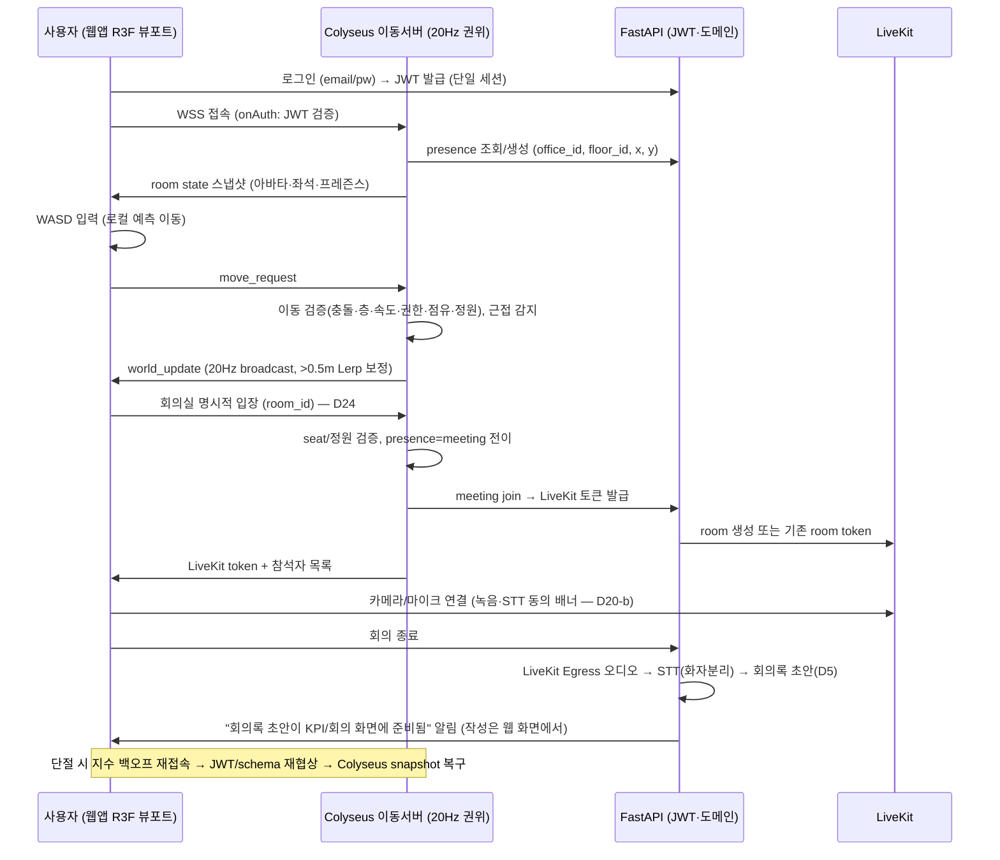
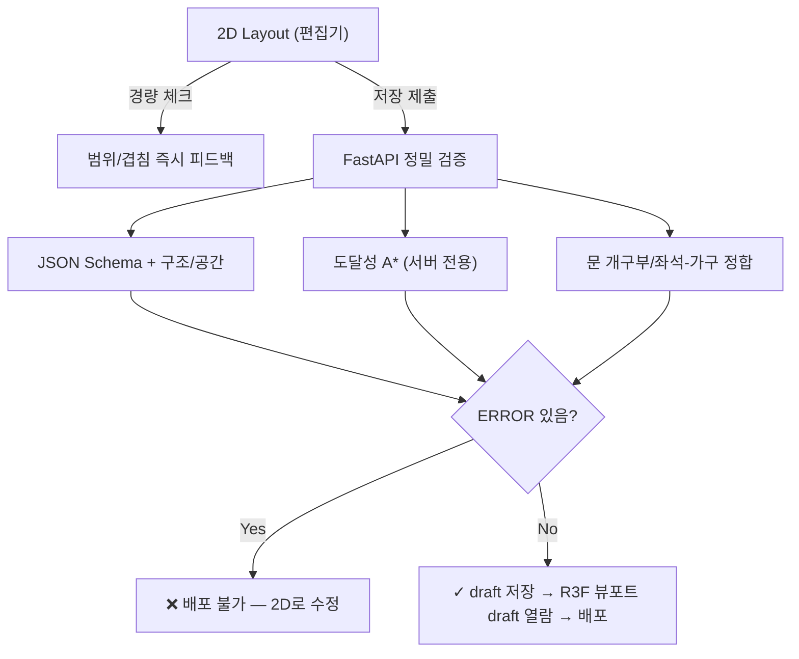
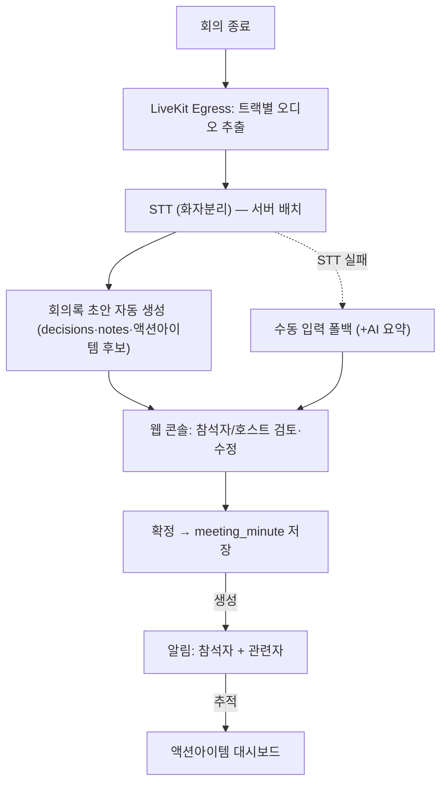
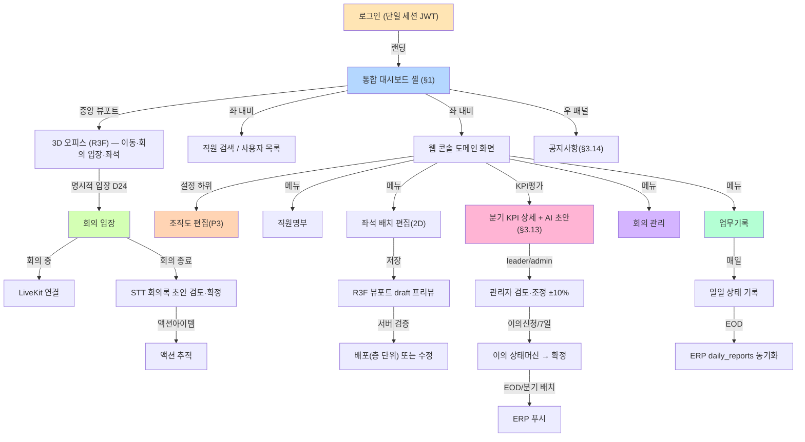

# 06-screens.md: 화면 명세

> **아키텍처 정본 = D27 포토리얼 웹임베드(2026-07-08 전환).** 클라이언트는 **단일 통합 웹앱(Next.js) 안의 react-three-fiber(R3F) 3D 뷰포트**이며, 별도 데스크톱 앱은 없다. 화면 구조·대시보드 셸 정본 = 3d-design/design-style-analysis §3, 14-virtual-office-spec §1·§2.8. 실시간(Colyseus 20Hz)·인증(단일 세션 FastAPI JWT)·렌더(Blender 오프라인 배경 + R3F 아바타 깊이합성) 정본 = 15-realtime-server-spec · 16-render-spike-and-roadmap · 3d-design/photoreal-web-strategy.
>
> **폐기 스택 표기**: 이하 §1(3D 메인 오피스)은 구 아키텍처(Godot 4 네이티브 데스크톱 HUD)를 D27 웹 뷰포트 기준으로 교체 서술한다. 웹 콘솔의 도메인 화면(회의록·업무·좌석·인사근태·KPI 등)은 그대로 유효하다.

## 메타 정보
- **프로젝트**: vituraloffice_new (가상오피스 운영 플랫폼)
- **작성일**: 2026-07-01
- **최종 갱신**: 2026-07-09
- **버전**: 2.0
- **대상**: 개발/기획 경험 있는 실무자 (L3)
- **목적**: screen-spec 입력 문서. 통합 대시보드 셸(R3F 3D 뷰포트 + 웹 콘솔 화면)의 모든 화면 정의
- **참조**: 00-decisions.md(정본 결정, 특히 D5·D11·D12·D15·D20·D22·§H D27), 14-virtual-office-spec.md(가상사무실 정본), 15-realtime-server-spec.md, 16-render-spike-and-roadmap.md, 3d-design/design-style-analysis.md(디자인·셸 정본)·photoreal-web-strategy.md(렌더), 05-office-layout-schema.md(레이아웃 스키마 정본), 08-kpi-logic.md(KPI 로직·메트릭 정본), 04-data-model.md(DB 스키마)

> 이 문서는 00-decisions.md의 정본 결정을 따른다. 충돌 시 00-decisions.md가 이긴다.

### 작성/열람 경계 원칙 (3D 뷰포트 ↔ 웹 콘솔)
- **3D 뷰포트(R3F, 대시보드 셸 중앙 상단) = 보기/입장/상태**: 3D 오피스 탐색, 회의실 명시적 입장, 프레즌스 표시, 자율좌석 점유/반납 같은 실시간 상호작용만 담당한다. **문서 작성 폼(회의록·업무기록 등)을 3D 뷰포트 안에 두지 않는다.**
- **웹 콘솔 화면(같은 앱의 다른 라우트/패널) = 모든 작성**: 회의록·업무기록·KPI 검토·이의신청·조직도/좌석 편집 등 모든 데이터 입력·편집은 웹 화면에서 한다.
- 뷰포트 오버레이(미디어바·HUD 등)에서 작성이 필요하면 해당 웹 콘솔 화면으로 이동하는 링크로 단일화한다(중복 폼 금지).

---

## 1. 통합 대시보드 셸 화면 (Unified Dashboard Shell — D27 정본)

> **정본**: 3d-design/design-style-analysis §3(레이아웃·그리드), 14-virtual-office-spec §1(화면 구조)·§2.8(대시보드 패널). 이 화면이 앱의 **랜딩·홈**이며, 3D 오피스는 이 화면 중앙 상단의 뷰포트로 임베드된다(별도 데스크톱 앱·별도 탭 없음).

### 1.0 화면 개요

단일 통합 웹앱(Next.js) 안의 **3분할 셸 + 중앙 상하 분할** 레이아웃이다. 좌 내비 · 중앙(상단 R3F 3D 뷰포트 + 하단 대시보드 3카드) · 우 패널로 구성되며, 다크 퍼스트 엔터프라이즈 톤(design-style-analysis 정본)을 따른다.

### 1.1 전체 레이아웃 구조

```
┌──────────────────────────────────────────────────────────────────────┐
│  Header (로고+앱명 | 오피스/층 선택 | 검색 | 알림·메시지 | 내 프로필)     │  ~56px
├────────┬────────────────────────────────────────────┬─────────────────┤
│  Left  │        3D 오피스 뷰포트 (R3F 포토리얼)        │   Right Panel   │
│  Nav   │        + 아바타/프레즌스 HUD/미니맵/          │   사용자 목록    │
│ ~240px │          층 선택/미디어바                     │   오늘의 일정    │
│        ├────────────────────────────────────────────┤   공지사항       │
│  가상  │  오늘의 업무 │ 나의 KPI 현황 │ 진행중 화상회의  │   ~320px        │
│  오피스│  (3-card dashboard row)                     │                 │
│  ...   │                                            │                 │
│  설정  │                                            │                 │
│ +프로필│                                            │                 │
└────────┴────────────────────────────────────────────┴─────────────────┘
```

### 1.2 각 영역 상세

#### **Header (상단, ~56px)**
- **로고 + 앱명**: 클릭 시 대시보드 셸(홈) 복귀
- **오피스/층 선택**: 다중 office/floor 구성 시 전환(뷰포트 층 선택기와 동기화)
- **Search Bar**: 직원 이름/팀 검색 → 뷰포트 아바타 강조 + 카메라 팬(design-style §6)
- **알림·메시지**: 알림 카운트 뱃지(`--danger`), 드롭다운
- **내 프로필**: 내 아바타 + 상태(online/working/meeting/focus/away/external/offline — D13 7종) + 드롭다운(마이페이지/로그아웃)

#### **Left Nav (좌측 내비게이션, ~240px 고정)**
아이콘+라벨 수직 메뉴. 활성 항목 = `--primary-soft` 배경 + `--primary` 좌측 인디케이터(design-style §3). 메뉴 항목(14 §1):
- **가상오피스**(대시보드 셸 = 이 화면) / **업무관리** / **업무현황** / **출장관리** / **KPI평가**(§3.4·§3.13 워크플로우) / **보고서** / **회의실예약** / **커뮤니케이션** / **인사·근태** / **설정**
- 하단: **내 프로필 카드**(아바타+이름+상태+상태변경 버튼)
> 각 메뉴 항목은 §3 이하의 웹 콘솔 도메인 화면으로 라우팅된다. 조직도 편집(§3.1)은 **설정** 하위 관리자 기능. 채팅/커뮤니케이션은 **회의 메모·근접 DM 수준**으로 한정하고 본격 채팅은 Phase 7 고도화(Open questions).

#### **3D 오피스 뷰포트 (중앙 상단 — R3F 포토리얼, 높이 ~55~60%)**
- **렌더**: Blender Cycles 오프라인 렌더 배경 + R3F 실시간 아바타 **깊이합성**(가구·유리벽 뒤 자연 가림). 고정 **아이소메트릭 2.5D**(약 30~35° 부감). 세부 = photoreal-web-strategy.
- **공간 요소**: 로비/브랜드월, 오픈좌석 군집, 유리 회의실(쿨 블루 네온 엣지 `--accent-cyan`), 라운지 소파존, 식물 데코, 층 표지.
- **뷰포트 오버레이 UI**(design-style §4):
  - **아바타 HUD**: 머리 위 이름+직급+상태 라벨(반투명 pill), 상태 점(7종 색)
  - **미니맵**: 좌하단 오버레이 카드, 조감도 + 아바타/회의실 색점, 확대/축소
  - **층 선택기(Floor)**: 뷰포트 우측 세로 탭(4F/3F/2F/1F/B1F), 활성 = `--primary`
  - **미디어 컨트롤 바**: 하단 중앙 pill 바(마이크·카메라·화면공유·이모지·더보기)
- **아바타 시스템**:
  - 로그인 직원 = erp_user.id → 좌석(seat) 배정 또는 로비 시작
  - 아바타 스타일: 본인 선택(5~10 템플릿, §3.9) + 이름/직급 HUD
  - 상태 7종(D13): offline/online/working/meeting/focus/away/external
  - 이동: WASD/마우스, **Colyseus 권위 서버 20Hz**가 이동/충돌/근접 검증(로컬 예측 + >0.5m Lerp 보정 — 15-realtime-server-spec)
- **상호작용 트리거**:
  - 회의실 명시적 입장(D24): 문 근처(2m) → "회의 입장" 프롬프트 → 클릭 → LiveKit 토큰·연결, presence=meeting, 참석자 기록
  - 자율좌석 점유(§3.11): 빈 free 좌석 클릭 → 착석
  - 협업 근접: 근접 시 프레즌스 시각화(협업 신호는 KPI 반감시 원칙 준수)

#### **대시보드 3카드 행 (중앙 하단 — 읽기 전용 요약/글랜스)**
> 매핑 정본 = 14 §2.8.1. 카드는 **daily 뷰**(period_type=`daily`, 당일 누적) 요약이며, 상세·편집은 각 도메인 화면으로 이동. 임의 점수를 만들지 않는다(정량은 결정론적 코드, AI는 서술만 — D14-e).

- **오늘의 업무**(work_log): 당일 업무 목록·진행도 요약. `[전체 보기 ›]` → 업무기록(§3.6)
- **나의 KPI 현황**(kpi_result, daily): **도넛 게이지 = `collaboration_score`(0–100)** 중앙 숫자 + 지표바 5종(§1.2.1 매핑). `[전체 보기 ›]` → KPI평가(§3.13)
- **진행중 화상회의**(meeting/participant): 참석자 타일(2×2 그리드) + 미디어 컨트롤. `[입장]`

##### 1.2.1 나의 KPI 카드 ↔ 메트릭 매핑 (14 §2.8.1 · 08 정본 바인딩)

| UI 위젯 | 바인딩 메트릭(08 / 04 §2.5) | 형식 | 비고 |
|---|---|---|---|
| **도넛 게이지**(중앙 `NN/100`) | `collaboration_score` | 0–100 | 헤드라인. 08 §1.2 합성 점수(업무건수30·충실도25·회의록20·액션15·기록10) |
| 지표바 ① | `work_completed_count` | 건수 | 완료 업무 건수(팀 벤치마크 대비 상대표시 권장) |
| 지표바 ② | `work_quality_score` | 0–100 | 업무 충실도 |
| 지표바 ③ | `minutes_authored_count` | 건수 | 회의록 작성 기여 |
| 지표바 ④ | `action_items_ontime_rate` | % | 액션아이템 기한 내 이행률 |
| 지표바 ⑤ | `report_fidelity_score` | 0–100 | 업무기록 충실도 |

- **표시 주기**: 카드는 daily 기본. AI 서술 초안·종합평가(상/중상/…)는 **분기(quarterly)에만** 존재하므로 카드에 노출하지 않고 KPI평가 화면(§3.13, 분기 상세)에서만 표시(08 §3·§6.2.2).
- **API**: 카드 = `GET /api/kpi/daily`(와이드포맷, 08 §6.2.1). 분기 상세 = `GET /api/kpi/quarterly`(08 §6.2.2).
- design-style §4의 `87/100`·`9/10`은 **시안 목업 예시**일 뿐, 실제 표시값은 위 메트릭에서 온다.

#### **Right Panel (우측, ~320px — 리스트형 카드 스택)**
- **사용자 목록**(presence/erp_user): 아바타+이름+상태 pill. 상단 탭 필터 **전체 / 사무실 / 회의중 / 외근·출장**(design-style §4). 클릭 → 뷰포트 카메라 추적
- **오늘의 일정**(meeting): 시간순 회의 리스트, 클릭 → 회의 상세(§3.5)
- **공지사항**(announcement): 카테고리별(system/notice/info) + 핀 고정 카드 스택(§3.14). `[전체 보기 ›]` → 공지 목록

### 1.3 상호작용 플로우 (Colyseus 권위 서버 기반 — 15-realtime-server-spec 정본)



---

## 2. 웹 콘솔 도메인 화면 (통합 대시보드 셸 내부 라우트 — Next.js + TailwindCSS)

### 2.1 화면 목록 및 계층

```
통합 대시보드 셸 (§1 — 랜딩·홈)
├── 조직도 편집기 (Organization Chart Editor, §3.1)
├── 직원명부 (Employee Directory, §3.2)
├── 좌석 배치 편집기 (Seat Assignment & Layout Manager, §3.3)
│   ├── 2D 편집 (Konva.js 전용)
│   ├── 저장 후 웹 뷰포트 내 3D 프리뷰(본인 draft 열람, 웹 실시간 재렌더 없음 — D11)
│   ├── 검증 & 배포 (층 단위)
│   └── 롤백 이력 (층 단위)
├── KPI 평가 워크플로우 (§3.13)
│   ├── 분기 KPI 상세 + AI 초안 열람 (직원, 08 §6.2.2)
│   ├── 관리자 검토·조정 ±10% (leader/admin, 08 §3.2·§6.2.3)
│   └── 이의신청 상태머신 none→submitted→reviewing→resolved (08 §3.3·§6.2.4)
├── KPI 대시보드 (추이/팀 종합, §3.4)
├── 이의신청 (KPI Objection, §3.7 — §3.13 워크플로우로 통합 열람)
├── 회의/회의록 (Meeting & Meeting Minutes, §3.5)
│   ├── 회의 일정 + 참석자
│   ├── 회의록 STT 초안 검토/확정 (D5)
│   └── 액션아이템 추적
├── 업무기록 (Work Log & Reports, §3.6)
│   ├── 일일/주간 업무보고
│   ├── 결과물 등록
│   └── EOD 상태 동기화
├── 공지사항 (Announcement, §3.14 — 우패널 카드 + 관리자 게시 화면)
├── 로그인/세션 (Auth, §3.8)
├── 아바타 커스터마이징 (§3.9)
├── 권한 규칙 & 접근 매트릭스 (RBAC, §3.10)
├── 자율좌석 점유/반납 (3D 뷰포트 상호작용, §3.11)
└── 관리자 동기화 모니터링 콘솔 (§3.12)
```

> 조직도 편집기(§3.1)는 **P3/고도화**로 마킹(MVP 범위 밖). 자율좌석 점유/반납(§3.11)은 3D 뷰포트 내 상호작용이나 배정 로직상 여기 함께 표기.

> **앱 랜딩 = 통합 대시보드 셸(§1)** — D27 전환으로 웹앱과 3D 오피스가 단일 화면으로 통합되었다(2026-07-08). 진입 시 대시보드 셸로 랜딩하며, 직원명부(§3.2) 등은 좌 내비에서 이동하는 하위 화면이다.

### 2.2 각 화면 상세 명세

---

## 3. 개별 화면 상세 정의

### 3.1 조직도 편집기 (Organization Chart Editor)

> **우선순위: P3 / 고도화 (MVP 범위 밖)** — PRD의 SHOULD/P3 분류에 맞춰 확정. MVP에서는 ERP 동기화된 조직 계층을 읽기 전용으로 표시하고, 편집 기능은 Phase 후반 고도화로 미룬다. 관리자 전용(§3.10).

#### 목적
- ERP teams + 우리 org_group 계층 시각화 및 편집
- 본부(division), 부서(department), 파트(part) 추가/삭제
- 각 org_group ↔ team_zone 매핑

#### 레이아웃
```
┌─────────────────────────────────────────────────────────┐
│ 조직도 편집기                                           │
├─────────────────────────────────────────────────────────┤
│ [+ 부서 추가] [+ 팀 매핑] [배포] [미리보기] [도움말]    │
├─────────────────────────────────────────────────────────┤
│                                                         │
│  ┌─ Company                                            │
│  │  ├─ 경영진 (Division) [color: 파랑]                │
│  │  │  ├─ 인사 (Team, ERP: team_5) [Edit] [Delete]   │
│  │  │  └─ 재무 (Team, ERP: team_3)                    │
│  │  ├─ 개발 (Division)                                │
│  │  │  ├─ 백엔드 (Part)                              │
│  │  │  │  └─ 인프라팀 (Team, ERP: team_1) [Edit]    │
│  │  │  └─ 프론트엔드 (Part)                          │
│  │  │     └─ 웹팀 (Team, ERP: team_2)               │
│  │  └─ 운영 (Division)                               │
│  │
│  우측 패널:
│  ┌─────────────────────────┐
│  │ 선택: 웹팀              │
│  │ ERP Team ID: team_2     │
│  │ 현재 인원: 6            │
│  │ 3D Zone: floor_1_zone_A │
│  │ Color: #FF6B9D         │
│  │ [편집] [삭제]           │
│  └─────────────────────────┘
│
└─────────────────────────────────────────────────────────┘
```

#### 컴포넌트
- **React Flow 그래프**: org_group (노드) → team_zone 엣지
- **노드 유형**: 
  - Division (직사각형, 색상)
  - Department (약간 작은 직사각형)
  - Part (동그라미)
  - Team (ERP 직원 수 표시)
- **에디팅**: 노드 우클릭 → 색상/이름 수정, 드래그로 재배열
- **Undo/Redo**: 변경 이력 저장

#### Data Requirements
- **입력**: org_group (id, name, type, parent_id, color, sort_order), team_zone (id, erp_team_id, org_group_id, office_id, floor_id, color)
- **출력**: org_group CRUD, team_zone 매핑 업데이트
- **참조**: 01-prd.md (조직 구조), 04-data-model.md (DB 스키마)

#### 상태 관리
- **저장 전 검증**: 순환 참조 없음, 모든 팀이 매핑됨
- **배포**: 즉시 반영 (office_layout 재계산 트리거 필요 시)

---

### 3.2 직원명부 (Employee Directory)

#### 목적
- ERP users 동기화 상태 조회 (읽기 전용 표시)
- 직원 기본정보 (이름, 팀, 직급, 상태)
- 좌석 배정 현황

#### 레이아웃
```
┌─────────────────────────────────────────────────────────┐
│ 직원명부                                               │
├─────────────────────────────────────────────────────────┤
│ [팀 필터] [상태 필터] [검색] [CSV 다운로드] [새로고침] │
├─────────────────────────────────────────────────────────┤
│                                                         │
│ 테이블:                                                │
│ ┌───────────────────────────────────────────────────┐  │
│ │ 이름    │ 팀      │ 직급    │ 좌석   │ 상태      │ │
│ ├───────────────────────────────────────────────────┤  │
│ │ Kim     │ 웹팀    │ Senior │ A-105 │ 온라인    │ │
│ │ Lee     │ 웹팀    │ Junior │ A-106 │ 회의중    │ │
│ │ Park    │ 백엔드팀│ Lead   │ B-201 │ 오프라인  │ │
│ │ …                                                 │  │
│ └───────────────────────────────────────────────────┘  │
│ [1] [2] [3] ... (페이지네이션)                         │
│ 읽기전용: ERP에서 매일 동기화됨. 편집은 ERP 관리자만. │
│
└─────────────────────────────────────────────────────────┘
```

#### 컴포넌트
- **다중 필터**: 팀(team_id), 상태(presence.status)
- **검색**: 이름/이메일 입력
- **테이블 열**: id(ERP), 이름, 팀, 직급, position_id, 좌석, 상태, 마지막 갱신
- **행 클릭**: 상세보기 사이드패널 (슬라이드인)

#### 상세보기 패널
```
┌────────────────────────────┐
│ Kim Jin (Senior)           │
│ 🔒 ERP 데이터 (읽기전용)  │
│                            │
│ 팀: 웹팀                   │
│ 직급: Senior               │
│ 보고대상: Park (리드)      │
│ Slack: @kim_jin            │
│ GitHub: kim-github         │
│ 이메일: kim@company.com    │
│                            │
│ 근무 설정:                 │
│ ├─ 근무 형태: 전일        │
│ ├─ 근무 시간: 09:00-18:00│
│ └─ 근무지: 서울 강남구    │
│   (GPS 수집 없음 — D13)   │
│                            │
│ 좌석 배정:                 │
│ ├─ 현재: A-105            │
│ ├─ 할당일: 2026-06-15    │
│ └─ 층: Floor 1            │
│                            │
│ [닫기]                     │
└────────────────────────────┘
```

#### Data Requirements
- **입력**: erp_user (id, company_id, email, name, team_id, role, position, position_id, manager_id, slack_user_id, github_username, work_type, work_hours), presence (user_id, status), seat(assigned_user_id — 현재 배정) + seat_assignment_history(배정 이력, unassigned_at — D10)
- **참조**: 01-prd.md (ERP 사용자 구조)

#### 읽기전용 표시
- 모든 필드에 🔒 아이콘 또는 회색 배경
- 수정 버튼 없음
- 도움말: "이 정보는 ERP에서 자동 동기화됩니다."

---

### 3.3 좌석 배치 편집기 (Seat Assignment & Layout Manager)

#### 목적 (3단계)
1. **2D 편집** (Konva.js 전용): floor 평면도 + 좌석/구역/문 개구부 그리기
2. **저장 후 웹 뷰포트 내 draft 프리뷰**: 웹에서의 **실시간 재렌더**(편집 즉시 3D 갱신)는 범위 밖(D11). 저장 후 배포된 layout은 대시보드 셸의 R3F 뷰포트(§1)에서 draft 모드로 본인만 열람한다(오프라인 렌더 배경 갱신은 render-pipeline 배치 이후 반영 — 16, Later).
3. **검증 & 배포**: office_layout JSON 생성 → **층(floor) 단위** version 관리 → 배포/롤백. 검증은 서버(FastAPI) 단독 정밀 검증(D12)

#### 3.3.1 2D 편집기 (Konva.js)

**레이아웃:**
```
┌─────────────────────────────────────────────────────────┐
│ 좌석 배치 편집기 - 2D 평면도                           │
├─────────────────────────────────────────────────────────┤
│ [Office] [Floor 1] [Undo] [Redo] [뷰포트 draft] [저장] │
├────────────────┬──────────────────────────────────────┤
│ 왼쪽 Palette:  │                                     │  │
│                 │  Floor 1 (1024×768)                │  │
│ [Desk]          │                                     │  │
│ [Table]         │  ┌──────────────────────────────┐ │  │
│ [Chair]         │  │ 브랜드월          Lobby     │ │  │
│ [Wall]          │  │                              │ │  │
│ [Door]          │  │ ┌──────┐  ┌──────────────┐ │ │  │
│ [Focus Zone]    │  │ │ 회의실  │  │ 오픈좌석   │ │ │  │
│ [Zone Paint]    │  │ │        │  │  □ □ □   │ │ │  │
│ [Delete]        │  │ │ (M-1) │  │  □ □ □   │ │ │  │
│                 │  │ └──────┘  │             │ │ │  │
│ Layers:        │  │ ┌──────┐  │             │ │ │  │
│ ☑ Walls        │  │ │ 회의실  │  │ 팀2 구역  │ │ │  │
│ ☑ Zones        │  │ │(M-2)  │  └─────────────┘ │ │  │
│ ☑ Seats        │  │ └──────┘                  │ │  │
│ ☑ Rooms        │  │                          │ │  │
│                 │  └──────────────────────────────┘ │  │
│ [+ 새로운      │  [좌표 정보 표시] [확대축소]      │  │
│  구역 그룹]    │                                     │  │
│                │  우측 패널 (선택된 요소):          │  │
│ Team Zones:   │  [이름] [색상] [유형] [삭제]       │  │
│ ☑ 팀1         │                                     │  │
│ ☑ 팀2         │                                     │  │
│                │                                     │  │
└────────────────┴──────────────────────────────────────┴─┘
```

**기능:**
- **팔레트 도구**: Desk(+좌석), Table, Wall, **Door(문 개구부)**, Focus Zone, Zone Paint(폴리곤), **Glass Wall(유리벽)**, **Spawn Point(스폰)**, **Entrance Trigger(입장 트리거)**, **Marker(화이트보드/프로젝터 등)**, **Exit Point(층 이동 출구)**, Delete
  - 05 스키마의 필수/주요 필드(spawn_points, entrance, glass_walls, doors, markers, connections.exit_points)를 저작할 UI가 모두 제공되어야 함
- **그리기**: 도구 선택 → 캔버스 드래그/클릭
  - Desk: 마우스 드래그로 위치 설정, 회전(도) 가능. Desk 배치 시 딸린 seat이 함께 생성되며 seat.furniture_id로 상호 참조(05 §1.2.6 desync 방지)
  - Wall: 라인 드래그 (구조 벽 = collider, shape=box/polygon로 저장)
  - **Door**: 방 벽 위 클릭 → 그 벽에 개구부(`{wall, offset, width, door_type}`) 생성. 방은 벽 자동 생성 + 문 위치만 구멍(05 D9). 개구부 없는 방은 검증 ERROR
  - **Entrance Trigger**: 방 경계 **내부**에만 배치 가능(경계 밖이면 편집기가 즉시 경고)
  - **Spawn Point / Exit Point**: 위치 + facing(도, 시계방향, 기준축 +X) 지정
  - Zone Paint: 폴리곤 도구 (좌표 여러 개 클릭 → 폐곡선)
- **선택 & 편집**: 요소 클릭 → 하이라이트 + 우측 패널에 상세 정보
  - 이름, 유형, 팀 할당(zone만), 색상, 좌표 수정
- **레이어**: 벽/구역/좌석/회의실 별 On/Off
- **Undo/Redo**: 모든 변경 이력
- **미니 속성 패널**: 선택 요소의 id, name, coords[], metadata

**컴포넌트 데이터 구조:**

> **단위 규약**: 캔버스 렌더링은 픽셀이지만 **저장 좌표는 미터(원점 top_left)**로 변환한다(05 정본과 동일 단위). 아래 예시는 저장 직전의 미터 좌표 기준이며, 필드명·타입도 05 스키마(seat_id, seat_type, lifecycle_status, erp_team_id 정수, doors[], shape 등)와 일치시킨다. 좌석-직원 배정 필드는 여기 없다(배정은 `seat.assigned_user_id` + `seat_assignment_history` DB — 05 D10).

```json
{
  "floor_id": "550e8400-e29b-41d4-a716-446655440020",
  "coordinate_origin": "top_left",
  "unit": "meter",
  "canvas_px": { "width": 1024, "height": 768, "pixels_per_meter": 12.8 },
  "elements": [
    {
      "kind": "collider",
      "collider_id": "C_EXT_WALL_N",
      "shape": "box",
      "box": { "x": 0.0, "y": 0.0, "width": 80.0, "height": 0.3, "rotation": 0 }
    },
    {
      "kind": "seat",
      "seat_id": "S_105",
      "seat_type": "free",
      "coords": { "x": 8.0, "y": 12.0 },
      "facing": 180,
      "furniture_id": "F_105",
      "team_zone_id": "550e8400-e29b-41d4-a716-446655440030",
      "lifecycle_status": "deployed"
    },
    {
      "kind": "zone",
      "zone_id": "Z_web",
      "label": "웹팀 구역",
      "type": "team",
      "color": "#FF6B9D",
      "erp_team_id": 202,
      "polygon": [
        { "x": 8.0, "y": 8.0 }, { "x": 24.0, "y": 8.0 },
        { "x": 24.0, "y": 20.0 }, { "x": 8.0, "y": 20.0 }
      ]
    },
    {
      "kind": "room",
      "room_id": "R_M1",
      "name": "회의실 1호",
      "type": "meeting",
      "capacity": 8,
      "capacity_mode": "by_room",
      "coords": { "x": 4.0, "y": 20.0, "width": 12.0, "height": 8.0 },
      "doors": [
        { "door_id": "D_R_M1_S", "wall": "south", "offset": 6.0, "width": 1.2, "door_type": "glass_single" }
      ]
    }
  ]
}
```

- `kind`는 편집기 요소 구분자(오브젝트 종류)이며, `type`은 05 스키마의 세부 유형(zone type=team, room type=meeting 등)이다. 종전처럼 한 객체에 `type`을 두 번 쓰지 않는다.
- 저장 시 편집기는 이 요소들을 05 루트 스키마(zones/rooms/seats/furniture/colliders/spawn_points/…)로 재조립해 FastAPI에 제출한다.

#### 3.3.2 저장 후 웹 뷰포트 내 draft 프리뷰 (웹 실시간 재렌더 없음 — D11)

**목적:** 웹 편집기에서의 **실시간 3D 재렌더**(편집 즉시 픽셀 스트리밍/HTML5 export)는 범위 밖이다(D11, PRD WON'T 준수). 정밀한 3D 확인은 저장 후 draft layout을 **대시보드 셸의 R3F 뷰포트(§1)에 draft 모드로 로드**해 확인한다(배경은 render-pipeline 오프라인 렌더 반영 전까지 지오메트리/플레이스홀더 프리뷰).

**흐름:**
- 편집기에서 `[저장]` → 서버가 draft 상태로 layout 저장(status=draft) + 서버 정밀 검증 결과 반환
- 편집기 `[뷰포트에서 열기(draft)]` 버튼 → 대시보드 셸 R3F 뷰포트가 해당 draft layout_id를 draft 모드로 로드(실서비스 배포와 격리, 본인만 열람)
- 확인 후 문제 없으면 편집기로 돌아와 `[배포]`

**웹 편집기에서 제공하는 것:** Konva.js 2D 평면 뷰 + 서버 검증 결과 목록(아래). draft 3D 프리뷰는 별도 뷰포트 draft 모드로 격리(실시간 편집 재렌더 아님).

```
┌──────────────────────────────────────┐
│ 저장 & 검증 결과 (2D 전용)           │
├──────────────────────────────────────┤
│ [◄ 2D 편집] [뷰포트에서 열기(draft)] │
├──────────────────────────────────────┤
│ 서버 검증 결과 (FastAPI 정밀 검증):  │
│ ✓ 구조/좌표 범위 정상                │
│ ✓ 모든 좌석 유효(furniture 정합)     │
│ ✓ 모든 방 문 개구부(doors) 존재      │
│ ⚠ 회의실 A 입장 트리거-문 근접 경고  │
│ ✗ 좌석 3개가 콜리전과 겹침 (오류)    │
│                                      │
│ ※ 3D 확인은 [뷰포트에서 열기]로      │
└──────────────────────────────────────┘
```

**검증 책임(D12):** 웹 편집기는 **경량 체크(좌표 범위/겹침)만** 즉시 표시하고, **도달성(A*) 포함 정밀 검증은 서버(FastAPI)가 단독** 수행한다. R3F 클라이언트는 검증하지 않고 배포본을 신뢰한다.



#### 3.3.3 검증 & 배포

**검증 체크리스트:**
1. 모든 좌석이 zone 내에 있는가?
2. 모든 zone이 team과 매핑되었는가?
3. 회의실이 floor 내 유효한 위치인가?
4. 충돌, 통로 너비 문제 없는가?
5. 접근성 요구사항(휠체어 경로) 충족?

**배포 플로우:** (05 §2.2 상태 전이와 정합)

```mermaid
graph LR
    A["draft"] -->|Validate(서버)| B{"ERROR 없음?"}
    B -->|Yes| C["validated"]
    B -->|No| D["오류 수정"]
    D -->A
    C -->|Deploy| E["deployed"]
    E -->|롤백| R["rolled_back → 이전 버전 re-deployed"]
    E -->|신버전 배포| G["이전 deployed → archived"]
```

**배포 단계:**
1. **Draft**: 편집 중 (자동저장). R3F 뷰포트 draft 모드로 열람 가능
2. **Validated**: 서버 검증 통과(ERROR 0건)
3. **Deployed**: 운영 중 (배포/롤백 시 라이브 클라이언트 강제 동기화 — 05 §2.2)
4. **Archived / Rolled_back**: 이전 버전 (언제든 롤백 가능)

**버전 관리 (층 단위 — 05 "1 floor = 1 layout"과 정합):**

버전·롤백은 **층(floor)별**로 관리한다. office 전체를 한 번에 버전/롤백하지 않는다.

```
[Floor 1 (3F)]  ← 층 선택
  v1.0 (2026-06-15, archived)  : 12 seats, 2 meetings, 3 zones
  v1.1 (2026-06-20, deployed)  : 12 seats, 3 meetings, 4 zones
  v1.2 (2026-06-25, draft)     : 12 seats, 3 meetings, 5 zones
                                 ✗ ERROR: 좌석 2개 콜리전 겹침 → 배포 불가
  [Deploy v1.2] [Rollback to v1.0]

[Floor 2 (4F)]  ← 다른 층은 독립적으로 버전 관리
  v1.0 (2026-06-18, deployed)  : 8 seats, 1 meeting
```

> 좌석-직원 **배정 변경**은 `seat.assigned_user_id`(+ `seat_assignment_history` 이력)만 갱신하므로 층 버전을 올리지 않는다(05 D10). 공간 구조 변경만 버전을 올린다.

#### Data Requirements
- **입력**: office_layout (id, office_id, floor_id, version, status, json — **층 단위**), room (id, floor_id, type, name, capacity, coords, doors), seat (id, floor_id, team_zone_id, seat_type, coords, facing, furniture_id, lifecycle_status, assigned_user_id — 현재 배정), seat_assignment_history (seat_id, user_id, assigned_at, unassigned_at — 배정 이력), team_zone (id, erp_team_id, org_group_id, color)
- **출력**: office_layout 생성/수정(층 단위), 서버 검증 결과(ERROR/WARNING)
- **참조**: 05-office-layout-schema.md (JSON 스키마 정본), 04-data-model.md (데이터 모델)

---

### 3.4 KPI 대시보드 (KPI Dashboard)

#### 목적
- 사용자의 daily/quarterly KPI 조회 및 추이 (weekly·월별 주기 폐기, D16)
- 열람·추이·팀 종합 전용 — AI 초안 열람 포함(조정·확정은 §3.13 KPI 평가 워크플로우 소관)

#### 레이아웃

```
┌─────────────────────────────────────────────────────────┐
│ KPI 대시보드 - Q3 2026                                 │
├─────────────────────────────────────────────────────────┤
│ [기간 선택: daily/quarterly] [팀 필터] [비교 보기] [내보내기]│
├─────────────────────────────────────────────────────────┤
│                                                         │
│ ▶ 내 KPI (Kim Jin, 웹팀)                               │
│ ┌────────────────────────────────────────┐             │
│ │ 기간: 2026-07-01 ~ 2026-07-31          │             │
│ │                                        │             │
│ │ 협업점수(collaboration_score): ██████░ 81/100│      │
│ │ 완료 업무(work_completed_count): 42건 │             │
│ │ 업무 충실도(work_quality_score): ███████ 78/100│    │
│ │ 회의록 기여(minutes_authored_count): 11건│          │
│ │ 액션 기한이행(action_items_ontime_rate): 83%│       │
│ │ 업무기록(report_fidelity_score): ██████ 74/100│     │
│ │                                        │             │
│ │ AI 초안: "일관된 기여, 회의 참여 증가│             │
│ │ 필요. 품질 우수."                     │             │
│ │                                        │             │
│ │ 관리자 검토 상태 (Park, Lead): 검토중 │             │
│ │ 조정 사항: "회의 참여는 팀 역할이므로│             │
│ │           KPI에서 감점하지 않음"       │             │
│ │                                        │             │
│ │ [KPI평가 워크플로우에서 조정·확정 →§3.13]│           │
│ └────────────────────────────────────────┘             │
│                                                         │
│ ▼ 팀 종합 (웹팀)  🔒 관리자/팀리더만 열람               │
│ ┌────────────────────────────────────────┐             │
│ │ 인원 6명, 평균 협업점수: 73/100       │             │
│ │                                        │             │
│ │ 순위:                                  │             │
│ │  1. Kim (74%) - 회의 초청 많음       │             │
│ │  2. Lee (71%) - 협업 활동 증가       │             │
│ │  3. Park (68%) - 업무 복잡도 높음   │             │
│ │  ...                                   │             │
│ └────────────────────────────────────────┘             │
│ ※ 일반 직원은 본인 KPI만 열람. 팀 순위/타인 점수는     │
│   관리자·팀리더 전용(§3.10 접근 매트릭스)              │
│                                                         │
│ [추이] [비교] [팀 랭킹(관리자/팀리더)] [개선액션]        │
│
└─────────────────────────────────────────────────────────┘
```

#### 지표 상세

> **정본 = 08-kpi-logic §1.2 / 04 §2.5 metric 어휘.** 정량은 결정론적 코드로 계산(D14-e), AI는 서술만. 아래 표는 §1.2.1 게이지↔메트릭 매핑과 동일 어휘를 쓴다(구 "업무완료도/회의생산성/종합점수" 임의 어휘 폐기).

| 지표 | metric (04 §2.5) | 계산식 (08 §1.2 정본) | 범위 |
|------|------------------|----------------------|------|
| **협업점수(헤드라인)** | `collaboration_score` | 합성 = 업무건수30·충실도25·회의록20·액션15·기록10 | 0–100 |
| **완료 업무** | `work_completed_count` | 완료(status=completed) work_log 건수 | 건수 |
| **업무 충실도** | `work_quality_score` | goal·category·result_url·next_action 작성도 + AI 신뢰도(±0.5) | 0–100 |
| **회의록 기여** | `minutes_authored_count` | created_by 기준 작성 회의록 수(+decisions 가점 상한) | 건수 |
| **액션 기한이행** | `action_items_ontime_rate` | 기한 내 완료 / 완료 전체 × 100 | % |
| **업무기록 충실도** | `report_fidelity_score` | 일일리포트+work_log 작성 충실도(보일러플레이트 감점) | 0–100 |
| **분기 종합** | `quarterly_total` | 일일 metric 13주 합산(분기 확정·ERP push 대상) | 합산 |

#### AI 초안 플로우

```mermaid
graph LR
    A["KPI 지표 수집"] -->|21:00 야간 배치(D17)| B["Claude AI 서술 초안(강점/개선/근거)"]
    B -->|1. 강점, 2. 개선점, 3. 액션| C["ai_draft (kpi_result)"]
    C -->|관리자 열람| D["관리자 조정"]
    D -->|최종값 저장| E["admin_adjusted (kpi_result)"]
    E -->|ERP push| F["kpi_results (ERP)"]
    F -->|분기별 인사평가| G["HR System"]
```

#### 컴포넌트
- **기간 필터**: daily/quarterly 선택, 날짜 range picker (D16)
- **팀 필터**: 드롭다운 또는 체크박스
- **진행도 바**: ProgressBar 컴포넌트 (색상: 초록/노랑/빨강)
- **텍스트 에리어**: AI 초안, 관리자 의견 편집 가능
- **상태 배지**: [검토 중] [승인] [조정] [확정]

#### Data Requirements
- **입력**: kpi_result (id, user_id, period_type, period_key, metric, value, source, ai_draft, admin_adjusted_score, objection_status, final_score — D16 스키마), work_log (user_id, work_date, status, result_url), meeting (user_id, started_at, ended_at), meeting_minute (meeting_id, decisions, notes), action_item (meeting_id, assignee_user_id)
- **출력**: kpi_result.admin_adjusted_score/final_score (관리자 검토·확정 결과). ERP 푸시는 **관리자 확정 이벤트 + 분기 마감 배치**(D15·D17)
- **참조**: 03-erp-integration.md (KPI 연동), 01-prd.md (KPI 원칙)

---

### 3.5 회의/회의록 (Meeting & Meeting Minutes)

#### 3.5.1 회의 일정 & 참석자

**목적:** LiveKit 기반 회의 예약, 참석자 관리, 히스토리

**레이아웃:**
```
┌─────────────────────────────────────────────────────────┐
│ 회의 일정                                              │
├─────────────────────────────────────────────────────────┤
│ [+ 회의 예약] [오늘] [주간] [월간] [검색]              │
├─────────────────────────────────────────────────────────┤
│                                                         │
│ 2026-07-01 (화)                                         │
│                                                         │
│ 10:00-11:00  Daily Standup (회의실 1호)               │
│              참석자: Kim(O), Lee(O), Park(O), ?(대기)  │
│              상태: [시작 전] [입장하기] [취소]         │
│                                                         │
│ 14:00-15:00  Q3 Planning (회의실 2호)                 │
│              참석자: Kim(✓), Lee(X), Park(✓), John(?)│
│              상태: [진행중] [나가기] [녹화중] [공유]   │
│              회의록: [작성] [조회]                     │
│                                                         │
│ 16:00-17:00  코드리뷰 (Teams 온라인)                  │
│              참석자: Lee(✓), John(O)                  │
│              상태: [예정] [30분 전] [시작]            │
│                                                         │
│ ┌──────────────────────────────────────┐              │
│ │ 세부: Daily Standup                 │              │
│ │ 호스트: Kim Jin (웹팀)              │              │
│ │ 방: 회의실 1호 (capacity 8)         │              │
│ │ 예정 시간: 10:00-11:00              │              │
│ │ LiveKit Room: room_M1_20260701_10   │              │
│ │ 참석자:                             │              │
│ │  ✓ Kim (온라인, 09:55 입장)        │              │
│ │  ✓ Lee (온라인, 10:02 입장)        │              │
│ │  ✓ Park (온라인, 10:05 입장)       │              │
│ │  ? John (초대됨, 미응답)            │              │
│ │                                      │              │
│ │ [참석자 추가] [공유 화면] [녹화] [채팅]│              │
│ │ [회의록 편집] [종료]                │              │
│ └──────────────────────────────────────┘              │
│
└─────────────────────────────────────────────────────────┘
```

**컴포넌트:**
- **캘린더 뷰**: 일간/주간/월간 (Google Calendar 유사)
- **회의 카드**: 시간, 제목, 방, 참석자 상태 표시
- **상태 아이콘**: ✓ 참석, X 불참, O 초대, ? 대기
- **Quick Action**: 입장하기, 취소, 공유, 녹화

#### 3.5.2 회의록 작성 & 조회 (STT 자동 초안 — D5)

**목적:** 회의록은 **STT 자동 초안 생성 → 검토·수정 → 확정** 흐름으로 작성한다(D5). 수동 입력은 폴백. **작성은 웹 콘솔 화면에서만** 한다(3D 뷰포트 내 작성 폼 없음 — 작성/열람 경계 원칙).

**회의 시작 시 고지·동의(D20(b)):** 회의 입장 시 **녹음·STT 고지 배너**를 표시하고 **참여 의사 확인**을 받는다. 거부하면 해당 참석자 오디오는 수집하지 않는다(STT 대상 제외). 녹음 원본 90일 보존, 회의록 텍스트는 평가 데이터로 관리.

```
┌──────────────────────────────────────────────────────┐
│ 🔴 이 회의는 회의록 자동 작성을 위해 녹음·전사됩니다.  │
│    수집: 오디오(화자분리). 원본 90일 보존.            │
│    [동의하고 참여]   [오디오 없이 참여(전사 제외)]     │
└──────────────────────────────────────────────────────┘
```

**플로우:**



**회의록 편집 폼 (웹 콘솔 — STT 초안 검토·수정):**
```
┌──────────────────────────────────────────────────────┐
│ 회의록: Daily Standup (2026-07-01 10:00-11:00)      │
│ 🤖 STT 자동 초안 (검토 후 확정) · [원본 오디오 듣기] │
├──────────────────────────────────────────────────────┤
│                                                      │
│ 📝 주요 결정사항: (STT 초안 — 수정 가능)            │
│ ┌────────────────────────────────────────────────┐ │
│ │ • API 버전 1.5 예정대로 배포                   │ │
│ │ • 프론트엔드 테스트 커버리지 80% 달성        │ │
│ │ • 다음 주 목요일 성능 리뷰                     │ │
│ │                                              │ │
│ │ [+ 추가]                                      │ │
│ └────────────────────────────────────────────────┘ │
│                                                      │
│ 📋 액션아이템:                                      │
│ ┌────────────────────────────────────────────────┐ │
│ │ □ Lee: DB 마이그레이션 검증          Due 7/3 │ │
│ │ □ Park: 보안 감사 리포트 제출        Due 7/5 │ │
│ │ □ Kim: Slack 채널 정리              Due 7/2 │ │
│ │                                              │ │
│ │ [+ 새 액션]                                  │ │
│ └────────────────────────────────────────────────┘ │
│                                                      │
│ 📄 자유 노트:                                       │
│ ┌────────────────────────────────────────────────┐ │
│ │ 이번 회의는 Q3 목표 달성 현황을 점검했다.   │ │
│ │ 전반적으로 일정대로 진행 중이며, 한 가지  │ │
│ │ 리스크는 인프라 팀의 병목이 있을 수 있다는 │ │
│ │ 점. 다음 주에 전담 지원을 논의하기로 함.   │ │
│ └────────────────────────────────────────────────┘ │
│                                                      │
│ 참석자: Kim(✓), Lee(✓), Park(✓)                  │
│ 초안: STT 자동 | 검토·확정: Kim | 2026-07-01 11:15│
│                                                      │
│ [초안 저장] [확정(공개)] [수동 재작성] [휴지통]     │
│
└──────────────────────────────────────────────────────┘
```

**데이터 구조:**
```json
{
  "meeting_minute": {
    "id": "mm_123",
    "meeting_id": "meeting_456",
    "decisions": ["결정사항 1", "결정사항 2"],
    "notes": "자유 텍스트 노트",
    "created_by": "erp_user_1",
    "created_at": "2026-07-01T11:15:00Z"
  },
  "action_items": [
    {
      "id": "ai_1",
      "meeting_id": "meeting_456",
      "title": "DB 마이그레이션 검증",
      "assignee_user_id": "erp_user_2",
      "due_date": "2026-07-03",
      "related_ref": "github#issue-456",
      "status": "open"
    }
  ]
}
```

#### Data Requirements
- **입력**: meeting (id, room_id, scheduled_at, started_at, ended_at, host_user_id, status, livekit_room), meeting_participant (meeting_id, user_id, joined_at, left_at), meeting_minute (id, meeting_id, decisions, notes, created_by, created_at), action_item (id, meeting_id, title, assignee_user_id, due_date, related_ref, status)
- **출력**: meeting_minute 생성/수정, action_item 생성/상태 업데이트
- **참조**: 04-data-model.md (회의 엔티티)

#### 액션아이템 추적 대시보드
```
┌──────────────────────────────────────┐
│ 나의 액션아이템                     │
├──────────────────────────────────────┤
│ 필터: [진행중] [완료] [기한임박]    │
│                                      │
│ 진행중 (3):                         │
│ ☐ DB 마이그레이션 검증             │
│   회의: Daily Standup (7/1)         │
│   기한: 7/3 (2일 남음)             │
│   상태: [진행중]                   │
│                                      │
│ ☐ Slack 채널 정리                  │
│   회의: Daily Standup (7/1)         │
│   기한: 7/2 (내일)                 │
│   상태: [완료 확인 필요]           │
│                                      │
│ 완료 (12):                         │
│ ☑ API 문서 작성                     │
│   기한: 6/28 (완료)                │
│   조회: [세부]                      │
│
└──────────────────────────────────────┘
```

---

### 3.6 업무기록 (Work Log & Reports)

#### 목적
- 일별 업무 기록 (work_log), 결과물 첨부, 진행도 기록
- 일일/주간 상태 리포트 (ERP와 동기화)
- EOD 배치로 자동 ERP 푸시

#### 레이아웃

```
┌─────────────────────────────────────────────────────────┐
│ 업무기록                                               │
├─────────────────────────────────────────────────────────┤
│ [오늘] [이번주] [지난주] [월간] [연간 리뷰]           │
├─────────────────────────────────────────────────────────┤
│                                                         │
│ 2026-07-01 (화) - 화창한 날씨 🌤                       │
│                                                         │
│ ▶ 업무 요약:                                          │
│   예상 시간: 8h | 실제: 7.5h | 회의: 1h             │
│   목표 진행도: ████░░░░░░ 38% (3/8 완료)             │
│                                                         │
│ ▼ 업무 목록:                                          │
│                                                         │
│ 업무 1: API 엔드포인트 개발                           │
│ ├─ 카테고리: 개발                                     │
│ ├─ 예상 시간: 3h                                      │
│ ├─ 상태: [진행중] (1.5h)                            │
│ ├─ 관련 프로젝트: Q3-API-v1.5                       │
│ ├─ 링크: github.com/project/pull/123                │
│ ├─ 결과물: (없음 - 진행 중)                         │
│ ├─ 이슈: (없음)                                      │
│ └─ [상세] [완료] [중단]                             │
│                                                         │
│ 업무 2: 테스트 코드 작성                              │
│ ├─ 카테고리: 테스트                                  │
│ ├─ 예상 시간: 2h                                      │
│ ├─ 상태: [완료] (1.2h)                              │
│ ├─ 관련 프로젝트: Q3-API-v1.5                       │
│ ├─ 링크: github.com/project/pull/124                │
│ ├─ 결과물: ✓ PR 링크, coverage report (PDF)         │
│ ├─ 이슈: (없음)                                      │
│ └─ [상세] [재개] [삭제]                             │
│                                                         │
│ [+ 업무 추가]                                          │
│                                                         │
│ ▼ 일일 상태 (ERP daily_reports로 동기화):            │
│ ┌─────────────────────────────────────┐              │
│ │ 오늘 할 일:                         │              │
│ │ "API 개발 완료, 테스트 커버리지    │              │
│ │  80% 달성, Q3 마일스톤 예정대로"  │              │
│ │ [편집]                             │              │
│ │                                    │              │
│ │ 진행 중인 업무:                     │              │
│ │ "API 엔드포인트 개발 진행 중,     │              │
│ │  테스트 코드 추가 작성 중"         │              │
│ │ [편집]                             │              │
│ │                                    │              │
│ │ 블로커/이슈:                       │              │
│ │ "DB 스키마 변경 대기 (Lee 담당)"  │              │
│ │ [편집]                             │              │
│ │                                    │              │
│ │ 내일 계획:                         │              │
│ │ "API 테스트 완료, 코드리뷰 신청, │              │
│ │  Q3 성능 최적화 시작"             │              │
│ │ [편집]                             │              │
│ │                                    │              │
│ │ 상태: [진행중] [완료]              │              │
│ │ [저장] [ERP 동기화 확인]           │              │
│ └─────────────────────────────────────┘              │
│                                                         │
│ [기간별 리포트] [통계] [내보내기]                      │
│
└─────────────────────────────────────────────────────────┘
```

**업무 상세 폼 (모달):**
```
┌──────────────────────────────────────────────────────┐
│ 업무: API 엔드포인트 개발                            │
├──────────────────────────────────────────────────────┤
│                                                      │
│ 기본 정보:                                          │
│ 제목: [API 엔드포인트 개발]                         │
│ 카테고리: [개발]                                    │
│ 상태: [진행중] [완료] [중단]                       │
│                                                      │
│ 시간 기록:                                         │
│ 예상 시간: [3] 시간                                │
│ 실제 시간: [1.5] 시간                             │
│                                                      │
│ 목표:                                              │
│ [POST /api/users 엔드포인트 구현, 요청검증 포함]  │
│                                                      │
│ 프로젝트 연결:                                     │
│ [Q3-API-v1.5] (선택: 프로젝트 목록)               │
│                                                      │
│ 외부 링크:                                         │
│ [https://github.com/.../pull/123]                 │
│                                                      │
│ 결과물 (작업 완료 시):                             │
│ [파일 첨부] 또는 [URL 입력]                        │
│ • coverage_report.pdf (123KB)                      │
│ • performance_metrics.xlsx (45KB)                  │
│ [파일 제거]                                        │
│                                                      │
│ 이슈/블로커:                                       │
│ [DB 스키마 변경 대기]                             │
│                                                      │
│ 노트:                                              │
│ [구현 과정에서 인증 로직 추가로 시간 소요,        │
│  다음 업무 계획 시 고려 필요]                      │
│                                                      │
│ [저장] [취소]                                      │
│
└──────────────────────────────────────────────────────┘
```

#### Data Requirements
- **입력**: work_log (id, user_id, work_date, category, title, goal, related_project, url, est_minutes, status[started|completed|aborted], result_url, attachments, issues, next_action), erp_user (user_id, email)
- **출력**: work_log CRUD, 일일 상태 → ERP daily_reports 푸시 (daily_status_push 로그)
- **참조**: 03-erp-integration.md (ERP 동기화), 01-prd.md (KPI 원칙 — 결과물 기반 평가)
- **주의**: work_log.status enum에 'aborted'(중단) 추가 필요 — 04-data-model.md와 동기화

#### 주간/월간 리포트

```
┌──────────────────────────────────────────┐
│ 주간 리포트: 2026-06-24 ~ 2026-06-30   │
├──────────────────────────────────────────┤
│                                          │
│ 총 업무: 18개                           │
│ 완료: 15개 (83%)                        │
│ 진행중: 2개                             │
│ 중단: 1개                               │
│                                          │
│ 시간 기록:                              │
│ 예상: 40h                               │
│ 실제: 38.5h                            │
│ 회의: 5h                                │
│                                          │
│ 카테고리별 분포:                        │
│ • 개발: 22h (57%)                      │
│ • 회의: 5h (13%)                       │
│ • 테스트: 8.5h (22%)                   │
│ • 기타: 3h (8%)                        │
│                                          │
│ 상태 요약:                              │
│ "Q3 목표 진행도 80%. 다음 주 릴리스  │
│  예정. 백엔드 팀과 협업 원활."        │
│ [편집]                                 │
│                                          │
│ [CSV 다운로드] [공유]                   │
│
└──────────────────────────────────────────┘
```

---

### 3.7 이의신청 (KPI Objection)

#### 목적
- 평가 공개 후 직원이 결과에 이의를 제기하고, 관리자가 재검토·확정하는 흐름(D15).
- 상태머신: **공개(none) → 이의접수(submitted, 7일 창) → 재검토(reviewing) → 확정(resolved) → ERP push**.

> **§3.13과의 관계**: 이의신청 **제출·재검토·확정 상태머신 UI는 이 화면(kpi-objection, §3.7) 소관**이다. §3.13(KPI 평가 워크플로우)은 **진행상태 배지 + [이의신청 처리 →] 링크만** 노출한다(중복 방지).

#### 직원 화면
```
┌──────────────────────────────────────────┐
│ 내 평가 (2026-Q2)  상태: 공개됨           │
├──────────────────────────────────────────┤
│ 협업점수: 74/100   [상세 근거 보기]       │
│                                          │
│ 이의신청 가능 기한: 2026-07-08 (D-6)     │
│ [이의신청]                               │
│  └─ 사유 입력(필수), 근거 링크(선택)     │
│                                          │
│ 진행 상태: 접수 → 재검토중 → 확정        │
│  현재: ● 접수완료 (2026-07-02)           │
└──────────────────────────────────────────┘
```

#### 관리자 화면
```
┌──────────────────────────────────────────┐
│ 이의신청 접수 목록                       │
├──────────────────────────────────────────┤
│ Kim / Q2 / 접수 2026-07-02 / D-5         │
│  사유: "회의 참여를 팀 역할로 감점 반영" │
│  [재검토] → [점수 유지] / [조정: __]     │
│  결과 입력 + 코멘트 → [확정]             │
│                                          │
│ 확정 시: kpi_result.final_score 갱신 →   │
│ ERP 재push(upsert) (D15)                 │
└──────────────────────────────────────────┘
```

#### Data Requirements
- **입력**: kpi_result (id, user_id, period_type, period_key, metric, ai_draft, admin_adjusted_score, objection_status, final_score, finalized_at)
- **상태값**: objection_status = none → submitted → reviewing → resolved (D15 상태머신)
- **참조**: 00-decisions.md D15, 03-erp-integration.md, 08-kpi-logic.md

---

### 3.8 로그인 / 세션 만료 (Auth)

#### 목적
- FastAPI 발급 자체 JWT(HS256) 로그인, 인증 실패·세션 만료 처리(D4).

```
┌──────────────────────────────┐   ┌──────────────────────────────┐
│ 로그인                       │   │ 세션이 만료되었습니다        │
│ 이메일 [___________]         │   │ 보안을 위해 다시 로그인하세요.│
│ 비밀번호 [___________]       │   │ [다시 로그인]                │
│ [로그인]                     │   │                              │
│ ✗ 이메일 또는 비밀번호 오류  │   │ (진행 중 작업은 임시 저장됨) │
└──────────────────────────────┘   └──────────────────────────────┘
```

- **성공**: FastAPI가 **단일 세션 JWT** 발급 → 같은 앱의 웹 화면과 3D 뷰포트가 공용(별도 OIDC 이중 로그인 없음). Colyseus 이동서버는 접속 시 `onAuth`에서 이 JWT를 검증(15-realtime-server-spec). 재접속 시 JWT + schema_version 재협상(D4).
- **실패**: 401 표시, 평문 비밀번호를 이동서버로 전송하지 않음(D4).
- **만료**: JWT 만료 시 재로그인 유도. 미저장 입력은 로컬 임시 저장 후 복구.

#### Data Requirements
- **입력**: erp_user(email), FastAPI /auth (JWT 발급/검증)
- **참조**: 00-decisions.md D4, 03-erp-integration.md(인증)

---

### 3.9 아바타 커스터마이징 (Avatar)

#### 목적
- 기본 휴머노이드 아바타 + 색상 선택(경량). 3D 오피스 Settings에서 진입(§1.2 Left Sidebar).

```
┌──────────────────────────────────────────┐
│ 아바타 설정                              │
├──────────────────────────────────────────┤
│ 프리셋: (●) 기본 휴머노이드 A            │
│          ( ) 기본 휴머노이드 B            │
│ 상의 색상: [■][■][■][■][■]              │
│ 하의 색상: [■][■][■][■][■]              │
│ 이름표 표시: [본인 이름/직급]            │
│ [미리보기]  [저장]                       │
└──────────────────────────────────────────┘
```

- 리깅은 Mixamo/기성 휴머노이드 리그 기반(07 참조). 커스터마이징은 프리셋 + 색상 팔레트 수준(고도화 시 확장).

#### Data Requirements
- **입력/출력**: user_avatar (user_id, preset_id, colors) — 로컬/서버 저장
- **참조**: 07-3d-visual-asset-pipeline.md(아바타)

---

### 3.10 권한 규칙 & 접근 매트릭스 (RBAC)

#### 목적
- 역할(직원/팀리더/관리자)별 화면·기능 접근 규칙 단일 정의. 권한 없는 접근 시 **권한 없음 화면** 표시.

#### 접근 매트릭스

| 화면 / 기능 | 직원 | 팀리더 | 관리자 |
|-------------|:----:|:------:|:------:|
| 3D 오피스(입장·이동·프레즌스) | ✓ | ✓ | ✓ |
| 본인 KPI 조회 | ✓ | ✓ | ✓ |
| 팀 KPI 순위/타인 점수 열람 | ✗ | ✓(팀 한정) | ✓ |
| KPI 점수 **조정**(admin_adjusted_score ±10%) | ✗ | ✓(자기 팀 한정) | ✓ |
| KPI 최종 **확정**(final_score/finalized_at) | ✗ | ✗ | ✓(admin만) |
| 이의신청 제출 | ✓ | ✓ | ✓ |
| 이의신청 재검토·확정 | ✗ | ✗ | ✓ |
| 좌석 배치 편집기(구조 편집·배포) | ✗ | ✗ | ✓ |
| 조직도 편집 | ✗ | ✗ | ✓ |
| 직원명부 조회 | ✓ | ✓ | ✓ |
| 동기화 모니터링 콘솔 | ✗ | ✗ | ✓ |
| 공지사항 열람 | ✓ | ✓ | ✓ |
| 공지사항 작성·수정·삭제 | ✗ | ✗ | ✓(admin·super_admin) |

#### 권한 없음 화면
```
┌──────────────────────────────────────────┐
│ 🔒 접근 권한이 없습니다                  │
│ 이 화면은 관리자 전용입니다.             │
│ [이전으로]  [권한 요청]                  │
└──────────────────────────────────────────┘
```

#### Data Requirements
- **입력**: erp_user.role(employee/leader/admin/super_admin — 04 §2.1), team_id(팀리더 범위 판정)
- **참조**: 00-decisions.md D15·D20, 04-data-model.md(role), 08-kpi-logic.md(§3.2·§7.1 — KPI 조정=leader(자기 팀)/admin, 확정=admin 전용)

---

### 3.11 자율좌석(Free Seat) 점유 / 반납

#### 목적
- 3D 오피스에서 빈 자율좌석(seat_type=free)을 클릭해 점유하고, 퇴근 시 자동 반납. **layout 재배포 없이 `seat.assigned_user_id`(현재) + `seat_assignment_history`(이력)만 갱신**(05 D10).

```
[3D] 빈 자율좌석 클릭
  → "이 자리에 앉기" 프롬프트 → 클릭
  → 서버: seat.assigned_user_id = 본인 설정
         + seat_assignment_history INSERT (seat_id, user_id, assigned_at)
  → 아바타 착석(seat.facing 방향), 좌석에 이름표 표시

퇴근/오프라인 전이(away 장기화 등)
  → 서버: seat.assigned_user_id = NULL
         + seat_assignment_history.unassigned_at 갱신(자동 반납)
  → 좌석 다시 free 표시
```

- 이미 점유된 자율좌석은 클릭 시 "사용 중" 표시. 고정좌석(fixed)은 배정자 외 점유 불가.

#### Data Requirements
- **입력/출력**: seat(seat_type, coords, facing, assigned_user_id — 현재 배정), seat_assignment_history(seat_id, user_id, assigned_at, unassigned_at — 이력), presence
- **참조**: 05-office-layout-schema.md(§2.4 좌석 배정 분리), 04-data-model.md

---

### 3.12 관리자 동기화 모니터링 콘솔

#### 목적
- ERP 동기화·EOD/ERP push·KPI 배치의 상태·실패 이력을 관리자가 모니터링하고 **수동 재시도**(1047~1066행 오류 알림의 수신처).

```
┌──────────────────────────────────────────────────────┐
│ 동기화 모니터링 콘솔  (관리자 전용)                  │
├──────────────────────────────────────────────────────┤
│ 작업              최근 실행       상태     [액션]     │
│ ERP 증분(매시간)  15:00 성공      ● OK                │
│ ERP 전체대사(00시) 00:00 성공     ● OK                │
│ daily_reports push 18:00 실패     ✗ 401   [재시도]    │
│ KPI AI 초안(21시)  대기중         ○ 예정               │
│ kpi_results push   14:20 성공     ● OK                │
│                                                      │
│ 실패 이력:                                           │
│  2026-07-01 18:30  daily_reports  401 JWT 만료 [로그] │
│                                                      │
│ [전체 로그]  [feature flag: ERP kpi_results = ON]     │
└──────────────────────────────────────────────────────┘
```

- 실패 시 알림 채널로 통지되며, 이 콘솔에서 상태 확인·수동 재시도·백필 트리거.

#### Data Requirements
- **입력**: erp_sync_log, daily_status_push, kpi push 로그, 배치 run_id/advisory lock 상태
- **참조**: 00-decisions.md D17·D18·D21, 03-erp-integration.md

---

### 3.13 KPI 평가 워크플로우 (좌 내비 "KPI평가")

#### 목적
- **분기(quarterly)** KPI를 대상으로 한 전체 평가 워크플로우: 직원 본인 상세·AI 초안 열람 → 관리자 검토·조정(±10%) → 직원 이의신청 상태머신 → 확정 → ERP push.
- 대시보드 3카드(§1.2.1)는 daily 글랜스일 뿐, **분기 상세·AI 서술 초안·종합평가·조정·이의신청은 이 화면에서만** 노출한다(08 §3·§6.2.2).
- 로직·API 정본 = 08-kpi-logic.md(§3.2 조정, §3.3 이의 상태머신, §6.2.2~6.2.4). 스키마 정본 = 04-data-model §2.5(kpi_result). 정량은 결정론적 코드가 계산하고 **AI는 서술만**(D14-e).

#### 3.13.1 분기 KPI 상세 + AI 초안 열람 (직원 본인 — 08 §6.2.2)

**데이터 소스:** `GET /api/kpi/quarterly?user_id={{id}}&period_key={{2026-Q3}}`(와이드포맷). metrics(표시 7종 — API 응답은 8종, action_items_completed 포함, 04 §2.5) + ai_draft(서술) + review_status.

```
┌──────────────────────────────────────────────────────┐
│ 내 KPI 상세 — 2026-Q3    상태: 공개됨(관리자 검토중)  │
├──────────────────────────────────────────────────────┤
│ 정량 지표 (코드 산출, 08 §2):                        │
│  협업점수(collaboration_score)  ████████░ 81/100    │
│  완료 업무(work_completed_count)          42건       │
│  업무 충실도(work_quality_score) ███████░  78/100    │
│  회의록 기여(minutes_authored_count)      11건       │
│  액션 기한이행(action_items_ontime_rate)  83%        │
│  업무기록 충실도(report_fidelity_score)   74/100     │
│  ─ 분기 종합(quarterly_total)             504.0      │
│                                                      │
│ 🤖 AI 서술 초안 (강점/개선 — 점수 없음, D14-e):      │
│  ▸ 강점: "우수한 회의록 작성 기여                    │
│     (Q3 조직개편 회의록 3건, 의결 명확 기록)"         │
│  ▸ 개선: "액션아이템 기한 준수 — 83%로 팀 대비 낮음" │
│     제안 액션: 주간 액션 리뷰 참석 / 기한임박 알림    │
│  ▸ 종합평가: 중상   팀 벤치마크: 상위 35%            │
│  (모델: claude-opus · 생성: 2026-10-01)             │
│                                                      │
│ 관리자 검토: [검토중]  (조정·확정 시 갱신)           │
│ 이의신청 기한: 2026-10-09 (공개+7일)  [이의신청]     │
│                                                      │
│ [원본 신호 열람(work_log·회의록·액션)] [추이 비교]   │
└──────────────────────────────────────────────────────┘
```

- **원본 신호 링크**: 각 지표 → work_log / meeting_minute / action_item 원본으로 드릴다운(관리자 검토 화면과 공유).
- **열람 권한**: 본인 상세는 직원 본인·팀리더(팀 한정)·관리자(§3.10). AI 서술 초안·종합평가는 분기에만 존재.

#### 3.13.2 관리자 검토·조정 (leader/admin — 08 §3.2 · §6.2.3)

**담당:** team leader / manager (erp_user.role = leader | admin). **조정 범위 ±10%**(백분율 단일 기준).

```
┌──────────────────────────────────────────────────────┐
│ 관리자 검토 — Kim Jin / 웹팀 / 2026-Q3               │
├──────────────────────────────────────────────────────┤
│ AI 초안 점수(정량 산출): collaboration 81/100        │
│ 각 신호별 원본 데이터: [work_log] [회의록] [액션]     │
│ 지난 분기 추이: Q2 76 → Q3 81 (+5)                  │
│ 팀 평균 벤치마크: 73 · 본인 상위 35%                 │
│                                                      │
│ 조정 (±10% 범위):                                    │
│  admin_adjusted_score: [ 85 ]  (73~89 허용)         │
│  조정 사유(필수, ≥30자):                            │
│  [회의록 기여 탁월. 액션 기한 준수는 팀 평균 도달로  │
│   상향 조정.]                                        │
│  개선 액션 수정(최대 +3): [+ 팀 코드리뷰 주도권 확대]│
│                                                      │
│ ⚠ 이전 분기 대비 ±30% 급변 시 경고 · 저성과(<평균-2σ)│
│   재검토 권유                                        │
│                                                      │
│ [저장(검토중 유지)]  [확정 대기(이의 7일 창 개시)]   │
└──────────────────────────────────────────────────────┘
```

- **API:** `PUT /api/kpi/admin/review` — body: `{kpi_result_id, admin_adjusted_score, admin_note, improvement_actions_update[]}`.
- **저장 컬럼(04 §2.5):** `admin_adjusted_score`(미조정 시 NULL → value 유효), `admin_note`, `admin_reviewed_at`, `admin_user_id`. 조정 여부는 `admin_adjusted_score IS NOT NULL`로 판정(별도 boolean 없음).
- **감사:** `admin_adjusted_score` 설정 시 audit_log(`kpi_adjusted`) 자동 생성(D20).
- **확정 규칙:** 이의신청이 없으면 공개 후 7일 경과 시 `final_score = admin_adjusted_score ?? value`로 자동 확정(finalized_at 설정) → ERP push.

#### 3.13.3 직원 이의신청 — 소관: kpi-objection 화면(§3.7) (08 §3.3 · §6.2.4)

**상태머신** (`kpi_result.objection_status`): **none → submitted → reviewing → resolved**. 제출·재검토·확정 **상태머신 UI는 kpi-objection 화면(§3.7) 소관**이며, 이 워크플로우 화면(§3.13)은 **진행상태 배지 + [이의신청 처리 →] 링크만** 노출한다(중복 방지). 아래 다이어그램은 상태 전이 로직 참조용(정본 08 §3.3).

```mermaid
graph LR
    N["none<br/>(공개, finalized_at=NULL)"] -->|직원 접수, 공개+7일 이내| S["submitted<br/>(objection_detail 저장)"]
    S -->|관리자·HR 착수| R["reviewing"]
    R -->|근거 타당 재조정 / 기각 유지| RS["resolved<br/>(final_score·finalized_at 확정)"]
    RS -->|ERP push (upsert)| E["ERP kpi_results"]
    N -.7일 무이의 자동확정.-> RS
```

**이 화면(§3.13)의 노출 범위:** 진행상태 배지(접수완료/재검토중/확정) + [이의신청 처리 →] 링크(→ §3.7 kpi-objection).

- **제출 화면 목업·직원 접수 UI·관리자 재검토 접수 목록 = §3.7 정본** (근태 관련 이의는 대상 아님 — KPI 근태 미반영, D14-d).
- **API:** `POST /api/kpi/objection` — body: `{kpi_result_id, objection_category, objection_text, evidence[]}`. 응답 `objection_status: submitted`. (제출·재검토 UI는 §3.7 소관, API 정본 08 §6.2.4)
- **저장 컬럼(04 §2.5):** `objection_status`, `objection_detail`(JSONB), `objection_submitted_at` → `reviewing` → `resolved` 시 `objection_resolved_at`·`final_score`·`finalized_at`.
- **관리자 재검토·확정**은 §3.7(이의신청 접수 목록)에서 처리 — resolved 시 `final_score` 갱신 → ERP 재push(upsert).

#### 3.13.4 감사/이력 열람 (HR·감사 — 08 §7.1)
- 조정(`kpi_adjusted`)·이의 처리·확정·ERP push 이력을 audit_log 기준으로 열람(관리자/HR/감사 권한, §3.10).

#### Data Requirements
- **입력**: kpi_result (user_id, period_type=quarterly, period_key, value, source, ai_draft(JSONB), admin_adjusted_score, admin_note, admin_reviewed_at, admin_user_id, objection_status, objection_detail, objection_submitted_at, objection_resolved_at, final_score, finalized_at), work_log·meeting_minute·action_item(원본 신호 드릴다운), audit_log(kpi_adjusted)
- **출력**: admin_adjusted_score/note 저장, objection 상태 전이, final_score 확정 → ERP push
- **API**: `GET /api/kpi/quarterly`, `PUT /api/kpi/admin/review`, `POST /api/kpi/objection` (08 §6.2.2~6.2.4)
- **참조**: 08-kpi-logic.md(§3.2·§3.3·§6.2), 04-data-model.md(§2.5), 14-virtual-office-spec §2.8.2, 00-decisions D14·D15·D20

---

### 3.14 공지사항 (Announcement)

#### 목적
- 관리자가 회사 공지·시스템 안내를 게시하고, 전 직원이 **통합 대시보드 우측 패널(§1.2)**에서 확인한다(D27 신설). 카테고리 분류 + 핀(상단 고정) 지원.
- 데이터 정본 = 04-data-model §2.7(announcement). 게시·수정·삭제는 관리자 전용(role IN admin/super_admin).

#### 3.14.1 우측 패널 공지 카드 (전 직원 열람)

```
┌─────────────────────────────┐
│ 공지사항           전체 보기 ›│
├─────────────────────────────┤
│ 📌 [system] 서버 점검 안내   │  ← pinned, 상단 고정
│    오늘 22:00~23:00 점검     │
│ ● [notice] 창립기념 휴무     │
│    2026-07-15 (수)          │
│ ○ [info] 신규 회의실 오픈    │
│    3F 프로젝트룸 예약 가능    │
└─────────────────────────────┘
```

- **카테고리 색/아이콘**: `system`(시스템·장애·점검), `notice`(운영 공지), `info`(일반 정보). 상태를 색만으로 전달하지 않고 라벨 병기(design-style §8 접근성).
- **정렬/필터**: `pinned = TRUE` 최상단 우선 → 이후 `published_at DESC`. 만료 공지(`expires_at < NOW()`)는 목록 제외.
- **게시 활성 조건**: `published_at IS NULL`(즉시) 또는 `published_at <= NOW()`.
- `[전체 보기 ›]` → 공지 목록 화면(카테고리 필터 + 페이지네이션).

#### 3.14.2 관리자 게시 화면 (admin/super_admin 전용)

```
┌──────────────────────────────────────────┐
│ 공지 게시 (관리자)                       │
├──────────────────────────────────────────┤
│ 제목: [__________________________]       │
│ 카테고리: (●) notice ( ) system ( ) info │
│ 본문(마크다운):                          │
│ [________________________________]       │
│ [________________________________]       │
│ ☑ 상단 고정(pinned)                      │
│ 게시 시각: [즉시] / [예약: 2026-07-15 09:00]│
│ 만료 시각(선택): [2026-07-20 23:59]      │
│                                          │
│ [게시]  [임시저장]  [취소]               │
├──────────────────────────────────────────┤
│ 게시 목록 (활성/예약/만료 탭):           │
│  📌 서버 점검 안내  system  게시중 [수정][삭제]│
│  창립기념 휴무      notice  예약   [수정][삭제]│
│  (만료) 6월 워크숍  notice  만료   [archive 조회]│
└──────────────────────────────────────────┘
```

- **권한**: 작성·수정·삭제는 `role IN ('admin','super_admin')`(애플리케이션 레이어 검사, §3.10). 일반 직원은 우패널 열람만.
- **보존**: 만료 공지는 소프트 방식 보존(물리 삭제 금지). 관리자 콘솔에서 archive 조회.
- **감사**: 게시·수정·삭제는 audit_log(`announcement_published` / `announcement_updated` / `announcement_deleted`) 기록.

#### Data Requirements
- **입력/출력**: announcement (id UUID, company_id, title, body(마크다운), category(system|notice|info, DEFAULT notice), pinned, author_user_id → erp_user.id, published_at(NULL=즉시), expires_at, created_at, updated_at)
- **API**: `/api/announcements` (목록: company_id+published_at DESC / category+pinned 필터; CRUD 관리자)
- **참조**: 04-data-model.md §2.7(announcement 정본), 16-render-spike-and-roadmap §B.2(공지 리소스), 14-virtual-office-spec §2.8, 00-decisions D27

---

### 3.15 출장관리 (Business Trip) — 2026-07-13 신설 (구현 후행 문서화)

> §2 좌내비 '출장관리' 메뉴. 구현이 스펙에 선행했던 것을 QA(qa-audit-2026-07-13.md) 후속으로 정본화.

#### 목적
외근/출장 신청·승인·완료보고 워크플로우. presence `external` 상태(§1.2, D13)와는 현재 **독립**(자동 전환 없음 — open question, 승인된 출장 기간 중 presence 자동 external 전환은 후속 결정).

#### 워크플로우 (상태머신)
```
requested(신청) ──승인/반려(leader/admin/super_admin)──▶ approved | rejected(+사유)
requested/approved ──본인──▶ cancelled
approved ──본인, 결과보고(report) 필수──▶ completed
```
- 처리된 건(승인/반려/완료/취소)은 근태 이력으로 보존 — 삭제 불가(409). requested만 본인 삭제 가능.
- 수정(목적지/기간/비고)은 본인+requested에서만.

#### 화면 구성
상태 필터 탭(전체/신청/승인/반려/완료/취소) + 목록 테이블(출장지/목적/기간/상태 배지/신청자(관리자)/처리정보/액션) + 신청·수정 모달(출장지·목적·기간 필수, 종료≥시작) + 완료보고 모달 + 반려사유 모달 + 보고 열람 모달.

#### Data Requirements
- business_trip (04 §2.8), `/api/trips` CRUD+전이. 권한: 본인 CRUD, 관리자 전체 조회·승인/반려.

---

### 3.16 보고서 (Reports) — 2026-07-13 신설 (구현 후행 문서화)

> §2 좌내비 '보고서' 메뉴. **§3.6의 '주간/월간 자동 집계 리포트'와 구분** — 본 화면은 수기 작성 보고서(일일/주간/월간)이며, work_log 자동 집계 리포트(총 업무/완료율/회의시간/카테고리 시간분포/CSV)는 §3.6 스펙대로 후속 과제로 유지.

#### 워크플로우
draft(작성중, 수정·삭제 가능) → submitted(제출, submitted_at 기록, 불변 — D18 준용).

#### 화면 구성
상태 탭(전체/작성중/제출됨) + 유형 select(일일/주간/월간) + 목록(유형·상태 배지/기준일/제출일시/작성자(관리자)) + 작성·수정 모달(유형/기준일/제목/내용, 임시저장·제출 분리) + 읽기 전용 열람.

#### Data Requirements
- report (04 §2.8), `/api/reports` CRUD. 권한: 본인 CRUD, 관리자 열람(수정 불가).

---

### 3.17 커뮤니케이션 (Chat) — 2026-07-13 신설 (구현 후행 문서화 + 스코프 결정 필요)

> §2 좌내비 '커뮤니케이션' 메뉴. ⚠ **기획 원칙 충돌 기록**: §2(62~64행)는 "채팅/커뮤니케이션은 회의 메모·근접 DM 수준 한정, 본격 채팅은 Phase 7 고도화"로 정의했으나, 2026-07-13 구현은 영속 채널 채팅(전사 general + 팀 채널, 4초 폴링)으로 그 범위를 넘는다. **결정 대기**: (a) 현 구현을 MVP 채널 메시지로 승인하고 본 §을 정본화, (b) Phase 7까지 메뉴 재비활성화. 결정 전까지 현 구현 유지하되 DM·스레드·실시간(WebSocket) 확장은 착수 금지.

#### 현 구현 스코프
- 채널: `general`(전 직원) / `team:{erp_team_id}`(팀원+admin/super_admin). 채널 테이블 없이 키 파생.
- 메시지: 불변(수정·삭제 없음), 1~2000자, after 커서 증분 폴링(4s, hidden 스킵).
- UI: 좌 채널 사이드바 + 말풍선(본인 우측 인디고) + 날짜 구분선 + IME 조합 가드 + 스마트 자동 스크롤.

#### Data Requirements
- chat_message (04 §2.8), `/api/chat/channels`·`/api/chat/messages`.

---

## 4. 화면 전체 흐름도



> **노드 B 각주**: 앱 랜딩은 **통합 대시보드 셸(§1)** — 3D 오피스는 이 셸 중앙 상단의 R3F 뷰포트이며, 웹 콘솔 도메인 화면(F)은 좌 내비에서 이동하는 하위 화면이다(D27, 2026-07-08).

---

## 5. 주요 화면의 상태 정의

### 5.1 빈 상태 (Empty States)

#### 3D 오피스 - 첫 로그인
```
┌─────────────────────────────────────────────────────────┐
│                  3D 오피스 뷰포트 (R3F)                 │
│                                                         │
│                   🎯 가상오피스에 오신 걸 환영합니다   │
│                                                         │
│                [입장하기] [튜토리얼]                    │
│                                                         │
│                아바타를 설정하고 오피스를 둘러보세요.  │
│                W/A/S/D로 이동, 마우스로 시점 조정.     │
│                                                         │
│                근처 직원을 클릭하면 프로필을 봅니다.   │
│
└─────────────────────────────────────────────────────────┘
```

#### 회의 목록 - 오늘 회의 없음
```
┌──────────────────────────────────────────┐
│ 회의 일정                                │
├──────────────────────────────────────────┤
│                                          │
│           오늘 예정된 회의가 없습니다    │
│                                          │
│      [회의 예약하기] [다른 날짜 보기]   │
│
└──────────────────────────────────────────┘
```

#### 업무기록 - 업무 없음
```
┌──────────────────────────────────────────┐
│ 업무기록 (2026-07-01)                   │
├──────────────────────────────────────────┤
│                                          │
│         아직 등록된 업무가 없습니다      │
│                                          │
│      [업무 추가하기] [어제 복사하기]   │
│
└──────────────────────────────────────────┘
```

### 5.2 오류/실패 상태 (Error States)

#### 3D 오피스 - 회의실 입장 실패
```
┌──────────────────────────────────────────┐
│ ❌ 회의실에 입장할 수 없습니다           │
│                                          │
│ 가능한 원인:                             │
│ • 회의실 용량이 가득 찼습니다            │
│ • 회의가 종료되었습니다                  │
│ • 네트워크 연결이 불안정합니다          │
│                                          │
│ [재시도] [처음으로] [고객지원]          │
│
└──────────────────────────────────────────┘
```

#### 좌석 배치 편집 - 검증 실패 (D12)
```
┌──────────────────────────────────────────┐
│ ⚠️ 배포 전 오류 수정이 필요합니다        │
├──────────────────────────────────────────┤
│                                          │
│ ERROR (3) — 배포 불가:                  │
│ ❌ 좌석 3개가 콜리전과 겹침 (S_105 등) │
│ ❌ 회의실 B 문 개구부(doors) 없음       │
│ ❌ 팀 구역이 floor 범위를 벗어남        │
│                                          │
│ WARNING (1):                            │
│ ⚠️ 휠체어 경로 1개 차단됨               │
│                                          │
│ ERROR가 하나라도 있으면 배포할 수 없습니다.│
│ [상세] [2D로 수정]                      │
│
└──────────────────────────────────────────┘
```

> **정책(D12)**: ERROR가 0건이어야 배포 버튼이 활성화된다. `[무시하고 배포]` 버튼은 없다. **WARNING만** 있는 경우에 한해 배포 화면에서 `[경고 무시하고 배포]`를 제공한다:
>
> ```
> ┌──────────────────────────────────────────┐
> │ 검증 결과: ERROR 0 · WARNING 2           │
> │ ⚠️ 휠체어 경로 우회 필요 / 미니맵 여백 좁음 │
> │ [2D로 수정]   [경고 무시하고 배포]        │
> └──────────────────────────────────────────┘
> ```

#### KPI 대시보드 - AI 평가 실패
```
┌──────────────────────────────────────────┐
│ ❌ AI 평가를 생성할 수 없었습니다        │
├──────────────────────────────────────────┤
│                                          │
│ Claude API 호출 오류: timeout           │
│ 마지막 시도: 2026-07-01 18:15          │
│                                          │
│ 수동 입력으로 계속하시겠습니까?         │
│                                          │
│ [재시도] [수동입력] [관리자] [취소]    │
│
└──────────────────────────────────────────┘
```

#### ERP 동기화 실패
```
┌──────────────────────────────────────────┐
│ ❌ ERP 동기화 실패                       │
├──────────────────────────────────────────┤
│                                          │
│ 상태: POST /api/reports (daily_reports)│
│ 오류: 401 Unauthorized                  │
│ 시간: 2026-07-01 18:30                 │
│                                          │
│ 원인: 서비스 계정 JWT 만료              │
│       (관리자만 재설정 가능)             │
│                                          │
│ 영향: 오늘 업무 상태가 ERP에 기록되지  │
│      않음. 내일 재시도됩니다.           │
│                                          │
│ [관리자에게 알림] [로그 확인] [닫기]   │
│
└──────────────────────────────────────────┘
```

### 5.3 로딩 / 재연결 상태 (Loading & Reconnect)

#### 초기 로드
- **웹 콘솔 화면**: 목록/테이블 화면은 **스켈레톤 UI**(테이블 행 형태), 카드/차트 화면은 **스피너**. 응답이 1초 미만이면 스켈레톤 생략 가능(깜빡임 방지)
- **3D 뷰포트(R3F)**: 뷰포트 내 로딩 오버레이(진행바: 배경 렌더 에셋→layout→presence 순) → office_layout 로드 완료 후 입장. 뷰포트 로딩 < 5초 목표(D22)

#### 3D 뷰포트 WSS(Colyseus) 단절 시 UX
- 단절 감지 즉시 뷰포트에 반투명 오버레이 **"연결 끊김 — 재연결 중…"** 표시. 조작은 잠그고 마지막 수신 상태는 화면에 유지(아바타 이동 정지)
- 재연결: **지수 백오프**(1s → 2s → 4s → … 최대 30s), 자동 무한 재시도
- 재연결 성공 시 **resume 프로토콜**: JWT + schema_version 재협상(Colyseus onAuth — 15-realtime-server-spec) → **Colyseus snapshot 복구**(마지막 수신 이후 상태) → 오버레이 해제
- 60초 이상 단절 시 오버레이에 `[지금 재연결] [로그인 화면으로]` 버튼 노출. 서버는 단절 사용자의 presence를 away→offline으로 전이

#### API 실패 재시도 규칙 (웹 콘솔)
- **조회(GET) 실패**: 자동 1회 재시도 후 오류 상태 컴포넌트 표시(`[재시도]` 버튼 제공)
- **변경(POST/PATCH/DELETE) 실패**: 자동 재시도 금지(중복 생성 방지). 입력값 보존 + 인라인 오류 표시 후 사용자 수동 재시도
- **401(세션 만료)**: §3.8 세션 만료 화면으로 유도. 미저장 입력은 로컬 임시 저장 후 재로그인 시 복구

---

## 6. 각 화면의 주요 컴포넌트 & 의존성

### 6.1 컴포넌트 레이어 구조

```
Frontend (단일 통합 웹앱 — Next.js + React)
├── 레이아웃 / 라우팅
├── App Shell (§1 통합 대시보드 셸)
│   ├── Header / LeftNav / RightPanel
│   ├── OfficeViewport (R3F 3D 뷰포트 — 별도 격리 컴포넌트)
│   │   ├── Blender 오프라인 렌더 배경 + 아바타 깊이합성
│   │   ├── AvatarSystem (이동/HUD/상태 7종)
│   │   ├── 오버레이(미니맵 / 층 선택기 / 미디어바 / 아바타 HUD)
│   │   └── Colyseus 클라이언트 (WSS, 20Hz, 로컬 예측 + Lerp)
│   └── DashboardCards (오늘의 업무 / 나의 KPI 게이지 / 진행중 화상회의)
├── 화면 컴포넌트 (좌 내비 라우트)
│   ├── OrganizationChart (React Flow, P3)
│   ├── EmployeeDirectory (Table)
│   ├── SeatLayoutEditor (Konva.js 2D 전용 — 웹 실시간 재렌더 없음, D11)
│   ├── KpiWorkflow (분기 상세 + AI 초안 + 관리자 조정 + 이의신청, §3.13)
│   ├── KPIDashboard (추이/팀 종합, Charts)
│   ├── MeetingManager (Calendar, Forms)
│   ├── WorkLogRecorder (Forms, List)
│   └── AnnouncementConsole (관리자 게시 · §3.14)
├── 공용 컴포넌트 (design-style §9: Card, StatusBadge, Avatar, KpiGauge, ProgressMetric, ListItem, MediaBar)
└── API 클라이언트 (fetch / SSE / Colyseus WSS)

Backend (FastAPI)
├── Auth (단일 세션 JWT)
├── API Routes
│   ├── /orgs (org_group CRUD)
│   ├── /teams (team_zone CRUD)
│   ├── /layouts (office_layout CRUD + validation)
│   ├── /seats (seat CRUD + assignment)
│   ├── /meetings (meeting CRUD + minutes + livekit-token)
│   ├── /work-logs (work_log CRUD)
│   ├── /kpi (kpi_result: daily/quarterly + admin/review + objection — 08 §6.2)
│   ├── /announcements (공지 CRUD — §3.14)
│   └── /erp (ERP sync endpoints)
├── Background Jobs
│   ├── ERP Sync Worker (users, teams, attendances, leaves)
│   ├── KPI AI Draft Worker (21:00 야간 배치 — D17)
│   └── EOD Push Worker (매일 근무 종료 후)
└── Database (PostgreSQL)

Colyseus 이동서버 (권위 · SkyOffice 이식 — 15-realtime-server-spec)
├── onAuth (FastAPI JWT 검증 — 단일 세션)
├── 20Hz tick (move_request / world_update)
├── 이동·근접 검증(충돌·층·속도·권한·점유·정원)
├── presence 배치 push (1~5초) + snapshot 복구
└── 회의 입장 게이팅 → LiveKit 토큰(FastAPI 경유)
```

### 6.2 화면별 의존 엔티티

| 화면 | 필수 엔티티 | 참조 문서 |
|------|-----------|---------|
| **통합 대시보드 셸(§1)** | erp_user, presence, office, floor, office_layout, seat, room, meeting, meeting_participant, kpi_result(daily), work_log, announcement | design-style-analysis, 14-virtual-office-spec |
| **3D 오피스 뷰포트(§1.2)** | erp_user, presence, office, floor, office_layout, seat, room, meeting, meeting_participant | 04-data-model.md, 15-realtime-server-spec |
| **KPI 평가 워크플로우(§3.13)** | kpi_result(quarterly, ai_draft, admin_adjusted_score, objection_*, final_score), work_log, meeting_minute, action_item, audit_log | 08-kpi-logic.md(§3·§6.2), 04-data-model.md(§2.5) |
| **공지사항(§3.14)** | announcement(category, pinned, published_at, expires_at, author_user_id), erp_user | 04-data-model.md(§2.7) |
| **조직도 편집** | org_group, team_zone, erp_user (teams) | 04-data-model.md, 01-prd.md |
| **직원명부** | erp_user, presence, seat, team_zone | 04-data-model.md |
| **좌석 배치 편집** | office, floor, office_layout(층 단위), seat(assigned_user_id), seat_assignment_history, room(doors), team_zone | 05-office-layout-schema.md, 04-data-model.md |
| **KPI 대시보드** | kpi_result, work_log, meeting, meeting_minute, action_item | 03-erp-integration.md, 01-prd.md |
| **이의신청(§3.7)** | kpi_result(objection_status, final_score), erp_user | 03-erp-integration.md(D15) |
| **회의/회의록** | meeting, room, meeting_participant, meeting_minute, action_item, erp_user | 04-data-model.md |
| **업무기록** | work_log, erp_user, daily_status_push | 03-erp-integration.md, 01-prd.md |
| **로그인/세션(§3.8)** | erp_user, JWT(FastAPI /auth) | 03-erp-integration.md(D4) |
| **아바타(§3.9)** | user_avatar | 07-3d-visual-asset-pipeline.md |
| **권한 매트릭스(§3.10)** | erp_user(role, team_id) | 04-data-model.md |
| **자율좌석 점유/반납(§3.11)** | seat(seat_type, assigned_user_id), seat_assignment_history, presence | 05-office-layout-schema.md, 04-data-model.md |
| **동기화 모니터링(§3.12)** | erp_sync_log, daily_status_push, kpi push 로그 | 03-erp-integration.md(D17·D18) |

---

## 7. 배포 & 렌더링 전략

### 7.1 3D 뷰포트 (웹 임베드 R3F — 별도 데스크톱 앱 없음)
- **런타임**: 브라우저 내 react-three-fiber(three.js). 독립형 exe/dmg/deb **없음**(D27로 Godot 네이티브 데스크톱 폐기).
- **렌더**: Blender Cycles **오프라인 렌더 배경**(사전 렌더/render-pipeline 배치) + R3F **실시간 아바타 깊이합성**. 고정 아이소메트릭 2.5D. 세부 = photoreal-web-strategy.
- **배포**: 웹앱과 함께 배포(§7.2). 배경 에셋(렌더 이미지+depth+camera.json)은 정적 자산으로 서빙.
- **해상도**: 데스크톱 우선(≥1440 최적), 뷰포트 반응형.

### 7.2 웹앱 (단일 통합 — Next.js)
- **OS**: 모든 OS (브라우저)
- **렌더**: SSR/SSG 혼합. 3D 뷰포트는 클라이언트 컴포넌트(R3F).
- **배포**: **사내 서버 PC + Docker Compose**(웹 프론트·FastAPI·Colyseus·LiveKit 전부 사내 서버, Let's Encrypt TLS — D21-r). Vercel/외부 배포는 폐기.
- **브라우저 지원**: WebGL2 지원 최신 브라우저 — Chrome/Edge 90+, Safari 15+, Firefox 88+

### 7.3 성능 목표 (D22)
- **3D 프레임율**: 웹 R3F 뷰포트 목표 **60fps@GTX1650급 / 최소 30fps@내장그래픽(Iris Xe급)** — 오프라인 배경 덕에 실시간 부하는 아바타·깊이합성에 집중
- **웹 페이지 로딩**: < 3초 (First Contentful Paint)
- **실시간 업데이트**: 아바타 E2E p95 < 500ms(Colyseus 20Hz), 화상 음성 < 200ms(사내망)
- **규모**: **동시접속 설계 100명 / 도그푸딩 검증 20명**(500·1000명 표기 폐기). 뷰포트 로딩 < 5초

---

## Loop Metadata

### Upstream documents referenced
- 01-prd.md (제품 스펙, KPI 원칙, 조직 구조)
- 03-erp-integration.md (ERP 동기화, KPI 연동, 인증)
- 04-data-model.md (DB 스키마, 엔티티 정의)
- 05-office-layout-schema.md (office_layout JSON 스키마)

### Downstream documents affected
- **screen-spec** (이 문서를 입력으로 사용하여 화면별 세부 사양 생성)
- **API 명세** (각 화면 데이터 요구사항 → API 엔드포인트 설계)
- **개발 태스크 분해** (화면별 → 컴포넌트 → 구현 태스크)

### Open questions
- **조직도 편집기 우선순위**: **P3/고도화로 확정**(§3.1). MVP 범위 밖이며 Phase 후반 고도화로 마킹. PRD/TRD/tasks에도 P3로 통일.
- **직원명부 구현 태스크**: §3.2 직원명부 화면의 전용 프론트엔드 태스크를 12-tasks에 추가 필요.
- **Whisper 자동 전사**: **해소됨** — 회의록은 STT 자동 초안(D5, §3.5.2)으로 확정. 실시간 전사 여부는 S2 스파이크(품질 측정)에서 결정.
- **채팅 기능**: §1.2 사이드바에 언급된 채팅은 **간단한 DM/회의 메모 수준으로 명세하되 Phase 7(고도화) 마킹**. MVP는 회의 중 메모·근접 DM만.
- **모바일 지원**: 통합 웹앱이 태블릿에서도 작동하는가? (사내 설치·데스크톱 우선이라 우선순위 낮음. 3D 뷰포트는 데스크톱 우선)
- **레이아웃 편집→실시간 재렌더**: 편집 즉시 오프라인 배경을 재렌더하는 파이프라인은 Later(§3.3.2, 16-render-spike-and-roadmap). MVP는 draft 지오메트리 프리뷰.

### Assumptions
- ERP API와 DB direct access 모두 안정적이며, 사내 네트워크 보안이 보장됨
- LiveKit self-host는 ERP와 동일 인프라에서 운영 가능
- daily_reports push는 매일 18:00 KST 배치(D17)
- **직원 수는 설계 100명 / 도그푸딩 20명 범위**(D22, 500명 이상 표기 폐기)
- 단일 통합 웹앱(브라우저 WebGL2 + Colyseus WSS)이 사내 네트워크·보안 정책과 호환(D27)

### Validation criteria
1. **3D 메인 화면**: 로비 진입 → 아바타 로드 → 회의실 입장 → (종료 후) STT 회의록 초안 생성 전체 플로우 동작 ✓
2. **웹 콘솔**: 조직도 편집 → 좌석 배치 2D → 저장·서버 검증 → R3F 뷰포트 draft 열람 → 배포(층 단위) 전체 플로우 동작 ✓
3. **KPI**: AI 서술 초안 → 관리자 검토·확정 → 이의신청 처리 → ERP 푸시 전체 파이프라인 동작 ✓
4. **회의**: 예약 → 입장(녹음 고지·동의) → STT 회의록 검토·확정 → 액션아이템 추적 전체 플로우 동작 ✓
5. **업무**: 기록 → 일일 상태 → EOD 동기화 전체 플로우 동작 ✓
6. **권한**: 역할별 접근 매트릭스(§3.10) — 직원/팀리더/관리자 권한 경계 동작 ✓

### Risks
- **ERP 동기화 지연**: 사내 ERP가 다운될 경우 KPI/업무 리포트가 적시에 반영되지 않음 → Fallback 큐 + 동기화 모니터링 콘솔(§3.12)
- **Live Kit 비용**: 참석자 수 증가 시 비용 급증 → 사전 용량 계획 필수
- **3D 렌더링 성능**: 브라우저 WebGL2 R3F 뷰포트의 GPU 편차 → 오프라인 배경 + 아바타 깊이합성으로 실시간 부하 최소화, 기준 사양 명시(GTX 1650급 60fps / 내장 30fps, D22). 깊이합성 정합성은 Phase 0 스파이크로 검증(16)
- **웹 콘솔 복잡도**: 좌석/조직도 편집기 자체로 개발 리스크 높음 → 조직도 편집기는 P3로 후순위, 좌석 편집기 MVP/고도화 분리

---

## 8. 변경 이력

| 버전 | 일자 | 변경 내용 |
|------|------|----------|
| 1.0 | 2026-07-01 | 초안 |
| 1.1 | 2026-07-02 | 00-decisions 반영: D11 웹 3D 미리보기 전면 제거(데스크톱 draft 열람으로 대체), D12 검증 아키텍처(서버 단일 정밀검증·ERROR 배포차단·[무시하고 배포] 제거), 편집기 JSON을 05 스키마와 정합(미터·필드명·doors[]·shape·중복 type 키 수정)·팔레트에 spawn/entrance/glass_wall/door/marker/exit 추가, D5 회의록 STT 초안 흐름·녹음 고지/동의 배너·Godot 작성폼 제거, Godot=보기/웹=작성 경계 원칙 명시, 신규 화면 6종(이의신청·로그인/세션·아바타·권한 매트릭스·자율좌석 점유/반납·동기화 모니터링 콘솔), D22 성능·규모 통일(60fps@GTX1650/100명), 층 단위 버전·롤백(05 정합), 조직도 편집기 P3·채팅 Phase 7 마킹, GPS 표기 제거(D13), Vercel→사내 VM(D21), ENet→WSS(D1) |
| 2.0 | 2026-07-09 | **D27 포토리얼 웹임베드 전환 반영**(2026-07-08 확정, D26 WorkAdventure/Godot 데스크톱 폐기). §1을 Godot 4 네이티브 HUD → **단일 통합 웹앱 내 R3F 3D 뷰포트를 품은 통합 대시보드 셸**(좌 내비+중앙 뷰포트/대시보드 3카드+우 패널, design-style §3·14 §1 정본)로 교체. 상호작용 시퀀스 Godot Server/ENet/WSS → **Colyseus 20Hz 권위 서버**(SkyOffice 이식), 인증 이중 OIDC 제거→**단일 세션 FastAPI JWT(onAuth)**·재접속 Colyseus snapshot. §3.3 데스크톱 draft 열람 → 웹 뷰포트 내 draft 프리뷰(실시간 재렌더 없음, D11 유지). §6.1 컴포넌트 레이어(Godot 3D Client/Headless Server 제거→App Shell·OfficeViewport·Colyseus 이동서버), §7 배포(exe/dmg/deb·Forward+ 제거→웹 임베드 R3F+오프라인 배경). **신규 화면 4건 보강**: 통합 대시보드 셸(§1) 독립 정의, 나의 KPI 카드↔메트릭 매핑(§1.2.1, 14 §2.8.1), KPI 평가 워크플로우(§3.13: 분기 상세·AI 초안·관리자 조정 ±10%·이의 상태머신, 08 §3·§6.2 정본), 공지사항(§3.14: 우패널 카드+관리자 게시, 04 §2.7 정본). 화면 흐름도·상태 정의·의존 엔티티 표·Open questions·Assumptions·Risks를 D27 스택으로 정렬. 상단 🔴 미반영 배너 제거. |
