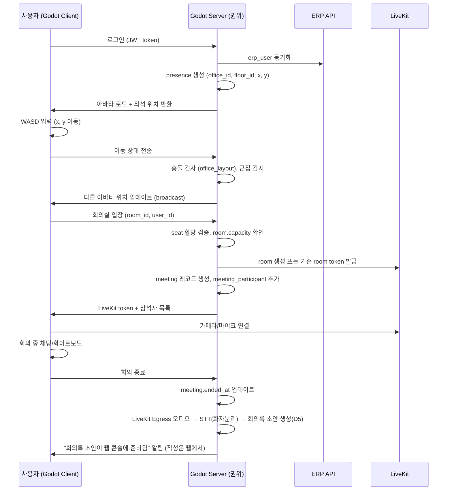
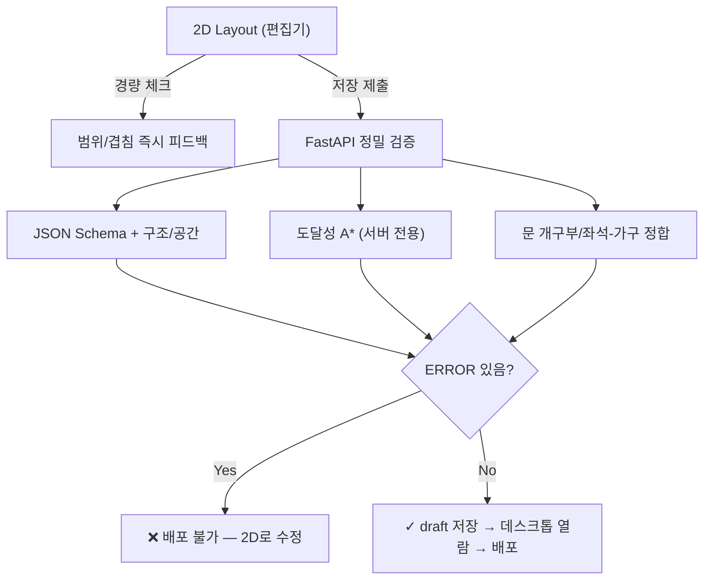
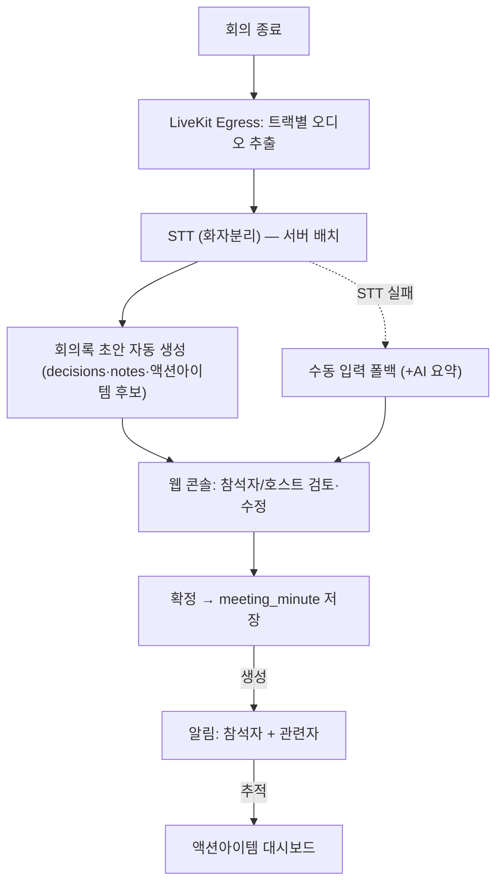
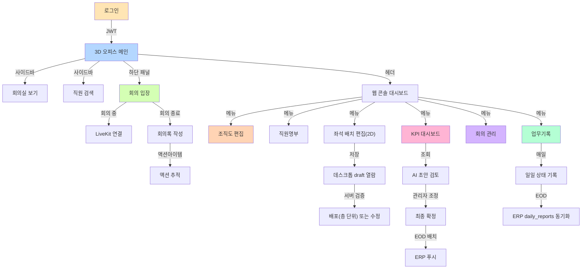

# 06-screens.md: 화면 명세

## 메타 정보
- **프로젝트**: vituraloffice_new (가상오피스 운영 플랫폼)
- **작성일**: 2026-07-01
- **최종 갱신**: 2026-07-02
- **버전**: 1.1
- **대상**: 개발/기획 경험 있는 실무자 (L3)
- **목적**: screen-spec 입력 문서. 3D 오피스 + 웹 관리 콘솔의 모든 화면 정의
- **참조**: 00-decisions.md(정본 결정, 특히 D5·D11·D12·D15·D20·D22), 05-office-layout-schema.md(레이아웃 스키마 정본)

> 이 문서는 00-decisions.md의 정본 결정을 따른다. 충돌 시 00-decisions.md가 이긴다.

### 작성/열람 경계 원칙 (Godot ↔ 웹)
- **Godot 데스크톱 클라이언트 = 보기/입장/상태**: 3D 오피스 탐색, 회의실 입장, 프레즌스 표시, 좌석 점유/반납 같은 실시간 상호작용만 담당한다. **문서 작성 폼(회의록·업무기록 등)을 Godot 안에 두지 않는다.**
- **웹 관리·업무 콘솔 = 모든 작성**: 회의록·업무기록·KPI 검토·이의신청·조직도/좌석 편집 등 모든 데이터 입력·편집은 웹에서 한다.
- Godot의 하단 패널 등에서 작성이 필요하면 "웹 콘솔로 이동" 링크로 단일화한다(중복 폼 금지).

---

## 1. 3D 메인 오피스 화면 (Godot 4 Native Desktop)

### 1.1 전체 레이아웃 구조

```
┌─────────────────────────────────────────────────────────────────────┐
│                         Header (상단)                               │
│  [Company Logo] [Office/Floor 선택] [Search] [User Profile] [Help]  │
├─────────┬──────────────────────────────────────────────┬────────────┤
│         │                                              │            │
│ Left    │                                              │  Right     │
│ Sidebar │         3D Main Viewport                     │  Panel     │
│ (Sidecar)│                                              │ (People)   │
│         │  - 로비, 브랜드월, 오픈좌석,                 │            │
│         │  - 유리 회의실, 라운지, 집중실              │ - 현재 참석│
│         │  - 폰부스, 아바타×5~10                       │ - 상태별   │
│         │  - 이름/상태 HUD, 우측 직원패널             │ - 조직도   │
│         │  - 하단 회의/업무 패널                       │ - 검색     │
│         │  - 미니맵                                    │            │
│         │                                              │            │
├─────────┼──────────────────────────────────────────────┼────────────┤
│                    Footer (하단)                                    │
│  [Meeting Controls] [Work Panel] [Chat Notify] [Time] [Status]      │
└─────────────────────────────────────────────────────────────────────┘
```

### 1.2 각 영역 상세

#### **Header (상단)**
- **로고 + 회사명**: 클릭 시 대시보드 이동
- **Office/Floor 선택 드롭다운**: 사용자가 다중 office 구성 시 전환
- **Search Bar**: 직원 이름/팀 검색 → 아바타 강조 + 카메라 이동
- **User Profile**: 내 아바타 상태(online/meeting/focus/away) 표시 + 드롭다운 (마이페이지/로그아웃)
- **Help**: 단축키, 튜토리얼 링크

#### **Left Sidebar (좌측 사이드바 — 보조 내비게이션)**
- **Office Navigation**: 층(floor) 선택, 구역(zone) 필터
- **Rooms**: 이용 가능한 회의실 목록 (점유 여부, 예약 시간), 클릭 → 회의실 카메라 이동
- **People**: 현재 온라인 직원 목록 (팀별 그룹), 클릭 → 아바타 추적
- **Chat**: 미니 채팅 인터페이스 (회의 중 메모/근접 DM만, KPI 반감시 원칙 준수). **본격 채팅은 Phase 7 고도화** — MVP는 회의 메모·근접 DM 수준으로 한정
- **Settings**: 아바타 커스터마이징, 알림, 접근성
- **내비 범위 확정(D26, 2026-07-03 시안)**: MVP 노출 = Office/Rooms/People/Chat(제한)/Settings. **Events·Whiteboard(디지털 협업보드)는 Phase 7**, **Files는 MVP 제외(WON'T)**. 시각 레퍼런스: `design/screens/virtual-office-3d-reference.md`.

#### **3D Main Viewport (중앙 — 메인 렌더링 영역)**
**기하학적 요소:**
- **로비 (Lobby)**: 입장 포인트, 수직 레이아웃 (스탠딩 바 + 공동 공간)
- **브랜드월 (Brand Wall)**: 회사 미션/비전 스크린, 회의 시 이미지 디스플레이
- **오픈좌석 (Open Seating)**: 팀별 구역으로 배열, desk/monitor/chair 에셋, seat.coords 기반 배치
- **회의실 (Meeting Rooms)**: 투명 유리벽, 내부 테이블/의자, 문 트리거, livekit_room 연결
- **라운지 (Lounge)**: 소파/커피테이블, 비포멀 미팅 공간
- **집중실 (Focus Room)**: 소음 차단, 좁은 데스크, 진입 제한(자리만큼만)
- **폰부스 (Phone Booth)**: 독립 칸막이, 영상통화용
- **미니맵 (Minimap)**: 우측 하단 코너, 현재 층 조감도, 아바타 위치, 회의실 점유 표시

**아바타 시스템:**
- 로그인 직원 = erp_user.id → 좌석(seat) 배정 또는 로비 시작
- 아바타 스타일: 본인 선택(5~10 가지 템플릿) + 이름/직급 텍스트 HUD 위에 표시
- 상태: online(이동 중) → working(자리에서 작업) → meeting(회의실) → focus(집중모드) → away(자리 비움) → offline
- 이동: WASD/마우스 드래그, 회의실/focus 구역 진입 시 서버 검증 (좌석 확보/시간 기한)

**상호작용 트리거:**
- 회의실 입장: 문 근처(2m 거리) → "Enter Meeting" 프롬프트 → 클릭 → LiveKit 방 생성/진입, presence 업데이트, 참석자 기록
- 협업 제스처: 근접(1m) 시 "+1 nearby" 표시, 더블탭 → 협력 카운트 증가
- 채팅 팝업: 직원 우클릭 → DM 시작 (실시간 채팅, 회의 중 메모)

#### **Right Panel (우측 — 사람/상태 패널)**
- **현재 참석자 리스트**: 층/구역별 필터, 아바타 선택 시 카메라 추적
- **팀별 그룹**: 팀 이름 + 현재 온라인 인원 수
- **상태별 필터**: all / online / meeting / focus / away
- **검색 바**: 이름/팀 입력 → 실시간 필터
- **상세 정보**: 선택한 직원 → 이름, 직급, 팀, 현재 상태, 마지막 상태 변경 시간

#### **Footer (하단 — 회의/업무 패널)**
```
[◄ 이전] [▶ 다음] Meeting: "Q4 Planning" (Host: Kim, 14:00-15:00)
[▲ 펼치기] → 회의 참석자, 회의록, 액션아이템 확장 보기

Work Log: "API 개발" (2.5h est, started) [상세보기]
Chat Notifications: +3 (회의 채팅), [닫기]
```

- **회의 컨트롤**: 현재 진행 중인 회의 요약, 나가기(Leave), 화면 공유(Share), 녹화(Record). 회의록 **작성**은 여기서 하지 않고 종료 후 웹 콘솔에서 STT 초안을 검토·확정한다(D5)
- **업무 패널**: 오늘의 work_log 요약, 예상 시간/진행도. 작성·수정은 **"웹 콘솔로 이동"** 링크로 단일화(Godot 내 입력 폼 없음 — 작성/열람 경계 원칙)
- **알림**: 채팅/회의 초대/결정사항 발생 시 팝업

### 1.3 상호작용 플로우 (Godot 헤드리스 서버 기반)



---

## 2. 웹 관리·업무 콘솔 (Next.js + TailwindCSS)

### 2.1 화면 목록 및 계층

```
Dashboard
├── 조직도 편집기 (Organization Chart Editor)
├── 직원명부 (Employee Directory)
├── 좌석 배치 편집기 (Seat Assignment & Layout Manager)
│   ├── 2D 편집 (Konva.js 전용)
│   ├── 저장 후 데스크톱 클라이언트 draft 모드 열람 (웹 3D 미리보기 없음 — D11)
│   ├── 검증 & 배포 (층 단위)
│   └── 롤백 이력 (층 단위)
├── KPI 대시보드 (KPI Dashboard)
├── 이의신청 (KPI Objection, §3.7)
├── 회의/회의록 (Meeting & Meeting Minutes)
│   ├── 회의 일정 + 참석자
│   ├── 회의록 STT 초안 검토/확정 (D5)
│   └── 액션아이템 추적
├── 업무기록 (Work Log & Reports)
│   ├── 일일/주간 업무보고
│   ├── 결과물 등록
│   └── EOD 상태 동기화
├── 로그인/세션 (Auth, §3.8)
├── 아바타 커스터마이징 (§3.9)
├── 권한 규칙 & 접근 매트릭스 (RBAC, §3.10)
├── 자율좌석 점유/반납 (3D 상호작용, §3.11)
└── 관리자 동기화 모니터링 콘솔 (§3.12)
```

> 조직도 편집기(§3.1)는 **P3/고도화**로 마킹(MVP 범위 밖). 자율좌석 점유/반납(§3.11)은 3D 오피스 내 상호작용이나 배정 로직상 여기 함께 표기.

> **웹 콘솔 랜딩 = 직원명부** — 별도 대시보드 화면 없음(2026-07-02 결정). 위 트리의 "Dashboard"는 내비게이션 루트 개념일 뿐 독립 화면이 아니며, 웹 콘솔 진입 시 직원명부(§3.2)로 랜딩한다.

### 2.2 각 화면 상세 명세

---

## 3. 개별 화면 상세 정의

### 3.1 조직도 편집기 (Organization Chart Editor)

> **우선순위: P3 / 고도화 (MVP 범위 밖)** — PRD의 SHOULD/P3 분류에 맞춰 확정. MVP에서는 ERP 동기화된 조직 계층을 읽기 전용으로 표시하고, 편집 기능은 Phase 후반 고도화로 미룬다. 관리자 전용(§3.10).

#### 목적
- ERP teams + 우리 org_group 계층 시각화 및 편집
- 본부(division), 부서(department), 파트(part) 추가/삭제
- 각 org_group ↔ team_zone 매핑

#### 레이아웃
```
┌─────────────────────────────────────────────────────────┐
│ 조직도 편집기                                           │
├─────────────────────────────────────────────────────────┤
│ [+ 부서 추가] [+ 팀 매핑] [배포] [미리보기] [도움말]    │
├─────────────────────────────────────────────────────────┤
│                                                         │
│  ┌─ Company                                            │
│  │  ├─ 경영진 (Division) [color: 파랑]                │
│  │  │  ├─ 인사 (Team, ERP: team_5) [Edit] [Delete]   │
│  │  │  └─ 재무 (Team, ERP: team_3)                    │
│  │  ├─ 개발 (Division)                                │
│  │  │  ├─ 백엔드 (Part)                              │
│  │  │  │  └─ 인프라팀 (Team, ERP: team_1) [Edit]    │
│  │  │  └─ 프론트엔드 (Part)                          │
│  │  │     └─ 웹팀 (Team, ERP: team_2)               │
│  │  └─ 운영 (Division)                               │
│  │
│  우측 패널:
│  ┌─────────────────────────┐
│  │ 선택: 웹팀              │
│  │ ERP Team ID: team_2     │
│  │ 현재 인원: 6            │
│  │ 3D Zone: floor_1_zone_A │
│  │ Color: #FF6B9D         │
│  │ [편집] [삭제]           │
│  └─────────────────────────┘
│
└─────────────────────────────────────────────────────────┘
```

#### 컴포넌트
- **React Flow 그래프**: org_group (노드) → team_zone 엣지
- **노드 유형**: 
  - Division (직사각형, 색상)
  - Department (약간 작은 직사각형)
  - Part (동그라미)
  - Team (ERP 직원 수 표시)
- **에디팅**: 노드 우클릭 → 색상/이름 수정, 드래그로 재배열
- **Undo/Redo**: 변경 이력 저장

#### Data Requirements
- **입력**: org_group (id, name, type, parent_id, color, sort_order), team_zone (id, erp_team_id, org_group_id, office_id, floor_id, color)
- **출력**: org_group CRUD, team_zone 매핑 업데이트
- **참조**: 01-prd.md (조직 구조), 04-data-model.md (DB 스키마)

#### 상태 관리
- **저장 전 검증**: 순환 참조 없음, 모든 팀이 매핑됨
- **배포**: 즉시 반영 (office_layout 재계산 트리거 필요 시)

---

### 3.2 직원명부 (Employee Directory)

#### 목적
- ERP users 동기화 상태 조회 (읽기 전용 표시)
- 직원 기본정보 (이름, 팀, 직급, 상태)
- 좌석 배정 현황

#### 레이아웃
```
┌─────────────────────────────────────────────────────────┐
│ 직원명부                                               │
├─────────────────────────────────────────────────────────┤
│ [팀 필터] [상태 필터] [검색] [CSV 다운로드] [새로고침] │
├─────────────────────────────────────────────────────────┤
│                                                         │
│ 테이블:                                                │
│ ┌───────────────────────────────────────────────────┐  │
│ │ 이름    │ 팀      │ 직급    │ 좌석   │ 상태      │ │
│ ├───────────────────────────────────────────────────┤  │
│ │ Kim     │ 웹팀    │ Senior │ A-105 │ 온라인    │ │
│ │ Lee     │ 웹팀    │ Junior │ A-106 │ 회의중    │ │
│ │ Park    │ 백엔드팀│ Lead   │ B-201 │ 오프라인  │ │
│ │ …                                                 │  │
│ └───────────────────────────────────────────────────┘  │
│ [1] [2] [3] ... (페이지네이션)                         │
│ 읽기전용: ERP에서 매일 동기화됨. 편집은 ERP 관리자만. │
│
└─────────────────────────────────────────────────────────┘
```

#### 컴포넌트
- **다중 필터**: 팀(team_id), 상태(presence.status)
- **검색**: 이름/이메일 입력
- **테이블 열**: id(ERP), 이름, 팀, 직급, position_id, 좌석, 상태, 마지막 갱신
- **행 클릭**: 상세보기 사이드패널 (슬라이드인)

#### 상세보기 패널
```
┌────────────────────────────┐
│ Kim Jin (Senior)           │
│ 🔒 ERP 데이터 (읽기전용)  │
│                            │
│ 팀: 웹팀                   │
│ 직급: Senior               │
│ 보고대상: Park (리드)      │
│ Slack: @kim_jin            │
│ GitHub: kim-github         │
│ 이메일: kim@company.com    │
│                            │
│ 근무 설정:                 │
│ ├─ 근무 형태: 전일        │
│ ├─ 근무 시간: 09:00-18:00│
│ └─ 근무지: 서울 강남구    │
│   (GPS 수집 없음 — D13)   │
│                            │
│ 좌석 배정:                 │
│ ├─ 현재: A-105            │
│ ├─ 할당일: 2026-06-15    │
│ └─ 층: Floor 1            │
│                            │
│ [닫기]                     │
└────────────────────────────┘
```

#### Data Requirements
- **입력**: erp_user (id, company_id, email, name, team_id, role, position, position_id, manager_id, slack_user_id, github_username, work_type, work_hours), presence (user_id, status), seat(assigned_user_id — 현재 배정) + seat_assignment_history(배정 이력, unassigned_at — D10)
- **참조**: 01-prd.md (ERP 사용자 구조)

#### 읽기전용 표시
- 모든 필드에 🔒 아이콘 또는 회색 배경
- 수정 버튼 없음
- 도움말: "이 정보는 ERP에서 자동 동기화됩니다."

---

### 3.3 좌석 배치 편집기 (Seat Assignment & Layout Manager)

#### 목적 (3단계)
1. **2D 편집** (Konva.js 전용): floor 평면도 + 좌석/구역/문 개구부 그리기
2. **저장 후 데스크톱 클라이언트 draft 모드 열람**: 웹 3D 미리보기는 제거(D11). 정밀 확인은 저장 후 Godot 데스크톱 클라이언트를 draft 모드로 열어 실제 렌더링으로 확인
3. **검증 & 배포**: office_layout JSON 생성 → **층(floor) 단위** version 관리 → 배포/롤백. 검증은 서버(FastAPI) 단독 정밀 검증(D12)

#### 3.3.1 2D 편집기 (Konva.js)

**레이아웃:**
```
┌─────────────────────────────────────────────────────────┐
│ 좌석 배치 편집기 - 2D 평면도                           │
├─────────────────────────────────────────────────────────┤
│ [Office] [Floor 1] [Undo] [Redo] [데스크톱 draft] [저장]│
├────────────────┬──────────────────────────────────────┤
│ 왼쪽 Palette:  │                                     │  │
│                 │  Floor 1 (1024×768)                │  │
│ [Desk]          │                                     │  │
│ [Table]         │  ┌──────────────────────────────┐ │  │
│ [Chair]         │  │ 브랜드월          Lobby     │ │  │
│ [Wall]          │  │                              │ │  │
│ [Door]          │  │ ┌──────┐  ┌──────────────┐ │ │  │
│ [Focus Zone]    │  │ │ 회의실  │  │ 오픈좌석   │ │ │  │
│ [Zone Paint]    │  │ │        │  │  □ □ □   │ │ │  │
│ [Delete]        │  │ │ (M-1) │  │  □ □ □   │ │ │  │
│                 │  │ └──────┘  │             │ │ │  │
│ Layers:        │  │ ┌──────┐  │             │ │ │  │
│ ☑ Walls        │  │ │ 회의실  │  │ 팀2 구역  │ │ │  │
│ ☑ Zones        │  │ │(M-2)  │  └─────────────┘ │ │  │
│ ☑ Seats        │  │ └──────┘                  │ │  │
│ ☑ Rooms        │  │                          │ │  │
│                 │  └──────────────────────────────┘ │  │
│ [+ 새로운      │  [좌표 정보 표시] [확대축소]      │  │
│  구역 그룹]    │                                     │  │
│                │  우측 패널 (선택된 요소):          │  │
│ Team Zones:   │  [이름] [색상] [유형] [삭제]       │  │
│ ☑ 팀1         │                                     │  │
│ ☑ 팀2         │                                     │  │
│                │                                     │  │
└────────────────┴──────────────────────────────────────┴─┘
```

**기능:**
- **팔레트 도구**: Desk(+좌석), Table, Wall, **Door(문 개구부)**, Focus Zone, Zone Paint(폴리곤), **Glass Wall(유리벽)**, **Spawn Point(스폰)**, **Entrance Trigger(입장 트리거)**, **Marker(화이트보드/프로젝터 등)**, **Exit Point(층 이동 출구)**, Delete
  - 05 스키마의 필수/주요 필드(spawn_points, entrance, glass_walls, doors, markers, connections.exit_points)를 저작할 UI가 모두 제공되어야 함
- **그리기**: 도구 선택 → 캔버스 드래그/클릭
  - Desk: 마우스 드래그로 위치 설정, 회전(도) 가능. Desk 배치 시 딸린 seat이 함께 생성되며 seat.furniture_id로 상호 참조(05 §1.2.6 desync 방지)
  - Wall: 라인 드래그 (구조 벽 = collider, shape=box/polygon로 저장)
  - **Door**: 방 벽 위 클릭 → 그 벽에 개구부(`{wall, offset, width, door_type}`) 생성. 방은 벽 자동 생성 + 문 위치만 구멍(05 D9). 개구부 없는 방은 검증 ERROR
  - **Entrance Trigger**: 방 경계 **내부**에만 배치 가능(경계 밖이면 편집기가 즉시 경고)
  - **Spawn Point / Exit Point**: 위치 + facing(도, 시계방향, 기준축 +X) 지정
  - Zone Paint: 폴리곤 도구 (좌표 여러 개 클릭 → 폐곡선)
- **선택 & 편집**: 요소 클릭 → 하이라이트 + 우측 패널에 상세 정보
  - 이름, 유형, 팀 할당(zone만), 색상, 좌표 수정
- **레이어**: 벽/구역/좌석/회의실 별 On/Off
- **Undo/Redo**: 모든 변경 이력
- **미니 속성 패널**: 선택 요소의 id, name, coords[], metadata

**컴포넌트 데이터 구조:**

> **단위 규약**: 캔버스 렌더링은 픽셀이지만 **저장 좌표는 미터(원점 top_left)**로 변환한다(05 정본과 동일 단위). 아래 예시는 저장 직전의 미터 좌표 기준이며, 필드명·타입도 05 스키마(seat_id, seat_type, lifecycle_status, erp_team_id 정수, doors[], shape 등)와 일치시킨다. 좌석-직원 배정 필드는 여기 없다(배정은 `seat.assigned_user_id` + `seat_assignment_history` DB — 05 D10).

```json
{
  "floor_id": "550e8400-e29b-41d4-a716-446655440020",
  "coordinate_origin": "top_left",
  "unit": "meter",
  "canvas_px": { "width": 1024, "height": 768, "pixels_per_meter": 12.8 },
  "elements": [
    {
      "kind": "collider",
      "collider_id": "C_EXT_WALL_N",
      "shape": "box",
      "box": { "x": 0.0, "y": 0.0, "width": 80.0, "height": 0.3, "rotation": 0 }
    },
    {
      "kind": "seat",
      "seat_id": "S_105",
      "seat_type": "free",
      "coords": { "x": 8.0, "y": 12.0 },
      "facing": 180,
      "furniture_id": "F_105",
      "team_zone_id": "550e8400-e29b-41d4-a716-446655440030",
      "lifecycle_status": "deployed"
    },
    {
      "kind": "zone",
      "zone_id": "Z_web",
      "label": "웹팀 구역",
      "type": "team",
      "color": "#FF6B9D",
      "erp_team_id": 202,
      "polygon": [
        { "x": 8.0, "y": 8.0 }, { "x": 24.0, "y": 8.0 },
        { "x": 24.0, "y": 20.0 }, { "x": 8.0, "y": 20.0 }
      ]
    },
    {
      "kind": "room",
      "room_id": "R_M1",
      "name": "회의실 1호",
      "type": "meeting",
      "capacity": 8,
      "capacity_mode": "by_room",
      "coords": { "x": 4.0, "y": 20.0, "width": 12.0, "height": 8.0 },
      "doors": [
        { "door_id": "D_R_M1_S", "wall": "south", "offset": 6.0, "width": 1.2, "door_type": "glass_single" }
      ]
    }
  ]
}
```

- `kind`는 편집기 요소 구분자(오브젝트 종류)이며, `type`은 05 스키마의 세부 유형(zone type=team, room type=meeting 등)이다. 종전처럼 한 객체에 `type`을 두 번 쓰지 않는다.
- 저장 시 편집기는 이 요소들을 05 루트 스키마(zones/rooms/seats/furniture/colliders/spawn_points/…)로 재조립해 FastAPI에 제출한다.

#### 3.3.2 저장 후 데스크톱 클라이언트 draft 모드 열람 (웹 3D 미리보기 없음 — D11)

**목적:** 웹에서의 실시간 3D 미리보기(WebSocket 픽셀 스트리밍/HTML5 export)는 **전면 제거**한다(D11, PRD WON'T 준수). 정밀한 3D 확인은 저장 후 **Godot 데스크톱 클라이언트를 draft 모드로 열어** 실제 렌더러(Forward+)로 확인한다.

**흐름:**
- 편집기에서 `[저장]` → 서버가 draft 상태로 layout 저장(status=draft) + 서버 정밀 검증 결과 반환
- 편집기 `[데스크톱에서 열기]` 버튼 → 데스크톱 클라이언트가 해당 draft layout_id를 draft 모드로 로드(실서비스 배포와 격리, 본인만 열람)
- 확인 후 문제 없으면 편집기로 돌아와 `[배포]`

**웹에서 제공하는 것:** Konva.js 2D 평면 뷰 + 서버 검증 결과 목록(아래). 3D 렌더링 캔버스는 웹에 없음.

```
┌──────────────────────────────────────┐
│ 저장 & 검증 결과 (2D 전용)           │
├──────────────────────────────────────┤
│ [◄ 2D 편집] [데스크톱에서 열기(draft)]│
├──────────────────────────────────────┤
│ 서버 검증 결과 (FastAPI 정밀 검증):  │
│ ✓ 구조/좌표 범위 정상                │
│ ✓ 모든 좌석 유효(furniture 정합)     │
│ ✓ 모든 방 문 개구부(doors) 존재      │
│ ⚠ 회의실 A 입장 트리거-문 근접 경고  │
│ ✗ 좌석 3개가 콜리전과 겹침 (오류)    │
│                                      │
│ ※ 3D 확인은 [데스크톱에서 열기]로    │
└──────────────────────────────────────┘
```

**검증 책임(D12):** 웹 편집기는 **경량 체크(좌표 범위/겹침)만** 즉시 표시하고, **도달성(A*) 포함 정밀 검증은 서버(FastAPI)가 단독** 수행한다. Godot 클라이언트는 검증하지 않고 배포본을 신뢰한다.



#### 3.3.3 검증 & 배포

**검증 체크리스트:**
1. 모든 좌석이 zone 내에 있는가?
2. 모든 zone이 team과 매핑되었는가?
3. 회의실이 floor 내 유효한 위치인가?
4. 충돌, 통로 너비 문제 없는가?
5. 접근성 요구사항(휠체어 경로) 충족?

**배포 플로우:** (05 §2.2 상태 전이와 정합)

```mermaid
graph LR
    A["draft"] -->|Validate(서버)| B{"ERROR 없음?"}
    B -->|Yes| C["validated"]
    B -->|No| D["오류 수정"]
    D -->A
    C -->|Deploy| E["deployed"]
    E -->|롤백| R["rolled_back → 이전 버전 re-deployed"]
    E -->|신버전 배포| G["이전 deployed → archived"]
```

**배포 단계:**
1. **Draft**: 편집 중 (자동저장). 데스크톱 draft 모드로 열람 가능
2. **Validated**: 서버 검증 통과(ERROR 0건)
3. **Deployed**: 운영 중 (배포/롤백 시 라이브 클라이언트 강제 동기화 — 05 §2.2)
4. **Archived / Rolled_back**: 이전 버전 (언제든 롤백 가능)

**버전 관리 (층 단위 — 05 "1 floor = 1 layout"과 정합):**

버전·롤백은 **층(floor)별**로 관리한다. office 전체를 한 번에 버전/롤백하지 않는다.

```
[Floor 1 (3F)]  ← 층 선택
  v1.0 (2026-06-15, archived)  : 12 seats, 2 meetings, 3 zones
  v1.1 (2026-06-20, deployed)  : 12 seats, 3 meetings, 4 zones
  v1.2 (2026-06-25, draft)     : 12 seats, 3 meetings, 5 zones
                                 ✗ ERROR: 좌석 2개 콜리전 겹침 → 배포 불가
  [Deploy v1.2] [Rollback to v1.0]

[Floor 2 (4F)]  ← 다른 층은 독립적으로 버전 관리
  v1.0 (2026-06-18, deployed)  : 8 seats, 1 meeting
```

> 좌석-직원 **배정 변경**은 `seat.assigned_user_id`(+ `seat_assignment_history` 이력)만 갱신하므로 층 버전을 올리지 않는다(05 D10). 공간 구조 변경만 버전을 올린다.

#### Data Requirements
- **입력**: office_layout (id, office_id, floor_id, version, status, json — **층 단위**), room (id, floor_id, type, name, capacity, coords, doors), seat (id, floor_id, team_zone_id, seat_type, coords, facing, furniture_id, lifecycle_status, assigned_user_id — 현재 배정), seat_assignment_history (seat_id, user_id, assigned_at, unassigned_at — 배정 이력), team_zone (id, erp_team_id, org_group_id, color)
- **출력**: office_layout 생성/수정(층 단위), 서버 검증 결과(ERROR/WARNING)
- **참조**: 05-office-layout-schema.md (JSON 스키마 정본), 04-data-model.md (데이터 모델)

---

### 3.4 KPI 대시보드 (KPI Dashboard)

#### 목적
- 사용자의 일별/주별/월별 KPI 조회 및 추이
- AI 초안 검토, 관리자 조정, 최종 확정

#### 레이아웃

```
┌─────────────────────────────────────────────────────────┐
│ KPI 대시보드 - Q3 2026                                 │
├─────────────────────────────────────────────────────────┤
│ [기간 선택: 월별/주별] [팀 필터] [비교 보기] [내보내기]│
├─────────────────────────────────────────────────────────┤
│                                                         │
│ ▶ 내 KPI (Kim Jin, 웹팀)                               │
│ ┌────────────────────────────────────────┐             │
│ │ 기간: 2026-07-01 ~ 2026-07-31          │             │
│ │                                        │             │
│ │ 업무 완료도: ████████░░ 78%          │             │
│ │ 회의 생산성: ██████░░░░ 64%          │             │
│ │ 협업점수: ███████░░░ 72%              │             │
│ │ 품질도: ████████░░ 80%               │             │
│ │ 종합점수: ██████░░░░ 74%             │             │
│ │                                        │             │
│ │ AI 초안: "일관된 기여, 회의 참여 증가│             │
│ │ 필요. 품질 우수."                     │             │
│ │                                        │             │
│ │ 관리자 검토 (Park, Lead):             │             │
│ │ [검토 중] [승인] [조정]               │             │
│ │ 조정 사항: "회의 참여는 팀 역할이므로│             │
│ │           KPI에서 감점하지 않음"       │             │
│ │                                        │             │
│ │ [의견 제시] [확정]                    │             │
│ └────────────────────────────────────────┘             │
│                                                         │
│ ▼ 팀 종합 (웹팀)  🔒 관리자/팀리더만 열람               │
│ ┌────────────────────────────────────────┐             │
│ │ 인원 6명, 평균 종합점수: 73%          │             │
│ │                                        │             │
│ │ 순위:                                  │             │
│ │  1. Kim (74%) - 회의 초청 많음       │             │
│ │  2. Lee (71%) - 협업 활동 증가       │             │
│ │  3. Park (68%) - 업무 복잡도 높음   │             │
│ │  ...                                   │             │
│ └────────────────────────────────────────┘             │
│ ※ 일반 직원은 본인 KPI만 열람. 팀 순위/타인 점수는     │
│   관리자·팀리더 전용(§3.10 접근 매트릭스)              │
│                                                         │
│ [추이] [비교] [팀 랭킹(관리자/팀리더)] [개선액션]        │
│
└─────────────────────────────────────────────────────────┘
```

#### 지표 상세

| 지표 | 계산식 | 데이터 소스 | 범위 |
|------|--------|-----------|------|
| **업무 완료도** | 완료한 work_log 수 / 계획한 수 | work_log(status=completed) | 0-100% |
| **회의 생산성** | (결정사항 수 + 액션아이템 수) / 참석 회의 수 | meeting, meeting_minute, action_item | 0-10점 |
| **협업점수** | (액션아이템 이행률 + 회의록 기여도 + work_log 산출물 관련성) / 3 | meeting_minute(decisions), action_item(status), work_log(related_project, result_url) | 0-100 |
| **품질도** | 완료 업무의 완료도(result_url 첨부율) | work_log(result_url) | 0-100% |
| **종합점수** | (완료도×30% + 생산성×25% + 협업×25% + 품질×20%) | 종합 | 0-100점 |

#### AI 초안 플로우

```mermaid
graph LR
    A["KPI 지표 수집"] -->|21:00 야간 배치(D17)| B["Claude AI 서술 초안(강점/개선/근거)"]
    B -->|1. 강점, 2. 개선점, 3. 액션| C["ai_draft (kpi_result)"]
    C -->|관리자 열람| D["관리자 조정"]
    D -->|최종값 저장| E["admin_adjusted (kpi_result)"]
    E -->|ERP push| F["kpi_results (ERP)"]
    F -->|분기별 인사평가| G["HR System"]
```

#### 컴포넌트
- **기간 필터**: 월/주 선택, 날짜 range picker
- **팀 필터**: 드롭다운 또는 체크박스
- **진행도 바**: ProgressBar 컴포넌트 (색상: 초록/노랑/빨강)
- **텍스트 에리어**: AI 초안, 관리자 의견 편집 가능
- **상태 배지**: [검토 중] [승인] [조정] [확정]

#### Data Requirements
- **입력**: kpi_result (id, user_id, period_type, period_key, metric, value, source, ai_draft, admin_adjusted_score, objection_status, final_score — D16 스키마), work_log (user_id, work_date, status, result_url), meeting (user_id, started_at, ended_at), meeting_minute (meeting_id, decisions, notes), action_item (meeting_id, assignee_user_id)
- **출력**: kpi_result.admin_adjusted_score/final_score (관리자 검토·확정 결과). ERP 푸시는 **관리자 확정 이벤트 + 분기 마감 배치**(D15·D17)
- **참조**: 03-erp-integration.md (KPI 연동), 01-prd.md (KPI 원칙)

---

### 3.5 회의/회의록 (Meeting & Meeting Minutes)

#### 3.5.1 회의 일정 & 참석자

**목적:** LiveKit 기반 회의 예약, 참석자 관리, 히스토리

**레이아웃:**
```
┌─────────────────────────────────────────────────────────┐
│ 회의 일정                                              │
├─────────────────────────────────────────────────────────┤
│ [+ 회의 예약] [오늘] [주간] [월간] [검색]              │
├─────────────────────────────────────────────────────────┤
│                                                         │
│ 2026-07-01 (화)                                         │
│                                                         │
│ 10:00-11:00  Daily Standup (회의실 1호)               │
│              참석자: Kim(O), Lee(O), Park(O), ?(대기)  │
│              상태: [시작 전] [입장하기] [취소]         │
│                                                         │
│ 14:00-15:00  Q3 Planning (회의실 2호)                 │
│              참석자: Kim(✓), Lee(X), Park(✓), John(?)│
│              상태: [진행중] [나가기] [녹화중] [공유]   │
│              회의록: [작성] [조회]                     │
│                                                         │
│ 16:00-17:00  코드리뷰 (Teams 온라인)                  │
│              참석자: Lee(✓), John(O)                  │
│              상태: [예정] [30분 전] [시작]            │
│                                                         │
│ ┌──────────────────────────────────────┐              │
│ │ 세부: Daily Standup                 │              │
│ │ 호스트: Kim Jin (웹팀)              │              │
│ │ 방: 회의실 1호 (capacity 8)         │              │
│ │ 예정 시간: 10:00-11:00              │              │
│ │ LiveKit Room: room_M1_20260701_10   │              │
│ │ 참석자:                             │              │
│ │  ✓ Kim (온라인, 09:55 입장)        │              │
│ │  ✓ Lee (온라인, 10:02 입장)        │              │
│ │  ✓ Park (온라인, 10:05 입장)       │              │
│ │  ? John (초대됨, 미응답)            │              │
│ │                                      │              │
│ │ [참석자 추가] [공유 화면] [녹화] [채팅]│              │
│ │ [회의록 편집] [종료]                │              │
│ └──────────────────────────────────────┘              │
│
└─────────────────────────────────────────────────────────┘
```

**컴포넌트:**
- **캘린더 뷰**: 일간/주간/월간 (Google Calendar 유사)
- **회의 카드**: 시간, 제목, 방, 참석자 상태 표시
- **상태 아이콘**: ✓ 참석, X 불참, O 초대, ? 대기
- **Quick Action**: 입장하기, 취소, 공유, 녹화

#### 3.5.2 회의록 작성 & 조회 (STT 자동 초안 — D5)

**목적:** 회의록은 **STT 자동 초안 생성 → 검토·수정 → 확정** 흐름으로 작성한다(D5). 수동 입력은 폴백. **작성은 웹 콘솔에서만** 한다(Godot 내 작성 폼 없음 — 작성/열람 경계 원칙).

**회의 시작 시 고지·동의(D20(b)):** 회의 입장 시 **녹음·STT 고지 배너**를 표시하고 **참여 의사 확인**을 받는다. 거부하면 해당 참석자 오디오는 수집하지 않는다(STT 대상 제외). 녹음 원본 90일 보존, 회의록 텍스트는 평가 데이터로 관리.

```
┌──────────────────────────────────────────────────────┐
│ 🔴 이 회의는 회의록 자동 작성을 위해 녹음·전사됩니다.  │
│    수집: 오디오(화자분리). 원본 90일 보존.            │
│    [동의하고 참여]   [오디오 없이 참여(전사 제외)]     │
└──────────────────────────────────────────────────────┘
```

**플로우:**



**회의록 편집 폼 (웹 콘솔 — STT 초안 검토·수정):**
```
┌──────────────────────────────────────────────────────┐
│ 회의록: Daily Standup (2026-07-01 10:00-11:00)      │
│ 🤖 STT 자동 초안 (검토 후 확정) · [원본 오디오 듣기] │
├──────────────────────────────────────────────────────┤
│                                                      │
│ 📝 주요 결정사항: (STT 초안 — 수정 가능)            │
│ ┌────────────────────────────────────────────────┐ │
│ │ • API 버전 1.5 예정대로 배포                   │ │
│ │ • 프론트엔드 테스트 커버리지 80% 달성        │ │
│ │ • 다음 주 목요일 성능 리뷰                     │ │
│ │                                              │ │
│ │ [+ 추가]                                      │ │
│ └────────────────────────────────────────────────┘ │
│                                                      │
│ 📋 액션아이템:                                      │
│ ┌────────────────────────────────────────────────┐ │
│ │ □ Lee: DB 마이그레이션 검증          Due 7/3 │ │
│ │ □ Park: 보안 감사 리포트 제출        Due 7/5 │ │
│ │ □ Kim: Slack 채널 정리              Due 7/2 │ │
│ │                                              │ │
│ │ [+ 새 액션]                                  │ │
│ └────────────────────────────────────────────────┘ │
│                                                      │
│ 📄 자유 노트:                                       │
│ ┌────────────────────────────────────────────────┐ │
│ │ 이번 회의는 Q3 목표 달성 현황을 점검했다.   │ │
│ │ 전반적으로 일정대로 진행 중이며, 한 가지  │ │
│ │ 리스크는 인프라 팀의 병목이 있을 수 있다는 │ │
│ │ 점. 다음 주에 전담 지원을 논의하기로 함.   │ │
│ └────────────────────────────────────────────────┘ │
│                                                      │
│ 참석자: Kim(✓), Lee(✓), Park(✓)                  │
│ 초안: STT 자동 | 검토·확정: Kim | 2026-07-01 11:15│
│                                                      │
│ [초안 저장] [확정(공개)] [수동 재작성] [휴지통]     │
│
└──────────────────────────────────────────────────────┘
```

**데이터 구조:**
```json
{
  "meeting_minute": {
    "id": "mm_123",
    "meeting_id": "meeting_456",
    "decisions": ["결정사항 1", "결정사항 2"],
    "notes": "자유 텍스트 노트",
    "created_by": "erp_user_1",
    "created_at": "2026-07-01T11:15:00Z"
  },
  "action_items": [
    {
      "id": "ai_1",
      "meeting_id": "meeting_456",
      "title": "DB 마이그레이션 검증",
      "assignee_user_id": "erp_user_2",
      "due_date": "2026-07-03",
      "related_ref": "github#issue-456",
      "status": "open"
    }
  ]
}
```

#### Data Requirements
- **입력**: meeting (id, room_id, scheduled_at, started_at, ended_at, host_user_id, status, livekit_room), meeting_participant (meeting_id, user_id, joined_at, left_at), meeting_minute (id, meeting_id, decisions, notes, created_by, created_at), action_item (id, meeting_id, title, assignee_user_id, due_date, related_ref, status)
- **출력**: meeting_minute 생성/수정, action_item 생성/상태 업데이트
- **참조**: 04-data-model.md (회의 엔티티)

#### 액션아이템 추적 대시보드
```
┌──────────────────────────────────────┐
│ 나의 액션아이템                     │
├──────────────────────────────────────┤
│ 필터: [진행중] [완료] [기한임박]    │
│                                      │
│ 진행중 (3):                         │
│ ☐ DB 마이그레이션 검증             │
│   회의: Daily Standup (7/1)         │
│   기한: 7/3 (2일 남음)             │
│   상태: [진행중]                   │
│                                      │
│ ☐ Slack 채널 정리                  │
│   회의: Daily Standup (7/1)         │
│   기한: 7/2 (내일)                 │
│   상태: [완료 확인 필요]           │
│                                      │
│ 완료 (12):                         │
│ ☑ API 문서 작성                     │
│   기한: 6/28 (완료)                │
│   조회: [세부]                      │
│
└──────────────────────────────────────┘
```

---

### 3.6 업무기록 (Work Log & Reports)

#### 목적
- 일별 업무 기록 (work_log), 결과물 첨부, 진행도 기록
- 일일/주간 상태 리포트 (ERP와 동기화)
- EOD 배치로 자동 ERP 푸시

#### 레이아웃

```
┌─────────────────────────────────────────────────────────┐
│ 업무기록                                               │
├─────────────────────────────────────────────────────────┤
│ [오늘] [이번주] [지난주] [월간] [연간 리뷰]           │
├─────────────────────────────────────────────────────────┤
│                                                         │
│ 2026-07-01 (화) - 화창한 날씨 🌤                       │
│                                                         │
│ ▶ 업무 요약:                                          │
│   예상 시간: 8h | 실제: 7.5h | 회의: 1h             │
│   목표 진행도: ████░░░░░░ 38% (3/8 완료)             │
│                                                         │
│ ▼ 업무 목록:                                          │
│                                                         │
│ 업무 1: API 엔드포인트 개발                           │
│ ├─ 카테고리: 개발                                     │
│ ├─ 예상 시간: 3h                                      │
│ ├─ 상태: [진행중] (1.5h)                            │
│ ├─ 관련 프로젝트: Q3-API-v1.5                       │
│ ├─ 링크: github.com/project/pull/123                │
│ ├─ 결과물: (없음 - 진행 중)                         │
│ ├─ 이슈: (없음)                                      │
│ └─ [상세] [완료] [중단]                             │
│                                                         │
│ 업무 2: 테스트 코드 작성                              │
│ ├─ 카테고리: 테스트                                  │
│ ├─ 예상 시간: 2h                                      │
│ ├─ 상태: [완료] (1.2h)                              │
│ ├─ 관련 프로젝트: Q3-API-v1.5                       │
│ ├─ 링크: github.com/project/pull/124                │
│ ├─ 결과물: ✓ PR 링크, coverage report (PDF)         │
│ ├─ 이슈: (없음)                                      │
│ └─ [상세] [재개] [삭제]                             │
│                                                         │
│ [+ 업무 추가]                                          │
│                                                         │
│ ▼ 일일 상태 (ERP daily_reports로 동기화):            │
│ ┌─────────────────────────────────────┐              │
│ │ 오늘 할 일:                         │              │
│ │ "API 개발 완료, 테스트 커버리지    │              │
│ │  80% 달성, Q3 마일스톤 예정대로"  │              │
│ │ [편집]                             │              │
│ │                                    │              │
│ │ 진행 중인 업무:                     │              │
│ │ "API 엔드포인트 개발 진행 중,     │              │
│ │  테스트 코드 추가 작성 중"         │              │
│ │ [편집]                             │              │
│ │                                    │              │
│ │ 블로커/이슈:                       │              │
│ │ "DB 스키마 변경 대기 (Lee 담당)"  │              │
│ │ [편집]                             │              │
│ │                                    │              │
│ │ 내일 계획:                         │              │
│ │ "API 테스트 완료, 코드리뷰 신청, │              │
│ │  Q3 성능 최적화 시작"             │              │
│ │ [편집]                             │              │
│ │                                    │              │
│ │ 상태: [진행중] [완료]              │              │
│ │ [저장] [ERP 동기화 확인]           │              │
│ └─────────────────────────────────────┘              │
│                                                         │
│ [기간별 리포트] [통계] [내보내기]                      │
│
└─────────────────────────────────────────────────────────┘
```

**업무 상세 폼 (모달):**
```
┌──────────────────────────────────────────────────────┐
│ 업무: API 엔드포인트 개발                            │
├──────────────────────────────────────────────────────┤
│                                                      │
│ 기본 정보:                                          │
│ 제목: [API 엔드포인트 개발]                         │
│ 카테고리: [개발]                                    │
│ 상태: [진행중] [완료] [중단]                       │
│                                                      │
│ 시간 기록:                                         │
│ 예상 시간: [3] 시간                                │
│ 실제 시간: [1.5] 시간                             │
│                                                      │
│ 목표:                                              │
│ [POST /api/users 엔드포인트 구현, 요청검증 포함]  │
│                                                      │
│ 프로젝트 연결:                                     │
│ [Q3-API-v1.5] (선택: 프로젝트 목록)               │
│                                                      │
│ 외부 링크:                                         │
│ [https://github.com/.../pull/123]                 │
│                                                      │
│ 결과물 (작업 완료 시):                             │
│ [파일 첨부] 또는 [URL 입력]                        │
│ • coverage_report.pdf (123KB)                      │
│ • performance_metrics.xlsx (45KB)                  │
│ [파일 제거]                                        │
│                                                      │
│ 이슈/블로커:                                       │
│ [DB 스키마 변경 대기]                             │
│                                                      │
│ 노트:                                              │
│ [구현 과정에서 인증 로직 추가로 시간 소요,        │
│  다음 업무 계획 시 고려 필요]                      │
│                                                      │
│ [저장] [취소]                                      │
│
└──────────────────────────────────────────────────────┘
```

#### Data Requirements
- **입력**: work_log (id, user_id, work_date, category, title, goal, related_project, url, est_minutes, status[started|completed|aborted], result_url, attachments, issues, next_action), erp_user (user_id, email)
- **출력**: work_log CRUD, 일일 상태 → ERP daily_reports 푸시 (daily_status_push 로그)
- **참조**: 03-erp-integration.md (ERP 동기화), 01-prd.md (KPI 원칙 — 결과물 기반 평가)
- **주의**: work_log.status enum에 'aborted'(중단) 추가 필요 — 04-data-model.md와 동기화

#### 주간/월간 리포트

```
┌──────────────────────────────────────────┐
│ 주간 리포트: 2026-06-24 ~ 2026-06-30   │
├──────────────────────────────────────────┤
│                                          │
│ 총 업무: 18개                           │
│ 완료: 15개 (83%)                        │
│ 진행중: 2개                             │
│ 중단: 1개                               │
│                                          │
│ 시간 기록:                              │
│ 예상: 40h                               │
│ 실제: 38.5h                            │
│ 회의: 5h                                │
│                                          │
│ 카테고리별 분포:                        │
│ • 개발: 22h (57%)                      │
│ • 회의: 5h (13%)                       │
│ • 테스트: 8.5h (22%)                   │
│ • 기타: 3h (8%)                        │
│                                          │
│ 상태 요약:                              │
│ "Q3 목표 진행도 80%. 다음 주 릴리스  │
│  예정. 백엔드 팀과 협업 원활."        │
│ [편집]                                 │
│                                          │
│ [CSV 다운로드] [공유]                   │
│
└──────────────────────────────────────────┘
```

---

### 3.7 이의신청 (KPI Objection)

#### 목적
- 평가 공개 후 직원이 결과에 이의를 제기하고, 관리자가 재검토·확정하는 흐름(D15).
- 상태머신: **공개(none) → 이의접수(submitted, 7일 창) → 재검토(reviewing) → 확정(resolved) → ERP push**.

#### 직원 화면
```
┌──────────────────────────────────────────┐
│ 내 평가 (2026-Q2)  상태: 공개됨           │
├──────────────────────────────────────────┤
│ 종합점수: 74%   [상세 근거 보기]          │
│                                          │
│ 이의신청 가능 기한: 2026-07-08 (D-6)     │
│ [이의신청]                               │
│  └─ 사유 입력(필수), 근거 링크(선택)     │
│                                          │
│ 진행 상태: 접수 → 재검토중 → 확정        │
│  현재: ● 접수완료 (2026-07-02)           │
└──────────────────────────────────────────┘
```

#### 관리자 화면
```
┌──────────────────────────────────────────┐
│ 이의신청 접수 목록                       │
├──────────────────────────────────────────┤
│ Kim / Q2 / 접수 2026-07-02 / D-5         │
│  사유: "회의 참여를 팀 역할로 감점 반영" │
│  [재검토] → [점수 유지] / [조정: __]     │
│  결과 입력 + 코멘트 → [확정]             │
│                                          │
│ 확정 시: kpi_result.final_score 갱신 →   │
│ ERP 재push(upsert) (D15)                 │
└──────────────────────────────────────────┘
```

#### Data Requirements
- **입력**: kpi_result (id, user_id, period_type, period_key, metric, ai_draft, admin_adjusted_score, objection_status, final_score, finalized_at)
- **상태값**: objection_status = none → submitted → reviewing → resolved (D15 상태머신)
- **참조**: 00-decisions.md D15, 03-erp-integration.md, 08-kpi-logic.md

---

### 3.8 로그인 / 세션 만료 (Auth)

#### 목적
- FastAPI 발급 자체 JWT(HS256) 로그인, 인증 실패·세션 만료 처리(D4).

```
┌──────────────────────────────┐   ┌──────────────────────────────┐
│ 로그인                       │   │ 세션이 만료되었습니다        │
│ 이메일 [___________]         │   │ 보안을 위해 다시 로그인하세요.│
│ 비밀번호 [___________]       │   │ [다시 로그인]                │
│ [로그인]                     │   │                              │
│ ✗ 이메일 또는 비밀번호 오류  │   │ (진행 중 작업은 임시 저장됨) │
└──────────────────────────────┘   └──────────────────────────────┘
```

- **성공**: FastAPI가 JWT 발급 → 웹 콘솔/데스크톱 클라이언트 공용. 데스크톱은 WSS 핸드셰이크에서 JWT + protocol_version/schema_version 협상(D4·05 §2.2).
- **실패**: 401 표시, 평문 비밀번호를 게임서버로 전송하지 않음(D4).
- **만료**: JWT 만료 시 재로그인 유도. 미저장 입력은 로컬 임시 저장 후 복구.

#### Data Requirements
- **입력**: erp_user(email), FastAPI /auth (JWT 발급/검증)
- **참조**: 00-decisions.md D4, 03-erp-integration.md(인증)

---

### 3.9 아바타 커스터마이징 (Avatar)

#### 목적
- 기본 휴머노이드 아바타 + 색상 선택(경량). 3D 오피스 Settings에서 진입(§1.2 Left Sidebar).

```
┌──────────────────────────────────────────┐
│ 아바타 설정                              │
├──────────────────────────────────────────┤
│ 프리셋: (●) 기본 휴머노이드 A            │
│          ( ) 기본 휴머노이드 B            │
│ 상의 색상: [■][■][■][■][■]              │
│ 하의 색상: [■][■][■][■][■]              │
│ 이름표 표시: [본인 이름/직급]            │
│ [미리보기]  [저장]                       │
└──────────────────────────────────────────┘
```

- 리깅은 Mixamo/기성 휴머노이드 리그 기반(07 참조). 커스터마이징은 프리셋 + 색상 팔레트 수준(고도화 시 확장).

#### Data Requirements
- **입력/출력**: user_avatar (user_id, preset_id, colors) — 로컬/서버 저장
- **참조**: 07-3d-visual-asset-pipeline.md(아바타)

---

### 3.10 권한 규칙 & 접근 매트릭스 (RBAC)

#### 목적
- 역할(직원/팀리더/관리자)별 화면·기능 접근 규칙 단일 정의. 권한 없는 접근 시 **권한 없음 화면** 표시.

#### 접근 매트릭스

| 화면 / 기능 | 직원 | 팀리더 | 관리자 |
|-------------|:----:|:------:|:------:|
| 3D 오피스(입장·이동·프레즌스) | ✓ | ✓ | ✓ |
| 본인 KPI 조회 | ✓ | ✓ | ✓ |
| 팀 KPI 순위/타인 점수 열람 | ✗ | ✓(팀 한정) | ✓ |
| KPI 점수 조정·확정 | ✗ | ✗ | ✓ |
| 이의신청 제출 | ✓ | ✓ | ✓ |
| 이의신청 재검토·확정 | ✗ | ✗ | ✓ |
| 좌석 배치 편집기(구조 편집·배포) | ✗ | ✗ | ✓ |
| 조직도 편집 | ✗ | ✗ | ✓ |
| 직원명부 조회 | ✓ | ✓ | ✓ |
| 동기화 모니터링 콘솔 | ✗ | ✗ | ✓ |

#### 권한 없음 화면
```
┌──────────────────────────────────────────┐
│ 🔒 접근 권한이 없습니다                  │
│ 이 화면은 관리자 전용입니다.             │
│ [이전으로]  [권한 요청]                  │
└──────────────────────────────────────────┘
```

#### Data Requirements
- **입력**: erp_user.role(employee/leader/admin), team_id(팀리더 범위 판정)
- **참조**: 00-decisions.md D15·D20, 04-data-model.md(role)

---

### 3.11 자율좌석(Free Seat) 점유 / 반납

#### 목적
- 3D 오피스에서 빈 자율좌석(seat_type=free)을 클릭해 점유하고, 퇴근 시 자동 반납. **layout 재배포 없이 `seat.assigned_user_id`(현재) + `seat_assignment_history`(이력)만 갱신**(05 D10).

```
[3D] 빈 자율좌석 클릭
  → "이 자리에 앉기" 프롬프트 → 클릭
  → 서버: seat.assigned_user_id = 본인 설정
         + seat_assignment_history INSERT (seat_id, user_id, assigned_at)
  → 아바타 착석(seat.facing 방향), 좌석에 이름표 표시

퇴근/오프라인 전이(away 장기화 등)
  → 서버: seat.assigned_user_id = NULL
         + seat_assignment_history.unassigned_at 갱신(자동 반납)
  → 좌석 다시 free 표시
```

- 이미 점유된 자율좌석은 클릭 시 "사용 중" 표시. 고정좌석(fixed)은 배정자 외 점유 불가.

#### Data Requirements
- **입력/출력**: seat(seat_type, coords, facing, assigned_user_id — 현재 배정), seat_assignment_history(seat_id, user_id, assigned_at, unassigned_at — 이력), presence
- **참조**: 05-office-layout-schema.md(§2.4 좌석 배정 분리), 04-data-model.md

---

### 3.12 관리자 동기화 모니터링 콘솔

#### 목적
- ERP 동기화·EOD/ERP push·KPI 배치의 상태·실패 이력을 관리자가 모니터링하고 **수동 재시도**(1047~1066행 오류 알림의 수신처).

```
┌──────────────────────────────────────────────────────┐
│ 동기화 모니터링 콘솔  (관리자 전용)                  │
├──────────────────────────────────────────────────────┤
│ 작업              최근 실행       상태     [액션]     │
│ ERP 증분(매시간)  15:00 성공      ● OK                │
│ ERP 전체대사(00시) 00:00 성공     ● OK                │
│ daily_reports push 18:00 실패     ✗ 401   [재시도]    │
│ KPI AI 초안(21시)  대기중         ○ 예정               │
│ kpi_results push   14:20 성공     ● OK                │
│                                                      │
│ 실패 이력:                                           │
│  2026-07-01 18:30  daily_reports  401 JWT 만료 [로그] │
│                                                      │
│ [전체 로그]  [feature flag: ERP kpi_results = ON]     │
└──────────────────────────────────────────────────────┘
```

- 실패 시 알림 채널로 통지되며, 이 콘솔에서 상태 확인·수동 재시도·백필 트리거.

#### Data Requirements
- **입력**: erp_sync_log, daily_status_push, kpi push 로그, 배치 run_id/advisory lock 상태
- **참조**: 00-decisions.md D17·D18·D21, 03-erp-integration.md

---

## 4. 화면 전체 흐름도



> **노드 F 각주**: "웹 콘솔 대시보드"는 별도 대시보드 화면이 아니다 — 웹 콘솔 랜딩은 **직원명부**(§3.2)이다(2026-07-02 결정, §2.1 참조).

---

## 5. 주요 화면의 상태 정의

### 5.1 빈 상태 (Empty States)

#### 3D 오피스 - 첫 로그인
```
┌─────────────────────────────────────────────────────────┐
│                  3D Main Viewport                       │
│                                                         │
│                   🎯 가상오피스에 오신 걸 환영합니다   │
│                                                         │
│                [게임처럼 시작하기] [튜토리얼]          │
│                                                         │
│                아바타를 설정하고 오피스를 둘러보세요.  │
│                W/A/S/D로 이동, 마우스로 회전합니다.   │
│                                                         │
│                근처 직원을 클릭하면 채팅할 수 있습니다 │
│
└─────────────────────────────────────────────────────────┘
```

#### 회의 목록 - 오늘 회의 없음
```
┌──────────────────────────────────────────┐
│ 회의 일정                                │
├──────────────────────────────────────────┤
│                                          │
│           오늘 예정된 회의가 없습니다    │
│                                          │
│      [회의 예약하기] [다른 날짜 보기]   │
│
└──────────────────────────────────────────┘
```

#### 업무기록 - 업무 없음
```
┌──────────────────────────────────────────┐
│ 업무기록 (2026-07-01)                   │
├──────────────────────────────────────────┤
│                                          │
│         아직 등록된 업무가 없습니다      │
│                                          │
│      [업무 추가하기] [어제 복사하기]   │
│
└──────────────────────────────────────────┘
```

### 5.2 오류/실패 상태 (Error States)

#### 3D 오피스 - 회의실 입장 실패
```
┌──────────────────────────────────────────┐
│ ❌ 회의실에 입장할 수 없습니다           │
│                                          │
│ 가능한 원인:                             │
│ • 회의실 용량이 가득 찼습니다            │
│ • 회의가 종료되었습니다                  │
│ • 네트워크 연결이 불안정합니다          │
│                                          │
│ [재시도] [처음으로] [고객지원]          │
│
└──────────────────────────────────────────┘
```

#### 좌석 배치 편집 - 검증 실패 (D12)
```
┌──────────────────────────────────────────┐
│ ⚠️ 배포 전 오류 수정이 필요합니다        │
├──────────────────────────────────────────┤
│                                          │
│ ERROR (3) — 배포 불가:                  │
│ ❌ 좌석 3개가 콜리전과 겹침 (S_105 등) │
│ ❌ 회의실 B 문 개구부(doors) 없음       │
│ ❌ 팀 구역이 floor 범위를 벗어남        │
│                                          │
│ WARNING (1):                            │
│ ⚠️ 휠체어 경로 1개 차단됨               │
│                                          │
│ ERROR가 하나라도 있으면 배포할 수 없습니다.│
│ [상세] [2D로 수정]                      │
│
└──────────────────────────────────────────┘
```

> **정책(D12)**: ERROR가 0건이어야 배포 버튼이 활성화된다. `[무시하고 배포]` 버튼은 없다. **WARNING만** 있는 경우에 한해 배포 화면에서 `[경고 무시하고 배포]`를 제공한다:
>
> ```
> ┌──────────────────────────────────────────┐
> │ 검증 결과: ERROR 0 · WARNING 2           │
> │ ⚠️ 휠체어 경로 우회 필요 / 미니맵 여백 좁음 │
> │ [2D로 수정]   [경고 무시하고 배포]        │
> └──────────────────────────────────────────┘
> ```

#### KPI 대시보드 - AI 평가 실패
```
┌──────────────────────────────────────────┐
│ ❌ AI 평가를 생성할 수 없었습니다        │
├──────────────────────────────────────────┤
│                                          │
│ Claude API 호출 오류: timeout           │
│ 마지막 시도: 2026-07-01 18:15          │
│                                          │
│ 수동 입력으로 계속하시겠습니까?         │
│                                          │
│ [재시도] [수동입력] [관리자] [취소]    │
│
└──────────────────────────────────────────┘
```

#### ERP 동기화 실패
```
┌──────────────────────────────────────────┐
│ ❌ ERP 동기화 실패                       │
├──────────────────────────────────────────┤
│                                          │
│ 상태: POST /api/reports (daily_reports)│
│ 오류: 401 Unauthorized                  │
│ 시간: 2026-07-01 18:30                 │
│                                          │
│ 원인: 서비스 계정 JWT 만료              │
│       (관리자만 재설정 가능)             │
│                                          │
│ 영향: 오늘 업무 상태가 ERP에 기록되지  │
│      않음. 내일 재시도됩니다.           │
│                                          │
│ [관리자에게 알림] [로그 확인] [닫기]   │
│
└──────────────────────────────────────────┘
```

### 5.3 로딩 / 재연결 상태 (Loading & Reconnect)

#### 초기 로드
- **웹 콘솔**: 목록/테이블 화면은 **스켈레톤 UI**(테이블 행 형태), 카드/차트 화면은 **스피너**. 응답이 1초 미만이면 스켈레톤 생략 가능(깜빡임 방지)
- **3D 오피스**: 전용 로딩 화면(진행바: 에셋→layout→presence 순) → office_layout 로드 완료 후 입장. 로딩 < 5초 목표(D22)

#### 3D 오피스 WSS 단절 시 UX
- 단절 감지 즉시 뷰포트에 반투명 오버레이 **"연결 끊김 — 재연결 중…"** 표시. 조작은 잠그고 마지막 수신 상태는 화면에 유지(아바타 이동 정지)
- 재연결: **지수 백오프**(1s → 2s → 4s → … 최대 30s), 자동 무한 재시도
- 재연결 성공 시 **resume 프로토콜**: JWT + protocol_version/schema_version 재협상(05 §2.2) → 마지막 수신 seq 이후 상태 스냅샷 + 델타 재동기화 → 오버레이 해제
- 60초 이상 단절 시 오버레이에 `[지금 재연결] [로그인 화면으로]` 버튼 노출. 서버는 단절 사용자의 presence를 away→offline으로 전이

#### API 실패 재시도 규칙 (웹 콘솔)
- **조회(GET) 실패**: 자동 1회 재시도 후 오류 상태 컴포넌트 표시(`[재시도]` 버튼 제공)
- **변경(POST/PATCH/DELETE) 실패**: 자동 재시도 금지(중복 생성 방지). 입력값 보존 + 인라인 오류 표시 후 사용자 수동 재시도
- **401(세션 만료)**: §3.8 세션 만료 화면으로 유도. 미저장 입력은 로컬 임시 저장 후 재로그인 시 복구

---

## 6. 각 화면의 주요 컴포넌트 & 의존성

### 6.1 컴포넌트 레이어 구조

```
Frontend (Next.js + React)
├── 레이아웃 / 라우팅
├── 화면 컴포넌트
│   ├── OrganizationChart (React Flow)
│   ├── EmployeeDirectory (Table)
│   ├── SeatLayoutEditor (Konva.js 2D 전용 — 웹 3D 미리보기 없음, D11)
│   ├── KPIDashboard (Charts, Editor)
│   ├── MeetingManager (Calendar, Forms)
│   └── WorkLogRecorder (Forms, List)
├── 공용 컴포넌트
│   ├── Header / Navigation
│   ├── Sidebar
│   ├── Modal / Dialog
│   ├── ProgressBar / Chart
│   └── StatusBadge
└── API 클라이언트 (fetch, WebSocket)

3D Client (Godot 4 Native)
├── Scene (Main Office, Rooms, Zones)
├── Avatar System (Movement, HUD, State)
├── UI Overlay (Header, Right Panel, Footer)
├── LiveKit Integration
└── Server Sync (Godot HeadlessServer via WebSocket/WSS — D1)

Backend (FastAPI)
├── Auth (JWT)
├── API Routes
│   ├── /orgs (org_group CRUD)
│   ├── /teams (team_zone CRUD)
│   ├── /layouts (office_layout CRUD + validation)
│   ├── /seats (seat CRUD + assignment)
│   ├── /meetings (meeting CRUD + minutes)
│   ├── /work-logs (work_log CRUD)
│   ├── /kpi-results (kpi_result CRUD + AI draft)
│   ├── /erp (ERP sync endpoints)
│   └── /3d-server (Godot server communication)
├── Background Jobs
│   ├── ERP Sync Worker (users, teams, attendances, leaves)
│   ├── KPI AI Draft Worker (21:00 야간 배치 — D17)
│   └── EOD Push Worker (매일 근무 종료 후)
└── Database (PostgreSQL)

Godot Headless Server
├── Authority (Movement, Collision, Rooms)
├── WebSocket(WSS) Sync — D1
├── Room Management (LiveKit)
└── Logging
```

### 6.2 화면별 의존 엔티티

| 화면 | 필수 엔티티 | 참조 문서 |
|------|-----------|---------|
| **3D 오피스 메인** | erp_user, presence, office, floor, office_layout, seat, room, meeting, meeting_participant | 04-data-model.md |
| **조직도 편집** | org_group, team_zone, erp_user (teams) | 04-data-model.md, 01-prd.md |
| **직원명부** | erp_user, presence, seat, team_zone | 04-data-model.md |
| **좌석 배치 편집** | office, floor, office_layout(층 단위), seat(assigned_user_id), seat_assignment_history, room(doors), team_zone | 05-office-layout-schema.md, 04-data-model.md |
| **KPI 대시보드** | kpi_result, work_log, meeting, meeting_minute, action_item | 03-erp-integration.md, 01-prd.md |
| **이의신청(§3.7)** | kpi_result(objection_status, final_score), erp_user | 03-erp-integration.md(D15) |
| **회의/회의록** | meeting, room, meeting_participant, meeting_minute, action_item, erp_user | 04-data-model.md |
| **업무기록** | work_log, erp_user, daily_status_push | 03-erp-integration.md, 01-prd.md |
| **로그인/세션(§3.8)** | erp_user, JWT(FastAPI /auth) | 03-erp-integration.md(D4) |
| **아바타(§3.9)** | user_avatar | 07-3d-visual-asset-pipeline.md |
| **권한 매트릭스(§3.10)** | erp_user(role, team_id) | 04-data-model.md |
| **자율좌석 점유/반납(§3.11)** | seat(seat_type, assigned_user_id), seat_assignment_history, presence | 05-office-layout-schema.md, 04-data-model.md |
| **동기화 모니터링(§3.12)** | erp_sync_log, daily_status_push, kpi push 로그 | 03-erp-integration.md(D17·D18) |

---

## 7. 배포 & 렌더링 전략

### 7.1 3D 클라이언트 (Godot Native)
- **OS**: Windows, macOS, Linux (Desktop 우선)
- **렌더러**: Forward+ (최고 품질)
- **배포**: 독립형 exe/dmg/deb + 자동 업데이트
- **해상도**: 1920×1080 권장, 최소 1280×720

### 7.2 웹 콘솔 (Next.js)
- **OS**: 모든 OS (브라우저)
- **렌더**: Server-Side Rendering (SSR) / Static Generation (SSG) 혼합
- **배포**: **사내 서버 PC + Docker Compose**(웹 프론트 포함 전부 사내 서버, Let's Encrypt TLS — D21-r, 2026-07-02). Vercel/외부 배포는 폐기
- **브라우저 지원**: Chrome/Edge 90+, Safari 14+, Firefox 88+

### 7.3 성능 목표 (D22)
- **3D 프레임율**: **60fps@GTX1650급 / 최소 30fps@내장그래픽(Iris Xe급)**
- **웹 페이지 로딩**: < 3초 (First Contentful Paint)
- **실시간 업데이트**: 아바타 E2E p95 < 500ms, 화상 음성 < 200ms(사내망)
- **규모**: **동시접속 설계 100명 / 도그푸딩 검증 20명**(500·1000명 표기 폐기). 로딩 < 5초

---

## Loop Metadata

### Upstream documents referenced
- 01-prd.md (제품 스펙, KPI 원칙, 조직 구조)
- 03-erp-integration.md (ERP 동기화, KPI 연동, 인증)
- 04-data-model.md (DB 스키마, 엔티티 정의)
- 05-office-layout-schema.md (office_layout JSON 스키마)

### Downstream documents affected
- **screen-spec** (이 문서를 입력으로 사용하여 화면별 세부 사양 생성)
- **API 명세** (각 화면 데이터 요구사항 → API 엔드포인트 설계)
- **개발 태스크 분해** (화면별 → 컴포넌트 → 구현 태스크)

### Open questions
- **조직도 편집기 우선순위**: **P3/고도화로 확정**(§3.1). MVP 범위 밖이며 Phase 후반 고도화로 마킹. PRD/TRD/tasks에도 P3로 통일.
- **직원명부 구현 태스크**: §3.2 직원명부 화면의 전용 프론트엔드 태스크를 12-tasks에 추가 필요.
- **Whisper 자동 전사**: **해소됨** — 회의록은 STT 자동 초안(D5, §3.5.2)으로 확정. 실시간 전사 여부는 S2 스파이크(품질 측정)에서 결정.
- **채팅 기능**: §1.2 사이드바에 언급된 채팅은 **간단한 DM/회의 메모 수준으로 명세하되 Phase 7(고도화) 마킹**. MVP는 회의 중 메모·근접 DM만.
- **모바일 지원**: 웹 콘솔이 태블릿에서도 작동하는가? (사내 설치라 우선순위 낮음)
- **3D 웹뷰어**: B2B 후 Three.js 경량 웹뷰어 추가 시 현재 설계와 호환성? (D11로 웹 3D는 현재 범위 밖)

### Assumptions
- ERP API와 DB direct access 모두 안정적이며, 사내 네트워크 보안이 보장됨
- LiveKit self-host는 ERP와 동일 인프라에서 운영 가능
- daily_reports push는 매일 18:00 KST 배치(D17)
- **직원 수는 설계 100명 / 도그푸딩 20명 범위**(D22, 500명 이상 표기 폐기)
- Godot 4 native desktop deployment가 사내 보안 정책과 호환

### Validation criteria
1. **3D 메인 화면**: 로비 진입 → 아바타 로드 → 회의실 입장 → (종료 후) STT 회의록 초안 생성 전체 플로우 동작 ✓
2. **웹 콘솔**: 조직도 편집 → 좌석 배치 2D → 저장·서버 검증 → 데스크톱 draft 열람 → 배포(층 단위) 전체 플로우 동작 ✓
3. **KPI**: AI 서술 초안 → 관리자 검토·확정 → 이의신청 처리 → ERP 푸시 전체 파이프라인 동작 ✓
4. **회의**: 예약 → 입장(녹음 고지·동의) → STT 회의록 검토·확정 → 액션아이템 추적 전체 플로우 동작 ✓
5. **업무**: 기록 → 일일 상태 → EOD 동기화 전체 플로우 동작 ✓
6. **권한**: 역할별 접근 매트릭스(§3.10) — 직원/팀리더/관리자 권한 경계 동작 ✓

### Risks
- **ERP 동기화 지연**: 사내 ERP가 다운될 경우 KPI/업무 리포트가 적시에 반영되지 않음 → Fallback 큐 + 동기화 모니터링 콘솔(§3.12)
- **Live Kit 비용**: 참석자 수 증가 시 비용 급증 → 사전 용량 계획 필수
- **3D 렌더링 성능**: GPU 사양에 따른 편차 → 기준 사양 명시(GTX 1650급 60fps / 내장 30fps, D22)
- **웹 콘솔 복잡도**: 좌석/조직도 편집기 자체로 개발 리스크 높음 → 조직도 편집기는 P3로 후순위, 좌석 편집기 MVP/고도화 분리

---

## 8. 변경 이력

| 버전 | 일자 | 변경 내용 |
|------|------|----------|
| 1.0 | 2026-07-01 | 초안 |
| 1.1 | 2026-07-02 | 00-decisions 반영: D11 웹 3D 미리보기 전면 제거(데스크톱 draft 열람으로 대체), D12 검증 아키텍처(서버 단일 정밀검증·ERROR 배포차단·[무시하고 배포] 제거), 편집기 JSON을 05 스키마와 정합(미터·필드명·doors[]·shape·중복 type 키 수정)·팔레트에 spawn/entrance/glass_wall/door/marker/exit 추가, D5 회의록 STT 초안 흐름·녹음 고지/동의 배너·Godot 작성폼 제거, Godot=보기/웹=작성 경계 원칙 명시, 신규 화면 6종(이의신청·로그인/세션·아바타·권한 매트릭스·자율좌석 점유/반납·동기화 모니터링 콘솔), D22 성능·규모 통일(60fps@GTX1650/100명), 층 단위 버전·롤백(05 정합), 조직도 편집기 P3·채팅 Phase 7 마킹, GPS 표기 제거(D13), Vercel→사내 VM(D21), ENet→WSS(D1) |
