# 07-3D 비주얼 & 오픈에셋 파이프라인

## 메타 정보
- **문서명**: 3D 비주얼 & 오픈에셋 파이프라인
- **버전**: 1.2
- **작성일**: 2026-07-01
- **최종 갱신**: 2026-07-02
- **담당자**: 3d-engine-specialist
- **범위**: 로드맵 Stage 1(골든 샘플) ~ Stage 2(에셋 통합)
- **참조**: 00-decisions.md(정본, D7·D8·D9·D22), 05-office-layout-schema.md(씬빌더·경로 규약·성능 파생)

> 이 문서는 00-decisions.md의 정본 결정을 따른다. 충돌 시 00-decisions.md가 이긴다.

---

## 1. 골든 샘플 범위 & 품질 기준

### 1.1 골든 샘플 정의 (Stage 1)

**목적**: Godot 4 Forward+ 렌더러에서 가상오피스의 최고 품질 기준을 시각적·성능적으로 확정하고, 향후 모든 씬·에셋의 벤치마크로 삼는다.

**포함 공간**:
- **로비**: 엔트리홀 + 브랜드월 + 리셉션 데스크 + 신발장/보관소 + 직원 안내 패널
- **오피스 에어리어**: 오픈데스크 5~8석(팀별 구분) + 중앙 네트워킹 테이블 + 캐비닛/프린터
- **회의실**: 파라메트릭 생성 유리 회의실 2개(4인, 8인 규모) + 화이트보드 스크린 — 골조(벽·문 개구부)는 05 office_layout의 room 스키마(`doors[]` 포함)로 런타임 생성하고, 07은 유리 재질·화이트보드·가구만 에셋으로 공급(고정 크기 골조 프리팹 아님, D9)
- **라운지**: 휴식 소파 + 커피머신 + 냉장고 + TV 스크린
- **집중실**: 방음 포드 2개 + 개별 조명
- **전화부스**: 소형 방음 폰부스
- **복도 및 미니맵**: 층간 계단/엘리베이터, 방향 사인, 미니맵 3D 오버레이

**플로어 스펙**: 
- 정면 가로 약 30m, 깊이 약 15m (표준 중형 오피스)
- 천고 2.8m, 각 공간 면적 비율은 현실 오피스 기준

### 1.2 품질 기준

#### 공간 비율 & 배치
- 실측 데이터 또는 표준 오피스 설계 가이드(사무공간 1인당 면적·통로 폭 등 일반 기준) 참고
- 좌석 간 간격 최소 1.5m, 회의실 천고 최소 2.4m
- 도어 폭 0.9~1.2m(05 문 개구부 `doors[].width` 규약과 정합), 복도 폭 1.5m 이상

#### PBR 재질 & 텍스처
- **표준**: Metallic-Roughness (glTF 2.0 호환)
- **텍스처 해상도**: 
  - 대형 면(벽·바닥·천장): 2K(2048×2048)
  - 중형(데스크·파티션·가구): 1K(1024×1024)
  - 소형 객체(악세서리·전자기기): 512×512 이상
- **맵 포함**: Base Color + Normal + Roughness + Metallic (선택: AO)
- **소재 정확도**: 나무는 목재 텍스처, 유리는 반투명+프레넬, 금속은 산화 표현

#### 간접광 조명 & GI (D7 확정)
- **Godot 4 Forward+ 기본 조합**: **실시간 직접광(DirectionalLight3D/OmniLight3D/SpotLight3D) + ReflectionProbe + SSAO**. 이것을 모든 사양의 기본 렌더 경로로 확정한다.
- **라이트맵 베이킹 배제**: office_layout JSON으로 씬이 런타임에 동적 생성되므로(05 참조), 사전 UV·라이트맵 베이크가 성립하지 않는다(방·가구 배치가 배포 때마다 달라짐 → 베이크한 라이트맵이 무효화). 따라서 GPU 라이트매핑은 사용하지 않는다.
- **SDFGI는 고사양 옵션 토글**: SDFGI(Signed Distance Field GI)는 동적 씬과 호환되지만 비용이 크므로, 고사양 PC 전용 옵션으로만 제공하고 기본값은 OFF(직접광+ReflectionProbe+SSAO). 기준 사양(GTX 1650급)에서는 SDFGI 없이 60fps를 목표로 한다.
- 브루탈리스트 조명 금지: 각 공간에 간접광 근사(ReflectionProbe + 스카이박스 앰비언트) + 국소 조명(스팟/포인트 라이트) 혼합
- 실내 조명: 천장 LED 패널/스팟라이트, 따뜻한 색온도(3500K~4000K)
- 외부 자연광: 스카이박스 + 창 유리를 통한 광선 투과 표현

#### 제한 카메라 & FOV
- FOV: 60° (데스크톱 게이밍 표준)
- 오버헤드 뷰(미니맵): isometric 또는 top-down, 시야 각도 설정 고정
- 1인칭 아바타 카메라: 아이레벨(약 1.6m), 회전 속도 제한(모션 멀미 방지)

#### HUD & 오버레이 UI
- **직원 이름 태그**: 아바타 머리 위 텍스트, 거리별 페이드(20m 이상 숨김)
- **상태 뱃지**: D13 7종(offline/online/working/meeting/focus/away/external — 오프라인/온라인/작업중/회의중/집중중/자리비움/외출) 아이콘, 색상 코드. 화면 표시 시 오프라인 제외 6종("이동중" 상태는 폐기, D13)
- **우측 직원 패널**: 현재 시각 + 출근한 직원 목록(팀별) + 실시간 프레즌스 표시
- **하단 회의 패널**: 진행 중인 회의실 목록 + 참가자 얼굴 + 입장 버튼
- **미니맵**: 우측 하단 고정(05·06과 통일), 층/구역 토글, 아바타·회의실·클릭 네비게이션
- **폰트**: 가독성 최우선(고대비, 안티에일리어싱 적용)

#### 성능 기준 (D22)
- **FPS**: **GTX 1650급 60fps / 내장그래픽(Iris Xe급) 30fps**, Full HD 기준. (종전 "RTX 4060 이상" 요구는 폐기)
- **메모리**: 로드 후 **2GB 이하**(Godot 엔진 포함)
- **폴리곤**: 전체 씬 약 500K~1M 삼각형(LOD 포함)
- **드로우콜**: 배치 처리로 100~200회 이내. **동일 asset_id는 MultiMesh로 1드로우콜에 계상**(§6.2, 05 씬빌더·performance 파생 연동)
- **로드 시간**: 초기 씬 < 3초, 구역 전환 < 1초

---

## 2. 오픈에셋 소스 & 커뮤니티

### 2.1 승인된 오픈에셋 저장소

#### Tier 1: CC0(공개 도메인, 최우선)

| 플랫폼 | URL | 특징 | 사용처 |
|--------|-----|------|--------|
| **ambientCG** | https://ambientcg.com | PBR 재질 + 큐브맵 라이브러리, 산업 표준 | 벽·바닥·천장·금속 마감재 |
| **Poly Haven** (구 HDRI Haven/Texture Haven) | https://polyhaven.com | 3D 모델(무료) + 재질 + HDRI, CC0 라이선스 명확 | 가구, 조명, 악세서리, HDRI 스카이박스 |
| **Kenney** | https://kenney.nl | 2D/3D 게임 에셋, 배치 일관된 스타일 | 버튼·아이콘·UI 요소, 단순 객체 |
| **Quaternius** | https://quaternius.com | 저폴리 3D 모델(무료 카테고리), 명확 라이선스 | 보조 가구, 보충 모델 |
| **Blender eevee-next-samples** (공식) | https://projects.blender.org | 일부 에셋 CC0, Blender 최적화 | 참고 씬·라이팅 설정 |

#### Tier 2: CC-BY(저작자 표시 필수, 제한적 사용)

| 플랫폼 | URL | 조건 | 검토 프로세스 |
|--------|-----|------|-------------|
| **Sketchfab** | https://sketchfab.com | 개별 모델 라이선스 확인 필수 | 각 모델마다 법무 검수 후 add to asset registry |
| **BlenderKit** (유료 옵션) | https://www.blenderkit.com | CC0/CC-BY 혼합, 유료는 회사 라이선스 | 필요시 업체에 라이선스 확인 |
| **TurboSquid Free** | https://www.turbosquid.com | 개별 라이선스 확인, 일부 CC 라이선스 | 검수 후 사용 가능 |

#### 금지 저장소 & 라이선스

❌ **사용 불가**:
- **CC-NC**(비상업), **CC-ND**(수정금지), **CC-SA / CC-BY-SA**(동일조건변경허락, ShareAlike) — NC는 사내 운영이라도 상업 해석이 모호하고, ND는 최적화·변환(.tscn 임포트) 자체가 불가하며, SA는 파생물 전체에 동일 라이선스를 전염시켜(카피레프트) 클라이언트 pak 배포 라이선스를 오염시키므로 → 원칙상 피함
- **Editorial Only**(에디토리얼 용도만 허용) → B2B 장기 고려 시 위험
- **All Rights Reserved**(명시 없음) — 라이선스 불명확 → 검수 불가 수용
- **브랜드 로고·실제 가구 외형**(예: Herman Miller, Steelcase 로고 포함 모델) → 지식재산권 침해 위험
- **교육용 전용**(학교·대학만 허용)

### 2.2 Tier 2 모델 검수 프로세스

```
1. 모델 선정 → 라이선스 문서 다운로드
2. 저자명 확인 + 라이선스 URL 기록
3. 상업/파생물/재배포 명시 검토
4. 필요시 저자에게 문의 (이메일)
5. THIRD_PARTY_LICENSES.md 추가
6. asset registry에 metadata 기록
7. 로컬 테스트 + 검증 후 확정
```

---

## 3. 라이선스 정책 & 규정

### 3.1 원칙

```
CC0 > CC-BY > (금지) > 구매/자체제작
```

1. **CC0 우선**: 제약 무시하고 최고 자유도 → ambientCG, Poly Haven, Kenney 최우선
2. **CC-BY 제한적**: 저작자 표시만 가능하면 사용 (Sketchfab, TurboSquid 개별 검수)
3. **명확하지 않으면 사용 금지** → Blender Startup File, 개인 블로거 에셋 등
4. **B2B 멀티테넌트 고려**: 현 단계는 단일 회사(사내 도그푸딩)이므로 관대한 해석 가능하나, 향후 배포 시 재검수 필수

### 3.2 저장소별 정책

#### ambientCG
- **라이선스**: CC0 완전 공개
- **정책**: 모든 자료 제약 없이 사용 가능, 저작자 표시 선택
- **납품**: THIRD_PARTY_LICENSES.md에 "ambientCG, Public Domain"으로 기재

#### Poly Haven
- **라이선스**: CC0 (일부 3D 모델은 저자가 개별 공개)
- **정책**: HDRI, 재질, 모델 모두 CC0, 다운로드 시 "License" 항목 확인
- **납품**: "Poly Haven, CC0" 기재

#### Kenney
- **라이선스**: 저작권 명시(다만 게임·상업 사용 허용)
- **정책**: "You are free to use these assets in both personal and commercial projects"
- **납품**: "Kenney.nl, License: Free for personal and commercial use"

#### Sketchfab (CC-BY 모델)
- **검수**: 각 모델 페이지 하단 "License" 항목 확인
- **저작자**: 저자명 전체 기록
- **표기 방식**: "Model Name by Author Name (CC-BY 4.0)" 또는 모델 URL 기재
- **파생물**: 수정 후 재배포 시 라이선스 유지 필수

### 3.3 납품 체크리스트

#### THIRD_PARTY_LICENSES.md 포함 항목

```markdown
# Third-Party Licenses

## Assets by Source

### CC0 (Public Domain)
- ambientCG
  - Material: Wood_Floor_006 (https://ambientcg.com/...)
  - License: CC0 1.0 Public Domain
  
- Poly Haven
  - HDRI: kloppenheim_06_puresky_4k (https://polyhaven.com/...)
  - License: CC0 1.0 Public Domain

### CC-BY (Attribution Required)
- Sketchfab
  - Model: "Office Chair" by John Doe (https://sketchfab.com/...)
  - License: CC-BY 4.0
  - Attribution: "Office Chair" by John Doe, licensed under CC-BY 4.0
    - Changes: Exported to .glb, texture optimization

## Excluded Sources
- (금지된 라이선스는 포함하지 않음)
```

#### Asset Registry 연동
- 모든 에셋은 `asset` 테이블에 저장 (4.5 참조)
- license, license_url, commercial_allowed, attribution_required, redistribution_allowed 필드 명시

---

## 4. 자체 제작 핵심 에셋 목록

### 4.1 우선순위 및 제작 계획

| 에셋 이름 | 분류 | 주요 용도 | 복잡도 | 예상 시간 | 제작 도구 | 참고 |
|----------|------|----------|--------|----------|---------|-----|
| **브랜드월** | 구조 | 로비 - 회사 아이덴티티 | 중간 | 8h | Blender | 회사 로고·색상 활용 |
| **리셉션 데스크** | 가구 | 로비 - 엔트리 포인트 | 중간 | 10h | Blender | 모듈형, 재질 고급 |
| **회의실 유리 재질·문짝·화이트보드 세트** | 가구/소품 | Stage 1 핵심 - 파라메트릭 회의실용 부속 | 중간 | 10h | Blender + Godot 셰이더 | 골조(벽·개구부)는 05 room 스키마로 파라메트릭 생성(D9). 07은 유리 셰이더 파라미터·문짝·화이트보드만 공급 |
| **오픈데스크 블록** | 가구 | 오피스 에어리어 - 팀별 구분 | 중간 | 12h | Blender | 모듈식, 의자·조명 포함 |
| **팀구역 파티션** | 구조 | 시각적 경계 - 단색/패턴 | 낮음 | 6h | Blender | 흰색/색상 변형 버전 |
| **집중실/폰부스** | 구조 | 집중·통화 공간 - 방음 표현 | 중간 | 12h | Blender | 투광성 합성수지, 내부 조명 |
| **라운지 소파** | 가구 | 라운지 - 편의성 & 스타일 | 낮음 | 6h | 모델링 또는 Poly Haven | 패브릭 텍스처 |
| **회의 테이블** | 가구 | 회의실 - 실사적 반사 | 중간 | 8h | Blender | 목재/화강암, 재질 고급 |
| **모니터 스크린** | 장비 | 회의·라운지·데스크 | 낮음 | 4h | Blender 또는 Quaternius | 디스플레이 표면 UV 매핑 |
| **LED 라인조명** | 구조 | 천장·벽 - 간접광 원천 | 낮음 | 5h | Blender | 이미시브 재질, 색온도 변형 |
| **미니맵 구조물** | UI 3D | HUD - 평면도 기준 | 낮음 | 4h | Blender | 투명도 조정 |
| **상태 뱃지 UI** | UI 3D | 아바타 상태 표시 | 낮음 | 3h | Blender + UI 설정 | 빌보드, 상태 아이콘 D13 7종(화면 표시는 오프라인 제외 6종) |
| **회의실 플로팅 라벨** | UI 3D | 회의실 이름·점유 상태 | 낮음 | 3h | Blender + shader | 거리별 페이드, 항상 정면 향 |
| **아바타 변형 5~10명** | 캐릭터 | Stage 1 - 기본 휴머노이드 + 색상 변형 | 높음 | 40h (베이스 리깅 + 변형, 2배 버퍼 포함) | **Mixamo/기성 리그 활용(정식 계획)** + Blender | 자동 리깅(Mixamo) 후 색상·프로포션 변형. 커스텀 리깅은 최소 2배 버퍼. 리깅 상세는 본 문서 §4.1 및 P1-S1-T4 태스크 산출물로 정의 |

### 4.2 자체 제작 가이드라인

#### 목재·마감재
- **참고 HDRI**: Poly Haven HDRI 라이브러리 중 실내 조명 환경 다운로드
- **텍스처 베이스**: ambientCG 목재/콘크리트/석재 재질 다운로드 후 Blender Shader Editor에서 커스텀
- **색상 팔레트**: 회사 브랜드 컬러 가이드라인 준수

#### 유리 & 투명도
- **Shader**: Godot 4 Standard Material + Glass BRDF
- **Roughness**: 0.0~0.1 (맑은 유리), 0.2~0.3 (스리드 글래스)
- **IOR**: 1.5 (표준 소다석회유리)
- **내부 벽**: 화이트보드 재질(Roughness 0.4, Metallic 0.0) + 텍스트 쓰기 가능 설정

#### 모듈형 설계
- **데스크 블록**: 1.2m × 0.6m 단위, 네스팅 배치 가능
- **파티션**: 1.2m 높이, 다양한 길이 변형(1.2/2.4/3.6m)
- **회의실**: 골조(벽·문 개구부)는 05 room 스키마로 **파라메트릭 생성**하고, 내부 가구(테이블/의자)·유리 재질만 에셋으로 분리 공급(고정 크기 골조 프리팹 없음, D9)

---

## 5. 에셋 파이프라인 14단계 & 레지스트리 스키마

### 5.1 에셋 파이프라인 14단계

```mermaid
graph LR
    A["1. 요구사항 정의<br/>(도면, 용도, 스펙)"] --> B["2. 소스 선정<br/>(CC0/검수)"]
    B --> C["3. 다운로드<br/>& 파일 정리"]
    C --> D["4. 분석 & 측정<br/>(비율, 폴리곤, 재질)"]
    D --> E["5. 포맷 변환<br/>(Blender: FBX→GLB)"]
    E --> F["6. 자체 제작/조정<br/>(모델링, 구조 통합)"]
    F --> G["7. PBR 재질 적용<br/>(텍스처, Shader)"]
    G --> H["8. 최적화 & 압축<br/>(Godot 임포트: VRAM BC, 자동 LOD)"]
    H --> I["9. LOD 생성<br/>(3~5 레벨)"]
    I --> J["10. 충돌 & 트리거<br/>(Shape3D, trigger zone)"]
    J --> K["11. 씬 배치 & 프리팹<br/>(Godot 씬, 재사용성)"]
    K --> L["12. Asset Registry 등록<br/>(메타데이터, 라이선스)"]
    L --> M["13. 성능 검증<br/>(FPS, 메모리, 드로우콜)"]
    M --> N["14. 배포 & 버저닝<br/>(파일명, commit, release tag)"]
    
    style A fill:#e1f5ff
    style N fill:#c8e6c9
```



### 5.2 각 단계 상세

#### **1. 요구사항 정의**
- 도면 또는 텍스트 명세 작성: "로비 브랜드월, 가로 4m × 높이 2.5m, 회사 로고 3개, 라이팅"
- 목표 폴리곤 수 지정 (예: 50K 이하)
- 참고 이미지/영상 수집

#### **2. 소스 선정**
- 위 2절 저장소 검색, CC0 우선
- 라이선스 URL 기록
- 대체 소스 2개 이상 확보(조달 실패 대비)

#### **3. 다운로드 & 파일 정리**
```
assets/
  ├── 3d_models/
  │   ├── raw/
  │   │   └── reception_desk_cc0_polyhaven.blend
  │   └── processed/
  │       └── reception_desk_v1.glb
  ├── textures/
  │   └── wood_floor_006_ambientcg/
  │       ├── normal.png
  │       ├── roughness.png
  │       └── basecolor.png
  └── LICENSE/
      └── reception_desk.txt
```

#### **4. 분석 & 측정**
- Blender에서 열기, 단위 확인(cm, m)
- 폴리곤 수 확인 (Shift+Ctrl+Alt+I)
- 텍스처 해상도 기록
- PBR 채널 명칭 확인(Roughness/Metallic 정의에 따라 다름)
- 크기 재조정 필요 여부 판단

#### **5. 포맷 변환 (Blender → glb → Godot 임포트)**
- Blender에서 "Export as .glTF 2.0 (.glb/.gltf)" 선택
- 설정:
  - Include Animations: 필요시만 O
  - Include Deformation Bones: O (리깅 있을 시)
  - Format: .glb (단일 파일, Godot 임포트 소스)
  - **Draco Compression: 사용 안 함** — Godot 4는 Draco/meshopt 압축 glTF를 임포트하지 못해 로드가 실패한다(D8). 압축은 아래 8단계의 Godot 임포트 최적화(VRAM BC 압축)로 처리한다.
- glb는 **중간 산출물**일 뿐이다. 최종 배포 산출물은 Godot 프로젝트에 임포트된 `.tscn`(임포트 완료본)이며, 클라이언트 pak에 동봉된다(런타임 glb 다운로드 없음).

#### **6. 자체 제작/조정**
- 회사 로고 텍스처 추가, 색상 변경
- 부품 추가(가구, 조명)
- 크기 및 배치 조정
- 불필요한 지오메트리 정리

#### **7. PBR 재질 적용**
Godot 4 Standard Material 설정:
```
Material:
  - Albedo: Base color texture
  - Normal Map: Normal texture
  - Roughness: roughness.png or value 0.5
  - Metallic: metallic.png or value 0.0
  - AO Map: 선택 (baking 필요)
  - Emission: 발광 필요시만
```

#### **8. 최적화 & 압축 (Godot 임포트 파이프라인)**
- **gltfpack/meshopt·Draco 사용 금지**: Godot 4가 임포트하지 못해 로드 실패(D8). 대신 **Godot 임포트 설정**으로 최적화한다.
- **VRAM 텍스처 압축**: 임포트 시 Compress Mode = VRAM Compressed(BC1/BC3/BC5). GPU에서 자동 디코드되어 VRAM을 절약(§6.3).
- **자동 LOD**: Godot 4의 메시 임포트 옵션에서 자동 LOD 생성 활성화(또는 §9단계 수동 LOD).
- 텍스처 8bit PNG 소스(16bit는 필요한 경우만), 임포트 후 VRAM 압축본으로 대체.
- 산출물 목표: `.tscn` + 임포트 캐시. 소스 glb는 저장소에 보관하되 pak에는 임포트 완료본만 포함.

#### **9. LOD 생성**
```
LOD 0 (Full):     100% 폴리곤  (근거리)
LOD 1 (High):     50% 폴리곤   (10m 이내)
LOD 2 (Medium):   25% 폴리곤   (20m 이내)
LOD 3 (Low):      10% 폴리곤   (50m 이상)
```
Godot 4에서 자동 LOD 생성 또는 Blender Decimate modifier로 수동 생성.

#### **10. 충돌 & 트리거**
- **충돌 메시 생성**: 간단한 박스/캡슐(성능 중심)
- **트리거 존**: 회의실 입장, 라운지 좌석 등 → Area3D
- **물리**: RigidBody3D (필요시) 또는 StaticBody3D

#### **11. 씬 배치 & 프리팹**
```
reception_desk.tscn
├─ Node3D (Root)
├─ MeshInstance3D
│  └─ Material (PBR)
├─ CollisionShape3D (벽/데스크)
└─ Area3D (트리거: "desk_greeting")
```
재사용 가능하도록 다른 씬에 인스턴스화.

#### **12. Asset Registry 등록**
`asset` 테이블에 메타데이터 기록 (5.3 참조).

#### **13. 성능 검증**
- 전체 씬에 배치 후 FPS 측정
- 메모리 사용량 (Godot Monitor 탭)
- 드로우콜 수 (gizmo 해제 후 측정)
- 목표: 60 FPS 유지

#### **14. 배포 & 버저닝**
```
assets/
  ├── 3d/
  │   ├── models/
  │   │   ├── reception_desk/
  │   │   │   ├── reception_desk.tscn      # 배포 산출물(pak 동봉, 파일명 고정)
  │   │   │   ├── raw/
  │   │   │   │   └── reception_desk_v1.0.glb  # 임포트 소스(pak 미포함)
  │   │   │   └── CHANGELOG.md
  │   │   └── ...
  │   └── materials/
  │       └── pbr/
```
- Git tag: `asset/reception-desk-v1.0`
- 버전은 asset 테이블·CHANGELOG로 관리(`.tscn` 파일명은 고정)
- 변경 사항 문서화
- QA 체크리스트 완료

### 5.3 Asset Registry 스키마

> **정본 선언(2026-07-02 동기화)**: 이 스키마가 asset 테이블의 **정본(SoT)**이며, 04-data-model.md §2.6은 이를 참조(사본 동기화)한다. 충돌 시 본 절이 이긴다.

#### 테이블: asset

```sql
CREATE TABLE asset (
  asset_id          VARCHAR(64) PRIMARY KEY, -- e.g., "reception-desk-v1.0"
  asset_name        VARCHAR(256) NOT NULL,   -- "Reception Desk"
  asset_type        VARCHAR(50) NOT NULL,    -- "furniture" | "structure" | "material" | "ui3d" | "character" | "environment"
  category          VARCHAR(100),             -- "office" | "meeting-room" | "lounge" | "lobby"
  source_url        TEXT,                     -- Original download URL (CC0 sources)
  author            VARCHAR(256),             -- Creator name (ambientCG, Poly Haven, or custom)
  license           VARCHAR(100) NOT NULL,   -- "CC0" | "CC-BY" | "custom" | "proprietary"
  license_url       TEXT,                     -- License document link
  
  downloaded_at     TIMESTAMP,                -- When first acquired
  modified_by       VARCHAR(256),             -- Person who adapted/modified
  
  commercial_allowed        BOOLEAN DEFAULT TRUE,   -- Can be used commercially
  attribution_required      BOOLEAN,                 -- Must credit author
  redistribution_allowed    BOOLEAN,                 -- Can share modified version
  
  original_file_hash     VARCHAR(64),         -- SHA-256 of raw download
  optimized_file_hash    VARCHAR(64),         -- SHA-256 of optimized .glb
  
  tscn_path          VARCHAR(256) NOT NULL,   -- res://assets/3d/models/<name>/<name>.tscn (배포 산출물, 05 ASSET_CATALOG 조회 대상)
  source_glb_path    VARCHAR(256),            -- 임포트 소스 glb(저장소 보관, pak 미포함)
  file_size_bytes    BIGINT,                  -- 산출물 크기(성능 예산 참고용, CDN 아님 — 런타임 다운로드 없음/D8)
  
  polygon_count      INT,                     -- Triangle count (LOD 0). 05 performance 파생 계산의 정본 소스
  texture_resolution VARCHAR(20),             -- e.g., "2048x2048"
  
  dimension          JSONB,                   -- 실측 크기 {"width":1.5,"depth":0.8,"height":0.75}(m). 05 좌석↔가구 정합·검증의 정본
  footprint_2d       JSONB,                   -- 편집기 도면용 2D 풋프린트 {"width":1.5,"depth":0.8}(m)
  thumbnail_url      TEXT,                    -- 편집기 팔레트 썸네일
  
  used_in_scene      JSONB,                   -- ["stage1_lobby", "stage1_office"]
  
  external_dependencies TEXT,                 -- Other assets this requires (e.g., materials/wood_floor_006)
  
  notes              TEXT,                    -- Custom metadata, usage notes
  
  created_at         TIMESTAMP DEFAULT NOW(),
  updated_at         TIMESTAMP DEFAULT NOW(),
  deleted_at         TIMESTAMP                -- Soft delete
);
```

#### 예시 레코드

```json
{
  "asset_id": "reception-desk-v1.0",
  "asset_name": "Reception Desk",
  "asset_type": "furniture",
  "category": "lobby",
  "source_url": "https://polyhaven.com/a/reception_desk",
  "author": "Poly Haven",
  "license": "CC0",
  "license_url": "https://polyhaven.com/license",
  "downloaded_at": "2026-07-01T10:00:00Z",
  "modified_by": "3d-engine-specialist",
  "commercial_allowed": true,
  "attribution_required": false,
  "redistribution_allowed": true,
  "original_file_hash": "a1b2c3d4e5f6...",
  "optimized_file_hash": "f6e5d4c3b2a1...",
  "tscn_path": "res://assets/3d/models/reception_desk/reception_desk.tscn",
  "source_glb_path": "assets/3d/models/reception_desk/raw/reception_desk_v1.0.glb",
  "file_size_bytes": 5242880,
  "polygon_count": 42000,
  "texture_resolution": "2048x2048",
  "dimension": { "width": 2.4, "depth": 0.8, "height": 1.05 },
  "footprint_2d": { "width": 2.4, "depth": 0.8 },
  "thumbnail_url": "res://assets/3d/models/reception_desk/thumb.png",
  "used_in_scene": ["stage1_lobby"],
  "external_dependencies": "material/wood_floor_006",
  "notes": "Adapted with company logo texture. UV unwrap optimized for LOD.",
  "created_at": "2026-07-01T10:30:00Z",
  "updated_at": "2026-07-01T10:30:00Z",
  "deleted_at": null
}
```

> **dimension 일치 검증 규칙**: `dimension`(및 `footprint_2d`)은 임포트된 `.tscn` 메시의 AABB 실측 크기와 일치해야 한다(허용 오차 ±1cm). 임포트 시 자동 측정한 AABB와 등록값이 어긋나면 등록을 거부한다. 이 `dimension`이 05의 좌석↔가구 좌표 정합·성능 파생 계산·편집기 도면 배치의 **정본**이므로, layout JSON의 `furniture.dimension`은 표시용 캐시일 뿐 이 값과 불일치하면 서버가 이 값으로 덮어쓴다.

---

## 6. 최적화 전략

### 6.1 LOD(Level of Detail) 시스템

**Godot 4 GeometryInstance3D.visibility_range_begin/end 사용**:

```gdscript
# furniture_desk.gd
extends Node3D

func _ready():
    # LOD 0 (Full detail, 0-10m)
    $MeshInstance3D_LOD0.visibility_range_begin = 0.0
    $MeshInstance3D_LOD0.visibility_range_end = 10.0
    
    # LOD 1 (50% detail, 10-20m)
    $MeshInstance3D_LOD1.visibility_range_begin = 10.0
    $MeshInstance3D_LOD1.visibility_range_end = 20.0
    
    # LOD 2 (25% detail, 20m+)
    $MeshInstance3D_LOD2.visibility_range_begin = 20.0
    $MeshInstance3D_LOD2.visibility_range_end = 100.0
```

**폴리곤 감소 목표**:
```
LOD 0: 100% (42K triangles)
LOD 1: 50%  (21K triangles)
LOD 2: 25%  (10.5K triangles)
LOD 3: 10%  (4.2K triangles, 매우 먼 거리)
```

### 6.2 인스턴싱 & 배치 처리

**동일 자산 다중 배치** (예: 오피스 데스크 5개):
- Godot MultiMesh 사용 → 드로우콜 1회로 통합
- 트랜스폼만 변경, 메시 데이터는 공유

```gdscript
var multimesh = MultiMesh.new()
multimesh.mesh = desk_mesh
multimesh.instance_count = 5

var multimesh_instance = MultiMeshInstance3D.new()
multimesh_instance.multimesh = multimesh
```

**드로우콜 예산 집행 주체 (D7 · 05 연동):**
- 씬 빌더(05 §5.1 `build_scene`)가 layout의 furniture를 **동일 `asset_id`끼리 그룹핑**해 2개 이상이면 MultiMesh 1드로우콜로 병합한다. 이 규칙이 100~200 드로우콜 예산(§1.2)의 집행 주체다.
- 05의 성능 검증은 **가구 개수 프록시("furniture_count > 500 거부")를 폐기**하고, asset 테이블 `polygon_count`에서 파생한 **폴리곤/드로우콜 실측 기반값**으로 판정한다(05 §1.2.13·§3.4). 따라서 같은 asset_id 500개는 서로 다른 500개보다 훨씬 저렴하며, 개수 자체는 한도가 아니다.

### 6.3 텍스처 압축 & 메모리

**압축 형식**:
- **VRAM 압축**: BC1(Opaque RGB), BC3(RGBA), BC5(Normal maps) → GPU에서 자동 디코드. 데스크톱 네이티브 배포이므로 이 경로만 사용한다.
- **파일 크기**: PNG/JPEG 소스 → Godot 임포트 시 VRAM BC로 대체. WebP/Basis Universal·WASM용 경로는 미사용(웹 3D 미리보기 제거·WASM export 미사용, D11).

**텍스처 해상도 계층**:

| 거리 | 해상도 | 용도 |
|------|--------|------|
| < 5m | 2K | 근거리 상세 |
| 5-20m | 1K | 중거리 |
| > 20m | 512 | 원거리 |

**메모리 계산** (대략):
```
2K 이미지: 2048×2048 × 4채널 = 16 MB (압축 없음)
Godot에서 VRAM 압축 적용 시: ~4 MB
1K 이미지: ~1 MB (압축 후)
```

### 6.4 오클루전 컬링(Occlusion Culling)

**Godot 4 OccluderInstance3D**:
- 벽·파티션으로 인한 불가시 객체 자동 제거
- Stage 2 이후 고도화

> **동적 씬 제약 (D7)**: 라이트맵과 마찬가지로, office_layout JSON으로 씬이 런타임 생성되므로 **에디터에서 전체 씬 Occluder를 사전 베이크할 수 없다**(배포 때마다 방·벽 배치가 달라짐). 대안: (a) **룸/벽 단위로 Occluder 지오메트리를 런타임에 부착**(05 room 경계·collider에서 단순 박스 Occluder 생성), (b) 정적 외벽 등 배치가 고정된 요소만 프리팹에 Occluder 동봉. 아래 코드는 개별 벽 프리팹에 부착하는 방식의 예시다.

```gdscript
# wall_occluder.gd — 개별 벽/파티션 프리팹에 부착(전체 씬 사전 베이크가 아님)
extends OccluderInstance3D

func _ready():
    # 런타임 생성된 벽 메시의 단순 박스 형상으로 Occluder 구성
    var box := BoxOccluder3D.new()
    box.size = $Wall.mesh.get_aabb().size
    occluder = box
```

### 6.5 저사양 모드

**품질 설정** (기준 사양 = GTX 1650급 60fps / 내장그래픽 30fps, D22):
- **Ultra**(고사양 옵션): 모든 LOD, **SDFGI 토글 ON**, 고해상도 텍스처. 기본값 아님(고사양 PC에서만 권장)
- **High**(기준 사양 기본): LOD 2까지, **직접광 + ReflectionProbe + SSAO**(SDFGI OFF), 2K 텍스처 → GTX 1650급 60fps 목표
- **Medium**: LOD 2까지, 1K 텍스처, 파티클 감소
- **Low**(내장그래픽): LOD 1만, 512 텍스처, 그림자 축소, SSAO 경량화 → 내장그래픽 30fps 목표

---

## 7. 일정 & 마일스톤

### 7.1 Stage 1 (골든 샘플) 소요 시간

| 항목 | 시간 | 진행 상황 |
|------|------|----------|
| 브랜드월 | 8h | Ready to start |
| 리셉션 데스크 | 10h | Ready to start |
| 회의실 유리·문짝·화이트보드 세트(골조는 파라메트릭 생성, D9) | 10h | Ready to start |
| 오픈데스크 블록 | 12h | Ready to start |
| 파티션·집중실·라운지 | 24h | Ready to start |
| 모니터·LED·테이블 | 17h | Ready to start |
| 미니맵·UI 뱃지·라벨 | 10h | Ready to start |
| 아바타 5~10명 (Mixamo/기성 리그 활용, 2배 버퍼) | 40h | 본 문서 §4.1·P1-S1-T4 산출물 |
| 텍스처 수집 & 최적화(Godot 임포트) | 20h | Ready to start |
| 씬 통합 & 성능 검증 | 16h | Ready to start |
| **소계** | **~167h** | **~4주 (1인 풀타임)** |

### 7.2 Stage 2 (통합) 일정

- ERP 동기화 모듈 추가: +40h
- 좌석 배정 시스템(04 `seat.assigned_user_id`+`seat_assignment_history` 연동, D10): +24h
- **총 Stage 1+2: ~231h (~6주)**

> 위 시간은 3D/에셋 작업만의 추정이며, 전체 프로젝트 기준선은 **58주(D6)**다(10-roadmap.md). Stage 1+2(~6주)는 그 기준선 안의 3D 파이프라인 몫으로, D6과 모순되지 않는다. 아바타·커스텀 제작 시간은 최소 2배 버퍼를 반영했다.

---

## 8. 파일 구조 & 저장소 레이아웃

> **경로 규약(05와 통일, D8)**: 배포 산출물은 각 모델 폴더의 `<name>.tscn`이며, 클라이언트 pak 경로는 `res://assets/3d/models/<name>/<name>.tscn`다. 이 경로가 05 씬빌더의 `ASSET_CATALOG[asset_id]` 값이다. 임포트 소스 glb는 `raw/`에 보관하되 pak에는 포함하지 않는다(런타임 glb 다운로드 없음). 버전은 파일명이 아니라 asset 테이블·CHANGELOG로 관리하고, `.tscn` 파일명은 고정한다.

```
vituraloffice_new/
├── godot/
│   ├── project.godot
│   ├── assets/                                 # Godot 프로젝트 하위 — res://assets/... 경로와 정합
│   │   ├── 3d/
│   │   │   ├── models/
│   │   │   │   ├── brand_wall/
│   │   │   │   │   ├── brand_wall.tscn         # 배포 산출물(pak 동봉). 05 ASSET_CATALOG 조회 대상
│   │   │   │   │   ├── raw/
│   │   │   │   │   │   └── brand_wall_v1.0.glb # 임포트 소스(저장소 보관, pak 미포함)
│   │   │   │   │   ├── thumb.png               # 편집기 팔레트 썸네일
│   │   │   │   │   ├── textures/
│   │   │   │   │   │   ├── logo_albedo.png (2K)
│   │   │   │   │   │   ├── wall_normal.png
│   │   │   │   │   │   └── wall_roughness.png
│   │   │   │   │   └── METADATA.json
│   │   │   │   ├── reception_desk/
│   │   │   │   ├── meeting_room_glass/
│   │   │   │   ├── open_desk/
│   │   │   │   └── ...
│   │   │   ├── materials/
│   │   │   │   ├── pbr/
│   │   │   │   │   ├── wood_floor_006/ (from ambientCG)
│   │   │   │   │   ├── concrete_wall/
│   │   │   │   │   └── metal_frame/
│   │   │   │   └── shaders/
│   │   │   │       ├── glass.gdshader
│   │   │   │       ├── emissive_led.gdshader
│   │   │   │       └── billboard_ui.gdshader
│   │   │   ├── hdri/
│   │   │   │   └── kloppenheim_06_puresky_4k.exr (from Poly Haven)
│   │   │   └── avatars/
│   │   │       ├── base_male/
│   │   │       └── base_female/
│   │   ├── ui/
│   │   │   ├── icons/
│   │   │   │   ├── status_online.png
│   │   │   │   ├── status_meeting.png
│   │   │   │   └── ...
│   │   │   └── fonts/
│   │   │       └── roboto_mono_nerd.otf
│   │   └── LICENSE/
│   │       ├── THIRD_PARTY_LICENSES.md
│   │       ├── brand_wall.txt (라이선스 명시)
│   │       └── ...
│   ├── scenes/
│   │   ├── stage1_lobby.tscn
│   │   ├── stage1_office.tscn
│   │   ├── ui/
│   │   │   ├── employee_panel.tscn
│   │   │   ├── meeting_panel.tscn
│   │   │   └── minimap.tscn
│   │   └── ...
│   ├── scripts/
│   │   ├── player/
│   │   ├── world/
│   │   └── ui/
│   └── addons/ (필요시)
├── docs/
│   ├── planning/
│   │   ├── 07-3d-visual-asset-pipeline.md (이 문서)
│   │   └── ASSET_REGISTRY.md (레지스트리 쿼리 예시)
│   └── 3d/
│       ├── GODOT_SETUP.md (엔진 설정)
│       ├── SHADER_LIBRARY.md (커스텀 셰이더)
│       └── SCENE_STRUCTURE.md (씬 구조)
└── backend/
    ├── app/
    │   ├── models/
    │   │   └── asset.py (Asset ORM)
    │   ├── schemas/
    │   │   └── asset.py
    │   └── routers/
    │       └── assets.py
    └── migrations/
        └── assets_table.sql
```

---

## 9. QA 체크리스트 (Stage 1 완료 기준)

- [ ] **라이선스**: THIRD_PARTY_LICENSES.md 완료, 모든 CC0/CC-BY 출처 기록
- [ ] **성능**: GTX 1650급 60fps / 내장그래픽 30fps 유지, 메모리 < 2GB, 드로우콜 < 200(동일 asset_id MultiMesh 병합)
- [ ] **시각 품질**: Forward+ 실시간 직접광 + ReflectionProbe + SSAO 적용(SDFGI는 고사양 옵션), 모든 PBR 재질 적용
- [ ] **기능**:
  - [ ] 아바타 5~10명 로드 가능
  - [ ] 이름 태그 및 상태 뱃지 표시
  - [ ] 우측 직원 패널 업데이트
  - [ ] 하단 회의 패널 표시
  - [ ] 미니맵 네비게이션
- [ ] **파일**: Asset Registry 기입, 메타데이터 기록
- [ ] **문서**: GODOT_SETUP.md, SCENE_STRUCTURE.md 완료

---

## Loop Metadata

### Upstream Documents Referenced
- 01-prd.md (제품 비전 및 7단계 로드맵)
- 03-erp-integration.md (ERP 동기화, 단일 조직 스코프)
- 04-data-model.md (asset 테이블 정의)
- 12-tasks.md (Stage 1 태스크 분배)

### Downstream Documents Affected
- 09-realtime-collaboration.md (실시간 협업 기능, Godot 헤드리스 서버)
- docs/3d/GODOT_SETUP.md (신규 작성, 엔진 설정)
- docs/3d/SCENE_STRUCTURE.md (신규 작성, 씬 조직)

### Open Questions
- **아바타 리깅**: Humanoid 기본 구조인지 사내 고유 스키마인지? → 본 문서 §4.1(Mixamo/기성 리그) 및 P1-S1-T4 태스크 산출물로 정의(구 "08 문서" 참조는 삭제 — 08은 KPI 문서)
- **HDRI 교체**: 사계절·날씨 표현 필요한가? (현재 기획: X)
- **모바일 대응**: WASM 배포 시 텍스처 해상도 재조정 필요 범위는? → 로드맵 "완성 이후" 결정

### Assumptions
1. 사내 인트라넷 환경이라 CC0/CC-BY 에셋 사용 가능 (SA/NC/ND 배제, B2B 시 재검수 필수)
2. Forward+ 렌더러가 **GTX 1650급에서 60fps / 내장그래픽에서 30fps**로 작동한다고 가정(D22). 라이트맵·전체 씬 Occluder 사전 베이크는 동적 씬이라 불가(D7)
3. **Godot 4.x 안정 버전** 사용(Godot 4에는 별도 LTS 채널이 없음)
4. 아바타는 **Mixamo/기성 리그를 정식 활용**하고, 사내 리깅 표준은 그 위에 정의(§4.1·P1-S1-T4 태스크 산출물)
5. 배포 산출물은 `.tscn`(클라이언트 pak 동봉), 런타임 glb 다운로드/CDN 없음(D8)

### Validation Criteria
- [ ] Stage 1 완료 후 3D 클라이언트 데모 실행 가능
- [ ] Asset Registry DB에 모든 모델 메타데이터 저장(tscn_path·dimension·footprint_2d·thumbnail_url 포함)
- [ ] GTX 1650급 60fps / 내장그래픽 30fps 성능 벤치마크 통과(D22)
- [ ] 라이선스 규정 준수 검증 완료(SA/NC/ND 미포함)

### Risks
- **라이선스 검수 지연**: CC-BY 모델 선택 시 저자 확인 소요 → 사전에 백업 CC0 모델 확보
- **성능 저하**: 폴리곤 수 과다 → LOD 적극 활용, 경계 드로우콜 모니터링
- **에셋 조달 실패**: 특정 모델 삭제/변경 → 다중 소스 확보, 자체 제작 계획 유연성

---

## 변경 이력

| 버전 | 일자 | 변경 내용 |
|------|------|----------|
| 1.0 | 2026-07-01 | 초안 |
| 1.1 | 2026-07-02 | 00-decisions 반영: D7 라이팅(실시간 직접광+ReflectionProbe+SSAO 기본·SDFGI 고사양 옵션, 라이트맵/Occluder 사전 베이크 배제 사유), D8 에셋 전달(.tscn pak 동봉·런타임 다운로드/CDN 배제·Draco/gltfpack 제거·Godot 임포트 최적화·경로 규약 05 통일), D9(회의실 골조 프리팹 제거→파라메트릭, 가구/소품만), 시간 재추정(Mixamo 정식 승격·§7.1 167h·§7.2 231h·D6 정합), asset 테이블 편집기 메타(footprint_2d·thumbnail_url·dimension·tscn_path) 및 dimension 일치 검증, 드로우콜 예산 MultiMesh 집행 규칙(개수 프록시 폐기), 사실 오류 정정(Poly Haven 연혁·ISO 14644 제거·CC-SA ShareAlike·Godot 4.x 안정판·메모리 2GB·미니맵 우측 하단), 성능 기준 D22(GTX 1650/내장) 통일 |
| 1.2 | 2026-07-02 | 데이터 정본 정렬: 상태 뱃지를 D13 7종(offline/online/working/meeting/focus/away/external, 화면 표시 시 오프라인 제외 6종 — "이동중" 삭제·away 추가)으로 정정, 아바타 리깅의 깨진 "08 문서" 참조를 본 문서 §4.1·P1-S1-T4 산출물로 교체, §8 저장소 레이아웃의 assets/를 godot/ 하위로 이동(res:// 경로 정합), §5.3 asset 스키마 정본 선언(04 §2.6이 참조), §7.2 좌석 배정 참조를 04 정본(seat.assigned_user_id+seat_assignment_history)으로 정정 |

---

**작성일**: 2026-07-01  
**최종 수정**: 2026-07-02  
**담당**: 3d-engine-specialist  
**검수 예정**: 완료 후 orchestrator 병합
