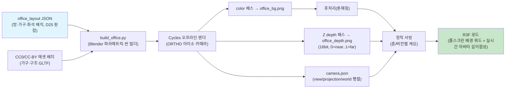

# 07-3D 비주얼 & 오픈에셋 파이프라인

> 🟦 **D29 피벗(2026-07-12) — 3D glb 런타임 폐기, 2.5D 전환.** 이 문서의 3D 에셋 파이프라인(v8/v10 glb·Blender·깊이합성 전부)은 **런타임 미사용**. 현행 런타임 에셋 = **2.5D 클린플레이트 PNG + 프레임 스프라이트**(`frontend/public/office2d/`, 팩 = `virtual_office_2_5d_modular_brandable_v2_2_hotfix`). 3D 팩은 문서 이력 보존. 정본 = **00-decisions §J(D29)**.

> 🔵 **D28 피벗(2026-07-09) — 렌더 방식 대체. 아래 "Blender Cycles 오프라인 렌더 + 깊이합성" 서술은 폐기·보류.** 현행 = **실시간 스타일라이즈드 R3F**(사용자 제작 저폴리 glb를 three.js로 실시간 렌더 — 같은 렌더러라 오클루전 자동, 깊이합성·Blender 오프라인 굽기 불필요). 정본 = **00-decisions §I(D28)**. 이 문서에서 **여전히 유효** = 에셋 규약(glb·미터·바닥중심 피벗·산출 경로 `frontend/public/assets/3d/...`)·아바타 폴리곤 예산·좌표(Z-up→Y-up 보정). **무효(D28)** = Blender/Cycles/오프라인 배경렌더/깊이합성/유리 2레이어 절.

> 🟣 **v8.0 에셋 소스(2026-07-10, D28.1).** 런타임 에셋 산출 정본 = **v8.0 통합본**(`docs/virtual_office_final_dev_complete_v8_0/`, 레지스트리 `asset-registry-v8.json`). glb·미터·바닥중심 피벗·Z-up→Y-up 규약 유효. 캐릭터는 **리깅+애니 12클립 내장**(정적 포즈 폐기). 상세 = 00-decisions §I(D28.1).

> 🟪 **v10.0 에셋 소스(2026-07-11, D28.2).** 런타임 에셋 산출 정본 = **v10.0 완제품**(`docs/virtual_office_complete_product_v10_0/`, 레지스트리 `asset-registry-v10.json`). glb·미터·바닥중심 피벗·Z-up→Y-up 규약 유효. v8 대비 **PBR(BaseColor·Normal·Metallic-Roughness) 텍스처를 GLB에 내장**(114 GLB·2127장)한 것이 핵심 차이. 상세 = 00-decisions §I(D28.2).

> 🟢 **D27 반영(2026-07-09 재작성) — 포토리얼 웹임베드 정본.** D26(WorkAdventure)+Godot 실시간 렌더는 폐기되고, **Blender Cycles 오프라인 렌더로 배경을 굽고 R3F(three.js)가 깊이합성으로 실시간 아바타를 가리는 고정 아이소 2.5D**가 현행 아키텍처다. 실측 근거 = 스파이크 `spikes/depth-composite`(PASS 2026-07-08). 정본 = 00-decisions §H(D27) · 3d-design/{photoreal-web-strategy, design-style-analysis, scene-structure} · 14/15/16. 본문에서 Godot/실시간GI/`.tscn`·`.pak`·Draco금지·VRAM BC·GDScript LOD/Occluder/MultiMesh 서술은 전부 폐기·교체되었다.

## 메타 정보
- **문서명**: 3D 비주얼 & 오픈에셋 파이프라인
- **버전**: 2.0
- **작성일**: 2026-07-01
- **최종 갱신**: 2026-07-09
- **담당자**: 3d-engine-specialist
- **범위**: 오프라인 배경 렌더(Blender Cycles) → 깊이합성 웹임베드(R3F) → 에셋 파이프라인
- **참조**: 00-decisions.md(정본, §H/D27), 3d-design/photoreal-web-strategy.md(3자 정합·좌표·깊이 규약), 3d-design/scene-structure.md, 05-office-layout-schema.md(씬 원점·경로 규약·좌석↔가구 정합)

> 이 문서는 00-decisions.md의 정본 결정을 따른다. 충돌 시 00-decisions.md가 이긴다.

---

## 1. 렌더 방식 & 품질 기준

### 1.0 렌더 파이프라인 개요 (D27 정본)

**렌더 방식은 실시간 3D 엔진이 아니라 오프라인 렌더 + 깊이합성이다.**

1. **배경을 굽는다(오프라인)**: Blender Cycles로 office_layout을 파라메트릭 씬으로 조립하고 **직교 아이소 카메라**로 렌더한다. 산출:
   - color 패스 → `office_bg.png`(배경 이미지)
   - Z depth 패스 → `office_depth.png`(16bit, 0=near black .. 1=far white)
   - 카메라 파라미터/행렬 → `camera.json`(view/projection/world 행렬)
2. **웹에서 실시간 합성**: R3F(three.js)가 `office_bg.png`를 **풀스크린 쿼드**로 깔고, 실시간 아바타(경량 GLTF)를 그린다. 아바타의 프래그먼트 깊이를 `office_depth.png`와 비교해(depthComposite.glsl.ts) 배경 뒤에 있으면 가린다 → **오클루전**.
3. **고정 아이소 2.5D**: 카메라는 굽는 시점에 고정된다(자유 회전 없음). 층/레이아웃 편집이 확정되면 배경을 재렌더한다.

실측 근거는 `spikes/depth-composite`(PASS 2026-07-08) — §1.3에 검증치를 수록한다.

### 1.1 씬 범위 (골든 샘플 대상 공간)

**목적**: Blender Cycles 오프라인 렌더에서 가상오피스의 최고 품질 기준을 시각적으로 확정하고, 향후 모든 배경·에셋의 벤치마크로 삼는다.

**포함 공간**:
- **로비**: 엔트리홀 + 브랜드월 + 리셉션 데스크 + 신발장/보관소 + 직원 안내 패널
- **오피스 에어리어**: 오픈데스크 5~8석(팀별 구분) + 중앙 네트워킹 테이블 + 캐비닛/프린터
- **회의실**: 파라메트릭 생성 유리 회의실 2개(4인, 8인 규모) + 화이트보드 스크린 — 골조(벽·문 개구부)는 05 office_layout의 room 스키마(`doors[]` 포함)로 런타임 생성하고, 07은 유리 재질·화이트보드·가구만 에셋으로 공급(고정 크기 골조 프리팹 아님, D9)
- **라운지**: 휴식 소파 + 커피머신 + 냉장고 + TV 스크린
- **집중실**: 방음 포드 2개 + 개별 조명
- **전화부스**: 소형 방음 폰부스
- **복도 및 미니맵**: 층간 계단/엘리베이터, 방향 사인, 미니맵 3D 오버레이

**플로어 스펙**: 
- 정면 가로 약 30m, 깊이 약 15m (표준 중형 오피스)
- 천고 2.8m, 각 공간 면적 비율은 현실 오피스 기준

### 1.3 스파이크 검증치 (spikes/depth-composite, PASS 2026-07-08)

아래 값은 실제 스파이크 코드에서 실측·확정된 정본이다. Blender 렌더 스크립트와 R3F 셰이더가 이 규약으로 정합한다.

- **카메라**: `ORTHO`(직교), `ortho_scale = 8.0`, elevation **35.264°**, azimuth **45°**, render **1920×1080**, clip near **0.1** / far **100**. `camera.json`에 view/projection/world 행렬을 수록한다.
- **좌표 변환**: **Blender(x, y, z) → three.js(x, z, −y)**. Blender는 Y-forward·Z-up, three.js는 Y-up·Z-forward이므로 축을 재매핑한다. 단일 원점은 photoreal-web-strategy §5의 3자 정합(Blender ↔ R3F ↔ Colyseus)에서 정의한 `office_layout`의 **top_left 미터 원점**(D25)이다.
- **깊이 규약**: `office_depth`는 **0=near(black) .. 1=far(white), 16bit**. Blender 측은 `material_override_emission`으로 굽는다 — `ShaderNodeCameraData.View_Z_Depth → MapRange(near..far → 0..1) → Emission`. R3F 측(`depthComposite.glsl.ts`)이 같은 규약으로 배경 깊이를 샘플해 아바타 프래그먼트와 비교한다.
- **웹 스택**: `three ^0.168`, `@react-three/fiber ^8.17`, `@react-three/drei ^9.115`, `vite`, `vitest`.

### 1.2 품질 기준

#### 공간 비율 & 배치
- 실측 데이터 또는 표준 오피스 설계 가이드(사무공간 1인당 면적·통로 폭 등 일반 기준) 참고
- 좌석 간 간격 최소 1.5m, 회의실 천고 최소 2.4m
- 도어 폭 0.9~1.2m(05 문 개구부 `doors[].width` 규약과 정합), 복도 폭 1.5m 이상

#### PBR 재질 & 텍스처
- **표준**: Metallic-Roughness (glTF 2.0 호환)
- **텍스처 해상도**: 
  - 대형 면(벽·바닥·천장): 2K(2048×2048)
  - 중형(데스크·파티션·가구): 1K(1024×1024)
  - 소형 객체(악세서리·전자기기): 512×512 이상
- **맵 포함**: Base Color + Normal + Roughness + Metallic (선택: AO)
- **소재 정확도**: 나무는 목재 텍스처, 유리는 반투명+프레넬, 금속은 산화 표현

#### 조명 & GI (Blender Cycles 오프라인)
- **GI는 오프라인 렌더에 굽는다**: 배경 이미지는 Blender Cycles(패스트레이싱 GI)로 굽는 순간 전역조명·소프트섀도·반사·AO가 이미 계산되어 픽셀에 고정된다. 웹 런타임(R3F)은 이 배경을 텍스처로 깔 뿐이므로 **실시간 GI 엔진이 필요 없다**. (구 문서의 Forward+/SDFGI/ReflectionProbe/SSAO/라이트맵 베이크 논쟁은 전부 무의미 → 폐기)
- **아바타 조명 정합(런타임)**: 실시간 아바타는 배경과 같은 광환경으로 보이도록 **IBL/라이트프로브**로 라이팅한다. 배경을 굽는 데 쓴 HDRI/조명을 요약한 **IBL 환경맵**을 three.js `Scene.environment`에 주입해 배경 톤과 정합시킨다.
- 브루탈리스트 조명 금지: 실내 간접광 + 국소 조명(면광원/스팟) 혼합으로 부드러운 GI 표현
- 실내 조명: 천장 LED 패널/면광원, 따뜻한 색온도(3500K~4000K)
- 외부 자연광: HDRI 환경 + 창 유리를 통한 광선 투과(Cycles가 굽는다)

#### 카메라 (고정 아이소 2.5D)
- **직교(ORTHO) 아이소메트릭 고정**: elevation 35.264° / azimuth 45°, `ortho_scale 8.0`, render 1920×1080, clip 0.1~100(§1.3 실측). 원근 FOV·자유 회전·1인칭 카메라는 없다.
- 카메라 파라미터/행렬은 `camera.json`으로 내보내 R3F가 배경 쿼드·깊이합성에 동일 투영을 재현한다.
- 미니맵(HUD)은 별도 top-down 평면도 오버레이로 처리하며, 메인 씬 카메라와 무관하다.

#### HUD & 오버레이 UI
- **직원 이름 태그**: 아바타 머리 위 텍스트, 거리별 페이드(20m 이상 숨김)
- **상태 뱃지**: D13 7종(offline/online/working/meeting/focus/away/external — 오프라인/온라인/작업중/회의중/집중중/자리비움/외출) 아이콘, 색상 코드. 화면 표시 시 오프라인 제외 6종("이동중" 상태는 폐기, D13)
- **우측 직원 패널**: 현재 시각 + 출근한 직원 목록(팀별) + 실시간 프레즌스 표시
- **하단 회의 패널**: 진행 중인 회의실 목록 + 참가자 얼굴 + 입장 버튼
- **미니맵**: 우측 하단 고정(05·06과 통일), 층/구역 토글, 아바타·회의실·클릭 네비게이션
- **폰트**: 가독성 최우선(고대비, 안티에일리어싱 적용)

#### 성능 기준 (웹임베드)
- **배경(오프라인)**: 성능 예산의 대상이 아니다 — 배경은 정적 이미지(PNG) 2장 + camera.json이므로 렌더 비용이 런타임에 없다. 씬 복잡도(폴리곤·GI 반사 등)는 굽는 시점에만 비용이 든다.
- **런타임 렌더 비용 = 아바타뿐**: 웹 브라우저(three.js)가 매 프레임 그리는 것은 풀스크린 배경 쿼드 1장 + 접속 아바타들뿐이다. **아바타 예산이 성능의 핵심**이다.
  - 아바타 폴리곤: 경량 GLTF 기준 **아바타당 8K~15K 삼각형(LOD 0), 동시 20명 총 ≤300K** — 정본 = 3d-design/optimization-criteria.md §1.2/§3.1. 동시 표시 규모에 맞춰 three.js LOD로 원거리 감축.
  - 드로우콜: 동일 아바타 메시는 three.js `InstancedMesh`로 병합해 계상.
- **배경 에셋 크기**: `office_bg.png` + `office_depth.png`(16bit) 합계는 정적 서빙 대상이므로 층/레이아웃 버전별 캐싱으로 초기 로드를 관리한다(§6, §8).
- **FPS 목표**: 일반 사무용 노트북 웹브라우저(내장그래픽 포함)에서 **60fps**를 목표로 하며, 부담은 배경이 아니라 동시 아바타 수에 비례한다.
- **로드 시간**: 배경 이미지 로드 < 2초(캐시 적중 시 즉시), 층 전환은 해당 층 배경 캐시 교체.

---

## 2. 오픈에셋 소스 & 커뮤니티

### 2.1 승인된 오픈에셋 저장소

#### Tier 1: CC0(공개 도메인, 최우선)

| 플랫폼 | URL | 특징 | 사용처 |
|--------|-----|------|--------|
| **ambientCG** | https://ambientcg.com | PBR 재질 + 큐브맵 라이브러리, 산업 표준 | 벽·바닥·천장·금속 마감재 |
| **Poly Haven** (구 HDRI Haven/Texture Haven) | https://polyhaven.com | 3D 모델(무료) + 재질 + HDRI, CC0 라이선스 명확 | 가구, 조명, 악세서리, HDRI 스카이박스 |
| **Kenney** | https://kenney.nl | 2D/3D 게임 에셋, 배치 일관된 스타일 | 버튼·아이콘·UI 요소, 단순 객체 |
| **Quaternius** | https://quaternius.com | 저폴리 3D 모델(무료 카테고리), 명확 라이선스 | 보조 가구, 보충 모델 |
| **Blender eevee-next-samples** (공식) | https://projects.blender.org | 일부 에셋 CC0, Blender 최적화 | 참고 씬·라이팅 설정 |

#### Tier 2: CC-BY(저작자 표시 필수, 제한적 사용)

| 플랫폼 | URL | 조건 | 검토 프로세스 |
|--------|-----|------|-------------|
| **Sketchfab** | https://sketchfab.com | 개별 모델 라이선스 확인 필수 | 각 모델마다 법무 검수 후 add to asset registry |
| **BlenderKit** (유료 옵션) | https://www.blenderkit.com | CC0/CC-BY 혼합, 유료는 회사 라이선스 | 필요시 업체에 라이선스 확인 |
| **TurboSquid Free** | https://www.turbosquid.com | 개별 라이선스 확인, 일부 CC 라이선스 | 검수 후 사용 가능 |

#### 금지 저장소 & 라이선스

❌ **사용 불가**:
- **CC-NC**(비상업), **CC-ND**(수정금지), **CC-SA / CC-BY-SA**(동일조건변경허락, ShareAlike) — NC는 사내 운영이라도 상업 해석이 모호하고, ND는 최적화·변환(GLTF 재익스포트·Draco/KTX2 압축·Blender 씬 편집) 자체가 불가하며, SA는 파생물 전체에 동일 라이선스를 전염시켜(카피레프트) 배포 산출물(GLTF 에셋·배경 이미지) 라이선스를 오염시키므로 → 원칙상 피함
- **Editorial Only**(에디토리얼 용도만 허용) → B2B 장기 고려 시 위험
- **All Rights Reserved**(명시 없음) — 라이선스 불명확 → 검수 불가 수용
- **브랜드 로고·실제 가구 외형**(예: Herman Miller, Steelcase 로고 포함 모델) → 지식재산권 침해 위험
- **교육용 전용**(학교·대학만 허용)

### 2.2 Tier 2 모델 검수 프로세스

```
1. 모델 선정 → 라이선스 문서 다운로드
2. 저자명 확인 + 라이선스 URL 기록
3. 상업/파생물/재배포 명시 검토
4. 필요시 저자에게 문의 (이메일)
5. THIRD_PARTY_LICENSES.md 추가
6. asset registry에 metadata 기록
7. 로컬 테스트 + 검증 후 확정
```

---

## 3. 라이선스 정책 & 규정

### 3.1 원칙

```
CC0 > CC-BY > (금지) > 구매/자체제작
```

1. **CC0 우선**: 제약 무시하고 최고 자유도 → ambientCG, Poly Haven, Kenney 최우선
2. **CC-BY 제한적**: 저작자 표시만 가능하면 사용 (Sketchfab, TurboSquid 개별 검수)
3. **명확하지 않으면 사용 금지** → Blender Startup File, 개인 블로거 에셋 등
4. **B2B 멀티테넌트 고려**: 현 단계는 단일 회사(사내 도그푸딩)이므로 관대한 해석 가능하나, 향후 배포 시 재검수 필수

### 3.2 저장소별 정책

#### ambientCG
- **라이선스**: CC0 완전 공개
- **정책**: 모든 자료 제약 없이 사용 가능, 저작자 표시 선택
- **납품**: THIRD_PARTY_LICENSES.md에 "ambientCG, Public Domain"으로 기재

#### Poly Haven
- **라이선스**: CC0 (일부 3D 모델은 저자가 개별 공개)
- **정책**: HDRI, 재질, 모델 모두 CC0, 다운로드 시 "License" 항목 확인
- **납품**: "Poly Haven, CC0" 기재

#### Kenney
- **라이선스**: 저작권 명시(다만 게임·상업 사용 허용)
- **정책**: "You are free to use these assets in both personal and commercial projects"
- **납품**: "Kenney.nl, License: Free for personal and commercial use"

#### Sketchfab (CC-BY 모델)
- **검수**: 각 모델 페이지 하단 "License" 항목 확인
- **저작자**: 저자명 전체 기록
- **표기 방식**: "Model Name by Author Name (CC-BY 4.0)" 또는 모델 URL 기재
- **파생물**: 수정 후 재배포 시 라이선스 유지 필수

### 3.3 납품 체크리스트

#### THIRD_PARTY_LICENSES.md 포함 항목

```markdown
# Third-Party Licenses

## Assets by Source

### CC0 (Public Domain)
- ambientCG
  - Material: Wood_Floor_006 (https://ambientcg.com/...)
  - License: CC0 1.0 Public Domain
  
- Poly Haven
  - HDRI: kloppenheim_06_puresky_4k (https://polyhaven.com/...)
  - License: CC0 1.0 Public Domain

### CC-BY (Attribution Required)
- Sketchfab
  - Model: "Office Chair" by John Doe (https://sketchfab.com/...)
  - License: CC-BY 4.0
  - Attribution: "Office Chair" by John Doe, licensed under CC-BY 4.0
    - Changes: Exported to .glb, texture optimization

## Excluded Sources
- (금지된 라이선스는 포함하지 않음)
```

#### Asset Registry 연동
- 모든 에셋은 `asset` 테이블에 저장 (4.5 참조)
- license, license_url, commercial_allowed, attribution_required, redistribution_allowed 필드 명시

---

## 4. 자체 제작 핵심 에셋 목록

### 4.1 우선순위 및 제작 계획

| 에셋 이름 | 분류 | 주요 용도 | 복잡도 | 예상 시간 | 제작 도구 | 참고 |
|----------|------|----------|--------|----------|---------|-----|
| **브랜드월** | 구조 | 로비 - 회사 아이덴티티 | 중간 | 8h | Blender | 회사 로고·색상 활용 |
| **리셉션 데스크** | 가구 | 로비 - 엔트리 포인트 | 중간 | 10h | Blender | 모듈형, 재질 고급 |
| **회의실 유리 재질·문짝·화이트보드 세트** | 가구/소품 | 파라메트릭 회의실용 부속 | 중간 | 10h | Blender(Cycles 재질) | 골조(벽·개구부)는 05 room 스키마로 파라메트릭 생성(D9). 07은 유리 재질·문짝·화이트보드만 공급. 배경은 Cycles가 유리 굴절/반사를 굽는다 |
| **오픈데스크 블록** | 가구 | 오피스 에어리어 - 팀별 구분 | 중간 | 12h | Blender | 모듈식, 의자·조명 포함 |
| **팀구역 파티션** | 구조 | 시각적 경계 - 단색/패턴 | 낮음 | 6h | Blender | 흰색/색상 변형 버전 |
| **집중실/폰부스** | 구조 | 집중·통화 공간 - 방음 표현 | 중간 | 12h | Blender | 투광성 합성수지, 내부 조명 |
| **라운지 소파** | 가구 | 라운지 - 편의성 & 스타일 | 낮음 | 6h | 모델링 또는 Poly Haven | 패브릭 텍스처 |
| **회의 테이블** | 가구 | 회의실 - 실사적 반사 | 중간 | 8h | Blender | 목재/화강암, 재질 고급 |
| **모니터 스크린** | 장비 | 회의·라운지·데스크 | 낮음 | 4h | Blender 또는 Quaternius | 디스플레이 표면 UV 매핑 |
| **LED 라인조명** | 구조 | 천장·벽 - 간접광 원천 | 낮음 | 5h | Blender | 이미시브 재질, 색온도 변형 |
| **미니맵 구조물** | UI 3D | HUD - 평면도 기준 | 낮음 | 4h | Blender | 투명도 조정 |
| **상태 뱃지 UI** | UI (R3F/DOM) | 아바타 상태 표시 | 낮음 | 3h | R3F drei Html/스프라이트 | 아바타 위 빌보드, 상태 아이콘 D13 7종(화면 표시는 오프라인 제외 6종) |
| **회의실 플로팅 라벨** | UI (R3F/DOM) | 회의실 이름·점유 상태 | 낮음 | 3h | R3F drei Html/스프라이트 | 거리별 페이드, 항상 정면 향 |
| **아바타 변형 5~10명** | 캐릭터 | 기본 휴머노이드 + 색상 변형(런타임 three.js GLTF) | 높음 | 40h (베이스 리깅 + 변형, 2배 버퍼 포함) | **MakeHuman(무료)/CC4(유료) 소스** + Blender | MakeHuman/CC4로 베이스 생성·리깅 후 색상·프로포션 변형. **Ready Player Me 금지(2026-01 종료)**. 경량 GLTF로 익스포트(Draco/meshopt + KTX2). 리깅 상세는 §4.1 및 태스크 산출물로 정의 |

### 4.2 자체 제작 가이드라인

#### 목재·마감재
- **참고 HDRI**: Poly Haven HDRI 라이브러리 중 실내 조명 환경 다운로드
- **텍스처 베이스**: ambientCG 목재/콘크리트/석재 재질 다운로드 후 Blender Shader Editor에서 커스텀
- **색상 팔레트**: 회사 브랜드 컬러 가이드라인 준수

#### 유리 & 투명도
- **재질**: Blender Cycles Principled BSDF(Transmission) — 배경 렌더 시 굴절·반사를 굽는다. (실시간 아바타가 유리 뒤에 있으면 배경 깊이합성으로 자연히 가려진다)
- **Roughness**: 0.0~0.1 (맑은 유리), 0.2~0.3 (프로스티드 글래스)
- **IOR**: 1.5 (표준 소다석회유리)
- **내부 벽**: 화이트보드 재질(Roughness 0.4, Metallic 0.0)

#### 모듈형 설계
- **데스크 블록**: 1.2m × 0.6m 단위, 네스팅 배치 가능
- **파티션**: 1.2m 높이, 다양한 길이 변형(1.2/2.4/3.6m)
- **회의실**: 골조(벽·문 개구부)는 05 room 스키마로 **파라메트릭 생성**하고, 내부 가구(테이블/의자)·유리 재질만 에셋으로 분리 공급(고정 크기 골조 프리팹 없음, D9)

---

## 5. 파이프라인 & 레지스트리 스키마

### 5.0 전체 파이프라인 (office_layout → 배경 굽기 → R3F 로드)

**정본 흐름**: `office_layout JSON → Blender 파라메트릭 씬 빌더(build_office.py) + CC0 에셋 배치 → Cycles 렌더(color+depth) → 후처리(톤매핑) → office_bg/depth/camera.json → 정적 서빙 → R3F 로드`. 층/레이아웃 버전별로 캐싱하고, 편집이 확정되면 해당 배치를 재렌더한다.



### 5.1 에셋 파이프라인 (개별 에셋 조달·제작)

아래는 배경 씬을 조립하기 위한 **개별 GLTF 에셋**(가구·구조·아바타)의 조달·제작 파이프라인이다. 완성된 에셋은 위 §5.0의 `build_office.py`가 배치한다.

```mermaid
graph LR
    A["1. 요구사항 정의<br/>(도면, 용도, 스펙)"] --> B["2. 소스 선정<br/>(CC0/검수)"]
    B --> C["3. 다운로드<br/>& 파일 정리"]
    C --> D["4. 분석 & 측정<br/>(비율, 폴리곤, 재질)"]
    D --> E["5. 포맷 정리<br/>(Blender: FBX/OBJ→GLTF)"]
    E --> F["6. 자체 제작/조정<br/>(모델링, 구조 통합)"]
    F --> G["7. PBR 재질 적용<br/>(Cycles Principled BSDF)"]
    G --> H["8. 웹 최적화<br/>(Draco/meshopt + KTX2/Basis)"]
    H --> I["9. 아바타 LOD<br/>(three.js 기준, 배경 에셋은 불필요)"]
    I --> K["10. 씬 배치<br/>(build_office.py가 layout대로 인스턴싱)"]
    K --> L["11. Asset Registry 등록<br/>(메타데이터, 라이선스)"]
    L --> M["12. 렌더 검증<br/>(배경 품질 · 아바타 런타임 FPS)"]
    M --> N["13. 배포 & 버저닝<br/>(에셋 GLTF + 배경 이미지 캐시)"]

    style A fill:#e1f5ff
    style N fill:#c8e6c9
```



### 5.2 각 단계 상세

#### **1. 요구사항 정의**
- 도면 또는 텍스트 명세 작성: "로비 브랜드월, 가로 4m × 높이 2.5m, 회사 로고 3개, 라이팅"
- 목표 폴리곤 수 지정 (예: 50K 이하)
- 참고 이미지/영상 수집

#### **2. 소스 선정**
- 위 2절 저장소 검색, CC0 우선
- 라이선스 URL 기록
- 대체 소스 2개 이상 확보(조달 실패 대비)

#### **3. 다운로드 & 파일 정리**
```
assets/
  ├── 3d_models/
  │   ├── raw/
  │   │   └── reception_desk_cc0_polyhaven.blend
  │   └── processed/
  │       └── reception_desk_v1.glb
  ├── textures/
  │   └── wood_floor_006_ambientcg/
  │       ├── normal.png
  │       ├── roughness.png
  │       └── basecolor.png
  └── LICENSE/
      └── reception_desk.txt
```

#### **4. 분석 & 측정**
- Blender에서 열기, 단위 확인(cm, m)
- 폴리곤 수 확인 (Shift+Ctrl+Alt+I)
- 텍스처 해상도 기록
- PBR 채널 명칭 확인(Roughness/Metallic 정의에 따라 다름)
- 크기 재조정 필요 여부 판단

#### **5. 포맷 정리 (Blender → GLTF 2.0)**
- Blender에서 "Export as glTF 2.0 (.glb/.gltf)" 선택
- 설정:
  - Include Animations: 아바타 등 필요시만 O
  - Include Deformation Bones: O (리깅 있을 시)
  - Format: `.glb`(단일 파일) 또는 `.gltf`+bin
- **웹 표준 포맷을 지향한다** — 압축은 8단계에서 **Draco/meshopt(메시) + KTX2/Basis(텍스처)**로 처리한다. (구 문서의 "Draco 금지" 규약은 Godot 임포트 한계 때문이었고, 웹은 정반대로 Draco/meshopt가 표준이다.)
- 배경 씬용 에셋은 `build_office.py`가 Blender 씬에 임포트해 배치하고 Cycles로 굽는다. 런타임에 브라우저로 내려가는 것은 배경 이미지와 **아바타 GLTF**뿐이다.

#### **6. 자체 제작/조정**
- 회사 로고 텍스처 추가, 색상 변경
- 부품 추가(가구, 조명)
- 크기 및 배치 조정
- 불필요한 지오메트리 정리

#### **7. PBR 재질 적용 (Blender Cycles)**
Blender Principled BSDF(glTF 2.0 Metallic-Roughness와 호환):
```
Principled BSDF:
  - Base Color: basecolor 텍스처
  - Normal: Normal Map 노드 → normal 텍스처
  - Roughness: roughness.png or value 0.5
  - Metallic: metallic.png or value 0.0
  - Transmission: 유리 등 투명 재질(Cycles가 굴절 렌더)
  - Emission: LED 등 발광 필요시만
```
배경은 Cycles가 이 재질로 GI·반사·굴절을 굽는다. 아바타 GLTF는 같은 재질을 three.js `MeshStandardMaterial`로 로드한다.

#### **8. 웹 최적화 (Draco/meshopt + KTX2/Basis)**
- **메시 압축**: `gltf-transform` 또는 `gltfpack`으로 **Draco 또는 meshopt** 적용. 웹 GLTF의 표준 경로다(Godot 시절의 "Draco 금지·VRAM BC" 규약은 폐기 — 웹은 정반대다).
- **텍스처 압축**: **KTX2/Basis Universal**로 변환(`toktx` / `gltf-transform`). GPU 지원 포맷으로 트랜스코드되어 브라우저 VRAM·다운로드를 절약한다.
- 이 최적화는 **런타임 다운로드되는 아바타 GLTF**에 특히 중요하다. 배경 씬용 정적 에셋은 굽는 데만 쓰이므로 압축 우선순위가 낮다.

#### **9. 아바타 LOD (three.js 기준)**
- **배경 에셋에는 LOD가 불필요**하다 — 배경은 굽는 순간 이미지로 고정되므로 런타임 폴리곤이 0이다. (구 문서의 씬 전체 LOD·Occluder·MultiMesh는 오프라인 배경에 무의미 → 폐기)
- **아바타만 three.js `LOD` 객체로 거리별 감축**:
```
LOD 0 (Full):   근거리 아바타 풀 메시
LOD 1 (Medium): 중거리 간소화 메시(Blender Decimate 또는 gltf-transform simplify)
LOD 2 (Low):    원거리 빌보드/저폴리
```

#### **10. 씬 배치 (build_office.py)**
- 완성된 GLTF 에셋은 `build_office.py`가 office_layout JSON을 읽어 방·가구·좌석 좌표대로 Blender 씬에 인스턴싱한다. asset_id → 에셋 파일 매핑은 Asset Registry(§5.3)를 조회한다.
- 좌표 원점은 layout `top_left` 미터(D25). Blender 좌표는 렌더 후 R3F에서 `(x, z, −y)`로 재매핑된다(§1.3).

#### **11. Asset Registry 등록**
`asset` 테이블에 메타데이터 기록 (§5.3 참조).

#### **12. 렌더 검증**
- **배경**: Cycles 렌더 결과의 시각 품질(GI·그림자·재질) 및 `office_depth` 규약(0=near..1=far, 16bit) 정합 확인.
- **아바타 런타임**: 웹브라우저에서 접속 아바타 규모 기준 60fps, 깊이합성 오클루전 정상 동작 확인(스파이크 검증 규약, §1.3).

#### **13. 배포 & 버저닝**
```
# 소스 (저장소 보관, 배포 미포함 — raw만 파일명 버전 허용)
render-pipeline/assets/models/desk_standard/
  ├── raw/desk_standard_v1.0.glb    # 배경 씬용 소스 GLTF (미압축 원본)
  └── CHANGELOG.md

# 배포 산출물 (정적 서빙 — 경로 정본: 3d-design/asset-registry.md §3.3)
frontend/public/assets/3d/
  ├── models/{slug}/{slug}.glb      # 런타임 다운로드 GLTF(Draco+KTX2). 파일명 고정 — 버전은 asset 테이블 관리
  └── scenes/{floor}/{layout_version}/
      ├── office_bg.png             # 배경(층/레이아웃 버전별 캐싱)
      ├── office_depth.png          # 16bit depth
      └── camera.json
```
- Git tag: `asset/DESK_STANDARD_001`
- 버전은 asset 테이블·CHANGELOG로 관리(배포 `.glb` 파일명에 버전 표기 금지). 배경 이미지는 층/레이아웃 버전 키로 캐싱하고 편집 확정 시 재렌더.
- QA 체크리스트 완료

### 5.3 Asset Registry 스키마 (정본 참조)

> **스키마 정본 = `docs/3d-design/asset-registry.md` §1.1** (2026-07-09 교차감사 수렴). 본 절의 종전 자체 DDL "정본 선언"(2026-07-02)은 **철회**한다 — 이 절과 04-data-model.md §2.6은 모두 asset-registry.md §1.1을 참조한다. 충돌 시 asset-registry.md §1.1이 이긴다.
>
> 본 절이 정의했던 `asset_delivery VARCHAR(20)`(`"background"`|`"runtime"`) 판별자 컬럼은 **registry 스키마로 흡수**됐다. registry 정본에서 `gltf_path`는 **NULL 허용**이며, `CHECK((asset_delivery='runtime' AND gltf_path IS NOT NULL) OR (asset_delivery='background' AND render_output_path IS NOT NULL))` 제약이 계열별 필수 경로를 집행한다(타임스탬프는 TIMESTAMPTZ, D19).

#### 요약 (전체 DDL·컬럼 설명·예시 레코드 = asset-registry.md §1.1·§6)

| 컬럼(발췌) | 요약 |
|---|---|
| `asset_id` VARCHAR(64) PK | 대문자·언더스코어(05 정본). 예: `"DESK_STANDARD_001"` |
| `asset_delivery` VARCHAR(20) NOT NULL | `"background"`(build_office.py가 굽는 배경 산출물) \| `"runtime"`(브라우저 다운로드 아바타·소품 GLTF) |
| `gltf_path` VARCHAR(256) NULL | 런타임 GLTF. 규약: `frontend/public/assets/3d/models/{slug}/{slug}.glb` — **파일명 고정, 버전은 asset 테이블·CHANGELOG 관리**(종전 `_vX.glb` 파일명 버전 표기는 자기모순으로 폐기) |
| `render_output_path` JSONB | 배경 렌더 산출물 세트(bg/depth/camera). 규약: `frontend/public/assets/3d/scenes/{floor}/{layout_version}/` |
| `polygon_count` / `dimension` / `footprint_2d` / `thumbnail_url` | 성능·편집기 메타(±1cm AABB 검증 포함). `external_dependencies` 예: `"MAT_WOOD_FLOOR_006"` |
| 라이선스 컬럼군 | `license`·`commercial_allowed`·`attribution_required` 등 — asset-registry.md §5 |

예시 레코드(`DESK_STANDARD_001` 등)는 asset-registry.md §6 참조.

> **dimension 일치 검증 규칙**: `dimension`(및 `footprint_2d`)은 GLTF 메시의 바운딩박스 실측 크기와 일치해야 한다(허용 오차 ±1cm). 에셋 등록 시 자동 측정한 bbox와 등록값이 어긋나면 등록을 거부한다. 이 `dimension`이 05의 좌석↔가구 좌표 정합·`build_office.py` 배치·편집기 도면 배치의 **정본**이므로, layout JSON의 `furniture.dimension`은 표시용 캐시일 뿐 이 값과 불일치하면 서버가 이 값으로 덮어쓴다.

---

## 6. 최적화 전략 (웹 런타임 + 배경 캐싱)

> **핵심 전환**: 런타임 렌더 비용은 배경이 아니라 **아바타와 배경 이미지 로드**에만 존재한다. 배경은 굽는 순간 이미지가 되므로 런타임 폴리곤·드로우콜이 0이다. 따라서 최적화 대상은 (1) 배경 이미지 캐싱, (2) 아바타 GLTF 경량화, (3) 아바타 three.js LOD/인스턴싱이다. 구 문서의 씬 전체 LOD·MultiMesh·Occluder·VRAM BC·저사양 GI 모드는 오프라인 배경 아키텍처에 무의미 → 폐기.

### 6.1 배경 이미지 캐싱

- `office_bg.png` + `office_depth.png` + `camera.json`을 **층/레이아웃 버전 키**로 캐싱(§8). 편집이 확정될 때만 재렌더하므로 대부분의 접속은 캐시 적중이다.
- 배경은 정적 파일이라 CDN/브라우저 캐시가 그대로 먹는다. 깊이맵은 16bit PNG로 정밀도를 유지한다.

### 6.2 아바타 경량화 (런타임 GLTF)

- **Draco/meshopt** 메시 압축 + **KTX2/Basis** 텍스처(§5.1 8단계)로 다운로드·VRAM을 줄인다.
- 동일 아바타 메시는 three.js `InstancedMesh`로 병합해 드로우콜을 통합한다(구 Godot MultiMesh 대응).

```ts
// three.js: 동일 베이스 아바타 다중 인스턴싱
const inst = new THREE.InstancedMesh(avatarGeometry, avatarMaterial, count);
avatars.forEach((a, i) => inst.setMatrixAt(i, a.matrix));
inst.instanceMatrix.needsUpdate = true;
```

### 6.3 아바타 LOD (three.js)

```ts
const lod = new THREE.LOD();
lod.addLevel(avatarFull,   0);   // 근거리 풀 메시
lod.addLevel(avatarMedium, 15);  // 중거리 간소화
lod.addLevel(avatarLow,    35);  // 원거리 저폴리/빌보드
```
- 배경 가구·구조는 이미지이므로 LOD 대상이 아니다.

### 6.4 깊이합성 오클루전 (Occluder 대체)

- 벽·파티션 뒤 아바타 가림은 **별도 Occlusion Culling 엔진이 필요 없다** — `office_depth`와 아바타 프래그먼트 깊이를 비교하는 셰이더(`depthComposite.glsl.ts`)가 자동으로 배경 뒤 픽셀을 버린다(§1.3 깊이 규약). 이것이 구 Godot OccluderInstance3D를 대체하는 정본 메커니즘이다.

### 6.5 IBL/톤매핑 정합

- 아바타 조명은 배경을 굽는 데 쓴 환경을 요약한 IBL 환경맵으로 정합(§1.2). 배경 후처리 톤매핑과 three.js `toneMapping`/`toneMappingExposure`를 맞춰 배경-아바타 색조 이질감을 제거한다.

---

## 7. 일정 & 마일스톤

### 7.1 Stage 1 (골든 샘플) 소요 시간

| 항목 | 시간 | 진행 상황 |
|------|------|----------|
| 브랜드월 | 8h | Ready to start |
| 리셉션 데스크 | 10h | Ready to start |
| 회의실 유리·문짝·화이트보드 세트(골조는 파라메트릭 생성, D9) | 10h | Ready to start |
| 오픈데스크 블록 | 12h | Ready to start |
| 파티션·집중실·라운지 | 24h | Ready to start |
| 모니터·LED·테이블 | 17h | Ready to start |
| 미니맵·UI 뱃지·라벨 | 10h | Ready to start |
| 아바타 5~10명 (MakeHuman/CC4 소스, 2배 버퍼) | 40h | 본 문서 §4.1 산출물 |
| 텍스처 수집 & 웹 최적화(Draco/KTX2) + IBL 셋업 | 20h | Ready to start |
| Blender 씬 빌더(build_office.py) + Cycles 렌더 + 깊이합성 통합 | 16h | Ready to start |
| **소계** | **~167h** | **~4주 (1인 풀타임)** |

### 7.2 Stage 2 (통합) 일정

- ERP 동기화 모듈 추가: +40h
- 좌석 배정 시스템(04 `seat.assigned_user_id`+`seat_assignment_history` 연동, D10): +24h
- **총 Stage 1+2: ~231h (~6주)**

> 위 시간은 3D/에셋 작업만의 추정이며, 전체 프로젝트 일정은 **D27 재산정으로 주 단위 미확정**이다(00-decisions D6, 16-render-spike-and-roadmap §Part B). Stage 1+2(~6주)는 3D 파이프라인 몫의 추정치일 뿐 전체 기준선이 아니다. 아바타·커스텀 제작 시간은 최소 2배 버퍼를 반영했다.

---

## 8. 파일 구조 & 저장소 레이아웃

> **경로 규약(05와 통일)**: 에셋은 `background`(build_office.py가 굽는 배경용 GLTF)와 `runtime`(브라우저가 다운로드하는 아바타 GLTF)으로 나뉜다. 배경 산출물은 층/버전별 `office_bg.png`+`office_depth.png`+`camera.json` 세트다. asset_id → GLTF 매핑은 Asset Registry(§5.3)를 조회한다. 버전은 파일명이 아니라 asset 테이블·CHANGELOG·배경 버전 키로 관리한다.

```
vituraloffice_new/
├── render-pipeline/                            # Blender 오프라인 렌더 (배경 굽기)
│   ├── build_office.py                         # office_layout JSON → 파라메트릭 Blender 씬
│   ├── render_office.py                        # Cycles 렌더 + color/depth 패스 + camera.json 익스포트
│   └── assets/
│       ├── models/                             # 배경 씬용 소스 GLTF (build_office.py가 배치)
│       │   ├── brand_wall/
│       │   │   ├── brand_wall_v1.0.glb
│       │   │   ├── thumb.png                   # 편집기 팔레트 썸네일
│       │   │   ├── textures/
│       │   │   │   ├── logo_albedo.png (2K)
│       │   │   │   ├── wall_normal.png
│       │   │   │   └── wall_roughness.png
│       │   │   └── METADATA.json
│       │   ├── reception_desk/
│       │   ├── meeting_room_glass/
│       │   ├── open_desk/
│       │   └── ...
│       ├── materials/                          # ambientCG PBR 소스 (Blender 재질로 사용)
│       │   ├── wood_floor_006/ (from ambientCG)
│       │   ├── concrete_wall/
│       │   └── metal_frame/
│       ├── hdri/                               # Cycles 조명 + IBL 소스
│       │   └── kloppenheim_06_puresky_4k.exr (from Poly Haven)
│       └── LICENSE/
│           ├── THIRD_PARTY_LICENSES.md
│           ├── brand_wall.txt (라이선스 명시)
│           └── ...
├── frontend/                                   # R3F(three.js) 웹임베드 (three.js ^0.168, @react-three/fiber ^8.17, drei ^9.115)
│   ├── public/                                 # Next.js 정적 서빙 루트 (R3F가 로드)
│   │   └── assets/3d/                          # 경로 정본: 3d-design/asset-registry.md §3.3
│   │       ├── scenes/                         # 배경 렌더 산출물
│   │       │   └── {floor}/{layout_version}/   # 층/레이아웃 버전별 캐싱 (예: floor1/v3/)
│   │       │       ├── office_bg.png           # color 패스
│   │       │       ├── office_depth.png        # Z depth (16bit, 0=near..1=far)
│   │       │       └── camera.json             # view/projection/world 행렬
│   │       └── models/                         # 런타임 다운로드 GLTF (Draco+KTX2)
│   │           └── {slug}/{slug}.glb           # 파일명 고정 — 버전은 asset 테이블·CHANGELOG 관리
│   └── shaders/
│       └── depthComposite.glsl.ts              # 배경 깊이 vs 아바타 프래그먼트 비교
├── docs/
│   ├── planning/
│   │   ├── 07-3d-visual-asset-pipeline.md (이 문서)
│   │   └── ASSET_REGISTRY.md (레지스트리 쿼리 예시)
│   └── 3d-design/
│       ├── photoreal-web-strategy.md (3자 정합·좌표·깊이 규약, 정본)
│       ├── design-style-analysis.md
│       └── scene-structure.md (씬 구조, 정본)
└── backend/
    ├── app/
    │   ├── models/
    │   │   └── asset.py (Asset ORM)
    │   ├── schemas/
    │   │   └── asset.py
    │   └── routers/
    │       └── assets.py
    └── migrations/
        └── assets_table.sql
```

---

## 9. QA 체크리스트 (골든 샘플 완료 기준)

- [ ] **라이선스**: THIRD_PARTY_LICENSES.md 완료, 모든 CC0/CC-BY 출처 기록
- [ ] **배경 렌더**: Cycles color/depth 패스 정상 산출, `office_depth` 규약(0=near..1=far, 16bit) 정합, `camera.json` 행렬 유효
- [ ] **깊이합성**: R3F가 배경 쿼드 + 아바타 로드, 벽/파티션 뒤 아바타 오클루전 정상(depthComposite 셰이더)
- [ ] **좌표 정합**: Blender(x,y,z)→three.js(x,z,−y) 재매핑으로 아바타가 배경 좌표에 정확히 안착(3자 정합, photoreal-web-strategy §5)
- [ ] **성능**: 웹브라우저(내장그래픽 포함) 60fps, 아바타 GLTF Draco+KTX2 적용, 배경 이미지 캐시 적중
- [ ] **시각 품질**: Cycles GI/그림자/유리 굴절 굽기 완료, 아바타 IBL/톤매핑 정합
- [ ] **기능**:
  - [ ] 아바타 5~10명 로드 가능
  - [ ] 이름 태그 및 상태 뱃지 표시(R3F drei Html/스프라이트)
  - [ ] 우측 직원 패널 업데이트
  - [ ] 하단 회의 패널 표시
  - [ ] 미니맵 네비게이션
- [ ] **파일**: Asset Registry 기입, 메타데이터 기록(gltf_path·asset_delivery·dimension·footprint_2d)
- [ ] **문서**: 3d-design/{photoreal-web-strategy, scene-structure} 반영

---

## Loop Metadata

### Upstream Documents Referenced
- 01-prd.md (제품 비전 및 7단계 로드맵)
- 03-erp-integration.md (ERP 동기화, 단일 조직 스코프)
- 04-data-model.md (asset 테이블 정의)
- 12-tasks.md (Stage 1 태스크 분배)

### Downstream Documents Affected
- 09-realtime-collaboration.md (실시간 협업 — Colyseus 서버, 아바타 위치 브로드캐스트)
- 3d-design/photoreal-web-strategy.md (3자 정합·좌표·깊이 규약 정본)
- 3d-design/scene-structure.md (R3F 씬 조직)
- 16-render-spike-and-roadmap.md (스파이크 검증·렌더 로드맵)

### Open Questions
- **아바타 리깅**: Humanoid 기본 구조인지 사내 고유 스키마인지? → MakeHuman/CC4 베이스 리그 위에 사내 표준 정의(§4.1)
- **HDRI 교체**: 사계절·날씨 표현 필요한가? (배경 재렌더로 대응 가능하나 현재 기획: X)
- **아이소 시점 이외 뷰**: 층 전환·줌 외에 카메라 이동이 필요한가? → 필요 시 각 시점을 별도 배경으로 굽는 방식(고정 아이소 원칙 유지)

### Assumptions
1. 사내 인트라넷 환경이라 CC0/CC-BY 에셋 사용 가능 (SA/NC/ND 배제, B2B 시 재검수 필수)
2. 렌더는 **Blender Cycles 오프라인**이므로 실시간 GI/GPU 부담이 배경에 없다. 런타임 부담은 아바타 수에 비례(웹브라우저 60fps 목표).
3. 웹 스택 **three ^0.168 / @react-three/fiber ^8.17 / @react-three/drei ^9.115 / vite / vitest**(스파이크 검증 스택).
4. 아바타는 **MakeHuman(무료)/CC4(유료)** 소스, **Ready Player Me 금지(2026-01 종료)**. 런타임 경량 GLTF(Draco+KTX2).
5. 에셋 포맷은 **웹 표준 GLTF + Draco/meshopt + KTX2/Basis**. Godot `.tscn`/`.pak`/VRAM BC는 폐기.

### Validation Criteria
- [ ] 골든 샘플 배경 굽기(color/depth/camera) + R3F 깊이합성 데모 실행 가능
- [ ] Asset Registry DB에 모든 모델 메타데이터 저장(gltf_path·asset_delivery·dimension·footprint_2d·thumbnail_url 포함)
- [ ] 웹브라우저 60fps + 깊이합성 오클루전 벤치마크 통과(스파이크 규약, §1.3)
- [ ] 라이선스 규정 준수 검증 완료(SA/NC/ND 미포함)

### Risks
- **라이선스 검수 지연**: CC-BY 모델 선택 시 저자 확인 소요 → 사전에 백업 CC0 모델 확보
- **깊이합성 아티팩트**: 배경 깊이 정밀도/에지에서 아바타 클리핑 → 16bit depth 유지, near/far 클립 튜닝(§1.3)
- **재렌더 비용**: 레이아웃 편집마다 Cycles 재렌더 → 층/버전별 캐싱, 변경분만 재렌더
- **에셋 조달 실패**: 특정 모델 삭제/변경 → 다중 소스 확보, 자체 제작 계획 유연성

---

## 변경 이력

| 버전 | 일자 | 변경 내용 |
|------|------|----------|
| 1.0 | 2026-07-01 | 초안 |
| 1.1 | 2026-07-02 | 00-decisions 반영: D7 라이팅(실시간 직접광+ReflectionProbe+SSAO 기본·SDFGI 고사양 옵션, 라이트맵/Occluder 사전 베이크 배제 사유), D8 에셋 전달(.tscn pak 동봉·런타임 다운로드/CDN 배제·Draco/gltfpack 제거·Godot 임포트 최적화·경로 규약 05 통일), D9(회의실 골조 프리팹 제거→파라메트릭, 가구/소품만), 시간 재추정(Mixamo 정식 승격·§7.1 167h·§7.2 231h·D6 정합), asset 테이블 편집기 메타(footprint_2d·thumbnail_url·dimension·tscn_path) 및 dimension 일치 검증, 드로우콜 예산 MultiMesh 집행 규칙(개수 프록시 폐기), 사실 오류 정정(Poly Haven 연혁·ISO 14644 제거·CC-SA ShareAlike·Godot 4.x 안정판·메모리 2GB·미니맵 우측 하단), 성능 기준 D22(GTX 1650/내장) 통일 |
| 1.2 | 2026-07-02 | 데이터 정본 정렬: 상태 뱃지를 D13 7종(offline/online/working/meeting/focus/away/external, 화면 표시 시 오프라인 제외 6종 — "이동중" 삭제·away 추가)으로 정정, 아바타 리깅의 깨진 "08 문서" 참조를 본 문서 §4.1·P1-S1-T4 산출물로 교체, §8 저장소 레이아웃의 assets/를 godot/ 하위로 이동(res:// 경로 정합), §5.3 asset 스키마 정본 선언(04 §2.6이 참조), §7.2 좌석 배정 참조를 04 정본(seat.assigned_user_id+seat_assignment_history)으로 정정 |
| 2.0 | 2026-07-09 | **D27 포토리얼 웹임베드 전면 재작성**. Godot 폐기 → Blender Cycles 오프라인 렌더(color+depth) + R3F 깊이합성 고정 아이소 2.5D. §1.0 렌더 파이프라인 개요·§1.3 스파이크 검증치(ORTHO/ortho_scale 8.0/elev 35.264°/azim 45°/1920×1080/clip 0.1~100, Blender→three.js (x,z,−y), depth 0=near..1=far 16bit, three ^0.168 스택) 신설. GI/조명(SDFGI/ReflectionProbe/SSAO/라이트맵) → Cycles 굽기 + 아바타 IBL. 성능(GTX1650 60fps/2GB/드로우콜) → 웹 런타임(아바타만 비용·배경 이미지 캐싱). 에셋 포맷 Draco금지·VRAM BC → GLTF+Draco/meshopt+KTX2/Basis. §5 파이프라인 office_layout→build_office.py→Cycles→bg/depth/camera→R3F로 교체. §6 최적화(MultiMesh/Occluder/GDScript LOD) → three.js InstancedMesh/LOD·깊이합성 오클루전. 아바타 Mixamo → MakeHuman/CC4(Ready Player Me 금지). §8 저장소 레이아웃 godot/·.tscn → render-pipeline/·public/rendered/·frontend/. asset 스키마 tscn_path→gltf_path+asset_delivery. Downstream GODOT_SETUP 제거→3d-design/{photoreal-web-strategy,scene-structure}. |

---

**작성일**: 2026-07-01  
**최종 수정**: 2026-07-09  
**담당**: 3d-engine-specialist  
**검수 예정**: 완료 후 orchestrator 병합
