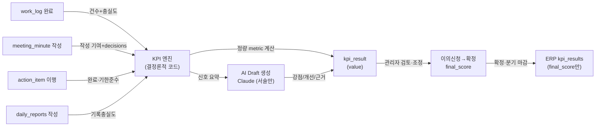
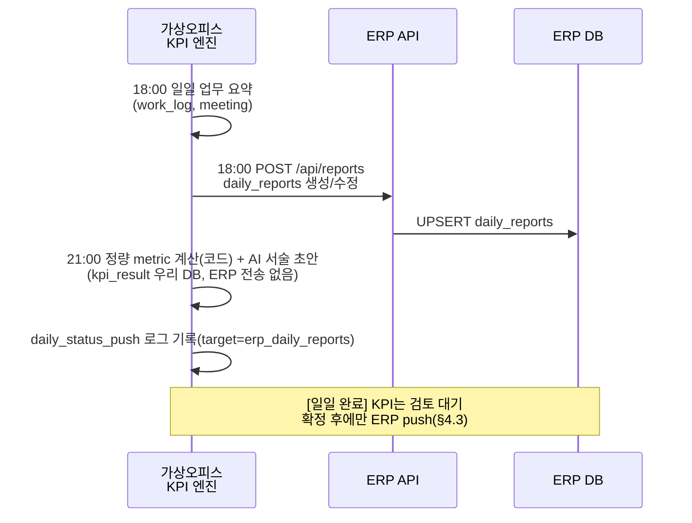

# 08-kpi-logic.md — KPI 로직

## Overview

KPI(Key Performance Indicator) 시스템은 직원의 업무 성과를 측정·평가하는 중핵 기능이다. 가상오피스에서 발생하는 협업 신호(회의·업무결과·의사결정·액션아이템)를 수집하고, AI가 사유+개선액션을 포함한 초안을 작성한 뒤, 관리자가 검토·조정하고 직원이 이의신청할 수 있는 공정한 흐름을 제공한다.

**핵심 원칙**: 결과가 남는 협업 산출물만 평가한다. 접속시간·채팅·근접·화상요청 횟수 같은 행동 기반 지표는 반감시(surveillance)로 인식하여 제외한다. **정량 점수는 결정론적 코드로 계산하며(D14-e), AI는 서술(강점/개선/근거)만 생성한다.**

---

## 1. KPI 원칙 & 평가 항목

### 1.1 핵심 원칙

| 항목 | 설명 |
|------|------|
| **결과 중심** | 완료 업무 **건수 + 충실도**·산출물 실체 평가(시간 비례 점수 폐기, D14-a) |
| **반감시** | 접속시간·채팅 횟수·근접·화상 요청 횟수는 KPI에 미포함 |
| **협업 신호** | 회의록 작성 기여·담당 액션아이템 이행률·업무기록이 정량화·정성화 대상 |
| **결정론** | 정량 점수는 코드로 계산(같은 입력=같은 점수, 감사 요건). AI는 서술만(D14-e) |
| **공정성** | AI 초안 → 관리자 검토 → 직원 이의신청의 3단계 프로세스 |
| **투명성** | AI 평가 사유, 개선액션, 조정 이력을 모두 기록 |

### 1.2 평가·제외 항목 (D14 재작성)

metric 어휘 사전의 정본은 **04-data-model.md §2.5**이다. 아래 비중은 `collaboration_score`(0–100) 합성 시 가중치이며, 정량은 결정론적 코드로 계산한다.

| 카테고리 | 항목(metric) | 비중 | 비고 |
|---------|------|---------|------|
| **평가 항목** | | | |
| | 완료 업무 건수 (`work_completed_count`) | 30% | 완료(status=completed) work_log 건수. **시간 비례 점수 폐기**(D14-a) |
| | 업무 충실도 (`work_quality_score`) | 25% | goal·category·result_url·next_action 작성도 + AI 신뢰도 검증(±0.5) |
| | 회의록 작성 기여 (`minutes_authored_count`) | 20% | 작성(created_by 기준). **회의 참석 기본점·주최자 가점 폐기**(D14-b). decisions 가점은 상한 유지 + 회의록 신뢰도 검증 |
| | 액션아이템 이행 (`action_items_completed`·`action_items_ontime_rate`) | 15% | 완료 +1점 + 기한 내 보너스. **생성 가점 폐기**(D14-c). 일일 인정 상한(쪼개기 방지) |
| | 업무기록 충실도 (`report_fidelity_score`) | 10% | 일일리포트·work_log 작성도(보일러플레이트 감점) |
| **제외 항목** | | | |
| | **근태(지각·조퇴·결근 보정)** | ✗ | **우리 KPI 미반영**(D14-d). ERP 종합식이 attendance를 별도 반영하므로 이중 반영 금지 |
| | **GPS/출장·외근 수집** | ✗ | GPS 수집 기능 폐기(D20-c) |
| | 접속시간 / 근무시간 | ✗ | 반감시 정책 |
| | 채팅 메시지 수 / 근접 거리·빈도 / 화상회의 요청 수 | ✗ | 반감시 정책 |

### 1.3 평가 주기 & 범위 (D16)

- **일일 KPI** (period_type=`daily`, period_key=`'YYYY-MM-DD'`): work_log·회의·액션아이템의 당일 누적
- **분기 KPI** (period_type=`quarterly`, period_key=`'YYYY-Q#'`): 13주 합산 → 확정 후 ERP push → 인사평가 자료
- **범위**: 단일 company_id, erp_user_id 기준
- **팀 벤치마크**: 평가 기간에 실제 소속했던 팀 기준(`user_team_history`, 팀 이동자 왜곡 방지 — §5)

---

## 2. 신호 소스 & 산출 방식

### 2.1 신호 수집 플로우



> **주의**: 근태(attendance)는 우리 KPI 신호에서 **제외**된다(D14-d, ERP가 별도 반영). AI는 정량 점수 산출에 관여하지 않으며 서술만 생성한다(D14-e).

### 2.2 신호 정의 & 수량화

> **공통**: 아래 모든 점수는 **결정론적 코드**로 계산한다(D14-e). 같은 입력이면 항상 같은 점수가 나와야 하며(감사 요건), AI는 이 계산에 관여하지 않는다. "AI 신뢰도 검증(±0.5)"은 회의록·업무기록의 **보일러플레이트/중복 탐지 보정**이며 시드 고정·규칙 기반으로 재현 가능하게 구현한다.

#### 2.2.1 업무 결과물 → `work_completed_count` + `work_quality_score` (D14-a)

```
신호 정의:
  status: enum (started | completed)  ← 완료 상태 필수
  goal / category / result_url / next_action: 충실도 요소

점수 계산(시간 비례 폐기):
  work_completed_count = COUNT(work_log WHERE status='completed')   # 건수
  work_quality_score(0-100) = 완료 건들의 평균 충실도
    · 각 완료 work_log마다: goal 작성 +, category 지정 +, result_url 존재 +, next_action 작성 + (각 가점)
    · AI 신뢰도 검증(보일러플레이트/중복 감점, ±0.5 규모)
    · 미완료(started) 건은 count/quality 모두 미산입
```

예:
- 완료 4건, 각 건이 goal·result_url·next_action 충실 → work_completed_count=4, work_quality_score≈90
- 완료 표시했으나 result_url 없음·목표 공란 → 해당 건 충실도 낮게 반영

> 폐기: "예정시간/100 = 시간당 1점"(D14-a). 기존 예시의 산수 오류(480/100=4.8인데 8점)도 시간 비례 폐기로 자연 해소.

#### 2.2.2 회의록 기여 → `minutes_authored_count` (D14-b)

```
신호 정의:
  meeting_minute.created_by: 회의록 작성 기여(작성자 기준)
  meeting_minute.decisions: 명확한 의사결정 수 — decisions(TEXT 마크다운)의 최상위 리스트 항목(-, *) 수 기준
  (자신 담당 액션아이템 이행은 2.2.3에서 별도 반영)

점수 계산(회의 참석 기본점·주최자 가점 폐기):
  minutes_authored_count = 작성(created_by 기준)한 회의록 수
  decisions 가점: 회의록에 기록된 의사결정 1건당 소량 가점(상한 유지)
    · 카운트 규칙: decisions(TEXT 마크다운)의 최상위 리스트 항목(-, *) 수 기준 — 결정론 보장(D14-e)
    · 회의록 신뢰도 검증(AI ±0.5): 실체 없는 decisions 인플레 방지(검증 확대 적용)
```

예:
- 회의록 2건 작성, 의사결정 총 5건(상한 내) → minutes_authored_count=2 + decisions 가점

> 폐기: "회의당 2점 + 주관자 +1점 + 발표 +0.5점"(D14-b). 단순 참석·주최는 점수화하지 않는다.
>
> 공동작성 카운트 제외: 04 meeting_minute에는 공동작성 구조가 없다(`created_by` 단일). 공동작성 인정이 필요해지면 추후 결정 사항으로 다룬다.

#### 2.2.3 액션아이템 이행 → `action_items_completed` + `action_items_ontime_rate` (D14-c)

```
신호 정의:
  assignee_user_id = 본인인 action_item만(담당분)
  status='completed', completed_at vs due_date

점수 계산(생성 가점 폐기):
  action_items_completed = COUNT(담당 action_item WHERE status='completed')
    · 완료 +1점, 일일 인정 상한 적용(쪼개기 방지)
  기한 내 완료 보너스: completed_at <= due_date 이면 추가 소량 보너스
  action_items_ontime_rate(%) = 기한 내 완료 / 완료 전체 × 100
```

예:
- 담당 액션 5건 완료, 그중 4건 기한 내 → action_items_completed=5, action_items_ontime_rate=80

> 폐기: "생성 시 +0.5점"(D14-c). 생성만으로는 점수가 없으며, 완료·기한준수만 인정. 잘게 쪼개 생성·완료하는 게이밍은 일일 인정 상한으로 방지.

#### 2.2.4 업무기록 충실도 → `report_fidelity_score`

```
신호 정의:
  daily_reports: 일일 자기보고 작성 여부
  work_log 기록 건수·품질

점수 계산:
  report_fidelity_score(0-100):
    · 일일리포트 제출 여부 + work_log 기록 충실도
    · 작성 신뢰도(AI): 중복·보일러플레이트 감점(재현 가능한 규칙 기반)
```

예:
- 매일 보고 + 충실한 work_log → report_fidelity_score 높음

### 2.3 일일·분기 집계 (D16 롱포맷)

우리 플랫폼의 kpi_result는 **롱포맷(long format)**으로 저장한다: **1행 = 1 user + 1 period_type + 1 period_key + 1 metric**. 정량 `value`는 결정론적 코드로 계산한 값이며, AI 서술은 별도 `ai_draft` JSONB(정량 미포함)에 저장한다. 스키마 정본은 04-data-model.md §2.5.

- **일일**: period_type=`daily`, period_key=`'2026-07-01'`
- **분기**: period_type=`quarterly`, period_key=`'2026-Q3'` (일일 metric의 13주 합산/집계)

```sql
-- kpi_result 저장 (정본 롱포맷, metric 어휘는 04 §2.5)
INSERT INTO kpi_result (user_id, period_type, period_key, metric, value, source)
VALUES
  (101, 'quarterly', '2026-Q3', 'work_completed_count',   42,    'virtual_office'),
  (101, 'quarterly', '2026-Q3', 'work_quality_score',     78.0,  'virtual_office'),
  (101, 'quarterly', '2026-Q3', 'minutes_authored_count', 11,    'virtual_office'),
  (101, 'quarterly', '2026-Q3', 'action_items_completed', 18,    'virtual_office'),
  (101, 'quarterly', '2026-Q3', 'action_items_ontime_rate', 83.0,'virtual_office'),
  (101, 'quarterly', '2026-Q3', 'report_fidelity_score',  74.0,  'virtual_office'),
  (101, 'quarterly', '2026-Q3', 'collaboration_score',    81.0,  'virtual_office'),
  (101, 'quarterly', '2026-Q3', 'quarterly_total',        504.0, 'virtual_office')
ON CONFLICT (user_id, period_type, period_key, metric)
DO UPDATE SET value = EXCLUDED.value, updated_at = now();
```

> `ai_draft`(강점/개선/근거)는 분기 집계 행에 한 번만 저장하며 정량 점수를 포함하지 않는다(D14-e). `period` 단일 컬럼 및 `weekly` 주기는 폐기(D16, 정본은 daily/quarterly 2종).

---

## 3. AI 초안 검토 프로세스

### 3.1 Claude AI 초안 생성 (서술만, D14-e)

**시점**: 21:00 야간 배치(정량 계산 직후) 또는 분기 집계 직후. 검토 대기 상태로 저장.

**역할 분리(D14-e)**: **정량 점수(value)는 결정론적 코드가 이미 계산**하여 kpi_result에 저장했다. AI는 그 정량 결과를 **입력으로 받아** 서술(강점/개선/근거)만 생성한다. AI는 점수를 산출·수정하지 않는다 → 같은 입력이면 같은 점수(재현 가능성 = 감사 요건).

**가명화(D20-d)**: 외부 AI(Claude API) 전송 시 **실명 → 사번(사원번호/erp_user.id)으로 가명화**한다. 이름·이메일 등 직접 식별자는 프롬프트에 포함하지 않는다. 처리위탁·국외이전 고지를 문서화한다.

**입력 데이터**:
- 결정론적 코드가 계산한 metric value(work_completed_count 등, 04 §2.5)
- 해당 기간 work_log / meeting_minute / action_item 요약(가명화)
- 지난 3개월 metric 트렌드
- 팀 벤치마크(user_team_history 기준 소속 팀, §5)

**Claude Prompt 구조**:

```
당신은 회사 KPI 평가 어시스턴트입니다.
아래 정량 점수는 이미 확정된 값입니다. 점수를 바꾸지 말고, 근거를 해석하여 서술만 작성하세요.

[대상] 사번 {{employee_no}} ({{position}})   ← 실명 미포함(가명화, D20-d)
[기간] {{period_type}} {{period_key}}

[확정 정량 점수 — 변경 금지]
- work_completed_count: {{value}}
- work_quality_score: {{value}}
- minutes_authored_count: {{value}}
- action_items_completed: {{value}}
- action_items_ontime_rate: {{value}}
- report_fidelity_score: {{value}}
- collaboration_score: {{value}}

[근거 데이터(가명화)]
- 업무 결과 요약: {{work_log 요약}}
- 회의록 기여 요약: {{meeting_minute 요약}}
- 액션 이행 요약: {{action_item 요약}}

[작성 가이드]
1. 강점 3가지를 구체적 사례와 함께 기술(위 정량 근거 인용)
2. 개선영역 2가지 + 각 2~3개 실행 액션 제안
3. 종합 서술: 상/중상/중/중하/하 판단의 "근거"만 서술(점수 재계산 금지)
4. 팀 벤치마크 대비 위치 해석(수치는 코드가 제공한 team_percentile 사용)

[피해야 할 표현]
- 정량 점수 재산출·수정(금지 — 코드가 계산함)
- "항상", "절대", "완전히" 같은 절대표현
- 성격·태도 판단(행동·결과만), 타직원 실명 비교

결과는 JSON(서술 전용, 정량 점수 필드 없음)으로 반환하세요:
{
  "period_type": "{{period_type}}",
  "period_key": "{{period_key}}",
  "employee_no": "{{employee_no}}",
  "strengths": [ {"strength": "...", "example": "..."}, ... ],
  "improvement_areas": [
    {"area": "...", "rationale": "...", "actions": ["액션1", "액션2"]}, ...
  ],
  "overall_assessment": "{{상/중상/중/중하/하}}",
  "overall_rationale": "{{종합근거 — 서술}}",
  "team_percentile": "{{코드가 제공한 값 그대로}}",
  "generated_at": "{{ISO8601}}",
  "model": "claude-opus"
}
```

> AI 응답에는 `quantitative_scores`가 없다. 정량은 kpi_result.value(코드 계산)가 유일한 출처다.

### 3.2 관리자 검토 & 조정

**담당**: team leader / manager (ERP users.role = leader | admin)

**프로세스**:

1. **검토 화면**:
   - AI 초안 점수 표시
   - 각 신호별 원본 데이터 링크 (work_log, meeting_minute, action_item)
   - 직원 평가 이력 (지난 분기 트렌드)
   - 팀 평균 벤치마크

2. **조정 권한**:
   - 점수 **±10% 범위** 수정 가능(백분율 단일 기준 — "± 최대 10점" 병기 폐기)
   - 초안 근거 동의/수정/반박
   - 개선액션 추가·수정 (최대 +3개)
   - 비고 입력 (개인적 기여·상황고려)

3. **검증**:
   - 조정사유 필수 입력 (≥30자)
   - 이전 분기 대비 급격한 변화(±30%) 경고 표시
   - 저성과 직원(<평균-2σ) 한번 더 검토 권유
   - `admin_adjusted_score` 설정 시 audit_log(`kpi_adjusted`) 자동 생성(04 §2.6, D20)

4. **저장** (정본 스키마 04 §2.5 컬럼명):
   ```python
   kpi_result.admin_adjusted_score = {{조정점수}}   # 미조정 시 NULL → value 유효
   kpi_result.admin_note           = {{조정사유}}
   kpi_result.admin_reviewed_at    = {{ISO8601}}
   kpi_result.admin_user_id        = {{manager_id}}
   # 조정 여부는 admin_adjusted_score IS NOT NULL 로 판정(별도 boolean 없음)
   ```

### 3.3 직원 이의신청 → 확정 상태머신 (D15)

**담당**: 평가받은 직원 (erp_user_id) + 관리자/HR

**상태머신** (`kpi_result.objection_status`: none → submitted → reviewing → resolved):

```
[평가 공개] objection_status='none', finalized_at=NULL
    │  (직원이 이의 접수, 공개 후 7일 이내)
    ▼
'submitted'  objection_detail 저장, objection_submitted_at
    │  (관리자+HR 재검토 착수)
    ▼
'reviewing'
    │  (근거 타당 → 점수 재조정 / 기각 → 유지)
    ▼
'resolved'   objection_resolved_at, final_score 확정, finalized_at 설정
    │
    ▼
[ERP push]  final_score 전송(POST /api/kpi-results). 정정 발생 시 재push(upsert).
```

이의신청이 없는 경우: 공개 후 7일 경과 시 자동으로 `final_score = admin_adjusted_score ?? value`로 확정(`finalized_at` 설정) → push.

**이의신청 대상**: 점수 자체가 아니라 "근거가 타당하지 않음"을 주장.
- 예: "회의록 기여가 과소 집계됨(실제 공동작성 2건)"
- 예: "액션아이템 기한 내 완료가 지연으로 잘못 집계됨"
- (근태 관련 이의는 대상 아님 — 우리 KPI는 근태 미반영, D14-d)

**제출 형식**(objection_detail JSONB):
```json
{
  "kpi_result_id": "{{id}}",
  "objection_category": "score_basis | missing_signal | data_error",
  "objection_text": "...",
  "evidence": [ {"type": "link", "url": "..."} ],
  "submitted_at": "{{ISO8601}}"
}
```

**저장**(정본 스키마 04 §2.5 컬럼):
```python
# 접수
kpi_result.objection_status       = 'submitted'
kpi_result.objection_detail       = {{objection 객체}}
kpi_result.objection_submitted_at = {{ISO8601}}
# 재검토
kpi_result.objection_status       = 'reviewing'
# 처리 완료 + 확정
kpi_result.objection_status       = 'resolved'
kpi_result.objection_resolved_at  = {{ISO8601}}
kpi_result.final_score            = {{재조정 or 유지}}
kpi_result.finalized_at           = {{ISO8601}}   # 확정 → ERP push 트리거
```

---

## 4. EOD 배치 & ERP 연동

### 4.1 배치 일정 (D17)

| 시점(KST) | 대상 | 작업 |
|------|------|------|
| **매일 18:00** | 당일 업무 요약 | daily_reports push → ERP (18:00 이후 활동 익일 귀속, 주말·공휴일 스킵) |
| **매일 21:00** | 당일 work_log·meeting·action | 정량 metric 결정론적 계산 + AI 서술 초안(검토 대기, ERP 전송 없음) |
| **분기말 15:00** | 분기 데이터 | quarterly metric 집계 + AI 서술 초안 → 관리자·직원 공개 |
| **확정 이벤트 / 분기 마감 +4영업일** | 확정된 final_score | ERP kpi_results push (§4.3) |

> daily_reports push(18:00)와 KPI AI 초안(21:00)은 시각을 분리하여 "18:00 생성 ↔ 18:00 검토완료분 push" 순환 의존을 제거했다(D17). 주간(weekly)·월간 배치는 폐기(정본 주기는 daily/quarterly).

### 4.2 Daily Status Push (매일)

**목적**: 일일 업무 진행상태 및 KPI 신호를 ERP로 전송

**Process Flow**:



> 일일 배치는 daily_reports만 ERP로 push한다. **kpi_results는 확정(finalized) 후 §4.3 경로로만** 전송되며, 일일 신호를 ERP kpi_results로 직접 보내지 않는다(D15·D17). 이전의 `/api/kpi/results/batch` 별도 경로는 폐기 — 정본 경로는 `POST /api/kpi-results` 하나다.

**인증**: 
- ERP API 호출 시 service_jwt (24h, 갱신) 사용
- 읽기(users, teams, attendances)는 read-only DB 계정
- 쓰기(daily_reports, kpi_results)는 API 경유로만 수행 (정본 연동 설계 준수)

**API Call 예**:

```bash
curl -X POST "http://erp.internal/api/reports" \
  -H "Authorization: Bearer {{service_jwt}}" \
  -H "X-Company-Id: {{company_id}}" \
  -H "Content-Type: application/json" \
  -d '{
    "user_id": {{erp_user.id}},
    "date": "2026-07-01",
    "today_work": "가상오피스 KPI 모듈 구현 (업무: 3건 완료, 회의 1회 참석, 액션 2건)",
    "current_tasks": ["DB 스키마 검증중", "배치 스케줄 테스트", "관리자 UI 개발"],
    "blockers": "ERP API 응답 지연 (±30초)",
    "tomorrow_plan": "KPI 배치 테스트 + 관리자 UI 통합",
    "status": "submitted"
  }'
```

**참고**: 
- `status` 표기값(문서 통일): draft | submitted | reviewed. **ERP 라이브 daily_reports.status enum은 재확인 필요**(03 Open Questions) — 확인 후 03·08 동일하게 정정.
- `current_tasks`는 JSON 배열 형식 (정본 03-erp-integration.md 참조)
- virtual_office 요약(완료 건수·회의록 기여 등)은 today_work 텍스트에 반영하고, 상세 KPI는 우리 kpi_result로만 관리

**응답**:

```json
{
  "id": 12345,
  "user_id": 101,
  "date": "2026-07-01",
  "status": "submitted",
  "created_at": "2026-07-01T18:05:00Z",
  "last_modified": "2026-07-01T18:05:00Z"
}
```

### 4.3 분기말 KPI 최종 Push (quarterly)

**시점**: 분기말 + 4영업일 (모든 검토·이의신청 완료 후)

**목표**: quarterly_kpi → ERP kpi_results 테이블에 미러 동기화

**ERP DB 신규 테이블**: `kpi_results` (ERP dev 브랜치 작업, 스키마 정본은 03 §5.1)

```sql
CREATE TABLE kpi_results (
  id SERIAL PRIMARY KEY,
  company_id INTEGER NOT NULL REFERENCES companies(id),
  user_id INTEGER NOT NULL REFERENCES users(id),
  period_type VARCHAR(20) NOT NULL, -- "daily" | "quarterly" (D16)
  period_key  VARCHAR(20) NOT NULL, -- "2026-07-01" | "2026-Q3"
  metric VARCHAR(100) NOT NULL,     -- 04 §2.5 metric 어휘 사전
  value FLOAT NOT NULL,             -- 확정 점수(final_score)
  source VARCHAR(50) NOT NULL,      -- "virtual_office"
  created_at TIMESTAMP DEFAULT NOW(),
  updated_at TIMESTAMP DEFAULT NOW(),
  UNIQUE(company_id, user_id, period_type, period_key, metric)
);
```

**설명**:
- ERP kpi_results는 **확정 점수만** 저장하는 최소 스키마: {id, company_id, user_id, period_type, period_key, metric, value, source, created_at, updated_at}
- AI 초안(ai_draft), 관리자 검토(admin_adjusted_score, admin_note), 직원 이의신청(objection_*), 최종점수(final_score) 등은 **우리 플랫폼 DB kpi_result 테이블에 인라인**(04 §2.5 정본). `kpi_result_review` 테이블은 폐기(D16).
- 우리는 ERP의 producer일 뿐 consumer 아님

**Push API 엔드포인트** (정본 경로: `POST /api/kpi-results`, 03 §5.2):

```
POST /api/kpi-results
Authorization: Bearer {{service_jwt}}
X-Company-Id: {{company_id}}

Body:
{
  "user_id": 101,
  "period_type": "quarterly",
  "period_key": "2026-Q3",
  "metrics": [
    {"metric": "work_completed_count",     "value": 42},
    {"metric": "work_quality_score",       "value": 78.0},
    {"metric": "minutes_authored_count",   "value": 11},
    {"metric": "action_items_completed",   "value": 18},
    {"metric": "action_items_ontime_rate", "value": 83.0},
    {"metric": "report_fidelity_score",    "value": 74.0},
    {"metric": "collaboration_score",      "value": 81.0},
    {"metric": "quarterly_total",          "value": 504.0}
  ],
  "source": "virtual_office"
}
```

**설명**:
- **관리자 확정 final_score만 전송**(D15). value 필드에는 각 metric의 확정 점수가 담긴다.
- ai_draft, admin_note, 이의신청 정보는 우리 kpi_result에만 유지하며 ERP로는 전송하지 않음
- ERP는 이 메트릭들을 인사평가 자료로만 활용(§5)

**응답**:

```json
{
  "status": "success",
  "period_type": "quarterly",
  "period_key": "2026-Q3",
  "inserted_count": 47,
  "updated_count": 0,
  "errors": []
}
```

### 4.4 daily_status_push 로그

**용도**: 각 배치 실행의 추적·재시도·감사. **스키마 정본은 04-data-model.md §2.5**(본 절은 참조용 요약). `target`별 재시도 분리, `run_id` + advisory lock으로 멱등성 보장(D17).

```python
# 모델 (정본: 04 §2.5 daily_status_push)
class DailyStatusPush(Base):
    __tablename__ = "daily_status_push"

    id = Column(Integer, primary_key=True)
    user_id = Column(BigInteger, ForeignKey("erp_user.id", ondelete="RESTRICT"))
    push_date = Column(Date)              # KST 경계로 산정
    target = Column(String(50))           # "erp_daily_reports" | "erp_kpi_results"
    payload = Column(JSON)
    status = Column(String(20))           # "pending" | "sent" | "failed"
    pushed_at = Column(DateTime)          # UTC
    erp_response = Column(JSON, nullable=True)
    error_message = Column(Text, nullable=True)
    retry_count = Column(Integer, default=0)   # 최대 3, 지수 백오프
    run_id = Column(UUID, nullable=True)       # 배치 실행 식별자
    created_at = Column(DateTime, default=datetime.utcnow)
    updated_at = Column(DateTime, default=datetime.utcnow)
```

---

## 5. ERP developer_evaluations vs 우리 KPI 역할 분담

### 5.1 두 시스템의 목적 차이

| 항목 | ERP developer_evaluations | 우리 KPI (virtual_office) |
|------|---------------------------|------------------------|
| **평가 대상** | 전체 직원 (특히 개발자) | 가상오피스 활동 기준 직원 |
| **신호 출처** | GitHub, Jira, 코드리뷰 | 회의, 업무결과물, 협업 |
| **평가 차원** | 코드 품질, 생산성, 영향도 | 협업능력, 의사결정, 리더십 |
| **빈도** | 월간 + 분기별 | 일일 + 분기별(weekly 폐기, D16) |
| **AI 모델** | Gemini (ERP 기본) | Claude (우리 선택) |
| **최종 사용** | 기술 성과 평가, 승급 근거 | 인사평가, 인센티브, 팀 배치 |

### 5.2 우리의 책임 범위

**우리 플랫폼이 하는 것**:
- 협업·회의·업무결과물 신호 수집 및 KPI **정량 산출(결정론적 코드, D14-e)**
- 정본 롱포맷 kpi_result 테이블에 메트릭 행 저장(04 §2.5)
- 관리자 검토·이의신청·확정을 거친 **final_score를 ERP kpi_results로 push**(D15)

**우리 플랫폼이 하지 않는 것**:
- ❌ ERP developer_evaluations, attendance 소비하여 종합 점수 계산 (ERP 책임)
- ❌ 인사평가 등급(S~F), 급여·보너스 배치 (ERP 및 HR 책임)
- ❌ 자체 역량평가 시스템 재구축 (정본 Won't 대상)

**참고: ERP측 활용 예시** (우리 플랫폼 범위 밖)

ERP가 우리 kpi_results + 자체 developer_evaluations + attendance를 조합하여 다음과 같이 활용할 수 있음 (ERP 담당):

```
분기별 인사평가 (ERP에서 계산)
├─ 개발자 평가 (ERP): DORA, 코드리뷰, GitHub activity
├─ 협업 KPI (우리 제공): 우리가 확정한 final_score(회의록·업무·액션 이행)
├─ 근태 (ERP): 근무시간, 출퇴근  ← 근태는 여기서만 반영(우리 KPI는 미반영, D14-d)
└─ 종합 점수 (가중합, ERP 계산)
    = 0.4 × dev_eval + 0.4 × kpi(우리 final_score) + 0.2 × attendance
```

> ERP 종합식의 `kpi` 항은 우리가 전송한 **확정 final_score**를 받는다(D15). `attendance` 0.2 가중치가 근태를 반영하므로, 우리 KPI에서 근태를 다시 보정하면 이중 반영이 된다 — 따라서 우리 KPI는 근태 미반영(D14-d).

### 5.4 팀 벤치마크 (team_percentile) — user_team_history 기준

`team_percentile`은 **평가 기간에 실제 소속했던 팀**을 모수로 산출한다(D17). 분기 중 팀을 이동한 직원의 벤치마크 왜곡을 막기 위해 `user_team_history`(04 §2.3)로 기간별 소속 팀을 판정한다.

- **모수**: 해당 period_key 기간에 같은 `erp_team_id`에 소속했던 활성(is_active) 직원의 `quarterly_total` 분포
- **판정 쿼리**: `valid_from <= period_end AND (valid_to IS NULL OR valid_to > period_start)`
- **소규모 팀 처리**: 모수 < 5명이면 팀 백분위 대신 **부서(org_group) 단위**로 폴백하고, 그래도 부족하면 백분위를 표시하지 않고 절대 점수만 제공(과대 해석 방지)
- 산출된 team_percentile은 코드가 계산하여 AI에 입력으로 제공한다(AI가 임의 계산하지 않음, D14-e)

> **Open Question(미해결, 숨기지 않음)**: **직군별 정규화**(개발/영업/지원 등 직군 간 신호 특성 차이 보정)는 현재 미해결이다. 직군마다 회의·업무·액션의 발생 패턴이 달라 동일 metric을 직접 비교하기 어렵다 — 직군별 z-score 정규화 또는 직군 내 백분위 도입 여부를 추후 결정한다.

직원별 종합 피드백 (예시):
- Developer evaluation → "코드 기술력이 우수하나, 팀 의사결정 참여 미흡"
- KPI → "회의 및 협업 리더십 강점, GitHub 활동 보완 권고"
- **종합**: "기술 + 협업" 양면 균형 피드백

### 5.3 데이터 페더레이션

우리는 ERP kpi_results 테이블의 단순 producer일 뿐, consumer가 아니다.

```python
# 우리 플랫폼에서 ERP 데이터 조회 (읽기만)
GET /api/kpi/federation?user_id={{id}}&period_key={{2026-Q3}}

응답:
{
  "our_kpi": {
    "period_type": "quarterly",
    "period_key": "2026-Q3",
    "quarterly_total": 85.0,
    "...": "..."
  },
  "erp_developer_eval": {           # ERP 소유 데이터 형식(참고)
    "period": "2026-Q3",
    "dora_score": 92.0,
    "github_activity": {...}
  },
  "erp_attendance": {               # ERP 소유 데이터 형식(참고)
    "period": "2026-Q3",
    "attendance_rate": 98.5
  }
}

# 인사평가는 ERP에서 최종 계산(우리 final_score + dev_eval + attendance)
```

---

## 6. 데이터 모델 & API

### 6.1 kpi_result 테이블 (정본: 04-data-model.md §2.5)

**kpi_result 스키마의 정본은 04-data-model.md §2.5이다(D16).** 본 문서는 자체 CREATE TABLE을 정의하지 않고 정본을 참조한다. 핵심 요약:

- **롱포맷**: 1행 = 1 user_id + 1 `period_type`(daily|quarterly) + 1 `period_key`('2026-07-01'|'2026-Q3') + 1 `metric`
- **UNIQUE(user_id, period_type, period_key, metric)**, 모든 키 컬럼 NOT NULL (`period` 단일 컬럼 폐기, NULL 금지)
- **정량**: `value NUMERIC`(결정론적 코드 계산, D14-e)
- **AI 서술**: `ai_draft JSONB`(강점/개선/근거 — 정량 점수 미포함)
- **관리자 검토**: `admin_adjusted_score NUMERIC`, `admin_note TEXT`, `admin_user_id`, `admin_reviewed_at`
- **이의신청 상태머신**: `objection_status`(none|submitted|reviewing|resolved), `objection_detail JSONB`, `objection_submitted_at`, `objection_resolved_at`
- **확정**: `final_score NUMERIC`, `finalized_at TIMESTAMP`
- **FK**: `user_id → erp_user(id) ON DELETE RESTRICT`(평가 기록 영구성, D18)
- `kpi_result_review` 테이블은 폐기(D16). 리뷰·이의·확정 필드는 위와 같이 인라인.

예시 행: `(user_id=101, period_type='quarterly', period_key='2026-Q3', metric='work_completed_count', value=42, final_score=42, finalized_at=...)`

### 6.2 API Endpoints

**설계 원칙**: 
- **DB 저장**: 롱포맷 (1행 = 1 metric)
- **API 응답**: 와이드포맷 (UI 편의, 집계된 뷰)
- 변환은 query 레이어에서 수행 (SQL GROUP BY / CASE 또는 애플리케이션 로직)

#### 6.2.1 일일 KPI 조회

```
GET /api/kpi/daily?user_id={{id}}&date={{YYYY-MM-DD}}

Response (와이드포맷 — 롱포맷 행을 집계):
{
  "user_id": 101,
  "period_type": "daily",
  "period_key": "2026-07-01",
  "metrics": {
    "work_completed_count": 3,
    "work_quality_score": 82.0,
    "minutes_authored_count": 1,
    "action_items_completed": 2,
    "action_items_ontime_rate": 100.0,
    "report_fidelity_score": 70.0,
    "collaboration_score": 76.0
  },
  "finalized": false
}
```

#### 6.2.2 분기별 KPI + AI 초안 조회

```
GET /api/kpi/quarterly?user_id={{id}}&period_key={{2026-Q3}}

Response (와이드포맷):
{
  "user_id": 101,
  "period_type": "quarterly",
  "period_key": "2026-Q3",
  "metrics": {
    "work_completed_count": 42,
    "work_quality_score": 78.0,
    "minutes_authored_count": 11,
    "action_items_completed": 18,
    "action_items_ontime_rate": 83.0,
    "report_fidelity_score": 74.0,
    "collaboration_score": 81.0,
    "quarterly_total": 504.0
  },
  "ai_draft": {
    "strengths": [
      {
        "strength": "우수한 회의록 작성 기여",
        "example": "Q3 조직개편 회의록 3건 작성, 의결사항 명확 기록"
      }
    ],
    "improvement_areas": [
      {
        "area": "액션아이템 기한 준수",
        "rationale": "action_items_ontime_rate 83%로 팀 벤치마크 대비 낮음",
        "actions": [
          "주간 액션 리뷰 미팅 참석",
          "기한 임박 액션 알림 설정"
        ]
      }
    ],
    "overall_assessment": "중상",
    "overall_rationale": "협업 기여는 우수, 액션 기한 준수 개선 필요",
    "team_percentile": "상위 35%",
    "generated_at": "2026-10-01T14:30:00Z",
    "model": "claude-opus"
  },
  "review_status": {
    "admin_adjusted_score": null,
    "admin_note": null,
    "objection_status": "none",
    "final_score": null,
    "finalized_at": null
  }
}
```

**참고**: 정량 metric은 DB 롱포맷 행(value, 코드 계산)을 집계한 것이며, `ai_draft`는 서술만 담고 **정량 점수를 포함하지 않는다**(D14-e). 분기별 한 번 생성.

#### 6.2.3 관리자: AI 초안 검토 & 조정

```
PUT /api/kpi/admin/review

Body:
{
  "kpi_result_id": 12345,
  "admin_adjusted_score": 85.0,
  "admin_note": "회의록 기여 탁월. 액션 기한 준수는 팀 평균 도달로 상향 조정.",
  "improvement_actions_update": [
    "주간 액션 리뷰 미팅 참석",
    "[신규] 팀 코드 리뷰 주도권 확대"
  ]
}

Response:
{
  "id": 12345,
  "admin_adjusted_score": 85.0,
  "admin_reviewed_at": "2026-10-02T09:30:00Z",
  "admin_user_id": 55,
  "objection_status": "none",
  "finalized_at": null   // 직원 이의신청 기간(7일) 대기 후 확정 → final_score 설정
}
```

> `admin_adjusted_score` 설정 시 audit_log(`kpi_adjusted`)가 자동 생성된다(D20). 조정은 ±10% 범위(§3.2).

#### 6.2.4 직원: 이의신청

```
POST /api/kpi/objection

Body:
{
  "kpi_result_id": 12345,
  "objection_category": "score_basis",
  "objection_text": "액션아이템 이행 시간이 평균 +20%라고 평가되었으나, 실제로는 7월 긴급 프로젝트 때문입니다. 8월부터는 정상화되었습니다.",
  "evidence": [
    {
      "type": "link",
      "url": "https://vo.internal/action-items?filter=user:101,month:2026-07"
    }
  ]
}

Response:
{
  "kpi_result_id": 12345,
  "objection_status": "submitted",     // none→submitted (D15 상태머신)
  "objection_submitted_at": "2026-10-02T14:15:00Z"
}
```

> 접수 기한: 평가 공개 후 **7일 이내**(§3.3). 이후 submitted → reviewing → resolved로 진행하며, resolved 시 final_score·finalized_at 확정 → ERP push.

#### 6.2.5 배치: EOD 일일 신호 집계

```
POST /api/kpi/batch/daily

Body:
{
  "batch_date": "2026-07-01",
  "user_ids": [101, 102, 103, ...]
}

Response:
{
  "status": "success",
  "batch_date": "2026-07-01",
  "processed": 100,
  "created": 100,
  "failed": 0
}
```

#### 6.2.6 배치: 분기 KPI + AI 초안 생성

```
POST /api/kpi/batch/quarterly

Body:
{
  "period_key": "2026-Q3",
  "organization_id": 1,
  "generate_ai_draft": true    // 정량은 항상 코드 계산, AI는 서술만(D14-e)
}

Response:
{
  "status": "success",
  "period_key": "2026-Q3",
  "total_users": 100,
  "kpi_created": 100,
  "ai_drafts_generated": 100,
  "started_at": "2026-10-01T15:00:00Z",
  "completed_at": "2026-10-01T16:45:00Z"
}
```

#### 6.2.7 배치: ERP kpi_results 동기화 (확정분만)

```
POST /api/kpi/batch/sync-to-erp

Body:
{
  "period_key": "2026-Q3",
  "only_finalized": true       // finalized_at IS NOT NULL 인 행만 push
}

Response:
{
  "status": "success",
  "period_key": "2026-Q3",
  "pushed_count": 95,
  "skipped_count": 5,          // finalized_at IS NULL(미확정) | objection_status IN (submitted,reviewing)
  "erp_api_status": "success",
  "synced_at": "2026-10-05T10:30:00Z"
}
```

> `only_finalized=true`는 `finalized_at IS NOT NULL AND objection_status IN ('none','resolved')` 행의 **final_score만** `POST /api/kpi-results`로 전송한다(D15). 이의신청 진행 중(submitted/reviewing)이면 스킵. ERP kpi_results 미준비 시 로컬 적재 후 backfill(03 §6.5).

---

## 7. 보안 & 감시

### 7.1 접근 제어

| 역할 | 볼 수 있는 데이터 | 수정 권한 |
|------|-----------------|--------|
| **직원** | 본인 KPI만 | 이의신청만 |
| **팀 리더** | 팀 전체 KPI | AI초안 검토·조정 |
| **HR / 관리자** | 전사 KPI 대시보드 | 최종 확정 |
| **감사** | 모든 KPI + 수정이력 | 없음 (조회만) |

### 7.2 감시 및 로깅

KPI 관련 감사는 공용 `audit_log`(04 §2.6)로 통합 기록한다. `admin_adjusted_score` 설정 시 `kpi_adjusted` 액션이 자동 생성되며, 확정(`kpi_finalized`)·이의신청 접수(`kpi_objection_submitted`)도 감사 대상이다.

```python
# 감사 액션(공용 audit_log에 기록, 04 §2.6)
#   ai_draft_generated | kpi_adjusted(자동) | kpi_finalized | kpi_objection_submitted
#   old_value/new_value(JSONB)로 변경 전후 저장, 보존 5년(D20-e)
```

### 7.3 제외 & 민감성 (D20)

- **GPS 추적**: **GPS 수집 기능 폐기**(D20-c). 위치 기반 KPI·상태 전환 없음. ERP lat/lng/radius 미러링 금지.
- **채팅 분석**: KPI에 미포함(반감시 원칙).
- **일일 리포트**: 직원 자기보고이므로 사용자 판단 존중. AI 초안은 서술 제안일 뿐.
- **외부 AI 전송 가명화(D20-d)**: Claude API 전송 시 실명 → 사번 가명화, 이름·이메일 등 직접 식별자 미포함. 처리위탁·국외이전 고지 문서화.
- **보존 기한(D20-e)**: 평가 데이터(kpi_result·work_log) **5년 보존** 후 파기/익명화("영구 보관" 폐기). audit_log 5년.

---

## 8. 참고: ERP측 인사평가 활용 (우리 플랫폼 범위 밖)

> **⚠️ 이 섹션은 우리 플랫폼의 책임 범위가 아님을 명시합니다.**
> 우리는 kpi_result 메트릭을 ERP로 push하며, ERP와 HR이 최종 인사평가를 계산합니다.

### 8.1 평가 흐름 (ERP/HR 담당)


### 8.2 평가 등급 예시 (ERP에서 결정)

| 최종점수<br/>(ERP 가중합) | 등급 | 비고 |
|---------|------|------|
| 90+ | S | 상위 5% |
| 80~89 | A | 상위 25% |
| 70~79 | B | 중상 |
| 60~69 | C | 중 |
| 50~59 | D | 중하 |
| <50 | F | 하 (개선계획 요구) |

등급별 인센티브·배치·교육·심화 검토는 ERP 및 HR에서 결정.

---

## Loop Metadata

### Upstream documents referenced
- **00-decisions.md**: D14(KPI 공식 재작성)·D15(final_score push)·D16(스키마 정본)·D17(배치)·D20(개인정보)
- **04-data-model.md §2.5**: kpi_result 정본 스키마 + metric 어휘 사전(정본)
- **03-erp-integration.md §5**: ERP 쓰기(daily_reports, kpi_results), `POST /api/kpi-results`
- **01-prd.md**: §14 KPI 원칙 (결과중심, 반감시)

### Downstream documents affected
- **12-tasks.md**: KPI API 엔드포인트 구현 (batch, review, objection)
- **06-screens.md**: KPI 대시보드 UI (AI초안검토, 관리자조정, 직원이의신청)
- **03-erp-integration.md**: EOD 배치 일정, 스케줄러 설정

### Open questions
1. **AI 모델**: Claude 확정(기본). AI는 서술만, 정량은 코드 계산(D14-e).
2. **분기 기간 정의**: 캘린더 Q(Q3=7~9월) 가정. 회계연도 사용 시 재확인.
3. ~~**팀 평균 벤치마크**~~ → **종결(D17)**: `user_team_history` 기준 기간별 소속 팀 모수(§5.4). 소규모 팀(<5명)은 부서 폴백.
4. **직군별 정규화(미해결)**: 직군(개발/영업/지원 등) 간 신호 특성 차이 보정은 **미해결 Open Question**(§5.4). 직군 내 백분위 또는 z-score 정규화 도입 여부 추후 결정.
5. **중복 평가 방지**: 우리 KPI(협업)와 ERP 개발자평가(코드 활동)가 신호 차원에서 분리됨을 유지.

### Assumptions
1. ERP users.id는 우리 erp_user.id의 조인키로 안정적이다.
2. 모든 직원은 daily_reports(일일리포트)를 작성한다고 가정. (실제로는 옵션이므로 추후 검증)
3. meeting_minute와 action_item은 회의실(room)에서 LiveKit 종료 시 자동 생성된다.
4. AI 초안은 Claude API 비용 고려 필요 — 설계 기준 100명: 일일 서술 초안(§4.1, 매일 21:00) 100명 × 65 영업일(13주 × 5일) = 6,500회/분기 + 분기 초안(§6.2.6) 100회/분기.
5. 관리자 조정 권한은 leader 역할 이상이라 가정. (role = leader | admin)

### Validation criteria
- [ ] kpi_result 테이블 마이그레이션 완료 (Alembic)
- [ ] Claude API 프롬프트 테스트 (샘플 데이터 5건)
- [ ] EOD 배치 스케줄러 등록 (APScheduler)
- [ ] 관리자 UI 메뉴 추가 (Web console)
- [ ] 이의신청 프로세스 문서화
- [ ] 감사 로그 활성화
- [ ] HR 인수테스트 완료

### Risks
1. **AI 서술 신뢰도**: AI 서술이 편향될 수 있음 → 정량은 코드가 계산(AI 미관여, D14-e) + 관리자 검토 + 이의신청
2. **ERP API 연동 지연**: daily_reports 수신 느림 → 배치 타임아웃·재시도(지수 백오프·최대 3회, 03 §6.4)
3. **개인정보·노동법 민감성**: 모니터링 고지·동의, GPS 폐기(D20-c), 가명화(D20-d), 보존 5년(D20-e)
4. **분기말 몰림**: 모든 직원 AI 초안 동시 생성 → Claude API 쿼터 추정, 병렬 처리
5. **직원 만족도**: 이의신청 남용 → 근거 요구 필수, 상태머신으로 처리 투명화(§3.3)

---

**작성일**: 2026-07-02  
**버전**: 1.2  
**작성자**: Documentation Specialist

### 변경 이력
- **v1.2 (2026-07-02)**: 데이터 정본 정렬 — §5.1 빈도 "일일 + 분기별"로 정정(weekly 폐기, D16), minutes_authored_count를 작성(created_by 기준)으로 축소(공동작성 구조 04에 없음, 필요 시 추후 결정), decisions 가점 카운트 규칙 명문화(TEXT 마크다운 최상위 리스트 항목 수 기준, D14-e 결정론), Claude API 비용 추정·배치 예시를 설계 기준 100명으로 재계산(6,500회/분기 + 분기 100회).
- **v1.1 (2026-07-02)**: D14 점수 공식 전면 재작성(시간 비례·회의 참석 기본점·주최자 가점·액션 생성 가점·근태 보정 폐기 → 완료 건수+충실도·회의록 기여·액션 이행률). D14-e 정량은 결정론적 코드·AI는 서술만(프롬프트·JSON 재작성). D15 final_score 전송으로 반전 + 이의신청 상태머신(공개→7일→재검토→확정→push). D16 스키마 04 정본 참조(period_type/period_key, metric 어휘 통일, kpi_result_review 폐기). D17 배치 타임라인(18:00/21:00/분기 마감) + 팀 벤치마크 user_team_history 기준·team_percentile 산출·직군 정규화 OQ 등재. D20 GPS 삭제·가명화·보존 5년. ±10% 모순 정리. 엔드포인트 `POST /api/kpi-results` 통일.
- **v1.0 (2026-07-01)**: 초안.
