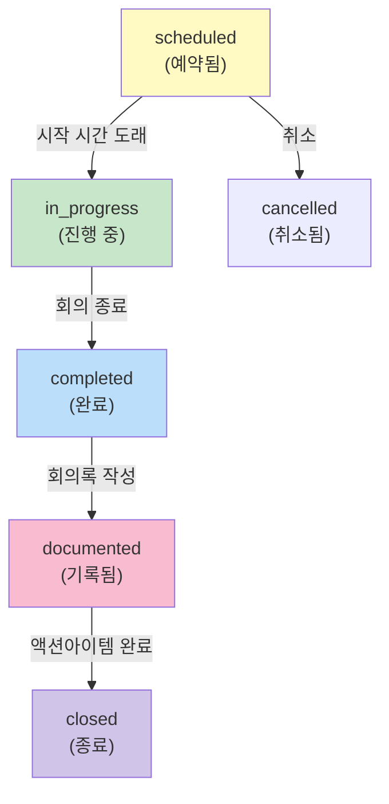
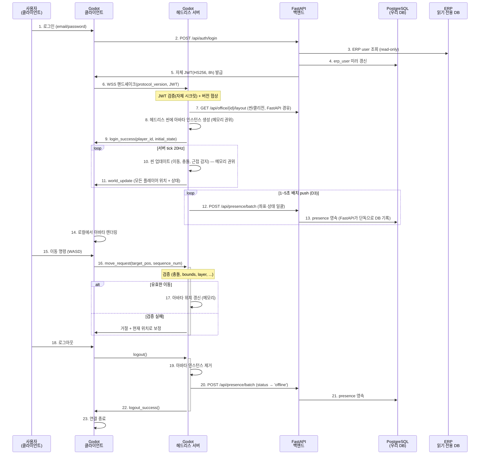

# 09-realtime-collaboration.md

실시간 & 협업 명세

**버전**: v1.1  
**작성일**: 2026-07-02 (최초 2026-07-01)  
**대상**: 가상오피스 운영 플랫폼 개발팀  
**상태**: 확정 반영(00-decisions.md v1.0 정합)

> 본 문서의 모든 결정은 **00-decisions.md(정본)** 를 따른다. 충돌 시 정본이 이긴다. 변경 이력은 하단 참조.

---

## 개요

가상오피스의 핵심은 3D 환경에서 직원들이 자신의 좌석에 아바타로 출현하고, 근접·회의·협업을 통해 업무 성과를 남기는 것이다. 이 문서는 다음을 정의한다:

1. **서버 권위 모델**: Godot 헤드리스 서버가 아바타 이동, 충돌, 근접, 회의실 점유를 검증
2. **프레즌스 상태**: 접속~오프라인까지 **7가지 상태(D13)**와 전이 규칙
3. **근접 상호작용**: 거리·벽·상태에 따른 상호작용 권한 검증
4. **회의 흐름**: LiveKit 기반 화상회의와 회의록 시스템
5. **동기화 프로토콜**: 클라이언트-서버 간 메시지 빈도와 포맷

---

## 1. Godot 헤드리스 서버 권위 모델

### 1.1 아키텍처

```
┌─────────────────────────────────────────────────────────┐
│ Godot 4 Headless Server (렌더러 미로드, 권위)          │
├─────────────────────────────────────────────────────────┤
│                                                         │
│  • 오피스 씬 로드 (콜리전/논리 노드만, 렌더러 미로드)  │
│  • 충돌 메시 활성화 (PhysicsServer3D)                   │
│  • 직원 아바타 인스턴스 (server-side state)           │
│  • 회의실 정점 트리거 ←→ presence.status 갱신          │
│  • 근접 감지 / LOS (PhysicsServer3D Raycast 기반)      │
│                                                         │
└─────────────────────────────────────────────────────────┘
         ↑ WebSocket(WSS) ↓
┌─────────────────────────────────────────────────────────┐
│ 클라이언트 (Godot 4 Native Desktop 전용)               │
├─────────────────────────────────────────────────────────┤
│  • 로컬 아바타 애니메이션 (예측)                       │
│  • UI 렌더링                                             │
│  • 입력 이벤트 전송                                     │
│  • 서버 상태 수신 & 적용                                │
│                                                         │
└─────────────────────────────────────────────────────────┘
```

### 1.2 검증 항목

서버는 모든 **이동 명령(move request)**에 대해 다음을 검증한다:

| # | 검증 항목 | 설명 | 실패 시 |
|---|---------|------|--------|
| 1 | **좌표 유효성** | 새 position(x, y, z)이 오피스 바운드 내인가? | 이동 거절, 현재 위치 유지 |
| 2 | **충돌 감지** | NavMesh/충돌 메시와의 충돌? | 이동 거절 또는 nearest valid position으로 보정 |
| 3 | **층 일치** | 이동 목표가 같은 floor_id인가? | 층 이동 불가(향후 엘리베이터 추가 시 변경) |
| 4 | **속도 제한** | 한 프레임에서의 이동거리가 max_move_speed을 초과? | 속도 정규화 |
| 5 | **권한 검증** | 사용자가 해당 존(team_zone)으로의 접근 권한이 있는가? | 이동 거절 (향후 비공개 구역 추가 시) |
| 6 | **상태 필터링** | 현재 presence.status가 이동 가능한가? (예: offline→불가) | 이동 거절 |
| 7 | **점유 확인** | 고정 좌석(seat.type=fixed)이면 assigned_user_id 일치? | 거절 |
| 8 | **회의실 상태** | 회의실 입장 시 capacity 초과? | 입장 거절 |

### 1.3 권위 모델 원칙

- **서버 상태 = 원본(source of truth)**: 클라이언트는 입력만 전송, 결과는 서버에서 수신한 상태로만 반영.
- **예측 애니메이션**: 네트워크 지연을 숨기기 위해 클라이언트가 로컬로 아바타를 "미리" 이동시킬 수 있으나, 서버 상태와 불일치하면 `서버 상태로 복귀`.
- **결정론적 동기화**: WebSocket(WSS, TCP)의 순서·신뢰성 보장을 통해 모든 클라이언트가 같은 이벤트 순서를 본다. 재접속 시 `sequence_num` 기반 스냅샷 재수신으로 상태를 복구한다(§5.3). (D1)

---

## 2. 프레즌스 상태 모델

### 2.1 상태 정의

`presence` 테이블의 `status` 필드는 다음 **7가지 상태(D13)** 중 하나:

| 상태 | 레이블 | 설명 | 자동/수동 | KPI 영향 |
|-----|-------|------|---------|---------|
| **offline** | 오프라인 | 클라이언트 로그아웃 또는 연결 끊김 | 자동 | - |
| **online** | 접속 중 | 3D 클라이언트 로그인 → 아바타 오피스 입장 | 자동 | ○ |
| **working** | 업무 중 | 지정 좌석/팀 구역 도착 | 자동 | ○ |
| **meeting** | 회의 중 | 회의실 입장 | 자동 | ○ |
| **focus** | 집중 모드 | 사용자가 집중모드 토글 ON | 수동 | ○ |
| **away** | 자리 비움 | 5분 무입력 → 자동 away | 자동 | - |
| **external** | 외근 중 | 협력사·고객 방문/출장 등 오피스 외부 (**수동 전환**) | 수동 | - |

- **삭제된 상태**: GPS 기반 `trip_moving`·`trip_arrived`·`returning`은 폐기(데스크톱에 GPS 없음, D13). 출장·외근은 `external` 단일 상태로 **수동 전환**한다.
- **자동/수동**: 서버가 자동으로 상태를 전이하지만(`away` 등), 사용자는 언제든 수동으로 다른 상태로 변경 가능 (예: away → online).
- **KPI 영향**: online, working, meeting, focus만 의미 있는 협업 신호로 인정. away, external, offline은 협업 기록 미포함.

**[OQ3 결정] ERP attendances(read-only) vs 3D presence(우리 소유) 분리 원칙**:
- **공식 출퇴근 (ERP attendances)**: ERP가 원본(source of truth), 우리는 read-only로 읽기만 수행. v1에서 우리 플랫폼은 `attendance` 테이블(check_in/out)을 쓰지 않음.
- **3D 프레즌스 (우리 소유)**: 위 **7가지 상태**로 정의. 트리거는 사용자 행동 기반(로그인→online, 좌석 도착→working, 회의실 입장→meeting, 5분 무입력→away, 집중모드→focus, 외근/출장 수동→external, 로그아웃→offline).
- **3D 화면 표시**: "ERP상 오늘 check_in된 직원"을 read-only로 병기하여 공식 출퇴근 현황 반영.
- **장애 격리**: 가상오피스 장애가 근태/업무 데이터에 영향 없음 (우리는 read-only).
- **옵션 (v1.x 이후)**: "3D 로그인 시 ERP check_in 자동" 훅 추가 가능하되, ERP가 원본이고 수동 체크인 폴백 유지.

### 2.2 상태 전이 다이어그램

```mermaid
graph TD
    A["offline<br/>(초기)"] -->|로그인| B["online"]
    B -->|좌석/팀 구역 도착| W["working"]
    W -->|구역 이탈| B
    W -->|회의실 입장| D["meeting"]
    B -->|자리 비움 5분| C["away"]
    W -->|자리 비움 5분| C
    B -->|집중모드 토글| E["focus"]
    W -->|집중모드 토글| E
    B -->|외근/출장 수동| G["external"]
    W -->|외근/출장 수동| G

    C -->|입력/클릭| B
    D -->|회의실 퇴장| W
    E -->|집중모드 종료| B
    G -->|복귀(수동)| B

    B -->|로그아웃| A
    W -->|로그아웃| A
    C -->|로그아웃| A
    D -->|로그아웃| A
    E -->|로그아웃| A
    G -->|로그아웃| A
```

### 2.3 상태 갱신 프로토콜

**서버 측면:**
- 각 클라이언트 세션마다 `last_activity_at` 타임스탬프 기록.
- **5분(설정 가능 기본값)** 이상 입력이 없으면 `away` 상태로 자동 전이 (D13).
- 사용자가 명시적으로 `focus`/`external` 설정 시 수동 상태 플래그 활성화 → 자동 away 전이 무시.
- 회의실 입장 시 `meeting` 자동 할당, 퇴장 시 이전 상태로 복구.
- **ERP read-only 원칙**: ERP `attendances` 테이블(check_in/out)은 읽기 전용. 우리 플랫폼은 presence 상태 변경 시 ERP attendances를 갱신하지 않음. ERP가 이미 check_in한 직원만 3D 오피스 입장 가능 (선택적 검증, v1에서는 미적용).

**클라이언트 측면:**
- 사용자가 수동으로 상태 버튼 클릭 시 `set_presence_status(status)` RPC 호출.
- 서버가 `presence` 테이블 갱신 후 `presence_updated` 브로드캐스트.
- 모든 클라이언트가 해당 사용자의 상태 UI 업데이트 (예: HUD의 상태 아이콘).

---

## 3. 근접 상호작용 (Proximity Interaction)

### 3.1 개요

두 명 이상의 사용자가 가까워지면 **상호작용 메뉴**가 나타난다. 이 메뉴는 서버 검증을 거친 후에만 작동한다.

### 3.2 상호작용 메뉴

사용자가 다른 직원과 근접할 때 표시되는 메뉴:

| 항목 | 설명 | 조건 | 비고 |
|-----|------|------|------|
| **채팅** | 텍스트 메시지 | 거리 < 5m + 상대 online | 히스토리 저장 안 함 (KPI 미반영) |
| **화상요청** | 1:1 음성/화상 | 거리 < 5m + 상대 회의 중 아님 | LiveKit 1:1 룸 생성 |
| **음성** | 공개 음성 채널 | 거리 < 10m + 층·구역 일치 | 근처 N명이 같은 채널 청취 |
| **프로필** | 직원 정보 조회 | 제약 없음 | 이름, 팀, 위치, 근무상태 |
| **메모** | 개인 메모(찜) | 제약 없음 | 나중에 참고하기 위해 저장 |

**중요**: 채팅·화상요청·음성 상호작용 **횟수 자체는 KPI에 반영하지 않는다** (반감시). 단, 회의 중 발생한 **회의록/결정사항/액션아이템**은 KPI에 포함된다.

### 3.3 서버 검증 (8항목)

상호작용 메뉴가 활성화되기 전에 서버는 다음을 **모두** 검증해야 한다:

```
┌─ Proximity Validation Gate ─────────────────────────┐
│ 1. 같은 company_id?          (테넌트 격리)        │
│ 2. 같은 office_id?           (사무실 일치)        │
│ 3. 같은 floor_id?            (층 일치)            │
│ 4. 거리 < threshold?         (좌표 거리 5m)      │
│ 5. 벽/유리벽 사이가 아닌가?  (LOS 광선 추적)     │
│ 6. 상대 status 허가?         (offline 제외)       │
│ 7. 요청 빈도 제한?           (스팸 방지 cooldown) │
│ 8. 상대 방해금지/집중?       (수신 거절 권한)    │
│                                                  │
│ → 8개 모두 통과 → 메뉴 활성화                   │
│ → 하나라도 실패 → 메뉴 비활성화                 │
└────────────────────────────────────────────────────┘
```

**각 검증 상세:**

| # | 항목 | 구현 로직 | 타임아웃 |
|---|------|---------|--------|
| **1** | company_id | erp_user.company_id 비교 | 즉시 |
| **2** | office_id | presence.office_id 비교 | 즉시 |
| **3** | floor_id | presence.floor_id 비교 | 즉시 |
| **4** | 거리 | sqrt((x1-x2)² + (y1-y2)²) < 5.0 (단위: 미터) | 즉시 |
| **5** | LOS (광선 추적) | **PhysicsServer3D Raycast**: 두 아바타 사이에 벽/유리벽 없음? (헤드리스는 렌더러 미로드이므로 물리 서버 기반) | 계산 < 5ms |
| **6** | 상대 status | presence.status ≠ offline (away, meeting 등은 허용) | 즉시 |
| **7** | cooldown | 같은 대상과의 마지막 상호작용 후 1초 이상 경과 | 즉시 |
| **8** | DND (방해금지) | 상대 user.dnd_enabled & (focus_mode OR external) → 거절 | 즉시 |

### 3.4 클라이언트-서버 흐름 (Sequence)

```mermaid
sequenceDiagram
    participant Client1 as 클라이언트 A<br/>(근처 사용자)
    participant Server as Godot<br/>헤드리스 서버
    participant Client2 as 클라이언트 B<br/>(대상 사용자)

    Client1->>Server: proximity_request(user_b_id, menu_type)
    activate Server
    
    Note over Server: Validation 8항목 수행
    alt 모든 검증 통과
        Server->>Client1: proximity_allowed(user_b_info, menu_items)
        Server->>Client2: proximity_indicator(user_a_name, user_a_distance)
        deactivate Server
        
        Client1->>Client1: 상호작용 메뉴 표시
        Client2->>Client2: "A 사용자가 근처" 표시
        
        alt 사용자 A가 채팅 클릭
            Client1->>Server: send_chat(user_b_id, message)
            Server->>Client2: receive_chat(user_a_id, message)
            Note over Client2: 채팅 히스토리 DB 저장 안 함
        else 사용자 A가 화상요청 클릭
            Client1->>Server: request_call(user_b_id)
            Server->>Client2: incoming_call(user_a_id)
            Client2->>Server: accept_call()
            Server->>Server: LiveKit 1:1 방 생성
            Server->>Client1: call_accepted(livekit_room_url)
            Server->>Client2: call_accepted(livekit_room_url)
        end
    else 검증 실패 (예: 벽 사이, offline)
        Server->>Client1: proximity_denied(reason)
        deactivate Server
        Client1->>Client1: 메뉴 비활성화
    end
```

---

## 4. 회의 흐름 (Meeting Flow)

### 4.1 전체 라이프사이클

```
┌─────────────────────────────────────────────────────────────┐
│ 회의 라이프사이클                                           │
├─────────────────────────────────────────────────────────────┤
│                                                             │
│ (1) 회의실 선택      (2) 회의 시작      (3) 참여자 초대    │
│     ↓                    ↓                  ↓               │
│  room 선택        meeting 레코드        meeting_            │
│                   생성 (status=          participant        │
│                   scheduled)            생성 + 알림         │
│                                         전송                │
│         (4) 참여자 수락  (5) 입장  (6) 실시간 회의        │
│              ↓              ↓          ↓                   │
│         presence.status  명시적    LiveKit                 │
│         → meeting        입장확인   media                  │
│         (입장 후)        클릭 &     stream                  │
│                          presence                          │
│                          갱신 (D24)                        │
│                                                             │
│         (7) 회의 종료     (8) 회의록 생성  (9) 액션 추적    │
│              ↓                  ↓              ↓            │
│         status →         meeting_minute   action_item      │
│         이전 상태        + AI 요약         생성             │
│                          (선택)                             │
│                                                             │
└─────────────────────────────────────────────────────────────┘
```

### 4.2 회의 상태 머신



### 4.3 회의 입장 프로토콜 (**자동 연결 금지**)

**원칙 (D24)**: 사용자가 회의실에 물리적으로 접근했다고 해서 자동으로 LiveKit 방에 입장하면 안 된다. 접근은 입장 다이얼로그를 띄울 뿐이고, **명시적 [입장하기] 클릭 후에만** LiveKit 토큰이 발급된다. LiveKit 룸 생성·토큰 발급은 **FastAPI 경유로 단일화**한다(클라이언트/게임서버 직접 생성 금지). 이 흐름은 **02-trd-architecture.md §5.3 회의 시퀀스와 정합**한다.

**흐름**:

1. **사용자가 회의실 바운드 진입**
   - 서버: room entry trigger 감지 → meeting_participant 조회
   - 서버: 해당 사용자가 meeting의 예상 참여자인가 확인

2. **회의 참여 권한 확인**
   - 서버: "이 사람이 이 회의에 초대되었는가?" ✓
   - 미초대: 방에서 추출 또는 입장 거절 알림

3. **사용자에게 "입장" 대화상자 표시**
   ```
   ┌─ 회의실: 분기 계획 회의 ────────┐
   │ 호스트: 김영희                 │
   │ 참여자: 이순신, 세종대왕, ...  │
   │                              │
   │ [입장하기]  [나가기]          │
   └──────────────────────────────┘
   ```

4. **사용자가 명시적으로 "입장하기" 클릭**
   - 클라이언트: `join_meeting_room(meeting_id)` RPC
   - 서버: LiveKit 방 존재 확인, 없으면 생성
   - 서버: meeting 상태 → `in_progress`, presence.status → `meeting`
   - 서버: 클라이언트에 LiveKit 방 URL + 인증 토큰 전달

5. **LiveKit 클라이언트 초기화**
   - 클라이언트: LiveKit SDK 초기화 (카메라/마이크 권한 요청)
   - 클라이언트: 방 입장 (media stream 활성화)
   - 서버: 입장 이벤트 브로드캐스트 (다른 참여자에게 "A 사용자 입장" 알림)

6. **회의 진행**
   - LiveKit: 미디어 스트림 관리 (P2P 또는 SFU)
   - 우리 플랫폼: 회의 타이머, 참여자 목록, 좌석 폐쇄(optional)

7. **회의 종료 및 퇴장**
   - 호스트 또는 마지막 참여자: 방 종료 시그널
   - 서버: meeting.status → `completed`, presence.status → 이전 상태 복구
   - 클라이언트: 아바타가 회의실에서 자동 퇴실(?)  or 사용자가 수동으로 나가기 클릭

**STT 자동 회의록 (D5, 정식 포함)**
- LiveKit Egress(트랙별 오디오) → STT(한국어 화자분리) → 회의록 초안 자동 생성 → 호스트/참석자 검토·확정.
- 컴플라이언스: 회의 시작 시 **전원 고지 배너 + 참여 의사 확인**(거부 시 오디오 미수집), 녹음 원본 90일 보존 (D20(b)). 외부 AI 전송 시 실명→사번 가명화 (D20(d)).

**선택적 기능** (이번 버전 미포함, 향후):
- 회의실 "잠금" (호스트만 발언)
- 실시간 자막 오버레이(회의록 초안과 별개)

### 4.4 회의록 & 액션아이템

회의 종료 후:

| 단계 | 주체 | 액션 | 저장처 |
|-----|------|------|--------|
| 1 | **STT 파이프라인** | LiveKit Egress→STT(화자분리)로 **회의록 초안 자동 생성**(발화자·발언 타임라인) | `meeting_minute.stt_draft` |
| 2 | (선택) AI | Claude API로 요약·결정사항·액션아이템 후보 추출 | `meeting_minute.ai_summary` |
| 3 | 호스트/참석자 | STT 초안 **검토·수정·확정**. STT 실패 시 **수동 입력이 폴백** | `meeting_minute.notes` |
| 4 | 참여자 | 액션아이템 추가 (담당자, 마감일, 설명) | `action_item` 레코드 |
| 5 | 호스트/관리자 | 회의록 공식 발행 (status=`published`) | `meeting_minute.status` |
| 6 | 담당자 | 액션아이템 진행 (상태: todo→in_progress→completed) | `action_item.status` |

- **누락률 기준(D22)**: 자동 초안의 발화자·액션아이템 누락률 < 5%(테스트 회의 N회 대비 수동 전사 대조로 측정).

**KPI 기여도**:
- `meeting_minute` 1건 → 협업 신호 O
- `action_item` 1건 → 결과물 신호 O (담당자가 완료했을 때)

---

## 5. 동기화 프로토콜 & 빈도

### 5.1 메시지 타입 분류

| 우선순위 | 타입 | 빈도 | 신뢰성 | 예시 |
|---------|-----|-----|--------|------|
| **높음** | 제어 메시지 (control) | 즉시 | Reliable | 이동 명령, 상태 변경, 회의 시작 |
| **중간** | 상태 갱신 (state_sync) | **20Hz(서버 tick, D22)** | Reliable | presence 위치, 애니메이션 상태 |
| **낮음** | 시각 효과 (visual) | 20Hz | Reliable | 파티클, 에모션, 텍스트 플로팅 |

- 전송 계층은 **WSS(TCP) 단일**이므로 모든 메시지가 순서·신뢰성을 보장받는다(별도 unreliable 채널 없음).

### 5.2 네트워크 계층 선택

**WebSocket(WSS, TCP 기반) — 확정 (D1)**:
- 모든 메시지 순서 보장 및 신뢰성 확보 (별도 unreliable 채널 없음)
- TLS 내장 → 재택 근무자의 방화벽/프록시 통과 용이, 사내 PKI 인증서 사용
- 재접속 시 `sequence_num` 기반 스냅샷 재수신으로 상태 복구

**폐기**: ENet(UDP) 및 "ENet TCP"(존재하지 않는 조합). UDP의 미세 지연 이점보다 재택 접속성·TLS 내장·구현 단순성을 우선.

현재 선택: **WebSocket(WSS)** — OQ4 확정 종결

### 5.3 위치 동기화 상세

**핸드셰이크(첫 메시지, D1/D4)**:
```json
{
  "type": "hello",
  "protocol_version": 3,
  "jwt": "<FastAPI 발급 자체 JWT>"
}
```
- 서버가 `protocol_version`을 협상한다. 미지원이면 `{"type":"reject","reason":"protocol_mismatch","min":2,"max":3}` 후 소켓 종료(업데이트 안내).

**클라이언트 → 서버**:
```json
{
  "type": "move_request",
  "player_id": 42,
  "target_pos": [10.5, 0.0, 20.3],
  "floor_id": 1,
  "sequence_num": 1234
}
```

**서버 → 모든 클라이언트** (서버 tick 20Hz = 50ms 간격):
```json
{
  "type": "player_update",
  "protocol_version": 3,
  "server_seq": 88012,
  "updates": [
    {
      "player_id": 42,
      "pos": [10.5, 0.1, 20.3],
      "rotation": [0, 0.7071, 0, 0.7071],
      "animation": "walk",
      "status": "online"
    },
    {
      "player_id": 43,
      "pos": [12.0, 0.0, 22.1],
      "rotation": [0, 0, 0, 1],
      "animation": "idle",
      "status": "meeting"
    }
  ],
  "timestamp": 1719850000123
}
```

**재접속 규칙 (WSS 순단/크래시 복구)**:
- 클라이언트는 마지막으로 수신한 `server_seq`를 기억한다. 재접속 시 `{"type":"resume","last_server_seq":88012,"jwt":"<...>"}`로 요청.
- 서버는 인메모리 상태가 유효하면 델타를, 게임서버 크래시 후 재기동 등으로 델타가 불가능하면 **전체 스냅샷**(`{"type":"snapshot","server_seq":N,"players":[...]}`)을 전송한다. 클라이언트는 스냅샷으로 로컬 상태를 재구축한다.

### 5.4 동기화 시퀀스 다이어그램 (입장~퇴장)



### 5.5 상태 불일치 해결 (Reconciliation)

**상황**: 클라이언트가 예측한 위치와 서버 상태가 불일치하면?

```
클라이언트 예측:     [10.0, 0, 20.0] → 벽을 뚫음 (로컬에서는 충돌 감지 못함)
서버 실제 상태:      [10.0, 0, 19.5] (벽 때문에 보정됨)

→ 클라이언트가 서버 상태를 수신하면 "순간이동" 처럼 보일 수 있음
→ 해결: 클라이언트가 서버 상태와 현재 위치 차이 > threshold(0.5m)이면
   Lerp(current, server_state, 0.2)로 부드럽게 보정 (5프레임에 걸쳐)
```

---

## 6. KPI 반영 규칙 (재확인)

이 절에서 정의한 모든 기능 중 **KPI에 반영되는 것과 반영되지 않는 것**:

| 기능 | KPI 영향 | 사유 |
|-----|---------|------|
| **근접 상호작용 (채팅, 화상요청)** | ✗ 미반영 | 횟수만으로는 협업 품질 측정 불가(반감시) |
| **음성 채널** | ✗ 미반영 | 통화 시간 측정 복잡, 반감시 위험 |
| **회의 참석** | ○ 반영 | 회의에서 나온 **결정사항/액션아이템**이 핵심 |
| **회의록 & 결정사항** | ○ 반영 | 협업의 산출물 (meeting_minute 1건) |
| **액션아이템 생성 & 완료** | ○ 반영 | 결과물의 추적성 (action_item 완료율) |
| **프로필 조회, 메모** | ✗ 미반영 | 업무와 무관한 탐색 행동 |
| **출장/외근 기록** | △ 보조 | 근태 정보로만 사용, 협업 평가 제외 |

---

## 7. 향후 고려사항 (Won't in v3.2, Future)

- [ ] **모바일 알림**: 화상 요청/회의 초대 → 모바일 푸시 (Out of scope)
- [ ] **녹화 & 자동 요약**: LiveKit 클라우드 레코딩 + Gemini 요약
- [ ] **언어 자동 감지**: 회의록 다국어 지원
- [ ] **엘리베이터**: floor 간 이동 애니메이션
- [ ] **비공개 구역**: 권한 기반 접근 제어 (leader-only 미팅룸 등)
- [ ] **고급 근접 센싱**: 아바타가 같은 테이블에 앉을 때만 상호작용 허용
- [ ] **모바일 Godot 클라이언트**: 웹 WASM export (향후 B2B 때 Three.js 경량 뷰어)

---

## Loop Metadata

### Upstream documents referenced
- **10-roadmap.md**: 제품 로드맵, v3.2 피처 정의
- **03-erp-integration.md**: ERP 동기화, erp_user, 읽기/쓰기 엔드포인트
- **04-data-model.md**: org_group, team_zone, seat, presence 엔티티
- **05-office-layout-schema.md**: office_layout JSON, room, floor, coords 정의

### Downstream documents affected
- **06-screens.md**: 근접 메뉴 UI, 회의실 입장 대화상자, presence 상태 인디케이터
- **07-3d-visual-asset-pipeline.md**: Godot 씬 구조, 아바타 제어, 이동 애니메이션, LiveKit 통합
- **08-kpi-logic.md**: meeting, meeting_minute, action_item → KPI 점수 계산

### Open questions
1. **LOS (광선 추적) 구현**: **PhysicsServer3D Raycast 기반 확정**(헤드리스 렌더러 미로드). 유리벽 레이어 마스크 설계 및 성능은 스파이크 S3(20명 부하)에서 측정.
2. **근접 거리 임계값**: 5m이 UX상 최적인가? 사무실 규모에 따라 조정 필요.
3. **[OQ3 확정] 상태 away 자동 전이 시간 = 5분**(설정 가능 기본값, D13). "미정의/N분" 표기 폐기. 운영 중 문화에 맞춰 기본값 조정 가능.
4. **[OQ5 RESOLVED] LiveKit 호스팅**: Self-host 결정(온프렘 VM 또는 사내 클라우드 + Docker Compose). 단일 SFU 노드로 충분하며, 재택/하이브리드는 사내 VPN 또는 TURN-over-TLS(443)로 접속. 배제: SaaS(민감 미디어 외부 경유), 신규 AWS(데이터 주권 우선).
5. **회의록 AI 요약**: Claude 기본(Gemini 대안). 비용과 응답 시간 평가 후 선택.

### Assumptions
- 사내 단일 테넌트(company_id) 배포이므로 멀티테넌트 회의 공유 로직 미포함.
- ERP와 우리 플랫폼이 같은 VPN 내에 있어 네트워크 지연 < 50ms 가정.
- Godot 헤드리스 서버가 씬 물리엔진(PhysicsServer3D, 렌더러 미로드)을 풀로 실행 가능. "CPU 리소스 충분" 가정은 **스파이크 S3(GDScript 헤드리스 20명 시뮬레이션 CPU/메모리 측정)로 검증**한다.
- **[OQ3 결정]**: ERP `attendances` 테이블과 우리 3D `presence` 상태는 완전히 분리. ERP가 원본(check_in/out), 우리는 read-only로 읽기만 수행. v1에서 우리 플랫폼은 attendance 테이블을 쓰지 않음. 3D 프레즌스는 사용자 행동(로그인, 좌석 도착, 회의실 입장 등) 기반 자동 전이.
- **[OQ5 결정]**: LiveKit은 self-host (온프렘 VM 또는 사내 클라우드 계정에 Docker Compose로 배포). 재택/외근자는 사내 VPN 또는 TURN-over-TLS(443 공개 엔드포인트)로 접속. 단일 SFU 노드로 충분하므로 오토스케일 불필요 → 1인 운영 부담 낮음. 배제: LiveKit SaaS(민감 미디어 외부 경유, 구독비), 신규 AWS(데이터 주권).
- 모든 클라이언트가 Godot 4.x 네이티브 데스크톱 클라이언트 사용(웹 WASM export는 품질 이유로 제외).

### Validation criteria
- [ ] Godot 헤드리스 서버가 **20명 아바타(도그푸딩 검증 규모, D22)** + 1회의실 동시 운영 시 서버 CPU 여유 확인 (스파이크 S3).
- [ ] 근접 상호작용 메뉴 활성화 지연 < 200ms.
- [ ] 아바타 동기화 E2E(입력→원격 표시) **p95 < 500ms** (WSS 기반, 서버 tick 20Hz — D22).
- [ ] 회의 입장부터 첫 미디어 수신까지 < 2초.
- [ ] LiveKit 1:1 통화 지연 < 500ms (P2P 또는 SFU).
- [ ] 회의록 생성 → AI 요약 완료 < 30초.

### Risks
- **서버 권위 모델의 CPU 병목**: 모든 이동 명령을 검증하므로 동시 접속자 수 증가 시 병목 가능. → 차후 서버 확장 또는 메시지 배치 처리 필요.
- **LiveKit 자체 호스트의 운영 복잡도**: 클라우드 서비스(Twilio LiveKit Cloud) 대비 관리 부담 높음. → 팀 역량 확보 필수.
- **ERP 동기화 지연**: ERP read-only 접근 중 쿼리가 느리면 presence 갱신이 지연될 수 있음. → 캐싱 전략 수립 필요.
- **모바일 클라이언트 부재**: 사내에서도 모바일 사용자가 있을 경우 불만족. → 완성 후 별도 모바일 앱 검토(웹 WASM은 품질 이유로 후순위).

---

## 변경 이력

| 버전 | 일자 | 변경 내용 |
|------|------|-----------|
| v1.0 | 2026-07-01 | 최초 작성 |
| v1.1 | 2026-07-02 | 00-decisions.md v1.0 정합 반영 — D1(WSS 확정, "현재 선택 ENet" 폐기, 헤드리스 렌더러 미로드·Web WASM 제거, 재접속 sequence_num 스냅샷), D3(동기화 시퀀스 FastAPI 경유·presence 메모리 권위+1~5초 배치 push), D4(login(email,password)→JWT 핸드셰이크·protocol_version), D5(STT 정식 포함·회의록 STT 자동 초안→검토 확정), D13(상태 10종→7종·GPS 상태 삭제·external 수동·전이 다이어그램 working 포함 재작성·away 5분 확정), D22(p95<500ms·tick 20Hz·검증 20명), D24(자동 연결 금지 원칙 유지+02 정합 명시), LOS PhysicsServer3D Raycast 명시, CPU 가정 스파이크 S3 참조 |
