# 10-roadmap.md

> ✅ **Phase 편성 정본 = 본 문서 "⚠️ D27 재산정" 섹션(§D27) + `16-render-spike-and-roadmap.md` §Part B(P0~P7).** 구 D26(WorkAdventure/45·58주) 헤더·간트는 폐기되었으며, 하단 Gantt/캘린더는 참고용 잔재(⚠️D26 폐기 표기)일 뿐 현행이 아니다. 주 단위는 P0 스파이크 후 확정한다(억지 숫자 금지).

## 개발 로드맵: Virtual Office 운영 플랫폼

**프로젝트**: 가상오피스 운영 플랫폼 (vituraloffice_new)  
**버전**: v3.1  
**목표**: 완성 — R3F + Blender Cycles(오프라인 렌더) 깊이합성 가상오피스 임베드 + Colyseus 이동서버 + STT·KPI·ERP 통합 (단일 통합 웹앱, 단일 세션 JWT)  
**첫 사용**: 사내 도그푸딩 (단일 조직, 단일 company_id 기준)  
**개발 규모**: 1인 개발 + AI 협업, 최고 품질 우선  
**최종 업데이트**: 2026-07-09 (D27 재산정 정합 정리 — 헤더·간트를 P0~P7 기준으로 갱신)  
**Phase 편성 정본**: 본 문서 §D27 + `16-render-spike-and-roadmap.md` §Part B (P0~P7)  
**정본 기준**: `00-decisions.md` (§H D27, D1~D26 중 유효분) + 14/15/16 — 충돌 시 정본이 우선

> **변경 요약 (v2.0, 2026-07-02)**: 전체 일정을 **58주 기준**으로 재산정(D6, 시작 2026-07-06 → 완성 **2027-08-16, 2027년 하반기**), "26주/2026-12-28" 표기 전면 폐기. Phase 0(계약+스파이크 S1~S4) 신설, Phase 5에 회의록 STT 파이프라인(D5) 포함, 실시간 프로토콜 WebSocket(WSS) 확정(D1), presence 7종(D13)·seat.status enum·ERP 엔드포인트(`POST /api/kpi-results`) 통일, EOD 순환 모순 해소(D17), 3D 미리보기 제거·데스크톱 draft 모드로 대체(D11), 성능 수치 100명 설계(D22).
>
> **변경 요약 (v3.0, 2026-07-06)**: **D26** WorkAdventure self-host 전환 반영. Phase 1~4를 WorkAdventure 연동 구조(각 4~6주)로 재편. Godot 3D 클라이언트·헤드리스 서버 노선 보류. Phase 0 스파이크 S1·S3·S4 취소, S2(STT) 유지. Phase 5~7(STT·KPI·고도화) 유지.
>
> **변경 요약 (v3.1, 2026-07-09)**: **D27 정합 정리.** §D27 재산정 섹션이 이미 정본이었으나 헤더 메타·하단 Gantt/캘린더가 구 D26(WA/45·58주)에 머물러 자기모순 상태였던 것을 해소. ① 헤더 목표·최종수정일·정본기준을 D27(R3F+Blender Cycles+Colyseus, 단일 세션 JWT) 기준으로 갱신하고 "Phase 편성 정본 = §D27 + 16 §Part B" 명시. ② 하단 Gantt/캘린더·의존 그래프를 P0~P7로 재작성하되 주 단위는 미확정(⚠️D26 폐기, 스파이크 후 확정)으로 표기. ③ 본문에 남은 Godot 산출물(godot_client/*.gd·"Godot 클라이언트 빌드"·S1~S4)·구 Phase 0(S2만) 잔재 정리, Phase 번호를 P0~P7로 통일. **§D27 섹션 본문은 정본으로 보존.** P0 깊이합성 스파이크 = PASS(2026-07-08).

---

## ⚠️ D27 재산정 (2026-07-08) — D26 Phase 편성 전면 대체

> **정본 참조**: `00-decisions.md` §H (D27), `docs/planning/16-render-spike-and-roadmap.md` §Part B (P0~P7 재구축 로드맵)

### D27 결정 요약

2026-07-08 사용자 확정. 디자인 시안 재확인 결과 WorkAdventure(2D 픽셀·별도 앱·OIDC 이중로그인)는 목표 품질 및 통합성과 불일치 → **D26(WorkAdventure) 전면 폐기, D27로 대체**.

**D27 채택 내용**: 단일 통합 웹앱(시안) 안의 뷰포트로 가상오피스 임베드. **Blender Cycles 오프라인 렌더 배경 + react-three-fiber(R3F) 실시간 아바타 깊이합성** (고정 아이소 2.5D). 실시간 이동서버 = SkyOffice 이식(Colyseus 권위 서버, 20Hz). 단일 세션(콘솔 JWT 그대로 3D 진입, 별도 OIDC 로그인 없음).

### D26 Phase 편성 폐기

아래 v3.0 본문의 Phase 1~4(WorkAdventure 연동 구조)는 **D27로 대체되어 폐기**된다. 각 Phase는 해당 섹션 제목에 "⚠️D27로 대체됨" 표기로 남겨두되, 구현 착수 대상에서 제외한다.

| 구 Phase (D26, 폐기) | 대체 Phase (D27) |
|---|---|
| Phase 0: 계약 & 스파이크 (WA 중심) | P0: 깊이합성 스파이크 — docs/planning/16 §Part A |
| Phase 1: WorkAdventure self-host 구축 | P1: 통합 대시보드 셸 + 기존 백엔드 연결 |
| Phase 2: ERP 동기화 + Presence 연동 (WA) | P2: 렌더 파이프라인 (Blender→R3F) |
| Phase 3: 맵 제너레이터 + 좌석 배치 (TMJ) | P3: Colyseus 이동서버 + 아바타 깊이합성 |
| Phase 4: WorkAdventure 연동 완성 | P4: 프레즌스·좌석 실시간 시각화 |
| Phase 5~7: STT·KPI·고도화 | P5~P7: 대응 Phase 유지 (STT·화상·KPI·하드닝) |

### D27 신규 Phase 편성 (정본: docs/planning/16-render-spike-and-roadmap.md §Part B)

| Phase | 범위 | 핵심 산출물 | 상태 전제 |
|---|---|---|---|
| **P0 스파이크** | 깊이합성 검증 (3~5일) | render-pipeline 최소본 + 판정 리포트 | **PASS (2026-07-08)** |
| **P1 셸+데이터연결** | 통합 대시보드 셸(시안), 기존 백엔드 API 연결(KPI·업무·유저·일정) | 시안 픽셀 재현 UI (3D 뷰포트 자리 = placeholder) | P0 통과 |
| **P2 렌더 파이프라인** | layout JSON→Blender 파라메트릭 씬 빌더, 1개 층 포토리얼 배경 렌더+깊이 | office_bg/depth 자동생성, R3F 뷰포트 배경 표시 | P1 |
| **P3 이동서버** | Colyseus 이식(15번 스펙), 아바타 이동·좌표동기화 20Hz·이동검증, 아바타 GLTF+애니 | 멀티유저 이동, 깊이합성 아바타 | P2 |
| **P4 프레즌스·좌석** | 7종 상태 HUD·미니맵·우패널 실시간, 자율좌석 클릭 점유/반납 | presence 라이브 시각화 (백엔드 존재) | P3 |
| **P5 회의·화상** | D24 명시입장(2m 트리거), LiveKit 오디오/영상, 동의배너, 화상 타일 UI | 회의실 입장→화상 | P4 |
| **P6 STT·AI** | LiveKit Egress→한국어 STT→회의록 초안, AI요약. KPI AI초안(배선됨) | 회의록 자동화 | 외부 리소스 |
| **P7 정리·부하·하드닝** | WA 스택 제거, 다층 렌더, 20명 부하검증, 보안 하드닝, 편집기→재렌더 | 도그푸딩 릴리스 | — |

> **주 단위 확정치**: P0 깊이합성 스파이크 결과 후 확정. 스파이크 실패 시 전략 재검토(대안: 빌보드 스프라이트 아바타 / 부분 실시간 3D). 억지 숫자를 기재하지 않는다.

### D27로 인한 보류·부활 결정 (00-decisions.md §H 참조)

| 결정 | D26 상태 | D27 상태 |
|---|---|---|
| D26 WorkAdventure self-host | 확정 | **폐기** |
| D7 3D 라이팅 | 보류 | **부활(변형)** — 오프라인 Blender Cycles로 구움 |
| D8 에셋 전달 | 보류 | **부활(변형)** — CC0 에셋+Blender 씬, 런타임은 렌더 이미지+경량 GLTF |
| D9 room 파라메트릭 | 보류 | **부활** — layout JSON→Blender 파라메트릭 씬 빌더 |
| D1 WSS | WA 내장 | **SkyOffice/Colyseus 자체** — 20Hz tick·이동검증 구현 |

---

## 📋 로드맵 개요 (D27 정본 — P0~P7)

> **정본**: 본 문서 §D27 재산정 섹션 + `16-render-spike-and-roadmap.md` §Part B. 아래 표는 §D27 "D27 신규 Phase 편성" 표를 요약한 것으로, 상세 산출물·상태 전제는 §D27 표를 따른다. 구 D26 45주 개요(WA self-host·Godot)는 폐기되었다.

| 단계 | 이름 | 주요 산출물 | 예상 기간 | 의존성 |
|------|------|-----------|---------|--------|
| **P0** | 깊이합성 스파이크 | render-pipeline 최소본 + 판정 리포트 (**PASS 2026-07-08**) | 3~5일 | 없음 |
| **P1** ⭐ | **통합 대시보드 셸 + 데이터 연결** | 시안 픽셀 재현 UI + 기존 백엔드 API 연결(KPI·업무·유저·일정), 3D 뷰포트 = placeholder | 미확정 | P0 |
| **P2** ⭐ | **렌더 파이프라인 (Blender→R3F)** | layout JSON→Blender 파라메트릭 씬 빌더, 1개 층 포토리얼 배경+깊이 자동생성, R3F 뷰포트 배경 표시 | 미확정 | P1 |
| **P3** ⭐ | **Colyseus 이동서버 + 아바타 깊이합성** | Colyseus 이식(15번 스펙, 20Hz), 이동·좌표동기화·이동검증, 아바타 GLTF+애니, 깊이합성 | 미확정 | P2 |
| **P4** ⭐ | **프레즌스·좌석 실시간 시각화** | 7종 상태 HUD·미니맵·우패널 실시간, 자율좌석 클릭 점유/반납 | 미확정 | P3 |
| **P5** | 회의·화상 | D24 명시입장(2m 트리거), LiveKit 오디오/영상, 동의배너, 화상 타일 UI | 미확정 | P4 |
| **P6** | STT·AI + KPI | LiveKit Egress→한국어 STT→회의록 초안·AI요약, KPI 산출 + AI 초안(서술) + ERP push | 미확정 | P5 + ERP dev 브랜치 |
| **P7** | 정리·부하·하드닝 | WA 스택 제거, 다층 렌더, 20명 부하검증, 보안 하드닝, 편집기→재렌더, 고도화 기능 | 미확정 | P6 |

> **주 단위**: **P0 깊이합성 스파이크(PASS) 결과를 바탕으로 P1 이후 주 단위를 확정한다.** 억지 숫자를 기재하지 않는다. 스파이크 실패 대비 대안(빌보드 스프라이트 아바타 / 부분 실시간 3D)은 §D27 참조.

> **핵심 원칙**: 각 단계는 **독립 데모 가능** (이전 단계 완료 후 즉시 테스트/검증 가능). 순차 빌드이며 각 단계마다 사용자 가치 제공. 1인 개발이므로 Phase 병렬화는 하지 않고 **순차 원칙**을 따른다(13-risks R7).

---

## Phase 0: 계약 & 스파이크 (F절) ⚠️D27로 대체됨

### 목표
- API/데이터/ERP 연동 계약 확정, 통합 테스트 골격, 마이그레이션 전략 수립 (상세는 12-tasks.md Phase 0)
- **선행 기술 리스크를 스파이크(PoC)로 조기 검증** — 00-decisions.md F절 S1~S4

### 범위
#### 계약 설계
- FastAPI 연동 계약(OIDC provider·presence 수집·Room API 브리지) — 실시간 동기화 프로토콜은 WA 내장 WSS 사용(D1·D26), 자체 프로토콜 설계 없음
- 관리·업무·KPI REST 계약, 데이터 모델/ERD, ERP 연동 계약(`POST /api/kpi-results`)
- TMJ 맵 스키마·맵 제너레이터 규약(구 office_layout JSON Schema·3D 씬 구조 대체, D26), 테스트 프레임워크·CI 초안

#### 스파이크 (실패 시 폴백 확정)
> ⚠️ **D26 갱신**: S1(Godot↔LiveKit)·S3(헤드리스 서버)·S4(라이팅 룩) 취소. S2(STT 파이프라인)만 유지.

| 순번 | 스파이크 | 검증 내용 | 실패 시 폴백 | D26 상태 |
|------|---------|----------|-------------|---------|
| ~~S1~~ | ~~Godot ↔ LiveKit PoC~~ | ~~GDScript + WebRTC GDExtension으로 LiveKit 룸 접속·오디오/비디오 수신 검증~~ | ~~회의 화면만 임베디드 브라우저 분리~~ | **취소** |
| **S2** | STT 파이프라인 PoC | LiveKit Egress → STT(화자분리) → 회의록 초안 품질 측정(한국어) | 수동 회의록 + AI 요약으로 격하(PRD 기준 하향 재협의) | **유지** |
| ~~S3~~ | ~~헤드리스 서버 부하~~ | ~~GDScript 헤드리스 + PhysicsServer3D, 20명 시뮬레이션~~ | ~~tick 하향(10Hz), 물리 간소화~~ | **취소** |
| ~~S4~~ | ~~동적 씬 라이팅 룩 검증~~ | ~~D7 조합(실시간광+ReflectionProbe+SSAO)으로 골든 샘플 룩 확인~~ | ~~SDFGI 옵션 기본화 + 기준 사양 상향 재협의~~ | **취소** |

### 산출물
```
docs/api/           (realtime-server-api.yaml, management-api.yaml)
docs/data-model/    (erd.md, office-layout-schema.json)
docs/erp-integration/ (contract.md, service-account-policy.md)
spikes/             (s1_livekit/, s2_stt/, s3_headless_load/, s4_lighting/) — 각 PoC 결과 리포트 포함
backend/tests/conftest.py, .github/workflows/test-phase.yaml
```

### 의존성
- 없음 (초기 단계)

### 수용 기준
- [ ] 모든 계약(OpenAPI/JSON Schema/ERP) 초안 작성·검토 완료
- [ ] S1: Godot에서 LiveKit 룸 오디오/비디오 수신 성공(또는 폴백 확정)
- [ ] S2: 한국어 회의록 초안 발화자·액션아이템 누락률 측정치 확보(수동 전사 대조, D22)
- [ ] S3: 20명 시뮬레이션에서 tick 20Hz 유지 시 CPU/메모리 여유 확인(또는 tick 하향 확정)
- [ ] S4: 동적 씬 골든 샘플 룩 승인(또는 SDFGI 기본화 확정)

### 독립 데모
**"스파이크 리포트 4종"** — 각 PoC의 성공/폴백 결정과 근거 수치를 문서화하여 Phase 1 이후 기술 선택의 근거로 사용.

---

## Phase 1: WorkAdventure self-host 구축 ⭐D26 ⚠️D27로 대체됨

> **D26 전환**: 기존 "프리미엄 골든 샘플 3D (Godot 클라이언트)" 단계를 대체.

### 목표
- WorkAdventure self-host 스택(play/back/map-storage/redis/LiveKit/coturn) 온프렘 배포 완료
- FastAPI OIDC 브리지로 ERP 사용자가 WorkAdventure에 로그인 (D4 자체 JWT와 공존)
- 기본 TMJ 맵(샘플 오피스) 배포 및 멀티유저 입장 검증

### 범위

#### WorkAdventure 스택 배포 (D21-r: Docker Compose, Caddy, Let's Encrypt)
- `workadventure/play` — 클라이언트 서빙 + Room API
- `workadventure/back` — 게임 상태 서버(WebSocket 권위)
- `workadventure/map-storage` — TMJ 맵 파일 서버
- `redis` — WA back 상태 캐시
- `livekit` — 화상회의 SFU (WA 네이티브 통합)
- `coturn` — TURN 릴레이(TURN-TLS 443 폴백, VPN 없음)

#### OIDC 연동 (D4 공존)
- `backend/app/integrations/workadventure/oidc.py` — FastAPI를 OIDC Provider로 노출
  - Authorization Code Flow: `/oauth/authorize`, `/oauth/token`, `/oauth/userinfo`, `/.well-known/openid-configuration`
  - ERP 사용자(erp_user) → OIDC 클레임 매핑(sub=erp_user.id, name, email, groups)
  - D4 자체 JWT(HS256)와 공존: OIDC 토큰은 WA 전용, 내부 API는 D4 JWT 유지

#### 샘플 맵 배포
- 소규모 TMJ 맵(로비 + 오픈 좌석 20개) 수동 제작 → map-storage 배포
- 기본 타일셋(캐릭터 이동, 회의실 zone) 검증

### 산출물
```
docker-compose.yml        (WA 스택 통합, Lane B)
.env.example              (WA 환경변수 포함)
backend/app/integrations/workadventure/oidc.py
backend/tests/test_wa_oidc.py
maps/sample_office.tmj    (샘플 맵)
docs/deployment/onprem-docker.md  (WA 섹션 추가, Lane B)
```

### 의존성
- Phase 0 완료 (계약 + S2 STT PoC 진행)

### 수용 기준
- [ ] `docker compose config` 문법 검증 통과, 모든 WA 서비스 정의 포함
- [ ] OIDC Discovery endpoint(`/.well-known/openid-configuration`) 정상 응답
- [ ] ERP 사용자 계정으로 WorkAdventure 로그인 성공 (OIDC 인증 흐름)
- [ ] 샘플 맵에서 2명 이상 동시 아바타 이동 확인

### 독립 데모
**"ERP 계정으로 WorkAdventure 사무실 입장"** — OIDC 로그인 + 샘플 맵 멀티유저 데모.

---

## Phase 2: ERP 동기화 + Presence 연동 ⭐D26 ⚠️D27로 대체됨

> **D26 전환**: 기존 "ERP 동기화 + 좌석/구역 (Godot 기반)" 단계를 대체.

### 목표
- ERP 직원·조직·근태 동기화 (D18) — 구조는 이전과 동일, Godot 의존성 제거
- D13 presence 7종을 WorkAdventure 상태/이벤트와 매핑
- scripting API로 focus/external 상태 WorkAdventure 변수 반영

### 범위

#### ERP 동기화 (D18, 기존 스펙 유지)
- erp_user, org_group, team_zone, seat, attendance_cache 동기화
- 매시간 증분 + 매일 00:00 KST 전체 대사 (APScheduler)
- soft-delete, 알림 채널 연동

#### Presence 매핑 (D13 → WorkAdventure)
- `backend/app/integrations/workadventure/presence.py`

| D13 Status | WorkAdventure 표현 방식 |
|-----------|------------------------|
| offline | WA 연결 끊김 (disconnect event) |
| online | WA 연결 + 초기 변수 `status=online` |
| working | WA zone 진입 (team 구역) → `status=working` |
| meeting | WA meeting zone 진입 → `status=meeting` |
| focus | scripting API 변수 `focusMode=true` → `status=focus` |
| away | WA idle timer(5분) → `status=away` |
| external | scripting API 변수 `external=true` → `status=external` (수동 전환) |

- FastAPI WebSocket push → WA scripting API (Room API 경유)
- presence DB 배치 push (1~5초 주기, D3 정신 유지)

#### 아바타 시작위치
- erp_user → seat.coords → WA spawn position (TMJ 맵 좌표 변환)

### 산출물
```
backend/app/integrations/workadventure/presence.py
backend/app/services/erp_sync.py  (WA 의존성 제거 버전)
backend/tests/test_wa_presence.py
```

### 의존성
- Phase 1 완료

### 수용 기준
- [ ] presence 7종 상태 전환이 WA 클라이언트에 실시간 반영 (1~5초 이내)
- [ ] focus/external 상태가 scripting API 변수로 WA에 노출
- [ ] ERP 동기화 배치 정상 동작 (매시간 증분, 00:00 KST 전체 대사)
- [ ] pytest `test_wa_presence.py` 통과

### 독립 데모
**"ERP 팀 구조가 WA 맵에 반영되고 presence 상태가 실시간 동기화"**

---

## Phase 3: 맵 제너레이터 + 좌석 배치 ⭐D26 ⚠️D27로 대체됨

> **D26 전환**: 기존 "사무실 배치 편집기 (Konva.js 2D 전용)" 단계를 대체.

### 목표
- 조직 데이터(팀·인원수) → TMJ 맵 자동 생성 (D12 정신: FastAPI 서버 단일 검증)
- 팀 구역/좌석 TMJ 레이어 자동 주입, map-storage 배포
- 슬롯 용량 초과 시 검증 에러

### 범위

#### 맵 제너레이터 (`backend/app/services/map_generator.py`)
- 수제 셸 TMJ + 팀 구역 슬롯 주입 구조
- 팀 구역: 타일 색상, 좌석 위치, 팀 라벨, WA zone 메타데이터
- 슬롯 용량 초과(팀 인원 > 좌석 수) → ValidationError (D12)
- 생성된 TMJ → map-storage API 업로드 자동화

#### 관리 API
- `POST /api/maps/generate` — 조직 데이터로 맵 생성·배포
- `GET /api/maps/{map_id}` — 맵 메타 조회
- `POST /api/maps/{map_id}/validate` — 맵 검증(D12)

#### 편집기 (Tiled 외부 도구 + map-storage)
- 수동 커스텀: Tiled 앱으로 TMJ 편집 → map-storage API 업로드
- Konva.js는 좌석 배정 UI(seat↔user 매핑)로 역할 축소

### 산출물
```
backend/app/services/map_generator.py
backend/app/api/maps.py
backend/tests/test_map_generator.py
```

### 의존성
- Phase 2 완료

### 수용 기준
- [ ] 팀 5개·인원 30명 조직 데이터로 TMJ 맵 자동 생성 성공
- [ ] 슬롯 초과 시 ValidationError 반환 (pytest 확인)
- [ ] 생성된 맵이 WA map-storage에 배포되어 클라이언트에서 로드
- [ ] pytest `test_map_generator.py` 통과

### 독립 데모
**"조직도 API 호출 한 번으로 팀 구역이 WA 맵에 자동 생성"**

---

## Phase 4: WorkAdventure 연동 완성 ⭐D26 ⚠️D27로 대체됨

> **D26 전환**: 기존 "실시간 가상오피스 (Godot 헤드리스 서버 + WSS)" 단계를 대체.

### 목표
- D24 명시적 회의 입장 확인(입장 다이얼로그 → Room API 토큰 발급)
- scripting API 고급 연동(팀 알림, 상태 배지, 커스텀 UI 패널)
- E2E 도그푸딩 검증: 20명 동시 접속, presence E2E p95 < 500ms (D22)

### 범위

#### 명시적 회의 입장 (D24)
- WA meeting zone 진입 → FastAPI Room API 호출 → LiveKit 토큰 발급
- 입장 다이얼로그: 클릭 → LiveKit 화상 연결 (자동 연결 금지)
- scripting API 이벤트 훅으로 구현

#### scripting API 고급 연동
- 팀 구역 진입 시 팀 알림 배너 표시
- 아바타 위의 presence 상태 배지(custom bubble)
- 우측 직원 패널 iframe(React) — 현재 접속자·상태 목록
- 외근/출장(external) 수동 전환 토글 UI

#### E2E 검증
- 도그푸딩 20명 동시 접속 부하 테스트 시나리오
- presence 상태 전환 E2E 측정 (p95 < 500ms, D22)
- OIDC 로그인 → 맵 로드 → 아바타 이동 → 회의 입장 전체 흐름

### 산출물
```
backend/app/api/rooms.py  (LiveKit Room API, D24)
frontend/components/EmployeePanel.tsx  (iframe 패널)
scripts/e2e_load_test.py  (20명 시뮬레이션)
```

### 의존성
- Phase 3 완료

### 수용 기준
- [ ] 회의 입장 다이얼로그 → LiveKit 토큰 발급 → 화상 연결 E2E 성공 (D24)
- [ ] scripting API custom bubble로 presence 상태 배지 표시
- [ ] 20명 동시 접속 시 p95 < 500ms presence 동기화 (D22)
- [ ] 도그푸딩 준비 완료(사내 직원 20명 입장 가능)

### 독립 데모
**"도그푸딩 세션: 팀 전원이 WA 사무실에서 presence·회의·상태 동기화 체험"**

---

## Phase 5: 회의/화상회의 + 회의록 STT

> **D27 매핑**: 이 섹션 = **P5(회의·화상)**. D27에서 유지되는 Phase이며, 아래 본문(스키마·API·수용기준)은 그대로 유효하되 클라이언트는 R3F/React·LiveKit 브라우저 네이티브 기준으로 읽는다(구 godot_client 잔재는 §산출물에서 정리됨).

### 목표
- **LiveKit 셀프호스트 통합** (룸 생성은 FastAPI 경유 단일화, D24)
- 회의 예약(+즉석 FCFS 병행, D23), **명시적 입장 확인**(자동 연결 금지, D24), 화상회의 시작
- **회의록 STT 자동 생성 (정식 범위, D5)**: LiveKit Egress(트랙별 오디오) → STT(화자분리) → 회의록 초안 자동 생성 → 참석자/호스트 검토·확정. 수동 입력은 폴백
- 결정사항·액션아이템 기록, 회의 종료 후 ERP로 기록 동기화

### 범위
#### 회의 예약 & 시작
```sql
CREATE TABLE meeting (
  id SERIAL PRIMARY KEY,
  room_id INT NOT NULL,
  title VARCHAR(255),
  scheduled_at TIMESTAMP,
  started_at TIMESTAMP,
  ended_at TIMESTAMP,
  host_user_id BIGINT NOT NULL,
  status VARCHAR(50),  -- [scheduled|in_progress|completed|cancelled]
  livekit_room VARCHAR(255),
  FOREIGN KEY (room_id) REFERENCES room(id),
  FOREIGN KEY (host_user_id) REFERENCES erp_user(id)
);

CREATE TABLE meeting_participant (
  id SERIAL PRIMARY KEY,
  meeting_id INT NOT NULL,
  user_id BIGINT NOT NULL,
  joined_at TIMESTAMP,
  left_at TIMESTAMP,
  FOREIGN KEY (meeting_id) REFERENCES meeting(id),
  FOREIGN KEY (user_id) REFERENCES erp_user(id)
);
```

#### 회의록 (minutes)
```sql
CREATE TABLE meeting_minute (
  id SERIAL PRIMARY KEY,
  meeting_id INT NOT NULL,
  decisions TEXT,  -- 회의 결정사항
  notes TEXT,      -- 일반 노트
  created_by BIGINT,
  created_at TIMESTAMP,
  FOREIGN KEY (meeting_id) REFERENCES meeting(id),
  FOREIGN KEY (created_by) REFERENCES erp_user(id)
);

CREATE TABLE action_item (
  id SERIAL PRIMARY KEY,
  meeting_id INT NOT NULL,
  title VARCHAR(255),
  assignee_user_id BIGINT,
  due_date DATE,
  related_ref VARCHAR(255),  -- Jira ticket, GitHub issue 링크 등
  status VARCHAR(50),  -- [open|in_progress|completed|cancelled]
  FOREIGN KEY (meeting_id) REFERENCES meeting(id),
  FOREIGN KEY (assignee_user_id) REFERENCES erp_user(id)
);
```

#### UI 플로우
1. **회의실 클릭** → 회의 예약 폼 (예약 시스템 + 즉석 FCFS 병행, D23)
   - 제목, 참가자 (다중 선택), 시간, 예약 충돌 검증
   - 저장 → meeting 테이블 (LiveKit 룸 생성은 FastAPI 경유, 시작 시점)
2. **회의 입장** → **명시적 입장 다이얼로그 → 클릭 → LiveKit 토큰 발급**(자동 연결 금지, D24)
   - 회의 시작 시 전원 고지 배너 + 녹음·STT 참여 의사 확인(거부 시 오디오 미수집, D20)
   - 서버가 room 상태 = in_session으로 변경, 클라이언트가 화상회의 UI 로드 (webrtc 스트림)
3. **회의 중** → 오디오는 LiveKit Egress로 트랙별 수집(STT 파이프라인 입력)
   - 필요 시 실시간 메모(수동 폴백) 입력 가능
   - 액션아이템 추가 (assignee, due_date, related_ref)
4. **회의 종료** → STT 파이프라인이 **회의록 초안 자동 생성** → 참석자/호스트 **검토·확정** → 최종 저장 + 참가자 기록 + 상태 = completed

#### 회의록 STT 파이프라인 (D5, S2 검증 기반)
```
LiveKit Egress (트랙별 오디오)
  → STT 엔진 (한국어, 화자분리)
  → 회의록 초안 (발화자별 텍스트 + 액션아이템 후보 추출)
  → 검토 UI (참석자/호스트가 수정·확정)
  → meeting_minute 확정본 저장
```
- **폴백**: STT 정확도 미달(S2 실패) 시 **수동 회의록 + AI 요약**으로 격하(PRD 기준 하향 재협의)
- **정확도 기준(D22)**: 자동 초안 발화자·액션아이템 누락률 < 5% (테스트 회의 N회 대비 **수동 전사 대조** 측정)
- **컴플라이언스(D20)**: 녹음 원본 보존 90일, 회의록 텍스트는 평가 데이터로 관리. 외부 STT/LLM 전송 시 실명→사번 가명화

#### LiveKit 셀프호스트
```yaml
# docker-compose.yml (excerpt)
livekit:
  image: livekit/livekit-server:latest
  ports:
    - "7880:7880"  # WebRTC
    - "7881:7881"  # WebRTC Data
    - "7882:7882"  # HTTP API
  volumes:
    - ./livekit.yaml:/etc/livekit.yaml
```

#### API 엔드포인트
- POST `/api/meetings` — 회의 예약
- GET `/api/meetings?room_id=` — 회의 목록
- POST `/api/meetings/{id}/start` — 회의 시작 (FastAPI 경유 LiveKit 룸 생성, 상태 = in_progress, D24)
- POST `/api/meetings/{id}/join` — 명시적 입장(고지·동의 확인 후 LiveKit 토큰 발급, D24)
- POST `/api/meetings/{id}/end` — 회의 종료 (Egress 종료 트리거)
- POST `/api/meetings/{id}/transcribe` — STT 파이프라인 실행(Egress 오디오 → 화자분리 → 초안 생성, 내부용)
- GET `/api/meetings/{id}/minute-draft` — STT 회의록 초안 조회
- POST `/api/meetings/{id}/minute-confirm` — 참석자/호스트 검토·확정
- POST `/api/action-items` — 액션아이템 추가
- GET `/api/meeting/{id}/transcript` — 회의록 + 액션 조회

### 산출물
```
frontend/
  ├── pages/
  │   ├── meetings/
  │   │   ├── list.tsx
  │   │   ├── [id]/detail.tsx
  │   │   ├── [id]/minutes.tsx
  │   │   └── [id]/minute-review.tsx (STT 초안 검토·확정 UI)
  │   └── components/
  │       ├── meeting-scheduler.tsx
  │       ├── join-consent-dialog.tsx (명시적 입장 + 녹음·STT 동의, D24/D20)
  │       ├── livekit-viewer.tsx
  │       ├── minute-draft-editor.tsx (발화자별 초안 편집)
  │       └── action-item-form.tsx
  └── lib/
      ├── livekit-client.ts
      └── meeting-api.ts

backend/
  ├── app/
  │   ├── models/
  │   │   ├── meeting.py
  │   │   ├── meeting_participant.py
  │   │   ├── meeting_minute.py
  │   │   └── action_item.py
  │   ├── api/
  │   │   └── meeting.py (CRUD + start/end)
  │   ├── services/
  │   │   ├── livekit_service.py (FastAPI 경유 룸 생성, 토큰 발급)
  │   │   ├── meeting_service.py
  │   │   ├── egress_service.py (LiveKit Egress 트랙별 오디오 수집)
  │   │   ├── stt_service.py (STT + 화자분리, 한국어)
  │   │   └── minute_drafter.py (회의록 초안 자동 생성 + 액션아이템 추출)
  │   └── jobs/
  │       └── meeting_cleanup.py (완료된 회의 정리)
  ├── alembic/
  │   └── versions/
  │       └── 0003_meeting_tables.py
  └── tests/
      ├── test_meeting_api.py
      ├── test_livekit_integration.py

frontend/ (R3F/React — D27, 구 godot_client 대체)
  ├── components/office/
  │   └── MeetingRoomOverlay.tsx  (회의실 진입 오버레이 UI)
  └── lib/
      └── livekit-viewer.ts       (LiveKit WebRTC 화상 타일, 브라우저 네이티브)
```

> ⚠️ **D27 잔재 정리**: 이전 판의 `godot_client/*.gd`(meeting_controller.gd·livekit_bridge.gd·GDExtension 임베드)는 폐기. LiveKit 화상은 단일 웹앱(React) 안에서 브라우저 네이티브 WebRTC로 처리한다(D27). S1(Godot↔LiveKit) 스파이크도 취소됨(§D27 참조).

### 의존성
- P4 완료 (Colyseus 이동서버 + 프레즌스 실시간)
- P0 깊이합성 스파이크(PASS) — S1~S4(Godot 계열)는 D26/D27로 취소됨
- LiveKit + coturn 셀프호스트 배포 (**사내 VM, Docker Compose**, D21 — Kubernetes/클라우드 SaaS 배제)

### 수용 기준
- [ ] 회의 예약 폼 동작 (저장 → meeting 레코드 생성, 예약 충돌 검증)
- [ ] LiveKit 룸 생성 성공 (FastAPI 경유, livekit_room 컬럼 채워짐, D24)
- [ ] 명시적 입장 다이얼로그 + 녹음·STT 동의 배너 동작 (거부 시 오디오 미수집, D24/D20)
- [ ] 화상회의 UI 로드 (webrtc 스트림 시작), 화상 음성 지연 < 200ms (사내망, D22)
- [ ] **STT 회의록 초안 자동 생성** (Egress→화자분리→초안), 발화자·액션아이템 누락률 < 5% (수동 전사 대조, D22)
- [ ] 참석자/호스트 검토·확정 후 회의록 저장 (decisions, notes, created_by 기록)
- [ ] 액션아이템 추가 (assignee, due_date, related_ref 정상)
- [ ] 회의 종료 후 meeting_participant 레코드 완성 (joined/left_at)
- [ ] 회의록 조회 API 응답 정상 (<500ms)

### 독립 데모
**"회의 예약·화상·STT 회의록"** — 회의 생성·참가 기록·STT 회의록 초안 생성·검토 확정·액션아이템 추적을 데모. STT 미달 시 수동+AI요약 폴백 경로도 시연.

---

## Phase 6: 업무결과·KPI 산출 + ERP push

> **D27 매핑**: 이 섹션 = **P6(STT·AI + KPI)**. D27에서 유지되는 Phase이며 KPI 산출·AI 서술 초안·ERP push 로직은 그대로 유효하다(D14/D15/D16/D17 정본).

### 목표
- **work_log** (일일 업무 기록) 입력/수정 UI
- **KPI 산출 엔진** (협업 산출물 기반: 회의·액션아이템·업무완료도). **정량 점수는 결정론적 코드로 계산, AI는 서술만**(D14)
- **AI 초안 생성** (Claude API) — 강점/개선/근거 서술
- **관리자 검토 & 조정 + 이의신청 상태머신** (정본 D15: none→submitted→reviewing→resolved, 이의접수 7일 창)
- **배치 스케줄(D17)**: daily_reports push **18:00 KST** / KPI AI 초안 **21:00 야간 배치**(검토 대기) / kpi_results ERP push = **관리자 확정 이벤트 + 분기 마감 배치**
- **ERP dev 브랜치 작업** (신규 kpi_results 테이블 + 수신 엔드포인트 `POST /api/kpi-results` + 서비스계정 JWT, 03-erp-integration.md 참조). ERP에는 **관리자 확정 점수(final_score)만 전송**, `ai_draft` 미전송(D15)

### 범위
#### 업무 기록 (work_log)
```sql
CREATE TABLE work_log (
  id SERIAL PRIMARY KEY,
  user_id BIGINT NOT NULL,
  work_date DATE NOT NULL,
  category VARCHAR(50),  -- [project|task|support|meeting|learning]
  title VARCHAR(255),
  goal TEXT,
  related_project VARCHAR(255),
  url VARCHAR(1024),  -- artifact URL
  est_minutes INT,
  status VARCHAR(50),  -- [started|completed]
  result_url VARCHAR(1024),
  attachments JSONB,  -- 첨부 목록
  issues TEXT,
  next_action TEXT,
  FOREIGN KEY (user_id) REFERENCES erp_user(id),
  UNIQUE(user_id, work_date, title)
);
```

#### KPI 결과 (정본 스키마 = 04-data-model.md, D16)
```sql
-- period NULL 금지 → period_type + period_key 분리, 리뷰 필드 인라인(kpi_result_review 폐기)
CREATE TABLE kpi_result (
  id SERIAL PRIMARY KEY,
  user_id BIGINT NOT NULL,
  period_type VARCHAR(20) NOT NULL,   -- [daily|quarterly]
  period_key  VARCHAR(20) NOT NULL,   -- '2026-07-01' | '2026-Q3'
  metric VARCHAR(255) NOT NULL,       -- 어휘 사전은 04-data-model 정의 참조
  value FLOAT,                        -- 결정론적 코드 산출 (D14)
  source VARCHAR(50),                 -- "virtual_office"
  ai_draft JSONB,                     -- AI 서술만(강점/개선/근거), ERP 미전송 (D14/D15)
  admin_adjusted_score FLOAT,
  admin_note TEXT,
  admin_user_id BIGINT,
  objection_status VARCHAR(20) DEFAULT 'none',  -- none|submitted|reviewing|resolved (정본 D15, 04/08 준거)
  final_score FLOAT,                  -- 관리자 확정 점수 (ERP push 대상)
  finalized_at TIMESTAMP,
  created_at TIMESTAMP,
  UNIQUE(user_id, period_type, period_key, metric),  -- upsert 키 (D16)
  FOREIGN KEY (user_id) REFERENCES erp_user(id),
  FOREIGN KEY (admin_user_id) REFERENCES erp_user(id)
);
```

#### KPI 산출 규칙 (반감시 원칙 정합, D14 — 정량은 결정론적 코드)
```
KPI 메트릭(정본 공식은 08-kpi-logic.md, D14):
1. meeting_contribution = (회의록 작성 기여) + (담당 action_item 이행률: 완료·기한준수만)
   - 회의 참석 기본점·주관자 가점 제거, action_item 생성 가점 제거
2. work_fidelity = (완료 work_log 건수) + (충실도: goal·result_url·next_action 작성도)
   - 시간 비례 점수(est_minutes/100) 폐기
3. (근태 보정 ±5% 제거 — ERP가 attendance 별도 반영, 이중 반영 금지)

참고: Jira/GitHub 코드활동 기반 평가는 ERP developer_evaluations 소관이며,
본 KPI는 회의·협업·결과물 기반의 가상오피스 활동만 평가합니다.

제외:
- 접속시간/근무시간, 채팅, 근접, 화상요청 횟수 (반감시)
- 근태 보정(ERP 이중반영 금지), GPS 데이터(수집 기능 삭제, D13/D20)
```

#### AI 서술 초안 생성 (Claude — 서술만, 정량 미산출, D14)
```python
def generate_kpi_narrative(user_id, work_date, work_logs, meetings, actions, metrics):
    # metrics는 이미 결정론적 코드로 산출된 값(D14). AI는 점수를 만들지 않고 서술만 한다.
    prompt = f"""
    직원 {user.name} ({user.position})의 {work_date} 평가 서술(강점/개선/근거)을 작성하세요.
    점수를 산출하지 말고, 아래의 확정된 지표를 근거로 서술만 하세요.
    
    업무: {format_work_logs(work_logs)}
    회의: {format_meetings(meetings)}
    액션아이템: {format_actions(actions)}
    
    확정 지표(결정론적):
    - 회의 기여: {metrics['meeting_contribution']}
    - 업무 충실도: {metrics['work_fidelity']}
    
    강점 2개, 개선 영역 1개, 근거를 제시하세요(정량 점수 금지).
    """
    
    response = client.messages.create(
        model="claude-3-5-sonnet-20241022",
        max_tokens=500,
        messages=[{"role": "user", "content": prompt}]
    )
    return response.content[0].text
```

#### 관리자 검토 & 조정 + 이의신청 (D15)

리뷰 필드는 kpi_result에 **인라인**(위 스키마)이며 별도 `kpi_result_review` 테이블은 두지 않는다(D16). 이의신청 상태머신(D15):

```
objection_status: none → submitted → reviewing → resolved (정본 D15, 04/08 준거)
  - none:      이의 없음 (평가 공개 후 기본값)
  - submitted: 이의접수 (공개 후 7일 창)
  - reviewing: 재검토
  - resolved:  이의 종결 → 관리자 확정(final_score/finalized_at) → ERP push (정정 시 upsert 재push)
```

UI:
- 대시보드: "KPI 리뷰 대기"(미확정: finalized_at IS NULL) 목록 (filterable by 팀, 상태)
- 상세: AI **서술** 초안 표시 + 관리자 조정값(admin_adjusted_score) 입력 폼 + 노트
- 저장 → admin_adjusted_score/admin_note/admin_user_id 기록. 확정 시 final_score/finalized_at 기록 (이의 접수 건은 objection_status='resolved' 종결 후 확정, D15)

#### 배치 스케줄 (D17 — 순환 모순 해소)

배치는 **3개 트리거로 분리**된다. 서로의 산출물을 순환 참조하지 않는다.

```python
# (1) daily_reports push: 매일 18:00 KST
#     - 18:00 이후 활동은 익일 귀속, 주말·공휴일 스킵
@scheduler.scheduled_job('cron', hour=18, minute=0, timezone='Asia/Seoul')
def daily_reports_push():
    for user in active_users:
        report = build_daily_report(user.id, today)   # work_log/daily_status 요약
        push_log = DailyStatusPush(user_id=user.id, push_date=today,
                                   target="erp.daily_reports", status="pending")
        db.add(push_log); enqueue_erp_daily_report(report)
    db.commit()

# (2) KPI AI 초안 생성: 매일 21:00 야간 배치 (검토 대기 상태로 저장)
#     - 정량 점수는 결정론적 코드로 계산(D14), AI는 서술(강점/개선/근거)만 생성
@scheduler.scheduled_job('cron', hour=21, minute=0, timezone='Asia/Seoul')
def kpi_ai_draft_batch():
    for user in active_users:
        work_logs = query_work_logs(user.id, today)
        meetings  = query_meetings(user.id, today)
        actions   = query_action_items(user.id, today)
        metrics   = calculate_metrics(work_logs, meetings, actions)   # 결정론적
        ai_draft  = generate_kpi_narrative(user.id, today, metrics)   # 서술만
        upsert_kpi_result(user_id=user.id, period_type="daily",
                          period_key=today, metrics=metrics,
                          ai_draft=ai_draft, objection_status="none",
                          source="virtual_office")   # metric 단위 upsert (D17 멱등성)
    db.commit()
    notify_admins("KPI 리뷰 대기 건 준비됨")

# (3) kpi_results ERP push: 관리자 확정 이벤트 + 분기 마감 배치 (D15/D17)
#     - 이벤트 핸들러: 이의신청 종결 → 관리자 확정(final_score) → 즉시 upsert push
#     - 분기 마감 배치: 분기 KPI 집계 후 일괄 push
def on_kpi_finalized(kpi_result):   # 관리자 확정 이벤트 (이의 접수 건은 resolved 종결 후, D15)
    if kpi_result.finalized_at is not None:
        push_kpi_to_erp(kpi_result)   # final_score만 전송, ai_draft 미전송 (D15)
```
> 멱등성(D17): metric 단위 upsert + 배치 `run_id` + advisory lock(동시 실행 방지). ERP kpi_results 미준비 시 feature flag OFF → 로컬 적재 → 준비 후 backfill.

#### ERP 연동 (dev 브랜치 작업)
**저장소**: github.com/project-space-daily/space-daily (private)  
**브랜치**: `feature/virtual-office-integration`

ERP에서 신설 필요 (스키마 정본은 04-data-model.md, D16):
```sql
-- ERP kpi_results 테이블 (우리가 작성)
-- period NULL 금지 → period_type + period_key 분리 (D16)
CREATE TABLE kpi_results (
  id SERIAL PRIMARY KEY,
  company_id INT NOT NULL,
  user_id BIGINT NOT NULL,
  period_type VARCHAR(20) NOT NULL,  -- [daily|quarterly]
  period_key  VARCHAR(20) NOT NULL,  -- '2026-07-01' / '2026-Q3'
  metric VARCHAR(255) NOT NULL,
  final_score FLOAT,   -- 관리자 확정 점수만 수신 (D15, ai_draft 미전송)
  source VARCHAR(50),  -- "virtual_office"
  created_at TIMESTAMP,
  FOREIGN KEY (user_id) REFERENCES users(id),
  UNIQUE(user_id, period_type, period_key, metric)  -- upsert 키 (D16)
);

-- 신규 엔드포인트: POST /api/kpi-results (단건/배치 동일, 정본 D16)
```

마이그레이션 파일:
```python
# ERP alembic/versions/XXXX_add_kpi_results.py
def upgrade():
    op.create_table(
        'kpi_results',
        sa.Column('id', sa.Integer(), nullable=False),
        sa.Column('company_id', sa.Integer(), nullable=False),
        sa.Column('user_id', sa.BigInteger(), nullable=False),
        sa.Column('period_type', sa.String(20), nullable=False),  # daily|quarterly (D16)
        sa.Column('period_key', sa.String(20), nullable=False),   # '2026-07-01'|'2026-Q3'
        sa.Column('metric', sa.String(255), nullable=False),
        sa.Column('final_score', sa.Float(), nullable=True),      # 관리자 확정 점수만 (D15)
        sa.Column('source', sa.String(50), nullable=True),
        sa.Column('created_at', sa.DateTime(), nullable=True),
        sa.ForeignKeyConstraint(['user_id'], ['users.id']),
        sa.PrimaryKeyConstraint('id')
    )
    op.create_unique_constraint(
        'uq_kpi_results_key', 'kpi_results',
        ['user_id', 'period_type', 'period_key', 'metric'])   # upsert 키 (D16)
    op.create_index('ix_kpi_results_user_id', 'kpi_results', ['user_id'])
```

ERP 수신 엔드포인트:
```python
# ERP app/api/routes/kpi.py
@router.post("/api/kpi-results")   # 정본 엔드포인트 (단건/배치 동일, D16)
async def ingest_kpi(
    payload: List[KpiIngestRequest],  # [{user_id, period_type, period_key, metric, final_score, source}]
    current_user: User = Depends(get_service_account)
):
    """
    Virtual Office에서 KPI 결과 수신 (관리자 확정 점수만, D15).
    인증: JWT (서비스계정, 토큰 24h)
    멱등성: UNIQUE(user_id, period_type, period_key, metric) upsert (D16/D17)
    """
    for item in payload:
        upsert_kpi_result(
            company_id=current_user.company_id,
            user_id=item.user_id,
            period_type=item.period_type,
            period_key=item.period_key,
            metric=item.metric,
            final_score=item.final_score,
            source=item.source,
            created_at=datetime.utcnow()
        )
    session.commit()
    return {"ingested": len(payload)}
```

ERP 서비스계정:
```sql
INSERT INTO users (
  company_id, email, name, role, position, password_hash
) VALUES (
  1,
  'virtual-office-sync@company.com',
  'Virtual Office KPI Sync',
  'admin',  -- write 권한 필요
  'Integration Service',
  '$2b$12$...'  -- bcrypt hashed secret
);
```

우리 쪽 (vituraloffice_new):
```python
# backend/app/services/erp_kpi_push.py
class ErpKpiPusher:
    def __init__(self, erp_url, service_account_email, service_account_secret):
        self.erp_url = erp_url
        self.service_account_email = service_account_email
        self.service_account_secret = service_account_secret
    
    async def push_finalized_kpi(self, kpi_results):
        """관리자 확정(이의신청 종결) KPI → ERP로 push (final_score만, D15)"""
        
        # JWT 취득
        token = await self._get_service_token()
        
        # 페이로드 준비 — 확정된 것만, final_score 전송 (ai_draft 미전송)
        payload = [
            {
                "user_id": kpi.user_id,
                "period_type": kpi.period_type,   # daily|quarterly (D16)
                "period_key": kpi.period_key,      # '2026-07-01'|'2026-Q3'
                "metric": kpi.metric,
                "final_score": kpi.final_score,    # 관리자 확정 점수 (D15)
                "source": "virtual_office"
            }
            for kpi in kpi_results
            if kpi.finalized_at is not None   # 관리자 확정분만 (이의는 resolved 종결, D15)
        ]
        
        # POST (정본 엔드포인트, D16)
        response = await httpx.post(
            f"{self.erp_url}/api/kpi-results",
            json=payload,
            headers={"Authorization": f"Bearer {token}"}
        )
        response.raise_for_status()
        
        # 로그: daily_status_push 상태 = "pushed"
        for kpi in kpi_results:
            log = DailyStatusPush(
                user_id=kpi.user_id,
                push_date=kpi.period_key,   # kpi_result에 kpi_date 없음 → period_key 사용 (D16)
                target="erp",
                status="pushed",
                pushed_at=datetime.utcnow()
            )
            db.add(log)
        db.commit()
```

### 산출물
```
backend/
  ├── app/
  │   ├── models/
  │   │   ├── work_log.py
  │   │   ├── kpi_result.py
  │   │   └── daily_status_push.py
  │   ├── api/
  │   │   ├── work_log.py (CRUD)
  │   │   └── kpi.py (계산, AI 초안, 조회)
  │   ├── services/
  │   │   ├── kpi_calculator.py (메트릭 계산)
  │   │   ├── kpi_ai_drafter.py (Claude 연동)
  │   │   └── erp_kpi_pusher.py (ERP 수신 엔드포인트)
  │   ├── jobs/
  │   │   └── daily_eod_push.py (배치)
  │   └── config/
  │       └── ai_config.py (Claude API key)
  ├── alembic/
  │   └── versions/
  │       └── 0004_kpi_and_work_log.py
  └── tests/
      ├── test_kpi_calculator.py
      ├── test_kpi_ai_draft.py
      └── test_eod_push.py

frontend/
  ├── pages/
  │   ├── work-log/
  │   │   ├── daily.tsx (일일 업무 기록)
  │   │   └── [date]/detail.tsx
  │   └── admin/
  │       └── kpi-review.tsx (관리자 검토 & 조정)
  └── lib/
      ├── work-log-api.ts
      └── kpi-api.ts

erp_dev_branch/ (feature/virtual-office-integration)
  ├── alembic/versions/
  │   └── XXXX_add_kpi_results.py
  ├── app/api/routes/
  │   └── kpi.py (POST /api/kpi-results)
  ├── app/models/
  │   └── kpi.py (KpiResult table)
  └── scripts/
      └── create_service_account.sql
```

### 의존성
- Phase 1~5 완료 (완전한 가상오피스 + 회의 기록)
- ERP dev 브랜치 셋업 (kpi_results 테이블 + 엔드포인트)
- Claude API 키

### 수용 기준
- [ ] work_log CRUD 정상 (create, read, update, delete)
- [ ] KPI 정량 메트릭 **결정론적 코드** 계산 정확 (단위 테스트), AI는 서술만 생성 (D14)
- [ ] Claude AI 서술 초안 생성 성공 (강점/개선/근거)
- [ ] 관리자 검토 UI + **이의신청 상태머신** 동작 (none→submitted→reviewing→resolved, 이의접수 7일 창, 정본 D15)
- [ ] daily_reports push **18:00 KST**, KPI AI 초안 **21:00 야간 배치** 정상 실행 (D17)
- [ ] kpi_result 레코드 생성 (period_type/period_key 분리, UNIQUE upsert, D16)
- [ ] kpi_results ERP push = **관리자 확정 이벤트 + 분기 마감 배치** (final_score만, POST /api/kpi-results, D15/D17)
- [ ] daily_status_push 로그 기록 (target="erp", status="pending"/"pushed")

### 독립 데모
**"KPI 산출 & 리뷰"** — 가상 업무 기록 + 가상 회의 데이터로 KPI 계산, AI 초안 생성, 관리자 조정. ERP 연동 전에 내부 로직만 검증.

---

## Phase 7: 고도화

> **D27 매핑**: 이 섹션 = **P7(정리·부하·하드닝)**. D27 P7은 여기의 고도화 기능(층 이동·권한·AI요약·모바일·모니터링)에 더해 **WA 스택 제거·다층 렌더·20명 부하검증·보안 하드닝·편집기→재렌더**(§D27)를 포함한다. 구 godot_client 산출물 잔재는 §산출물에서 R3F/React로 정리됨.

### 목표
- 플랫폼 **완성도 향상** (추가 기능, 사용성, 성능)
- Phase 1~6 기반으로 **단계적 확장 기능** 적용
- B2B·멀티테넌트는 이 이후

### 범위

#### 7.1 층 추가 & 이동
```sql
ALTER TABLE floor ADD COLUMN (
  navigation_enabled BOOLEAN DEFAULT TRUE
);

CREATE TABLE floor_navigation (
  id SERIAL PRIMARY KEY,
  from_floor_id INT,
  to_floor_id INT,
  floor_transition_trigger JSONB,  -- 엘리베이터/계단 좌표
  transition_time_seconds INT
);
```

UI: 다른 층으로 이동 (엘리베이터/계단 진입 → 로딩 → 다음 층)

#### 7.2 구역별 권한 & 접근 제어
```sql
ALTER TABLE team_zone ADD COLUMN (
  access_restricted BOOLEAN DEFAULT FALSE,
  allowed_roles VARCHAR[],  -- [employee, leader, admin]
  allowed_team_ids INT[]
);
```

로직: 아바타 진입 시 zone.allowed_team_ids 확인 → 거부 시 리바운드

#### 7.3 회의록 AI 요약
```python
async def summarize_meeting_minute(meeting_id):
    minute = get_meeting_minute(meeting_id)
    
    summary_prompt = f"""
    다음 회의록을 요약하세요 (200자).
    결정사항, 액션아이템 우선.
    
    원본:
    {minute.notes}
    """
    
    response = await client.messages.create(
        model="claude-3-5-sonnet-20241022",
        max_tokens=300,
        messages=[{"role": "user", "content": summary_prompt}]
    )
    
    minute.ai_summary = response.content[0].text
    minute.summarized_at = datetime.utcnow()
    db.commit()
```

#### 7.4 모바일 알림 (Slack/Push)
```python
async def notify_meeting_start(meeting_id):
    meeting = get_meeting(meeting_id)
    participants = get_meeting_participants(meeting_id)
    
    for participant in participants:
        if participant.slack_user_id:
            send_slack_dm(
                user_id=participant.slack_user_id,
                text=f"회의가 시작되었습니다: {meeting.title} at {meeting.room.name}"
            )
```

#### 7.5 성능 & 모니터링 (D21/D22)
- **관측 스택**: **Grafana + Prometheus + Loki** + Uptime Kuma + 알림 채널 1개 (1인 운영 규모). ELK/Jaeger 배제
- **배치/큐**: **APScheduler + DB 영속 재시도 큐** (Celery/RabbitMQ 배제)
- **성능 벤치마크**: **설계 100명** 기준(도그푸딩 검증 20명), 브로드캐스트 팬아웃 O(N²) 명시, 100명 초과 시 AOI 필터링 + 바이너리 직렬화 도입 검토. 아바타 동기화 E2E p95 < 500ms(tick 20Hz)

#### 7.6 클라이언트 업데이트 메커니즘
```python
# 버전 체크
GET /api/client/version
Response: {
  "latest": "1.1.0",
  "current": "1.0.0",
  "url": "https://releases.company.com/virtual-office-1.1.0.exe",
  "required": True  # 강제 업데이트
}
```

#### 7.7 감사 로그
```sql
CREATE TABLE audit_log (
  id SERIAL PRIMARY KEY,
  action VARCHAR(255),  -- "user_login", "layout_deployed", "kpi_adjusted"
  actor_user_id BIGINT,
  target_entity VARCHAR(50),  -- "meeting", "kpi_result"
  target_id INT,
  changes JSONB,  -- 변경 전후 diff
  timestamp TIMESTAMP
);
```

#### 7.8 사용자 피드백 & 오류 보고
```python
POST /api/feedback
{
  "type": "bug|feature|general",
  "title": "...",
  "description": "...",
  "screenshot_url": "...",
  "user_context": {
    "floor_id": 1,
    "presence_status": "online"
  }
}
```

#### 7.9 조직도 실시간 에디터 (PRD SHOULD #7)
- **org_group 편집 UI**: React Flow 기반 조직도 캔버스 — 상위그룹(division/department/part) 노드 드래그·연결로 계층 편집
- **경계 원칙**: ERP 팀은 **리프 노드로 유지**(read-only, ERP 정본). 상위그룹(org_group)만 CRUD (생성/이름·색상 변경/이동/삭제)
- **반영**: 저장 시 org_group 트리 갱신 → team_zone.org_group_id 매핑·구역 색상에 반영

산출물:
```
frontend/pages/admin/org-chart-editor.tsx (React Flow 캔버스)
frontend/lib/org-group-api.ts
backend/app/api/org_group.py (CRUD + 트리 검증: 순환 금지, 팀=리프)
```

수용 기준:
- [ ] React Flow 조직도에서 상위그룹 생성·이동·삭제 정상 (ERP 팀 노드는 편집 불가·리프 유지)
- [ ] 순환 참조·팀 하위 그룹 생성 시도 시 검증 거부
- [ ] 저장 후 team_zone 매핑·구역 색상 갱신 확인

> 참고: 7.9 추가에 따른 Phase 7 기간(6주) 재조정은 하지 않으며, **기간 내 우선순위 조정**으로 소화한다.

### 산출물
```
backend/
  ├── app/
  │   ├── models/
  │   │   ├── floor_navigation.py
  │   │   ├── audit_log.py
  │   │   └── feedback.py
  │   ├── services/
  │   │   ├── access_control.py
  │   │   ├── notification_service.py (Slack/Push)
  │   │   └── audit_service.py
  │   └── jobs/
  │       ├── meeting_summary_job.py
  │       └── notification_scheduler.py
  ├── alembic/
  │   └── versions/
  │       └── 0005_advanced_features.py

frontend/
  ├── pages/
  │   ├── feedback/report.tsx
  │   └── admin/audit-log.tsx
  └── lib/
      └── feedback-api.ts

frontend/ (R3F/React — D27, 구 godot_client 대체)
  ├── components/office/
  │   └── FloorTransition.tsx     (층 이동 전환 연출)
  └── lib/
      ├── access-control.ts       (구역 접근 제어 클라이언트)
      └── notification-receiver.ts (실시간 알림 수신)
```
> ⚠️ **D27 잔재 정리**: 이전 판의 `godot_client/*.gd`(floor_transition.tscn·access_control.gd·notification_receiver.gd)는 폐기. 층 이동·접근제어·알림은 R3F/React 클라이언트 + Colyseus로 처리(D27).

### 의존성
- Phase 1~6 완료

### 수용 기준
- [ ] 층 이동 애니메이션 정상 (엘리베이터 진입 → 로딩 → 2층 아바타 출현)
- [ ] 구역 접근 제어 (허용 팀 외 거부, 경고 메시지)
- [ ] 회의록 AI 요약 생성 (200자 이상)
- [ ] Slack 알림 전송 성공 (참가자 DM 수신)
- [ ] 감사 로그 기록 (모든 주요 액션, audit_log 5년 보존, D20)
- [ ] 설계 100명 부하 시 아바타 동기화 E2E p95 < 500ms (tick 20Hz, D22)
- [ ] 클라이언트 자동 업데이트 채널 동작 + 버전 체크 API 응답 (D8)

### 독립 데모
**"고도화된 가상오피스"** — 전 단계 기능 위에 층 이동, 권한 제어, AI 요약, 모니터링 기능 추가로 완성도 높은 플랫폼 데모.

---

## 단계 간 의존 그래프 (D27 — P0~P7)

> ⚠️ **구 D26 그래프/Gantt(45주=315일, WA self-host·골든샘플 3D·2026-07-06→2027-05-17) 폐기.** 아래는 D27 Phase(P0~P7) 순차 의존만 표현한다. **주 단위·날짜는 미확정** — P0 깊이합성 스파이크(PASS) 결과를 바탕으로 P1 이후 일정을 확정한다(억지 숫자 금지). 확정 시 이 절에 Gantt를 채운다.

```mermaid
graph LR
    P0["P0: 깊이합성 스파이크<br/>(PASS 2026-07-08)"] --> P1["P1: 대시보드 셸<br/>+ 데이터 연결"]
    P1 --> P2["P2: 렌더 파이프라인<br/>(Blender→R3F)"]
    P2 --> P3["P3: Colyseus 이동서버<br/>+ 아바타 깊이합성"]
    P3 --> P4["P4: 프레즌스·좌석<br/>실시간 시각화"]
    P4 --> P5["P5: 회의·화상<br/>(LiveKit)"]
    P5 --> P6["P6: STT·AI + KPI<br/>+ ERP push"]
    P6 --> P7["P7: 정리·부하·하드닝<br/>도그푸딩 릴리스"]

    style P0 fill:#c8e6c9
    style P1 fill:#ffcccc
    style P2 fill:#ffffcc
    style P3 fill:#ccffcc
    style P4 fill:#ccccff
    style P5 fill:#ffccff
    style P6 fill:#ccffff
    style P7 fill:#ffe0b2
```



**Gantt 타임라인**: ⚠️ **주 단위 미확정 — P0 스파이크 후 확정.** 구 D26 Gantt(45주, 2026-07-06→2027-05-17)는 폐기되어 제거했다. 날짜 확정 시 P0~P7 기준 Gantt를 이 자리에 작성한다.

**Phase별 캘린더**: ⚠️ **미확정.** 구 D26 캘린더(합계 45주=315일, Phase 0~7 날짜 표)는 폐기되었다. P1 이후 주 단위가 확정되면 아래 형식으로 채운다.

| Phase | 기간 | 시작 | 종료 |
|-------|------|------|------|
| P0 | 3~5일 | — | **PASS 2026-07-08** |
| P1~P7 | 미확정 (스파이크 후 확정) | — | — |

---

## 1인 개발 리스크 & 완화 전략

### 리스크 1: 각 단계 간 coupling이 강하면 중단점이 많다
**완화**: 각 단계가 **독립 데모 가능** (API mocking, stub 데이터 활용) — D27 P0~P7 기준
- P1: 통합 대시보드 셸 (3D 뷰포트 = placeholder, 백엔드 mock)
- P2: 렌더 파이프라인 (Blender→R3F 배경, 이동서버 없이 정적 표시)
- P3: Colyseus 이동서버 (프레즌스 없이, 로컬 멀티유저 이동만)
- P4: 프레즌스·좌석 실시간 (ERP 없이, 로컬 data)
- P5: 회의 예약 및 회의록 (화상회의 없이)
- P6: KPI 산출 (ERP 푸시 없이)
- P7: 정리·부하·하드닝, 기존 기능 개선

### 리스크 2: 오프라인 렌더 배경 + 실시간 깊이합성 + 서버 로직 동시 개발
**완화**: P2에서 **렌더 룩 기준 고정**(Blender Cycles 골든 배경), 이후는 파라메트릭 재생성·재사용만 (D27)
- P2 산출물 = "포토리얼 배경+깊이 파이프라인 템플릿"
- P3: 깊이합성 아바타·이동서버 로직 추가 (배경 룩은 P2 유지)
- P4~: 프레즌스·좌석 등 데이터 결합만 추가

### 리스크 3: ERP 연동 + 서비스계정 JWT 관리
**완화**: P6에서만 ERP dev 브랜치 작업, 그 전까지는 모의 데이터
- P1~P5: ERP 데이터 자체는 필요 없음 (P1/P4에서 cache만 읽음)
- P6: dev 브랜치 병합 전 로컬 ERP 테스트 환경 구축

### 리스크 4: 성능 저하 (설계 100명 프레즌스 동기, D22)
**완화**: P3 Colyseus 이동서버에서 delta sync (바이너리 직렬화·AOI는 100명 초과 시 도입 검토 — D22) (Redis 미사용 — 큐/스케줄은 APScheduler + DB 영속 큐, D21)
- 초기 도그푸딩 검증 20명 데이터로 동작 검증 (P7 부하검증)
- 점진적 load testing (20 → 50 → 설계 100명)

### 리스크 5: 변경사항 추적 어려움
**완화**: 각 phase마다 주요 테스트 케이스 작성 (회귀 방지)
- Git 커밋 메시지: `[Phase X] feature: ...`
- 각 Phase 끝에 E2E 테스트 스크립트 작성

---

## "완성" 목표 명확화

이 로드맵은 **MVP 컷이 없는 "완성" 버전**입니다. 각 단계마다:

1. **기능 완성**: 명시된 범위를 전부 구현 (스코핑 무한 피하기)
2. **품질 검증**: 수용 기준 모두 만족
3. **독립 데모**: 이전 단계와 무관하게 해당 기능만 테스트 가능

**Phase 7 완료 = 프로덕션 준비 완료** (사내 도그푸딩 가능)

이후 B2B·멀티테넌트·결제·GTM은 "Phase 8+"로 분류하여 별도 로드맵 수립.

---

## 기술 부채 최소화

### 문서화
- 각 Phase 완료 시 **API 명세** (Swagger/OpenAPI 자동생성)
- **DB 스키마** (ERD, Alembic migration 버전)
- **배포 가이드** (docker-compose, 환경변수)

### 테스트 커버리지
- **Unit**: 각 서비스/유틸리티 >80%
- **Integration**: API 엔드포인트 핵심 경로
- **E2E**: Phase 별 크리티컬 시나리오 (사용자 여정)

### 코드 리뷰
- AI와 협업이지만 커밋마다 코드 리뷰 (git hook 또는 pre-commit)
- **정적 분석**: pylint, black (Python) / eslint (JavaScript)

---

## Loop Metadata

### Upstream documents referenced
- **00-decisions.md (정본 결정 로그 — 최우선 기준)**
- 01-prd.md (제품 방향)
- 02-trd-architecture.md (기술 요구사항)
- 03-erp-integration.md (ERP 연동 계약)
- 05-office-layout-schema.md (office_layout 상세)
- 13-risks-open-questions.md (검증 간트 — 원 58주/45주 기준선. **D27 이후 P0~P7 기준·주 단위 미확정으로 재검증 필요**)
- **14/15/16 (D27 정본 — render-spike-and-roadmap §Part B가 Phase 편성 정본)**

### Downstream documents affected
- 12-tasks.md (Task ID 파생: P0-T? ~ P7-T?, D27 기준 재파생 필요)

### Open questions
- ERP dev 브랜치 병합 일정 (git 접근권한 보유로 자체 작업, P6 착수 시점 확정 필요)
- **P1 이후 주 단위 일정** — P0 깊이합성 스파이크(PASS) 결과를 바탕으로 확정(억지 숫자 금지)
- ~~Godot 네이티브 빌드 서명~~ — **D26/D27로 취소** (단일 웹앱 브라우저 접속, 네이티브 클라이언트 배포 없음)
- ~~3D 에셋 라이선스~~ — **D27로 대체**: CC0 에셋 + Blender 씬, 런타임은 렌더 이미지 + 경량 GLTF 아바타 (§D27, D8 부활-변형)

> 확정 종결: 실시간 이동서버=Colyseus 자체(SkyOffice 이식, 20Hz tick·이동검증, D1 변형/§D27), LiveKit 인프라=사내 VM self-host(D21), 회의실 예약=예약+FCFS 병행(D23), 인증=단일 세션 JWT(콘솔 JWT 그대로 3D 진입, 별도 OIDC 로그인 없음, §D27).

### Assumptions
- ERP(Space-Daily) read-only DB 접근 가능 (같은 사내망)
- Blender Cycles 오프라인 렌더로 포토리얼 배경 구움 → 런타임은 R3F 실시간 아바타만(깊이합성). 저사양 PC 부담은 실시간 3D 대비 낮음 (D7 부활-변형/§D27)
- 1인 개발 + AI 협업으로 완성 가능 (변수: 예기치 않은 기술 이슈. 주 단위는 스파이크 후 확정)
- LiveKit 셀프호스트 유지비 허용 (예산 범위)

### Validation criteria (D27 — P0~P7)
- [x] P0 완료: 깊이합성 스파이크 PASS (2026-07-08, render-pipeline 최소본 + 판정 리포트)
- [ ] P1 완료: 통합 대시보드 셸 + 기존 백엔드 API 연결 (3D 뷰포트 = placeholder)
- [ ] P2 완료: layout JSON→Blender 파라메트릭 씬 빌더, 1개 층 포토리얼 배경+깊이 자동생성, R3F 배경 표시
- [ ] P3 완료: Colyseus 이동서버(20Hz) 멀티유저 이동 + 깊이합성 아바타
- [ ] P4 완료: presence 7종 실시간 시각화 + 자율좌석 점유/반납 (설계 100명, D22)
- [ ] P5 완료: 회의 명시입장 + 화상 통화 + 회의록
- [ ] P6 완료: STT 회의록 + KPI 산출 + AI 초안 + ERP 푸시
- [ ] P7 완료: WA 스택 제거, 다층 렌더, 20명 부하검증, 보안 하드닝

### Risks
1. **깊이합성 렌더 룩·성능**: R3F 실시간 아바타와 Blender 배경 합성 시 깊이/그림자 불일치
   - 완화: P0 스파이크에서 검증 완료(PASS). P2에서 골든 배경 룩 고정
2. **ERP 연동 지연**: dev 브랜치 병합 일정 미정
   - 완화: P6 병렬 작업 (내부 KPI 엔진 먼저 검증)
3. **LiveKit 구축 난제**: 자체 호스팅 복잡도 (오디오/비디오 codec, 대역폭)
   - 완화: P5 초기 리서치, PoC 먼저 (작은 테스트 룸부터)
4. **데이터 일관성**: ERP ↔ 우리 플랫폼 양방향 동기 오류
   - 완화: audit_log, daily_status_push 로깅 (문제 추적 용이)

---

**작성 완료**: 2026-07-02 (v2.0) · **D27 정합 정리**: 2026-07-09 (v3.1)  
**다음 단계**: `12-tasks.md` 에서 Task ID 재파생 (D27 P0~P7 기준)
