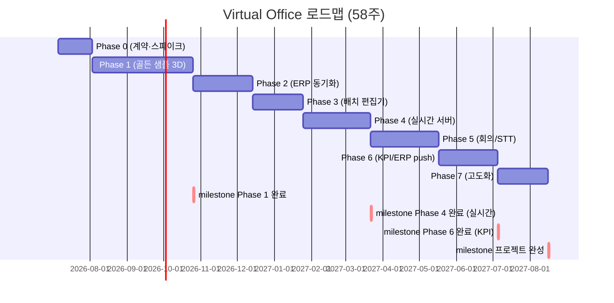

# 10-roadmap.md

## 개발 로드맵: Virtual Office 운영 플랫폼

**프로젝트**: 가상오피스 운영 플랫폼 (vituraloffice_new)  
**버전**: v2.0  
**목표**: 완성 — 스펙 7단계 전체를 체계적으로 구현  
**첫 사용**: 사내 도그푸딩 (단일 조직, 단일 company_id 기준)  
**개발 규모**: 1인 개발 + AI 협업, 최고 품질 우선  
**최종 업데이트**: 2026-07-02  
**정본 기준**: `00-decisions.md` (D1~D25, F절 스파이크) — 충돌 시 정본이 우선

> **변경 요약 (v2.0, 2026-07-02)**: 전체 일정을 **58주 기준**으로 재산정(D6, 시작 2026-07-06 → 완성 **2027-08-16, 2027년 하반기**), "26주/2026-12-28" 표기 전면 폐기. Phase 0(계약+스파이크 S1~S4) 신설, Phase 5에 회의록 STT 파이프라인(D5) 포함, 실시간 프로토콜 WebSocket(WSS) 확정(D1), presence 7종(D13)·seat.status enum·ERP 엔드포인트(`POST /api/kpi-results`) 통일, EOD 순환 모순 해소(D17), 3D 미리보기 제거·데스크톱 draft 모드로 대체(D11), 성능 수치 100명 설계(D22).

---

## 📋 로드맵 개요

| 단계 | 이름 | 주요 산출물 | 예상 기간 | 의존성 |
|------|------|-----------|---------|--------|
| 0 | 계약 & 스파이크 | API/데이터/ERP 계약 + 스파이크 S1~S4(F절) | 4주 | 없음 |
| 1 | 프리미엄 골든 샘플 3D | Godot 클라이언트 + 샘플 씬 | 12주 | 0 |
| 2 | ERP 동기화 + 좌석/구역 | 동기화 모듈 + 데이터 매핑 | 7주 | 1 |
| 3 | 사무실 배치 편집기 | 2D 편집 + 데스크톱 draft 열람 + office_layout | 6주 | 2 |
| 4 | 실시간 가상오피스 | Godot 헤드리스 서버 + 멀티플레이어(WSS) | 8주 | 3 |
| 5 | 회의/화상회의 + 회의록 STT | LiveKit 통합 + STT 회의록/액션아이템 | 8주 | 4 |
| 6 | 업무결과·KPI 산출 | KPI 산출 + AI 초안 + ERP push | 7주 | 5 + ERP dev 브랜치 |
| 7 | 고도화 | 층 추가·권한·AI요약·모바일 | 6주 | 6 |

**총 예상 기간**: **58주** (시작 2026-07-06 → 완성 2027-08-16, **2027년 하반기**) — 1인 개발 + AI 협업 기준, 13-risks 검증 간트를 기준선으로 재산정하고 **15% 버퍼 포함**. Phase 5의 8주에는 회의록 STT 파이프라인(+3주, D5)이 반영됨.

> **핵심 원칙**: 각 단계는 **독립 데모 가능** (이전 단계 완료 후 즉시 테스트/검증 가능). 순차 빌드이며 각 단계마다 사용자 가치 제공. 1인 개발이므로 Phase 병렬화는 하지 않고 **순차 원칙**을 따른다(13-risks R7).

---

## Phase 0: 계약 & 스파이크 (F절)

### 목표
- API/데이터/ERP 연동 계약 확정, 통합 테스트 골격, 마이그레이션 전략 수립 (상세는 12-tasks.md Phase 0)
- **선행 기술 리스크를 스파이크(PoC)로 조기 검증** — 00-decisions.md F절 S1~S4

### 범위
#### 계약 설계
- 실시간 서버 API 계약(WebSocket(WSS) 프로토콜 + REST fallback, D1)
- 관리·업무·KPI REST 계약, 데이터 모델/ERD, ERP 연동 계약(`POST /api/kpi-results`)
- office_layout JSON Schema, 3D 씬 구조/asset 레지스트리, 테스트 프레임워크·CI 초안

#### 스파이크 (실패 시 폴백 확정)
| 순번 | 스파이크 | 검증 내용 | 실패 시 폴백 |
|------|---------|----------|-------------|
| **S1** | **Godot ↔ LiveKit PoC** (최우선) | GDScript + WebRTC GDExtension으로 LiveKit 룸 접속·오디오/비디오 수신 검증(Rust SDK 래핑 대안 포함) | 회의 화면만 임베디드 브라우저/외부 창 분리 |
| **S2** | STT 파이프라인 PoC | LiveKit Egress → STT(화자분리) → 회의록 초안 품질 측정(한국어) | 수동 회의록 + AI 요약으로 격하(PRD 기준 하향 재협의) |
| **S3** | 헤드리스 서버 부하 | GDScript 헤드리스 + PhysicsServer3D, 20명 시뮬레이션 CPU/메모리 측정 | tick 하향(10Hz), 물리 간소화 |
| **S4** | 동적 씬 라이팅 룩 검증 | D7 조합(실시간광+ReflectionProbe+SSAO)으로 골든 샘플 룩 확인 | SDFGI 옵션 기본화 + 기준 사양 상향 재협의 |

### 산출물
```
docs/api/           (realtime-server-api.yaml, management-api.yaml)
docs/data-model/    (erd.md, office-layout-schema.json)
docs/erp-integration/ (contract.md, service-account-policy.md)
spikes/             (s1_livekit/, s2_stt/, s3_headless_load/, s4_lighting/) — 각 PoC 결과 리포트 포함
backend/tests/conftest.py, .github/workflows/test-phase.yaml
```

### 의존성
- 없음 (초기 단계)

### 수용 기준
- [ ] 모든 계약(OpenAPI/JSON Schema/ERP) 초안 작성·검토 완료
- [ ] S1: Godot에서 LiveKit 룸 오디오/비디오 수신 성공(또는 폴백 확정)
- [ ] S2: 한국어 회의록 초안 발화자·액션아이템 누락률 측정치 확보(수동 전사 대조, D22)
- [ ] S3: 20명 시뮬레이션에서 tick 20Hz 유지 시 CPU/메모리 여유 확인(또는 tick 하향 확정)
- [ ] S4: 동적 씬 골든 샘플 룩 승인(또는 SDFGI 기본화 확정)

### 독립 데모
**"스파이크 리포트 4종"** — 각 PoC의 성공/폴백 결정과 근거 수치를 문서화하여 Phase 1 이후 기술 선택의 근거로 사용.

---

## Phase 1: 프리미엄 골든 샘플 3D

### 목표
- Godot 4 네이티브 클라이언트의 **품질 기준 확정**
- 3D 가상오피스의 핵심 구성요소(공간·아바타·UI) 완성도 검증
- 향후 모든 단계의 기준이 될 "참고 구현" 확보

### 범위
#### 3D 공간
- **로비**: 진입점, 브랜드 월, 안내판
- **오픈 좌석 구역**: 격자형 책상(20석), 팀 색상 표시, 상태 표시
- **회의실**: 유리벽 2개 회의실(각 6인), 예약/점유 상태 시각화
- **라운지**: 소파/테이블, 비포멀 협업 공간
- **집중실/포커스존**: 개인 작업 공간
- **폰부스**: 사적 통화 공간
- **미니맵**: 2D 평면도, 실시간 프레즌스 표시

#### 아바타 & 상호작용
- **아바타**: 5~10명 플레이어(다양한 피부색/성별/복장), 자연스러운 애니메이션
  - 유휴(idle), 걷기(walk), 달리기(run), 앉기(sit), 제스처(wave/thumbs-up)
- **이름/상태 HUD**: 각 아바타 위의 부동 레이블
  - 직원명, 직급/팀 배지, 상태(온라인/회의중/집중중/외근/퇴근)
- **근접 인터랙션**: 거리 기반 협업 신호 (귀속말, 협업 제안 UI)

#### UI 패널
- **우측 직원 패널**: 현재 사무실 내 직원 목록, 클릭하면 아바타 추적
- **하단 회의실 패널**: 진행 중인 회의 표시, 참가자 리스트
- **상단 스테이터스**: 나의 현재 상태, 빠른 상태 변경 버튼

#### 시각적 품질
- Forward+ 렌더러로 PBR 재료, 고품질 라이팅
- 조명: 자연광(창문), 인공등(LED), 실시간 그림자
- CC0 에셋 활용 + 자체 오피스 키트(Blender GLB/glTF 최적화)
- 라이팅: 실시간 직접광 + ReflectionProbe + SSAO (라이트맵 베이킹 배제, D7). 기준 사양 GTX 1650급 60fps / 내장그래픽 30fps

### 산출물
```
backend/
  ├── app/
  │   ├── models/
  │   │   ├── erp_user.py (ERP 사용자 미러, read-only)
  │   │   ├── presence.py (실시간 위치/상태)
  │   │   └── asset.py (에셋 레지스트리)
  │   ├── api/
  │   │   ├── erp_sync.py (ERP 읽기 초기화)
  │   │   ├── presence.py (프레즌스 업데이트 엔드포인트)
  │   │   └── asset.py (에셋 메타 조회)
  │   └── services/
  │       └── erp_reader.py (ERP 직접 DB 읽기)
  ├── schema.sql (DB 초기화)
  └── requirements.txt

godot_client/
  ├── scenes/
  │   ├── office/
  │   │   ├── lobby.tscn
  │   │   ├── seating_area.tscn
  │   │   ├── meeting_rooms.tscn
  │   │   ├── lounge.tscn
  │   │   ├── focus_zone.tscn
  │   │   └── phone_booths.tscn
  │   └── avatar/
  │       ├── avatar.gd
  │       ├── avatar_animator.gd
  │       └── avatar_hud.gd
  ├── ui/
  │   ├── employee_panel.tscn
  │   ├── meeting_panel.tscn
  │   ├── minimap.tscn
  │   └── status_bar.tscn
  ├── assets/
  │   ├── models/ (GLB/glTF 최적화 에셋)
  │   ├── materials/ (PBR)
  │   └── textures/
  └── project.godot

frontend/
  ├── pages/
  │   └── dashboard.tsx (Godot 클라이언트 다운로드, 실행 가이드)
  └── components/
      └── clientStatus.tsx (클라이언트 버전/구성 상태)
```

### 의존성
- Phase 0 완료 (계약 + 스파이크 S1~S4, 특히 S4 라이팅 룩 승인)

### 수용 기준
- [ ] Godot 4 클라이언트 빌드 성공 (Forward+ 렌더러, 기준 사양 GTX 1650급 60fps / 내장그래픽 30fps, D22)
- [ ] 로비~폰부스 전체 공간 렌더링 (글리치 없음, 광도감 정상)
- [ ] 아바타 5명 이상 동시 표시 (이름/상태 HUD 정확)
- [ ] 우측 직원 패널, 하단 회의실 패널 표시/상호작용 정상
- [ ] 미니맵 실시간 동기 (FPS 저하 <5%)
- [ ] 에셋 라이선스/귀속 정확 (asset.py 레지스트리 완성)

### 독립 데모
**"Godot 멀티플레이어 없이 스크립트로 아바타 움직이기"** — 서버 연동 전 로컬 시뮬레이션으로 3D 품질 즉시 검증 가능. 실시간 동기화는 Phase 4에서.

---

## Phase 2: ERP 동기화 + 좌석/구역

### 목표
- ERP(Space-Daily/DailyLog)에서 **직원·조직·근태 읽기 통로 개설**
- 우리 플랫폼의 좌석/구역 데이터 모델 확정
- **아바타 시작위치** → 배정된 좌석으로 자동 연결

### 범위
#### ERP 동기화 (Read-only)
- **users**: 직원명, 직급, 팀, 역할, 근무설정(work_type/hours), 연락처
- **teams**: 팀명, 리더
- **job_positions**: 직급명, 서열
- **attendances**: 일일 출퇴근, 근태 상태 (read-only Postgres 직접 접근)
- **leaves**: 휴가/휴직

#### 우리 플랫폼 데이터 모델
```sql
-- ERP 미러
CREATE TABLE erp_user (
  id BIGINT PRIMARY KEY,  -- ERP users.id (조인 키)
  company_id INT NOT NULL,
  email VARCHAR(255) NOT NULL,
  name VARCHAR(255),
  erp_team_id INT,
  role VARCHAR(50),  -- [employee|leader|admin]
  position VARCHAR(255),
  position_id INT,
  manager_id BIGINT,
  slack_user_id VARCHAR(255),
  github_username VARCHAR(255),
  jira_email VARCHAR(255),
  work_type VARCHAR(50),
  work_hours INT,
  last_synced_at TIMESTAMP,
  UNIQUE(company_id, email)
);

-- 상위 조직 그룹 (우리 추가)
CREATE TABLE org_group (
  id SERIAL PRIMARY KEY,
  name VARCHAR(255) NOT NULL,
  type VARCHAR(50),  -- [division|department|part]
  parent_id INT,
  color VARCHAR(7),
  sort_order INT,
  FOREIGN KEY (parent_id) REFERENCES org_group(id)
);

-- 팀 ↔ 구역 매핑
CREATE TABLE team_zone (
  id SERIAL PRIMARY KEY,
  erp_team_id INT NOT NULL,
  org_group_id INT,
  office_id INT NOT NULL,
  floor_id INT NOT NULL,
  zone_label VARCHAR(255),
  color VARCHAR(7),
  polygon_coords JSONB,
  FOREIGN KEY (org_group_id) REFERENCES org_group(id),
  UNIQUE(erp_team_id, office_id, floor_id)
);

-- 좌석
CREATE TABLE seat (
  id SERIAL PRIMARY KEY,
  floor_id INT NOT NULL,
  team_zone_id INT,
  type VARCHAR(50),  -- [fixed|free|temp|partner]
  assigned_user_id BIGINT,
  coords POINT,
  facing INT,  -- 도(degree), 시계방향, 기준축 +X (D25)
  status VARCHAR(50),  -- [available|occupied|reserved|maintenance] (12-tasks와 통일)
  FOREIGN KEY (assigned_user_id) REFERENCES erp_user(id)
);

-- 근무 기록 (ERP attendances 캐시)
CREATE TABLE attendance_cache (
  id SERIAL PRIMARY KEY,
  user_id BIGINT NOT NULL,
  work_date DATE NOT NULL,
  check_in_at TIMESTAMP,
  check_out_at TIMESTAMP,
  work_type VARCHAR(50),
  last_synced_at TIMESTAMP,
  FOREIGN KEY (user_id) REFERENCES erp_user(id),
  UNIQUE(user_id, work_date)
);
```

#### 동기화 메커니즘 (D18)
- **배치 스케줄러**: **매시간 증분(updated_at 기준) + 매일 00:00 KST 전체 대사** (APScheduler)
  - ERP read-only DB에서 delta 읽기 (last_synced_at 기준)
  - erp_user, attendance_cache 업데이트
  - 전체 대사에서 하드 삭제 감지 → `is_active=false` **soft-delete** (미러 FK는 RESTRICT + soft-delete로 평가 기록 영구성 보장)
  - 동기화 실패 시 자동 알림(관리자 콘솔 + 알림 채널)
- **API 엔드포인트**:
  - GET `/api/sync/status` — 마지막 동기화 시점, 상태
  - GET `/api/erp-user` — 모든 직원 (필터: team_id, role, status)
  - GET `/api/erp-user/{id}` — 개별 직원 상세
  - GET `/api/team-zone/{office_id}/{floor_id}` — 구역 정보
  - GET `/api/seat/{floor_id}` — 좌석 목록

#### 좌석 배정 규칙
- **고정 좌석(fixed)**: erp_user.id → assigned_user_id (관리자 설정)
- **자율 좌석(free)**: assigned_user_id = NULL (출근 시 선택)
- **임시/협력사(temp/partner)**: 예약 또는 방문객 배정

#### 아바타 시작 위치 연결
```
erp_user.id
  └→ seat.assigned_user_id
      └→ seat.coords
          └→ Godot 클라이언트 spawn position
```

### 산출물
```
backend/
  ├── app/
  │   ├── models/
  │   │   ├── erp_user.py
  │   │   ├── org_group.py
  │   │   ├── team_zone.py
  │   │   ├── seat.py
  │   │   └── attendance_cache.py
  │   ├── api/
  │   │   ├── erp_user.py (GET 엔드포인트)
  │   │   ├── team_zone.py
  │   │   ├── seat.py
  │   │   └── sync.py (상태 조회)
  │   ├── services/
  │   │   ├── erp_reader.py (동기화 로직)
  │   │   ├── erp_db.py (read-only 커넥션)
  │   │   └── seat_assignment.py (배정 규칙)
  │   └── jobs/
  │       └── daily_erp_sync.py (APScheduler)
  ├── alembic/
  │   └── versions/
  │       └── 0001_initial_schema.py
  └── config/
      └── erp_connection.py (ERP read-only DB 자격증명)

frontend/
  ├── pages/
  │   ├── admin/
  │   │   ├── erp-sync-status.tsx (동기화 모니터링)
  │   │   ├── team-zones.tsx (구역 관리, 맵 편집)
  │   │   └── seat-assignment.tsx (좌석 배정)
  │   └── dashboard.tsx (업데이트: 직원 리스트 조회)
  └── lib/
      ├── erp-api.ts (API 클라이언트)
      └── team-zone-map.ts (좌석/구역 2D 시각화)

tests/
  ├── test_erp_sync.py (동기화 로직)
  ├── test_seat_assignment.py
  └── test_api_endpoints.py
```

### 의존성
- Phase 1 완료 (Godot 클라이언트 기본 구조 확정)
- ERP 접근 자격증명 (read-only 계정, DB 직접 접근)

### 수용 기준
- [ ] ERP read-only DB 연결 성공 (테스트: 100명 이상 users 읽기)
- [ ] 동기화 배치 정상 실행 (매일 마다 로그 기록)
- [ ] erp_user, team_zone, seat 테이블 일관성 (FK 제약 통과)
- [ ] GET `/api/erp-user` 응답 시간 <500ms (100명 기준)
- [ ] 고정 좌석 배정 시 Godot 클라이언트 spawn 위치 정확 (오차 <1m)
- [ ] 자율 좌석 선택 UI 동작 (assigned_user_id NULL → assigned)

### 독립 데모
**"좌석 배정 대시보드"** — 아바타 없이 우리 UI에서 직원·팀·좌석 시각화. 팀별 구역색, 직원명, 배정 상태만으로도 조직 구조 검증 가능.

---

## Phase 3: 사무실 배치 편집기

### 목표
- **office_layout JSON 구조 확정** (스키마 상세는 05-office-layout-schema.md 참조)
- 관리자가 **2D 편집(Konva.js) + 검증 + 배포/롤백**을 할 수 있는 엔드-투-엔드 도구 완성. 정밀 확인은 저장 후 **데스크톱 클라이언트 draft 모드**로 열람(웹 3D 미리보기 제거, D11)
- 사무실 구조 **코드 대신 DB/JSON으로 구동** (재사용성·변경 용이성)

### 범위
#### office_layout 데이터 모델
```sql
CREATE TABLE office (
  id SERIAL PRIMARY KEY,
  company_id INT NOT NULL,
  name VARCHAR(255),
  description TEXT
);

CREATE TABLE floor (
  id SERIAL PRIMARY KEY,
  office_id INT NOT NULL,
  level INT,  -- 1, 2, 3, ...
  name VARCHAR(255),  -- "1F", "2F Open", ...
  minimap_config JSONB,  -- {"zoom": 1.0, "origin": [x, y]}
  FOREIGN KEY (office_id) REFERENCES office(id)
);

CREATE TABLE office_layout (
  id SERIAL PRIMARY KEY,
  office_id INT NOT NULL,
  floor_id INT NOT NULL,
  version INT,
  status VARCHAR(50),  -- [draft|validated|deployed|archived]
  json JSONB,  -- 구조 blob
  created_at TIMESTAMP,
  deployed_at TIMESTAMP,
  FOREIGN KEY (office_id) REFERENCES office(id),
  FOREIGN KEY (floor_id) REFERENCES floor(id),
  UNIQUE(office_id, floor_id, version)
);

CREATE TABLE room (
  id SERIAL PRIMARY KEY,
  floor_id INT NOT NULL,
  type VARCHAR(50),  -- [lobby|meeting|lounge|focus|phonebooth]
  name VARCHAR(255),
  capacity INT,
  coords JSONB,  -- {x, y, width, height, rotation}
  enter_trigger JSONB,  -- 진입 트리거 영역
  livekit_room VARCHAR(255),  -- LiveKit 방 이름 (optional, 회의실만)
  FOREIGN KEY (floor_id) REFERENCES floor(id)
);
```

office_layout JSON 스키마:
```json
{
  "version": 1,
  "floor_id": 1,
  "dimensions": {
    "width": 100,
    "height": 80,
    "unit": "meters"
  },
  "zones": [
    {
      "id": "zone-1",
      "name": "개발팀",
      "type": "seating",
      "coords": {"x": 0, "y": 0, "width": 50, "height": 40},
      "color": "#FF5733",
      "seats": [
        {"id": "seat-1-1", "coords": {"x": 5, "y": 5}, "type": "fixed", "assigned_user_id": 101}
      ]
    }
  ],
  "rooms": [
    {
      "id": "room-meeting-1",
      "name": "회의실 A",
      "type": "meeting",
      "capacity": 6,
      "coords": {"x": 50, "y": 0, "width": 20, "height": 30},
      "livekit_room": "meeting-a"
    }
  ],
  "colliders": [
    {"id": "wall-1", "start": [0, 0], "end": [100, 0], "type": "wall"}
  ]
}
```

#### 2D 편집기 (Konva.js)
- **캔버스**: office_layout 시각화
  - 드래그로 구역/좌석/방 이동/크기 조정
  - 우클릭 컨텍스트: 삭제, 복제, 속성 편집
  - 그리드 스냅 (옵션)
- **우측 패널**:
  - 구역/방/좌석 목록 (필터, 선택)
  - 선택 항목 속성 폼 (이름, 용량, 색상, LiveKit 방 등)
  - 좌석 대량 배정 (CSV import)
- **버전 관리**:
  - 모든 편집은 "draft" 상태 (자동 저장)
  - "Validate" 버튼 → **서버(FastAPI) 단일 정밀 검증**(도달성 A* 포함, D12). 웹 편집기는 경량 체크(범위/겹침)만. **ERROR는 배포 불가**, WARNING만 무시 가능
  - "Deploy" → 상태 = deployed, timestamp 기록
  - "Rollback" → 이전 version으로 복원
  - "데스크톱 draft 열람" → 저장된 draft 레이아웃을 데스크톱 클라이언트에서 draft 모드로 로드해 정밀 확인

#### 데스크톱 draft 모드 열람 (웹 3D 미리보기 대체, D11)
- 웹 편집기는 Konva.js 2D 전용. WASM/HTML5 export 미사용(PRD WON'T 준수)
- 정밀 3D 확인은 저장 후 **데스크톱 클라이언트를 draft 모드로 실행**하여 해당 office_layout 버전을 로드
- 충돌·개구부(door opening) 등 시각 확인은 네이티브 클라이언트에서 수행

#### 검증 엔진
```python
def validate_layout(office_layout_json):
    # 제약:
    # 1. 모든 객체가 office 범위 내
    # 2. 객체 간 겹침 없음 (합법적 겹침 제외: 방 진입, 좌석 미세 중첩)
    # 3. LiveKit 방 이름 고유성
    # 4. 좌석 배정 user_id 존재 확인 (erp_user)
    # 5. 각 방의 수용 인원 ≥ 0
    errors = []
    warnings = []
    return {"valid": len(errors) == 0, "errors": errors, "warnings": warnings}
```

### 산출물
```
frontend/
  ├── pages/
  │   └── admin/
  │       ├── layout-editor.tsx (메인 페이지)
  │       ├── 2d-canvas.tsx (Konva.js 캔버스)
  │       ├── properties-panel.tsx (우측 속성 폼)
  │       ├── version-history.tsx (배포 이력)
  │       └── draft-open-guide.tsx (데스크톱 draft 모드 열람 안내)
  └── lib/
      ├── office-layout-schema.ts (타입 정의)
      ├── layout-validator.ts (검증 로직)
      └── konva-shapes.ts (도형 렌더링)

backend/
  ├── app/
  │   ├── models/
  │   │   ├── office.py
  │   │   ├── floor.py
  │   │   ├── office_layout.py
  │   │   └── room.py
  │   ├── api/
  │   │   └── layout.py (CRUD + validate + deploy + rollback)
  │   ├── services/
  │   │   ├── layout_validator.py (정밀 검증: 범위/겹침/도달성 A*, D12)
  │   │   ├── layout_generator.py (JSON → Godot 씬 변환)
  │   │   └── layout_versioning.py (v1, v2, ... 관리)
  ├── alembic/
  │   └── versions/
  │       └── 0002_office_layout_tables.py
  └── tests/
      ├── test_layout_validator.py
      └── test_layout_deploy.py

godot_client/
  ├── scenes/
  │   └── layout_draft_viewer.tscn (--draft 모드: 저장된 draft 레이아웃 열람)
  └── scripts/
      └── layout_loader.gd (office_layout JSON 로드)
```

### 의존성
- Phase 1, Phase 2 완료 (Godot 기본, erp_user/seat 테이블)

### 수용 기준
- [ ] office_layout JSON 스키마 정규화 (상호참조, 외래키 일관성)
- [ ] 2D 편집기 로드/저장 성능 <2s (500개 좌석 기준)
- [ ] 서버 정밀 검증 엔진 모든 제약 통과 (테스트: 겹침/범위/FK/도달성 케이스 각 3개, D12)
- [ ] 데스크톱 draft 모드 열람: 저장된 draft 레이아웃 로드 성공 (로딩 <5초)
- [ ] Deploy 성공 후 상태 = deployed, timestamp 기록
- [ ] Rollback으로 이전 version 복원 정상
- [ ] CSV import로 100개 좌석 대량 배정 성공

### 독립 데모
**"배치도 편집·배포"** — Godot 없이 2D 캔버스에서 구역/좌석 배치, 검증, 배포. 정밀 3D 확인은 데스크톱 draft 모드로 열람.

---

## Phase 4: 실시간 가상오피스 (Godot 서버)

### 목표
- **Godot 4 헤드리스 멀티플레이어 서버** 구축 (권위 모델)
- 아바타 이동, 프레즌스(presence), 회의실 점유, 근접 상호작용 모두 서버 검증
- **WebSocket(WSS) 기반 동기화** (D1: TLS 내장, 재택 방화벽/VPN 통과 용이. ENet 폐기)

### 범위
#### Godot 헤드리스 서버
- 오피스 씬 로드 (office_layout JSON → Godot 씬 재사용)
- 플레이어 연결/퇴장 처리
- 아바타 이동 입력 검증 (collision 확인)
- 프레즌스 상태 갱신 (**7종 확정, D13**: offline / online / working / meeting / focus / away / external). away 자동 전이 5분(기본값). GPS 기반 상태(trip_moving/trip_arrived/returning) 삭제
- 회의실 점유 검증 (room.capacity 초과 방지)
- 근접 인터랙션 감지 (거리 < 5m → UI 신호)

#### 프레즌스 동기화
```sql
CREATE TABLE presence (
  user_id BIGINT PRIMARY KEY,
  office_id INT NOT NULL,
  floor_id INT NOT NULL,
  x FLOAT,
  y FLOAT,
  status VARCHAR(50),  -- 7종 (D13): [offline|online|working|meeting|focus|away|external]
  updated_at TIMESTAMP,
  FOREIGN KEY (user_id) REFERENCES erp_user(id)
);
```

API:
- POST `/api/presence/update` — 아바타 위치/상태 업데이트 (서버는 collision 검사)
- GET `/api/presence/{office_id}` — 현재 출근자 목록 (실시간)
- WS `/ws/presence` — 프레즌스 실시간 푸시 (구독자)

#### 멀티플레이어 동기화 (WebSocket/WSS, D1)
- **프로토콜**: **WebSocket(WSS)** — TLS 내장, 재택 근무자 방화벽/VPN 통과 용이. 재접속 시 sequence_num 기반 스냅샷 재수신. 핸드셰이크에 `protocol_version` 협상 포함(미지원 버전 거부, D4)
- **서버 tick**: 20Hz (D22)
- **동기화 항목**:
  - 플레이어 위치 (서버 tick 20Hz, E2E p95 < 500ms)
  - 애니메이션 상태 (change-driven)
  - 회의실 점유/진입 (1Hz)
  - 채팅/근접 신호 (real-time)

#### 충돌 시스템
- Godot 씬의 collider (office_layout JSON → collider JSONB 변환)
- 서버에서 이동 검증: 새 좌표가 collider와 충돌하면 거부 + 마지막 유효 위치로 클라이언트 correction

#### 회의실 상태 머신
```
states: [available, reserved, in_session, maintenance]
on_user_enter(user_id):
  if occupants < capacity:
    occupants += 1
    broadcast update
  else:
    reject (capacity exceeded)
on_user_exit(user_id):
  occupants -= 1
  if occupants == 0:
    state = available
```

### 산출물
```
godot_server/
  ├── scenes/
  │   ├── office_server.tscn (메인 씬)
  │   └── shared/
  │       └── (offfice 씬 재사용: Phase 1에서 복사)
  ├── scripts/
  │   ├── server.gd (main entry)
  │   ├── player_manager.gd (플레이어 연결/퇴장)
  │   ├── presence_syncer.gd (프레즌스 업데이트)
  │   ├── collision_validator.gd (이동 검증)
  │   ├── meeting_room_manager.gd (회의실 상태)
  │   └── network_protocol.gd (WebSocket 직렬화 + protocol_version 협상)
  ├── config/
  │   └── server_config.gd (포트, 최대 플레이어, 오피스 ID)
  └── docker/
      └── Dockerfile (헤드리스 빌드)

backend/
  ├── app/
  │   ├── models/
  │   │   └── presence.py
  │   ├── api/
  │   │   └── presence.py
  │   ├── websocket/
  │   │   └── presence_gateway.py (Godot 서버 ↔ 백엔드 브릿지)
  │   └── services/
  │       └── presence_service.py
  ├── tests/
  │   ├── test_presence_sync.py
  │   ├── test_collision.py
  │   └── test_meeting_room.py

godot_client/
  ├── scenes/
  │   └── multiplayer_office.tscn (서버 연결)
  └── scripts/
      ├── client_network.gd (WebSocket/WSS 클라이언트)
      ├── avatar_controller.gd (입력 → 서버 전송)
      └── remote_avatar.gd (다른 플레이어 시각화)
```

### 의존성
- Phase 1, 2, 3 완료 (Godot, erp_user, office_layout)

### 수용 기준
- [ ] Godot 헤드리스 빌드 성공 (docker run으로 시작)
- [ ] 도그푸딩 검증 20명 동시 연결 성공 (설계 목표 100명, D22)
- [ ] 아바타 동기화 E2E(입력→원격 표시) p95 < 500ms (서버 tick 20Hz, D22)
- [ ] 프레즌스 브로드캐스트 정상 (팬아웃 O(N²) 명시, 100명 초과 시 AOI 필터링+바이너리 직렬화 검토)
- [ ] 회의실 용량 초과 시 거부 정상 (테스트: 6인 회의실 7번째 진입 거부)
- [ ] 클라이언트 disconnect 후 서버에서 자동 제거 (<30s)
- [ ] 충돌 검증 오류 없음 (테스트: 벽, 가구와 충돌 시도)

### 독립 데모
**"멀티플레이어 아바타 이동"** — 실제 웹 백엔드 없이 Godot 서버만으로 3명 이상 아바타 동시 이동 시각화. 회의실 점유 상태 표시.

---

## Phase 5: 회의/화상회의 + 회의록 STT

### 목표
- **LiveKit 셀프호스트 통합** (룸 생성은 FastAPI 경유 단일화, D24)
- 회의 예약(+즉석 FCFS 병행, D23), **명시적 입장 확인**(자동 연결 금지, D24), 화상회의 시작
- **회의록 STT 자동 생성 (정식 범위, D5)**: LiveKit Egress(트랙별 오디오) → STT(화자분리) → 회의록 초안 자동 생성 → 참석자/호스트 검토·확정. 수동 입력은 폴백
- 결정사항·액션아이템 기록, 회의 종료 후 ERP로 기록 동기화

### 범위
#### 회의 예약 & 시작
```sql
CREATE TABLE meeting (
  id SERIAL PRIMARY KEY,
  room_id INT NOT NULL,
  title VARCHAR(255),
  scheduled_at TIMESTAMP,
  started_at TIMESTAMP,
  ended_at TIMESTAMP,
  host_user_id BIGINT NOT NULL,
  status VARCHAR(50),  -- [scheduled|in_progress|completed|cancelled]
  livekit_room VARCHAR(255),
  FOREIGN KEY (room_id) REFERENCES room(id),
  FOREIGN KEY (host_user_id) REFERENCES erp_user(id)
);

CREATE TABLE meeting_participant (
  id SERIAL PRIMARY KEY,
  meeting_id INT NOT NULL,
  user_id BIGINT NOT NULL,
  joined_at TIMESTAMP,
  left_at TIMESTAMP,
  FOREIGN KEY (meeting_id) REFERENCES meeting(id),
  FOREIGN KEY (user_id) REFERENCES erp_user(id)
);
```

#### 회의록 (minutes)
```sql
CREATE TABLE meeting_minute (
  id SERIAL PRIMARY KEY,
  meeting_id INT NOT NULL,
  decisions TEXT,  -- 회의 결정사항
  notes TEXT,      -- 일반 노트
  created_by BIGINT,
  created_at TIMESTAMP,
  FOREIGN KEY (meeting_id) REFERENCES meeting(id),
  FOREIGN KEY (created_by) REFERENCES erp_user(id)
);

CREATE TABLE action_item (
  id SERIAL PRIMARY KEY,
  meeting_id INT NOT NULL,
  title VARCHAR(255),
  assignee_user_id BIGINT,
  due_date DATE,
  related_ref VARCHAR(255),  -- Jira ticket, GitHub issue 링크 등
  status VARCHAR(50),  -- [open|in_progress|completed|cancelled]
  FOREIGN KEY (meeting_id) REFERENCES meeting(id),
  FOREIGN KEY (assignee_user_id) REFERENCES erp_user(id)
);
```

#### UI 플로우
1. **회의실 클릭** → 회의 예약 폼 (예약 시스템 + 즉석 FCFS 병행, D23)
   - 제목, 참가자 (다중 선택), 시간, 예약 충돌 검증
   - 저장 → meeting 테이블 (LiveKit 룸 생성은 FastAPI 경유, 시작 시점)
2. **회의 입장** → **명시적 입장 다이얼로그 → 클릭 → LiveKit 토큰 발급**(자동 연결 금지, D24)
   - 회의 시작 시 전원 고지 배너 + 녹음·STT 참여 의사 확인(거부 시 오디오 미수집, D20)
   - 서버가 room 상태 = in_session으로 변경, 클라이언트가 화상회의 UI 로드 (webrtc 스트림)
3. **회의 중** → 오디오는 LiveKit Egress로 트랙별 수집(STT 파이프라인 입력)
   - 필요 시 실시간 메모(수동 폴백) 입력 가능
   - 액션아이템 추가 (assignee, due_date, related_ref)
4. **회의 종료** → STT 파이프라인이 **회의록 초안 자동 생성** → 참석자/호스트 **검토·확정** → 최종 저장 + 참가자 기록 + 상태 = completed

#### 회의록 STT 파이프라인 (D5, S2 검증 기반)
```
LiveKit Egress (트랙별 오디오)
  → STT 엔진 (한국어, 화자분리)
  → 회의록 초안 (발화자별 텍스트 + 액션아이템 후보 추출)
  → 검토 UI (참석자/호스트가 수정·확정)
  → meeting_minute 확정본 저장
```
- **폴백**: STT 정확도 미달(S2 실패) 시 **수동 회의록 + AI 요약**으로 격하(PRD 기준 하향 재협의)
- **정확도 기준(D22)**: 자동 초안 발화자·액션아이템 누락률 < 5% (테스트 회의 N회 대비 **수동 전사 대조** 측정)
- **컴플라이언스(D20)**: 녹음 원본 보존 90일, 회의록 텍스트는 평가 데이터로 관리. 외부 STT/LLM 전송 시 실명→사번 가명화

#### LiveKit 셀프호스트
```yaml
# docker-compose.yml (excerpt)
livekit:
  image: livekit/livekit-server:latest
  ports:
    - "7880:7880"  # WebRTC
    - "7881:7881"  # WebRTC Data
    - "7882:7882"  # HTTP API
  volumes:
    - ./livekit.yaml:/etc/livekit.yaml
```

#### API 엔드포인트
- POST `/api/meetings` — 회의 예약
- GET `/api/meetings?room_id=` — 회의 목록
- POST `/api/meetings/{id}/start` — 회의 시작 (FastAPI 경유 LiveKit 룸 생성, 상태 = in_progress, D24)
- POST `/api/meetings/{id}/join` — 명시적 입장(고지·동의 확인 후 LiveKit 토큰 발급, D24)
- POST `/api/meetings/{id}/end` — 회의 종료 (Egress 종료 트리거)
- POST `/api/meetings/{id}/transcribe` — STT 파이프라인 실행(Egress 오디오 → 화자분리 → 초안 생성, 내부용)
- GET `/api/meetings/{id}/minute-draft` — STT 회의록 초안 조회
- POST `/api/meetings/{id}/minute-confirm` — 참석자/호스트 검토·확정
- POST `/api/action-items` — 액션아이템 추가
- GET `/api/meeting/{id}/transcript` — 회의록 + 액션 조회

### 산출물
```
frontend/
  ├── pages/
  │   ├── meetings/
  │   │   ├── list.tsx
  │   │   ├── [id]/detail.tsx
  │   │   ├── [id]/minutes.tsx
  │   │   └── [id]/minute-review.tsx (STT 초안 검토·확정 UI)
  │   └── components/
  │       ├── meeting-scheduler.tsx
  │       ├── join-consent-dialog.tsx (명시적 입장 + 녹음·STT 동의, D24/D20)
  │       ├── livekit-viewer.tsx
  │       ├── minute-draft-editor.tsx (발화자별 초안 편집)
  │       └── action-item-form.tsx
  └── lib/
      ├── livekit-client.ts
      └── meeting-api.ts

backend/
  ├── app/
  │   ├── models/
  │   │   ├── meeting.py
  │   │   ├── meeting_participant.py
  │   │   ├── meeting_minute.py
  │   │   └── action_item.py
  │   ├── api/
  │   │   └── meeting.py (CRUD + start/end)
  │   ├── services/
  │   │   ├── livekit_service.py (FastAPI 경유 룸 생성, 토큰 발급)
  │   │   ├── meeting_service.py
  │   │   ├── egress_service.py (LiveKit Egress 트랙별 오디오 수집)
  │   │   ├── stt_service.py (STT + 화자분리, 한국어)
  │   │   └── minute_drafter.py (회의록 초안 자동 생성 + 액션아이템 추출)
  │   └── jobs/
  │       └── meeting_cleanup.py (완료된 회의 정리)
  ├── alembic/
  │   └── versions/
  │       └── 0003_meeting_tables.py
  └── tests/
      ├── test_meeting_api.py
      ├── test_livekit_integration.py

godot_client/
  ├── scenes/
  │   └── meeting_room_ui.tscn
  └── scripts/
      ├── meeting_controller.gd
      └── livekit_bridge.gd (WebRTC GDExtension 화면 임베드, S1 검증 기반. 실패 시 임베디드 브라우저 폴백)
```

### 의존성
- Phase 4 완료 (실시간 서버, room 상태 관리)
- Phase 0 스파이크 S1(Godot↔LiveKit), S2(STT 파이프라인) 결과
- LiveKit + coturn 셀프호스트 배포 (**사내 VM, Docker Compose**, D21 — Kubernetes/클라우드 SaaS 배제)

### 수용 기준
- [ ] 회의 예약 폼 동작 (저장 → meeting 레코드 생성, 예약 충돌 검증)
- [ ] LiveKit 룸 생성 성공 (FastAPI 경유, livekit_room 컬럼 채워짐, D24)
- [ ] 명시적 입장 다이얼로그 + 녹음·STT 동의 배너 동작 (거부 시 오디오 미수집, D24/D20)
- [ ] 화상회의 UI 로드 (webrtc 스트림 시작), 화상 음성 지연 < 200ms (사내망, D22)
- [ ] **STT 회의록 초안 자동 생성** (Egress→화자분리→초안), 발화자·액션아이템 누락률 < 5% (수동 전사 대조, D22)
- [ ] 참석자/호스트 검토·확정 후 회의록 저장 (decisions, notes, created_by 기록)
- [ ] 액션아이템 추가 (assignee, due_date, related_ref 정상)
- [ ] 회의 종료 후 meeting_participant 레코드 완성 (joined/left_at)
- [ ] 회의록 조회 API 응답 정상 (<500ms)

### 독립 데모
**"회의 예약·화상·STT 회의록"** — 회의 생성·참가 기록·STT 회의록 초안 생성·검토 확정·액션아이템 추적을 데모. STT 미달 시 수동+AI요약 폴백 경로도 시연.

---

## Phase 6: 업무결과·KPI 산출 + ERP push

### 목표
- **work_log** (일일 업무 기록) 입력/수정 UI
- **KPI 산출 엔진** (협업 산출물 기반: 회의·액션아이템·업무완료도). **정량 점수는 결정론적 코드로 계산, AI는 서술만**(D14)
- **AI 초안 생성** (Claude API) — 강점/개선/근거 서술
- **관리자 검토 & 조정 + 이의신청 상태머신** (D15: 공개 → 이의접수 7일 → 재검토 → 확정)
- **배치 스케줄(D17)**: daily_reports push **18:00 KST** / KPI AI 초안 **21:00 야간 배치**(검토 대기) / kpi_results ERP push = **관리자 확정 이벤트 + 분기 마감 배치**
- **ERP dev 브랜치 작업** (신규 kpi_results 테이블 + 수신 엔드포인트 `POST /api/kpi-results` + 서비스계정 JWT, 03-erp-integration.md 참조). ERP에는 **관리자 확정 점수(final_score)만 전송**, `ai_draft` 미전송(D15)

### 범위
#### 업무 기록 (work_log)
```sql
CREATE TABLE work_log (
  id SERIAL PRIMARY KEY,
  user_id BIGINT NOT NULL,
  work_date DATE NOT NULL,
  category VARCHAR(50),  -- [project|task|support|meeting|learning]
  title VARCHAR(255),
  goal TEXT,
  related_project VARCHAR(255),
  url VARCHAR(1024),  -- artifact URL
  est_minutes INT,
  status VARCHAR(50),  -- [started|completed]
  result_url VARCHAR(1024),
  attachments JSONB,  -- 첨부 목록
  issues TEXT,
  next_action TEXT,
  FOREIGN KEY (user_id) REFERENCES erp_user(id),
  UNIQUE(user_id, work_date, title)
);
```

#### KPI 결과 (정본 스키마 = 04-data-model.md, D16)
```sql
-- period NULL 금지 → period_type + period_key 분리, 리뷰 필드 인라인(kpi_result_review 폐기)
CREATE TABLE kpi_result (
  id SERIAL PRIMARY KEY,
  user_id BIGINT NOT NULL,
  period_type VARCHAR(20) NOT NULL,   -- [daily|quarterly]
  period_key  VARCHAR(20) NOT NULL,   -- '2026-07-01' | '2026-Q3'
  metric VARCHAR(255) NOT NULL,       -- 어휘 사전은 04-data-model 정의 참조
  value FLOAT,                        -- 결정론적 코드 산출 (D14)
  source VARCHAR(50),                 -- "virtual_office"
  ai_draft JSONB,                     -- AI 서술만(강점/개선/근거), ERP 미전송 (D14/D15)
  admin_adjusted_score FLOAT,
  admin_note TEXT,
  admin_user_id BIGINT,
  objection_status VARCHAR(20) DEFAULT 'draft',  -- draft|published|objected|re_reviewing|finalized (D15)
  final_score FLOAT,                  -- 관리자 확정 점수 (ERP push 대상)
  finalized_at TIMESTAMP,
  created_at TIMESTAMP,
  UNIQUE(user_id, period_type, period_key, metric),  -- upsert 키 (D16)
  FOREIGN KEY (user_id) REFERENCES erp_user(id),
  FOREIGN KEY (admin_user_id) REFERENCES erp_user(id)
);
```

#### KPI 산출 규칙 (반감시 원칙 정합, D14 — 정량은 결정론적 코드)
```
KPI 메트릭(정본 공식은 08-kpi-logic.md, D14):
1. meeting_contribution = (회의록 작성 기여) + (담당 action_item 이행률: 완료·기한준수만)
   - 회의 참석 기본점·주관자 가점 제거, action_item 생성 가점 제거
2. work_fidelity = (완료 work_log 건수) + (충실도: goal·result_url·next_action 작성도)
   - 시간 비례 점수(est_minutes/100) 폐기
3. (근태 보정 ±5% 제거 — ERP가 attendance 별도 반영, 이중 반영 금지)

참고: Jira/GitHub 코드활동 기반 평가는 ERP developer_evaluations 소관이며,
본 KPI는 회의·협업·결과물 기반의 가상오피스 활동만 평가합니다.

제외:
- 접속시간/근무시간, 채팅, 근접, 화상요청 횟수 (반감시)
- 근태 보정(ERP 이중반영 금지), GPS 데이터(수집 기능 삭제, D13/D20)
```

#### AI 서술 초안 생성 (Claude — 서술만, 정량 미산출, D14)
```python
def generate_kpi_narrative(user_id, work_date, work_logs, meetings, actions, metrics):
    # metrics는 이미 결정론적 코드로 산출된 값(D14). AI는 점수를 만들지 않고 서술만 한다.
    prompt = f"""
    직원 {user.name} ({user.position})의 {work_date} 평가 서술(강점/개선/근거)을 작성하세요.
    점수를 산출하지 말고, 아래의 확정된 지표를 근거로 서술만 하세요.
    
    업무: {format_work_logs(work_logs)}
    회의: {format_meetings(meetings)}
    액션아이템: {format_actions(actions)}
    
    확정 지표(결정론적):
    - 회의 기여: {metrics['meeting_contribution']}
    - 업무 충실도: {metrics['work_fidelity']}
    
    강점 2개, 개선 영역 1개, 근거를 제시하세요(정량 점수 금지).
    """
    
    response = client.messages.create(
        model="claude-3-5-sonnet-20241022",
        max_tokens=500,
        messages=[{"role": "user", "content": prompt}]
    )
    return response.content[0].text
```

#### 관리자 검토 & 조정 + 이의신청 (D15)

리뷰 필드는 kpi_result에 **인라인**(위 스키마)이며 별도 `kpi_result_review` 테이블은 두지 않는다(D16). 이의신청 상태머신(D15):

```
objection_status: draft → published → objected → re_reviewing → finalized
  - published: 평가 공개 (직원 열람)
  - objected:  이의접수 (공개 후 7일 창)
  - re_reviewing: 재검토
  - finalized: 관리자 확정 → final_score 확정 → ERP push (정정 시 upsert 재push)
```

UI:
- 대시보드: "KPI 리뷰 대기"(objection_status='draft') 목록 (filterable by 팀, 상태)
- 상세: AI **서술** 초안 표시 + 관리자 조정값(admin_adjusted_score) 입력 폼 + 노트
- 저장 → admin_adjusted_score/admin_note/admin_user_id 기록. 확정 시 objection_status='finalized', final_score/finalized_at 기록

#### 배치 스케줄 (D17 — 순환 모순 해소)

배치는 **3개 트리거로 분리**된다. 서로의 산출물을 순환 참조하지 않는다.

```python
# (1) daily_reports push: 매일 18:00 KST
#     - 18:00 이후 활동은 익일 귀속, 주말·공휴일 스킵
@scheduler.scheduled_job('cron', hour=18, minute=0, timezone='Asia/Seoul')
def daily_reports_push():
    for user in active_users:
        report = build_daily_report(user.id, today)   # work_log/daily_status 요약
        push_log = DailyStatusPush(user_id=user.id, push_date=today,
                                   target="erp.daily_reports", status="pending")
        db.add(push_log); enqueue_erp_daily_report(report)
    db.commit()

# (2) KPI AI 초안 생성: 매일 21:00 야간 배치 (검토 대기 상태로 저장)
#     - 정량 점수는 결정론적 코드로 계산(D14), AI는 서술(강점/개선/근거)만 생성
@scheduler.scheduled_job('cron', hour=21, minute=0, timezone='Asia/Seoul')
def kpi_ai_draft_batch():
    for user in active_users:
        work_logs = query_work_logs(user.id, today)
        meetings  = query_meetings(user.id, today)
        actions   = query_action_items(user.id, today)
        metrics   = calculate_metrics(work_logs, meetings, actions)   # 결정론적
        ai_draft  = generate_kpi_narrative(user.id, today, metrics)   # 서술만
        upsert_kpi_result(user_id=user.id, period_type="daily",
                          period_key=today, metrics=metrics,
                          ai_draft=ai_draft, objection_status="draft",
                          source="virtual_office")   # metric 단위 upsert (D17 멱등성)
    db.commit()
    notify_admins("KPI 리뷰 대기 건 준비됨")

# (3) kpi_results ERP push: 관리자 확정 이벤트 + 분기 마감 배치 (D15/D17)
#     - 이벤트 핸들러: 이의신청 종결 → 관리자 확정(final_score) → 즉시 upsert push
#     - 분기 마감 배치: 분기 KPI 집계 후 일괄 push
def on_kpi_finalized(kpi_result):   # 관리자 확정 이벤트
    if kpi_result.objection_status == "finalized":
        push_kpi_to_erp(kpi_result)   # final_score만 전송, ai_draft 미전송 (D15)
```
> 멱등성(D17): metric 단위 upsert + 배치 `run_id` + advisory lock(동시 실행 방지). ERP kpi_results 미준비 시 feature flag OFF → 로컬 적재 → 준비 후 backfill.

#### ERP 연동 (dev 브랜치 작업)
**저장소**: github.com/project-space-daily/space-daily (private)  
**브랜치**: `feature/virtual-office-integration`

ERP에서 신설 필요 (스키마 정본은 04-data-model.md, D16):
```sql
-- ERP kpi_results 테이블 (우리가 작성)
-- period NULL 금지 → period_type + period_key 분리 (D16)
CREATE TABLE kpi_results (
  id SERIAL PRIMARY KEY,
  company_id INT NOT NULL,
  user_id BIGINT NOT NULL,
  period_type VARCHAR(20) NOT NULL,  -- [daily|quarterly]
  period_key  VARCHAR(20) NOT NULL,  -- '2026-07-01' / '2026-Q3'
  metric VARCHAR(255) NOT NULL,
  final_score FLOAT,   -- 관리자 확정 점수만 수신 (D15, ai_draft 미전송)
  source VARCHAR(50),  -- "virtual_office"
  created_at TIMESTAMP,
  FOREIGN KEY (user_id) REFERENCES users(id),
  UNIQUE(user_id, period_type, period_key, metric)  -- upsert 키 (D16)
);

-- 신규 엔드포인트: POST /api/kpi-results (단건/배치 동일, 정본 D16)
```

마이그레이션 파일:
```python
# ERP alembic/versions/XXXX_add_kpi_results.py
def upgrade():
    op.create_table(
        'kpi_results',
        sa.Column('id', sa.Integer(), nullable=False),
        sa.Column('company_id', sa.Integer(), nullable=False),
        sa.Column('user_id', sa.BigInteger(), nullable=False),
        sa.Column('period_type', sa.String(20), nullable=False),  # daily|quarterly (D16)
        sa.Column('period_key', sa.String(20), nullable=False),   # '2026-07-01'|'2026-Q3'
        sa.Column('metric', sa.String(255), nullable=False),
        sa.Column('final_score', sa.Float(), nullable=True),      # 관리자 확정 점수만 (D15)
        sa.Column('source', sa.String(50), nullable=True),
        sa.Column('created_at', sa.DateTime(), nullable=True),
        sa.ForeignKeyConstraint(['user_id'], ['users.id']),
        sa.PrimaryKeyConstraint('id')
    )
    op.create_unique_constraint(
        'uq_kpi_results_key', 'kpi_results',
        ['user_id', 'period_type', 'period_key', 'metric'])   # upsert 키 (D16)
    op.create_index('ix_kpi_results_user_id', 'kpi_results', ['user_id'])
```

ERP 수신 엔드포인트:
```python
# ERP app/api/routes/kpi.py
@router.post("/api/kpi-results")   # 정본 엔드포인트 (단건/배치 동일, D16)
async def ingest_kpi(
    payload: List[KpiIngestRequest],  # [{user_id, period_type, period_key, metric, final_score, source}]
    current_user: User = Depends(get_service_account)
):
    """
    Virtual Office에서 KPI 결과 수신 (관리자 확정 점수만, D15).
    인증: JWT (서비스계정, 토큰 24h)
    멱등성: UNIQUE(user_id, period_type, period_key, metric) upsert (D16/D17)
    """
    for item in payload:
        upsert_kpi_result(
            company_id=current_user.company_id,
            user_id=item.user_id,
            period_type=item.period_type,
            period_key=item.period_key,
            metric=item.metric,
            final_score=item.final_score,
            source=item.source,
            created_at=datetime.utcnow()
        )
    session.commit()
    return {"ingested": len(payload)}
```

ERP 서비스계정:
```sql
INSERT INTO users (
  company_id, email, name, role, position, password_hash
) VALUES (
  1,
  'virtual-office-sync@company.com',
  'Virtual Office KPI Sync',
  'admin',  -- write 권한 필요
  'Integration Service',
  '$2b$12$...'  -- bcrypt hashed secret
);
```

우리 쪽 (vituraloffice_new):
```python
# backend/app/services/erp_kpi_push.py
class ErpKpiPusher:
    def __init__(self, erp_url, service_account_email, service_account_secret):
        self.erp_url = erp_url
        self.service_account_email = service_account_email
        self.service_account_secret = service_account_secret
    
    async def push_finalized_kpi(self, kpi_results):
        """관리자 확정(이의신청 종결) KPI → ERP로 push (final_score만, D15)"""
        
        # JWT 취득
        token = await self._get_service_token()
        
        # 페이로드 준비 — 확정된 것만, final_score 전송 (ai_draft 미전송)
        payload = [
            {
                "user_id": kpi.user_id,
                "period_type": kpi.period_type,   # daily|quarterly (D16)
                "period_key": kpi.period_key,      # '2026-07-01'|'2026-Q3'
                "metric": kpi.metric,
                "final_score": kpi.final_score,    # 관리자 확정 점수 (D15)
                "source": "virtual_office"
            }
            for kpi in kpi_results
            if kpi.objection_status == "finalized"
        ]
        
        # POST (정본 엔드포인트, D16)
        response = await httpx.post(
            f"{self.erp_url}/api/kpi-results",
            json=payload,
            headers={"Authorization": f"Bearer {token}"}
        )
        response.raise_for_status()
        
        # 로그: daily_status_push 상태 = "pushed"
        for kpi in kpi_results:
            log = DailyStatusPush(
                user_id=kpi.user_id,
                push_date=kpi.kpi_date,
                target="erp",
                status="pushed",
                pushed_at=datetime.utcnow()
            )
            db.add(log)
        db.commit()
```

### 산출물
```
backend/
  ├── app/
  │   ├── models/
  │   │   ├── work_log.py
  │   │   ├── kpi_result.py
  │   │   └── daily_status_push.py
  │   ├── api/
  │   │   ├── work_log.py (CRUD)
  │   │   └── kpi.py (계산, AI 초안, 조회)
  │   ├── services/
  │   │   ├── kpi_calculator.py (메트릭 계산)
  │   │   ├── kpi_ai_drafter.py (Claude 연동)
  │   │   └── erp_kpi_pusher.py (ERP 수신 엔드포인트)
  │   ├── jobs/
  │   │   └── daily_eod_push.py (배치)
  │   └── config/
  │       └── ai_config.py (Claude API key)
  ├── alembic/
  │   └── versions/
  │       └── 0004_kpi_and_work_log.py
  └── tests/
      ├── test_kpi_calculator.py
      ├── test_kpi_ai_draft.py
      └── test_eod_push.py

frontend/
  ├── pages/
  │   ├── work-log/
  │   │   ├── daily.tsx (일일 업무 기록)
  │   │   └── [date]/detail.tsx
  │   └── admin/
  │       └── kpi-review.tsx (관리자 검토 & 조정)
  └── lib/
      ├── work-log-api.ts
      └── kpi-api.ts

erp_dev_branch/ (feature/virtual-office-integration)
  ├── alembic/versions/
  │   └── XXXX_add_kpi_results.py
  ├── app/api/routes/
  │   └── kpi.py (POST /api/kpi-results)
  ├── app/models/
  │   └── kpi.py (KpiResult table)
  └── scripts/
      └── create_service_account.sql
```

### 의존성
- Phase 1~5 완료 (완전한 가상오피스 + 회의 기록)
- ERP dev 브랜치 셋업 (kpi_results 테이블 + 엔드포인트)
- Claude API 키

### 수용 기준
- [ ] work_log CRUD 정상 (create, read, update, delete)
- [ ] KPI 정량 메트릭 **결정론적 코드** 계산 정확 (단위 테스트), AI는 서술만 생성 (D14)
- [ ] Claude AI 서술 초안 생성 성공 (강점/개선/근거)
- [ ] 관리자 검토 UI + **이의신청 상태머신** 동작 (공개→이의접수 7일→재검토→확정, D15)
- [ ] daily_reports push **18:00 KST**, KPI AI 초안 **21:00 야간 배치** 정상 실행 (D17)
- [ ] kpi_result 레코드 생성 (period_type/period_key 분리, UNIQUE upsert, D16)
- [ ] kpi_results ERP push = **관리자 확정 이벤트 + 분기 마감 배치** (final_score만, POST /api/kpi-results, D15/D17)
- [ ] daily_status_push 로그 기록 (target="erp", status="pending"/"pushed")

### 독립 데모
**"KPI 산출 & 리뷰"** — 가상 업무 기록 + 가상 회의 데이터로 KPI 계산, AI 초안 생성, 관리자 조정. ERP 연동 전에 내부 로직만 검증.

---

## Phase 7: 고도화

### 목표
- 플랫폼 **완성도 향상** (추가 기능, 사용성, 성능)
- Phase 1~6 기반으로 **단계적 확장 기능** 적용
- B2B·멀티테넌트는 이 이후

### 범위

#### 7.1 층 추가 & 이동
```sql
ALTER TABLE floor ADD COLUMN (
  navigation_enabled BOOLEAN DEFAULT TRUE
);

CREATE TABLE floor_navigation (
  id SERIAL PRIMARY KEY,
  from_floor_id INT,
  to_floor_id INT,
  floor_transition_trigger JSONB,  -- 엘리베이터/계단 좌표
  transition_time_seconds INT
);
```

UI: 다른 층으로 이동 (엘리베이터/계단 진입 → 로딩 → 다음 층)

#### 7.2 구역별 권한 & 접근 제어
```sql
ALTER TABLE team_zone ADD COLUMN (
  access_restricted BOOLEAN DEFAULT FALSE,
  allowed_roles VARCHAR[],  -- [employee, leader, admin]
  allowed_team_ids INT[]
);
```

로직: 아바타 진입 시 zone.allowed_team_ids 확인 → 거부 시 리바운드

#### 7.3 회의록 AI 요약
```python
async def summarize_meeting_minute(meeting_id):
    minute = get_meeting_minute(meeting_id)
    
    summary_prompt = f"""
    다음 회의록을 요약하세요 (200자).
    결정사항, 액션아이템 우선.
    
    원본:
    {minute.notes}
    """
    
    response = await client.messages.create(
        model="claude-3-5-sonnet-20241022",
        max_tokens=300,
        messages=[{"role": "user", "content": summary_prompt}]
    )
    
    minute.ai_summary = response.content[0].text
    minute.summarized_at = datetime.utcnow()
    db.commit()
```

#### 7.4 모바일 알림 (Slack/Push)
```python
async def notify_meeting_start(meeting_id):
    meeting = get_meeting(meeting_id)
    participants = get_meeting_participants(meeting_id)
    
    for participant in participants:
        if participant.slack_user_id:
            send_slack_dm(
                user_id=participant.slack_user_id,
                text=f"회의가 시작되었습니다: {meeting.title} at {meeting.room.name}"
            )
```

#### 7.5 성능 & 모니터링 (D21/D22)
- **관측 스택**: **Grafana + Prometheus + Loki** + Uptime Kuma + 알림 채널 1개 (1인 운영 규모). ELK/Jaeger 배제
- **배치/큐**: **APScheduler + DB 영속 재시도 큐** (Celery/RabbitMQ 배제)
- **성능 벤치마크**: **설계 100명** 기준(도그푸딩 검증 20명), 브로드캐스트 팬아웃 O(N²) 명시, 100명 초과 시 AOI 필터링 + 바이너리 직렬화 도입 검토. 아바타 동기화 E2E p95 < 500ms(tick 20Hz)

#### 7.6 클라이언트 업데이트 메커니즘
```python
# 버전 체크
GET /api/client/version
Response: {
  "latest": "1.1.0",
  "current": "1.0.0",
  "url": "https://releases.company.com/virtual-office-1.1.0.exe",
  "required": True  # 강제 업데이트
}
```

#### 7.7 감사 로그
```sql
CREATE TABLE audit_log (
  id SERIAL PRIMARY KEY,
  action VARCHAR(255),  -- "user_login", "layout_deployed", "kpi_adjusted"
  actor_user_id BIGINT,
  target_entity VARCHAR(50),  -- "meeting", "kpi_result"
  target_id INT,
  changes JSONB,  -- 변경 전후 diff
  timestamp TIMESTAMP
);
```

#### 7.8 사용자 피드백 & 오류 보고
```python
POST /api/feedback
{
  "type": "bug|feature|general",
  "title": "...",
  "description": "...",
  "screenshot_url": "...",
  "user_context": {
    "floor_id": 1,
    "presence_status": "online"
  }
}
```

### 산출물
```
backend/
  ├── app/
  │   ├── models/
  │   │   ├── floor_navigation.py
  │   │   ├── audit_log.py
  │   │   └── feedback.py
  │   ├── services/
  │   │   ├── access_control.py
  │   │   ├── notification_service.py (Slack/Push)
  │   │   └── audit_service.py
  │   └── jobs/
  │       ├── meeting_summary_job.py
  │       └── notification_scheduler.py
  ├── alembic/
  │   └── versions/
  │       └── 0005_advanced_features.py

frontend/
  ├── pages/
  │   ├── feedback/report.tsx
  │   └── admin/audit-log.tsx
  └── lib/
      └── feedback-api.ts

godot_client/
  ├── scenes/
  │   └── floor_transition.tscn
  └── scripts/
      ├── access_control.gd
      └── notification_receiver.gd
```

### 의존성
- Phase 1~6 완료

### 수용 기준
- [ ] 층 이동 애니메이션 정상 (엘리베이터 진입 → 로딩 → 2층 아바타 출현)
- [ ] 구역 접근 제어 (허용 팀 외 거부, 경고 메시지)
- [ ] 회의록 AI 요약 생성 (200자 이상)
- [ ] Slack 알림 전송 성공 (참가자 DM 수신)
- [ ] 감사 로그 기록 (모든 주요 액션, audit_log 5년 보존, D20)
- [ ] 설계 100명 부하 시 아바타 동기화 E2E p95 < 500ms (tick 20Hz, D22)
- [ ] 클라이언트 자동 업데이트 채널 동작 + 버전 체크 API 응답 (D8)

### 독립 데모
**"고도화된 가상오피스"** — 전 단계 기능 위에 층 이동, 권한 제어, AI 요약, 모니터링 기능 추가로 완성도 높은 플랫폼 데모.

---

## 단계 간 의존 그래프

```mermaid
graph LR
    P0["Phase 0: 계약 & 스파이크<br/>(4주)"] --> P1["Phase 1: 골든 샘플 3D<br/>(12주)"]
    P1 --> P2["Phase 2: ERP 동기화<br/>(7주)"]
    P2 --> P3["Phase 3: 배치 편집기<br/>(6주)"]
    P3 --> P4["Phase 4: 실시간 서버(WSS)<br/>(8주)"]
    P4 --> P5["Phase 5: 회의/화상 + STT<br/>(8주)"]
    P5 --> P6["Phase 6: KPI 산출 + ERP push<br/>(7주)"]
    P6 --> P7["Phase 7: 고도화<br/>(6주)"]

    style P0 fill:#eeeeee
    style P1 fill:#ffcccc
    style P2 fill:#ffffcc
    style P3 fill:#ccffcc
    style P4 fill:#ccccff
    style P5 fill:#ffccff
    style P6 fill:#ccffff
    style P7 fill:#ffe0b2
```



**Gantt 타임라인** (58주, 시작 2026-07-06 → 완성 2027-08-16, 15% 버퍼 포함):



**Phase별 캘린더 (검산 완료, 합계 58주 = 406일)**:

| Phase | 기간 | 시작 | 종료 |
|-------|------|------|------|
| 0 | 4주 | 2026-07-06 | 2026-08-02 |
| 1 | 12주 | 2026-08-03 | 2026-10-25 |
| 2 | 7주 | 2026-10-26 | 2026-12-13 |
| 3 | 6주 | 2026-12-14 | 2027-01-24 |
| 4 | 8주 | 2027-01-25 | 2027-03-21 |
| 5 | 8주 | 2027-03-22 | 2027-05-16 |
| 6 | 7주 | 2027-05-17 | 2027-07-04 |
| 7 | 6주 | 2027-07-05 | 2027-08-15 |
| **완성** | | | **2027-08-16** |

---

## 1인 개발 리스크 & 완화 전략

### 리스크 1: 각 단계 간 coupling이 강하면 중단점이 많다
**완화**: 각 단계가 **독립 데모 가능** (API mocking, stub 데이터 활용)
- Phase 1: 로컬 아바타 시뮬레이션 (서버 없이)
- Phase 2: 대시보드 UI (Godot 없이)
- Phase 3: 배치 편집기 (배포 없이, 드래프트 상태만)
- Phase 4: 멀티플레이어 테스트 (ERP 없이, 로컬 data)
- Phase 5: 회의 예약 및 회의록 (화상회의 없이)
- Phase 6: KPI 산출 (ERP 푸시 없이)
- Phase 7: 기존 기능 개선

### 리스크 2: 복잡한 3D 렌더링 + 서버 로직 동시 개발
**완화**: Godot Phase 1에서 **품질 기준 고정**, 이후는 재사용만
- Phase 1 산출물 = "황금 템플릿"
- Phase 2~3: 데이터 모델, API (2D 위주)
- Phase 4: 멀티플레이어 로직만 추가 (3D 품질은 Phase 1 유지)

### 리스크 3: ERP 연동 + 서비스계정 JWT 관리
**완화**: Phase 6에서만 ERP dev 브랜치 작업, 그 전까지는 모의 데이터
- Phase 1~5: ERP 데이터 자체는 필요 없음 (Phase 2에서 cache만 읽음)
- Phase 6: dev 브랜치 병합 전 로컬 ERP 테스트 환경 구축

### 리스크 4: 성능 저하 (설계 100명 프레즌스 동기, D22)
**완화**: Phase 4에서 delta sync + 바이너리 직렬화, 100명 초과 시 AOI 필터링 도입 검토 (Redis 미사용 — 큐/스케줄은 APScheduler + DB 영속 큐, D21)
- 초기 도그푸딩 검증 20명 데이터로 동작 검증
- 점진적 load testing (20 → 50 → 설계 100명)

### 리스크 5: 변경사항 추적 어려움
**완화**: 각 phase마다 주요 테스트 케이스 작성 (회귀 방지)
- Git 커밋 메시지: `[Phase X] feature: ...`
- 각 Phase 끝에 E2E 테스트 스크립트 작성

---

## "완성" 목표 명확화

이 로드맵은 **MVP 컷이 없는 "완성" 버전**입니다. 각 단계마다:

1. **기능 완성**: 명시된 범위를 전부 구현 (스코핑 무한 피하기)
2. **품질 검증**: 수용 기준 모두 만족
3. **독립 데모**: 이전 단계와 무관하게 해당 기능만 테스트 가능

**Phase 7 완료 = 프로덕션 준비 완료** (사내 도그푸딩 가능)

이후 B2B·멀티테넌트·결제·GTM은 "Phase 8+"로 분류하여 별도 로드맵 수립.

---

## 기술 부채 최소화

### 문서화
- 각 Phase 완료 시 **API 명세** (Swagger/OpenAPI 자동생성)
- **DB 스키마** (ERD, Alembic migration 버전)
- **배포 가이드** (docker-compose, 환경변수)

### 테스트 커버리지
- **Unit**: 각 서비스/유틸리티 >80%
- **Integration**: API 엔드포인트 핵심 경로
- **E2E**: Phase 별 크리티컬 시나리오 (사용자 여정)

### 코드 리뷰
- AI와 협업이지만 커밋마다 코드 리뷰 (git hook 또는 pre-commit)
- **정적 분석**: pylint, black (Python) / eslint (JavaScript)

---

## Loop Metadata

### Upstream documents referenced
- **00-decisions.md (정본 결정 로그 — 최우선 기준)**
- 01-prd.md (제품 방향)
- 02-trd-architecture.md (기술 요구사항)
- 03-erp-integration.md (ERP 연동 계약)
- 05-office-layout-schema.md (office_layout 상세)
- 13-risks-open-questions.md (검증 간트 = 58주 일정 기준선)

### Downstream documents affected
- 12-tasks.md (Task ID 파생: P1-T1 ~ P7-T?)

### Open questions
- ERP dev 브랜치 병합 일정 (git 접근권한 보유로 자체 작업, Phase 6 착수 시점 확정 필요)
- Godot 네이티브 빌드 서명 (Windows code signing cert — 사내 PKI 활용 검토, D21)
- 3D 에셋 라이선스 (상용 사용 허가 확인)

> 확정 종결: 실시간 프로토콜=WebSocket(WSS, D1), LiveKit 인프라=사내 VM self-host(D21), 회의실 예약=예약+FCFS 병행(D23).

### Assumptions
- ERP(Space-Daily) read-only DB 접근 가능 (같은 사내망)
- Godot 4 Forward+ 렌더러 성능 = 60 FPS 달성 (저사양 PC도)
- 1인 개발 + AI 협업으로 예상 기간 내 완성 가능 (변수: 예기치 않은 기술 이슈)
- LiveKit 셀프호스트 유지비 허용 (예산 범위)

### Validation criteria
- [ ] Phase 0 완료: 계약 4종 + 스파이크 S1~S4 결과(성공/폴백 확정)
- [ ] Phase 1 완료: Godot 클라이언트 빌드, 샘플 씬 렌더링
- [ ] Phase 2 완료: ERP 동기화 배치 실행, 직원 데이터 로드
- [ ] Phase 3 완료: 배치도 2D 편집 + 3D 미리보기
- [ ] Phase 4 완료: 10명 동시 멀티플레이어 프레즌스
- [ ] Phase 5 완료: 회의 예약 + 화상 통화 + 회의록
- [ ] Phase 6 완료: KPI 산출 + AI 초안 + ERP 푸시
- [ ] Phase 7 완료: 층 이동, 권한 제어, AI 요약, 모니터링

### Risks
1. **3D 렌더링 성능**: 저사양 PC에서 60 FPS 미달 위험
   - 완화: Phase 1 조기에 성능 벤치마크 (전체 아바타 10명, 모든 방)
2. **ERP 연동 지연**: dev 브랜치 병합 일정 미정
   - 완화: Phase 6 병렬 작업 (내부 KPI 엔진 먼저 검증)
3. **LiveKit 구축 난제**: 자체 호스팅 복잡도 (오디오/비디오 codec, 대역폭)
   - 완화: Phase 5 초기 리서치, PoC 먼저 (작은 테스트 룸부터)
4. **데이터 일관성**: ERP ↔ 우리 플랫폼 양방향 동기 오류
   - 완화: audit_log, daily_status_push 로깅 (문제 추적 용이)

---

**작성 완료**: 2026-07-02 (v2.0)  
**다음 단계**: `12-tasks.md` 에서 Task ID 파생 (P0-T0.x ~ P7-Tx)
