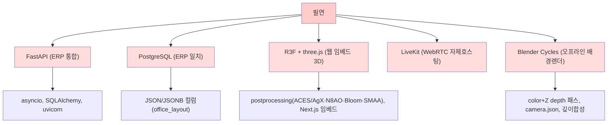

# 11. 기술 스택 결정

> 🟦 **D29 피벗(2026-07-12) — 클라 렌더 스택 재정정(2.5D).** §2.1의 "R3F/three.js 실시간 3D + Blender/깊이합성"은 **폐기**. 현행 클라 렌더 = **2.5D DOM 합성(`OfficeViewport2D`, three.js/R3F/draco 제거)** + 클린플레이트 PNG + 프레임 스프라이트. Colyseus·FastAPI·DB·KPI·ERP·STT 스택은 유지. 정본 = **00-decisions §J(D29)**.

> 🔵 **D28 피벗(2026-07-09) — 클라이언트 렌더 스택 정정.** 가상오피스 클라 = **R3F 실시간 스타일라이즈드 렌더**(저폴리 glb). "Blender Cycles 오프라인 배경렌더 + 깊이합성"은 폐기(Blender/Cycles는 스택에서 제외). Colyseus·FastAPI·DB·스케줄러·보안·KPI·ERP·STT 스택은 유지. 정본 = **00-decisions §I(D28)**.

> ✅ **D27 반영(2026-07-09 재작성) — 포토리얼 웹임베드 스택 확정.** D26(WorkAdventure)은 **전면 폐기**, 그 이전 Godot 네이티브 노선도 폐기. 현행 정본 = 00-decisions §H(D27) · 14-virtual-office-spec · 15-realtime-server-spec · 16-render-spike-and-roadmap · 3d-design/{design-style-analysis, photoreal-web-strategy}. 가상오피스 클라이언트 = react-three-fiber(R3F) + Blender Cycles 오프라인 배경렌더 + 깊이합성, 실시간 서버 = Colyseus(Node/TS). FastAPI/DB/스케줄러/보안/KPI/ERP/STT 스택은 D27에서도 유효하게 보존.


## 문서 개요
- **대상**: 개발팀(L3+), 아키텍처 리뷰어
- **목적**: 가상오피스 플랫폼 기술 스택 확정 및 근거 문서화
- **유효 범위**: 단일 조직(단일 company_id) 도그푸딩 버전
- **버전**: v3.0
- **마지막 갱신**: 2026-07-09 (D27 포토리얼 웹임베드 전환 — §1.2/2.1/2.2/3/4 교체, D26 WorkAdventure 폐기)

> 본 문서의 모든 결정은 **00-decisions.md(정본)** 를 따른다. 충돌 시 정본이 이긴다. 변경 이력은 하단 참조.
>
> ⚠️ **D27 (2026-07-08 확정 / 2026-07-09 문서 반영)**: §2.1(가상오피스 클라이언트)을 R3F + Blender 오프라인렌더 깊이합성으로, §2.2(실시간 서버)를 Colyseus 권위 서버로 교체. WorkAdventure/Phaser/TMJ/OIDC 이중로그인 및 Godot/GDScript 노선 전면 폐기.

---

## 1. 기술 스택 선택 기준

### 1.1 의사결정 원칙

| 원칙 | 설명 |
|-----|------|
| **품질 최우선** | 완성된 MVP가 아닌 스펙 전체를 제대로 구현 |
| **도그푸딩 최적화** | 사내(단일조직) 설치/운영 기준. B2B·멀티테넌트는 이후 |
| **기존 ERP 통합** | Space-Daily(FastAPI + SQLAlchemy + PostgreSQL)와 무결한 양방향 연동 |
| **3D 품질 기준** | Blender Cycles 오프라인 렌더 배경 + R3F 실시간 합성 → 웹 브라우저에서 포토리얼 (D27) |
| **1인 개발 + AI 협업** | 최소한의 팀 규모. 자동화·코드생성·문서화 수용적 |

### 1.2 선택 카테고리 구분

**Mechanical (기술적 필연)**
- ERP 통합을 위해 FastAPI 선택 (언어·ORM·비동기 통일)
- PostgreSQL (ERP와 동일 DB)
- react-three-fiber(R3F) + three.js (웹 임베드 3D 요건 — 별도 앱 없이 브라우저 내 포토리얼, D27)
- Blender Cycles 오프라인 렌더 (배경 포토리얼 품질을 실시간 GPU 부하 없이 확보, D27)
- LiveKit (WebRTC 자체호스팅, Apache-2.0 라이선스)

**Taste (조직 선호)**
- Next.js + TailwindCSS (사내 웹 도구, R3F 캔버스 임베드, TDS 불필요)
- Colyseus (Node/TS 권위 서버 — SkyOffice 이식, MIT. 20Hz tick·이동검증 자체 구현, D27/D1)
- Claude / Gemini (AI KPI 초안. Claude = Anthropic 직원 선호, Gemini = ERP와 통일)

---

## 2. 기술 스택 상세

### 2.1 가상오피스 클라이언트 — 포토리얼 웹임베드 (R3F) ⭐D27

> ⚠️ **D27**: 기존 "WorkAdventure (play) / Phaser 3 / TMJ" 절(D26)을 **전면 폐기**하고 웹 3D(R3F) 임베드로 교체. 그 이전 "Godot 4 Forward+ 네이티브 데스크톱" 노선도 폐기. 정본 = 14-virtual-office-spec · 3d-design/photoreal-web-strategy.

```
Layer          | Component                          | Version  | License        | Why
---------------|------------------------------------|----------|----------------|--------------------------------------------------
렌더 프레임워크| react-three-fiber (R3F)            | 8.17+    | MIT            | React 선언형 three.js. Next.js 캔버스 임베드 (스파이크 실측 ^8.17.10)
3D 코어        | three.js                           | 0.168+   | MIT            | WebGL2 실시간 렌더러 (아바타·상호작용 오브젝트) (스파이크 실측 ^0.168.0)
헬퍼           | @react-three/drei                  | 9.115+   | MIT            | 카메라·컨트롤·로더·환경맵 등 R3F 유틸 (스파이크 실측 ^9.115.0)
포스트프로세싱 | pmndrs/postprocessing              | latest   | MIT            | ACES/AgX 톤매핑 · N8AO(AO) · Bloom · SMAA 파이프라인
배경 렌더      | Blender Cycles (오프라인)          | 4.x      | GPL-3.0(도구)  | color 패스 + Z depth 패스 오프라인 렌더 → 웹은 정지 배경+깊이 합성(camera.json)
아바타         | 경량 GLTF (MakeHuman / CC4)        | glTF 2.0 | 에셋별         | Draco/meshopt + KTX2 압축. **Ready Player Me 금지(2026-01 서비스 종료)**
임베드         | Next.js (App Router) <Canvas>      | 15+      | MIT            | 관리 콘솔과 동일 프론트에 3D 캔버스 임베드
인증           | FastAPI JWT(HS256) 단일세션        | -        | -              | D4 자체 JWT → Colyseus onAuth 검증. OIDC 이중로그인 제거(D27)
```

**깊이합성(Depth Composite) 원리** (D27):
- Blender Cycles가 오피스 배경을 **오프라인 고품질 렌더**(color + Z depth 패스) → 정지 이미지 + 깊이맵으로 서빙
- 카메라 파라미터(직교/투시 행렬)를 `camera.json`으로 export → R3F가 동일 카메라 재현
- three.js 실시간 아바타를 배경 깊이맵과 **픽셀 정확 오클루전 합성** → 아바타가 가구·유리벽 뒤로 자연스럽게 가림
- 실시간 GPU는 아바타·상호작용 오브젝트만 렌더 → 저사양 기기에서도 포토리얼 배경 유지

**웹 최적 에셋 포맷** (D27):
- glTF 2.0 + **Draco / meshopt** 압축 + **KTX2 / Basis Universal** 텍스처(웹 표준)
- (Godot 시절의 `.tscn`/`.pak` 동봉·Draco 금지·VRAM BC 압축은 웹에서 정반대이므로 폐기)

**근거**:
- Gather.town / WorkAdventure(2D): 목표 품질(포토리얼)·통합성(별도 앱·이중로그인) 불일치 → D27 폐기
- Godot 네이티브 데스크톱: 설치형 배포·별도 앱 부담, 웹 임베드 불가 → 폐기
- 실시간 풀 3D 렌더: 배경 포토리얼을 실시간으로 감당하려면 GPU 부하 과다 → 오프라인 렌더+깊이합성 하이브리드로 회피
- **결정**: R3F + Blender Cycles 오프라인렌더 깊이합성 **확정**(D27). 깊이합성 스파이크 **PASS(2026-07-08)**.

---

### 2.2 실시간 서버 — Colyseus 권위 서버 + FastAPI ⭐D27

> ⚠️ **D27**: 기존 "WorkAdventure (back) / map-storage / Room API" 절(D26)을 **전면 폐기**하고 Colyseus 자체 권위 서버로 교체. 그 이전 "Godot 4 헤드리스" 노선도 폐기. 정본 = 15-realtime-server-spec · 09-realtime-collaboration.

```
Layer        | Component                      | Role                | Language   | Why
-------------|--------------------------------|---------------------|------------|----------------------------------
게임서버     | Colyseus                       | 아바타·room 권위    | Node.js/TS | SkyOffice 이식(MIT). 권위 서버, 20Hz tick, 이동 검증 자체 구현
상태 동기화  | Colyseus Schema                | room 상태 델타 동기 | TS         | 바이너리 델타 브로드캐스트(위치·presence), 클라 자동 반영
전송         | WebSocket(WSS)                 | 실시간 채널         | -          | Colyseus 내장 WS 전송 (D1)
상태 캐시    | Redis                          | 세션·room 캐시      | -          | 아바타 위치·room 상태 임시 저장, 멀티프로세스 확장 시 presence
Presence 권위| FastAPI (우리)                 | D13 7종 상태 권위   | Python     | Colyseus room 이벤트 push, 배치 DB 저장 (D3)
인증         | FastAPI JWT → Colyseus onAuth  | 단일세션 검증       | -          | D4 자체 JWT를 onAuth에서 검증, OIDC 이중로그인 제거(D27)
음성/영상    | PeerJS(≤4) → mediasoup/LiveKit | P2P/SFU 미디어      | Node/TS    | 소규모는 PeerJS P2P, 4명 초과 시 mediasoup 또는 LiveKit SFU로 승급
TURN         | coturn                         | WebRTC 릴레이       | C          | TURN-TLS 443 폴백, VPN 없음(D21-r)
```

**Presence vs Attendance 분리** (D13, D3 정신 유지):
- Colyseus = 아바타 이동·room 점유 권위 (20Hz tick, 서버 측 이동 검증)
- FastAPI = D13 presence 7종 권위 (`offline/online/working/meeting/focus/away/external`)
  - Colyseus room 진입/퇴장 이벤트 → FastAPI push → DB 저장 (1~5초 주기)
  - focus/external: Colyseus room 상태로 노출, FastAPI DB 단일 저장
  - away: Colyseus idle 타이머(5분) 이벤트 → FastAPI 전이 (D13)
  - GPS 기반 trip_*/returning 폐기 (D13/D20-c)
- ERP 출퇴근 = ERP read-only (가상오피스 장애가 근태에 영향 없음, 격리 원칙)

**결정**: Colyseus 권위 서버 + FastAPI presence 권위 이중 구조 **확정**(D27). WebSocket(WSS) 내장(D1). 음성/영상은 규모에 따라 PeerJS→mediasoup/LiveKit 승급.

---

### 2.3 백엔드 API (업무/KPI/연동)

```
Framework    | FastAPI
Version      | 0.115+
Language     | Python 3.11+
Async        | asyncio + uvicorn
ORM          | SQLAlchemy async (SQLModel)
DB           | PostgreSQL 17.5+
Auth         | PyJWT (HS256, 자체 시크릿) — D4
Task Queue   | APScheduler + DB 영속 재시도 큐 (D21)
Monitoring   | Prometheus + Grafana + Loki + Uptime Kuma (D21)
```

**근거**:
- **ERP 통일**: Space-Daily는 FastAPI + SQLAlchemy async + PostgreSQL → 동일 스택으로 직접 읽기·쓰기·브랜치 작업 효율↑
- Python 강점: 데이터 파이프라인, AI(Claude/Gemini SDK), 비동기 DB 읽기
- 대안(Rust/Go): 성능 이득 < ERP 통일 비용
- **결정**: FastAPI + SQLAlchemy async **확정**

---

### 2.4 데이터베이스

| 역할 | DB | 버전 | 근거 |
|-----|----|----|------|
| **Primary (우리)** | PostgreSQL | 17.5+ | JSON/JSONB(office_layout), 비동기, ERP와 동일 |
| **Cache (선택)** | Redis | 7.0+ | 캐시용. **배치 재시도 큐는 Redis가 아닌 PostgreSQL 영속 테이블 사용**(D21) |
| **Search** | PostgreSQL fulltext | 17.5+ | **PG fulltext 확정**(D21). Elasticsearch/ELK 배제(1인 운영 규모 초과, B2B 확대 시 재검토) |

**근거**:
- MySQL: JSON 문법 차이, 비동기 드라이버 성숙도↓
- 단일 조직 도그푸딩이므로 샤딩/다중 인스턴스 불필요
- **결정**: PostgreSQL 17.5+ **확정**

---

### 2.5 웹 관리/업무 콘솔

```
Framework    | Next.js (App Router)
Language     | TypeScript
CSS          | TailwindCSS
Version      | Node.js 20+
Hosting      | 사내 VM (도그푸딩)
```

**기능 범위**:
- 대시보드(KPI, 통계)
- 사무실 배치 편집기(Konva.js 2D 전용, 정밀 확인은 데스크톱 draft 모드 — D11)
- 조직도 편집(React Flow)
- 회의록/액션아이템 관리
- 근태/휴가 조회(ERP read-only)
- KPI 검토 & 조정(관리자)

**근거**:
- 사내 도구 → TDS(Toss Design System) 불필요
- React Flow: 조직도 드래그·레이아웃 자동화 → 수동 SVG 편집보다 생산성↑
- Konva.js: 좌석 배치 2D 편집, 다중 선택·변형 지원
- **결정**: Next.js + TailwindCSS **확정**

---

### 2.6 화상회의 (LiveKit)

```
Component     | LiveKit
Deployment    | Self-hosted (사내 VM)
License       | Apache-2.0
Protocol      | WebRTC (STUN/TURN)
Capacity      | 최대 100명(1회의실) 이상 확장 가능
```

**기능**:
- 회의실 스트리밍(카메라·마이크)
- 스크린 공유
- 녹화(선택)
- 회의 메타데이터(참석자, 시간, 상태)

**근거**:
- Jitsi: 경량이나 LiveKit 대비 메타데이터 API↓
- Zoom/Teams: 클라우드 종속, 용역 복잡성
- **자체호스팅(On-Premise)**: 미디어 데이터 주권(회의가 인사평가 근거), ERP·백엔드과 동일 사내망 지연 이점, 단일 SFU 노드로 충분(오토스케일 불필요→1인 운영 부담 경감)
- **LiveKit Cloud 배제**: 민감 미디어 외부 경유, SaaS 구독비, B2B 이후 우선순위
- **신규 AWS 배제**: 데이터 주권, 사내 우선 고려
- **접속 경로**: 재택·하이브리드·외근자는 공개 엔드포인트 직결 + TURN-TLS 443 폴백(VPN 없음, 2026-07-02)
- **결정**: 사내 self-host(LiveKit+coturn Docker), 단일 SFU 확정. LiveKit Cloud·신규 AWS 배제.

---

### 2.6.1 STT 회의록 스택 (D5, 정식 포함)

```
Component     | 역할                        | 후보 / 비고
--------------|-----------------------------|------------------------------------------
LiveKit Egress| 회의 트랙별 오디오 추출     | 화자별 분리 저장(원본 90일 보존, D20(b))
STT 엔진      | 한국어 화자분리 음성→텍스트 | 후보: (a) OpenAI Whisper + pyannote 화자분리(self-host), (b) 클라우드 STT(국외이전 고지 필요), (c) 상용 한국어 STT API
후처리(AI)    | 요약·결정사항·액션아이템    | Claude(기본)/Gemini(대안). 실명→사번 가명화 후 전송(D20(d))
```

- **흐름**: LiveKit Egress → STT(화자분리) → 회의록 초안 자동 생성 → 호스트/참석자 검토·확정(수동 입력은 폴백).
- **컴플라이언스**: 회의 시작 시 전원 고지+동의(D20(b)). 누락률 < 5% 목표(수동 전사 대조 측정, D22).
- **검증**: 스파이크 S2(STT 파이프라인 PoC, 한국어 화자분리 품질 측정)에서 후보 확정.
- **결정**: STT 정식 포함 확정. 엔진 후보는 S2에서 품질·비용·데이터 주권 기준으로 선정.

---

### 2.7 3D 에셋 (모델·텍스처·오디오)

| 에셋 유형 | 도구 | 형식 | 최적화 |
|----------|------|------|--------|
| **배경(오피스 씬)** | Blender Cycles(오프라인 렌더) | PNG(color) + EXR/PNG(depth) + camera.json | 오프라인 고품질 렌더 → 웹 깊이합성 배경(D27) |
| **모델(아바타/상호작용)** | Blender | glTF 2.0 / GLB | Draco/meshopt, glTF-Transform |
| **텍스처** | Blender + CC0 라이브러리 | KTX2 / Basis(웹) + WebP | GPU 압축 KTX2(웹 표준, D27) |
| **소스(외부)** | ambientCG, Poly Haven, Kenney, Quaternius | glTF / OBJ | 원본 저장, CC0 확인 |
| **아바타 소스** | MakeHuman / CC4 | glTF 2.0 | 경량 GLTF. **Ready Player Me 금지(2026-01 종료)** |
| **레지스트리** | asset 테이블(우리 DB) | JSON 메타 | author, license, hash, modified_by |

**근거**:
- 배경은 Blender Cycles 오프라인 렌더로 포토리얼 확보(실시간 GPU 부하 회피), 실시간 3D는 아바타·상호작용 오브젝트만(D27)
- CC0 우선 → 상업 이용/재배포 자유, 귀속표시 간소화
- **웹 최적 포맷**: glTF + **Draco/meshopt + KTX2/Basis**(웹 표준). glTF-Transform으로 메시 최적화·컬러공간 정규화·KTX2 변환 → 로딩시간↓
- **결정**: Blender(배경 오프라인 렌더 + 아바타 glTF) + Draco/meshopt/KTX2 + CC0 **확정**(D27)

---

### 2.8 인공지능 (KPI 초안)

| 용도 | 선택 | 근거 |
|-----|------|------|
| **KPI 평가 초안** | Claude(Anthropic) | 추론 품질, 1인 개발 친화적 |
| **대안** | Gemini | ERP Space-Daily와 통일(현재 사용 중) |

**역할**:
- 업무결과(work_log) + 회의록(meeting_minute) 수집 (외부활동 테이블은 D20-c 폐기로 제외, 2026-07-02)
- 프롬프트: 확정 정량점수 기반 강점/개선/근거 서술 생성(D14-e — AI는 서술만, 정량은 결정론적 코드)
- 출력: ai_draft(텍스트) → kpi_result 저장 → 관리자 검토 & 조정
- **최종이 아닌 초안**: 사유+개선액션 함께 제시, 관리자 개입 필수

**근거**:
- 로컬 LLM(Ollama): 초안 품질 저하, 추론 시간↑ → 야간 배치 3시간 윈도우 한계
- **결정**: Claude(기본) + Gemini(대안) **확정**

---

### 2.9 편집 & 레이아웃 도구 (웹 UI)

| 도구 | 용도 | 라이선스 | 선택 이유 |
|-----|------|---------|----------|
| **Konva.js** | 좌석 배치 2D 편집(드래그, 회전, 다중선택) | MIT | 캔버스 추상화, 이벤트 처리↑ |
| **React Flow** | 조직도 편집(계층, 라인, 색, 레이아웃 자동화) | MIT | 그래프 레이아웃 라이브러리 내장 |
| **Mermaid** | 다이어그램 프리뷰(플로우, ER, 간트) | MIT | 문서 포함 용이 |

**근거**:
- Canvas 직접 작성: 이벤트 처리·변형·대칭이동 번거로움
- **결정**: Konva.js + React Flow **확정**

---

## 3. Mechanical vs Taste 매트릭스

### 3.1 강제 사항 (기술적 필연)



### 3.2 선택 사항 (조직 취향)

```
조직 선호도 | 선택       | 대안              | 결정
-----------|-----------|------------------|--------
높음       | Next.js    | SvelteKit, Remix  | ✓ Next.js (R3F <Canvas> 임베드)
높음       | TailwindCSS| Bootstrap, Pico   | ✓ Tailwind
높음       | Colyseus   | 자체 WS, Nakama, Socket.IO | ✓ Colyseus (SkyOffice 이식, D27)
중간       | Claude     | Gemini, GPT-4     | ✓ Claude(기본)
낮음(선택) | Redis      | Memcached, DragonflyDB | ✓ 선택사항
```

---

## 4. 개발 환경 & 툴체인

### 4.1 로컬 개발 환경

#### 4.1.1 필수 설치

```bash
# 웹 3D 클라이언트 + 실시간 서버 (Node/TS)
Node.js 20+ (npm/pnpm) — Next.js + R3F 클라이언트, Colyseus 서버
Git LFS (대용량 에셋: .blend, .glb, 배경 렌더 PNG/depth)

# 백엔드
Python 3.11+
pip, venv
PostgreSQL 17.5+ (로컬 또는 Docker)
Redis 7.0+ (Colyseus 세션 캐시 / 선택)

# 3D 에셋 제작 + 배경 오프라인 렌더
Blender 4.x (Cycles 오프라인 렌더 color+depth 패스, glTF export, camera.json)

# 공통
Docker / Docker Compose
Git (GitHub private)
```

#### 4.1.2 IDE & 확장

| 역할 | IDE | 확장/플러그인 |
|-----|-----|----|
| **웹 3D (R3F/TS)** | VS Code | TypeScript LSP, ESLint, Prettier, ES7+ React snippets |
| **실시간 서버 (Colyseus/TS)** | VS Code | TypeScript LSP, Colyseus 스키마 도구 |
| **Python** | VS Code / PyCharm | Pylance, FastAPI, SQLAlchemy |
| **SQL** | pgAdmin / DBeaver | PostgreSQL 드라이버 |
| **3D + 배경 렌더** | Blender | glTF-Transform addon, Cycles 렌더, camera export 스크립트 |

---

### 4.2 빌드 & 배포 파이프라인

#### 4.2.1 자동화 도구

```yaml
CI/CD:
  Platform: GitHub Actions (또는 GitLab CI)
  Trigger:
    - 각 단계(Phase) 브랜치 push
    - PR 병합 시 통합 테스트
  
  Job:
    - Python 린트/타입 체크 (ruff, mypy)
    - TypeScript 컴파일 (tsc) — R3F 클라이언트 + Colyseus 서버
    - 유닛테스트 (pytest, vitest)
    - 통합테스트 (API + DB)
    - Next.js 빌드 (R3F 클라이언트 프로덕션 번들)
    - Colyseus 서버 빌드 (tsc / esbuild)
    - 에셋 최적화 체크 (glTF-Transform: Draco/meshopt/KTX2 결과)

Deployment:
  개발: 사내 VM (수동 또는 cron)
  테스트: GitHub Actions 아티팩트
  프로덕션(도그푸딩): 사내 배포 스크립트
```

#### 4.2.2 FastAPI 빌드

```bash
# requirements.txt 의존성
fastapi==0.115+
uvicorn[standard]==0.27+
sqlalchemy==2.0+
sqlmodel==0.0.14+
psycopg[binary]==3.2+
pydantic==2.0+
alembic==1.13+      # DB 마이그레이션
PyJWT==2.9+         # JWT (HS256, 자체 시크릿). python-jose는 유지보수 중단·CVE로 폐기 (D4)
apscheduler==3.10+  # 배치 스케줄 (Celery 미사용, DB 영속 재시도 큐 병행) — D21
anthropic==0.20+    # Claude SDK
google-generativeai==0.3+  # Gemini SDK (대안)
aiosqlite==0.19+    # async SQLite (테스트용)

# 빌드
pip install -r requirements.txt
alembic upgrade head  # DB 마이그레이션
uvicorn app.main:app --host 0.0.0.0 --port 8000
```

#### 4.2.3 Next.js 빌드

```bash
npm install
npm run build
npm run start      # 프로덕션 서버
# 또는 PM2로 관리
pm2 start "npm run start" --name "voffice-web"
```

#### 4.2.4 Colyseus 실시간 서버 빌드 (Node/TS)

```bash
# 의존성 설치
npm install   # colyseus, @colyseus/schema, @colyseus/redis-driver 등

# 빌드 & 기동
npm run build          # tsc / esbuild → dist/
node dist/index.js     # 또는 PM2: pm2 start "node dist/index.js" --name "voffice-colyseus"
```

#### 4.2.4.1 3D 에셋 파이프라인 (웹 최적화 + 배경 렌더)

```bash
# 아바타/오브젝트 glTF 웹 최적화 (Draco/meshopt + KTX2)
gltf-transform optimize model.gltf model-opt.glb \
  --compress draco --texture-compress ktx2

# 배경 오프라인 렌더 (Blender Cycles, color + depth 패스)
blender office.blend --background --python render_bg.py \
  # 출력: office_bg.png, office_depth.png, camera.json
```

#### 4.2.5 데이터베이스 마이그레이션

```bash
# Alembic 초기화 (이미 완료)
# alembic init alembic

# 마이그레이션 생성
alembic revision --autogenerate -m "Add kpi_results table"

# 적용
alembic upgrade head

# 롤백
alembic downgrade -1
```

---

### 4.3 자동 업데이트 & 버전 관리

#### 4.3.1 클라이언트 자동 업데이트 (웹 — 무설치)

D27 클라이언트는 **웹 앱(Next.js + R3F)** 이므로 설치형 바이너리 자동 업데이트가 불필요하다. 새 버전은 서버 배포 시 다음 로드/새로고침에서 자동 반영된다.

```ts
// 무중단 반영 (서비스워커/버전 감지, 선택)
// 1. Next.js 빌드 → 버전 해시가 붙은 정적 청크 배포
// 2. 서비스워커가 새 빌드 감지 → 사용자에게 "새로고침" 프롬프트
// 3. 3D 씬 활성 중이면 세션 유휴 시점에 리로드
```

**규칙**:
- 웹 배포이므로 클라이언트 바이너리 배포·체크섬·델타 패치 불필요
- 정적 에셋(glTF/KTX2/배경 렌더)은 콘텐츠 해시 캐시버스팅 + CDN/사내 서빙
- Colyseus 서버는 §4.3.2 무중단 업데이트 절차 적용

#### 4.3.2 서버 무중단 업데이트

```bash
# Blue-Green 배포
1. 신 서버(Green) 기동
2. 로드밸런서(Nginx) 라우팅 전환
3. 구 서버(Blue) 종료

# 또는 롤링 업데이트 (Kubernetes 없이)
1. API 게이트웨이: 신규 연결만 Green으로
2. 기존 연결 drain (timeout 60초)
3. Blue 배포 완료 → 상태 동기화
```

#### 4.3.3 의존성 업데이트

| 주기 | 항목 | 전략 |
|-----|------|------|
| **주 1회** | Python 보안 패치 | dependabot 또는 pip-audit |
| **월 1회** | FastAPI, SQLAlchemy, three.js/R3F, Colyseus minor | 호환성 테스트 후 적용 |
| **분기 1회** | Node.js, Next.js, Tailwind | 브랜치별 테스트 |
| **긴급** | 보안 취약점 | 즉시 패치 후 재배포 |

---

### 4.4 로깅 & 모니터링

#### 4.4.1 애플리케이션 로그

```python
# FastAPI
import logging
logger = logging.getLogger("voffice")
logger.info("User connected", extra={"user_id": uid})
logger.error("DB sync failed", exc_info=True)

# 구조화 로그 (JSON)
import structlog
structlog.configure(...)
logger = structlog.get_logger()
```

**수집**:
- 로컬 파일 → rsyslog → **Loki** 중앙화 (D21). ELK는 폐기(1인 운영 규모 초과)

#### 4.4.2 메트릭 (Prometheus 선택)

```
voffice_api_requests_total{endpoint, method, status}
voffice_db_query_duration_seconds
voffice_presence_active_users
voffice_meeting_concurrent_count
voffice_kpi_generation_duration_seconds
```

#### 4.4.3 웹 클라이언트 로그 (R3F/브라우저)

```ts
// 원격 로깅 (선택) — 브라우저 R3F 클라이언트
function reportError(error: Error) {
  const payload = {
    user_id: currentUserId,
    error: error.message,
    version: BUILD_VERSION,
    ua: navigator.userAgent,
    webgl: gl.getParameter(gl.RENDERER),  // GPU/드라이버 식별
    timestamp: Date.now(),
  };
  navigator.sendBeacon("/api/client-logs", JSON.stringify(payload));
}
```

---

## 5. 라이선스 요약

| 컴포넌트 | 라이선스 | 커머셜 사용 | 귀속표시 | 수정 재배포 |
|---------|---------|-----------|---------|----------|
| three.js / R3F / drei | MIT | ✓ | ✓ | ✓ |
| pmndrs/postprocessing | MIT | ✓ | ✓ | ✓ |
| Colyseus / Colyseus Schema | MIT | ✓ | ✓ | ✓ |
| FastAPI | MIT | ✓ | ✓ | ✓ |
| SQLAlchemy | MIT | ✓ | ✓ | ✓ |
| PostgreSQL | PostgreSQL License | ✓ | ✓ (문서) | ✓ |
| Next.js | MIT | ✓ | ✓ | ✓ |
| TailwindCSS | MIT | ✓ | ✓ | ✓ |
| LiveKit | Apache-2.0 | ✓ | ✓ | ✓ |
| Konva.js | MIT | ✓ | ✓ | ✓ |
| React Flow | MIT | ✓ | ✓ | ✓ |
| Blender | GPL-3.0 | ✓ | ✓ (수정건) | ✓ (GPL 준수) |
| Claude API | Anthropic ToS | ✓ | ✓ (계약) | N/A |
| Gemini API | Google ToS | ✓ | ✓ (계약) | N/A |

**주의**:
- Blender는 GPL-3.0 → 에셋 자체는 라이선스 불리지 않음(Blender 소스 수정 시만)
- Claude/Gemini는 API 계약상 사용료 발생 가능 (도그푸딩 시점에는 내부 협상)

---

## 6. 기술 리스크 & 완화

| 리스크 | 영향도 | 완화 방안 |
|-------|-------|---------|
| **깊이합성 정확도 (아바타 오클루전 오차)** | 높음 | 깊이합성 스파이크 PASS(2026-07-08). camera.json 행렬 정합 검증, depth 패스 정밀도(EXR) 확보, 대안(빌보드 스프라이트/부분 실시간 3D) |
| **웹 3D 성능 (저사양 GPU/모바일)** | 중간 | 배경 오프라인 렌더로 실시간 부하 최소화, postprocessing LOD·SMAA 조정, 인스턴싱, KTX2 텍스처로 VRAM↓ |
| **PostgreSQL 성능 (>1M presence 업데이트/초)** | 중간 | Redis 캐시, 배치 쓰기, 파티셔닝(필요시) |
| **ERP 의존 (direct DB 접근)** | 높음 | read-only 계정, 브랜치·마이그레이션 검증, 테스트 DB 사본 |
| **LiveKit/mediasoup 확장성 (회의 참석 대규모)** | 낮음(도그푸딩) | PeerJS(≤4)→SFU 승급, 사내 인프라 여유 |
| **AI KPI 평가 편향** | 중간 | 프롬프트 검증, 관리자 검토 필수, 이의신청 절차 |
| **Colyseus 서버 무중단 배포** | 낮음 | Redis 세션 캐시, room drain 후 롤링 재기동(§4.3.2) |

---

## 7. 차기 단계별 기술 결정

### 7.1 현재 (단일 조직, 도그푸딩)

- **선택 확정**: 위 섹션 1~4 참조
- **우선순위**: 품질, 속도(1인 개발)

### 7.2 이후 Phase (B2B, 멀티테넌트)

| Phase | 추가 기술 | 이유 |
|-------|----------|------|
| **Phase 8 (B2B 준비)** | Kubernetes(도커 오케스트레이션) | 멀티테넌트 격리, 자동 스케일링 |
| | Stripe / Toss Payments API | 결제 처리 |
| | Datadog / NewRelic | 대규모 모니터링 |
| **Phase 9 (B2B 배포)** | mediasoup / LiveKit SFU 확장 | 대규모 동시 회의(>4) 미디어 확장 |
| | Colyseus 멀티프로세스(@colyseus/redis-driver) | 멀티테넌트 room 샤딩·수평 확장 |
| | S3 / GCS | 에셋 및 회의 녹화 저장 |

> ⚠️ **정정(D27)**: 웹 3D(R3F + three.js)는 더 이상 "미래 Phase 9 경량 뷰어"가 아니라 **v1 본체 가상오피스 클라이언트**다(§2.1). 과거 "Phase 9 Three.js 웹 경량 뷰어" 배치는 Godot 네이티브를 본체로 가정한 것이라 D27과 모순 → 본체로 이동, 미래 항목에서 제거.

---

## 8. 기술 스택 체크리스트

### 마이그레이션 또는 변경 불가 항목

- [ ] R3F/three.js → 네이티브 엔진(Godot/Unity)으로 회귀 안 함 (웹 임베드·무설치 장점 상실, D27)
- [ ] 배경 실시간 풀 3D 렌더로 전환 안 함 (오프라인 렌더+깊이합성이 포토리얼/성능 균형, D27)
- [ ] FastAPI → Node.js로 변경 안 함 (ERP 통합 장점 상실)
- [ ] PostgreSQL → MySQL로 변경 안 함 (JSON 문법, 비동기 지원)

### 검증 항목

- [ ] ERP private repo 브랜치(`feature/virtual-office-integration`) 신설 및 kpi_results 테이블·Alembic 마이그레이션·KPI 수신 엔드포인트·연동용 서비스계정 작업 (사내 저장소 접근권 확보, 직접 작업 수행)
- [x] **깊이합성 스파이크 (Phase 0, 최우선) — PASS(2026-07-08)** — Blender 직교/투시 카메라 행렬 export(camera.json) → R3F 재현 → 아바타가 가구·유리벽 뒤 픽셀정확 가림 검증. spikes/depth-composite 참조
- [ ] R3F + postprocessing(ACES/AgX·N8AO·Bloom·SMAA) 로비 샘플 렌더 품질 확인
- [ ] Colyseus 20Hz tick + Colyseus Schema 이동 동기화 프로토타입(SkyOffice 이식) 확인
- [ ] FastAPI + PostgreSQL + asyncio 프로토타입 테스트 완료
- [ ] Next.js + Konva.js 좌석편집 UI 프로토타입 완료
- [ ] LiveKit self-host 배포 가능성 확인 (사내 네트워크)
- [ ] **STT 파이프라인 PoC (스파이크 S2, D5)** — LiveKit Egress → STT(한국어 화자분리) → 회의록 초안 품질 측정. 엔진 후보 선정
- [ ] Claude / Gemini API 접근 권한 확보 (내부 계약)

> ⚠️ **폐기(D27)**: 스파이크 S1(Godot↔LiveKit GDScript 수신 PoC)·S3(GDScript 헤드리스 + PhysicsServer3D 부하)는 Godot 노선 폐기와 함께 제거. 이동 서버 검증은 Colyseus 프로토타입으로, 렌더 검증은 깊이합성 스파이크(PASS)로 대체.

### 문서화 항목

- [ ] 각 컴포넌트별 설정 가이드 작성 (docs/setup/)
- [ ] 의존성 버전 호환성 매트릭스 작성
- [ ] 개발 환경 Docker Compose 배포 파일 작성
- [ ] GitHub Actions 워크플로우 정의 (.github/workflows/)

---

## 9. 참고 문서 및 외부 자료

### 공식 문서

- react-three-fiber: https://docs.pmnd.rs/react-three-fiber
- three.js: https://threejs.org/docs/
- @react-three/drei: https://github.com/pmndrs/drei
- pmndrs/postprocessing: https://github.com/pmndrs/postprocessing
- Colyseus: https://docs.colyseus.io/
- Blender Cycles: https://docs.blender.org/manual/en/latest/render/cycles/
- FastAPI: https://fastapi.tiangolo.com/
- SQLAlchemy: https://www.sqlalchemy.org/
- PostgreSQL: https://www.postgresql.org/docs/
- Next.js: https://nextjs.org/docs
- TailwindCSS: https://tailwindcss.com/docs
- LiveKit: https://docs.livekit.io/
- Konva.js: https://konvajs.org/
- React Flow: https://reactflow.dev/

### 사내 참고

- **ERP (Space-Daily)**: https://github.com/project-space-daily/space-daily (private)
  - 동기화 소스 테이블: users, teams, job_positions, attendances, leaves
  - 쓰기 엔드포인트: POST /api/reports (daily_reports)
  - 신규 엔드포인트: POST /api/kpi-results (dev 브랜치에서 구현 예정)

- **가상오피스 기획**: docs/planning/01-prd.md (PRD) + v3.2 개발기획서(사용자 제공)

---

## Loop Metadata

### Upstream Documents Referenced
- **v3.2 개발기획서** (사용자 제공)
- **01-prd.md** (프로젝트 개요)
- **10-roadmap.md** (로드맵·목표)
- **03-erp-integration.md** (ERP 연동 설계)
- **04-data-model.md** (스키마 정의)

### Downstream Documents Affected
- **10-roadmap.md** (각 Phase 기술 결정 반영)
- **12-tasks.md** (개발 환경 구성·셋업 태스크)
- **03-erp-integration.md** (FastAPI 엔드포인트·연동 계약)
- **02-trd-architecture.md** (빌드·배포·전체 아키텍처)

### Open Questions
- Q1: Elasticsearch 도입 필요성? (**확정: 배제**, D21)
  - A: **PostgreSQL fulltext search 확정**. ELK/Elasticsearch는 1인 운영 규모 초과로 배제. B2B 확대 시 재검토.
- Q2: Redis vs DragonflyDB vs Memcached?
  - A: Redis 7.0+ 표준. DragonflyDB 성능 이득 미미, Memcached는 persistence 부족.
- Q3: 클라이언트 자동 업데이트 구현 일정?
  - A: **불요(D27)**. 웹 클라이언트(Next.js+R3F)는 배포 시 다음 로드에서 자동 반영 → 설치형 바이너리 자동 업데이트 로직 제거(§4.3.1).

### Assumptions
1. ERP(Space-Daily) private repo에 접근 가능하며, dev 브랜치 권한 있음
2. 사내 네트워크에서 PostgreSQL, Redis, LiveKit 자체호스팅 가능
3. three.js/R3F/Colyseus(MIT) 무료 라이선스 지속 → 클라이언트·서버 라이선스 비용 없음
4. Claude / Gemini API는 내부 계약으로 접근 가능 (요청 시 협상)
5. 1인 개발 + AI 협업 환경 지속 (정규 팀 증원 없음)

### Validation Criteria
- [ ] 모든 컴포넌트 라이선스 호환성 법무 검수 완료
- [x] R3F + Blender 깊이합성으로 아바타 오클루전 픽셀정확 확인 (스파이크 PASS, 2026-07-08)
- [ ] R3F + postprocessing 로비 샘플 렌더 품질·프레임레이트 확인
- [ ] Colyseus 20Hz tick 이동 동기화 지연·정합 확인
- [ ] FastAPI + PostgreSQL async 성능 벤치마크(>100 동시 presence)
- [ ] Next.js + Konva.js 좌석 편집 UI 반응속도 < 100ms
- [ ] LiveKit self-host 회의 용량 확인(사내 테스트)
- [ ] ERP 읽기(read-only DB) + 쓰기(API + 신규 테이블) 통합 테스트 완료

### Risks & Mitigation
| Risk | Probability | Impact | Mitigation |
|------|-------------|--------|-----------|
| 깊이합성 오클루전 오차 | Low(스파이크 PASS) | High | camera.json 행렬 정합·EXR depth 정밀도, 대안(빌보드/부분 실시간 3D) |
| 웹 3D 저사양 기기 성능 저하 | Medium | Medium | 배경 오프라인 렌더로 실시간 부하 최소, LOD·인스턴싱·KTX2 |
| PostgreSQL 성능 저하(>10M 행) | Medium | Medium | 인덱싱, 쿼리 최적화, 파티셔닝(필요시) |
| ERP 브랜치 병합 지연 | Low | High | 미리 검증, 문서화, 담당자 공조 |
| Claude API 비용 초과 | Low | Medium | 쿼터 설정, 모니터링, Gemini 대안 사용 |
| LiveKit 자체호스팅 장애 | Low | High | 이중화 구성(선택), 모니터링 알림 |

---

## 변경 이력

| 버전 | 일자 | 변경 내용 |
|------|------|-----------|
| v1.0 | 2026-07-01 | 최초 작성 |
| v1.1 | 2026-07-02 | 00-decisions.md v1.0 정합 반영 — D1(ENet/WebSocket→WSS 확정), D2(GDScript 확정·C# 표기 제거), D3(게임서버 메모리 권위+FastAPI 경유 배치 push), D4(PyJWT·자체 시크릿 HS256), D5(STT 회의록 스택 §2.6.1 신설), D13(프레즌스 6종→7종·external 추가), D21(사내 VM·관측 Grafana/Prometheus/Loki/Uptime Kuma·APScheduler+DB 영속 재시도 큐·검색 PG fulltext 확정/ELK 배제), 버전 정정(FastAPI 3.0+→0.115+, python-jose→PyJWT), Godot 4 export 명령 정정(--export-release, --standalone-mode 제거), 검증 항목에 스파이크 S1(Godot↔LiveKit 수신 PoC)·S2(STT)·S3(헤드리스 부하) 추가 |
| v1.2 | 2026-07-02 | 정합 패치 — 배치 편집기 Konva.js 2D 전용·정밀 확인은 데스크톱 draft 모드(D11), KPI 입력에서 external_activities 제외(D20-c 폐기)·프롬프트를 서술 생성으로 한정(D14-e), "EOD 배치 33시간"→야간 배치 3시간 윈도우 오타 정정, Godot 버전 표기 "4.3+ 안정 버전(LTS 채널 없음)" 통일, LiveKit 접속 경로 공개 엔드포인트 직결+TURN-TLS 443 폴백(VPN 없음 확정) |
| v2.0 | 2026-07-06 | **D26** — §2.1(3D 클라이언트)·§2.2(실시간 서버)를 WorkAdventure self-host 스택으로 교체, Godot/GDScript 노선 보류 (이후 D27로 전면 폐기) |
| v3.0 | 2026-07-09 | **D27 포토리얼 웹임베드 전환(2026-07-08 확정) — D26 WorkAdventure 전면 폐기.** §1.1/1.2 Mechanical 매트릭스에서 "Godot 4 유일 선택지"·GDScript 제거 → R3F/three.js·Blender Cycles·Colyseus로 교체. §2.1 클라이언트 = react-three-fiber + three.js + drei + pmndrs/postprocessing(ACES/AgX·N8AO·Bloom·SMAA) + Blender Cycles 오프라인 배경렌더(color+Z depth, camera.json) 깊이합성 + Next.js 임베드, 아바타 경량 GLTF(MakeHuman/CC4, Ready Player Me 금지). §2.2 실시간 서버 = Colyseus(Node/TS, SkyOffice 이식) 권위 서버 20Hz tick·Colyseus Schema·PeerJS→mediasoup/LiveKit 미디어, 인증 FastAPI JWT→onAuth(OIDC 이중로그인 제거). §2.7 에셋 = Draco/meshopt+KTX2/Basis 웹 포맷 + 배경 오프라인 렌더. §3 mermaid·§3.2 매트릭스, §4 개발환경(Godot/GDScript IDE·빌드커맨드 제거, Colyseus/에셋 파이프라인·웹 무설치 자동반영·R3F 클라 로그로 교체), §5 라이선스(Godot→three.js/Colyseus), §6 리스크(Godot 버그→깊이합성/웹3D 성능), §7.2 Phase9 "Three.js 미래 뷰어" 모순 정정(v1 본체로 이동)·미종결 괄호 오타 수정, §8 검증(S1/S3 Godot 스파이크 폐기, 깊이합성 스파이크 PASS 반영), §9 참고문서·Loop Metadata 갱신. FastAPI/DB/스케줄러/보안(PyJWT)/KPI·ERP·STT(§2.3~2.6.1·2.8·2.9) 스택은 D27 유효분으로 보존 |

---

**Document Version**: 3.0  
**Last Updated**: 2026-07-09  
**Authored By**: Documentation Specialist  
**Status**: 확정 (D27 포토리얼 웹임베드 전환 반영 — 00-decisions §H 정합)
