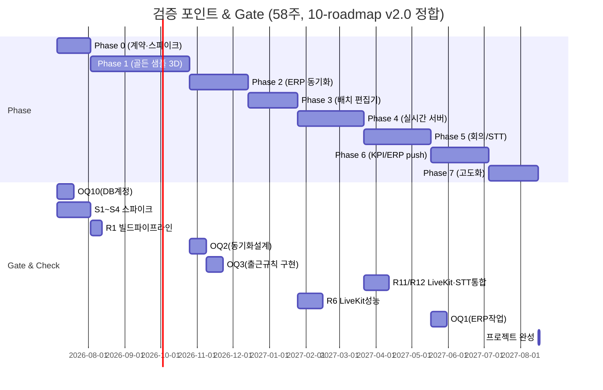
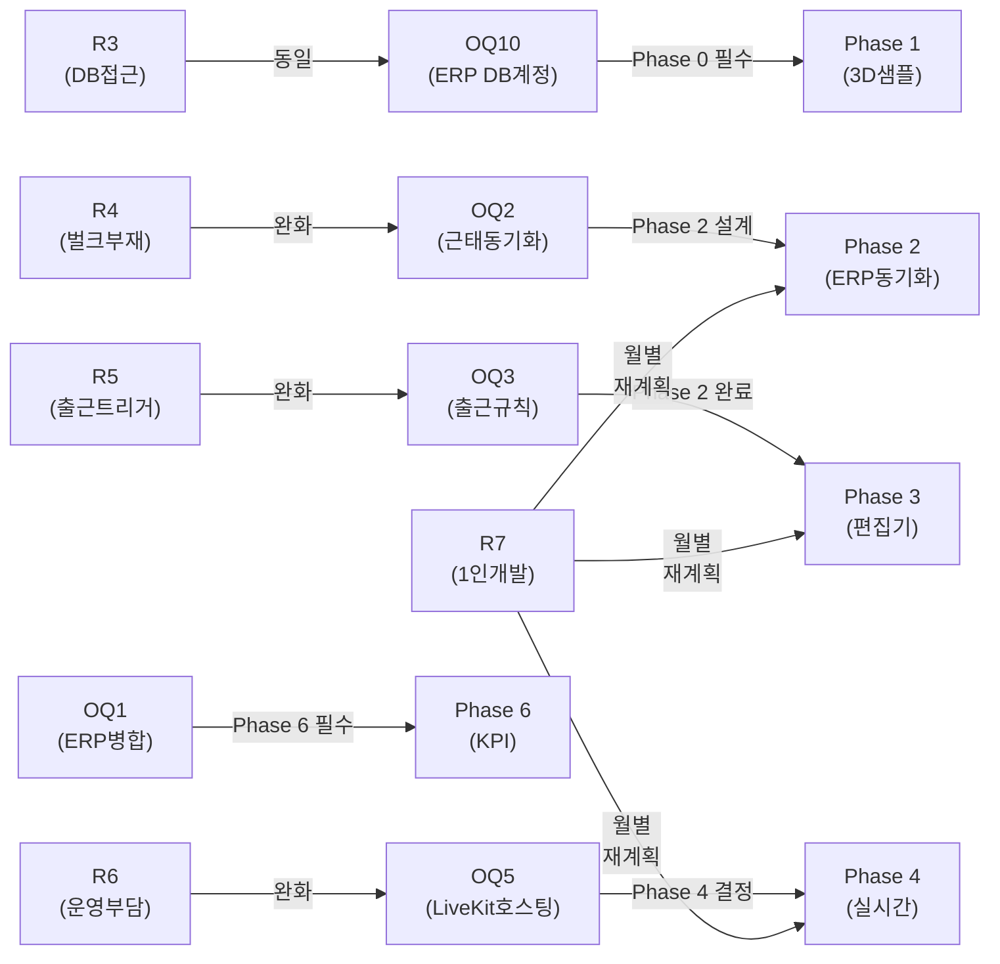

# 13. 리스크 & 오픈 이슈

**문서 버전**: v3.3  
**작성일**: 2026-07-02  
**대상 독자**: 개발/기획 리더십, 이해관계자  
**정본 기준**: `00-decisions.md` (D1~D25, F절) — 충돌 시 정본이 우선

> **변경 요약 (v3.3, 2026-07-02)**: OQ4(프로토콜)→WebSocket(WSS) 확정 종결(D1), OQ11(회의실 예약)→예약+FCFS 병행 확정(D23)·A7 가정 폐기, 이미 확정된 OQ3/OQ5 등 스테일 정리. 신규 리스크 4건 추가(R11 Godot-LiveKit 통합, R12 STT 정확도/한국어 화자분리, R13 개인정보/노동법, R14 클라-서버 프로토콜 버전 호환). 검증 간트를 10-roadmap 58주 재산정의 기준선(D6)으로 정합.

---

## 개요

본 문서는 가상오피스 운영 플랫폼 개발 과정에서 식별된 주요 리스크, 미해결 설계 결정(Open Questions), 명시적 가정(Assumptions), 그리고 검증 계획을 정리합니다.

프로젝트 특성상 1인 개발 + AI 협업, ERP 기존 시스템 의존도 높음, Godot 3D 네이티브 배포, 사내 자체 호스팅 등 여러 기술·조직 리스크가 존재합니다. 이를 조기에 식별하고 완화 전략을 수립하여 Phase별 차질을 최소화하는 것이 목표입니다.

---

## 1. 리스크 표

| # | 리스크명 | 영향도 | 확률 | 시간(주) | 완화 전략 | 담당 | 상태 |
|---|---------|--------|------|---------|---------|------|------|
| R1 | **Godot 크로스플랫폼 빌드 복잡성** | 높음 | 중 | 1~2 | Phase 1부터 네이티브 빌드 CI/CD 준비; 윈도우만 우선 검증 | backend-specialist + 3d-engine-specialist | OPEN |
| R2 | **자동 업데이트 메커니즘 미정** | 높음 | 높음 | 1 | Phase 6~7에 업데이트 전략 정의 — 배포 경로는 사내 배포 서버로 방향 확정(D8/D21-r 정합, 2026-07-02), 세부 구현만 미결 | DevOps 역할 필요 (외주 또는 1인 담당) | OPEN |
| R3 | **ERP DB 접근 프로비저닝 지연** | 중 | 중 | 0.5 | Phase 1 전 read-only 계정 생성; DBA 조율 필요 | 인프라 담당자 | BLOCKED |
| R4 | **ERP 근태 벌크 조회 API 부재** | 중 | 확정 | 2 | 초기 동기화는 DB 직접 접근; 실시간은 trigger/CDC 고려 또는 정기 배치 | backend-specialist | MITIGATED |
| R5 | **3D 출근 ↔ ERP 출퇴근 연결 규칙 미결** | 중 | 높음 | 2 | OQ3 결정으로 분리 확정: 3D 프레즌스(로그인·좌석·회의실)는 우리 소유, ERP 출퇴근은 read-only | 기획 + backend-specialist | MITIGATED |
| R6 | **LiveKit self-host 운영 부담** | 중 | 중 | 4~8 | OQ5 확정(self-host): Phase 4 중 성능 테스트(10명 동시), 모니터링(Prometheus+Grafana), 단일 SFU로 오토스케일 불필요 | DevOps/인프라담당자 | MITIGATED |
| R7 | **1인 개발 순서 병목** | 높음 | 높음 | 연중 | AI 협업 강화; Phase 병렬화 불가; 외주/계약인력 고려; 스코프 재검토 포인트 설정 | PM/기획 | ONGOING |
| R8 | **ERP 스키마 드리프트** | 중 | 중 | 연중 | ERP main 브랜치 변경 모니터; Feature branch (feature/virtual-office-integration)는 독립 유지; 정기 동기화 체크 | backend-specialist | MITIGATED |
| R9 | **사번(社番) 부재로 인한 식별 footgun** | 중 | 높음 | 1 | ERP users.id를 PK로 사용; email은 (company_id, email) 복합 유니크만 신뢰 | backend-specialist | MITIGATED |
| R10 | **Email 재사용 시 신원 충돌** | 낮음 | 중 | 1 | 퇴사자 처리 정책 수립; soft-delete 또는 archive 전략; 다중테넌트 확장 시 재검토 | HR + backend-specialist | OPEN |
| R11 | **Godot ↔ LiveKit 통합** | 높음 | 높음 | 2~4 | 공식 SDK 부재, WebRTC GDExtension 자체 개발 → **완화**: Phase 0 스파이크 S1 PoC + 임베디드 브라우저 폴백 | 3d-engine-specialist | OPEN |
| R12 | **STT 정확도 / 한국어 화자분리** | 높음 | 중 | 2~3 | 회의록 자동 초안 품질·화자분리 미달 → **완화**: Phase 0 스파이크 S2 PoC, 누락률 <5% 미달 시 수동 회의록 + AI 요약으로 격하 | backend-specialist | OPEN |
| R13 | **개인정보 / 노동법 (모니터링·녹음·외부 LLM)** | 높음 | 높음 | 연중 | 평가 목적 행동 데이터·회의 녹음·외부 LLM 전송 → **완화**: D20 컴플라이언스 원칙(고지·동의 절차, 사번 가명화, 보존기한, 최소수집 VIEW) 도입 전 이행 | PM/기획 + backend-specialist | OPEN |
| R14 | **클라-서버 프로토콜 버전 호환** | 중 | 중 | 1 | 클라이언트 자동 업데이트와 서버 배포 시점 불일치 → **완화**: D4 핸드셰이크 `protocol_version` 협상(미지원 버전 거부 + 업데이트 안내) | 3d-engine-specialist + backend-specialist | MITIGATED |

### 주요 리스크 상세

#### R1: Godot 크로스플랫폼 빌드 복잡성
- **선택**: Godot 4 네이티브 데스크톱(Forward+)만 확정. 웹(WASM) export 배제.
- **근거**: 최고 품질 목표 + 사내 설치 가능(배포 용이).
- **리스크**: 한 플랫폼(윈도우)만 검증한 상태에서 macOS/Linux 지원 요청 시 큰 폭의 재작업 필요.
- **완화**:
  1. Phase 1 샘플 완성 후 즉시 윈도우 빌드 파이프라인 검증.
  2. GitHub Actions (또는 사내 CI)로 자동화.
  3. Godot 포럼·커뮤니티 선제적 조사.
  4. 멀티플랫폼 요청 시 Phase 7(고도화) 이후로 명시.

#### R2: 자동 업데이트 메커니즘 미정
- **상황**: 네이티브 데스크톱 배포 시 자동 업데이트(OTA, Over-The-Air)가 표준.
- **방향 확정(2026-07-02)**: 배포 경로는 **사내 배포 서버**(D8/D21-r 정합) — 세부 구현만 미결.
- **미결정**: 
  - 버전 관리 및 롤백 정책.
  - 보안 서명 및 체크섬 검증.
- **영향**: 유저 경험(수동 재설치 불편) 및 보안(unsigned 바이너리 배포 리스크).
- **완화**:
  1. Phase 6 KPI 및 Phase 7 고도화 중 업데이트 전략 정의.
  2. 초기(Phase 1~5): 수동 배포 허용 (사내 도그푸딩이므로 유저 수 적음).
  3. Godot 에코시스템 솔루션 조사 (예: godot-bootstrap-updater, GitHub Actions).

#### R3: ERP DB 접근 프로비저닝 지연
- **선택**: 근태 벌크 동기화를 위해 ERP PostgreSQL (dailylog DB)에 read-only 계정 필요.
- **리스크**: DBA/인프라 담당자 스케줄 밀림 → Phase 1 착수 지연.
- **완화**:
  1. 즉시 인프라 담당자와 조율; 사전 준비 (계정 생성, 네트워크 규칙).
  2. Fallback: 초기는 ERP API (GET /api/users, /api/teams, /api/positions)로만 동기화하고, 근태는 당일 ERP 관리자 수동 입력 대기.

#### R4: ERP 근태 벌크 조회 API 부재
- **사실**: ERP GET /api/attendance/admin/record?user_id=&date= 는 **단건 조회만 지원** (벌크 없음).
- **선택**: 근태 벌크는 **read-only DB 직접 접근** (attendances 테이블).
- **완화**:
  1. Phase 2에 동기화 스크립트 작성 (SELECT user_id, attendance_date, check_in_at, check_out_at, work_type FROM attendances WHERE attendance_date >= ? AND attendance_date <= ? AND company_id = ?). (컬럼명 라이브 검증 2026-07-02)
  2. 실시간 vs 배치: **매시간 증분 + 매일 00:00 전체 대사(D18)**. 18:00은 daily_reports push(D17)로 별개 프로세스(2026-07-02 정정). 향후 PostgreSQL trigger 또는 변경데이터캡처(CDC) 고려.
  3. 시간대: ERP 시간대(KST)와 우리 시간대 일치 확인.

#### R5: 3D 출근 ↔ ERP 출퇴근 연결 규칙 미결
- **결정(2026-07-01)**: OQ3 확정으로 분리 규칙 확정됨.
- **규칙**:
  - **공식 출퇴근(ERP attendances)**: ERP 원본, 우리는 read-only 읽기만 (check_in/check_out 기록 쓰지 않음)
  - **3D 프레즌스(우리 소유 트리거)**:
    - 3D 클라 로그인 → online
    - 지정 좌석/팀 구역 도착 → working
    - 회의실 입장 → meeting
    - N분 무입력 → away
    - 집중모드 토글 → focus
    - 종료/로그아웃 → offline
  - **3D 화면**: ERP 오늘 check_in된 직원을 read로 병기 반영
- **근거**: 스펙 장애 격리 원칙(가상오피스 장애가 근태/업무 데이터 영향 없음), 근태=읽기 원칙, 원본 명확화
- **완화**: OQ3 결정으로 분리 확정 완료. Phase 2부터 분리된 로직 구현 시작.

#### R6: LiveKit self-host 운영 부담
- **결정(2026-07-01)**: OQ5 확정으로 호스팅 환경 확정됨.
- **선택**: LiveKit + coturn self-host (Docker Compose), 사내 통제 인프라(온프렘 VM 또는 사내 클라우드 계정).
- **네트워크**:
  - 재택/하이브리드/외근: 공개 엔드포인트 직결(UDP) + TURN-TLS 443 폴백 (VPN 없음 확정 2026-07-02).
- **배제**:
  - LiveKit Cloud (SaaS, 민감 미디어 외부 경유, 구독비, B2B 이후).
  - 순수 신규 AWS (데이터 주권, 사내 우선 고려 시 후순위).
- **근거**: 미디어 데이터 주권(회의가 인사평가 근거 연결), ERP/백엔드와 동일 사내망 지연 이점, 규모상 단일 SFU 노드로 충분(오토스케일 불필요→1인 운영 부담 낮음).
- **완화**:
  1. Phase 4 중반에 성능 테스트 (10명 동시 회의).
  2. 모니터링: Prometheus + Grafana 기본 구성.
  3. 초기(Phase 1~5)는 Docker Compose로 테스트; Phase 6 이후 프로덕션 안정화.
  4. 종결(2026-07-02): VPN 없음 → 공개 엔드포인트.

#### R7: 1인 개발 순서 병목
- **핵심 리스크**: 가장 높은 우선순위.
- **현황**: 1인 개발 + AI 협업, Phase 0~7 순차 로드맵.
- **병목 시나리오**:
  - Phase 1 (샘플 3D) 완료 예상 **12주(약 3개월)** — 10-roadmap v2.0(58주 재산정)의 Phase 1 = 12주와 **일치**. 지연 시 Phase 2~3 전체 미룬다.
  - Godot + FastAPI + Next.js 삼중 스택 동시 개발 불가 → **Phase 순차 원칙**(병렬화 없음).
  - ERP 연동 의존도 높음 (Phase 2 필수).
- **완화**:
  1. **재계획 포인트**: Phase 1 완료 후 실제 속도 측정 → Phase 2~7 scope 재조정 (feature cut).
  2. **병렬화**: Phase 0 (테스트 계약, API 설계)은 3D 개발과 독립; 동시 진행 가능.
  3. **AI 협업 강화**: 반복적 작업(CRUD API, 테스트, 문서)은 AI 자동화, 1인은 아키텍처·의사결정 집중.
  4. **외주 고려**: Phase 3+ (사무실 편집기) 또는 Phase 4 (LiveKit 통합) 등 명확한 컴포넌트는 계약인력 투입 검토.
  5. **스코프 명확화**: Phase 7 고도화에서 모바일·멀티테넌트는 제외 선언 (v3.3 이후).

#### R8: ERP 스키마 드리프트
- **상황**: ERP는 별도 private repo (github.com/project-space-daily/space-daily), DailyLog라 불림.
- **리스크**: ERP 메인 브랜치 업데이트 시 users, teams, attendances 등 스키마 변경 → 우리 동기화 로직 깨짐.
- **예시**: ERP에서 teams.parent_team_id 추가 (계층 지원) → 우리는 영향 없으나 모니터링 필요.
- **완화**:
  1. **Feature branch 독립**: 우리 ERP 작업(kpi_results 테이블 + 수신 엔드포인트)은 **feature/virtual-office-integration** 브랜치에만. main 무관.
  2. **정기 동기화**: 주 1회 ERP main 변경사항 모니터; 우리 erp_user 스키마와 비교.
  3. **마이그레이션 계획**: users/teams/attendances 스키마 변경 발생 시 Alembic 마이그레이션 자동 준비.
  4. **커뮤니케이션**: ERP 담당팀과 변경 사전 공지 채널 구성.

#### R9: 사번(社番) 부재로 인한 식별 footgun
- **사실**: ERP users 테이블에 사번 필드가 없음. 신원 식별은 email만 가능.
- **문제**:
  - 다중테넌트 환경에서 (company_id, email) 조합만 유니크 보장.
  - 단일 조직이라도 데이터 마이그레이션·통합 시 email 충돌 가능성.
  - 우리 erp_user.id (ERP users.id FK)에 의존하는데, 사용자 이전·데이터 리셋 시 ID 변경 가능성.
- **완화**:
  1. **PK 전략**: 우리는 erp_user.id를 PK로 삼고, email은 유니크 제약 없음 (동기화 시마다 검증).
  2. **soft-delete**: erp_user.is_active 플래그로 비활성 사용자 구분 (하드 삭제 금지).
  3. **감시**: audit_log에 user_id 매핑 변경 기록.
  4. **다중테넌트 확장 시 재검토**: v3.3 이후 멀티테넌트 설계에서 사번·unique ID 추가 필수.

#### R10: Email 재사용 시 신원 충돌
- **시나리오**: A 직원(alice@company.com) 퇴사 → 새 직원 B(bob@company.com) 입사. 같은 email 재사용.
- **영향**: 
  - 우리 DB: erp_user.id는 다르더라도, 동기화 시 email 기반 매칭 오류.
  - 협업 기록: 이전 alice의 회의·일감이 bob으로 귀속될 수 있음.
  - KPI: 평가 기록 혼동.
- **완화**:
  1. **Email + timestamp 조합**: erp_user 동기화 시 (email, synced_at, erp_user_id) 조합으로 기록.
  2. **Archive 정책**: 퇴사자는 soft-delete (is_active=false), 기존 협업 기록은 유지.
  3. **HR 조율**: 퇴사자 email 재사용 정책을 HR과 사전 합의.
  4. **다중테넌트 후속**: v3.3에서 멀티테넌트 확장 시 (company_id, email) 조합을 더 엄격히 검증.

#### R11: Godot ↔ LiveKit 통합 (신규, D20/F)
- **상황**: Godot용 공식 LiveKit SDK가 없음. GDScript + WebRTC를 GDExtension으로 자체 래핑해야 함(Rust SDK 래핑 대안 포함).
- **리스크**: 화상/오디오 수신이 네이티브 클라이언트에서 동작하지 않으면 Phase 5 핵심 기능 블로킹.
- **완화**:
  1. **Phase 0 스파이크 S1**(최우선): LiveKit 룸 접속 + 오디오/비디오 수신 PoC.
  2. **폴백 확정**: 실패 시 회의 화면만 임베디드 브라우저/외부 창으로 분리.

#### R12: STT 정확도 / 한국어 화자분리 (신규, D5/F)
- **상황**: 회의록 STT 자동 초안(LiveKit Egress → STT → 화자분리)이 정식 범위(D5). 한국어 화자분리 정확도가 관건.
- **리스크**: 누락률 <5%(수동 전사 대조, D22) 미달 시 회의록 자동화 가치 저하.
- **완화**:
  1. **Phase 0 스파이크 S2**: 한국어 회의록 초안 품질·누락률 측정.
  2. **폴백 확정**: 미달 시 수동 회의록 + AI 요약으로 격하(PRD 기준 하향 재협의).
  3. 외부 STT/LLM 전송 시 실명→사번 가명화(D20).

#### R13: 개인정보 / 노동법 컴플라이언스 (신규, D20)
- **상황**: 평가 목적의 행동 데이터 수집(presence), 회의 녹음·STT, 외부 AI 전송이 근로자 모니터링·개인정보 규율 대상.
- **리스크**: 고지·동의 절차 미비 시 법적/노무 리스크.
- **완화(D20)**:
  1. **근로자 모니터링 고지·동의**: 수집 항목·목적·보존기간 서면 고지 및 동의. presence 좌표는 KPI 미사용·30일 후 삭제.
  2. **회의 녹음·STT 동의**: 회의 시작 시 전원 고지 배너 + 참여 의사 확인(거부 시 오디오 미수집). 녹음 원본 90일, 회의록 텍스트는 평가 데이터로 관리.
  3. **GPS 수집 기능 삭제**(D13 연동), ERP lat/lng/radius 미러링 금지.
  4. **외부 AI 전송**: 실명→사번 가명화, 처리위탁·국외이전 고지 문서화.
  5. **보존 기한**: 평가 데이터(kpi_result·work_log) 5년, audit_log 5년.

#### R14: 클라-서버 프로토콜 버전 호환 (신규, D4)
- **상황**: 네이티브 클라이언트는 자동 업데이트 채널로 배포(D8)되므로, 서버 배포 시점과 클라 버전이 일시적으로 불일치할 수 있음.
- **완화**: WSS 핸드셰이크에 `protocol_version` 협상 포함(D4) — 미지원 버전은 거부하고 업데이트 안내. 재접속 시 sequence_num 기반 스냅샷 재수신(D1).

---

## 2. Open Questions

| # | 질문 | 영향도 | 의존성 | 담당 | 예상 해결 시점 |
|---|------|--------|--------|------|----------------|
| OQ1 | **ERP git 접근권한 보유 → 자체 dev 브랜치 작업(담당자 병합 대기 불필요)** | 높음 | 없음 | backend-specialist | Phase 0 완료(2026-07-01 확정) |
| OQ2 | **근태 벌크 동기화: 초기 로드 vs 실시간 CDC?** | 중 | R4 완화 | backend-specialist | Phase 2 설계 단계 |
| OQ3 | **3D 출근 규칙: 로그인→online, 좌석→working, 회의실→meeting, 근무상태 분리 확정** | 높음 | 없음 | 기획 + backend-specialist | Phase 0 완료(2026-07-01 확정) |
| OQ4 | **Godot 멀티플레이어 프로토콜 → WebSocket(WSS) 확정 종결(D1)** | 중 | 없음 | 3d-engine-specialist | 확정(2026-07-02) |
| OQ5 | **LiveKit 호스팅: 사내 self-host(Docker Compose), TURN-over-TLS/UDP 직결(VPN 없음), 단일 SFU — 2026-07-02 최종 확정** | 중 | 없음 | 인프라 담당자 | 확정(2026-07-02) |
| OQ6 | **KPI AI 초안: Claude 확정(기본), Gemini 대안 여부만 검토** | 낮음 | Phase 6 설계 | 기획 + backend-specialist | Phase 5 말 |
| OQ7 | **좌석 미배정 시 아바타 fallback: 로비 vs 에러?** | 낮음 | Phase 2 데이터 설계 | 기획 + 3d-engine-specialist | Phase 2 설계 |
| OQ8 | **사무실 배치 롤백: 활성 좌석/아바타를 어떻게 처리?** | 중 | Phase 3 구현 | PM + backend-specialist | Phase 3 말 |
| OQ9 | **조직 계층별 3D 구역 접근 제어: org_group.type별로?** | 낮음 | Phase 2 설계 | 기획 + backend-specialist | 설계 Phase 2 말 / 구현 Phase 7 (2026-07-02) |
| OQ10 | **ERP read-only DB 계정 프로비저닝: 언제? 누가 책임?** | 높음 | R3 완화 | 인프라 담당자 | Phase 0 완료 시 |
| OQ11 | **회의실 예약 → 예약 시스템 + 즉석(FCFS) 병행 확정(D23)** | 중 | 없음 | 기획 | 확정(2026-07-02) |
| OQ12 | **아바타 콜리전 → 벽면 관통 차단 확정(로드맵 Phase 4 충돌 시스템과 정합) — 2026-07-02 종결** | 낮음 | 없음 | 3d-engine-specialist | 확정(2026-07-02) |
| OQ13 | **ERP 회의실 예약 테이블(meeting_rooms/meeting_room_shares/meeting_reservations)과 우리 회의 기능의 관계 — 무시/미러/통합 중 결정** | 중 | Phase 5 착수 전 필수 | 기획 + backend-specialist | Phase 5 착수 전 (발견 2026-07-02, 라이브 스키마 검증) |

---

## 3. Assumptions (명시적 가정)

| # | 가정 | 근거 | 검증 방법 | 위험도 |
|---|------|------|---------|--------|
| A1 | **ERP users.id는 변경되지 않음** | erp_user의 FK로 사용, 데이터 무결성 | ERP 스키마 문서 확인 + DBA 인터뷰 | 높음 |
| A2 | **단일 조직(company_id) 운영** | v3.2 spec = 도그푸딩, 다중테넌트는 v3.3 이후 | 프로젝트 스코프 명시 | 높음 |
| A3 | **ERP teams는 리프 노드만 지원** | ERP 스키마에 parent_team_id 없음 | ERP 소스코드 확인 (backend/app/models/tables.py) | 중 |
| A4 | **사내망 안정적, 직접 DB 접근 가능** (범위: 서버 PC↔ERP DB 구간 한정 — 사용자 접속은 인터넷 공개, onprem-docker §3, 2026-07-02) | read-only 계정으로 근태 벌크 조회 | 네트워크 아키텍처 검토 + Firewall 규칙 | 높음 |
| A5 | **EOD 배치는 고정 시간(예: 18:00) 실행** | work_hours 기준이 아니라 규칙적 스케줄 | Phase 6에 APScheduler로 구현 및 테스트 | 중 |
| A6 | **직원은 하루에 한 번만 출근** | 근태 로직 단순화 (중복 check_in 처리 불필요) | 사내 근무 정책 확인 | 낮음 |
| ~~A7~~ | ~~**회의실은 first-come-first-served**~~ **폐기(D23)** — 예약 시스템 + 즉석(FCFS) **병행** 확정 | 예약 충돌 검증 유지 | OQ11 확정 종결 | — |
| A8 | **Godot 헤드리스 서버는 권위 있는 소스** | 클라이언트는 서버 검증 결과만 신뢰 | Phase 4 보안 검토 | 중 |
| A9 | **Asset 라이선스·속성 정확도** | CC0 및 라이선스 명시 에셋만 사용 | 각 에셋별 라이선스 문서 보관 | 낮음 |
| A10 | **Email은 (company_id, email) 복합 유니크** | 다중테넌트 후속 고려 | ERP 스키마 제약 조건 확인 | 중 |
| ~~A11~~ | ~~**아바타는 물리적 콜리전 무시 가능**~~ **폐기(2026-07-02)** — OQ12 벽면 관통 **차단 확정**(로드맵 Phase 4 충돌 시스템과 정합) | 게임 UX 선례 (비-장애 기능) | OQ12 확정 종결 | — |
| A12 | **Godot 4 네이티브 빌드는 안정적** | 커뮤니티 지원, LTS 버전 예상 | Godot 릴리스 노트, 주요 프로젝트 사례 | 중 |
| A13 | **공인 고정 IP 유지, 도메인 구매 전 임시 내부 CA 운용** | D21-r 온프렘 인터넷 공개 배포 확정(2026-07-02), onprem-docker 정본 | 배포 시 공인 IP·인증서 상태 확인 | 중 |

---

## 4. 검증 계획

### 4.1 Phase별 검증 Gate

> **일정 기준선(D6)**: 이 검증 간트는 **10-roadmap.md v2.0의 58주 재산정(시작 2026-07-06 → 완성 2027-08-16)과 동일한 기준선**이다. 각 Phase 기간·게이트 날짜는 로드맵과 정합한다. (기존 검증 간트의 Phase 합계 406일 = 58주가 로드맵 재산정의 근거였으며(수치 정정 2026-07-02), 이제 Phase별 배분과 날짜를 로드맵에 맞춰 통일.)

### 4.2 검증 체크리스트

#### Phase 0 완료 조건
- [ ] OQ10: ERP read-only DB 계정 생성 완료
- [ ] API 계약(OpenAPI spec, WebSocket(WSS) 확정) 작성 완료 및 검증
- [ ] Test 스켈레톤 작성 (pytest, GDScript(GUT) test)
- [ ] **스파이크 S1~S4**(F절) 결과 확보 — S1 Godot↔LiveKit, S2 STT, S3 헤드리스 부하, S4 라이팅 룩 (각 성공 또는 폴백 확정)

#### Phase 1 완료 조건
- [ ] R1: Godot 네이티브 빌드 파이프라인 작성 및 윈도우 테스트 성공
- [ ] 3D 샘플(로비·회의실·아바타) 렌더링 품질 기준 확정 (GTX 1650급 60fps, D22)
- [ ] 프로토콜은 **WebSocket(WSS) 확정**(OQ4 종결, Phase 0에서 결정) — Phase 1은 클라이언트 골격만 확인

#### Phase 2 완료 조건
- [ ] ERP users/teams/positions 동기화 성공 (read-only API)
- [ ] 근태 벌크 동기화 설계 완료 (OQ2)
- [ ] 좌석·구역 데이터 모델 확정
- [ ] 3D 출근 규칙 분리 구현 (OQ3 확정 2026-07-01: 로그인→online, 좌석→working, 회의실→meeting, attendance read-only)
- [ ] A1~A13 가정 재검증 및 기록 (A7·A11 폐기 확인 포함)

#### Phase 3 완료 조건
- [ ] 사무실 배치 편집기 UI/UX 완성
- [ ] office_layout JSON 스키마 확정 (배포/롤백 포함)
- [ ] 배치 롤백 시 아바타/좌석 처리 정책 (OQ8) 수립

#### Phase 4 완료 조건
- [ ] R6: LiveKit 성능 테스트 완료 (**호스팅은 사내 self-host 확정, OQ5 종결**)
- [ ] Godot 헤드리스 서버 아바타 동기화 검증 (검증 20명/설계 100명, E2E p95 <500ms, tick 20Hz, D22)
- [ ] 충돌 감지 및 근접 상호작용 기능 테스트

#### Phase 5 완료 조건
- [ ] 화상회의 통합 (LiveKit, FastAPI 경유 룸 생성, 명시적 입장 D24) 완성
- [ ] **회의록 STT 자동 초안**(Egress→STT→화자분리→검토·확정) 완성, 누락률 <5% 측정(수동 전사 대조, D22)
- [ ] 회의실 스케줄 = **예약 + FCFS 병행 확정(OQ11 종결, D23)** — 구현 완료

#### Phase 6 완료 조건
- [ ] KPI 산출 로직 + AI 초안 (OQ6) 완료
- [ ] OQ1 완료(2026-07-01): feature/virtual-office-integration 브랜치에서 kpi_results 테이블, Alembic 마이그레이션, KPI 수신 엔드포인트, 서비스계정 구현 완료
- [ ] EOD 배치 구현 및 테스트 (A5 검증)
- [ ] ERP kpi_results 테이블 + 수신 엔드포인트 동작 확인

#### Phase 7 완료 조건
- [ ] R2: 클라이언트 자동 업데이트 채널 확정 및 배포 (D8, 사내 도메인/PKI)
- [ ] 감사 로그·ERP 동기화 실패 알림·도그푸딩 피드백(주 1회) 체계 완성
- [ ] 전체 시스템 통합 테스트 (1주일 도그푸딩)
- [ ] 모든 리스크 **R1~R14** 상태 CLOSED 또는 MITIGATED 확인

### 4.3 의존성 관리

---

## 5. 우선순위 & 대응 전략

### 5.1 즉시 대응 (Phase 0, ~2주)
1. **OQ10 해결**: 인프라 담당자와 협의, ERP read-only 계정 신청.
2. **R3 완화**: DB 프로비저닝 스크립트 준비, 네트워크 테스트.
3. **R7 모니터**: 주간 진도 기록, 3개월 후 위험도 재평가.

### 5.2 초기 단계 (Phase 0~1)
1. **R1 완화**: Godot 빌드 CI/CD 파이프라인 구축, 윈도우 테스트 자동화.
2. **R2 분석**: 자동 업데이트 솔루션 조사 (godot 업데이터, 사내 배포 서버).
3. **OQ4 확정 종결(D1)**: WebSocket(WSS) — 더 이상 미결 아님. 핸드셰이크 protocol_version 협상 구현(D4).
4. **R11/S1**: Godot ↔ LiveKit PoC. **R12/S2**: STT 파이프라인 PoC.

### 5.3 중기 (Phase 2~4)
1. **OQ3 확정(2026-07-01)**: 3D 출근 규칙 분리 완료 — 구현만 진행(HR 검증 병행).
2. **OQ5 확정(2026-07-01)**: LiveKit 사내 self-host 확정 — 남은 것은 성능 테스트(R6)뿐.
3. **R8 모니터**: ERP main 변경사항 주 1회 검토.
4. **R7 재계획**: 실제 개발 속도 기반 Phase 5~7 scope 조정.
5. **R13 컴플라이언스**: 도입 전 고지·동의 절차 이행(D20).

### 5.4 후기 (Phase 5~7)
1. **OQ1 완료(2026-07-01)**: ERP git 접근권한 보유 확정, feature/virtual-office-integration 브랜치에서 자체 작업.
2. **OQ6 최종화**: Claude 확정(기본), Gemini 대안 여부만 검토(낮은 우선순위).
3. **R6 프로덕션화(OQ5 확정)**: LiveKit 사내 self-host 모니터링 구성, 단일 SFU로 오토스케일 불필요.
4. **R11/R12 통합**: STT 회의록·화상(GDExtension) 프로덕션 안정화(스파이크 결과 반영).
5. **R2 구현**: 클라이언트 자동 업데이트 채널 완성(D8). **R13**: 컴플라이언스 고지·동의 절차 운영.

---

## 6. Risk Owner & Escalation

| 리스크/OQ | Owner | Escalation | Contact |
|----------|-------|-----------|---------|
| R1, R2, R7, R11, R14, OQ4(종결) | 3d-engine-specialist | PM/기획팀 | [담당자] |
| R3, R4, R8, R9, R10, R12, OQ2, OQ3, OQ7, OQ8, OQ10 | backend-specialist | PM/기획팀 | [담당자] |
| R6, OQ5(종결) | 인프라 담당자(사내 VM) | PM/기획팀 | [담당자] |
| R5, R13, OQ1, OQ6, OQ11(종결) | PM/기획팀 | CTO/경영진 | [담당자] |
| A1, A2, A3, A4 검증 | DBA/ERP PM | CTO | [담당자] |

---

## 7. 회고 & 갱신 주기

- **월 1회 회고**: 각 Phase 종료 시, Risk/OQ 상태 업데이트.
- **주 1회 스탠드업**: R7 (1인 개발 병목) 진도 공유.
- **분기 1회 재평가**: 리스크 확률·영향도 재산정.
- **문서 갱신**: 결정 사항 즉시 반영 (Decision log 스타일).

---

## Loop Metadata

### Upstream 문서
- **00-decisions.md (정본 결정 로그 D1~D25, F절 — 최우선 기준)**
- 정본 컨텍스트 (2026-07-01 사용자 인터뷰 내용)
- 01-prd.md (기획서, 미생성 시 이 문서가 원본)
- 04-data-model.md (office_layout, erp_user 스키마 정의)
- 10-roadmap.md (58주 재산정 — 본 문서 검증 간트가 기준선, D6)
- 12-tasks.md (Phase 0~7 로드맵, TDD 워크플로우)

### Downstream 문서
- 12-tasks.md: 각 리스크별 완화 작업 Task 추가 (예: R1 → P1-R1-T1)
- 03-erp-integration.md: OQ10, R3, R4 상세 설계
- 02-trd-architecture.md: R2 (자동 업데이트) 배포 전략
- 02-trd-architecture.md: R6 (LiveKit) 모니터링·스케일 가이드

### Open Questions
- OQ10: ERP read-only 계정 언제 생성 가능한가? (DBA 스케줄 확인 필요)
- OQ1 완료(2026-07-01): ERP git 접근권한 보유, feature/virtual-office-integration 브랜치 자체 작업.
- OQ3 완료(2026-07-01): 3D 출근 규칙 분리 확정 (로그인→online, 좌석→working, 회의실→meeting, attendance read-only).
- OQ4 완료(2026-07-02): 실시간 프로토콜 WebSocket(WSS) 확정(D1).
- OQ5 완료: LiveKit self-host (Docker Compose), TURN-over-TLS/UDP 직결(VPN 없음), 단일 SFU — 2026-07-02 최종 확정.
- OQ11 완료(2026-07-02): 회의실 예약 + 즉석(FCFS) 병행 확정(D23), A7 폐기.
- R7: 1인 개발 속도가 예상 12주(Phase 1) 이내에 끝날 수 있는가?

### Assumptions 재검증 포인트
- **A1, A2, A3**: Phase 1 착수 전 ERP 소스코드 재검토
- **A4**: 네트워크 아키텍처 문서 + DBA 인터뷰
- **A5, A6**: HR 근무 정책 확인 및 APScheduler 설정 검증

### Validation Criteria
- 모든 R1~R14: 완화 전략 실행 여부 및 효과 (월 1회)
- 모든 OQ1~OQ13: 해결/의사결정 기록 (OQ4·OQ11·OQ12 확정 종결 포함, OQ13은 Phase 5 착수 전 필수, Phase 진행 시 갱신)
- Phase별 Gate: Risk/OQ 관련 Task 완료 여부 (스파이크 S1~S4 포함)

### Risks
- **R7** (1인 개발 병목)이 모든 리스크의 원인이 될 수 있음 → 조기 감지·대응 필수.
- **R11/R12** (Godot-LiveKit 통합·STT 정확도)는 Phase 0 스파이크 S1/S2로 조기 검증하지 않으면 Phase 5 핵심 기능 블로킹.
- **R13** (개인정보/노동법)은 도입 전 고지·동의(D20) 미이행 시 배포 자체가 불가.
- **OQ1** (ERP 작업)이 지연되면 KPI 수신 엔드포인트가 없어 Phase 6 완성 불가.
