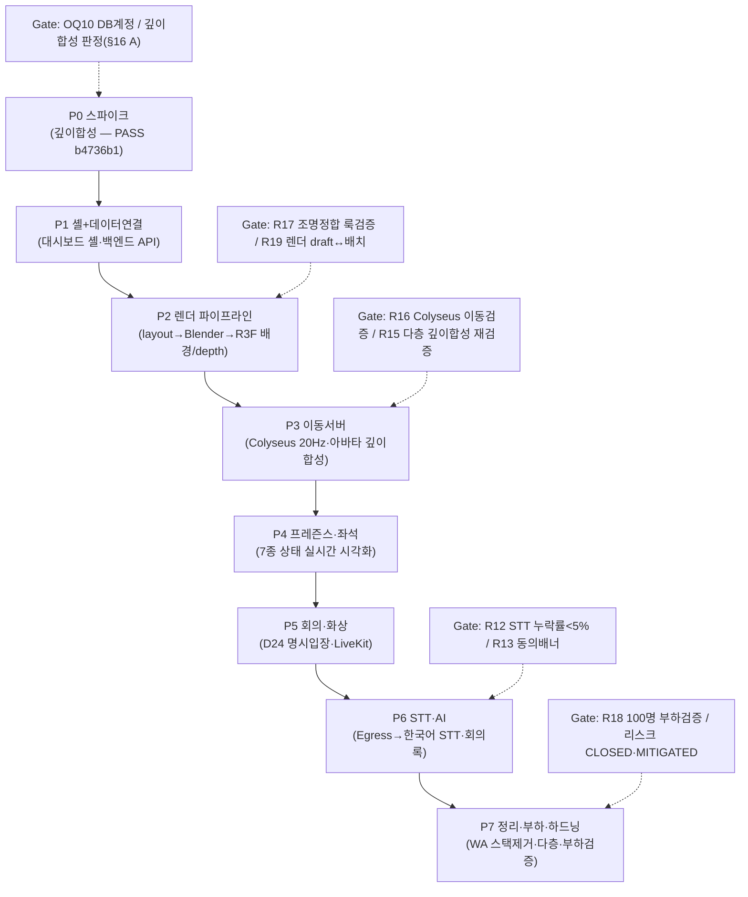
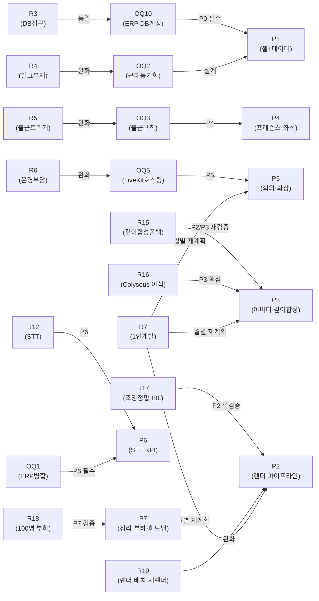

# 13. 리스크 & 오픈 이슈

> 🟢 **D27 반영(2026-07-09) — 포토리얼 웹임베드(R3F + Blender 깊이합성 + Colyseus + 단일세션)로 재작성됨.** 현행 정본 = 00-decisions §H(D27) · 10-roadmap §D27 · 16-render-spike-and-roadmap(§Part A/B) · 14-virtual-office-spec · 15-realtime-server-spec · 3d-design/{design-style-analysis, photoreal-web-strategy}. Godot 네이티브 배포·WorkAdventure(WA)·OIDC 이중로그인 전제는 **폐기**되었으며, 관련 리스크(R11 Godot↔LiveKit, A8/A12 Godot 헤드리스·네이티브)는 폐기 표기로 남긴다. Phase 편성 정본 = 16 §Part B(P0~P7). **주 단위 기간은 P0 깊이합성 스파이크 이후 확정하며 억지 숫자를 기재하지 않는다.**

**문서 버전**: v4.0  
**작성일**: 2026-07-09  
**대상 독자**: 개발/기획 리더십, 이해관계자  
**정본 기준**: `00-decisions.md` (D1~D27, F·H절) — 충돌 시 정본이 우선

> **변경 요약 (v4.0, 2026-07-09 — D27 반영)**: D26(WA)+Godot 노선 폐기 → D27 포토리얼 웹임베드로 재작성. ① 구 58주 간트·Godot 네이티브 배포 전제를 D27 Phase(P0~P7, 16 §Part B) 기반으로 교체(주 단위 미확정 — 스파이크 후 확정). ② Godot 리스크 **R11(Godot↔LiveKit GDExtension) 폐기**, 가정 **A8(Godot 헤드리스 권위)·A12(Godot 네이티브 빌드 안정성) 폐기**. ③ 깊이합성 스파이크 **PASS(2026-07-08, commit b4736b1)** 반영 — 초기 리스크 해소, 잔존(다층·실사·조명정합)은 유지. ④ D27 신규 리스크 5종 등재: R15 깊이합성 실패 폴백(다층·복잡 씬), R16 SkyOffice/Colyseus 이식량(자체 20Hz 서버), R17 아바타↔배경 조명정합(IBL), R18 100명 부하검증(P7), R19 Blender 렌더 파이프라인 배치화·재렌더 지연. STT(R12)·개인정보/노동법(R13)·ERP 등 비아키텍처 리스크는 보존.
>
> **변경 요약 (v3.3, 2026-07-02)**: OQ4(프로토콜)→WebSocket(WSS) 확정 종결(D1), OQ11(회의실 예약)→예약+FCFS 병행 확정(D23)·A7 가정 폐기, 이미 확정된 OQ3/OQ5 등 스테일 정리. 신규 리스크 4건 추가(R11 Godot-LiveKit 통합, R12 STT 정확도/한국어 화자분리, R13 개인정보/노동법, R14 클라-서버 프로토콜 버전 호환). 검증 간트를 10-roadmap 58주 재산정의 기준선(D6)으로 정합.

---

## 개요

본 문서는 가상오피스 운영 플랫폼 개발 과정에서 식별된 주요 리스크, 미해결 설계 결정(Open Questions), 명시적 가정(Assumptions), 그리고 검증 계획을 정리합니다.

프로젝트 특성상 1인 개발 + AI 협업, ERP 기존 시스템 의존도 높음, **포토리얼 웹임베드(R3F + Blender 깊이합성 + Colyseus 실시간 서버, 단일 통합 웹앱 배포)**, 사내 자체 호스팅 등 여러 기술·조직 리스크가 존재합니다. 이를 조기에 식별하고 완화 전략을 수립하여 Phase별 차질을 최소화하는 것이 목표입니다. (D27 이전의 Godot 3D 네이티브 배포 전제는 폐기되었으며, 배포 단위는 웹앱으로 전환되어 자동 업데이트/크로스플랫폼 빌드 리스크의 성격이 달라졌습니다.)

---

## 1. 리스크 표

| # | 리스크명 | 영향도 | 확률 | 시간(주) | 완화 전략 | 담당 | 상태 |
|---|---------|--------|------|---------|---------|------|------|
| ~~R1~~ | ~~**Godot 크로스플랫폼 빌드 복잡성**~~ **폐기(D27)** — 웹앱 단일 배포로 전환, 네이티브 크로스플랫폼 빌드 불필요. 잔여 관심사는 R19(Blender 렌더 파이프라인)로 이관 | — | — | — | 브라우저(WebGL2/R3F) 호환성만 검증 | 3d-engine-specialist | 폐기 |
| ~~R2~~ | ~~**자동 업데이트(OTA) 메커니즘 미정**~~ **폐기(D27)** — 웹앱은 서버 배포=즉시 반영, OTA·서명 바이너리 배포 불필요. 클라-서버 버전 정합은 R14로 유지 | — | — | — | 웹 표준 배포(정적 자산 캐시 무효화) | 3d-engine-specialist + backend-specialist | 폐기 |
| R3 | **ERP DB 접근 프로비저닝 지연** | 중 | 중 | 0.5 | Phase 1 전 read-only 계정 생성; DBA 조율 필요 | 인프라 담당자 | BLOCKED |
| R4 | **ERP 근태 벌크 조회 API 부재** | 중 | 확정 | 2 | 초기 동기화는 DB 직접 접근; 실시간은 trigger/CDC 고려 또는 정기 배치 | backend-specialist | MITIGATED |
| R5 | **3D 출근 ↔ ERP 출퇴근 연결 규칙 미결** | 중 | 높음 | 2 | OQ3 결정으로 분리 확정: 3D 프레즌스(로그인·좌석·회의실)는 우리 소유, ERP 출퇴근은 read-only | 기획 + backend-specialist | MITIGATED |
| R6 | **LiveKit self-host 운영 부담** | 중 | 중 | 4~8 | OQ5 확정(self-host): Phase 4 중 성능 테스트(10명 동시), 모니터링(Prometheus+Grafana), 단일 SFU로 오토스케일 불필요 | DevOps/인프라담당자 | MITIGATED |
| R7 | **1인 개발 순서 병목** | 높음 | 높음 | 연중 | AI 협업 강화; Phase 병렬화 불가; 외주/계약인력 고려; 스코프 재검토 포인트 설정 | PM/기획 | ONGOING |
| R8 | **ERP 스키마 드리프트** | 중 | 중 | 연중 | ERP main 브랜치 변경 모니터; Feature branch (feature/virtual-office-integration)는 독립 유지; 정기 동기화 체크 | backend-specialist | MITIGATED |
| R9 | **사번(社番) 부재로 인한 식별 footgun** | 중 | 높음 | 1 | ERP users.id를 PK로 사용; email은 (company_id, email) 복합 유니크만 신뢰 | backend-specialist | MITIGATED |
| R10 | **Email 재사용 시 신원 충돌** | 낮음 | 중 | 1 | 퇴사자 처리 정책 수립; soft-delete 또는 archive 전략; 다중테넌트 확장 시 재검토 | HR + backend-specialist | OPEN |
| ~~R11~~ | ~~**Godot ↔ LiveKit 통합(WebRTC GDExtension)**~~ **폐기(D27)** — Godot 클라이언트 폐기. 화상은 웹 LiveKit SDK(R3F 웹앱 내)로 네이티브 지원 → GDExtension 자체 개발 불요 | — | — | — | 웹 LiveKit JS SDK 사용(P5) | 3d-engine-specialist | 폐기 |
| R12 | **STT 정확도 / 한국어 화자분리** | 높음 | 중 | 2~3 | 회의록 자동 초안 품질·화자분리 미달 → **완화**: P6 STT 파이프라인 PoC, 누락률 <5% 미달 시 수동 회의록 + AI 요약으로 격하 | backend-specialist | OPEN |
| R13 | **개인정보 / 노동법 (모니터링·녹음·외부 LLM)** | 높음 | 높음 | 연중 | 평가 목적 행동 데이터·회의 녹음·외부 LLM 전송 → **완화**: D20 컴플라이언스 원칙(고지·동의 절차, 사번 가명화, 보존기한, 최소수집 VIEW) 도입 전 이행 | PM/기획 + backend-specialist | OPEN |
| R14 | **클라-서버 프로토콜 버전 호환** | 중 | 낮 | 1 | 웹앱 서버 배포와 Colyseus/API 스키마 시점 불일치 → **완화**: WSS 핸드셰이크 `protocol_version` 협상(D4). 웹 전환으로 강제 새로고침 가능해 확률 하향 | 3d-engine-specialist + backend-specialist | MITIGATED |
| **R15** | **깊이합성 실패 폴백 (다층·복잡 씬 확장)** | 높음 | 중 | 스파이크 후 확정 | 단층 깊이합성은 **PASS(2026-07-08, b4736b1)**. 다층·복잡 씬으로 확장 시 오클루전 정합 붕괴 위험 → **폴백(§16 A.4)**: 빌보드 스프라이트 아바타 또는 부분 실시간 3D | 3d-engine-specialist | OPEN |
| **R16** | **SkyOffice/Colyseus 이식량 (자체 20Hz 권위 서버)** | 높음 | 높음 | 스파이크 후 확정 | 공식 드롭인 부재 → SkyOffice 참조 이식 + 20Hz tick·이동검증·좌표동기화 자체 구현(15-realtime-server-spec) → **완화**: P3에서 최소 이동서버 우선, 스코프 단계화 | backend-specialist + 3d-engine-specialist | OPEN |
| **R17** | **아바타 ↔ 배경 조명정합 (IBL)** | 높음 | 높음 | 연중 | 오프라인 Blender 배경과 실시간 R3F 아바타의 조명·그림자 불일치 → **완화**: 씬별 IBL(HDRI/라이트프로브) 추출·주입, 목표 정합도 80~90%(최난제). 미달 시 톤·앰비언트 근사로 타협 | 3d-engine-specialist | OPEN |
| **R18** | **100명 부하검증 (P7)** | 높음 | 중 | 스파이크 후 확정 | Colyseus 단일 룸 100명 동시(설계 목표) 시 tick·대역폭·클라 렌더 병목 → **완화**: P7 부하검증(우선 20명 실측→100명 목표), 관심영역(AOI)·업데이트 스로틀링. 미달 시 룸 분할 | backend-specialist | OPEN |
| **R19** | **Blender 렌더 파이프라인 배치화·재렌더 지연** | 중 | 높음 | 연중 | layout JSON→Blender 파라메트릭 씬→Cycles 오프라인 렌더는 배치·수 분 단위 지연 → 편집기 즉시 반영 불가 → **완화**: 렌더 큐·캐시·증분 재렌더, 편집은 draft(경량) 모드 후 확정 시 배치 재렌더 | 3d-engine-specialist + backend-specialist | OPEN |

### 주요 리스크 상세

#### ~~R1: Godot 크로스플랫폼 빌드 복잡성~~ — **폐기(D27, 2026-07-09)**
- **폐기 사유**: D27로 Godot 네이티브 데스크톱 배포가 폐기되고 **단일 통합 웹앱(R3F)**으로 전환. 브라우저에서 실행되므로 OS별 네이티브 빌드/CI 자체가 불요.
- **잔여 관심사**: 브라우저 WebGL2/R3F 호환성, GPU별 성능 편차 → 렌더 파이프라인 리스크(R19) 및 P7 성능검증으로 흡수.

#### ~~R2: 자동 업데이트 메커니즘 미정~~ — **폐기(D27, 2026-07-09)**
- **폐기 사유**: 웹앱은 **서버 배포 = 즉시 반영**이며 OTA·서명 바이너리·롤백 채널이 불요. 구 D8(에셋/클라 전달)은 D27에서 "런타임 렌더 이미지 + 경량 GLTF" 전달로 성격이 바뀜.
- **잔여 관심사**: 서버 배포 시점과 클라 세션 스키마 불일치 → **R14(protocol_version 협상)**로 유지·처리(웹은 강제 새로고침 가능해 완화 용이).

#### R3: ERP DB 접근 프로비저닝 지연
- **선택**: 근태 벌크 동기화를 위해 ERP PostgreSQL (dailylog DB)에 read-only 계정 필요.
- **리스크**: DBA/인프라 담당자 스케줄 밀림 → Phase 1 착수 지연.
- **완화**:
  1. 즉시 인프라 담당자와 조율; 사전 준비 (계정 생성, 네트워크 규칙).
  2. Fallback: 초기는 ERP API (GET /api/users, /api/teams, /api/positions)로만 동기화하고, 근태는 당일 ERP 관리자 수동 입력 대기.

#### R4: ERP 근태 벌크 조회 API 부재
- **사실**: ERP GET /api/attendance/admin/record?user_id=&date= 는 **단건 조회만 지원** (벌크 없음).
- **선택**: 근태 벌크는 **read-only DB 직접 접근** (attendances 테이블).
- **완화**:
  1. Phase 2에 동기화 스크립트 작성 (SELECT user_id, attendance_date, check_in_at, check_out_at, work_type FROM attendances WHERE attendance_date >= ? AND attendance_date <= ? AND company_id = ?). (컬럼명 라이브 검증 2026-07-02)
  2. 실시간 vs 배치: **매시간 증분 + 매일 00:00 전체 대사(D18)**. 18:00은 daily_reports push(D17)로 별개 프로세스(2026-07-02 정정). 향후 PostgreSQL trigger 또는 변경데이터캡처(CDC) 고려.
  3. 시간대: ERP 시간대(KST)와 우리 시간대 일치 확인.

#### R5: 3D 출근 ↔ ERP 출퇴근 연결 규칙 미결
- **결정(2026-07-01)**: OQ3 확정으로 분리 규칙 확정됨.
- **규칙**:
  - **공식 출퇴근(ERP attendances)**: ERP 원본, 우리는 read-only 읽기만 (check_in/check_out 기록 쓰지 않음)
  - **3D 프레즌스(우리 소유 트리거)**:
    - 3D 클라 로그인 → online
    - 지정 좌석/팀 구역 도착 → working
    - 회의실 입장 → meeting
    - N분 무입력 → away
    - 집중모드 토글 → focus
    - 종료/로그아웃 → offline
  - **3D 화면**: ERP 오늘 check_in된 직원을 read로 병기 반영
- **근거**: 스펙 장애 격리 원칙(가상오피스 장애가 근태/업무 데이터 영향 없음), 근태=읽기 원칙, 원본 명확화
- **완화**: OQ3 결정으로 분리 확정 완료. Phase 2부터 분리된 로직 구현 시작.

#### R6: LiveKit self-host 운영 부담
- **결정(2026-07-01)**: OQ5 확정으로 호스팅 환경 확정됨.
- **선택**: LiveKit + coturn self-host (Docker Compose), 사내 통제 인프라(온프렘 VM 또는 사내 클라우드 계정).
- **네트워크**:
  - 재택/하이브리드/외근: 공개 엔드포인트 직결(UDP) + TURN-TLS 443 폴백 (VPN 없음 확정 2026-07-02).
- **배제**:
  - LiveKit Cloud (SaaS, 민감 미디어 외부 경유, 구독비, B2B 이후).
  - 순수 신규 AWS (데이터 주권, 사내 우선 고려 시 후순위).
- **근거**: 미디어 데이터 주권(회의가 인사평가 근거 연결), ERP/백엔드와 동일 사내망 지연 이점, 규모상 단일 SFU 노드로 충분(오토스케일 불필요→1인 운영 부담 낮음).
- **완화**:
  1. Phase 4 중반에 성능 테스트 (10명 동시 회의).
  2. 모니터링: Prometheus + Grafana 기본 구성.
  3. 초기(Phase 1~5)는 Docker Compose로 테스트; Phase 6 이후 프로덕션 안정화.
  4. 종결(2026-07-02): VPN 없음 → 공개 엔드포인트.

#### R7: 1인 개발 순서 병목
- **핵심 리스크**: 가장 높은 우선순위.
- **현황**: 1인 개발 + AI 협업, D27 P0~P7 순차 로드맵(16 §Part B).
- **병목 시나리오**:
  - **주 단위 절대 일정은 P0~P2 실측 후 확정**(억지 숫자 금지). P0 깊이합성 스파이크는 PASS(2026-07-08). P2 렌더 파이프라인·P3 이동서버 속도가 전체를 지배.
  - R3F/Blender + Colyseus + FastAPI + Next.js 다중 스택 동시 개발 불가 → **Phase 순차 원칙**(병렬화 없음).
  - ERP 연동 의존도 높음 (P1 데이터 연결·P6 KPI 필수).
- **완화**:
  1. **재계획 포인트**: P2 완료 후 실제 속도 측정 → P3~P7 scope 재조정 (feature cut).
  2. **병렬화**: P0/P1 (테스트 계약, API 설계, 셸)은 렌더 파이프라인과 부분 독립; 일부 동시 진행 가능.
  3. **AI 협업 강화**: 반복적 작업(CRUD API, 테스트, 문서)은 AI 자동화, 1인은 아키텍처·의사결정 집중.
  4. **외주 고려**: P2(렌더 파이프라인)·P3(Colyseus 이식) 등 명확한 컴포넌트는 계약인력 투입 검토.
  5. **스코프 명확화**: P7 하드닝에서 모바일·멀티테넌트는 제외 선언.

#### R8: ERP 스키마 드리프트
- **상황**: ERP는 별도 private repo (github.com/project-space-daily/space-daily), DailyLog라 불림.
- **리스크**: ERP 메인 브랜치 업데이트 시 users, teams, attendances 등 스키마 변경 → 우리 동기화 로직 깨짐.
- **예시**: ERP에서 teams.parent_team_id 추가 (계층 지원) → 우리는 영향 없으나 모니터링 필요.
- **완화**:
  1. **Feature branch 독립**: 우리 ERP 작업(kpi_results 테이블 + 수신 엔드포인트)은 **feature/virtual-office-integration** 브랜치에만. main 무관.
  2. **정기 동기화**: 주 1회 ERP main 변경사항 모니터; 우리 erp_user 스키마와 비교.
  3. **마이그레이션 계획**: users/teams/attendances 스키마 변경 발생 시 Alembic 마이그레이션 자동 준비.
  4. **커뮤니케이션**: ERP 담당팀과 변경 사전 공지 채널 구성.

#### R9: 사번(社番) 부재로 인한 식별 footgun
- **사실**: ERP users 테이블에 사번 필드가 없음. 신원 식별은 email만 가능.
- **문제**:
  - 다중테넌트 환경에서 (company_id, email) 조합만 유니크 보장.
  - 단일 조직이라도 데이터 마이그레이션·통합 시 email 충돌 가능성.
  - 우리 erp_user.id (ERP users.id FK)에 의존하는데, 사용자 이전·데이터 리셋 시 ID 변경 가능성.
- **완화**:
  1. **PK 전략**: 우리는 erp_user.id를 PK로 삼고, email은 유니크 제약 없음 (동기화 시마다 검증).
  2. **soft-delete**: erp_user.is_active 플래그로 비활성 사용자 구분 (하드 삭제 금지).
  3. **감시**: audit_log에 user_id 매핑 변경 기록.
  4. **다중테넌트 확장 시 재검토**: v3.3 이후 멀티테넌트 설계에서 사번·unique ID 추가 필수.

#### R10: Email 재사용 시 신원 충돌
- **시나리오**: A 직원(alice@company.com) 퇴사 → 새 직원 B(bob@company.com) 입사. 같은 email 재사용.
- **영향**: 
  - 우리 DB: erp_user.id는 다르더라도, 동기화 시 email 기반 매칭 오류.
  - 협업 기록: 이전 alice의 회의·일감이 bob으로 귀속될 수 있음.
  - KPI: 평가 기록 혼동.
- **완화**:
  1. **Email + timestamp 조합**: erp_user 동기화 시 (email, synced_at, erp_user_id) 조합으로 기록.
  2. **Archive 정책**: 퇴사자는 soft-delete (is_active=false), 기존 협업 기록은 유지.
  3. **HR 조율**: 퇴사자 email 재사용 정책을 HR과 사전 합의.
  4. **다중테넌트 후속**: v3.3에서 멀티테넌트 확장 시 (company_id, email) 조합을 더 엄격히 검증.

#### ~~R11: Godot ↔ LiveKit 통합~~ — **폐기(D27, 2026-07-09)**
- **폐기 사유**: Godot 클라이언트가 폐기되면서 GDExtension WebRTC 자체 래핑 필요가 사라짐. D27의 R3F 웹앱은 **LiveKit 공식 JS SDK를 브라우저에서 네이티브로 사용**하므로 통합 난제 소멸.
- **후속**: 화상/오디오는 P5(회의·화상)에서 웹 LiveKit SDK로 구현. 임베디드 브라우저 폴백도 불요.

#### R15: 깊이합성 실패 폴백 — 다층·복잡 씬 확장 (신규, D27)
- **상황**: Blender 오프라인 배경 + R3F 실시간 아바타의 **깊이(depth) 합성 오클루전**이 D27의 핵심 기법. **단층 스파이크는 PASS(2026-07-08, commit b4736b1)** — 초기 리스크 해소.
- **잔존 리스크**: 다층(멀티플로어)·가림 많은 복잡 씬으로 확장 시 depth 정밀도·경계 아티팩트로 오클루전이 붕괴할 수 있음.
- **완화(§16 A.4 폴백)**:
  1. P2에서 대표 복잡 씬으로 조기 재검증(단층 PASS를 다층으로 확장 시).
  2. 실패 시 폴백: **빌보드 스프라이트 아바타**(depth 미사용, 정렬 근사) 또는 **부분 실시간 3D**(가구 일부를 실시간 지오메트리로).

#### R16: SkyOffice/Colyseus 이식량 — 자체 20Hz 권위 서버 (신규, D27)
- **상황**: D1 WSS는 D27에서 WA 내장이 아니라 **SkyOffice 참조 이식 + Colyseus 권위 서버 자체 구현**으로 전환(15-realtime-server-spec). 20Hz tick·이동검증·좌표동기화·스냅샷을 직접 구축해야 함.
- **리스크**: 드롭인 솔루션 부재로 이식량이 P3 일정을 지배. 권위 검증·재접속 스냅샷 등 상태 동기화 난이도.
- **완화**:
  1. P3에서 **최소 이동서버(이동·좌표동기화)** 우선 구현 후 점진 확장.
  2. 스코프 단계화: 이동검증→상태동기화→AOI 순.
  3. SkyOffice 오픈소스 구조를 최대 재사용, 커스텀은 프레즌스 매핑에 국한.

#### R17: 아바타 ↔ 배경 조명정합 (IBL) (신규, D27)
- **상황**: 배경은 오프라인 Blender Cycles로 구운 이미지, 아바타는 런타임 R3F 실시간 셰이딩 → **조명·그림자·톤 불일치**가 이질감의 최대 원인.
- **리스크**: 정합 실패 시 "붙여넣은 느낌"으로 포토리얼 목표 훼손. D27 최난제.
- **완화**:
  1. 씬별 **IBL 데이터(HDRI/라이트프로브·앰비언트) 추출**을 Blender 렌더 단계에서 함께 산출하여 R3F에 주입.
  2. 목표 정합도 **80~90%**(완벽 아님)로 설정, 미달 시 톤매핑·앰비언트 근사·접지 그림자(contact shadow)로 타협.
  3. P2(배경)~P3(아바타) 교차 시점에 룩 검증 게이트.

#### R18: 부하검증 — P7 = **20명 도그푸딩 실측**(16 §Part B·12 P7-T4 정합), 100명은 설계 목표(D22) — P7 이후 별도 검증 (신규, D27)
- **상황**: Colyseus 단일 룸 동시 접속 목표(설계 100명). 20Hz 브로드캐스트 × 인원 → tick 지연·대역폭·클라 렌더 병목 가능.
- **리스크**: 부하 미검증 시 프로덕션에서 프레즌스 지연·끊김.
- **완화**:
  1. **P7 부하검증**: 우선 20명 실측 → 100명 목표로 확장 측정(E2E p95 지연·tick 안정성).
  2. **관심영역(AOI)** 필터링·업데이트 스로틀링으로 브로드캐스트 절감.
  3. 미달 시 룸 분할(층/구역별) 또는 tick·전송률 적응.

#### R19: Blender 렌더 파이프라인 배치화·재렌더 지연 (신규, D27)
- **상황**: `layout JSON → Blender 파라메트릭 씬 빌더 → Cycles 오프라인 렌더(배경+depth)`는 배치성 작업으로 수 분 단위 소요. 배치 편집기에서 즉시 반영 불가.
- **리스크**: 편집→반영 UX 저하, 렌더 큐 적체, 다층 확장 시 렌더 시간 폭증.
- **완화**:
  1. **draft(경량) 모드**로 편집 즉시 미리보기 후, 확정 시 배치 재렌더(D11 데스크톱 draft 계승).
  2. 렌더 **큐·캐시·증분 재렌더**(변경 씬만 재생성).
  3. P2에서 1개 층 파이프라인 확립 후 P7에서 다층·배치 자동화.

#### R12: STT 정확도 / 한국어 화자분리 (신규, D5/F)
- **상황**: 회의록 STT 자동 초안(LiveKit Egress → STT → 화자분리)이 정식 범위(D5). 한국어 화자분리 정확도가 관건.
- **리스크**: 누락률 <5%(수동 전사 대조, D22) 미달 시 회의록 자동화 가치 저하.
- **완화**:
  1. **Phase 0 스파이크 S2**: 한국어 회의록 초안 품질·누락률 측정.
  2. **폴백 확정**: 미달 시 수동 회의록 + AI 요약으로 격하(PRD 기준 하향 재협의).
  3. 외부 STT/LLM 전송 시 실명→사번 가명화(D20).

#### R13: 개인정보 / 노동법 컴플라이언스 (신규, D20)
- **상황**: 평가 목적의 행동 데이터 수집(presence), 회의 녹음·STT, 외부 AI 전송이 근로자 모니터링·개인정보 규율 대상.
- **리스크**: 고지·동의 절차 미비 시 법적/노무 리스크.
- **완화(D20)**:
  1. **근로자 모니터링 고지·동의**: 수집 항목·목적·보존기간 서면 고지 및 동의. presence 좌표는 KPI 미사용·30일 후 삭제.
  2. **회의 녹음·STT 동의**: 회의 시작 시 전원 고지 배너 + 참여 의사 확인(거부 시 오디오 미수집). 녹음 원본 90일, 회의록 텍스트는 평가 데이터로 관리.
  3. **GPS 수집 기능 삭제**(D13 연동), ERP lat/lng/radius 미러링 금지.
  4. **외부 AI 전송**: 실명→사번 가명화, 처리위탁·국외이전 고지 문서화.
  5. **보존 기한**: 평가 데이터(kpi_result·work_log) 5년, audit_log 5년.

#### R14: 클라-서버 프로토콜 버전 호환 (신규, D4)
- **상황**: 네이티브 클라이언트는 자동 업데이트 채널로 배포(D8)되므로, 서버 배포 시점과 클라 버전이 일시적으로 불일치할 수 있음.
- **완화**: WSS 핸드셰이크에 `protocol_version` 협상 포함(D4) — 미지원 버전은 거부하고 업데이트 안내. 재접속 시 sequence_num 기반 스냅샷 재수신(D1).

---

## 2. Open Questions

| # | 질문 | 영향도 | 의존성 | 담당 | 예상 해결 시점 |
|---|------|--------|--------|------|----------------|
| OQ1 | **ERP git 접근권한 보유 → 자체 dev 브랜치 작업(담당자 병합 대기 불필요)** | 높음 | 없음 | backend-specialist | Phase 0 완료(2026-07-01 확정) |
| OQ2 | **근태 벌크 동기화: 초기 로드 vs 실시간 CDC?** | 중 | R4 완화 | backend-specialist | Phase 2 설계 단계 |
| OQ3 | **3D 출근 규칙: 로그인→online, 좌석→working, 회의실→meeting, 근무상태 분리 확정** | 높음 | 없음 | 기획 + backend-specialist | Phase 0 완료(2026-07-01 확정) |
| OQ4 | **실시간 이동 프로토콜 → WebSocket(WSS) 확정 종결(D1)**. D27에서 구현 주체는 Godot 멀티플레이어가 아니라 **Colyseus 권위 서버(SkyOffice 이식, 20Hz)** — R16 참조 | 중 | 없음 | backend-specialist + 3d-engine-specialist | 확정(2026-07-02, D27로 구현체 정정 2026-07-09) |
| OQ5 | **LiveKit 호스팅: 사내 self-host(Docker Compose), TURN-over-TLS/UDP 직결(VPN 없음), 단일 SFU — 2026-07-02 최종 확정** | 중 | 없음 | 인프라 담당자 | 확정(2026-07-02) |
| OQ6 | **KPI AI 초안: Claude 확정(기본), Gemini 대안 여부만 검토** | 낮음 | Phase 6 설계 | 기획 + backend-specialist | Phase 5 말 |
| OQ7 | **좌석 미배정 시 아바타 fallback: 로비 vs 에러?** | 낮음 | Phase 2 데이터 설계 | 기획 + 3d-engine-specialist | Phase 2 설계 |
| OQ8 | **사무실 배치 롤백: 활성 좌석/아바타를 어떻게 처리?** | 중 | Phase 3 구현 | PM + backend-specialist | Phase 3 말 |
| OQ9 | **조직 계층별 3D 구역 접근 제어: org_group.type별로?** | 낮음 | Phase 2 설계 | 기획 + backend-specialist | 설계 Phase 2 말 / 구현 Phase 7 (2026-07-02) |
| OQ10 | **ERP read-only DB 계정 프로비저닝: 언제? 누가 책임?** | 높음 | R3 완화 | 인프라 담당자 | Phase 0 완료 시 |
| OQ11 | **회의실 예약 → 예약 시스템 + 즉석(FCFS) 병행 확정(D23)** | 중 | 없음 | 기획 | 확정(2026-07-02) |
| OQ12 | **아바타 콜리전 → 벽면 관통 차단 확정(로드맵 Phase 4 충돌 시스템과 정합) — 2026-07-02 종결** | 낮음 | 없음 | 3d-engine-specialist | 확정(2026-07-02) |
| OQ13 | **ERP 회의실 예약 테이블(meeting_rooms/meeting_room_shares/meeting_reservations)과 우리 회의 기능의 관계 — 무시/미러/통합 중 결정** | 중 | Phase 5 착수 전 필수 | 기획 + backend-specialist | Phase 5 착수 전 (발견 2026-07-02, 라이브 스키마 검증) |

---

## 3. Assumptions (명시적 가정)

| # | 가정 | 근거 | 검증 방법 | 위험도 |
|---|------|------|---------|--------|
| A1 | **ERP users.id는 변경되지 않음** | erp_user의 FK로 사용, 데이터 무결성 | ERP 스키마 문서 확인 + DBA 인터뷰 | 높음 |
| A2 | **단일 조직(company_id) 운영** | v3.2 spec = 도그푸딩, 다중테넌트는 v3.3 이후 | 프로젝트 스코프 명시 | 높음 |
| A3 | **ERP teams는 리프 노드만 지원** | ERP 스키마에 parent_team_id 없음 | ERP 소스코드 확인 (backend/app/models/tables.py) | 중 |
| A4 | **사내망 안정적, 직접 DB 접근 가능** (범위: 서버 PC↔ERP DB 구간 한정 — 사용자 접속은 인터넷 공개, onprem-docker §3, 2026-07-02) | read-only 계정으로 근태 벌크 조회 | 네트워크 아키텍처 검토 + Firewall 규칙 | 높음 |
| A5 | **EOD 배치는 고정 시간(예: 18:00) 실행** | work_hours 기준이 아니라 규칙적 스케줄 | Phase 6에 APScheduler로 구현 및 테스트 | 중 |
| A6 | **직원은 하루에 한 번만 출근** | 근태 로직 단순화 (중복 check_in 처리 불필요) | 사내 근무 정책 확인 | 낮음 |
| ~~A7~~ | ~~**회의실은 first-come-first-served**~~ **폐기(D23)** — 예약 시스템 + 즉석(FCFS) **병행** 확정 | 예약 충돌 검증 유지 | OQ11 확정 종결 | — |
| ~~A8~~ | ~~**Godot 헤드리스 서버는 권위 있는 소스**~~ **폐기(D27, 2026-07-09)** — Godot 헤드리스 폐기. 권위 서버 = **Colyseus**(SkyOffice 이식). "서버 권위" 원칙 자체는 Colyseus로 계승(이동검증은 서버가 판정) | 클라는 서버 검증 결과만 신뢰(원칙 유지) | R16 / 15-realtime-server-spec | — |
| A9 | **Asset 라이선스·속성 정확도** | CC0 및 라이선스 명시 에셋만 사용 | 각 에셋별 라이선스 문서 보관 | 낮음 |
| A10 | **Email은 (company_id, email) 복합 유니크** | 다중테넌트 후속 고려 | ERP 스키마 제약 조건 확인 | 중 |
| ~~A11~~ | ~~**아바타는 물리적 콜리전 무시 가능**~~ **폐기(2026-07-02)** — OQ12 벽면 관통 **차단 확정**(로드맵 Phase 4 충돌 시스템과 정합) | 게임 UX 선례 (비-장애 기능) | OQ12 확정 종결 | — |
| ~~A12~~ | ~~**Godot 4 네이티브 빌드는 안정적**~~ **폐기(D27, 2026-07-09)** — 네이티브 빌드 노선 폐기. 대체 가정 **A14**(웹/R3F·Blender 스택 안정성)로 이관 | — | — | — |
| A13 | **공인 고정 IP 유지, 도메인 구매 전 임시 내부 CA 운용** | D21-r 온프렘 인터넷 공개 배포 확정(2026-07-02), onprem-docker 정본 | 배포 시 공인 IP·인증서 상태 확인 | 중 |
| A14 | **R3F(WebGL2)·Blender Cycles·Colyseus 스택은 목표 환경에서 안정적** (D27 신규) | 성숙한 오픈소스·웹 표준, 스파이크 PASS(b4736b1) | P0/P2 스파이크·P7 성능검증(GPU별 편차 포함) | 중 |

---

## 4. 검증 계획

### 4.1 Phase별 검증 Gate

> 🔴 **구 58주 간트(Godot/WA 기준) 폐기(D27, 2026-07-09)** — 아래는 D27 Phase 편성(P0~P7, 정본 = 16-render-spike-and-roadmap §Part B)에 따른 **의존성 순서 기반 게이트 목록**이다. **주 단위 절대 날짜는 P0 깊이합성 스파이크 완료 후 확정**하며, 억지 숫자를 기재하지 않는다(참고: P0 스파이크는 2026-07-08 PASS, commit b4736b1). 아래 게이트는 순서(선후행) 관계만 규정한다.

> **주 단위 확정 방침**: 각 Phase 기간은 P0 결과 및 P1~P2 실측 속도(1인 개발, R7)를 바탕으로 순차 확정한다. 확정 전까지 절대 날짜(예: 2027-08-16)는 기재하지 않는다.

### 4.2 검증 체크리스트

> **Phase 편성 정본 = 16-render-spike-and-roadmap §Part B (P0~P7).** 아래 게이트는 D27 편성에 맞춰 재작성됨.

#### P0 (깊이합성 스파이크) 완료 조건
- [x] **깊이합성 오클루전 스파이크 PASS**(2026-07-08, commit b4736b1) — render-pipeline 최소본 + 판정 리포트(§16 A) 확보
- [ ] OQ10: ERP read-only DB 계정 생성 완료
- [ ] API 계약(OpenAPI spec, WebSocket(WSS)/Colyseus 메시지 스키마) 작성 및 검증
- [ ] Test 스켈레톤 작성 (pytest, R3F/프론트 테스트)

#### P1 (셸 + 데이터 연결) 완료 조건
- [ ] 통합 대시보드 셸(시안 픽셀 재현) UI — 3D 뷰포트 자리는 placeholder
- [ ] 기존 백엔드 API 연결(KPI·업무·유저·일정)
- [ ] 단일 세션(별도 OIDC 로그인 없음) — 콘솔 JWT 세션 유지 확인(Colyseus onAuth 검증은 P3)

#### P2 (렌더 파이프라인) 완료 조건
- [ ] layout JSON → Blender 파라메트릭 씬 빌더, 1개 층 포토리얼 배경+depth 자동 생성
- [ ] R3F 뷰포트에 배경 표시, 렌더 품질 기준 확정(참고 성능목표, GPU별 편차 P7 검증)
- [ ] **R17 조명정합 룩 검증**(IBL 주입, 목표 정합도 80~90%), **R19 draft↔배치 재렌더** 흐름 확립

#### P3 (Colyseus 이동서버 + 아바타 깊이합성) 완료 조건
- [ ] **R16**: Colyseus 권위 서버(SkyOffice 이식) 이동·좌표동기화 20Hz·이동검증 (검증 20명/설계 100명 목표, tick 20Hz)
- [ ] 아바타 GLTF+애니, **깊이합성 아바타** 멀티유저 이동
- [ ] **R15**: 대표 복잡/다층 씬으로 깊이합성 재검증(붕괴 시 §16 A.4 폴백 판정)
- [ ] 프로토콜 WSS 확정(OQ4 종결) — 클라-서버 `protocol_version` 협상(R14) 반영

#### P4 (프레즌스·좌석) 완료 조건
- [ ] 7종 상태(D13) HUD·미니맵·우패널 실시간 시각화
- [ ] 자율좌석 클릭 점유/반납, 3D 출근 규칙 분리(OQ3: 로그인→online, 좌석→working, 회의실→meeting, attendance read-only)
- [ ] 가정 재검증 및 기록 (A7·A8·A11·A12 폐기 확인 포함)

#### P5 (회의·화상) 완료 조건
- [ ] D24 명시입장(2m 트리거) + **LiveKit 웹 JS SDK** 오디오/영상, 화상 타일 UI (R11 폐기: GDExtension 불요)
- [ ] R6: LiveKit self-host 성능 테스트(OQ5 종결), 동의 배너(D20/R13)
- [ ] 회의실 스케줄 = **예약 + FCFS 병행 확정(OQ11 종결, D23)** — 구현 완료

#### P6 (STT·AI) 완료 조건
- [ ] **회의록 STT 자동 초안**(LiveKit Egress→한국어 STT→화자분리→검토·확정), 누락률 <5% 측정(수동 전사 대조, D22) — **R12**
- [ ] KPI 산출 로직 + AI 초안(OQ6, Claude 기본) 배선
- [ ] OQ1(2026-07-01 완료): feature/virtual-office-integration 브랜치에서 kpi_results 테이블·Alembic·KPI 수신 엔드포인트·서비스계정 구현
- [ ] EOD 배치 구현 및 테스트 (A5 검증), ERP kpi_results 수신 동작 확인

#### P7 (정리·부하·하드닝) 완료 조건
- [ ] WA 스택 제거, **다층 렌더** 확장(R15/R19), 보안 하드닝
- [ ] **R18**: P7 = **20명 도그푸딩 실측**(16 §Part B·12 P7-T4 정합, E2E p95 지연·tick 안정성) — 100명은 설계 목표(D22), P7 이후 별도 검증
- [ ] 감사 로그·ERP 동기화 실패 알림·도그푸딩 피드백(주 1회) 체계 완성
- [ ] 전체 시스템 통합 테스트(1주일 도그푸딩), 편집기→재렌더 파이프라인 안정화
- [ ] 모든 활성 리스크(R3~R10, R12~R19) 상태 CLOSED 또는 MITIGATED 확인 (폐기: R1·R2·R11)

### 4.3 의존성 관리

---

## 5. 우선순위 & 대응 전략

### 5.1 즉시 대응 (P0)
1. **OQ10 해결**: 인프라 담당자와 협의, ERP read-only 계정 신청.
2. **R3 완화**: DB 프로비저닝 스크립트 준비, 네트워크 테스트.
3. **R7 모니터**: 주간 진도 기록, P0~P2 실측 후 위험도 재평가.
4. **깊이합성 스파이크(완료)**: PASS(2026-07-08, b4736b1) — 단층 검증. 다층 재검증은 R15로 이월.

### 5.2 초기 단계 (P1~P2)
1. **R19/R17**: Blender 렌더 파이프라인(draft↔배치) 확립 + 배경↔아바타 조명정합(IBL) 룩 검증.
2. **OQ4 확정 종결(D1)**: WebSocket(WSS) — 실시간 구현체는 Colyseus(R16). 핸드셰이크 protocol_version 협상 구현(D4/R14).
3. ~~**R1/R2 폐기(D27)**~~: 네이티브 빌드·OTA 불요(웹앱 전환) — 대응 항목에서 제거.

### 5.3 중기 (P3~P4)
1. **R16 우선**: Colyseus 이동서버(SkyOffice 이식) 최소본 → 이동검증 → 상태동기화 단계화.
2. **R15 재검증**: 다층·복잡 씬 깊이합성. 붕괴 시 §16 A.4 폴백(빌보드/부분 실시간 3D) 판정.
3. **OQ3 확정(2026-07-01)**: 3D 출근 규칙 분리 구현(HR 검증 병행).
4. **R8 모니터**: ERP main 변경사항 주 1회 검토.
5. **R7 재계획**: 실제 개발 속도 기반 P5~P7 scope 조정.

### 5.4 후기 (P5~P7)
1. **OQ1 완료(2026-07-01)**: ERP git 접근권한 보유 확정, feature/virtual-office-integration 브랜치에서 자체 작업.
2. **OQ5 확정 + R6 프로덕션화**: LiveKit 사내 self-host 모니터링, 화상은 웹 JS SDK(R11 폐기).
3. **R12/R13**: STT 회의록 안정화 + 컴플라이언스 고지·동의(D20) 운영.
4. **R18**: 100명 부하검증(우선 20명→100명), 미달 시 AOI·룸 분할.
5. **P7 하드닝**: WA 스택 제거·다층 렌더·보안 하드닝, 편집기→재렌더 안정화.

---

## 6. Risk Owner & Escalation

| 리스크/OQ | Owner | Escalation | Contact |
|----------|-------|-----------|---------|
| R7, R14, R15, R17, R19, OQ4(종결) | 3d-engine-specialist | PM/기획팀 | [담당자] |
| R3, R4, R8, R9, R10, R12, R16, R18, OQ2, OQ3, OQ7, OQ8, OQ10 | backend-specialist | PM/기획팀 | [담당자] |
| R6, OQ5(종결) | 인프라 담당자(사내 VM) | PM/기획팀 | [담당자] |
| R5, R13, OQ1, OQ6, OQ11(종결) | PM/기획팀 | CTO/경영진 | [담당자] |
| A1, A2, A3, A4 검증 | DBA/ERP PM | CTO | [담당자] |
| ~~R1, R2, R11~~ **폐기(D27)** | — (웹앱 전환·Colyseus/웹 LiveKit로 소멸) | — | — |

---

## 7. 회고 & 갱신 주기

- **월 1회 회고**: 각 Phase 종료 시, Risk/OQ 상태 업데이트.
- **주 1회 스탠드업**: R7 (1인 개발 병목) 진도 공유.
- **분기 1회 재평가**: 리스크 확률·영향도 재산정.
- **문서 갱신**: 결정 사항 즉시 반영 (Decision log 스타일).

---

## Loop Metadata

### Upstream 문서
- **00-decisions.md (정본 결정 로그 D1~D27, F·H절 — 최우선 기준)**
- **16-render-spike-and-roadmap.md (§Part A 스파이크 판정 / §Part B P0~P7 Phase 편성 — 정본)**
- 정본 컨텍스트 (2026-07-08 D27 확정)
- 01-prd.md (기획서, 미생성 시 이 문서가 원본)
- 04-data-model.md (office_layout, erp_user 스키마 정의)
- 10-roadmap.md (§D27 재산정 — P0~P7, 주 단위 스파이크 후 확정)
- 14-virtual-office-spec.md / 15-realtime-server-spec.md (R3F·Colyseus 스펙)

### Downstream 문서
- 12-tasks.md: 각 리스크별 완화 작업 Task 추가 (예: R15 → P3 폴백 판정 Task)
- 03-erp-integration.md: OQ10, R3, R4 상세 설계
- 16-render-spike-and-roadmap.md: R15(깊이합성 폴백)·R17(조명정합)·R19(렌더 파이프라인) 상세
- 15-realtime-server-spec.md: R16(Colyseus 이식)·R18(부하검증) 상세
- 02-trd-architecture.md: R6 (LiveKit) 모니터링·스케일 가이드

### Open Questions
- OQ10: ERP read-only 계정 언제 생성 가능한가? (DBA 스케줄 확인 필요)
- OQ1 완료(2026-07-01): ERP git 접근권한 보유, feature/virtual-office-integration 브랜치 자체 작업.
- OQ3 완료(2026-07-01): 3D 출근 규칙 분리 확정 (로그인→online, 좌석→working, 회의실→meeting, attendance read-only).
- OQ4 완료(2026-07-02): 실시간 프로토콜 WebSocket(WSS) 확정(D1).
- OQ5 완료: LiveKit self-host (Docker Compose), TURN-over-TLS/UDP 직결(VPN 없음), 단일 SFU — 2026-07-02 최종 확정.
- OQ11 완료(2026-07-02): 회의실 예약 + 즉석(FCFS) 병행 확정(D23), A7 폐기.
- **깊이합성 스파이크 완료(2026-07-08, b4736b1)**: 단층 PASS. 다층·복잡 씬 확장 검증은 R15로 진행 중.
- R7: 1인 개발 속도가 P0~P2 실측 기준 어떤 페이스인가? (주 단위 일정은 이후 확정)

### Assumptions 재검증 포인트
- **A1, A2, A3**: 착수 전 ERP 소스코드 재검토
- **A4**: 네트워크 아키텍처 문서 + DBA 인터뷰
- **A5, A6**: HR 근무 정책 확인 및 APScheduler 설정 검증
- **A14 (신규)**: R3F·Blender·Colyseus 스택 안정성 — P0/P2 스파이크·P7 성능검증(GPU별 편차 포함)
- **폐기 확인**: A8(Godot 헤드리스 권위)·A12(Godot 네이티브 빌드) 폐기 반영 여부

### Validation Criteria
- 모든 활성 R(R3~R10, R12~R19): 완화 전략 실행 여부 및 효과 (월 1회). 폐기 R1·R2·R11은 제외.
- 모든 OQ1~OQ13: 해결/의사결정 기록 (OQ4·OQ11·OQ12 확정 종결 포함, OQ13은 회의 기능 착수 전 필수)
- Phase별 Gate: Risk/OQ 관련 Task 완료 여부 (P0 깊이합성 스파이크 PASS 포함)

### Risks
- **R7** (1인 개발 병목)이 모든 리스크의 원인이 될 수 있음 → 조기 감지·대응 필수.
- **R15/R17** (다층 깊이합성 폴백·조명정합 IBL)은 D27 포토리얼 목표의 최난제 — P2~P3에서 붕괴 시 §16 A.4 폴백 전환 판정 필요.
- **R16** (Colyseus 자체 이식)은 P3 일정을 지배 — 이식량 과소평가 시 전체 지연.
- **R12** (STT 정확도)는 P6 회의록 자동화 가치 좌우.
- **R13** (개인정보/노동법)은 도입 전 고지·동의(D20) 미이행 시 배포 자체가 불가.
- **R18** (100명 부하)는 P7 미검증 시 프로덕션 프레즌스 품질 리스크.
- **OQ1** (ERP 작업)이 지연되면 KPI 수신 엔드포인트가 없어 P6 완성 불가.
